# 001：课程概述与动机 🧠

在本节课中，我们将学习神经符号AI夏季学校的整体介绍、核心动机以及当前AI面临的关键挑战。我们将探讨神经符号AI如何结合机器学习和符号推理的优势，以解决现有AI系统的局限性。

## 概述

欢迎来到第四届神经符号AI夏季学校。我是Alex Gray，半人马AI研究所的负责人。首先，感谢项目委员会的所有成员，特别是Lue和Key，他们是神经符号AI领域的先驱。在后勤方面，Kevin是本次活动的技术总监，Olga是研究所的运营主管，将协助处理问答环节。

## AI的未解挑战

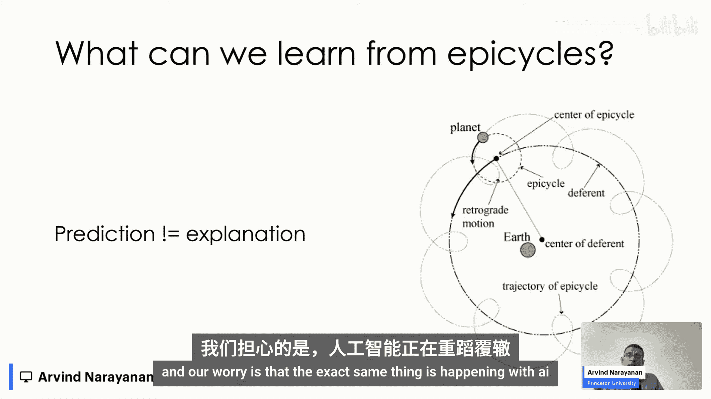

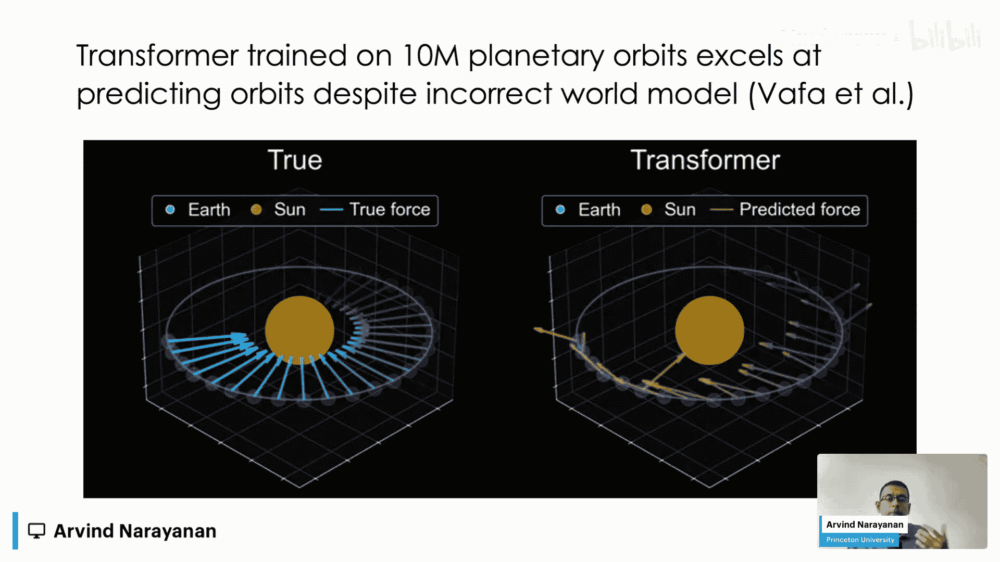

尽管AI在新闻头条中看似已解决，但实际上仍存在许多严重问题。以下是三个最突出的挑战：

1.  **幻觉导致的错误**：当前模型会生成看似合理但实际错误或虚构的内容。更复杂的是，这些模型是“黑箱”，我们无法直接理解或修复这些错误，只能通过间接方式调整。
2.  **缺乏真正的推理能力**：当问题变得足够复杂，或者遇到从未见过的新情况时，仅靠模式识别是不够的。当前的“推理模型”实际上仍依赖于过去的模式匹配。
3.  **高昂的成本**：这包括数据成本和计算成本。要构建一个通用的预测器，通常需要一个非参数模型，其规模会随着数据量的增长而增长，这导致了固有的高计算成本。

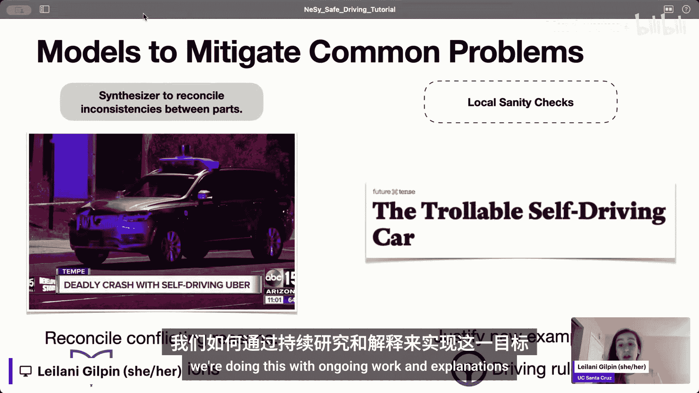

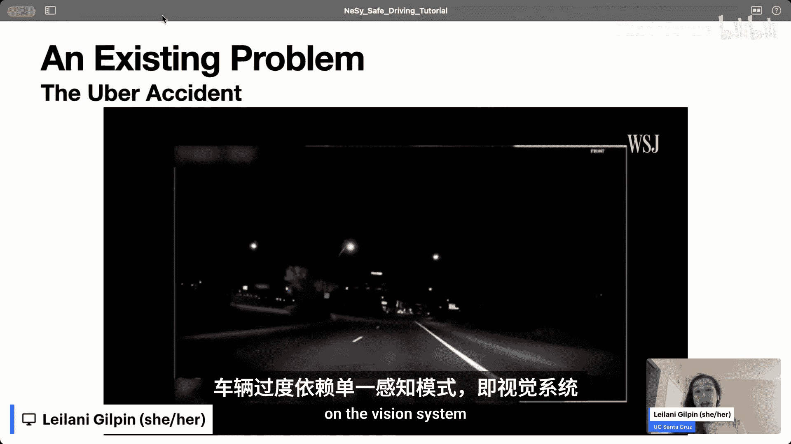

这些问题并非暂时的，而是AI领域深层次的根本性问题。

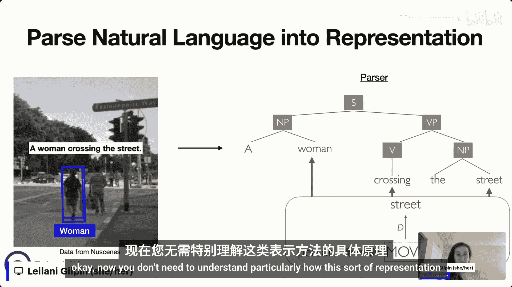

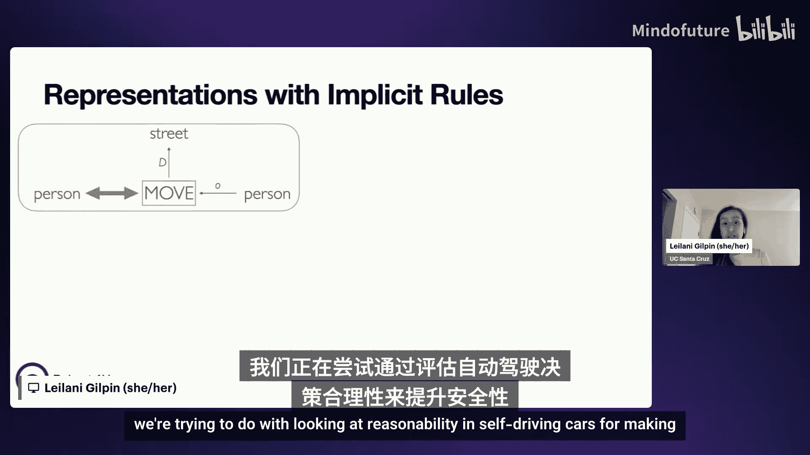

## 符号AI的动机

那么，这些问题的根源是什么？幻觉与底层概念的模糊性有关。要修复错误，这些概念必须对修复者清晰可理解。人类倾向于使用语言、数学等符号来相互理解。因此，一个能被我们理解的模型，在某种程度上必须是符号化的。

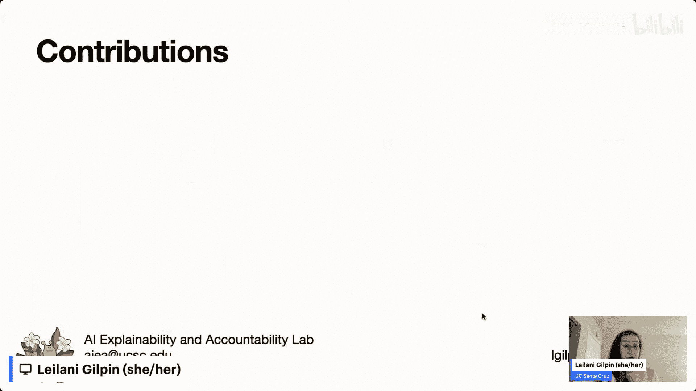

一个有趣且重要的结果是：**在现有类型的模型下，幻觉在数学上被证明是无法完全消除的**。我们将在本次夏季学校中展示这一点。

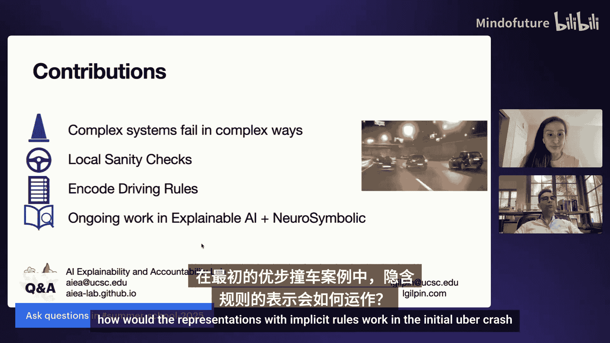

## 历史视角与神经符号AI的定义

回顾AI历史，可以看到多种范式的兴衰。知识表示与推理（KRR）和机器学习（ML）是两大主要范式，各自内部也有多个子范式。没有任何范式真正消亡，它们常常会以新的形式回归。

基于此，我们可以给出神经符号AI的一个粗略定义：**神经符号AI ≈ 机器学习 + 符号化的KRR**。这里的“符号化KRR”指的是经典的、人类可解释的符号AI。

这种结合的动机在于，符号AI和统计AI（ML）的优势和劣势是高度互补的。一方的弱点正是另一方的强项。当前，由于人们高度关注ML的弱点（如缺乏抽象世界知识、严谨推理等），我们自然回想起KRR的标志性优势。

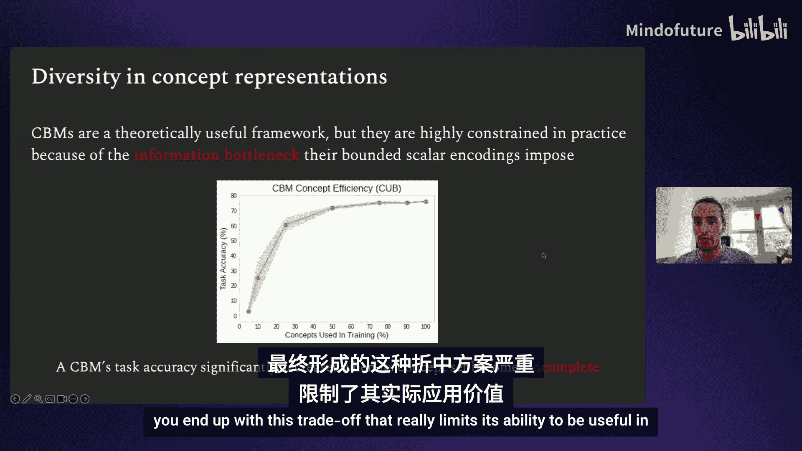

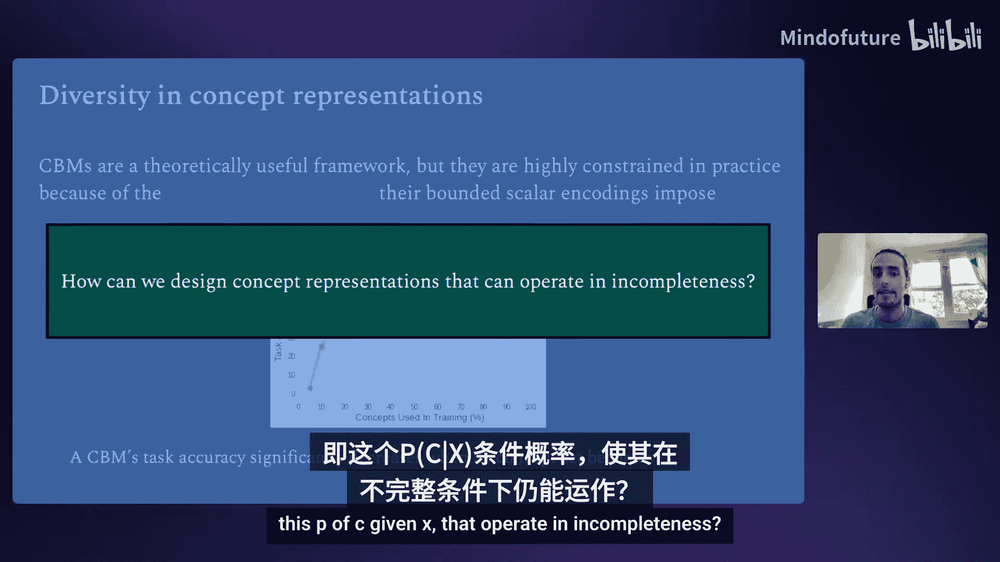

## 神经符号AI的发展与前景

自2000年左右以来，许多有识之士就开始思考神经符号AI（或类似概念）。Gartner在其著名的技术成熟度曲线中，将神经符号AI置于“期望膨胀峰值”之后，距离主流应用尚有约10年，这意味着我们仍有充足的时间进行扎实的研究。

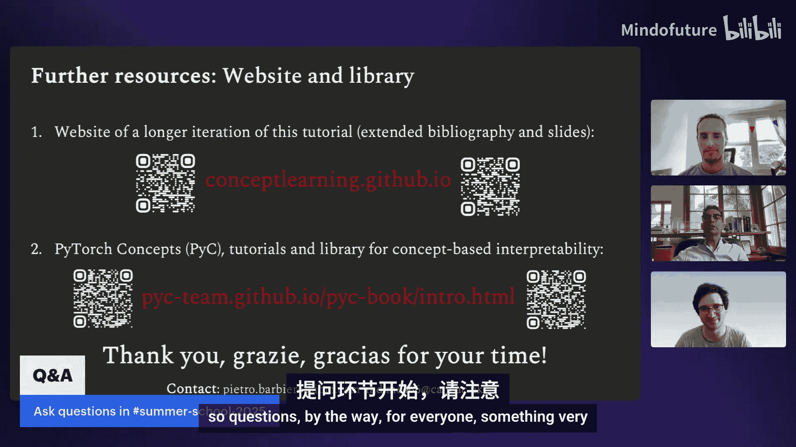

神经符号AI的思想也以不同名称出现在多个领域，例如统计关系学习、归纳逻辑编程、可解释AI等。即使在核心的神经网络研究（如ICLR、NeurIPS）中，也有许多相关探索。

因此，**如何将符号AI与机器学习结合起来，同时保留两者的最佳特性，是当前AI研究的前沿**。这个“结合”的具体方式尚不明确，存在多种探索路径。本次夏季学校旨在展示这些主要的研究方向。

## 为什么神经符号AI值得关注？

*   **对于研究人员**：许多人认为，神经符号AI是解决上述AI关键开放问题的可能路径，甚至是通向通用人工智能（AGI）的途径。AGI的“通用性”可以从“泛化”能力开始形式化地讨论。
*   **对于学生**：你们将开发下一代AI技术。许多人认为，未来的发展方向就在神经符号AI这个相对空白的领域。这里有大量工作尚未完成。
*   **对于数据科学家和AI开发者**：该领域已经开始出现一些有趣且实用的工具，它们在某些任务上表现优于现有的ML工具。

## 夏季学校的初衷与目标

我们创办夏季学校，是因为发现进入神经符号AI领域非常困难。这源于两大范式的并存。人们常常低估对方领域的复杂性。无论是逻辑推理还是神经网络，都包含大量深刻的原则和研究成果。

为了在这个领域做出深刻贡献，必须深入理解双方。我们的目标是提供一个速成课程，帮助大家入门，了解一些我们认为重要的部分，并邀请大家进行更深入的探索。

我们将内容分为教程和讲座。教程通常提供某个领域的广泛概述，而讲座则聚焦于具体的研究成果。同时，我们努力从众多来源中精选内容，呈现不同的哲学观点和方法。

我们的最终目标是**加速神经符号AI的进展**，因为我们的假设是，这将带来更智能、更安全的AI，甚至可能实现AGI这一AI领域的终极目标。

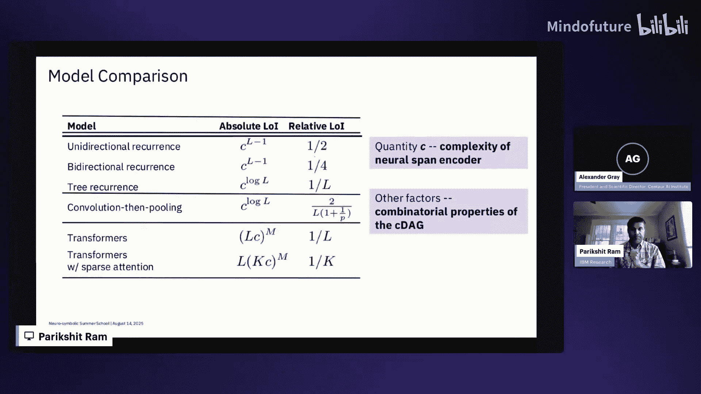

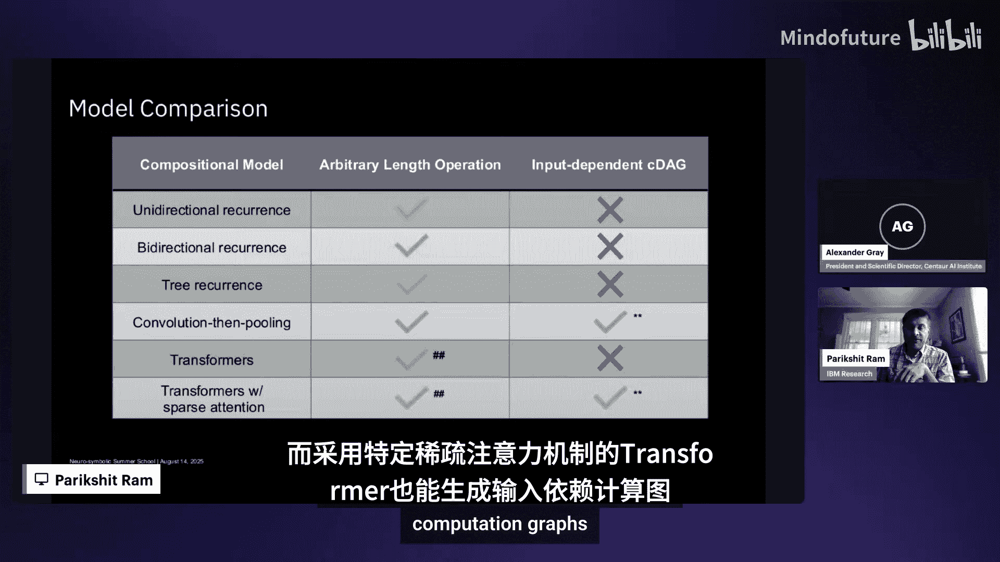

## 课程内容导览

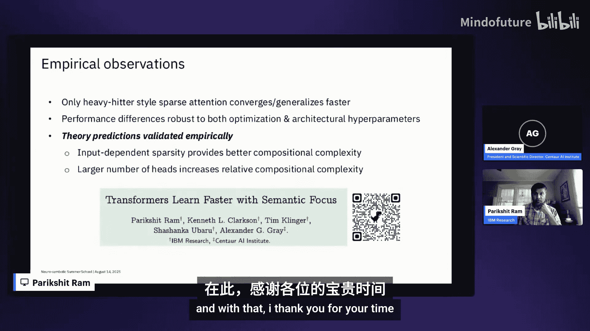

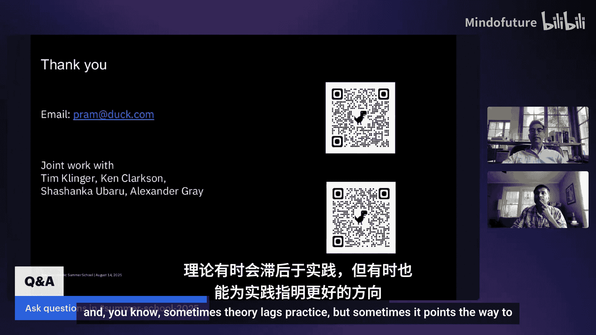

本次夏季学校的课程涵盖了多个技术主题，以下是部分亮点：

*   **高层概述**：紧随本概述之后，Arvind的演讲将从宏观角度探讨AI进展的速度。
*   **专题讨论**：我们有一个非常激动人心的专题讨论小组，包括2024年图灵奖得主Rich Sutton等杰出人物，将共同探讨AI的未来。
*   **工具与应用**：周五上午将介绍相关工具。
*   **核心主题**：本次活动的主题是数学、推理和规划，神经符号AI正在这些领域产生重要影响。同时，我们也触及了可解释性、分布外泛化等所有关键问题。
*   **组合性**：组合性在我看来是分布外泛化的关键，即能够对远离训练数据的新情况做出良好预测。
*   **符号的本质**：Payam的演讲将探讨符号的深层本质和范畴论。范畴论的思想可能是AI未来的重要组成部分。
*   **幻觉与效率**：Felix将展示关于效率的卓越成果。
*   **推理**：推理主题贯穿多个讲座。

我们提供结业证书，感兴趣的同学可以关注相关信息。

## 关于半人马AI研究所

我们是一个非营利组织，使命是通过神经符号AI实现更智能、更安全的AI。我们专注于研究和教育。

参与方式包括：
1.  **研究与实习**：欢迎加入我们进行研究，特别是博士生，我们提供正式的夏季实习项目。
2.  **学术合作**：我们与学术界有多个合作项目。
3.  **教育活动**：我们正在与合作伙伴大学共同开发正式的学分课程，以及举办类似本次夏季学校的活动。
4.  **社区**：我们的社区在Discord上，欢迎大家加入。
5.  **开源软件**：我们正在开发和维护一些非常有用的开源软件。
6.  **创业支持**：作为非营利组织，我们也有其他方式与初创公司合作，以推动神经符号AI产生商业影响。
7.  **企业合作**：我们正在组建一个产业联盟，旨在将神经符号AI的理念引入不同行业。

更多信息，包括科学顾问委员会和神经符号AI活动日历，将陆续在网站上更新。

## 总结

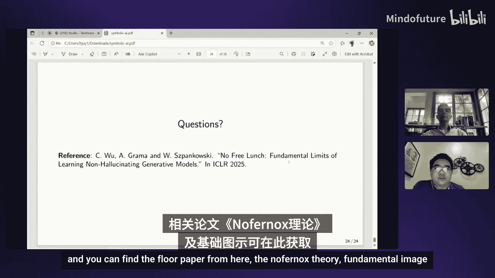

本节课中，我们一起学习了神经符号AI夏季学校的整体框架和核心动机。我们探讨了当前AI在幻觉、推理和成本方面面临的深刻挑战，并理解了为什么结合符号AI的可解释性、推理能力和机器学习的数据驱动、感知能力是如此有前景。我们还了解了本次夏季学校的目标、课程结构以及参与神经符号AI生态系统的多种方式。希望这为大家后续深入的学习和讨论奠定了良好的基础。