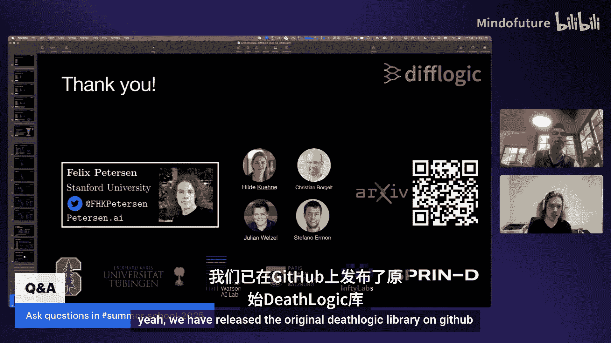
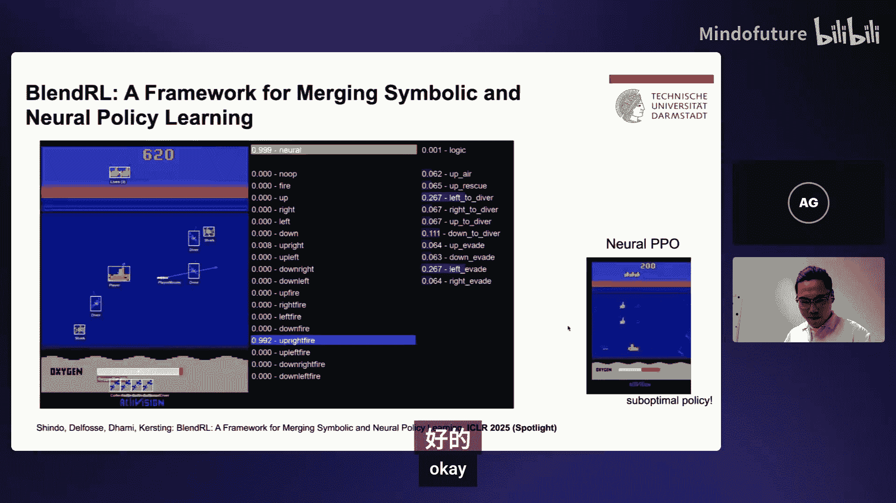
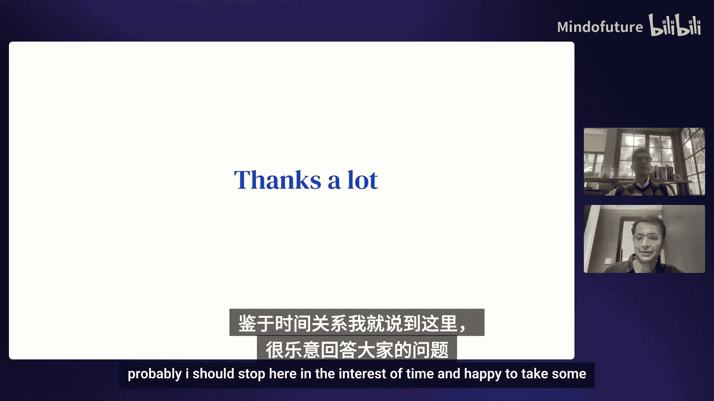
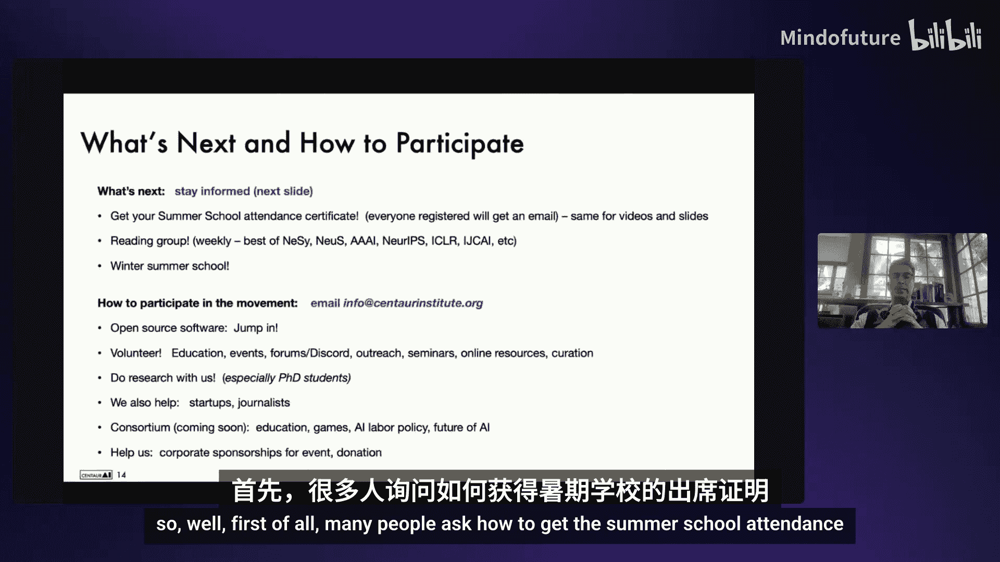
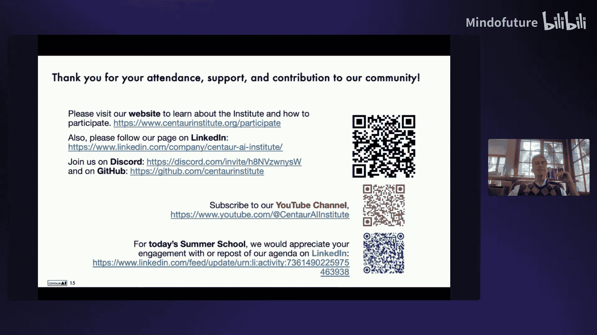

# 002：课程内容

在本节课中，我们将学习神经符号AI的最新进展，包括从低层次演示中自动学习神经谓词、构建可解释且高性能的神经网络、确保数据科学结果的真实性、设计高效的逻辑门网络、构建能推理和行动的神经符号智能体、开发用于医疗决策的人机协作模型、生成受语法和语义约束的结构化输出、实现自动定理证明，以及利用AI进行数学研究和教育。

---

## 🧠 神经符号软件与双层次规划

上一节我们介绍了神经符号AI的广阔前景，本节中我们来看看如何从低层次演示中自动学习用于规划的神经谓词。

### 概述
我们的目标是让机器人能够执行需要高层次推理的任务，例如利用平台将高处的物体运送到低处的容器中。为了实现零样本泛化，机器人需要从低层次的传感器数据（如图像、点云）中自动抽象出高层次的符号谓词（如“手是空的”、“目标可达”）。

### 核心方法：双层次学习系统
我们的系统通过三个步骤自动发明神经谓词：
1.  **双层次学习**：创建候选谓词。我们将状态空间视为连续的高维空间，并找出可能成为良好谓词分类器的区域。
2.  **规划目标选择**：使用规划目标从候选谓词中选择一个子集作为最终谓词集。
3.  **算子与采样器学习**：使用最终谓词集进行规划算子和运动采样器的学习。

### 关键洞察
为双层次规划发明谓词，等价于**寻找这些谓词在不同操作之间的高层次效果**。我们的双层次学习系统交替进行：
*   **神经学习**：训练神经分类器（谓词函数）。
*   **符号学习**：搜索谓词的效果向量，并用神经学习的损失来指导搜索。

### 技术示例
假设我们观察两个高层动作：“注视”和“抓取”。我们想学习一个谓词 `P2`。如果我们知道 `P2` 是这两个动作的“添加效果”，那么我们就可以为神经网络的输出（即 `P2` 在不同状态下的真值）提供监督信号。神经网络训练完成后，其验证损失会反馈给符号树搜索算法，以提出下一个可能的效果向量进行尝试。

### 实验与结果
我们在六个不同领域（如机器人攀爬、点云操作）评估了系统，在需要组合性规划的新任务上实现了很高的平均准确率，显著优于其他神经基线方法。

### 当前局限与未来方向
*   **学习效率**：目前的交替训练和树搜索计算成本较高。未来可以探索并行化训练或引入大语言模型加速搜索。
*   **仅从演示中学习**：系统性能受限于演示数据的质量。未来希望结合强化学习，使智能体能通过探索发现更优的抽象。
*   **技能发现**：目前高层动作（技能）是预先定义的。未来可以探索如何同时发现技能和状态抽象。

**总结**：本节课我们一起学习了如何通过双层次学习系统，从低层次演示中自动发明神经谓词，从而实现机器人任务的长视野、零样本泛化。关键在于将谓词发明问题转化为寻找其跨操作的效果向量问题。

---

## 📊 神经推理网络：保持预测准确性的可解释性

上一节我们探讨了如何让机器理解世界，本节中我们来看看如何让人理解机器做出的决策。

### 概述
神经推理网络是一种可解释的AI模型，它在保持与先进模型（如随机森林、梯度提升树）相媲美的预测准确性的同时，提供了人类可读的逻辑结构和文本解释。

### NRN的核心特性
1.  **基于逻辑**：网络中的每个节点都具有逻辑含义（如合取、析取、否定），使用修改后的加权卢卡斯维奇逻辑激活函数实现。
2.  **人类可见**：可以像查看机械手表内部一样，查看网络的神经元和连接，甚至可以根据领域知识进行修改。
3.  **自动生成文本解释**：通过递归遍历训练好的网络，可以生成针对单个样本的、易于理解的解释（例如：“房屋价格高，因为所有以下条件成立：房间数量>3，房龄新，中等收入高...”）。
4.  **特征重要性**：通过聚合网络边的权重，可以得到特征级别的重要性排序。

### 训练方法
NRN的训练类似于传统神经网络，但具有特殊结构：
*   **架构**：使用交替的合取层和析取层，但并非全连接，以避免学习困难。
*   **训练算法**：结合梯度下降和多臂老虎机策略。当损失停滞时，系统会剪枝不重要的连接，并通过老虎机策略采样新的、更有用的谓词来重新生长网络。
*   **高效实现**：基于PyTorch，支持GPU加速和分布式训练，因此训练速度远快于其他可解释的神经表格模型。

### 在因果推断中的应用扩展
我们将NRN模块扩展到因果推断领域，构建了 `TAR-NRN` 和 `DR-NRN` 模型，用于估计处理效应。这些模型不仅提供了精确的估计，还输出了可追溯的逻辑解释，说明了为何对某个单元推荐特定的处理方式。

### 性能与优势
在多个表格分类数据集上，NRN在预测准确性上与传统先进模型相当，同时：
*   生成的解释更紧凑（更易于理解）。
*   特征重要性指标与真实性能下降的相关性更高。
*   模型参数数量少几个数量级，更高效。

### 未来方向
*   扩展到非结构化数据（如图像），需结合其他网络提取可解释的特征。
*   融入先验领域知识。
*   探索从模糊逻辑到概率逻辑的扩展，以更好地建模不确定性。

**总结**：本节课我们一起学习了神经推理网络，它通过将逻辑结构融入神经网络，实现了预测准确性与模型可解释性的兼得，为需要可靠解释的高风险领域（如医疗、金融）提供了有力工具。

---

## ⚖️ 真实性数据科学：追求真理与可信度

上一节我们关注了模型的可解释性，本节中我们从更宏观的视角，探讨如何确保数据科学和AI结果的真实性与可信度。

### 概述
真实性数据科学是一个概念框架，旨在通过**可预测性、可计算性和稳定性**三个核心原则，负责任、可复现地进行数据科学实践，追求真实的结果并对数据科学生命周期保持诚实。

### 为何需要真实性数据科学？
许多科学领域面临“可重复性危机”，不同团队对相同数据和假设的分析可能得出截然不同的结论。不确定性不仅来自经典的统计抽样变异，还来自：
*   **数据清洗选择**
*   **建模选择**
*   **数据可视化探索**

这些“人类判断调用”引入了未被充分考虑的变异，影响了结果的可靠性。

### PCS框架
1.  **可预测性**：来自机器学习的模型检查或“现实检验”。确保模型预测与实际情况相符。
2.  **可计算性**：通过数据驱动的模拟（如数字孪生、合成数据）来扩展分析的可能性，但需遵循同样的真实性原则。
3.  **稳定性**：核心原则。要求结果在面对合理的扰动（由上下文决定并需文档记录）时保持稳定。这是可解释性的前提。

### 案例研究
1.  **寻找心肌病遗传驱动因子**：
    *   **挑战**：复杂人类疾病，信噪比极低。
    *   **方法**：使用UK Biobank数据，将连续表型二值化以评估信号。通过稳定的随机森林方法筛选基因和基因交互作用。
    *   **结果**：与实验科学家合作，通过实验验证了多个候选基因和交互作用，成果发表在《自然·心血管研究》。
2.  **改进前列腺癌检测**：
    *   **挑战**：现有模型使用17个基因，成本较高。
    *   **方法**：应用PCS框架，考虑不同的数据清洗方式和多种模型。通过模型检查筛选出表现好且可解释的模型，聚合它们的特征排序。
    *   **结果**：仅用7个核心基因达到了与17个基因模型相当的预测性能，潜在降低了55%的检测成本。

### 不确定性量化
可信的AI需要可信的不确定性量化。我们扩展了PCS思想，通过考虑数据清洗和模型选择等不确定性来源，构建一个“伪数据集”集合，进而计算覆盖概率更优的预测区间。在回归和多分类任务上，该方法在保持期望覆盖率的同时，得到了比现有方法更窄的区间。

**总结**：本节课我们一起学习了真实性数据科学框架，它强调通过可预测性、可计算性和稳定性原则，系统性地管理和评估数据科学生命周期中的不确定性，这是获得可靠、可解释、可信任的AI系统的基石。

---

## ⚡ 可微分逻辑门网络：迈向硬件基础模型

上一节我们讨论了软件层面的可信AI，本节中我们转向硬件，看看如何设计极度高效且可解释的AI计算模型。

### 概述
逻辑门网络是直接的逻辑电路设计。通过从逻辑网络而非神经网络的视角审视机器学习，我们可以摆脱神经网络的归纳偏置，在相同的硬件资源下实现更高的效率，为FPGA和ASIC上的超低延迟推理开辟道路。

### 可微分逻辑门网络
1.  **定义**：由与门、或门、非门等逻辑门组成的网络，用于执行分类等任务。
2.  **核心挑战**：优化逻辑门的选择是一个组合爆炸问题。
3.  **解决方案**：引入双重松弛，使逻辑网络可微分：
    *   **实值逻辑松弛**：用连续运算（如 `a * b` 代替逻辑与）替代布尔逻辑，允许梯度传播。
    *   **操作选择松弛**：为每个节点创建一个逻辑门操作的概率分布，通过加权求和得到期望输出，并优化该分布。

### 架构与训练
*   **卷积扩展**：将卷积的局部连接和权重共享思想引入，创建“逻辑门树”作为可共享的卷积核。
*   **残差初始化**：将所有可学习门初始化为“导线”（直接传递输入），有效解决了深度训练中的梯度消失和信息丢失问题。
*   **训练**：使用梯度下降优化逻辑门的选择概率。训练完成后，概率会收敛到具体的门，离散化时几乎没有精度损失。

### 惊人结果
*   **粒子物理**：在大型强子对撞机数据触发任务中，用83个查找表实现了现有方案需要38，000个查找表才能达到的精度，延迟低于1纳秒。
*   **图像分类**：
    *   **MNIST**：用14.7万个门在4纳秒内达到99.23%准确率，比之前最好的FPGA方案快160倍。
    *   **CIFAR-10**：用127万个门在24纳秒内达到80.1%准确率，比之前最快方案快1900倍。
*   **强化学习**：通过师生学习，可将解决经典控制任务的策略简化为仅由几十个逻辑门组成的可解释规则，有时甚至能获得比教师网络更高的奖励。
*   **能效**：相比现代GPU推理，预计能效提升可达6-7个数量级。

### 局限与未来
主要挑战是训练成本，因为当前GPU专为矩阵乘法优化。未来的硬件若为逻辑架构优化，将能进一步释放其潜力。

**总结**：本节课我们一起学习了可微分逻辑门网络，它通过将AI计算直接映射到硬件友好的逻辑电路，实现了前所未有的推理效率和能效，同时模型本身极度紧凑且可解释，为边缘计算和高性能嵌入AI提供了革命性的工具。

---

## 🤖 神经符号智能体：在复杂世界中忠实推理、行动与学习

上一节我们看到了高效的底层计算模型，本节我们上升层次，探讨如何构建能像人一样进行高层次推理并与环境交互的智能体。

### 概述
我们旨在构建具备三种能力的神经符号智能体：
1.  **忠实推理**：能从噪声观察（如图像）中进行可靠的逻辑推理。
2.  **有效行动**：能在复杂环境中通过交互学习如何行动。
3.  **高效学习**：能像人一样从少量数据中学习。

### 组件一：可微分推理
我们开发了可微分的前向推理函数，能够处理一阶逻辑规则和带有置信度的事实。该函数使用GPU友好的张量操作实现，允许梯度在整个推理管道中传播，从而支持从原始感知到规则权重的端到端学习。

### 组件二：视觉应用——复杂提示的图像分割
*   **任务**：根据抽象复杂的文本提示（如“在船上且拿着伞的物体”）进行图像分割。
*   **方法**：`DASON` 系统。
    1.  视觉输入通过场景图生成器转换为结构化的符号事实（如“人-在船上-船”）。
    2.  文本提示通过大语言模型转化为一阶逻辑规则。
    3.  使用嵌入模型对齐视觉和文本的术语。
    4.  可微分推理器在符号层面进行推理，得出目标物体。
    5.  调用分割模型对目标区域进行分割。
*   **结果**：在复杂的TacticVGD数据集上，该方法显著优于纯数据驱动的分割模型，并能通过奖励信号学习改进场景图生成质量。

### 组件三：行动应用——混合策略强化学习
*   **洞察**：人类行为包含慢思考（逻辑规划）和快思考（直觉反应）。我们将其建模为混合策略。
*   **方法**：`Blend` 智能体。
    *   **神经策略**：处理像素输入，擅长快速反应（如躲避敌人）。
    *   **符号策略**：处理物体中心表示，擅长高层次规划（如路径查找）。
    *   **混合模块**：一个元策略，根据当前状态（如是否有危险）动态决定两种策略的混合权重。该模块本身也可用符号规则表示和训练。
*   **结果**：在《袋鼠》、《海战》等Atari游戏中，Blend智能体成功融合了两种策略的优势，在稀疏奖励下也能完成复杂目标，而纯神经智能体则容易陷入局部最优。

### 未来方向
*   **集成规划**：在框架中引入前瞻性规划模块。
*   **联合学习**：让感知、推理、决策模块更和谐地共同学习。

**总结**：本节课我们一起学习了如何构建神经符号智能体，它通过可微分推理桥接感知与符号世界，并通过混合策略整合逻辑规划与神经反应，从而在需要高层次推理和高效学习的复杂任务中展现出更接近人类的智能行为。

---

## 🏥 人机协作AI：医疗决策中的增效模型

上一节我们探讨了自主智能体，本节我们关注另一种关键模式：如何让AI与人类专家协作，在医疗等高风险领域做出更好决策。

### 概述
尽管医疗AI工具层出不穷，但其在实际临床实践中的影响力有限，主要面临三大障碍：
1.  **算法厌恶**：医生不信任算法的建议。
2.  **人类厌恶**：算法的建议与医生的直觉不符。
3.  **因果厌恶**：大多数AI基于关联而非因果推理，而医疗决策需要因果理解。

### 解决方案一：人机协作模型
*   **理念**：结合算法力量与人类直觉，形成比两者单独更强大的协同体。
*   **方法**：首先学习医生的决策直觉模型，将其与机器学习模型融合。这样产生的建议更接近医生直觉，减少了前两种障碍。
*   **结果**：在多个临床任务中，人机协作模型的性能优于最好的纯人类专家和最好的纯AI算法。

### 解决方案二：因果推理AI
*   **挑战**：医疗决策需要干预层或反事实层的推理，且常面临模糊性（未知的概率分布），而非风险（已知分布）。
*   **方法**：开发基于强化学习的算法，能够利用观察性数据和医生偏好，在模糊性下进行因果推理，生成个性化的动态治疗策略。
*   **结果**：在梅奥诊所的器官移植后免疫抑制治疗应用中，该算法提供了优异的治疗策略，带来了患者结果的因果性改善，并允许“双向个性化”（针对患者和医生态度）。

### 未来愿景：因果大语言模型
我们正致力于开发能进行因果推理的LLM。它能够：
*   阅读多模态患者数据。
*   提供高度个性化的动态治疗建议。
*   给出解释。
*   与医生进行对话，回答“为什么”的问题。
通过在大规模因果推理算法上微调LLM，我们有望实现这一目标。

**总结**：本节课我们一起学习了如何通过人机协作模型和因果推理AI来克服医疗AI应用的障碍。中心思想是，通过融合人类直觉和因果理解，我们可以构建出医生更愿意采纳、且能带来真实临床效益的AI辅助系统。

---

## 🧩 语义控制解码：生成语法与语义正确的结构化输出

上一节我们关注了AI与人的协作，本节我们回到AI内部，探讨如何让大语言模型可靠地生成符合复杂约束的结构化输出（如JSON、代码）。

### 概述
当前LLM生成结构化输出（用于工具调用、代码生成等）的主流方法（提示工程、后处理）存在局限性，无法保证输出的语法有效性或语义正确性。我们提出一种方法，在解码过程中同时强制执行语法和语义约束。

### 背景：形式语言
*   **正则语言**：可用有限状态自动机表示，易于控制（如数字格式），现有工具已支持。
*   **上下文无关语言**：描述大多数编程语言的基本语法，能处理嵌套结构（如JSON），但无法处理上下文相关关系（如类型检查）。
*   **上下文相关语言**：能表达语义约束（如类型一致性、变量作用域）。

### 核心方法：答案集语法与语义控制解码
1.  **答案集语法**：扩展答案集编程，将上下文无关语法与ASP规则结合。一个字符串有效，当且仅当它能由底层CFG派生，且从其派生树构建的ASP程序可满足。
2.  **语义控制解码**：
    *   将生成过程建模为受约束的马尔可夫决策过程。
    *   使用ASG定义有效动作（下一个token）集合和奖励函数。
    *   采用蒙特卡洛树搜索进行探索，但将选择和扩展限制在ASG允许的范围内，从而大幅减少搜索分支。

### 结果
*   **强保证**：即使使用较小的开源模型（如1B参数），只要模型具备基本表达能力，我们的方法也能**保证**输出在语法和语义上均有效。
*   **高效**：相比从大规模LLM中采样再验证的方法，我们的方法消耗的token数量少几个数量级。
*   **任务**：在合成语法、组合推理（数独）、规划（积木世界）等任务上验证有效。

### 扩展：自动学习约束
在后续工作中，我们通过探索-利用和归纳逻辑编程，自动从数据中学习上下文相关的约束规则，减少了手动编写ASG的需求。

**总结**：本节课我们一起学习了语义控制解码方法，它利用答案集文法这一神经符号融合框架，在LLM解码时同步施加语法和语义约束，从而**保证**输出的结构正确性和逻辑正确性，为构建可靠的结构化输出生成系统提供了新途径。

---

## 🧮 GoProver：开源自动定理证明的新高度

上一节我们讨论了生成正确代码，本节我们进入更严谨的领域：如何让AI进行数学定理证明。

### 概述
数学证明是检验AI复杂推理和规划能力的重要标尺。我们推出了GoProver，在自动定理证明基准上达到了开源模型中的最先进水平。

### 背景：为什么是Lean？
Lean是一种交互式定理证明器，允许用户编写可被机器验证的证明代码。数学家们正积极使用Lean来形式化数学，以确保证明的绝对正确性。这使得Lean成为评估AI数学推理能力的理想平台。

### GoProver的性能
*   **MiniF2F基准**：包含从小学数学到国际数学奥林匹克竞赛难度的题目。我们的8B参数模型在32次尝试的通过率上，超过了DeepSeek的600B参数模型。我们32B的旗舰模型通过率超过90%。
*   **IMO级问题**：在360个IMO难度问题上解决了73个。
*   **大学生数学竞赛**：在657个普特南竞赛问题上，通过184次尝试解决了86个。

### 核心方法
1.  **自我修订**：让证明器能够接收Lean的错误信息，并据此修订自己的证明代码。我们允许进行两轮修订。
2.  **支架式数据合成**：为了解决高质量训练数据稀缺的问题，我们根据当前证明器能力，动态生成难度适中的合成问题（对难题进行简化，对易题进行扰动）。
3.  **专家迭代与强化学习**：
    *   **专家迭代**：用当前模型在数据上生成证明，收集成功的证明来微调模型本身，迭代进行。
    *   **强化学习**：使用GRPO算法，基于证明是否验证成功来提供奖励。
4.  **模型平均**：为了防止强化学习过程中模型多样性丢失，我们将RL训练后的模型与基础模型进行权重平均，找到了准确率与多样性之间的更好平衡点。

### 开源
我们开源了所有模型、代码、数据以及一个形式化器模型，社区可自由使用。

**总结**：本节课我们一起学习了GoProver，它通过自我修订、智能数据合成和先进的训练算法，在自动定理证明上取得了突破性进展。这标志着开源社区在AI数学推理领域达到了新的高度。

---

## 🔬 AI驱动的数学研究与教育

上一节我们看到了AI在形式化证明上的能力，本节我们更广泛地探讨AI如何助力数学前沿研究本身，以及它在教育领域的应用与挑战。

### 第一部分：AI辅助数学研究——以图论猜想为例
*   **目标**：寻找数学猜想的反例。这通常是一个大海捞针式的搜索问题。
*   **问题**：埃尔德什极值图论猜想——在不包含三角形和四边形的n个顶点的图中，最大边数是多少？猜想认为，当n趋于无穷时，最大边数趋近于 `n√(1/(2√2))`。
*   **方法**：
    1.  **强化学习**：将图生成建模为序列决策过程（动作：翻转任意边）。使用AlphaZero，通过策略网络和价值网络指导搜索，最大化一个结合了边数、三角形数、四边形数的奖励函数。
    2.  **禁忌搜索**：一种经典的局部搜索算法，我们对其进行了改进。
    3.  **关键创新：增量课程搜索**：我们发现，较小规模图的最优解与较大规模图的最优解结构相似。因此，我们构建了一个包含不同规模图的数据库，训练时从接近目标规模的图中采样作为起点，形成了有效的课程学习。
*   **结果**：AlphaZero和改良的禁忌搜索都显著改进了多个图规模下的已知下界，但未能彻底证伪猜想。研究表明，**增量课程的思想比选择特定搜索算法更为关键**。

### 第二部分：AI数学辅导——超越解题
*   **挑战**：当前的数学AI大多只擅长解题，但辅导涉及更多：
    *   识别学生解答中的错误。
    *   理解错误背后的根本原因（误解）。
    *   提供多种解法。
    *   进行多轮、引导式的苏格拉底对话。
*   **评估**：我们构建了自动化评估、人类专家评估和纵向研究相结合的综合评估体系。
*   **发现**：即使是最先进的LLM，在“学生给出错误答案”的场景下，其判断准确率也会远低于“学生给出正确答案”的场景。模型容易变得“唯唯诺诺”或无法进行深度的教学交互。
*   **进展与未来**：通过针对性的数据微调和模型改进，Gemini等模型在辅导任务上已有提升。但真正的挑战在于实现**多轮优化**和**心智理论**，让AI能像人类导师一样规划教学对话，引导学生自我发现矛盾。

**总结**：本节课我们一起探讨了AI在数学研究和教育两个层面的应用。在研究方面，AI可以通过智能搜索辅助数学家探索反例和优化界；在教育方面，AI辅导是一个比单纯解题复杂得多的任务，需要模型具备深度的交互、理解和教学规划能力，这仍是当前AI面临的重大挑战。

---

## 🎤 专家小组讨论：AI的未来——学习、知识与推理

在本节课的最后，我们与三位AI领域的先驱进行了一场关于未来方向的讨论。

### 讨论要点
1.  **符号与向量**：
    *   **Leo**：在数学、程序验证等可形式化的领域，符号表示和机器验证具有不可替代的价值，能提供绝对的正确性保证。
    *   **Rich**：符号在形式化领域很强，但对于日常经验性知识，我们需要新的、不一定非得是符号化的表示方式。关键在于要能**分别表示问题与答案**，而不仅仅是答案。
    *   **Artur**：神经符号AI的关键在于**表示转换**——从网络中提取符号化描述，以及将符号知识注入网络。这能带来可解释性、组合性，并可能处理无限域。

2.  **学习与知识**：
    *   **Rich**：强调**终身学习**是智能的核心。当前很多AI系统是“凝固的知识”，而非持续学习的主体。智能体需要能在工作中学习新情况。
    *   **Artur**：神经符号循环（学习一点，推理一点，再学习一点）是缩小网络规模、提高能效和可靠性的有希望路径，而非一味地扩大模型。

3.  **推理的未来**：
    *   **Rich**：对基于**语言链式思维**的推理方式持怀疑态度。认为需要更扎实的、有理论基础的推理机制（无论是符号逻辑还是其他形式）。
    *   **Artur**：链式思维缺乏自我纠正能力，且难以设计。通过调整网络架构和损失函数来嵌入逻辑语义，是更可靠的方向。

4.  **对学生的建议**：
    *   **Leo**：做你热爱的事情，生命短暂，不要只追逐热门或金钱。
    *   **Rich**：不要追逐当前最流行或最赚钱的。可以关注两个根本问题：如何发现新的谓词/特征以高效学习非线性函数；如何基于从世界中学到的模型进行规划。
    *   **Artur**：投身于“学习一点，推理一点”的神经符号循环研究，这将带来与多领域专家交流的激动人心的机会。

### 未来展望
*   **Lean**：推动形式化数学的普及，让AI与人类协作，改变数学研究的方式。
*   **神经符号AI**：聚焦于通过架构和损失函数的设计来提供可靠性保证，而非依赖链式思维。
*   **强化学习**：未来光明，需更关注样本效率和新方法的探索。

**总结**：本节课我们一起聆听了AI先驱们关于未来发展的真知灼见。共识在于，我们需要超越当前大型语言模型的范式，探索融合学习与推理、兼顾形式化与经验性知识、并能持续适应新环境的更稳健的智能系统。神经符号AI被认为是实现这一目标的重要路径之一。

---

**总结**：在今天的课程中，我们一起深入探讨了神经符号AI在多个前沿方向上的突破性工作。从让机器从数据中自主发现抽象概念，到构建人可理解、性能强大的预测模型；从确保数据科学过程的严谨可信，到设计超高效、可解释的硬件计算模型；从构建能推理、规划和学习的智能体，到开发辅助人类专家决策的协作系统；从保证代码和结构化输出的正确性，到实现高水平的自动数学定理证明；最后，我们还探讨了AI在推动数学研究和革新教育方面的潜力与挑战。这些工作共同描绘了一幅神经符号AI如何通过融合学习与推理、连接符号与子符号，来构建更强大、更可靠、更可信的下一代人工智能系统的宏伟蓝图。