# 001：凸包算法 🧮

在本节课中，我们将要学习计算几何中的一个核心概念——凸包。我们将从定义和直观理解开始，逐步介绍几种计算凸包的算法，并分析它们的效率。

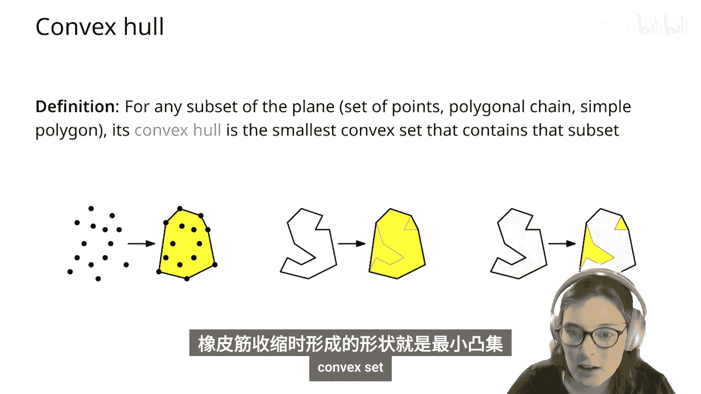

## 概述

凸包是包含给定点集的最小凸集。它在许多领域都有应用，例如生物学中用于估算动物栖息地的范围。在本教程中，我们将首先理解凸包的定义和性质，然后学习三种主要的凸包算法：朴素算法、Graham扫描算法和礼品包装算法，最后了解如何将它们结合以获得更优的性能。

## 凸包的定义与性质

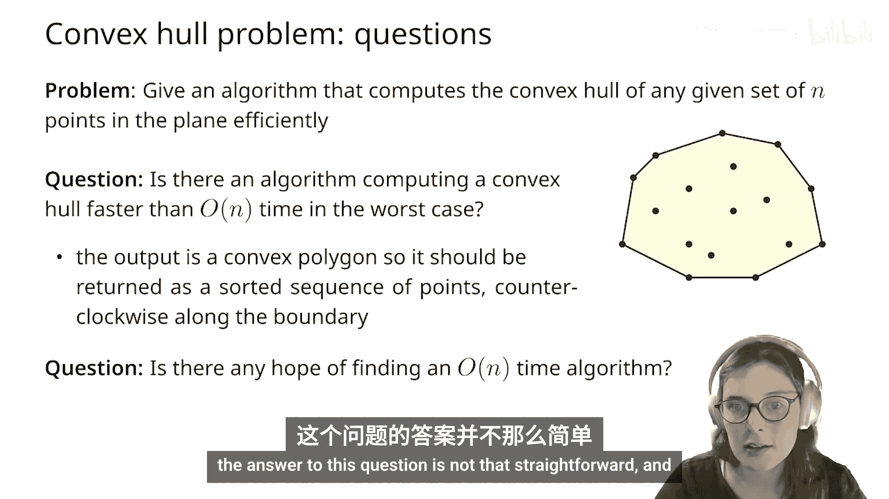

上一节我们概述了凸包的应用。本节中，我们来看看凸包的正式定义和一些关键性质。

我们说一个几何形状是**凸的**，如果对于其中的任意两点，连接这两点的线段完全位于该形状内部。

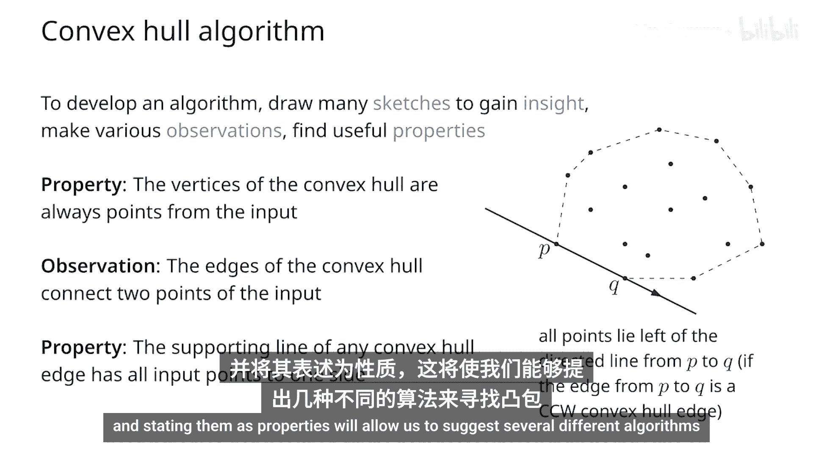

对于平面上的任何区域或点集，其**凸包**被定义为包含该子集的最小凸集。另一种直观的理解是：想象将点集中的点视为钉在木板上的钉子，然后用一个橡皮筋套住所有钉子并松开，橡皮筋收缩后形成的形状就是凸包。

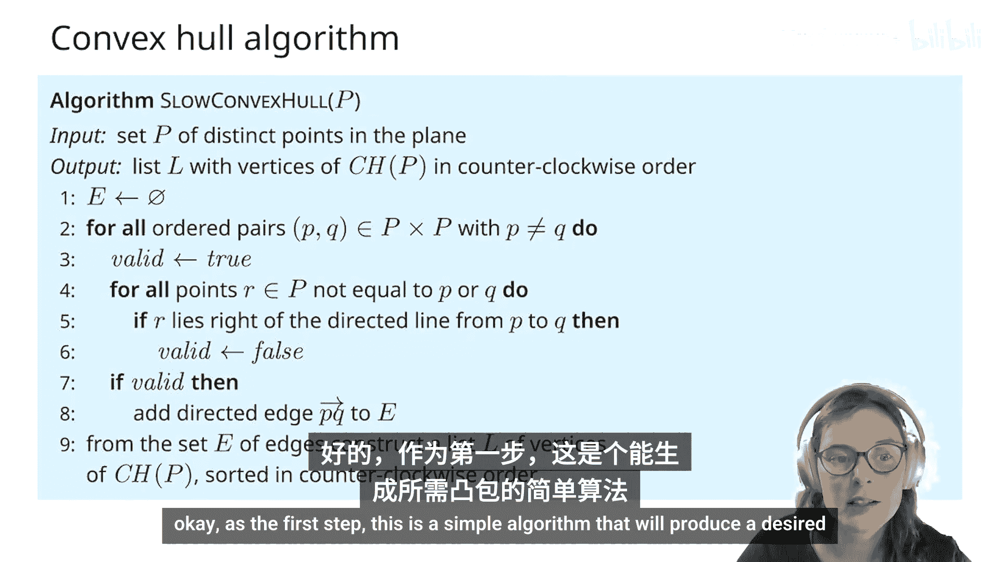

以下是凸包的一些基本性质：
*   凸包总是由点集的一个子集来描述。
*   凸包的边是连接凸包上两点的线段。
*   对于凸包上的任意一条边，其所在的直线（支撑线）会将所有输入点划分到同一侧。

## 朴素凸包算法

基于上一节的性质，我们可以设计一个直接的算法。本节中我们来看看如何利用“支撑线”性质来寻找凸包的所有边。

以下是该算法的思路：
1.  考虑所有有序点对 (P, Q)。
2.  检查由 P 指向 Q 的有向直线。
3.  如果所有其他点都严格位于该直线的右侧，则线段 PQ 是凸包的一条边。
4.  收集所有这样的边，最后按逆时针顺序排序输出。

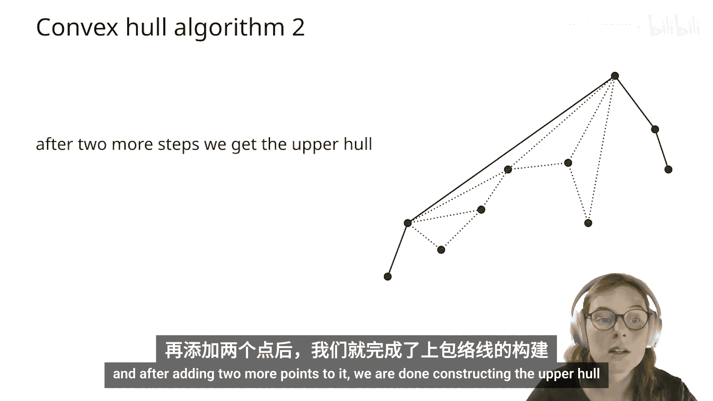

**思考题**：
1.  如果点 R 恰好位于直线 PQ 上，算法应如何处理？当前的处理正确吗？
2.  这个算法的运行时间是多少？
3.  这个算法对浮点数舍入误差是否鲁棒？

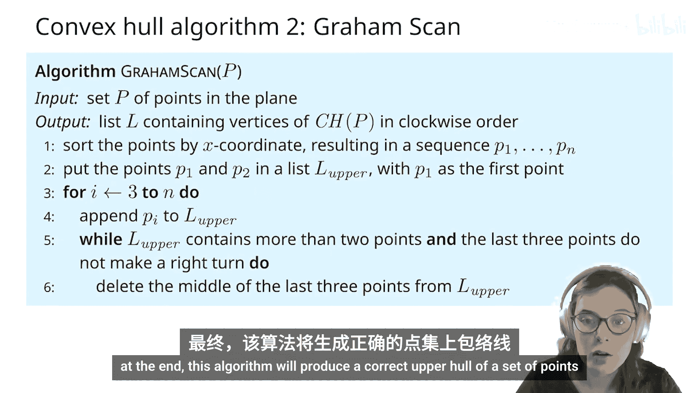

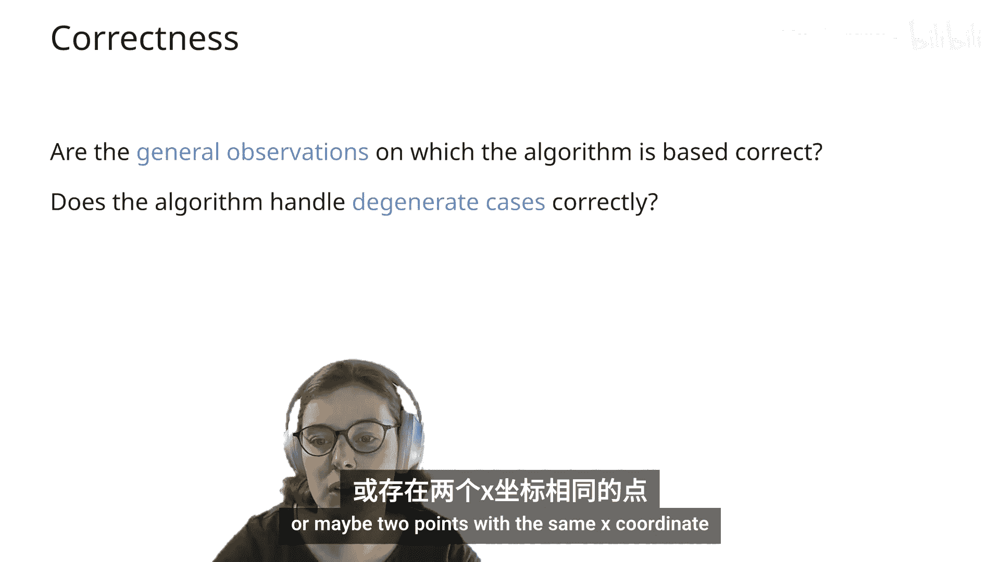

## Graham扫描算法

朴素算法效率较低。本节中我们介绍一种更高效的算法——Graham扫描算法。其核心思想是增量式地构建凸包，按 x 坐标从左到右插入点，并分别维护上凸包和下凸包。

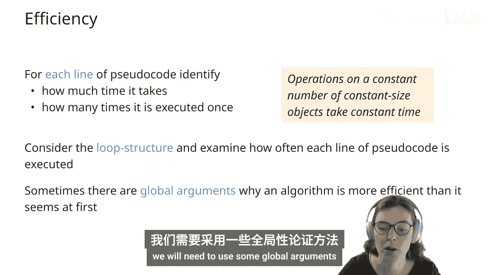

我们首先按 x 坐标对点进行排序。对于上凸包的构建，我们维护一个点链 `L_upper`，并确保链中任意连续三个点都构成一个右拐（即按逆时针方向旋转）。

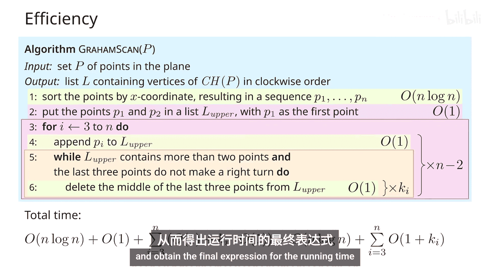

以下是构建上凸包的伪代码：
```
1.  Sort points by x-coordinate.
2.  Initialize L_upper with the first two points.
3.  for i = 3 to n do
4.      Append point p_i to L_upper.
5.      while the last three points in L_upper make a left turn do
6.          Remove the second-to-last point from L_upper.
```
构建下凸包 `L_lower` 的过程类似，只需按 x 坐标从右到左（或按 y 坐标处理）处理即可。最后，合并 `L_upper` 和 `L_lower`（注意去除重复的端点）即得到完整的凸包。

**算法正确性与退化情况**：
我们需要确保算法能正确处理退化情况，例如共线的点或多个点具有相同 x 坐标的情况。根据应用需求，我们可能需要调整算法以决定是否将边上的点包含在输出中。

**运行时间分析**：
*   第1行排序耗时 `O(n log n)`。
*   外层 for 循环执行 `O(n)` 次。
*   内层 while 循环看似每次可能执行多次，但关键在于**每个点最多被从链中移除一次**。因此，所有 while 循环中移除操作的总次数为 `O(n)`。
*   综上，Graham扫描算法的总运行时间为 `O(n log n)`。可以证明，在最坏情况下，这是最优的。

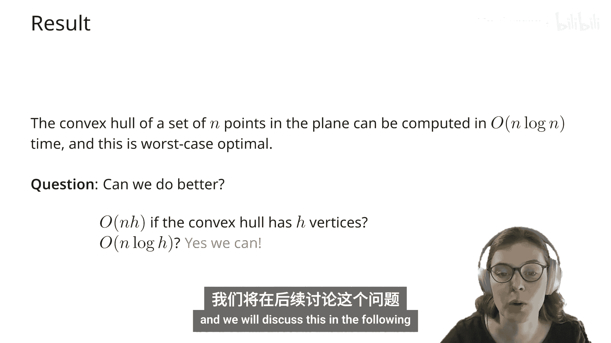

## 礼品包装算法（Jarvis March）

Graham扫描算法的运行时间是 `O(n log n)`。本节中我们介绍一种输出敏感的算法——礼品包装算法，其运行时间取决于凸包本身的顶点数 `h`，为 `O(n * h)`。当凸包顶点数很少时（即 `h << n`），此算法更快。

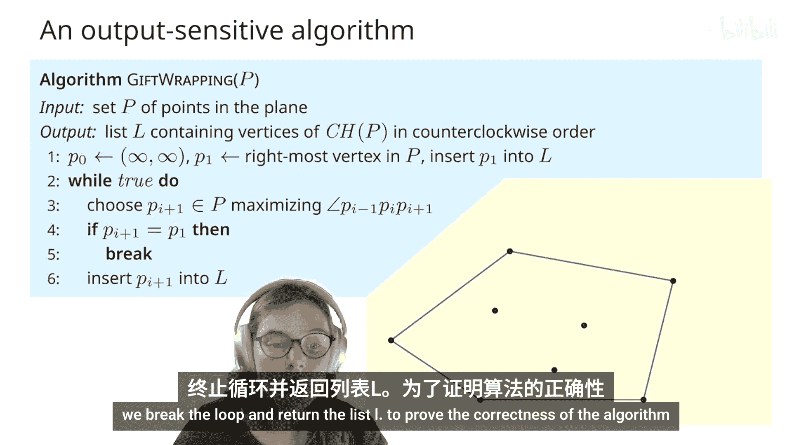

算法从一个必定在凸包上的点开始（例如最右边的点 `P1`），然后像“包裹礼品”一样，不断寻找下一个凸包顶点。

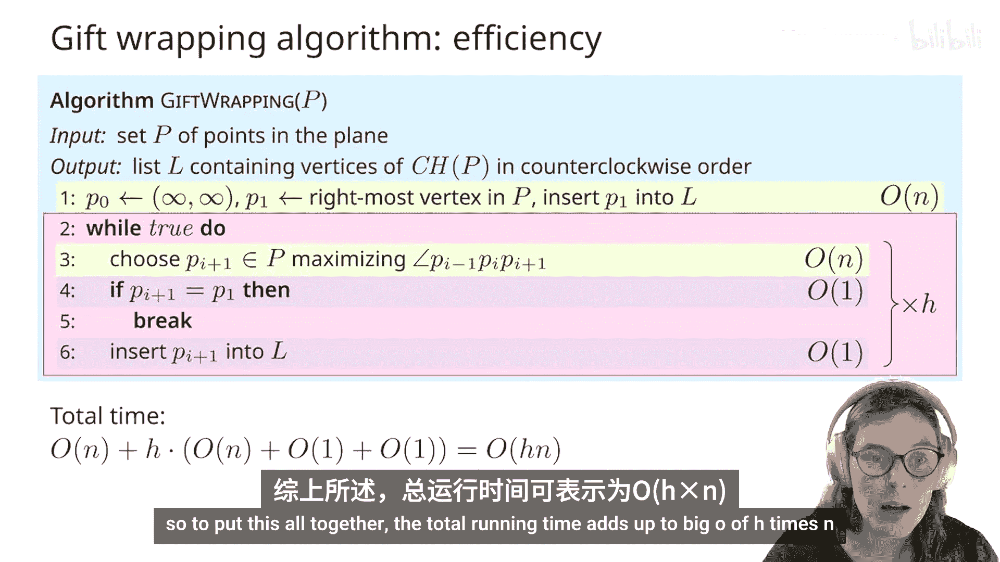

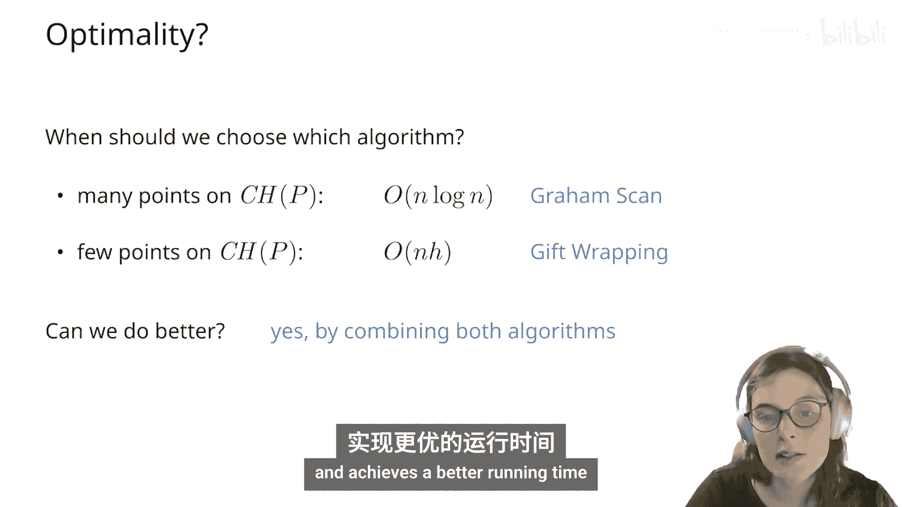

以下是算法的伪代码描述：
```
1.  Find the rightmost point p1, add it to output list L.
2.  Let p0 be a virtual point at infinity (e.g., (p1.x + 1, p1.y)).
3.  i = 1
4.  repeat
5.      Let p_{i+1} be the point in P that maximizes the angle ∠(p_{i-1}, p_i, p_{i+1}).
6.      Add p_{i+1} to L.
7.      i = i + 1
8.  until p_{i+1} == p1  // 回到起点，凸包闭合
9.  return L
```
**运行时间分析**：
寻找下一个顶点（第5行）需要检查所有 `n` 个点，耗时 `O(n)`。该过程需要重复 `h` 次（`h` 为凸包顶点数）。因此总运行时间为 `O(n * h)`。

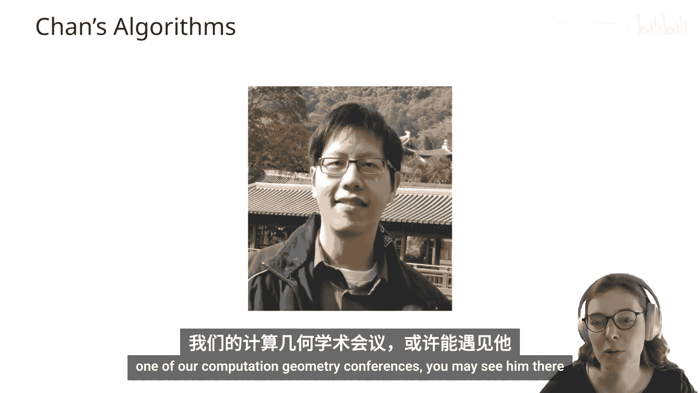

## Chan算法：结合二者优势

我们有两种算法：`O(n log n)` 的 Graham扫描 和 `O(n * h)` 的礼品包装。能否做得更好？本节介绍 Timothy Chan 提出的技巧，它能将两者结合，达到 `O(n log h)` 的运行时间。

**核心思想（已知 h 的情况）**：
1.  **分治与预处理**：将点集 `P` 划分为大小约为 `h` 的 `n/h` 个子集。对每个子集，用 Graham扫描算法在 `O(h log h)` 时间内计算其凸包。总耗时：`(n/h) * O(h log h) = O(n log h)`。
2.  **合并**：使用礼品包装算法合并这 `n/h` 个小凸包。关键技巧是：从一个已知的凸包顶点开始，在**每个小凸包**上，可以在 `O(log h)` 时间内（利用凸包的有序性）找到与该顶点形成最大极角的点（即下一条凸包边的候选点）。然后从所有候选点中选出全局极角最大的点，作为下一个凸包顶点。此过程重复 `h` 次，每次需要检查 `n/h` 个子集，每个子集耗时 `O(log h)`。因此合并阶段总耗时：`h * (n/h) * O(log h) = O(n log h)`。
3.  总运行时间：`O(n log h) + O(n log h) = O(n log h)`。

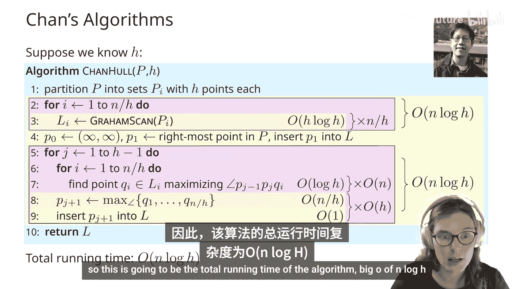

**未知 h 的情况**：
我们并不知道 `h` 是多少。Chan 算法采用一种“猜测并验证”的策略：尝试一系列递增的猜测值 `m`（例如 `m = 2^(2^t)`），对每个 `m` 执行上述“已知 h”的算法。如果算法成功（即构建的凸包顶点数不超过 `m`），则完成；否则，增加 `m` 再次尝试。可以证明，当 `m` 首次大于等于真实 `h` 时，尝试的总运行时间之和仍为 `O(n log h)`。

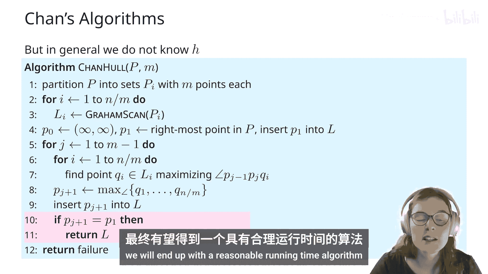

## 总结与拓展

本节课中我们一起学习了凸包的概念和多种算法。我们从最朴素的 `O(n^3)` 算法开始，逐步学习了更高效的 `O(n log n)` Graham扫描算法、输出敏感的 `O(nh)` 礼品包装算法，以及结合两者优点的 `O(n log h)` Chan算法。

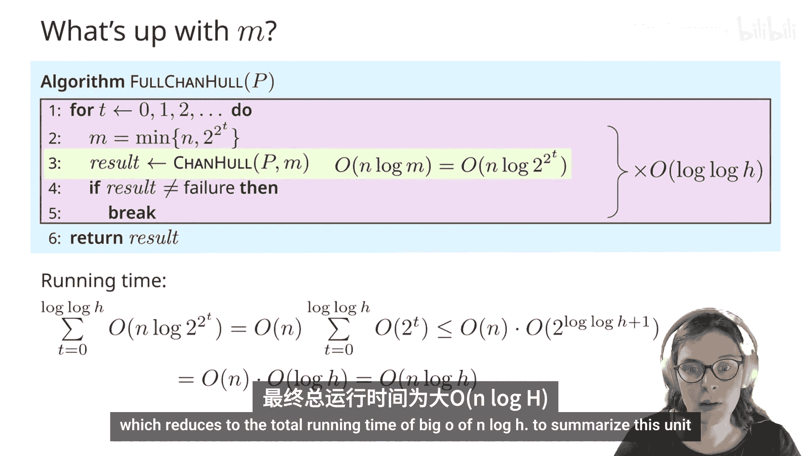

**其他方法**：
*   **分治法**：递归地将点集划分为两部分，分别求解凸包后再合并。根据划分方式（如按x坐标中位数划分），合并时需要找到上下公切线。
*   **增量法**：随机顺序插入点并动态维护凸包。

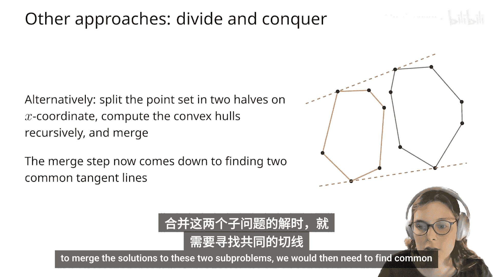

**高维凸包**：
*   在三维空间中，凸包是一个凸多面体，包含顶点、边和面，其边界结构（平面图）规模是线性的。
*   在四维及更高维空间中，凸包的边界面（facet）数量在最坏情况下可能达到输入点数的平方级，这使得高维凸包的计算更加复杂。

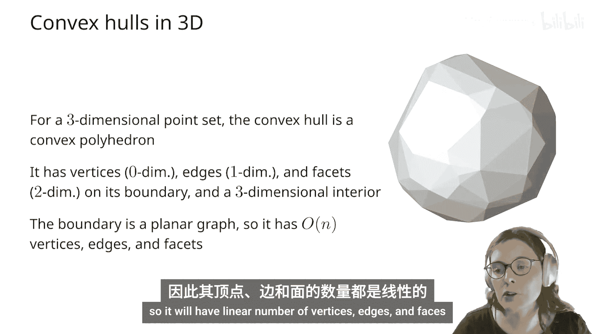

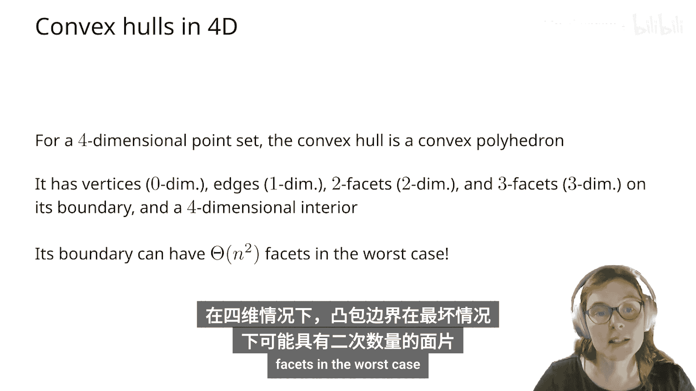

通过学习这些算法，我们不仅掌握了计算凸包的具体技术，也领略了算法设计中权衡效率、利用问题特性以及组合不同思路的精妙之处。