# 002：平面扫描算法用于查找线段交点 🧭

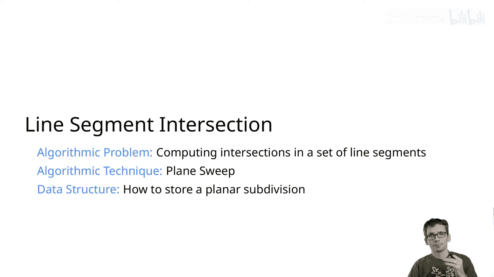

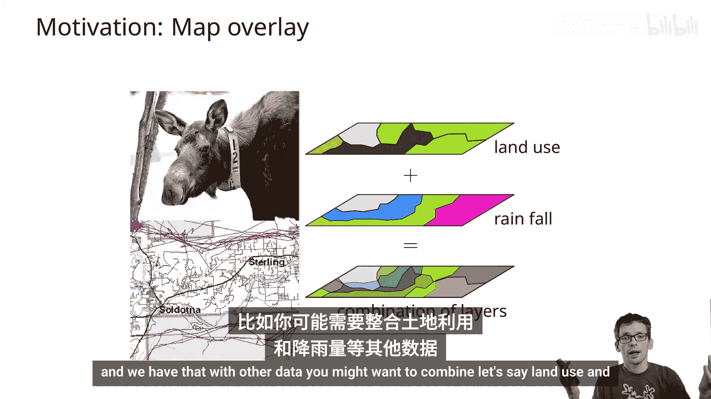

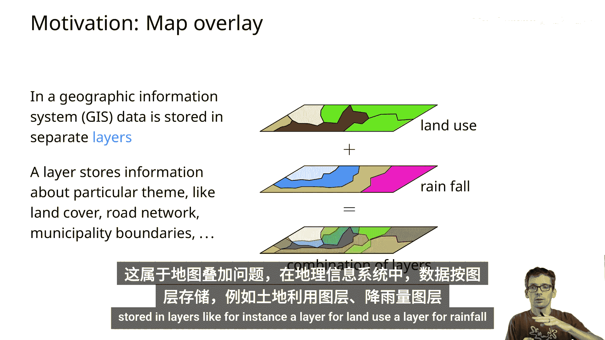

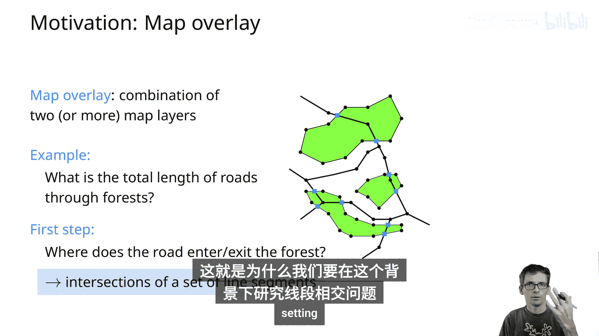

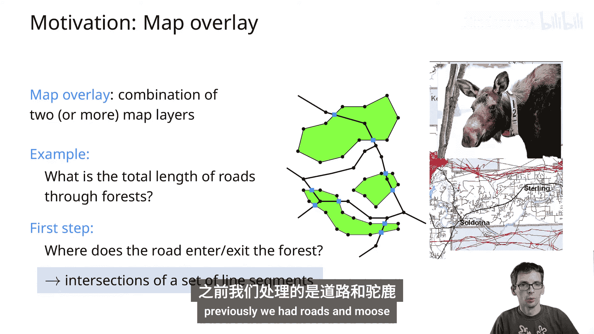

在本节课中，我们将学习如何在一个线段集合中查找所有的交点。我们将利用这个问题来学习一种重要的几何算法设计范式——平面扫描法。最终，我们还会看到一种用于平面细分的数据结构。

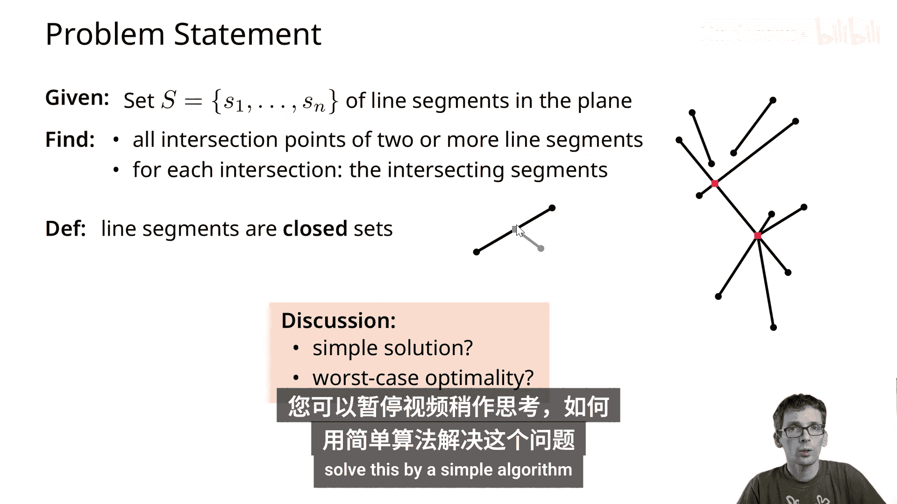

## 概述与应用背景

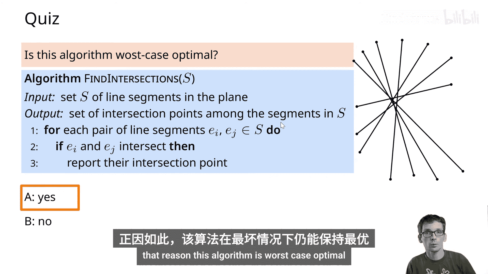

让我们从一个野生动物管理的应用实例开始。我们希望防止驼鹿被汽车撞到。为此，我们拥有道路网络数据和驼鹿的GPS数据，需要结合这两类数据来找出驼鹿穿越道路的位置。在地理信息系统中，数据通常以图层形式存储，例如土地利用图层和降雨量图层。将两个或多个这样的图层结合起来的问题，被称为地图叠加问题。

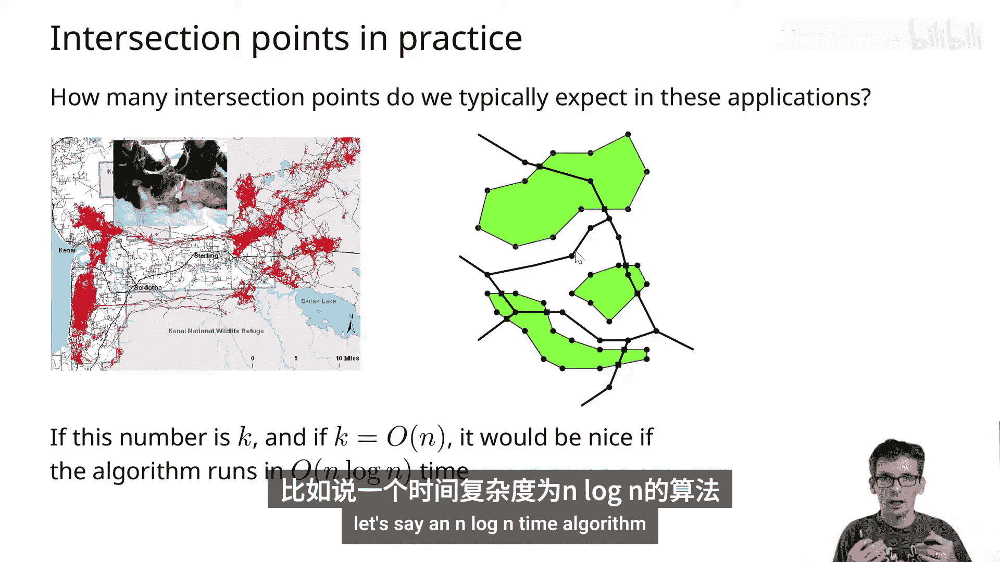

在地图叠加中，一个常见的问题是找出道路与森林边界的交点。因此，我们需要解决的核心几何问题是：给定平面上一组线段，找出所有线段对之间的交点。

## 基础思路与简单算法

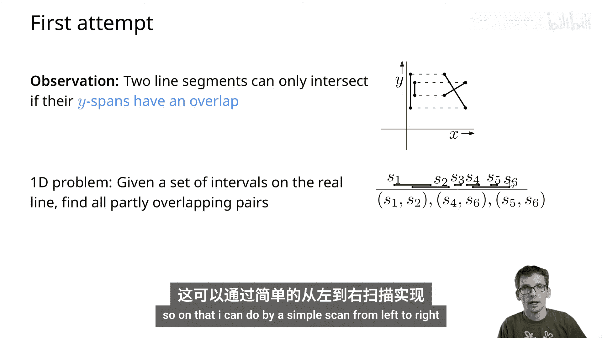

首先，我们思考一个简单算法：检查每一对线段，测试它们是否相交，如果相交则报告交点。这个算法的时间复杂度是 **O(n²)**，其中 n 是线段的数量。

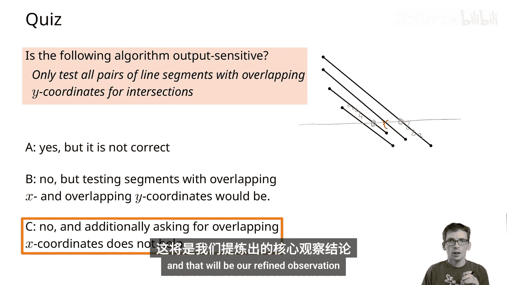

这个算法在**最坏情况下是最优的**吗？答案是肯定的。因为存在一种线段配置，使得每一对线段都相交，从而产生 **O(n²)** 个交点。任何报告所有交点的算法在最坏情况下都至少需要 **O(n²)** 的时间。

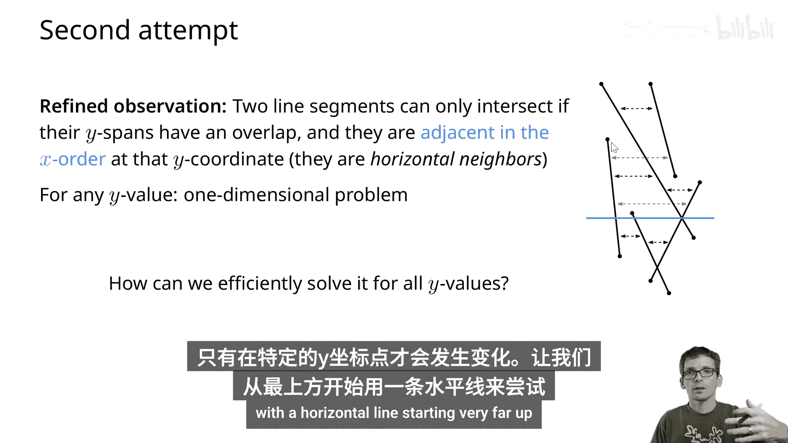

然而，在实际应用中（如地图叠加），交点数量通常远少于 **O(n²)**，可能只有线性数量级。因此，我们希望设计一个**输出敏感**的算法：当交点数量 k 较小时，算法运行得更快，例如达到 **O(n log n + k log n)** 的时间复杂度。

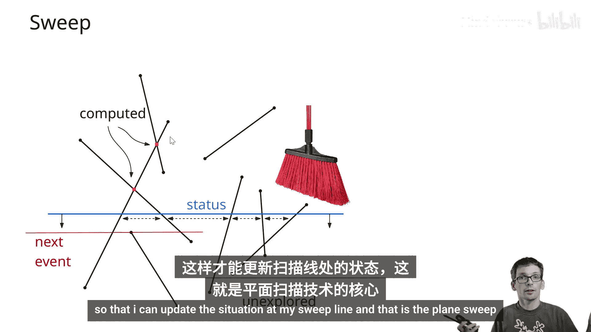

## 平面扫描法的核心思想

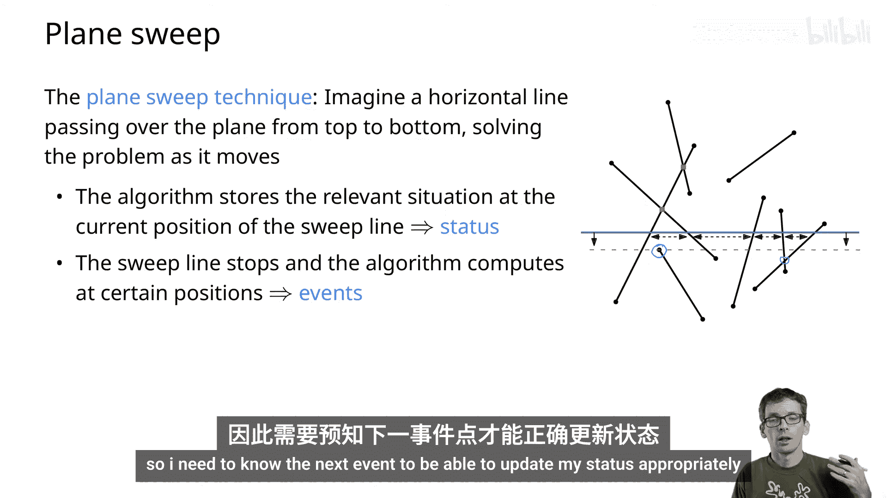

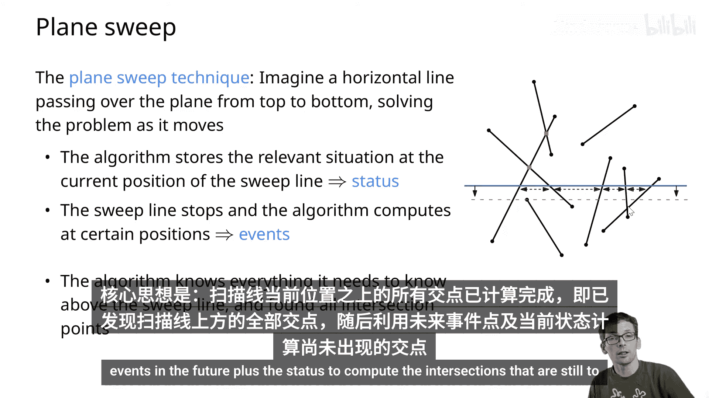

为了设计输出敏感算法，我们需要避免测试所有线段对。一个直观的观察是：两条线段要相交，它们的 y 坐标范围必须重叠。但仅凭这一点还不够，因为即使 y 范围和 x 范围都重叠，线段也可能不相交。

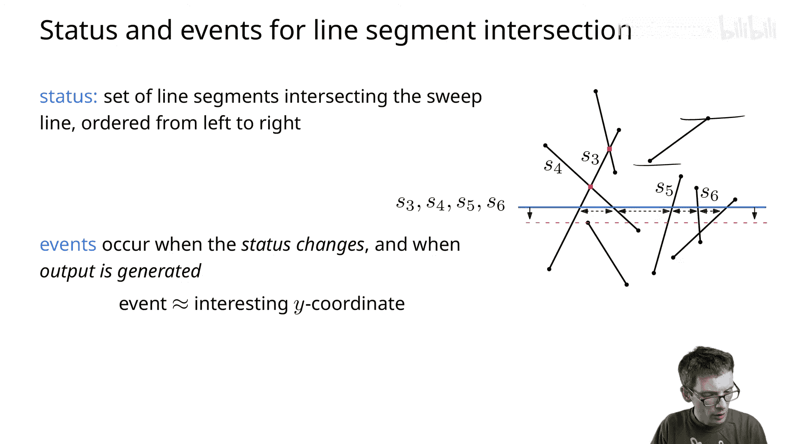

更关键的观察是：对于任意一个 y 坐标，两条线段要相交，它们在该 y 坐标处的 x 顺序必须是相邻的。平面扫描法正是利用了这一思想。

平面扫描法想象一条水平扫描线从上到下扫过平面，在移动过程中解决问题。它有两个核心概念：
1.  **状态**：扫描线当前位置的“快照”。对于线段交点问题，状态是当前与扫描线相交的所有线段，按从左到右的 x 顺序排列。
2.  **事件**：扫描线移动过程中，状态会发生变化的特殊点。对于线段交点问题，事件包括：
    *   线段的上端点（线段开始与扫描线相交）。
    *   线段的下端点（线段不再与扫描线相交）。
    *   线段之间的交点（两条线段的相对左右顺序在此交换）。

扫描线在两个连续事件之间移动时，状态保持不变。因此，算法只需要在事件点处更新状态并处理可能的交点。

## 算法所需的数据结构

为了实现平面扫描算法，我们需要为状态和事件队列选择合适的数据结构。

*   **状态结构**：需要维护一个动态的、有序的线段集合（按当前扫描线处的 x 坐标排序）。我们选择使用**平衡二叉搜索树**。它支持高效的插入、删除、查找相邻线段等操作，时间复杂度为 **O(log n)**。
*   **事件队列**：需要按 y 坐标顺序管理所有待处理的事件（端点、交点）。我们同样选择使用**平衡二叉搜索树**。虽然端点事件可以预先排序，但交点事件是在算法运行中动态发现的。使用二叉搜索树可以方便地插入新事件，并避免将同一个交点事件重复插入队列。

## 平面扫描算法设计

现在，我们可以正式描述算法。算法开始时，扫描线位于所有线段上方。

1.  **初始化**：
    *   事件队列 `Q` 初始为空，然后将所有线段的**上端点**和**下端点**作为事件插入 `Q`。这需要 **O(n log n)** 时间。
    *   状态结构 `T`（平衡二叉搜索树）初始为空。
2.  **主循环**：
    当事件队列 `Q` 非空时，执行以下步骤：
    *   从 `Q` 中取出 y 坐标最小的事件点 `p`（即下一个事件）。
    *   调用 `HandleEventPoint(p)` 来处理这个事件。

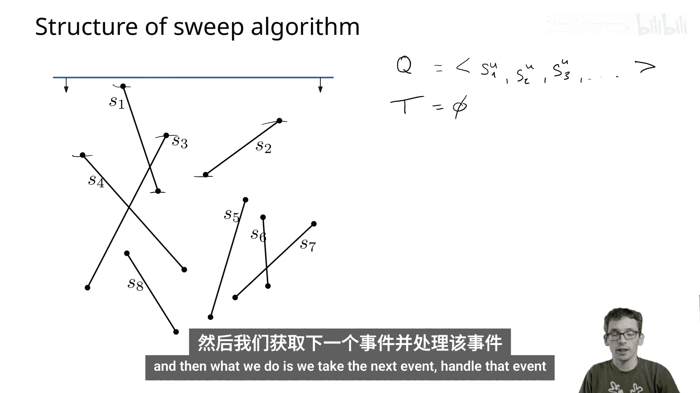

`HandleEventPoint(p)` 过程根据事件类型（上端点、下端点、交点）采取不同行动：

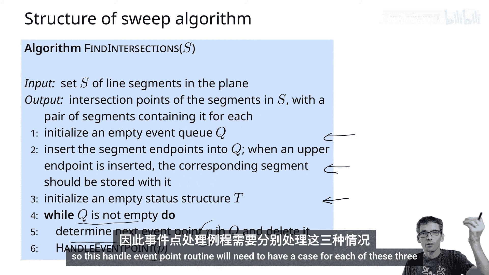

*   **处理上端点**（线段 `s` 开始）：
    1.  将线段 `s` 插入状态结构 `T` 的正确位置。
    2.  检查 `s` 与其在 `T` 中的新左邻线段、新右邻线段是否在未来相交。如果相交，则将交点（如果尚未在队列中）插入事件队列 `Q`。
*   **处理下端点**（线段 `s` 结束）：
    1.  将线段 `s` 从状态结构 `T` 中删除。
    2.  由于 `s` 被删除，原来在 `T` 中与 `s` 不相邻的两条线段现在可能成为新的邻居。检查这对新邻居线段是否在未来相交，如果是，则将交点插入 `Q`。
*   **处理交点**（线段 `s` 和 `s‘` 相交于点 `p`）：
    1.  在状态结构 `T` 中交换线段 `s` 和 `s‘` 的顺序。
    2.  交换后，`s` 有了新的左邻居，`s‘` 有了新的右邻居。分别检查这两对新邻居是否在未来相交，如果是，则将交点插入 `Q`。
    3.  报告交点 `p`。

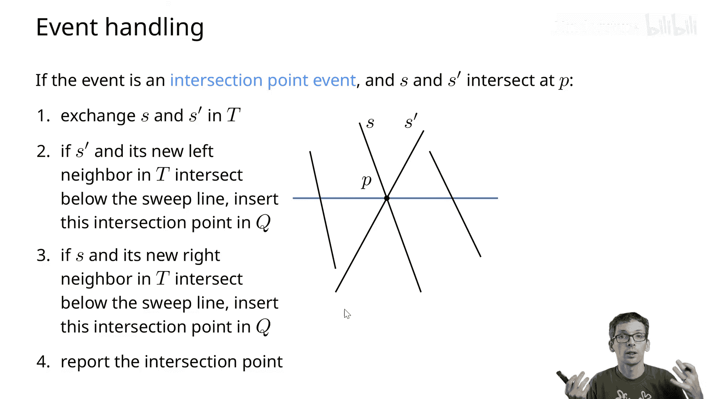

## 算法分析与优化

*   **时间复杂度**：总共有 **O(n + k)** 个事件（n 个端点，k 个交点）。处理每个事件（涉及二叉搜索树操作）需要 **O(log n)** 时间。初始化事件队列需要 **O(n log n)**。因此，总时间复杂度为 **O((n + k) log n)** 或 **O(n log n + k log n)**。这是一个输出敏感的算法。
*   **空间复杂度**：状态结构 `T` 最多存储 O(n) 条线段。关键在于事件队列：理论上最多可能有 O(n²) 个交点事件。但我们可以优化：只将**当前在状态结构中相邻的线段**的未来交点加入队列。一旦两条线段不再相邻，就从队列中删除它们的交点事件。这样可以保证事件队列的大小始终为 **O(n)**。

## 退化情况处理

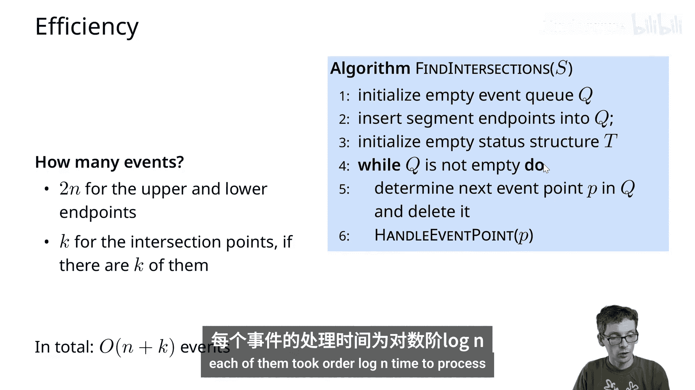

在算法设计中，我们通常先假设处于“一般位置”以简化问题：
*   没有两个事件点具有相同的 y 坐标。
*   没有三条或更多线段交于同一点。
*   线段不重叠，端点不落在其他线段上。

在实际实现中，需要处理这些退化情况：
*   **相同 y 坐标**：按 x 坐标的字典序处理事件（从左到右）。
*   **多点共交**：仔细处理所有在该点相交的线段，正确更新它们的顺序。
*   **重叠线段**：为线段定义唯一的标识符，并据此确定顺序。处理退化情况对算法的鲁棒性是一个挑战。

## 总结与回顾

本节课我们一起学习了用于查找线段交点的平面扫描算法。我们从一个实际应用（地图叠加）出发，分析了简单暴力算法的局限性，进而引入了输出敏感算法的设计目标。

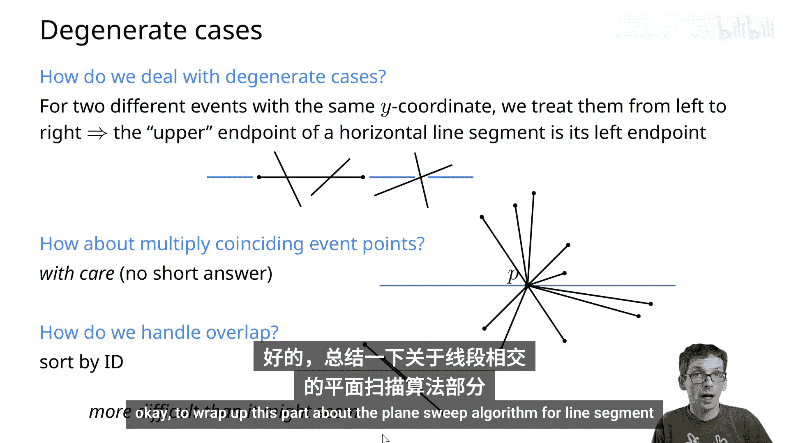

我们深入探讨了平面扫描范式的两个核心——**状态**与**事件**，并选择了**平衡二叉搜索树**作为两者高效的数据结构。我们逐步设计了算法流程，详细说明了如何处理不同类型的事件点，并分析了算法的时间与空间复杂度。

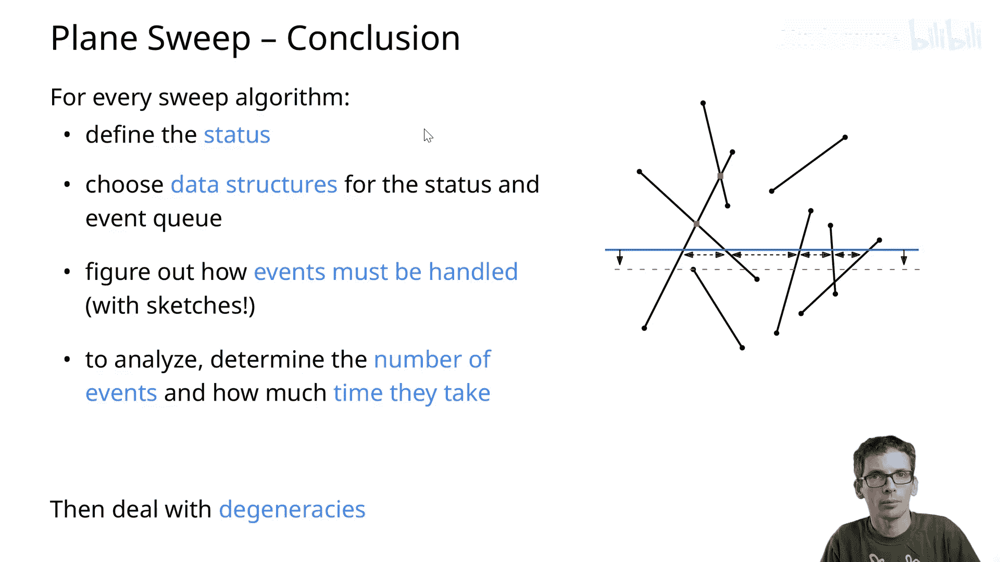

最后，我们简要讨论了算法实现中可能遇到的退化情况及处理思路。平面扫描法是一个强大而通用的范式，掌握其设计思想对于解决许多其他几何问题也大有裨益。