# 003：用于平面细分的双向链表 📐

在本节课中，我们将学习如何表示地图叠加问题中的平面细分。我们将重点介绍一种名为“双向连接边表”的数据结构，它能够高效地存储和操作由线段构成的平面细分。

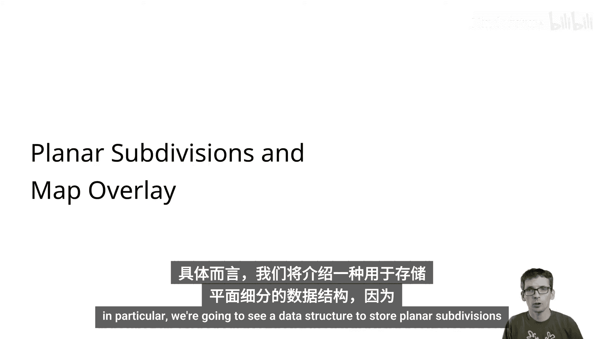

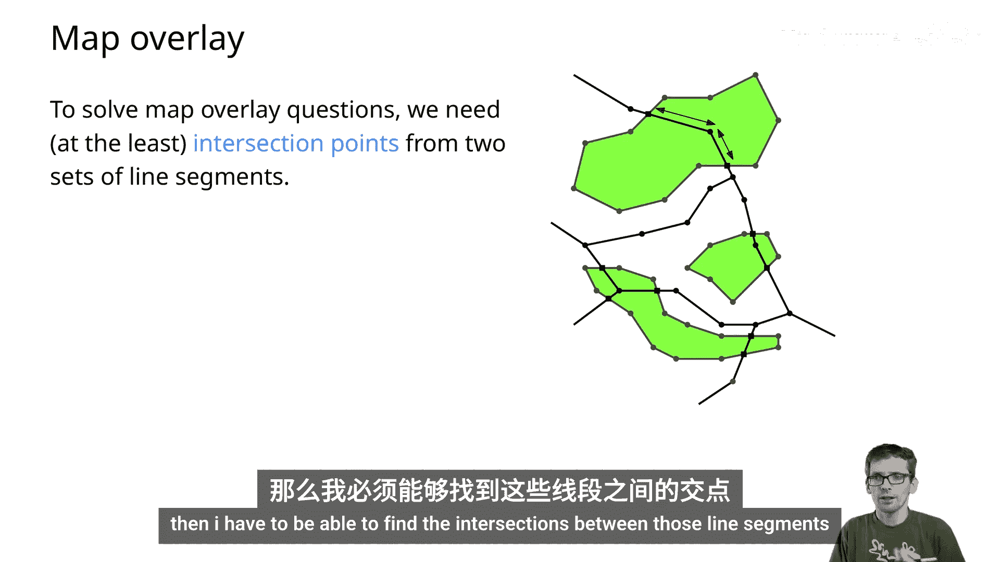

---

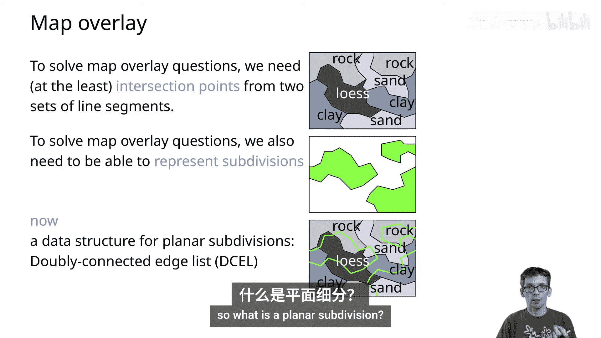

## 平面细分概述 🗺️

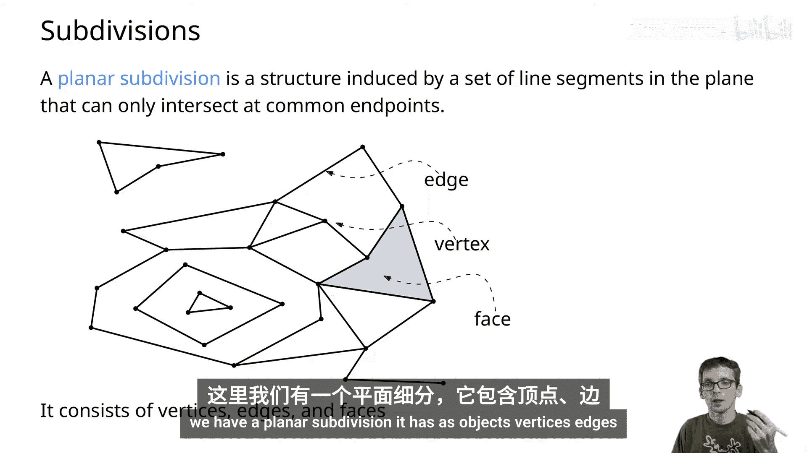

我们研究线段相交问题的动机源于地图叠加问题。现在，让我们回到这个问题，特别是要了解一种用于存储平面细分的数据结构，因为地图图层本质上就是由平面细分构成的。

要解决地图叠加问题，我们之前已经解决了如何找到两个图层线段之间的交点。现在，关键问题是如何实际表示这些细分，即如何表示这些地图图层。我们将介绍一种名为“双向连接边表”的数据结构。

## 什么是平面细分？ 🔍

平面细分是由一组不相交（或仅在公共端点相交）的线段所诱导的平面划分。一个平面细分包含三种对象：**顶点**、**边**和**面**。

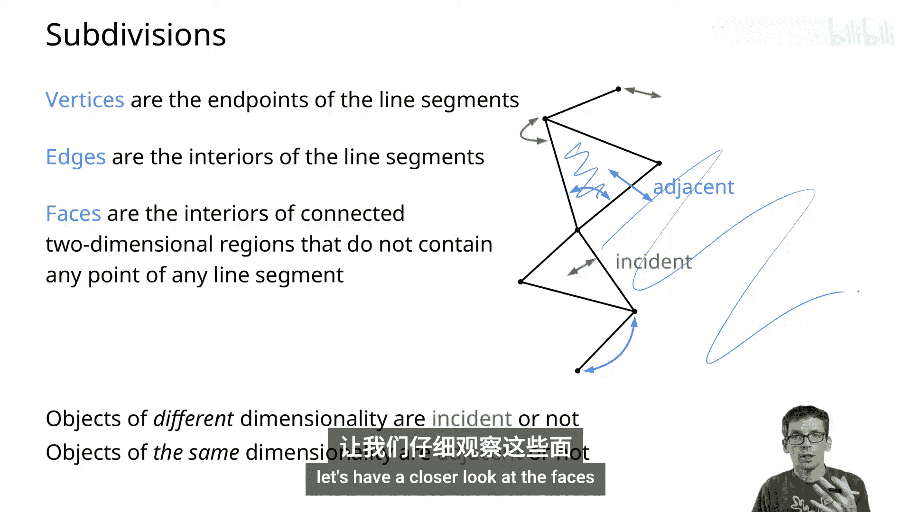

*   **顶点** 是线段的端点。
*   **边** 是线段的内部部分。
*   **面** 是由边界包围的二维连通区域，不包含任何线段。最外部的无界区域也被视为一个面，称为**外表面**。

让我们从一些术语开始。如果一个顶点是某条边的一部分，我们说该顶点**关联**于那条边。同样，一条边关联于它两侧的面。当对象维度不同时，我们使用“关联”关系。

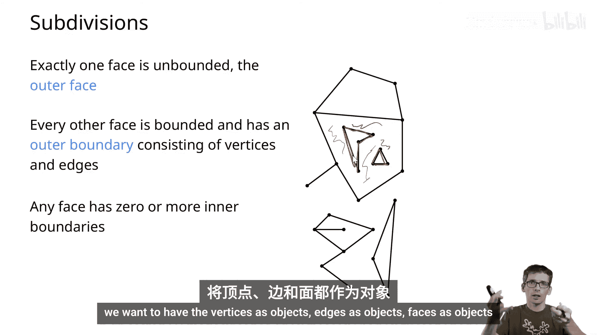

对于相同维度的相邻对象，我们使用“相邻”关系。例如，两个面可以相邻。

## 面的结构 🔄

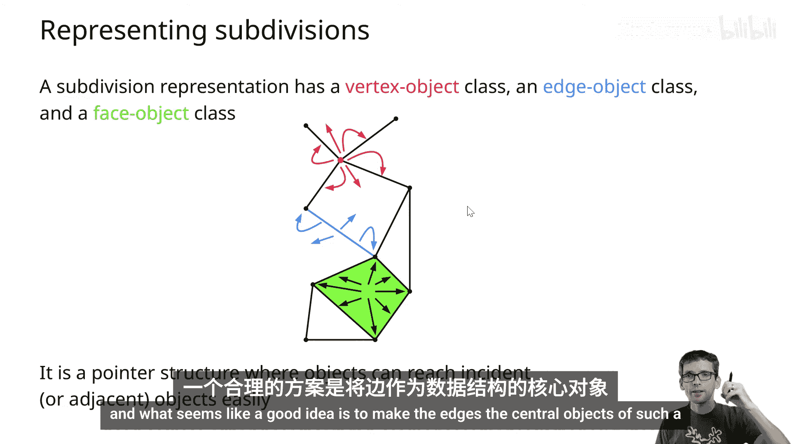

每个平面细分都有一个外表面。其他每个面都有一个**外边界**。此外，一个面可能有零个或多个**内边界**（即孔洞）。

在数据结构层面，我们希望将顶点、边和面都作为对象，并在它们之间建立指针。关键问题是：我们需要什么样的指针？例如，一个面是否需要指向其所有关联的顶点？如果面发生变化，我们是否需要更新所有这些指针？

一个看似不错的想法是让**边**成为这种数据结构的核心对象。这是因为边在关联关系上表现良好：每条边恰好关联两个顶点和两个面。

为了区分这两个顶点和两个面，我们可以为边赋予一个**方向**。这样，我们可以定义边的**起点**和**终点**，以及边的**左侧面**和**右侧面**。

从面的角度来看，如果这些边的方向能保持一致，将非常方便。我们希望围绕一个面，能够轻松地找到下一条边或前一条边。然而，如果所有边都只有一个方向，这在复杂的细分中是无法实现的。

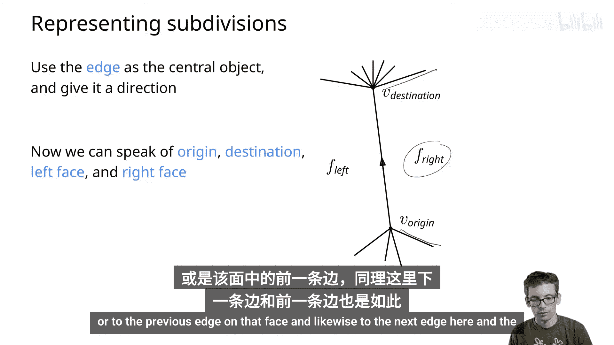

## 双向连接边表的核心：半边 ✂️

这里有一个技巧，也是双向连接边表的特殊之处：我们不直接存储“边”，而是存储**半边**。

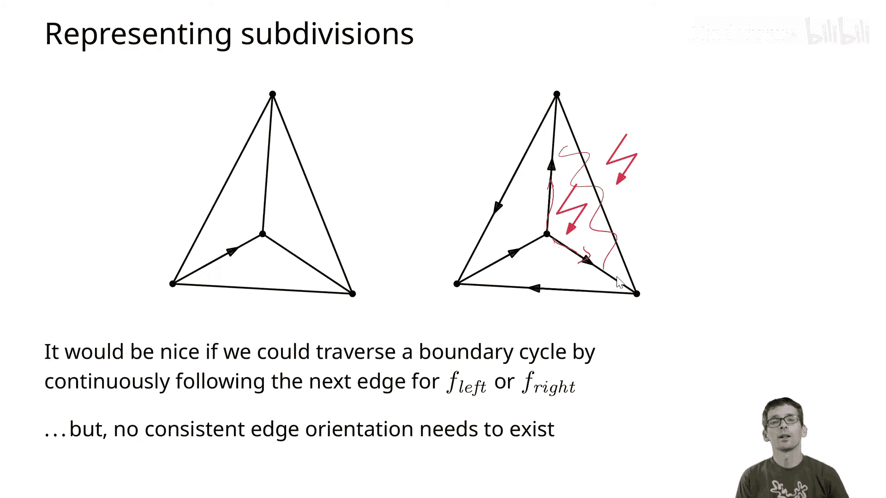

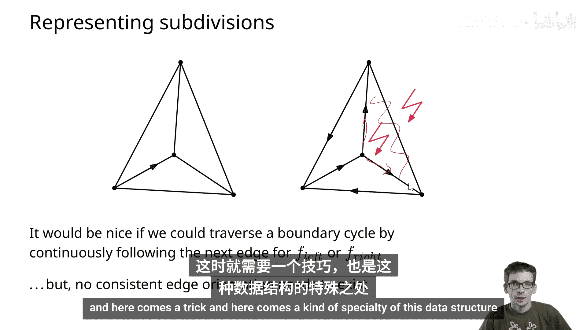

想象将一条边沿其方向分成两半。每条半边只属于一个面，并且有明确的方向。这样，我们就可以围绕一个面，使用该面的半边进行一致的遍历。

现在，让我们将其转化为数据结构。对于每个**半边**，我们将存储以下信息：
*   `twin`：指向相反方向的另一半边。
*   `incidentFace`：指向该半边所属的面。
*   `next`：指向在该面上，沿逆时针方向的下一条半边。
*   `prev`：指向在该面上，沿逆时针方向的前一条半边。

对于**顶点**对象，它相对简单。我们存储其坐标，并存储**一条**关联的边（半边）。我们不需要存储所有关联的边，因为通过这一条边我们可以找到其他所有关联边。

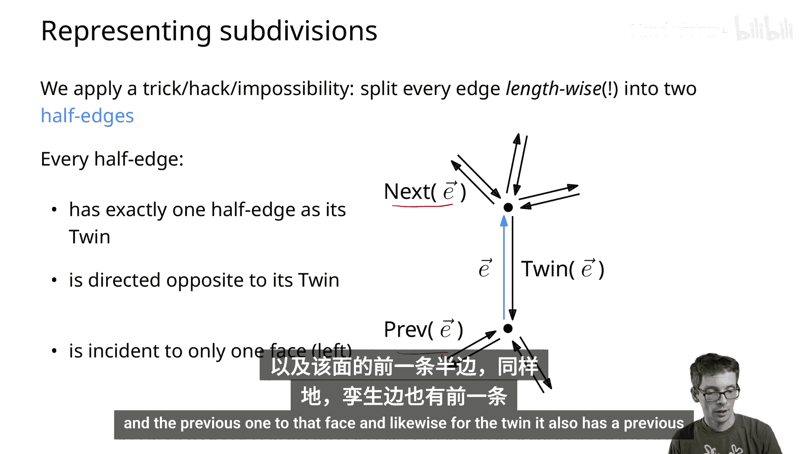

你可能会问，为什么半边不直接存储它的终点顶点？因为我们可以通过查询其 `twin` 半边的起点来轻松获得。

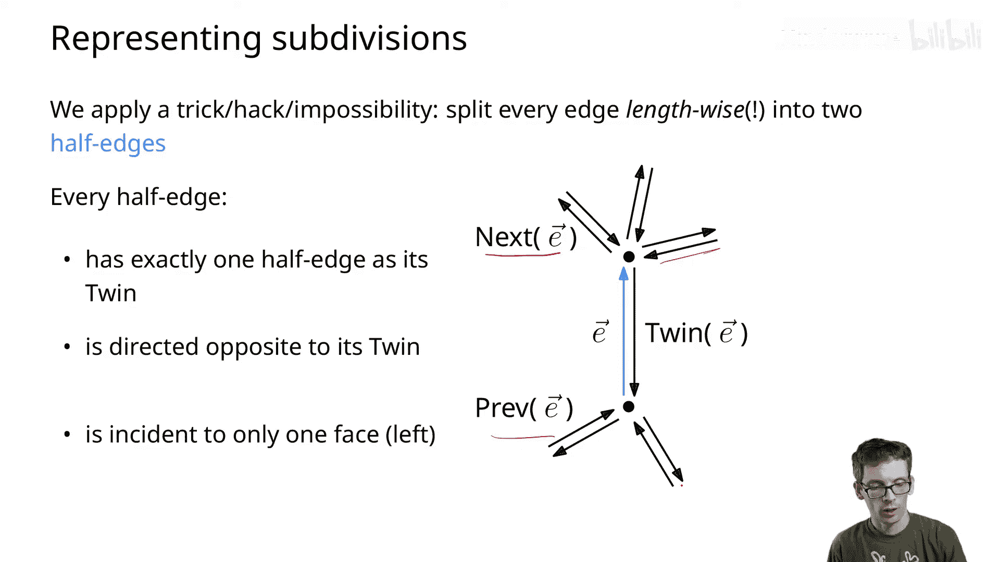

对于**面**对象，我们需要访问其外边界和所有内边界。我们的做法是：
*   存储一个指向其外边界上任意一条半边的指针。
*   为每个内边界存储一个指向其上任意一条半边的指针。

通过 `next` 和 `prev` 指针，我们可以从这些指针出发遍历整个边界。

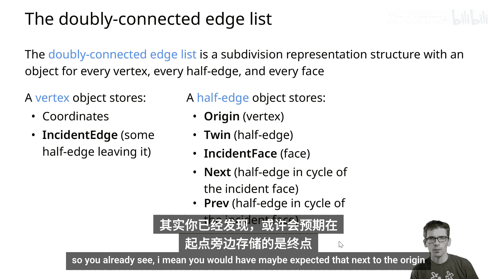

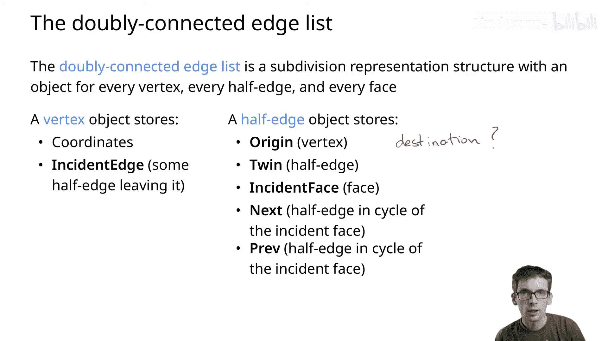

## 数据结构总结 📊

以下是双向连接边表各对象存储信息的总结：

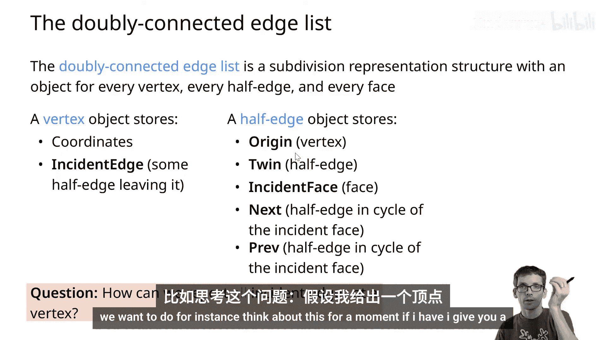

*   **顶点**：坐标，一条关联的边（半边）。
*   **面**：一条指向外边界半边的指针；一个列表，包含指向每个内边界半边的指针。
*   **半边**：起点顶点 (`origin`)，`twin` 半边，`incidentFace`，`next` 半边，`prev` 半边。

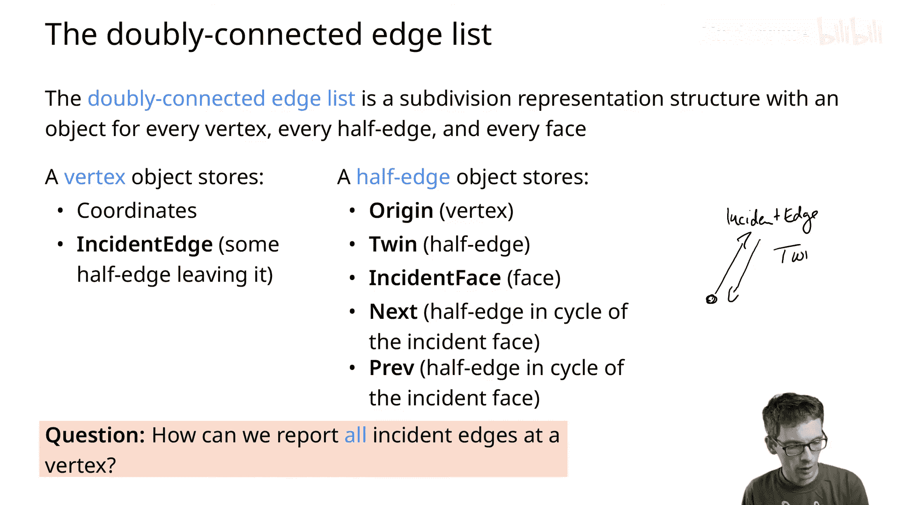

这个数据结构虽然初看有些意外，但功能强大，足以支持我们所需的局部操作。

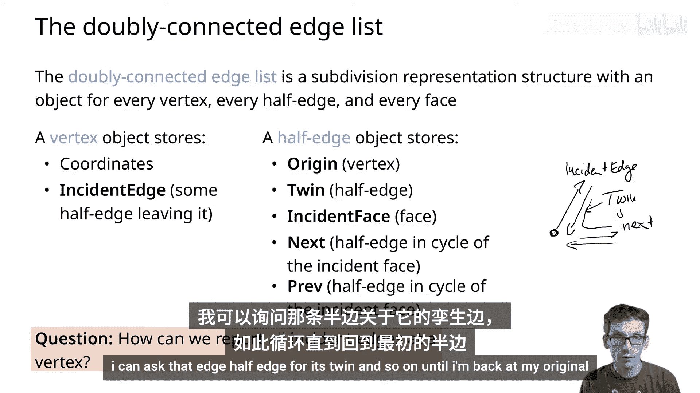

## 操作示例：查找关联边 🧩

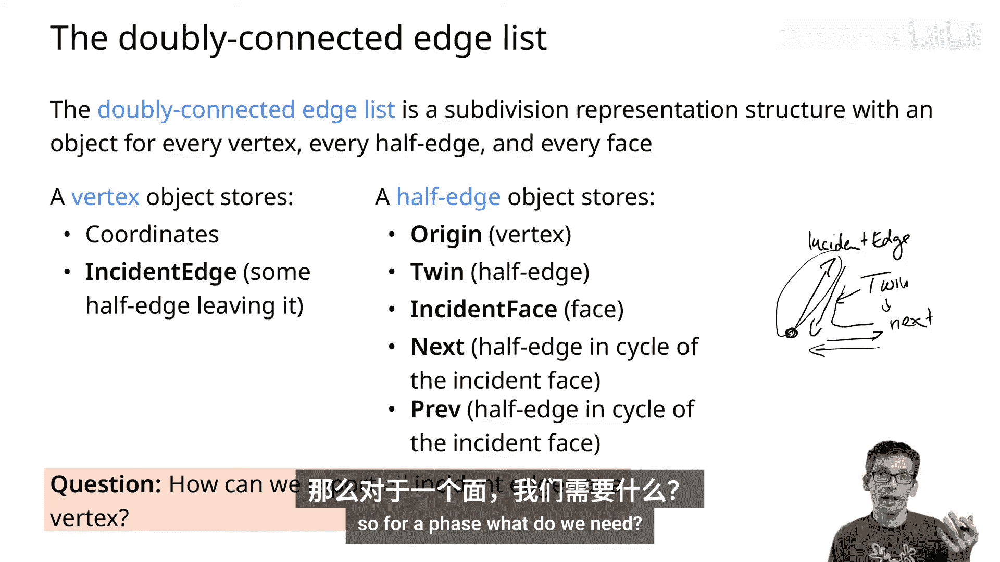

例如，给定一个顶点，如何报告所有关联于它的边？

1.  从该顶点存储的关联半边 `e` 开始。
2.  报告 `e`。
3.  找到 `e` 的 `twin` 半边 `e_twin`。
4.  沿着 `e_twin` 所在的面，找到 `e_twin` 的 `next` 半边。这条新的半边就关联于我们的原始顶点。
5.  重复步骤2-4，直到回到最初的那条半边 `e`。

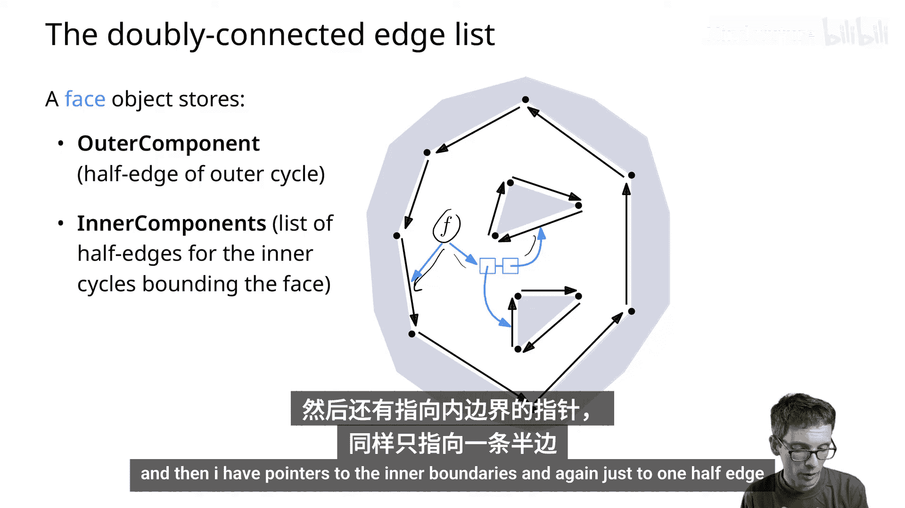

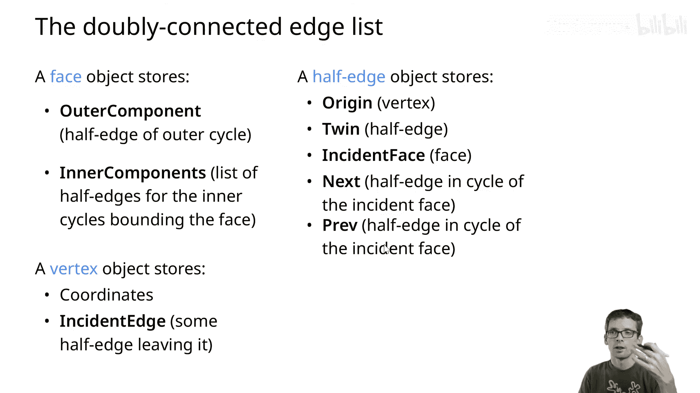

通过这个小测验，我们可以加深对 `next`、`prev` 和 `twin` 指针关系的理解。

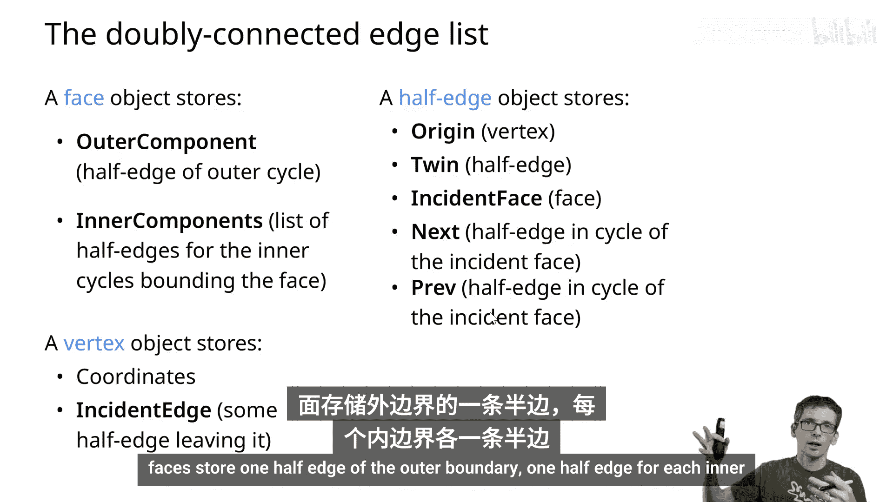

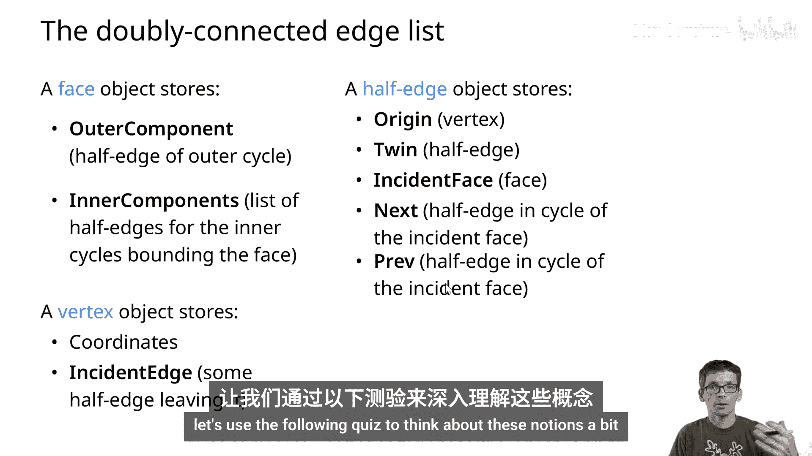

**问题**：以下哪个陈述不总是成立？
1.  一条边的 `prev` 的 `next` 是该边本身。
2.  一条边的 `incidentFace` 与其 `next` 边的 `incidentFace` 相同。
3.  一条边的 `twin` 的 `prev` 的 `twin` 是该边的 `next` 边。

**答案**：第3条并不总是成立。前两条由定义保证总是正确的。

## 回到地图叠加问题 🗺️➡️🗺️

我们讨论双向连接边表的初衷是解决地图叠加问题。现在，你已掌握了两个关键要素：
1.  用于查找所有交点的**平面扫描算法**。
2.  用于表示和构建叠加结果的**双向连接边表**。

叠加结果的边将由原始细分中的边在交点处分割而成，顶点则包括原始顶点和新增的交点。算法需要在找到交点的同时，正确地分割面并构建新的双向连接边表。具体细节可以在相关书籍章节中找到。

---

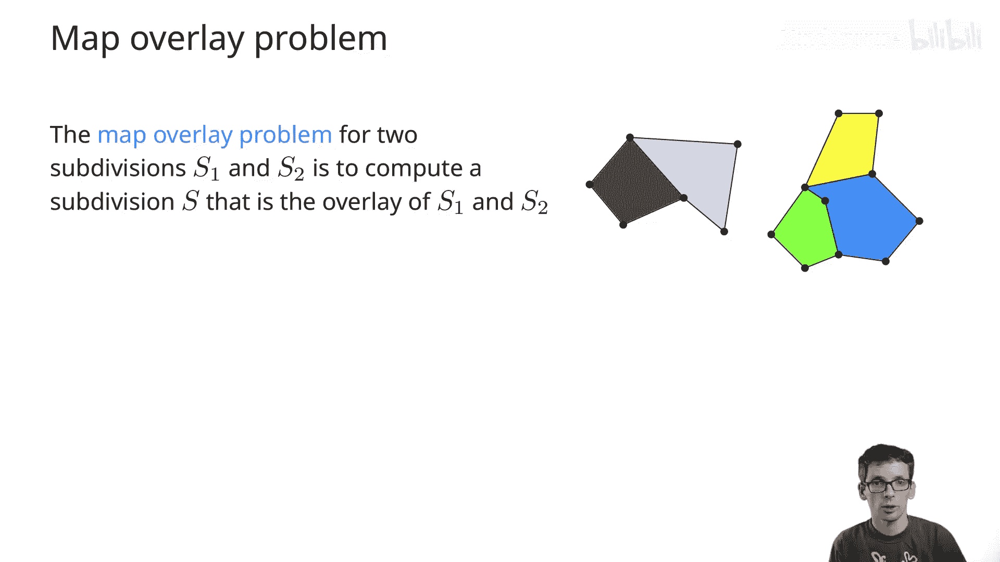

## 本节课总结 📝

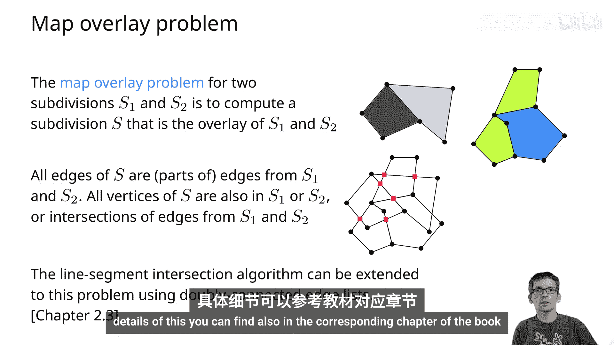

本节课我们一起学习了：
*   **应用目标**：地图叠加。
*   **几何问题**：线段相交。
*   **算法技术**：平面扫描法。
*   **数据结构**：用于高效存储和操作平面细分的**双向连接边表**。

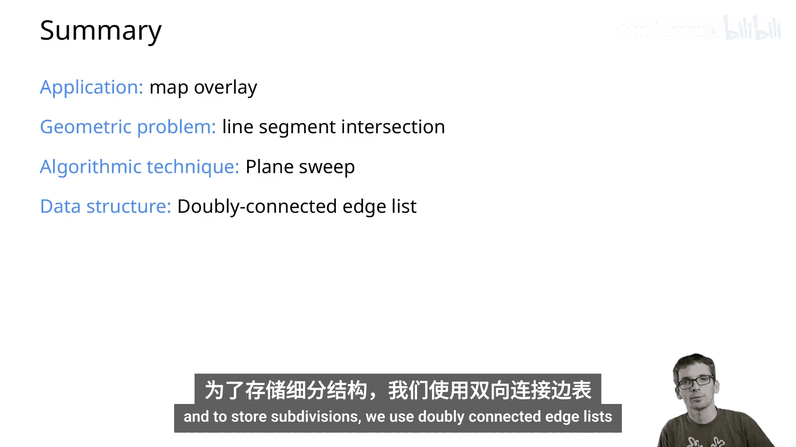

通过结合平面扫描算法和双向连接边表，我们可以有效地解决地图叠加这一实际问题。