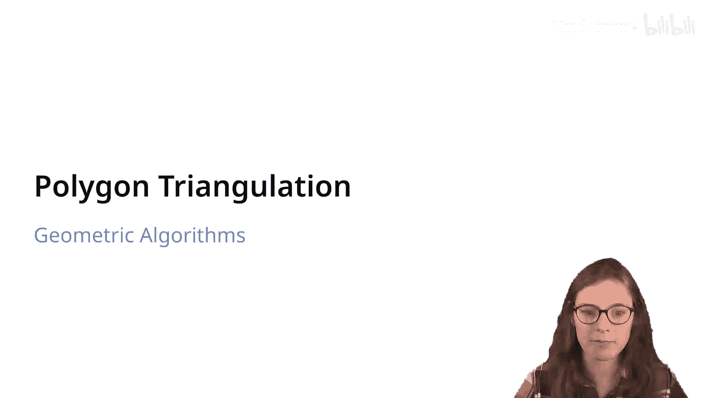
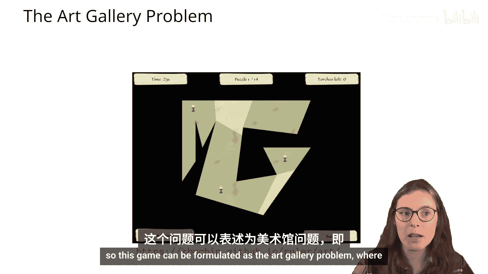
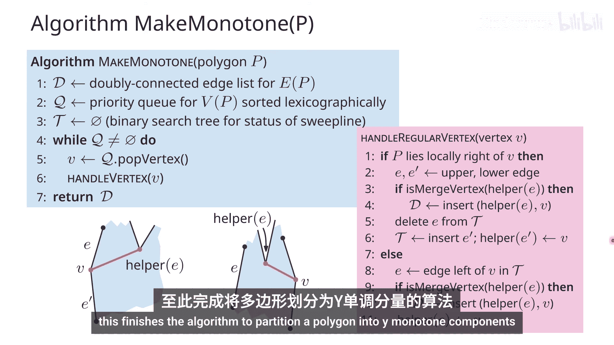
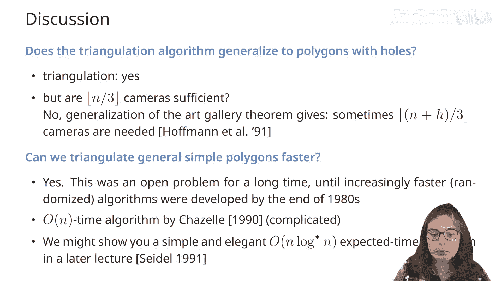

# 004：多边形三角剖分与美术馆问题 🎨

在本节课中，我们将要学习多边形三角剖分及其在解决“美术馆问题”中的应用。我们将从美术馆问题的定义出发，探讨如何通过三角剖分来寻找覆盖多边形所需的最少摄像头数量，并学习高效的三角剖分算法。

## 美术馆问题概述

美术馆问题要求我们在一个由简单多边形表示的美术馆内，放置最少数量的摄像头，使得摄像头的视野能够覆盖整个美术馆内部区域。

一个点 **P** 从摄像头点 **C** 可见，当且仅当线段 **CP** 完全位于多边形内部。对于一个摄像头，其可见区域构成一个**星形区域**。

我们的目标是找到最小的摄像头数量 **k**，使得 **k** 个星形区域的并集覆盖整个多边形。

## 三角剖分的基本概念

上一节我们介绍了美术馆问题，本节中我们来看看解决该问题的一个核心工具——多边形三角剖分。

三角剖分是指将多边形分割成一系列互不重叠的三角形集合，这些三角形的并集恰好等于原多边形。

**定理**：任何具有 **n** 个顶点的简单多边形都可以被三角剖分，并且任何三角剖分都恰好包含 **n-2** 个三角形。

**证明思路（归纳法）**：
*   **基础情况 (n=3)**：三角形自身就是三角剖分，包含 3-2 = 1 个三角形。
*   **归纳步骤**：对于一个 n>3 的多边形，考虑其最左侧顶点 **v** 及其相邻顶点 **u** 和 **w**。
    *   如果边 **uw** 是多边形的一条对角线，则可以“剪掉”三角形 **uvw**，得到一个 n-1 边形的三角剖分问题。
    *   如果 **uw** 不是对角线，则在三角形 **uvw** 内部找到距离 **uw** 最远的顶点 **t**，那么 **vt** 必然是一条对角线。沿着 **vt** 将多边形分割成两个更小的多边形，分别对它们应用归纳假设。

这个证明也提供了一个递归算法，但其时间复杂度是 **O(n²)**。

## 美术馆定理与三染色法

基于三角剖分，我们可以推导出美术馆问题的一个经典结论。

**美术馆定理**：对于任何具有 **n** 个顶点的简单多边形，**⌊n/3⌋** 个摄像头有时是必要的，并且总是足够的。

*   **必要性（下界）**：存在一类多边形（如“梳状多边形”），每个“齿”需要至少一个摄像头来监视其尖端，而每三个顶点构成一个齿，因此至少需要 **⌊n/3⌋** 个摄像头。
*   **充分性（上界）**：我们可以通过以下算法证明 **⌊n/3⌋** 个摄像头总是足够的：
    1.  **三角剖分**：将多边形三角剖分，得到 **n-2** 个三角形。
    2.  **对偶图与三染色**：构造三角剖分的对偶图（每个三角形是一个节点，共享边的三角形相连）。该对偶图是一棵树。通过遍历这棵树，可以为多边形的每个顶点分配三种颜色之一，使得任意三角形的三个顶点颜色互不相同。
    3.  **选择守卫点**：选择顶点数量最少的那种颜色（其数量 ≤ **⌊n/3⌋**），将摄像头放置在这些颜色的顶点上。由于每个三角形都包含所有三种颜色，因此每个三角形至少有一个顶点有摄像头，整个多边形被覆盖。

该算法的瓶颈在于三角剖分，其时间复杂度为 **O(n²)**。接下来，我们将学习如何更高效地进行三角剖分。

## 高效三角剖分：单调多边形剖分

为了获得更快的三角剖分算法，我们采用分治策略：先将复杂多边形划分为更简单的子多边形，再分别三角剖分。这里，“更简单”的子多边形指的是**y-单调多边形**。

一个多边形是 **y-单调** 的，如果任何水平线与其相交产生的交点集是连通的（即一个线段）。

**引理**：如果一个简单多边形不包含**分割顶点**和**合并顶点**，那么它就是 y-单调的。
*   **分割顶点**：两条邻边都向下，且内角 > 180°。
*   **合并顶点**：两条邻边都向上，且内角 > 180°。

因此，将多边形划分为 y-单调子多边形的关键，就是通过添加对角线来消除所有的分割顶点和合并顶点。

以下是划分算法的核心步骤（使用扫描线算法）：

1.  **顶点分类与排序**：将所有顶点按 y 坐标排序放入优先队列。
2.  **扫描线状态**：维护一个数据结构（如平衡二叉搜索树），存储当前扫描线与多边形相交的左边链。
3.  **事件处理**：根据顶点类型（开始、结束、分割、合并、常规）采取不同操作，主要是添加对角线并更新状态数据结构。
    *   处理**分割顶点 v**：找到其左边链的 **helper**（该链上最低的、位于 v 上方的特定类型顶点），连接 v 到该 helper。
    *   处理**合并顶点 v**：检查其相关左边链的 helper，如果是合并顶点则连接；然后更新 v 的左边链的 helper 为 v 自身。

**定理**：一个具有 n 个顶点的简单多边形可以在 **O(n log n)** 时间内，使用 **O(n)** 空间，被划分为 y-单调多边形。

## 单调多边形的三角剖分

在获得 y-单调多边形后，我们可以用线性时间对每个单调多边形进行三角剖分。算法是贪心的：

1.  将多边形顶点按 y 坐标降序排列。
2.  使用一个栈来维护当前正在处理的“漏斗”形状的边界。
3.  遍历每个顶点 **u_j**：
    *   如果 **u_j** 与栈顶顶点在多边形的不同侧链上，则不断弹出栈顶顶点并与 **u_j** 连接对角线，直到栈为空或条件不满足。
    *   如果 **u_j** 与栈顶顶点在同一侧链上，则检查 **u_j** 能否“看到”栈中的顶点（即连接后对角线在多边形内），弹出所有可见的顶点并连接对角线，直到遇到不可见的顶点为止。
4.  处理最后一个顶点时，将其与栈中剩余的所有顶点（除首尾外）连接对角线。

该算法在每个顶点上只进行常数次栈操作，因此对于单个 y-单调多边形，三角剖分的时间复杂度是 **O(m)**，其中 m 是该多边形的顶点数。

## 总结与扩展

本节课中我们一起学习了多边形三角剖分与美术馆问题。

**核心总结**：
1.  **美术馆定理**：⌊n/3⌋ 个顶点守卫足以监视任何 n 顶点简单多边形。
2.  **三角剖分**：任何 n 顶点简单多边形可被三角剖分为 n-2 个三角形。
3.  **高效算法**：通过“划分-征服”策略，可以在 **O(n log n)** 时间内完成三角剖分。步骤是：
    *   使用扫描线算法在 **O(n log n)** 时间内将多边形划分为 y-单调子多边形。
    *   在 **O(n)** 时间内对每个 y-单调多边形进行三角剖分。

**扩展思考**：
*   对于带 **H** 个洞的多边形，所需摄像头数量的界变为 **⌊(n + H)/3⌋**。
*   存在更快的三角剖分算法（如 Chazelle 的 **O(n)** 线性时间算法），但非常复杂。
*   三角剖分是计算几何中的基础工具，在网格生成、三维渲染、碰撞检测等领域有广泛应用。

通过掌握三角剖分，我们不仅能够解决美术馆问题，还为处理更复杂的几何计算打下了坚实的基础。