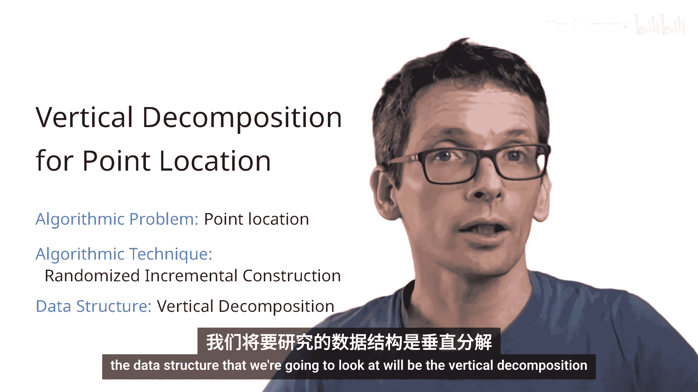
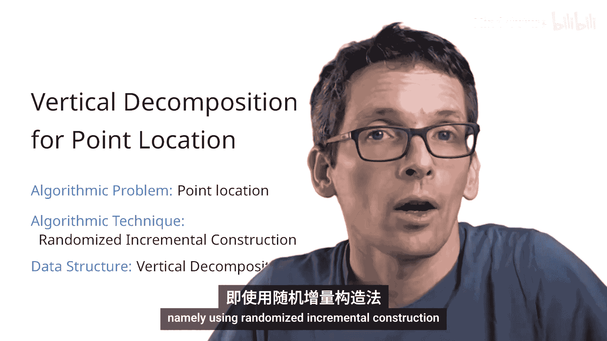
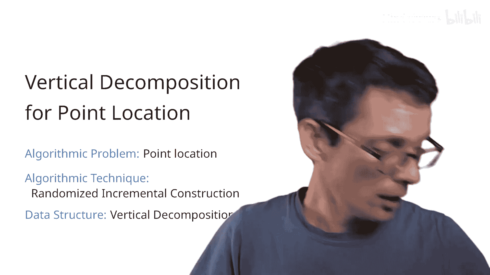
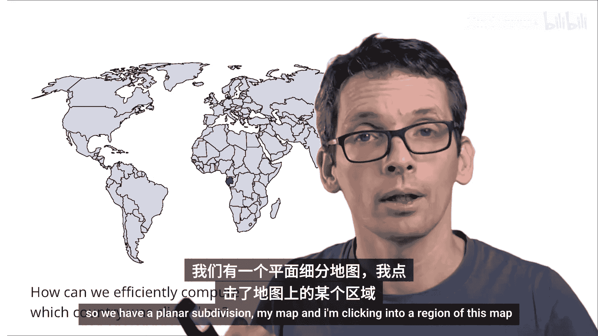
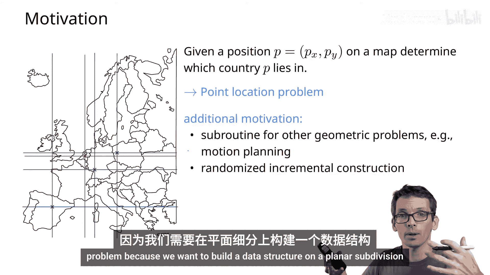
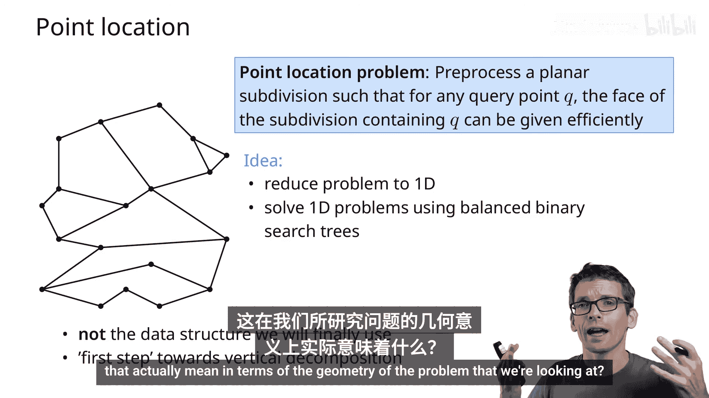
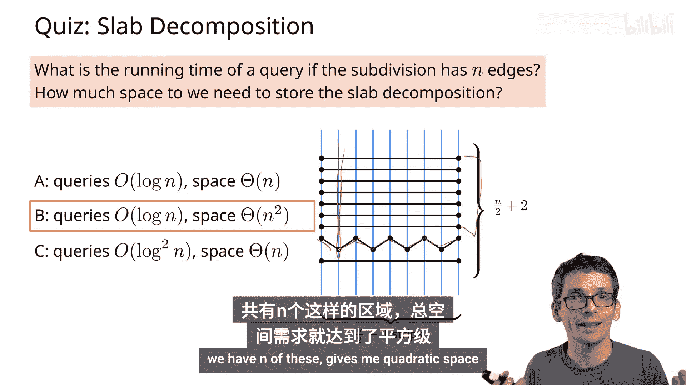
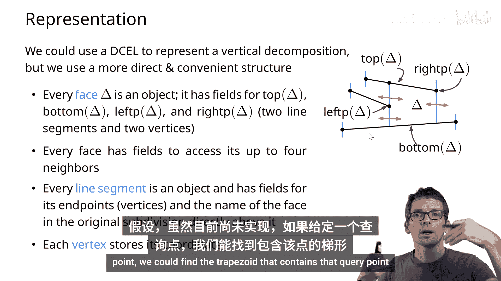
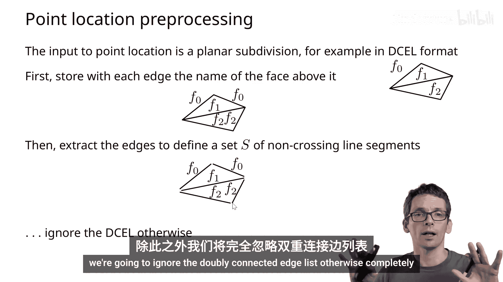

# 005：数据结构 📐











在本节课中，我们将学习点定位问题，并重点介绍一种名为“垂直分解”的数据结构。我们将了解其基本概念、如何存储它，以及它如何为高效的点定位查询奠定基础。

## 点定位问题概述



点定位问题是指：给定一个平面细分（例如一张地图），以及一个查询点，我们需要高效地确定该点位于哪个面（例如哪个国家）内。我们的目标是构建一个数据结构，以便能够反复、快速地处理此类查询。

上一节我们介绍了点定位问题的基本概念，本节中我们来看看一种简单的解决方案——条带分解，并分析其局限性。

## 条带分解：一种简单方法

条带分解的核心思想是将二维点定位问题简化为两个一维搜索问题。首先，我们沿x坐标方向进行搜索。

以下是构建条带分解的步骤：
1.  提取平面细分中所有顶点的x坐标。
2.  在这些x坐标处绘制垂直直线，将平面分割成多个垂直条带。
3.  在每个条带内部，线段会完全穿过条带（可能在边界处有顶点）。因此，我们可以根据这些线段在条带内的y坐标顺序，为每个条带构建一个平衡二叉搜索树。



当进行查询时，算法流程如下：
1.  使用一个平衡二叉搜索树在x坐标上搜索，找到查询点所在的垂直条带。
2.  在该条带对应的平衡二叉搜索树中，根据查询点的y坐标进行搜索，找到其所在的面。

### 条带分解的性能分析

虽然查询时间为 **O(log n)**，非常高效，但其空间复杂度在最坏情况下可能达到 **O(n²)**。考虑一个包含大量长线段和短线段交替出现的场景，会产生大约n/2个条带，而每个条带都可能与O(n)条线段相交，导致总空间需求为平方级。

因此，条带分解在空间效率上并不理想。这促使我们寻找更好的数据结构。



## 垂直分解：核心概念

为了克服条带分解的空间问题，我们引入垂直分解。其核心改进是：从每个顶点向上和向下引出的垂直线，在遇到细分中的另一条线段时即停止，而不是一直延伸到边界。这样就将每个面进一步细分为更简单的形状——梯形或三角形（可视为退化的梯形）。

我们做出以下假设以简化问题：
*   用一个包围盒 **R** 包含整个细分。
*   假设细分中没有垂直线段。
*   假设所有顶点具有不同的x坐标（可通过轻微扰动实现）。

在垂直分解中，每个梯形面可以由四个要素唯一定义：
*   **上边界**：一条原始线段（`top_segment`）。
*   **下边界**：一条原始线段（`bottom_segment`）。
*   **左边界**：一个点（`left_point`），是某条线段（可能是上边界或下边界）的端点。
*   **右边界**：一个点（`right_point`），是某条线段（可能是上边界或下边界）的端点。

因此，每个梯形面可以表示为：
```
Trapezoid = (top_segment, bottom_segment, left_point, right_point)
```

## 垂直分解的存储结构

我们需要一种有效的方式来存储垂直分解，以支持后续的点定位查询。以下是存储方案：

1.  **存储梯形面**：每个梯形面存储其定义要素（`top_segment`, `bottom_segment`, `left_point`, `right_point`）。
2.  **存储邻接关系**：每个梯形面存储其最多4个邻居梯形（通过垂直边相邻）的指针。
3.  **存储原始线段信息**：每条原始线段存储它上方的原始面（来自输入平面细分）。
4.  **存储顶点**：每个顶点存储其坐标。

当进行点定位查询并找到一个梯形面 **Δ** 后，我们可以通过查询其 `bottom_segment`（或 `top_segment`）所关联的“上方原始面”信息，来确定 **Δ** 属于原始细分中的哪个面。

### 复杂度分析



假设原始细分有 **n** 条线段。
*   **顶点数**：包括原始顶点和垂直延伸线与线段交点。总数最多为 **6n + 4**（包含包围盒的4个顶点）。
*   **梯形面数**：每个线段端点最多贡献常数个梯形。总数最多为 **3n + 1**。

因此，垂直分解本身的空间复杂度是 **O(n)**，远优于条带分解的最坏情况。

## 从平面细分到线段集合

为了简化后续构建算法的输入，我们将输入的平面细分（如双向连接边表）转化为一个**线段集合**。关键步骤是：对于细分中的每条有向线段，我们记录其**左侧面对应的原始面**（或者等价地，记录线段的上方面）。这样，算法只需处理这个线段集合以及每条线段附带的“上方面”信息，而无需直接操作复杂的拓扑结构。

本节课中我们一起学习了点定位问题，分析了条带分解的优缺点，并详细介绍了垂直分解的数据结构及其存储方式。垂直分解通过将平面细分为梯形，实现了 **O(n)** 的线性空间复杂度，为高效的点定位奠定了基础。



在下一节中，我们将探讨如何构建这个垂直分解数据结构，并利用它来实现快速的点定位查询。