# 008：Voronoi图与Delaunay三角剖分（第一部分）📐

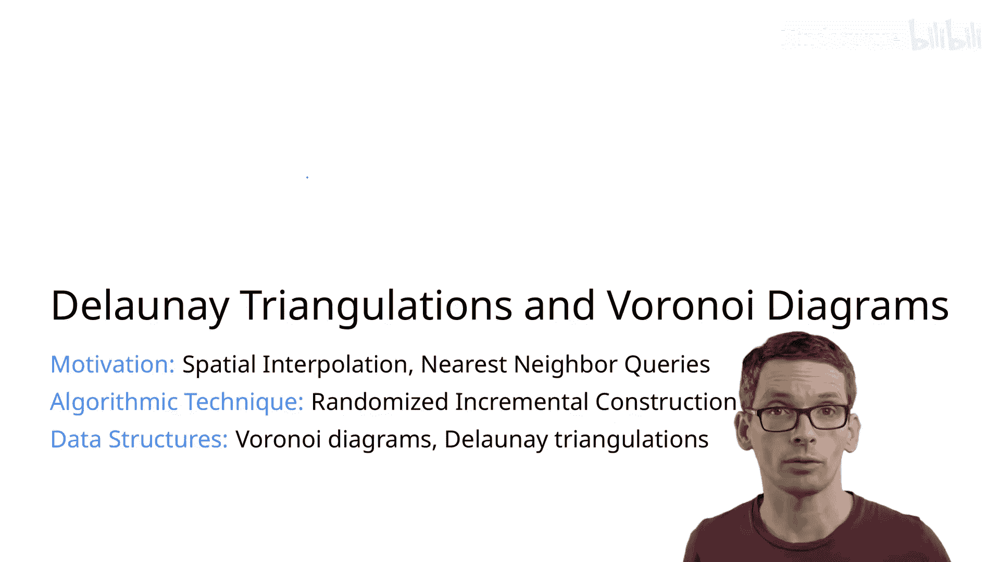

在本节课中，我们将学习两个紧密相关的几何结构：Voronoi图和Delaunay三角剖分。我们将从空间插值问题入手，理解它们的定义、性质和应用，并探讨Voronoi图的复杂度。

## 空间插值问题 🌍

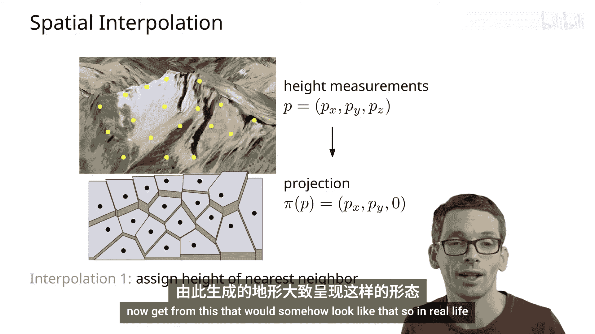

上一节我们介绍了本课程的主题。本节中，我们来看看一个具体的应用场景：空间插值。

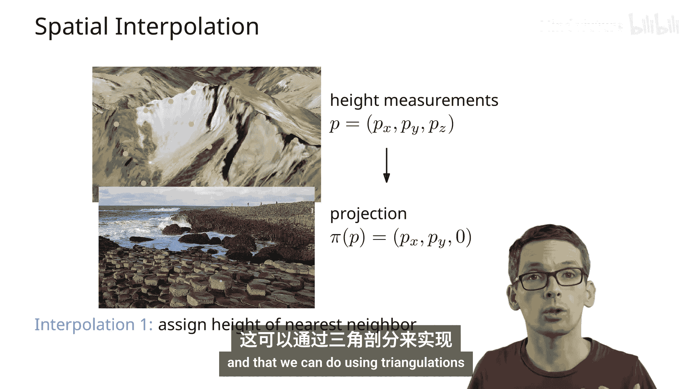

空间插值问题是指，我们拥有一些离散的测量点数据，但需要估计任意位置的值。例如，城市中分布着测量空气质量的传感器，我们想知道没有传感器位置的空气质量。另一个例子是地形高度插值：我们拥有一些离散的高度测量点（包含X、Y坐标和高度值），目标是构建一个覆盖整个平面的连续曲面。

为了解决这个问题，我们首先将测量点投影到平面上。现在的问题是：对于平面上的任意一点(X, Y)，如何估计其高度？

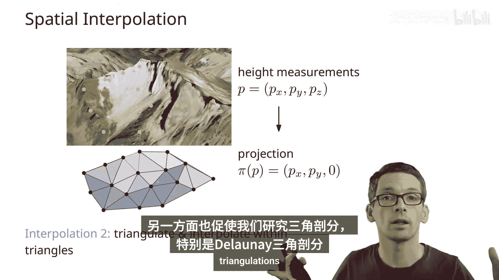

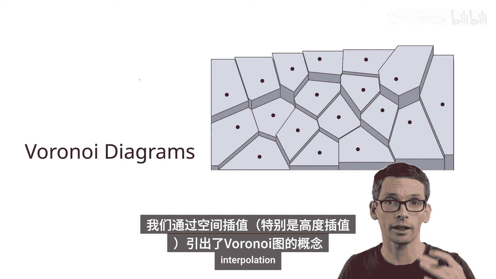

以下是两种基本的插值思路：

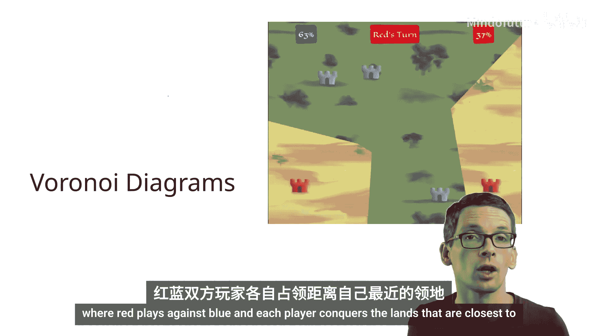

*   **最近邻法**：选择距离该点最近的测量点的高度作为估计值。这意味着平面被划分为多个单元，每个单元内的所有点都拥有相同的“最近测量点”。这种划分就是**Voronoi图**。由此生成的曲面是阶梯状的。
*   **线性插值法**：对于一个点，如果它位于多个测量点之间，则根据这些测量点的高度进行插值。在平面上，这通常意味着我们需要先在这些测量点之间构建一个三角网（三角剖分）。对于三角网中的任何一个三角形，其内部任意点的高度可以通过三角形三个顶点的高度进行插值（例如，使用重心坐标）。这样得到的曲面更为连续平滑。这种三角剖分中，**Delaunay三角剖分**是常用的一种。

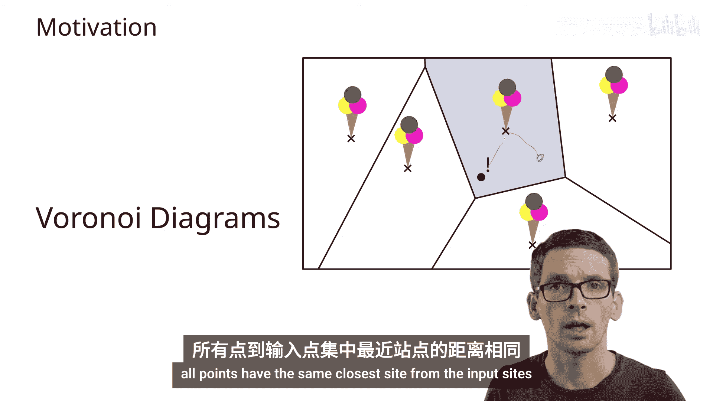

## 什么是Voronoi图？🗺️

上一节我们从插值角度引出了Voronoi图的概念。本节中，我们正式定义并深入探讨它。

Voronoi图还有其他的直观解释，例如：
*   在“领土征服”游戏中，每个玩家占领距离自己城堡最近的区域。
*   在地图上，每个冰淇淋店的服务范围是距离该店最近的所有区域。

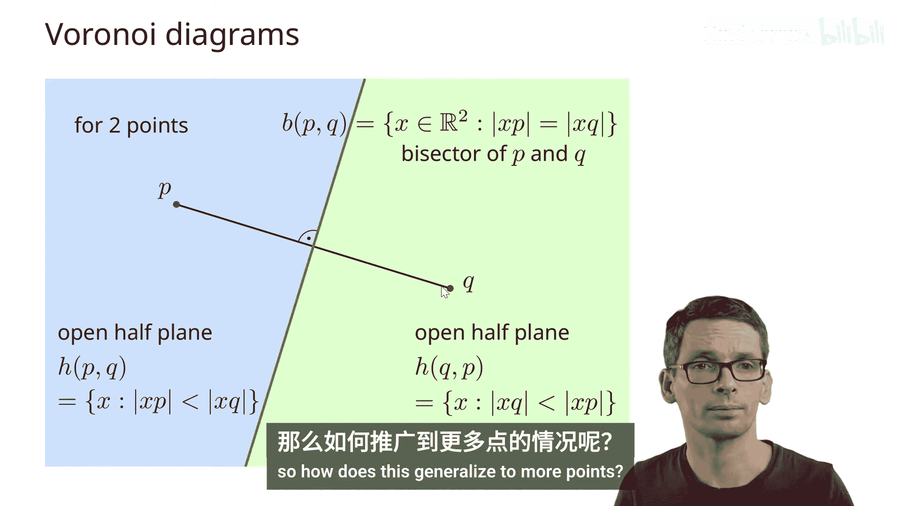

**正式定义**：给定平面上的一组点（称为“站点”），其Voronoi图是将平面划分为多个单元的一种方式。对于每个站点 `P_i`，其对应的单元 `Cell(P_i)` 包含平面上所有到 `P_i` 的距离小于到任何其他站点 `P_j` 距离的点 `Q`。

用公式描述即：
`Q ∈ Cell(P_i) 当且仅当 dist(Q, P_i) < dist(Q, P_j) 对所有 j ≠ i 成立`

### Voronoi图的构成

我们先从最简单的两个站点开始分析。两个站点 `P` 和 `Q` 的Voronoi图由一条**垂直平分线**（中垂线）将平面分成两半。这条线上的点到 `P` 和 `Q` 的距离相等。一侧的所有点离 `P` 更近，另一侧的所有点离 `Q` 更近。

对于更多站点的情况，整个Voronoi图由许多这样的垂直平分线段构成。让我们更细致地观察其组成部分：

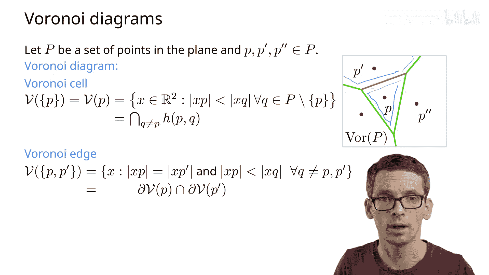

*   **单元 (Cell)**：一个站点 `P` 对应的单元，是与所有其他站点 `P'` 比较后，`P` “获胜”区域的交集。具体来说，`Cell(P) = ∩_{P'≠P} {点X | dist(X, P) < dist(X, P')}`。由于每个 `{点X | dist(X, P) < dist(X, P')}` 定义了一个半平面（由 `P` 和 `P'` 的垂直平分线划分），而半平面是凸集，因此**Voronoi单元是凸集**（可能是无界的）。
*   **边 (Edge)**：一条Voronoi边由两个站点 `P` 和 `Q` 定义。它是 `Cell(P)` 和 `Cell(Q)` 边界的（相对）内部的交集。边上的点到 `P` 和 `Q` 的距离相等，并且比到任何其他站点都近。
*   **顶点 (Vertex)**：一个Voronoi顶点是至少三个Voronoi单元边界的交点。该点到定义它的几个站点的距离相等，并且比到任何其他站点都近。

由边和顶点构成的图称为Voronoi图的**1-骨架**。除非所有站点共线，否则Voronoi图是连通的。

## Voronoi图的复杂度 📊

上一节我们了解了Voronoi图的构成。本节中，我们来分析它可能有多“复杂”，即需要多少存储空间。

首先考虑一个极端情况：一个Voronoi单元最多能与多少个其他单元相邻？答案是 **`n-1`**。想象一个站点被其他所有站点包围在中心，它的单元将与所有其他 `n-1` 个单元相邻。这暗示最坏情况下总复杂度可能是 `O(n^2)`。

然而，幸运的是，**不可能所有单元都同时达到 `n-1` 条边**。我们可以利用平面图的欧拉公式来推导其整体复杂度的紧确上界。

对于一个连通的平面图（将Voronoi图的无界边连接到一个“无穷远”的虚拟顶点后得到），欧拉公式为：
`V - E + F = 2`
其中 `V` 是顶点数，`E` 是边数，`F` 是面数。在我们的设置中：
*   `F = n + 1` （`n` 个Voronoi单元 + 1个外部无界面）
*   我们添加了1个虚拟顶点，所以实际Voronoi图的顶点数 `V_real = V - 1`

接下来，我们使用握手引理：图中所有顶点的度数之和等于 `2E`。在Voronoi图中，每个（真实的）顶点至少是三条边的交点（度数 ≥ 3）。虚拟顶点的度数至少为 3（连接至少三条无界边）。因此，所有顶点的度数之和 `≥ 3(V_real + 1) = 3V`。

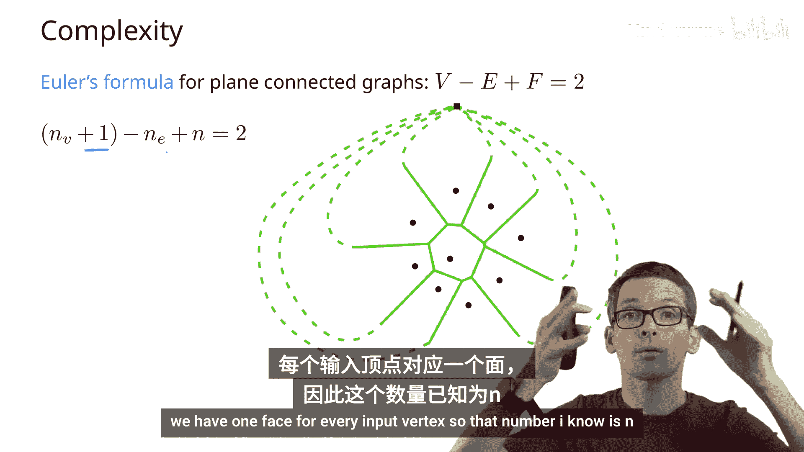

结合握手引理 `2E ≥ 3V` 和欧拉公式 `V - E + (n+1) = 2`，我们可以推导出以下紧确上界：

以下是推导出的复杂度界限：
*   边数 `E ≤ 3n - 6`
*   顶点数 `V_real ≤ 2n - 5`
*   每个单元的平均边数 ≤ 6

因此，**Voronoi图的总复杂度是 `O(n)` 的**。这意味着我们可以用线性的空间来存储它，这是设计高效算法的基础。

## 总结 📝

本节课中我们一起学习了：
1.  **空间插值问题**是Voronoi图和Delaunay三角剖分的重要应用背景。
2.  **Voronoi图**的定义：基于一组站点，将平面划分为每个站点最近的区域。它由凸的单元、边和顶点构成。
3.  **Voronoi图的性质**：单元是凸的；图是连通的（除非站点共线）；其结构复杂度为 `O(n)`，即边数和顶点数均与站点数成线性关系。

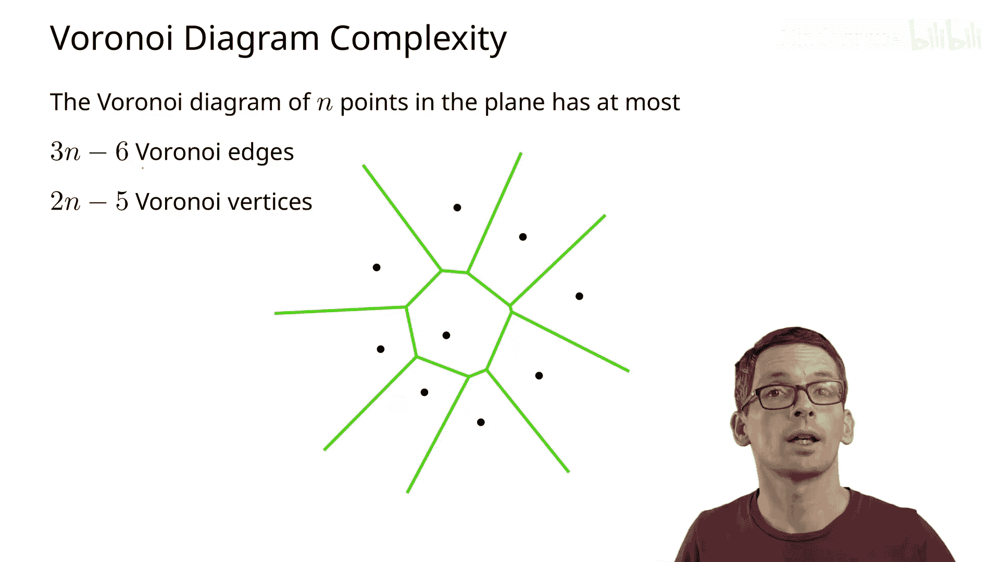

在下一部分，我们将探讨与Voronoi图对偶的**Delaunay三角剖分**，并介绍如何通过随机增量算法来构造它。