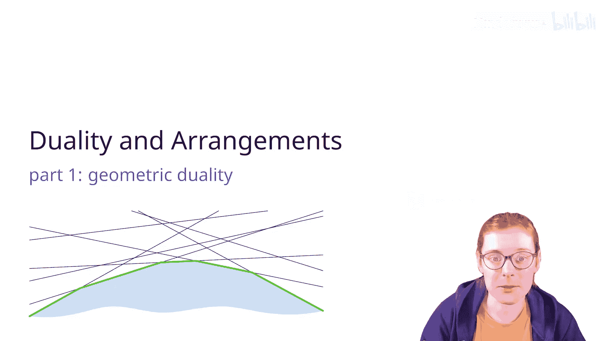
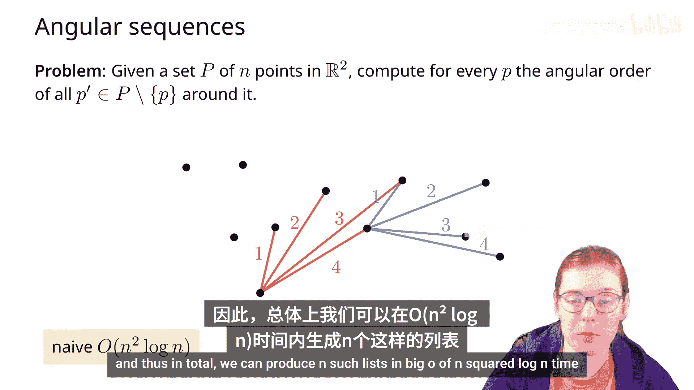
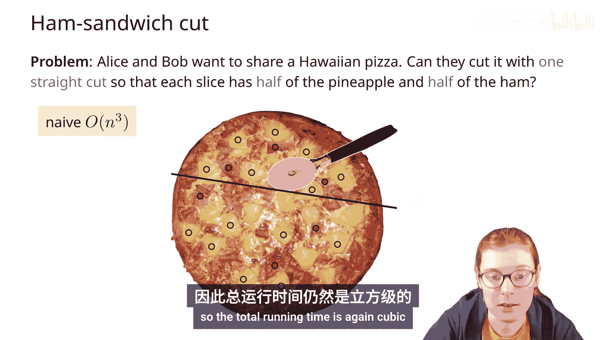
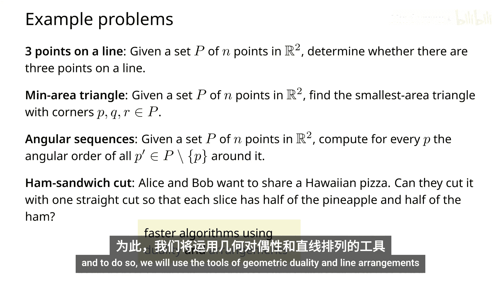
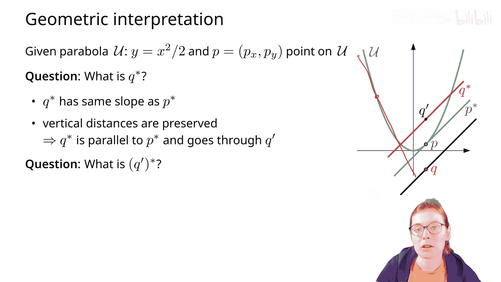
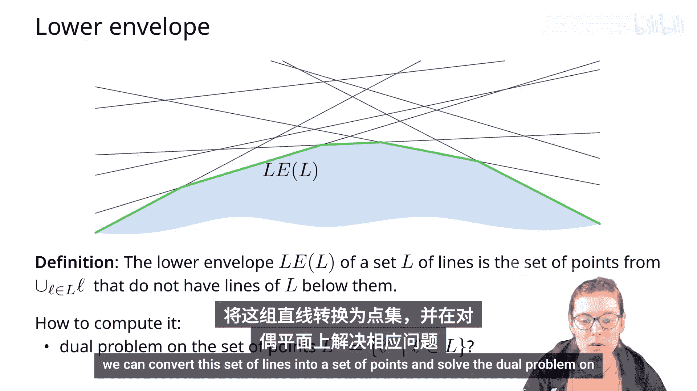
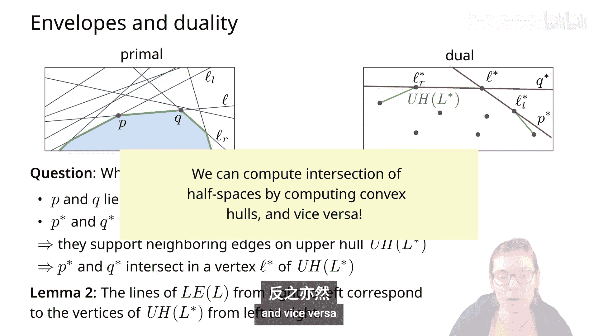
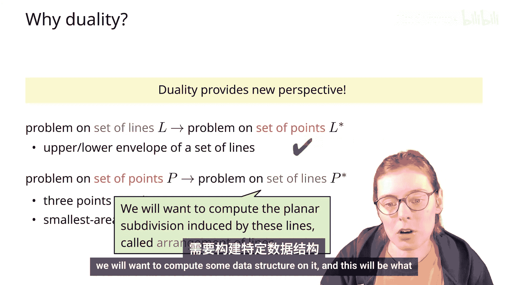

# 010：几何对偶与直线排列

在本节课中，我们将学习几何对偶的概念及其性质，并了解如何利用对偶变换和直线排列来高效解决一系列几何问题。我们将从几个具体问题入手，逐步引入对偶变换的定义、性质及其几何解释，最后探讨如何将对偶应用于实际问题求解。

## 概述

我们首先考虑四个在平面上与点集相关的问题：
1.  判断点集中是否存在三点共线。
2.  寻找面积最小的三角形。
3.  计算每个点相对于其他点的角度顺序。
4.  将包含两种类型点的披萨公平分割。

使用暴力方法，这些问题的时间复杂度通常是立方级或接近立方级。通过引入几何对偶和直线排列，我们将学习如何更高效地解决这些问题。

## 对偶变换的定义

我们从一个具有坐标轴 \(x, y\) 的原始平面开始。对于该平面上的一个点 \(P(p_x, p_y)\)，我们在对偶平面（坐标轴为 \(a, b\)）中定义其对偶线 \(P^*\)，其方程为：
\[
b = p_x \cdot a - p_y
\]

反之，对于原始平面中的一条线 \(L: y = m \cdot x + c\)，我们在对偶平面中定义其对偶点 \(L^*\)，其坐标为：
\[
L^* = (m, -c)
\]

## 对偶变换的性质

根据上述定义，我们可以推导出对偶变换的若干重要性质。

以下是这些性质的总结：
1.  **自逆性**：对偶的对偶是自身。即 \((P^*)^* = P\)， \((L^*)^* = L\)。
2.  **垂直距离守恒**：原始平面中点 \(P\) 到线 \(L\) 的垂直距离，等于对偶平面中线 \(P^*\) 到点 \(L^*\) 的垂直距离。
3.  **点线关系翻转**：
    *   若点 \(P\) 在线 \(L\) 下方，则线 \(P^*\) 在点 \(L^*\) 上方。
    *   若点 \(P\) 在线 \(L\) 上，则线 \(P^*\) 穿过点 \(L^*\)。
    *   若点 \(P\) 在线 \(L\) 上方，则线 \(P^*\) 在点 \(L^*\) 下方。
4.  **线交点与点共线**：
    *   若两条线 \(L_1, L_2\) 交于点 \(R\)，则在对偶平面中，点 \(L_1^*, L_2^*\) 位于线 \(R^*\) 上。
    *   若三个点 \(Q, R, S\) 共线于 \(L_2\)，则在对偶平面中，线 \(Q^*, R^*, S^*\) 交于一点 \(L_2^*\)。

## 其他几何对象的对偶

上一节我们介绍了点和线的对偶关系，本节我们来看看如何将对偶概念扩展到其他几何对象，例如线段。

考虑原始平面中的线段 \(S\)，其端点为 \(P\) 和 \(Q\)。在对偶平面中，线段 \(S\) 的对偶是一个**双楔形区域** \(S^*\)，该区域由线 \(P^*\) 和 \(Q^*\) 以及它们的交点所界定。原始线段上的任意点 \(T\) 对偶为一条穿过 \(P^*\) 与 \(Q^*\) 交点的线，当 \(T\) 从 \(P\) 移动到 \(Q\) 时，其对偶线在该交点周围旋转，扫过整个双楔形区域。

此外，若原始平面中的一条线 \(L\) 与线段 \(S\) 相交，则其对偶点 \(L^*\) 将位于双楔形区域 \(S^*\) 内部。

## 对偶的几何解释：抛物线

对偶变换有一个非常直观的几何解释，这有助于我们手动构造对偶对象。

考虑抛物线 \(y = \frac{x^2}{2}\)。设点 \(P(p_x, p_y)\) 位于此抛物线上。可以证明，抛物线在点 \(P\) 处的切线方程恰好为：
\[
y = p_x \cdot x - p_y
\]
这正是点 \(P\) 的对偶线 \(P^*\) 的方程。因此，**点 \(P\) 的对偶线 \(P^*\) 是抛物线在点 \(P\) 处的切线**。

基于此，我们可以推断：
*   只有位于抛物线上的点，其对偶线才会穿过该点本身。
*   对于位于点 \(P\) 正下方的一点 \(Q\)，其对偶线 \(Q^*\) 与 \(P^*\) 平行，且位于对偶点 \(P\) 的上方（因为原始点 \(Q\) 在原始线 \(P^*\) 下方，关系翻转）。

## 下包络与凸包的对偶性

在介绍了对偶的基本概念后，我们来看一个重要的应用：下包络与凸包之间的对偶关系。

考虑原始平面中一组直线的**下包络**，即这些直线中没有任何其他直线从其下方穿过的点的集合。

在对偶平面中，这组直线对应于一组点。可以证明，**原始平面中构成下包络的直线序列（从右到左），恰好对应于对偶平面中这组点的上凸壳顶点序列（从左到右）**。

因此，计算一组直线的下包络（即半平面交）问题，可以转化为计算其对偶点集的凸壳问题。由于我们已经拥有成熟的凸壳算法（如 Graham Scan），这就将一个可能复杂的新问题转化为了一个已知高效解法的问题。

## 对偶的应用与直线排列

根据上一节的结论，我们可以将对偶应用于两个方向：

1.  **线集问题转化为点集问题**：例如，通过计算对偶点集的凸壳来求解原始线集的下包络。
2.  **点集问题转化为线集问题**：将原始点集对偶为一组直线，从而在一个新的结构——**直线排列**中研究问题。

直线排列是指将一组直线放入平面后，这些直线将平面分割成的细胞、边和顶点的整体结构。对点集问题的研究可以转化为对其对偶直线排列性质的研究，这常常能提供新的洞察和更高效的算法。

## 总结

本节课我们一起学习了几何对偶的核心内容。我们首先定义了点与线在对偶平面中的对应关系，并探讨了其对偶变换的多个关键性质，如自逆性、距离守恒和关系翻转。我们了解到线段对偶于双楔形区域，并且对偶变换可以通过抛物线切线获得直观的几何解释。

更重要的是，我们揭示了下包络与凸包之间的深刻对偶联系，这为解决一类几何问题提供了强大的工具：既可以将线集问题转化为熟悉的点集凸壳问题，也可以将点集问题置于直线排列的框架下进行分析。这种视角的转换，正是我们后续用以高效解决课程开头所提那些问题的基础。