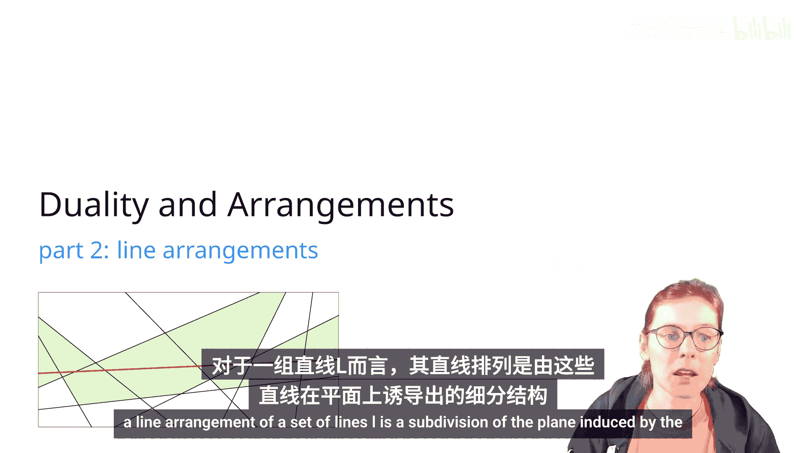
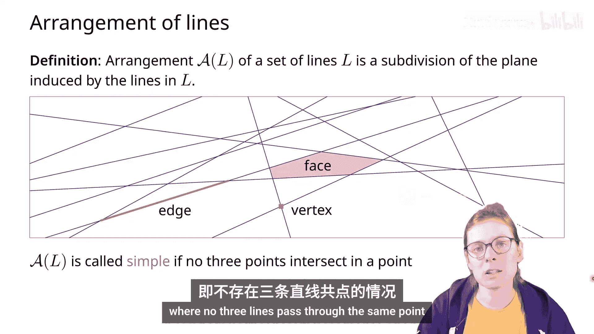
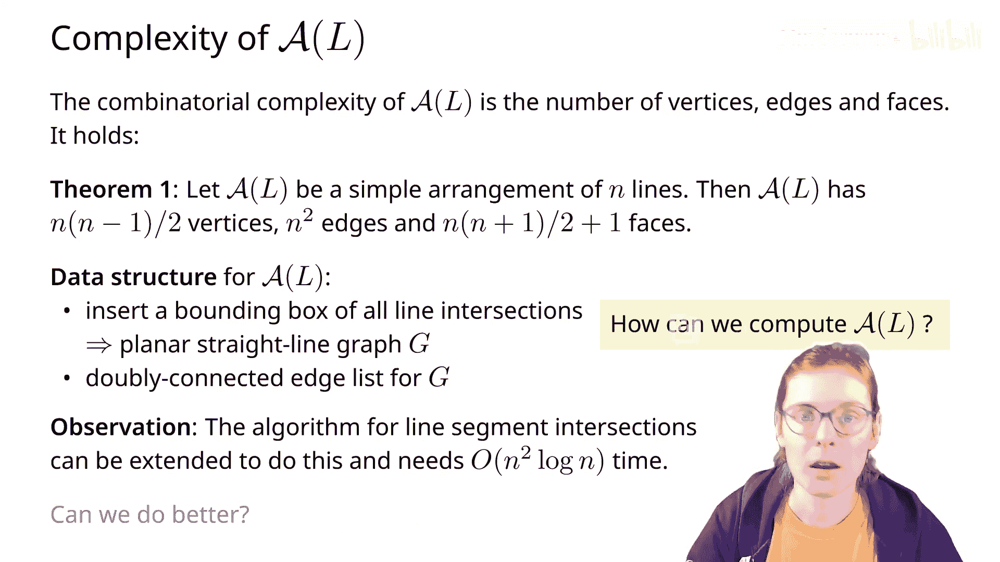
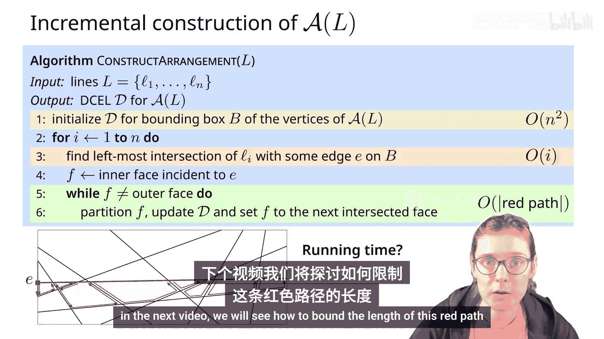
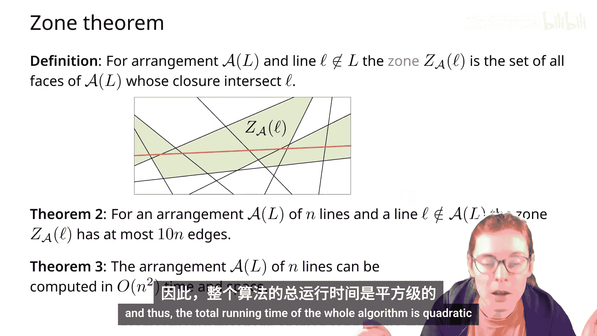
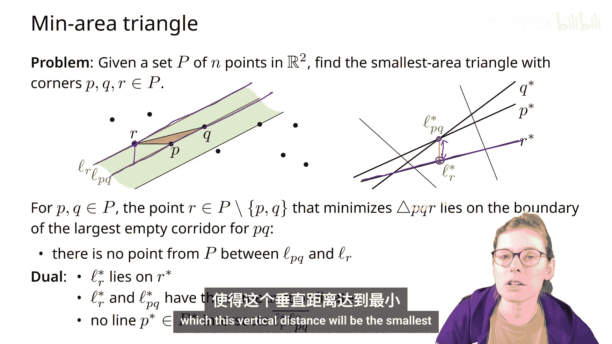
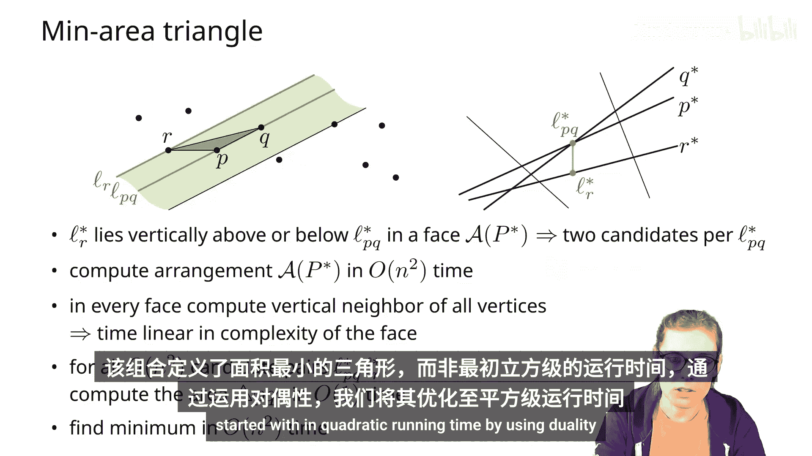
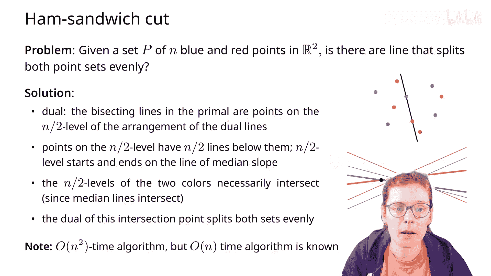
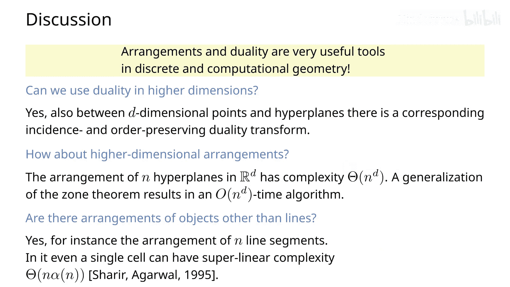

# 011：线排列 📐

在本节课中，我们将学习**线排列**的概念、其性质、表示方法以及如何高效地构造它。我们还将探讨如何利用**对偶性**，将点集问题转化为线排列问题，从而设计出更高效的算法。

## 线排列的定义

给定一组直线 **L**，由 **L** 中的直线诱导出的平面细分称为一个**线排列**。

一个线排列包含以下元素：
*   **面**：直线将平面切割成的区域。
*   **边**：直线被其他相交直线切割成的线段。
*   **顶点**：直线之间的交点。

通常，我们考虑**简单线排列**，即没有三条直线通过同一个点。

## 线排列的复杂度

首先，让我们分析一个简单线排列中顶点、边和面的数量。

**定理**：一个由 **n** 条直线构成的简单线排列具有以下数量的顶点、边和面。

我们来逐一推导这些值。

**顶点数量**：在简单线排列中，每个顶点由恰好两条直线相交定义。因此，顶点总数等于直线对的数量，即组合数 **C(n, 2)**。
`顶点数 = n * (n - 1) / 2`

**边的数量**：每条直线被其他 **n-1** 条直线切割，因此每条直线被分成 **n** 段。总共有 **n** 条直线。
`边数 = n * n = n²`

**面的数量**：我们可以使用欧拉公式。但线排列中的直线延伸至无穷远。我们可以通过引入一个额外的“无穷远点”，将所有直线的延伸段连接到该点，从而将线排列转化为一个有限的平面图。

在这个新的平面图中：
*   顶点数 = 原顶点数 + 1
*   边数 = **n²** (未改变)
*   面数 = **F** (待求)

应用欧拉公式 **V - E + F = 2**：
`(n*(n-1)/2 + 1) - n² + F = 2`

解出 **F** 并简化：
`F = n² - (n*(n-1)/2 + 1) + 2 = (n² + n)/2 + 1 = n*(n+1)/2 + 1`

**完整的定理陈述**：一个由 **n** 条直线构成的简单线排列有 **n*(n-1)/2** 个顶点，**n²** 条边，以及 **n*(n+1)/2 + 1** 个面。

## 线排列的表示：双向连接边表

为了表示线排列，我们将使用**双向连接边表**数据结构。它用于描述平面图的顶点、边和面。

*   每条无向边 **E** 用一对**有向半边**表示。
*   每条从起点指向终点的半边 **e**，都有一个反向的**孪生半边** `twin(e)`。
*   半边 **e** 的**左侧面** `face(e)` 是位于该有向边左侧的面。
*   每个面可以访问其边界上的一个半边。
*   每个顶点可以访问从其出发的一条半边。

通过遍历 `next(e)` 和 `prev(e)` 指针，可以环绕一个面的边界（逆时针方向）。通过 `twin(e)` 指针，可以在顶点处访问其他出边。

## 构造线排列

现在我们知道如何用双向连接边表表示线排列，接下来看看如何构造它。

一个直观的方法是应用**直线求交算法**，找出所有交点，然后构建排列。这需要 **O(n² log n)** 的时间。

我们能否做得更好？答案是肯定的。

### 增量构造算法 🛠️

我们将使用**增量构造法**来构建双向连接边表。

1.  **初始化**：计算一个足够大的包围盒，使其包含所有直线的交点。
2.  **逐线插入**：将直线一条一条地插入当前的数据结构中。
3.  **更新结构**：对于新插入的直线 **Lᵢ**：
    *   首先，找到 **Lᵢ** 与包围盒边界的**最左侧交点**。
    *   然后，沿着 **Lᵢ** 穿过的面进行遍历。
    *   每当 **Lᵢ** 与当前面的某条边相交时：
        *   在该交点处分割这条边。
        *   插入代表 **Lᵢ** 在当前面内线段的两条新半边。
        *   移动到下一个被 **Lᵢ** 穿过的面。
    *   重复此过程，直到到达包围盒的另一侧边界。

**算法时间复杂度分析**：
*   初始化包围盒需要 **O(n²)** 时间。
*   查找新直线 **Lᵢ** 的起始交点需要 **O(i)** 时间。
*   遍历 **Lᵢ** 穿过的所有面（即上图中的红色路径）所需时间，正比于这些面的边界总长度。

为了分析总时间，我们需要引入**区域**的概念。

## 区域定理

对于一个给定的线排列和一条不属于该排列的直线 **L**，定义**区域**为所有被直线 **L** 穿过的面的集合。

**区域定理**：对于一个由 **n** 条直线构成的排列（不必是简单的），以及一条不属于该排列的直线 **L**，其区域的边界边数最多为 **10n**。

**证明思路（简述）**：
为简化，假设 **L** 是水平的。我们将面的边界边分为**左边界边**和**右边界边**。只需证明左边界边数 ≤ **5n**，由对称性可知右边界边数也 ≤ **5n**，故总数 ≤ **10n**。

采用增量构造思想，按 **L** 从左到右的交点顺序插入与 **L** 相交的直线。可以证明，每插入一条新直线，最多增加 **5** 条左边界边。因此，对于 **n** 条直线，左边界边总数 ≤ **5n**。

**推论**：回到增量构造算法，插入第 **i** 条直线的时间复杂度为 **O(i)**。因此，构造整个线排列的总时间复杂度为：
`O(1 + 2 + ... + n) = O(n²)`

## 应用：利用对偶性解决问题

上一节我们介绍了对偶性，本节我们来看看如何利用线排列和对偶性解决几何问题。

### 问题一：三点共线检测
**原始问题**：给定平面上 **n** 个点，判断是否存在三个点共线。
**对偶转换**：转换为判断 **n** 条直线是否交于一点。
**算法**：增量构造这 **n** 条直线的排列。在构造过程中，一旦发现三条（或更多）直线交于同一点，即可停止。时间复杂度为 **O(n²)**，优于原始的 **O(n³)** 枚举算法。

### 问题二：寻找最小面积三角形
**原始问题**：给定平面上 **n** 个点，找出由三个点构成的最小面积三角形。
**关键观察**：设最小面积三角形为 **PQR**，边 **PQ** 所在直线为 **L_PQ**。过点 **R** 作 **L_PQ** 的平行线 **L_R**。那么带状区域 **L_PQ** 和 **L_R** 之间不能有其他点，否则会构成更小的三角形。
**对偶转换**：在对偶平面中，点对 **(P, Q)** 对应的直线 **L_PQ** 变为一个交点。点 **R** 变为一条直线 **R***。**L_R** 变为一个与 **L_PQ*** 具有相同 x 坐标的点。
**算法**：
1.  在对偶平面中构造 **n** 条直线的排列 (**O(n²)**)。
2.  对于排列中的每个顶点（对应原始空间的一条直线），在其正上方和正下方寻找最近的顶点（垂直距离对应原始三角形的高）。
3.  找出所有候选三角形中面积最小的一个。
总时间复杂度为 **O(n²)**，优于原始的 **O(n³)** 枚举算法。

### 问题三：火腿三明治分割
**原始问题**：给定平面上红蓝两种颜色的点集，找一条直线，将两种颜色的点都**平分**（即直线两侧每种颜色的点数相等）。
**对偶转换**：将点转换为对偶直线，并为直线赋予颜色（红或蓝）。
**关键观察**：
*   对于一种颜色（如红色），考虑所有斜率的直线。对于每个斜率，都存在一条穿过某个红色点的直线，能将剩余的红色点平分。这在对偶平面中意味着，对于每个 x 坐标，在红色直线排列中存在一个“中点”。
*   当我们在原始平面旋转直线时，在对偶平面中相当于一条垂直线从左向右扫描。这条垂直线会经过红色直线排列的不同“中点”，这些中点构成了红色直线的 **n/2 层**（即恰好有 **n/2** 条直线在其下方的点的集合）。
**算法**：
1.  构造所有对偶直线的排列 (**O(n²)**)。
2.  分别找出红色直线和蓝色直线的 **n/2 层**。这两条折线必然相交。
3.  交点在对偶平面对应原始平面中一条同时穿过红点和蓝点、且平分两种颜色的直线。
该算法时间复杂度为 **O(n²)**。

## 扩展与总结

**对偶性的高维推广**：在 **d** 维空间中，点和超平面可以建立对偶关系，并保持关联性和顺序性。
**高维排列**：可以构造 **d** 维空间中 **n** 个超平面的排列，其复杂度为 **O(n^d)**。区域定理也可推广，从而得到 **O(n^d)** 的构造算法。
**其他对象的排列**：可以构造线段、圆等几何对象的排列。例如，线段排列中单个面的复杂度可能超过线性。

**本节课总结**：
在本节课中，我们一起学习了：
1.  **线排列**的定义及其基本性质（顶点、边、面的数量）。
2.  使用**双向连接边表**表示线排列。
3.  通过**增量构造算法**在 **O(n²)** 时间内构建线排列，并利用**区域定理**分析了其时间复杂度。
4.  通过三个经典问题（三点共线、最小面积三角形、火腿三明治分割），深入理解了如何利用**对偶性**将点集问题转化为线排列问题，从而设计出更高效的算法。

对偶性和线排列为我们提供了强大的工具，能够从新的视角审视几何问题，并常常能将高时间复杂度的问题降低到可接受的多项式复杂度。

