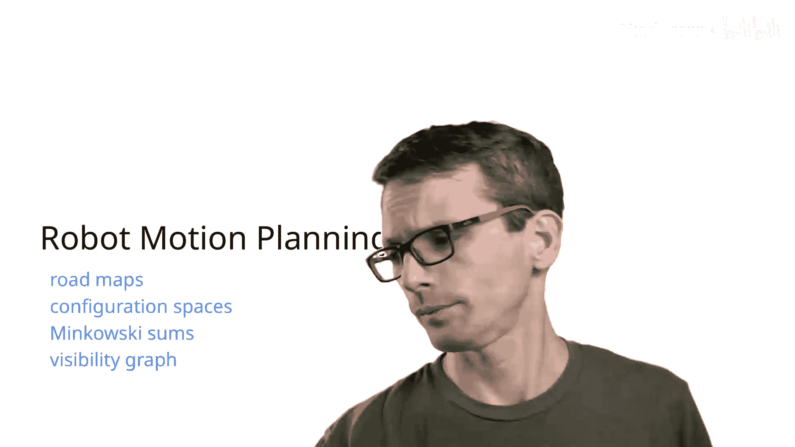
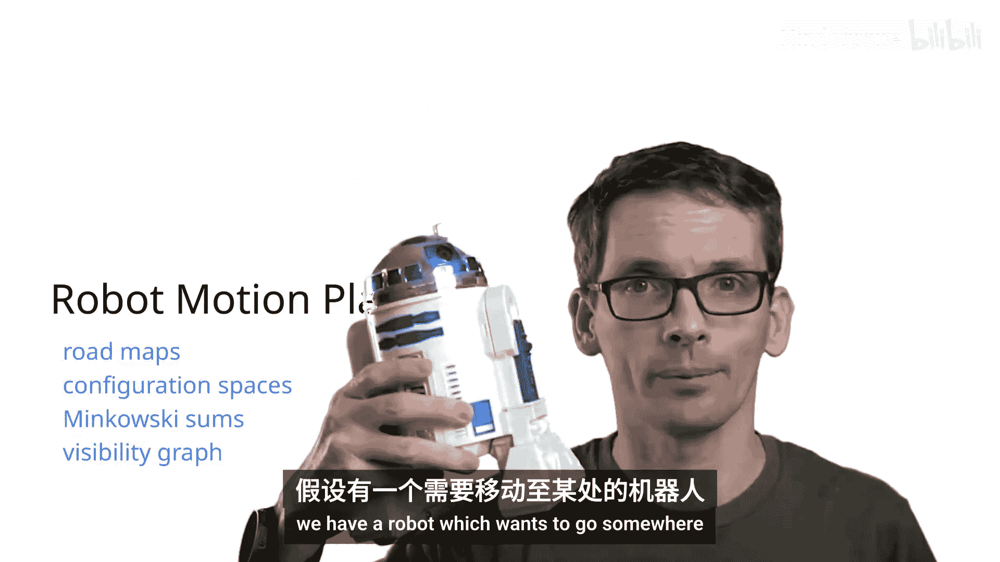
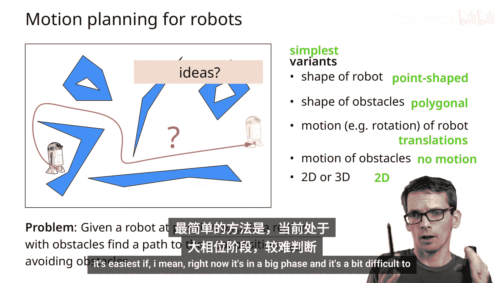
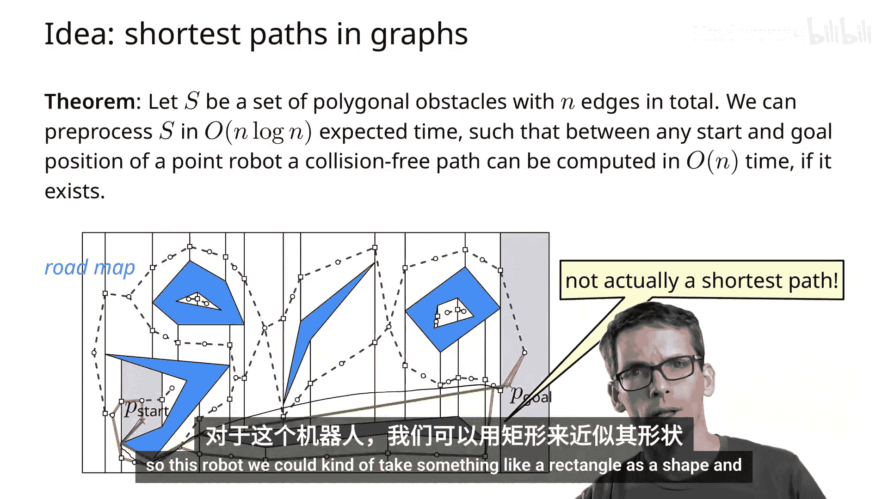
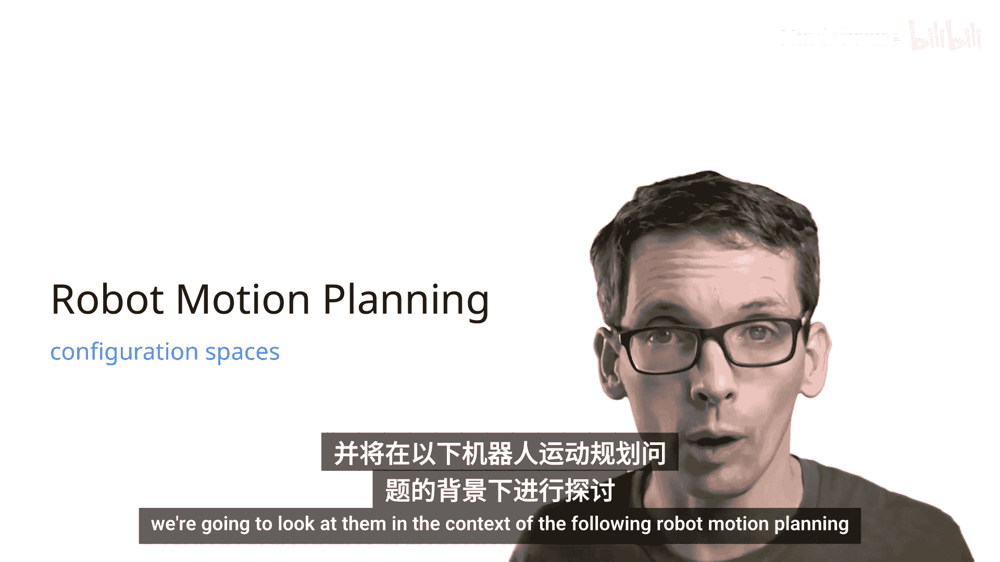
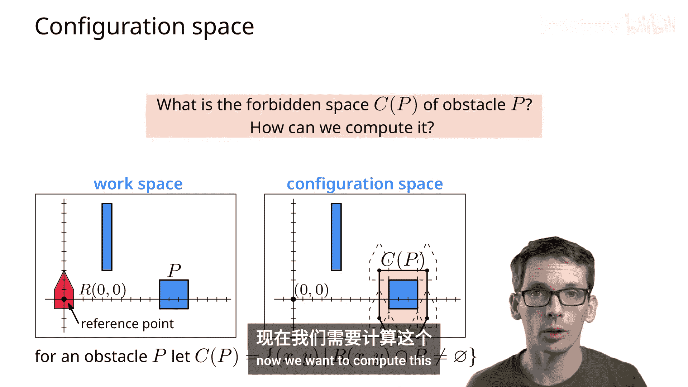

# 012：机器人运动规划 - 路线图与配置空间（1/3）🚀

在本节课中，我们将学习机器人运动规划的两个核心概念：**路线图**和**配置空间**。首先，我们会介绍这两个概念。接着，在计算配置空间的部分，我们将探讨**闵可夫斯基和**及其计算方法，以及如何计算它们的并集。最后，针对最短路径问题，我们将学习**可见性图**及其计算算法。

---

## 问题定义 🤖

我们有一个机器人，它需要从起点移动到目标点。这就是我们的核心问题。

给定一个处于起始位置的机器人，以及一个包含障碍物的区域。这个机器人需要找到一条避开障碍物、通往目标位置的路径。例如，一条像这样的路径。

对于这个问题，了解机器人的形状、障碍物的形状、机器人可以执行的运动类型（障碍物也可能移动）以及我们是在二维还是三维空间中工作，都是非常重要的。通常，我们可以考虑二维运动，因为对于许多机器人来说，第三维度并不增加太多复杂性，我们可以将其视为在一个二维平面内移动。

---

## 简化模型与解决方案 💡

最简单的变体是：假设我们的机器人只是一个**点**，障碍物是多边形的。机器人只能进行**平移**运动（对于一个点状机器人来说，形状无关紧要），障碍物不移动，并且我们始终考虑二维情况。

那么，如何解决这个问题呢？利用已有的几何工具，我们可以解决它。我们需要确保机器人绕过障碍物。最直接的方法是将其简化为**图论中的最短路径问题**。

这就是我们接下来要介绍的**路线图**方法。我们不再让机器人在空间中自由移动，而是构造一个图，然后无论机器人想移动到何处，其移动都将在这个图上进行。

---

## 构建路线图 🗺️

为了计算这个图，我们将使用**垂直分解**方法。

以下是构建步骤：
1.  计算障碍物线段的垂直分解。
2.  移除所有位于障碍物内部的部分，得到整个自由空间的垂直分解。
3.  在每个梯形面（trapezoid）的中心添加一个顶点。
4.  在每个垂直延伸线段的中心也添加一个顶点。
5.  将每个面与其边界上的垂直延伸顶点连接起来。

这样构建的图，就是用于机器人导航的**路线图**。

接下来，我们需要定位包含起点的梯形面和包含目标点的梯形面。然后，机器人只需在图中从起点顶点移动到目标顶点，寻找最短路径即可。例如，可以使用广度优先搜索。

如上图所示，机器人从起点顶点出发，经过一系列梯形面和垂直延伸顶点，最终到达目标顶点。这就是一条可行的路径。

---

## 算法正确性与时间复杂度 ⏱️

**算法正确性**：我们需要确保如果存在一条路径，算法就能找到它，并且找到的路径不会碰撞障碍物。由于梯形面是凸的，从面内一点到同面内另一点的线段完全位于该面内，因此不会碰撞障碍物。同理，路径上所有线段都位于自由空间的梯形面内，所以整个路径是安全的。反之，如果存在一条实际路径，它必然穿过一系列梯形面，那么在路线图中也存在一条对应的顶点序列路径。

**时间复杂度**：对于一个总复杂度为 N 的场景，各步骤的时间复杂度如下：
*   计算垂直分解：`O(N log N)`
*   移除障碍物内部部分：`O(N)`
*   基于垂直分解构建图：`O(N)`
*   定位起点和目标点：`O(log N)`
*   寻找最短路径（如BFS）：`O(N)`

因此，总体时间复杂度为 `O(N log N)`。

**总结**：对于具有 N 条边的多边形障碍物，我们可以通过 `O(N log N)` 的预处理，为一个点状机器人计算出从起点到目标点的无碰撞路径（如果存在）。这条路径是图中经过梯形面数量最少（或按边数计最短）的路径，但**不一定是实际几何距离最短的路径**。

---

## 扩展到多边形机器人 📦

然而，大多数机器人并不是一个点。用一个多边形（例如矩形）来近似机器人的形状更为合理。

接下来，我们将探讨如何处理这种情况。核心是引入**配置空间**的概念。

---

## 配置空间 🧭

我们考虑以下机器人运动规划问题：

与之前相同，但现在机器人具有多边形形状。我们假设障碍物也是多边形，机器人只允许平移（暂不考虑旋转），障碍物不移动，且为二维情况。问题是：一个多边形机器人能否从起始位置移动到目标位置，并避开中间的多边形障碍物？

为了解决这个问题，我们需要**配置空间**的概念。

*   **工作空间**：这是实际存在障碍物和机器人的空间。图中蓝色为障碍物，红色为机器人。
*   **配置**：指机器人的一个状态。在我们的设定中（仅平移），配置完全由机器人的位置决定。例如，可以用机器人上的一个参考点（如图中黑点）的坐标 `(x, y)` 来描述。
*   **自由度**：描述一个配置所需参数的个数。对于二维平移，自由度是 **2**（x 和 y 坐标）。如果加上旋转，自由度是 **3**（x, y, 角度）。对于三维平移，自由度是 **3**；三维平移加旋转（如无人机），自由度是 **6**。

**小测验**：下图中的机器人有多少自由度？

答案是 **2**（两个关节的角度）。

*   **配置空间**：一个空间，其维度等于机器人的自由度。对于二维平移，它是一个二维空间，每个点 `(x, y)` 对应机器人一个可能的位置（配置）。

---

## 配置空间中的障碍物 🚧

为了在配置空间中进行计算，我们需要将工作空间中的障碍物“映射”到配置空间中。

我们希望：在配置空间中存在一条路径，当且仅当在工作空间中存在一条无碰撞路径。

*   **禁止空间**：在配置空间中，所有会导致机器人与障碍物发生碰撞的配置点的集合。
*   **自由空间**：配置空间中禁止空间的补集，即机器人可以安全存在的所有配置点的集合。

那么，自由空间（或禁止空间）是什么样子的呢？观察工作空间，当机器人的参考点位于某个位置时，如果机器人与障碍物相交，则该位置属于禁止空间。直观上，对于单个障碍物，其对应的禁止空间就像是该障碍物被“膨胀”了，膨胀的形状和大小与机器人的形状有关。

上图中，红色区域就是该障碍物在配置空间中对应的禁止空间。其顶点对应于机器人与障碍物边缘接触的临界位置。

从数学上描述，对于一个障碍物 `O`，其禁止空间 `C-obstacle(O)` 是：
`{ (x, y) | 机器人位于 (x, y) 时与障碍物 O 相交 }`

为了计算这个集合，我们将引入并运用**闵可夫斯基和**的概念。

---

## 本节课总结 📝

在本节课中，我们一起学习了：
1.  **路线图方法**：通过垂直分解将连续空间离散化为图，从而将路径规划问题转化为图上的最短路径搜索问题，适用于点状机器人。
2.  **配置空间概念**：为了处理有形状的机器人，我们将问题从工作空间转换到配置空间。配置由自由度参数定义，配置空间中的点对应机器人的一个状态。
3.  **核心目标**：在配置空间中，我们需要计算**禁止空间**（所有会导致碰撞的配置）和**自由空间**（所有安全配置）。自由空间中的路径对应工作空间中的无碰撞路径。

下一节，我们将深入探讨如何利用**闵可夫斯基和**来高效计算配置空间中的障碍物。