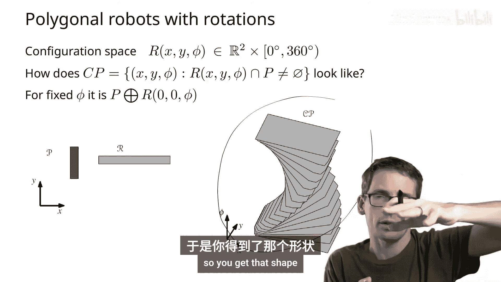
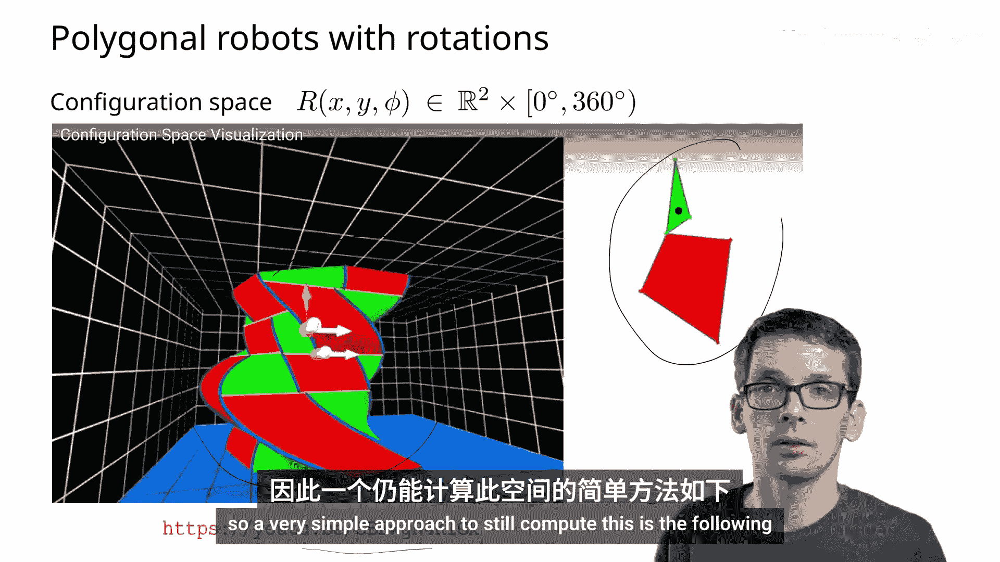
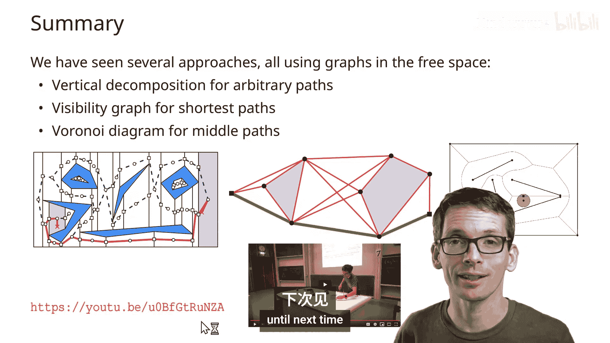

# 014：机器人运动规划-旋转机器人_可见性图（3部分之3）

在本节课中，我们将学习如何处理一个既能平移又能旋转的机器人的运动规划问题。我们将探讨其配置空间、处理旋转的简化方法，并介绍如何使用可见性图来计算最短无碰撞路径。

---

## 配置空间与旋转

上一节我们讨论了仅能平移的机器人。本节中，我们来看看当机器人也能旋转时，情况会发生什么变化。

我们的场景设定如下：我们仍然有一个多边形机器人和多边形障碍物。但现在，机器人除了可以平移，还可以旋转。障碍物保持静止，我们仍在二维空间中工作。

机器人的配置空间现在包含两个平移自由度（x, y）和一个旋转自由度（角度θ）。因此，配置空间是 **R² × [0, 2π)**。

对于一个固定的旋转角度θ，障碍物对应的禁止空间，就是该角度下机器人与障碍物的闵可夫斯基和。当角度θ连续变化时，禁止空间在三维配置空间中会形成一个复杂的曲面。

## 处理旋转的简化方法

由于精确处理三维配置空间非常复杂，我们采用一种简化的方法：对旋转角度进行离散化。

具体步骤如下：
1.  我们在旋转角度维度上取一系列水平“切片”。
2.  对每个固定的角度切片，我们将其视为一个纯平移问题，并为其计算一个路线图（例如，使用梯形图分解法）。
3.  最后，我们需要将这些切片连接起来。

以下是连接两个相邻切片（角度为θᵢ和θᵢ₊₁）的方法：
*   计算这两个切片对应的禁止空间区域的叠加图。
*   对于叠加图中同时属于两个切片自由空间的每个公共单元，我们在路线图中添加一条边，连接这两个切片。

然而，这种方法可能引入两种错误：
1.  **连接错误**：两个切片在某个区域都是自由的，但在它们之间的连续旋转过程中，机器人可能会撞上障碍物。这是我们必须避免的危险错误。
2.  **离散化错误**：可能存在一条路径，但需要某个特定的、未被我们采样的旋转角度才能通过（例如，恰好挤过一个狭窄通道）。如果通道有微小的裕度，通过足够精细的角度采样可以近似解决此问题。

为了避免第一种连接错误，我们可以稍微“膨胀”机器人的尺寸。这样，如果在连续旋转的中间状态会发生碰撞，那么在至少一个离散切片中，这个膨胀后的机器人就会与障碍物相交，从而在路线图中反映出该路径不可行。

## 可见性图与最短路径

现在，我们转向另一个问题：如何找到从起点S到终点T的**最短**无碰撞路径，而不仅仅是任意一条路径。使用梯形图分解得到的路径通常不是最短的。为此，我们引入**可见性图**。

一个关键的观察是：对于点机器人，从S到T的最短路径是一条折线，其所有中间顶点都是障碍物的顶点。

基于此，我们可以构建可见性图：
*   **顶点**：所有障碍物的顶点，以及起点S和终点T。
*   **边**：连接两个顶点，当且仅当连接它们的线段不穿过任何障碍物的内部（允许接触边界）。边的权重就是线段的长度。

这样，从S到T的最短无碰撞路径，就是在这个加权可见性图中从S到T的最短路径。我们可以使用Dijkstra等算法求解。

### 算法步骤与复杂度
1.  **构建可见性图**：最朴素的方法是检查所有顶点对（O(n²)对），每对检查是否与O(n)条障碍物边相交，总复杂度为O(n³)。
2.  **计算最短路径**：在具有m条边的可见性图上运行Dijkstra算法，复杂度为O(n log n + m)。

我们可以用更高效的方法（如旋转扫描线算法）为每个顶点计算其所有可见顶点，耗时O(n log n)。对n个顶点都这样做，总复杂度为**O(n² log n)**，这优于O(n³)。

对于**凸多边形**且仅能**平移**的机器人，我们可以先计算其配置空间（通过闵可夫斯基和），然后在配置空间中使用上述点机器人的可见性图方法，同样可以在O(n² log n)时间内找到最短路径。

---

## 总结

本节课中我们一起学习了：
1.  对于能**平移和旋转**的机器人，其配置空间是三维的。我们可以通过对旋转角度离散化，并在二维切片上构建和连接路线图来近似处理。
2.  为了找到**最短路径**，我们引入了**可见性图**的概念。对于点机器人，最短路径的顶点必然是障碍物的顶点，因此可以在可见性图上用图最短路径算法求解。
3.  构建可见性图的高效算法复杂度为O(n² log n)。此方法也可推广到处理凸多边形平移机器人的最短路径规划。

此外，我们还简要提到了使用**Voronoi图**来寻找与障碍物保持最远距离的“中道”路径。