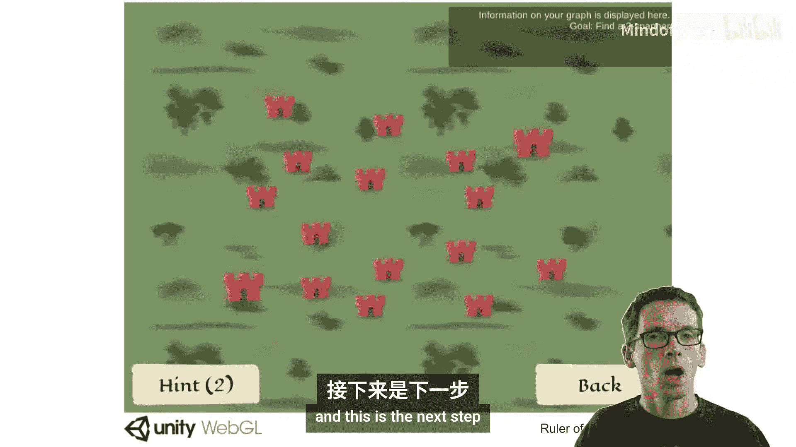
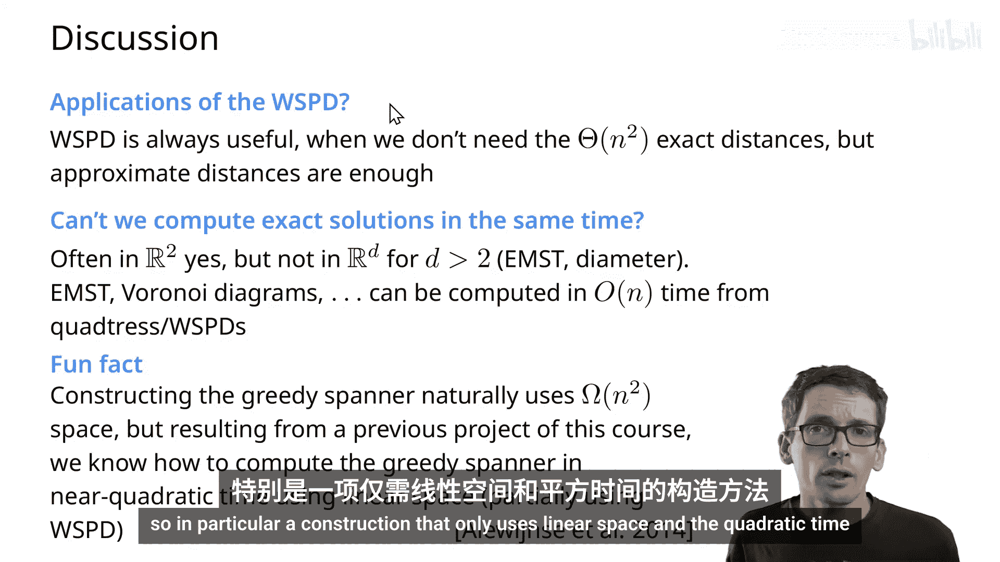

# 015：良好分离对分解和生成树




在本节课中，我们将学习一个用于设计几何近似算法的强大工具：良好分离对分解。我们的主要动机是构建几何生成树，这是一种稀疏图，能够以较小的绕路代价近似所有点对之间的欧几里得距离。

---

## 几何生成树简介

上一节我们介绍了本课程的主题。本节中，我们来看看几何生成树的具体概念。

想象一个场景：我们需要连接平面上的一组城市（点），构建一个道路网络。我们希望这个网络既紧凑（边数少），又能保证任意两个城市之间的路径长度不会比它们之间的直线距离长太多。这种图被称为 **T-生成树**。

以下是构建此类生成树的一种常见思路：

*   **贪婪构造法**：按点对距离从小到大排序，依次考虑每条边。如果当前点对之间在已构建的图中没有足够短的路径（长度超过 `T` 倍欧氏距离），则添加这条边。否则跳过。

这种方法虽然能产生性质优良的生成树，但需要预计算所有点对距离（`O(n²)` 空间和时间），且每次判断是否需要添加边时都需要计算最短路径，效率较低。

---

## 良好分离对分解

为了更高效地构建生成树，我们引入 **良好分离对分解** 的核心概念。

### 定义：良好分离对

首先，我们定义什么是“良好分离”的两个点集 `A` 和 `B`。

我们说点集 `A` 和 `B` 是 **S-良好分离** 的，如果存在两个半径均为 `r` 的球（或圆盘）分别完全包含 `A` 和 `B`，并且这两个球中心之间的距离至少为 `S * r`。

用公式描述：
```
dist(disk(A), disk(B)) >= S * r
```
其中 `disk(A)` 和 `disk(B)` 是分别包含 `A` 和 `B` 的最小包围球，`r` 是这两个球的半径（我们要求半径相同）。

直观上，这意味着两个点集彼此“远离”，其内部点之间的距离远小于两个点集之间的距离。

### 定义：良好分离对分解

对于一个点集 `P`，其 **S-良好分离对分解** 是一个由 `{A₁, B₁}, {A₂, B₂}, ..., {A_m, B_m}` 组成的集合，满足以下条件：

1.  对于每个 `i`，`A_i ⊆ P`，`B_i ⊆ P`，且 `A_i ∩ B_i = ∅`。
2.  对于每个 `i`，`A_i` 和 `B_i` 是 S-良好分离的。
3.  对于 `P` 中任意两个不同的点 `p` 和 `q`，存在唯一的 `i`，使得 `p ∈ A_i` 且 `q ∈ B_i`，或者 `p ∈ B_i` 且 `q ∈ A_i`。

换句话说，这个分解将 `P` 中所有 `n(n-1)/2` 个点对，分配到了 `m` 个良好分离的对 `{A_i, B_i}` 中。每个点对恰好属于一个“分离对”。我们的目标是使分解的大小 `m`（即分离对的数量）尽可能小，理想情况下是 `O(n)`。

---

## 使用四叉树构造分解

现在，我们来看如何利用 **四叉树** 来构造良好分离对分解。

### 四叉树与压缩四叉树

首先回顾四叉树：
*   四叉树递归地将空间（正方形）划分为四个相等的子正方形。
*   划分持续进行，直到每个格子中至多包含一个点。
*   树中的每个节点对应一个正方形，并关联其内的点集。

为了避免树深度过大（例如点非常接近时），我们使用 **压缩四叉树**。它压缩了那些不包含分叉（即只有一个子节点包含点）的路径，从而保证树的大小为 `O(n)`，并且可以在 `O(n log n)` 时间内构建。

对于树中的每个节点 `u`，我们定义：
*   `P_u`：节点 `u` 对应正方形内的点集。
*   `rep(u)`：节点 `u` 的**代表点**。对于叶节点，代表点就是其内的点（如果存在）；对于内部节点，代表点可以任意选择其某个子节点的代表点。这个选择需要保持一致。

### 分解算法

构造 S-良好分离对分解的算法是一个递归过程，输入是四叉树的两个节点 `u` 和 `v`（初始时均为根节点），输出是覆盖 `P_u` 和 `P_v` 之间所有点对的分离对集合。

以下是算法的伪代码描述：

```
function WSPD(u, v):
    if P_u 为空 或 P_v 为空:
        return ∅
    if u == v 且 u 是叶节点:
        return ∅
    if u 和 v 是 S-良好分离的:
        return {{u, v}} // 报告一个分离对
    else:
        // 确保 u 对应的正方形不小于 v 对应的正方形
        if level(u) < level(v):
            swap(u, v)
        // 拆分较大的正方形 u
        令 children(u) 为 u 的所有子节点
        result = ∅
        for each child w in children(u):
            result = result ∪ WSPD(w, v)
        return result
```

**算法解释**：
1.  **基准情况**：如果某个点集为空，或两个节点是同一个叶节点（即同一个点），则无需报告。
2.  **分离情况**：如果 `u` 和 `v` 对应的点集是 S-良好分离的，那么 `{u, v}` 就构成一个分离对。我们不需要列出 `P_u` 和 `P_v` 中的所有点，只需记录节点对 `(u, v)`，因为我们可以用它们的代表点来代表整个点集。
3.  **递归情况**：如果不满足分离条件，我们总是拆分较大的那个正方形（对应节点 `u`），然后递归地计算 `u` 的每个子节点与 `v` 之间的分解，最后合并结果。

**关键点**：分解的输出不是点集的列表，而是四叉树节点对的列表。每个节点对 `(u, v)` 代表了一个分离对 `(P_u, P_v)`。由于四叉树节点数量是 `O(n)`，这种表示非常紧凑。

---

## 分解的大小与构造时间

我们关心分解的大小 `m`（即节点对的数量）以及构造它的时间复杂度。

**定理**：对于 `d` 维空间中的 `n` 个点，以及参数 `S > 2`，可以构造一个大小为 `O(S^d * n)` 的 S-良好分离对分解，构造时间为 `O(n log n + S^d * n)`。

**证明思路（简述）**：
*   `O(n log n)` 部分来自构建压缩四叉树。
*   核心是证明分离对的数量为 `O(S^d * n)`。我们使用**记账法**。
*   在递归算法中，每次进入“递归情况”（第8行），我们都拆分节点 `u`，而节点 `v` 保持不变。我们让 `v` 为这次递归“负责”。
*   论证的关键是：对于任何一个固定的节点 `v`，它需要负责的递归次数（即与它配对并导致拆分的不同 `u` 的数量）是有限的。
*   由于 `u` 和 `v` 不满足 S-良好分离条件，可以推导出 `u` 对应的正方形中心必须位于以 `v` 为中心、半径约为 `O(S * side(v))` 的区域内（`side(v)` 是 `v` 对应正方形的边长）。
*   在这个区域内，边长不小于 `side(v)/2` 的、互不相交的正方形（对应四叉树节点）数量，受空间填充限制，最多为 `O(S^d)` 个。
*   因此，每个节点 `v` 最多负责 `O(S^d)` 次递归。由于共有 `O(n)` 个节点，总的递归次数（也即分离对数量）就是 `O(S^d * n)`。

---

## 从分解到生成树

有了良好分离对分解，我们可以非常简单地构造一个 T-生成树。

**构造方法**：
对于分解中的每一个分离对 `{A_i, B_i}`（由四叉树节点对 `(u_i, v_i)` 表示），我们在图中添加一条连接 `rep(u_i)` 和 `rep(v_i)` 的边。这条边的权重就是这两个代表点之间的欧几里得距离。

**定理**：设 `S = 4(T+1)/(T-1)`。那么，由上述方法从 S-良好分离对分解构造出的图 `G`，是一个 T-生成树。

**证明思路（归纳法）**：
*   考虑任意两点 `x` 和 `y`。它们必然属于分解中的某个分离对 `{A, B}`，设其代表点为 `p_A` 和 `p_B`。
*   我们构造一条从 `x` 到 `y` 的路径：`x ~ ... ~ p_A —— p_B ~ ... ~ y`。其中 `x ~ ... ~ p_A` 是 `x` 到其所在集合代表点 `p_A` 的路径（由归纳假设，其长度 ≤ `T * dist(x, p_A)`），`p_A —— p_B` 是我们添加的边，`p_B ~ ... ~ y` 是 `p_B` 到 `y` 的路径（长度 ≤ `T * dist(p_B, y)`）。
*   利用三角形不等式和良好分离的性质（`dist(x, y) ≥ S * r`，且 `dist(x, p_A)` 和 `dist(y, p_B)` 均 ≤ `2r`），可以将整个路径长度的上界表达为 `T * dist(x, y)` 的形式。代入 `S` 与 `T` 的关系式即可完成证明。

---

## 应用与总结

**参数选择示例**：如果我们想要一个 `(1+ε)`-生成树（即绕路因子为 `1+ε`），那么需要选择 `S = O(1/ε)`。此时，生成树的边数为 `O(n / ε^d)`，构造时间为 `O(n log n + n / ε^d)`。

**其他应用**：良好分离对分解不仅是构建生成树的工具，也是许多几何近似算法中的核心数据结构。它可以用于近似最近邻搜索、距离估计、构造稀疏图灵网络等。有趣的是，它与 Delaunay 三角剖分等结构在计算上存在深刻的等价关系。

**关于贪婪生成树的新进展**：值得一提的是，贪婪生成树构造法也有新的突破，现在已有算法能在 `O(n²)` 时间和线性空间内完成构造。



本节课中，我们一起学习了良好分离对分解的概念、基于四叉树的构造方法、其大小的理论界限，以及如何利用它来高效地构造具有理论保证的稀疏几何生成树。这是一个将复杂几何关系（所有点对距离）用线性规模数据结构进行近似表达的强大范例。