# 017：范围搜索 📐

在本节课中，我们将要学习**范围搜索**问题。这是一个关于如何高效地从一组预先给定的点中，找出所有落在指定矩形区域内的点的问题。我们将从简单的一维情况开始，逐步构建出能够处理二维乃至更高维查询的高效数据结构。

## 概述

接下来的两讲主题是**范围查询**和**窗口查询**。让我们从一个例子开始。

考虑一个存储员工信息的数据库，例如，我们存储了他们的年龄和薪水。有人可能会要求找出所有年龄和薪水都在特定范围内的员工。

如果我们在坐标系中绘制所有员工，一个轴表示出生日期，另一个轴表示薪水，那么这类问题就转化为所谓的**矩形范围查询**。每个员工用一个点表示，所有落在给定矩形内的员工就是我们要查找并报告的目标。

设计数据结构主要有两个原因。第一个原因是为了方便地访问数据，例如，我们使用双向连接边表数据结构来表示直线排列，以便轻松地在排列的面、边和顶点之间导航。第二个原因是为了预处理数据，以便能够非常快速地回答未来的查询，就像范围查询一样。我们希望处理所有已知的员工信息，以便之后能快速回答哪些员工落在给定的出生日期和薪水范围内。

接下来的两讲将关注第二种类型的数据结构。再次强调，目标是预处理给定数据，以便之后查询数据的速度远快于从头开始计算答案。

## 一维范围查询

和往常一样，让我们从解决一个更简单的一维版本问题开始，即**一维范围查询**问题。给定实线上的一组点，我们希望高效地回答一维范围查询，即报告所有落在给定查询区间内的点。

这些点是预先已知的，我们希望预处理它们。但查询范围是未知的。我们希望构建一个数据结构，对于任何范围，都能快速回答哪些点落在这个范围内。

解决此类问题的方案通常包含以下三个部分：
*   首先，设计数据结构。
*   其次，开发查询算法，根据我们设计的数据结构来回答问题。
*   最后，需要构建该数据结构的算法（给定输入点集）。在某些数据可能变化的情况下，我们可能还需要更新算法，以便在新点出现或某些点消失时更新数据结构。

在设计解决方案时，这些部分中哪些更重要？对于数据结构部分，我们关心其存储需求，即该数据结构占用多少空间。对于查询算法，我们关心查询运行的速度，即查询算法的运行时间。同样，对于构建算法，我们关心构建该数据结构的速度。最后，对于更新算法，我们关心更新过程的运行时间。这些因素中哪个更重要取决于具体的应用，这就是为什么我们可以设计多个查询数据结构来回答相同的问题，但在存储空间或查询运行时间之间提供权衡。

### 解决方案：平衡二叉搜索树

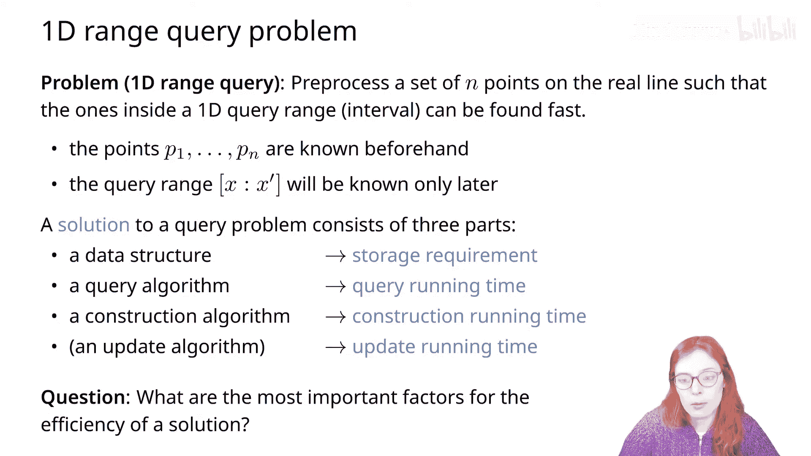

为了解决一维范围查询问题，我们可以使用一个**平衡二叉搜索树**，将点存储在其叶子节点中。

要报告所有落在给定范围内的点，我们可以执行对范围一端（例如左端点）的搜索，再对另一端（例如右端点）进行搜索，然后报告在这两个找到的点之间的所有叶子节点。

在下图中，我们用灰色高亮显示搜索算法访问过的所有节点，用黑色高亮显示我们需要报告的、位于这两条搜索路径之间的所有叶子节点。

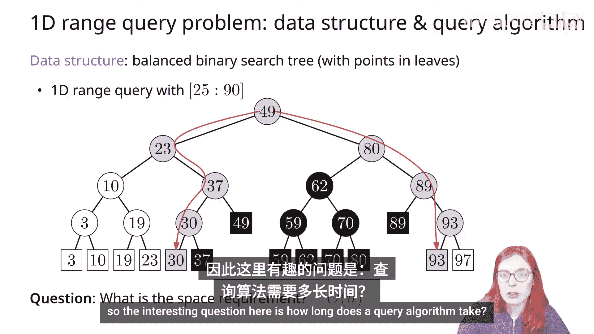

这里第一个简单的问题是：这个数据结构的空间需求是多少？我们已经知道平衡二叉搜索树占用线性空间。我们也知道构建平衡二叉搜索树的速度。所以这里有趣的问题是：查询算法需要多长时间？

### 查询算法分析

再次回顾，当我们执行查询时，树中有三种类型的节点：
*   **白色节点**：查询从未访问过的节点。
*   **灰色节点**：查询搜索路径上的节点。
*   **黑色节点**：位于两条搜索路径之间的节点。

当我们访问一个黑色节点时，我们知道它将导致我们需要输出的答案。但当我们处于一个灰色节点时，尚不清楚这个灰色节点是否会导致答案。

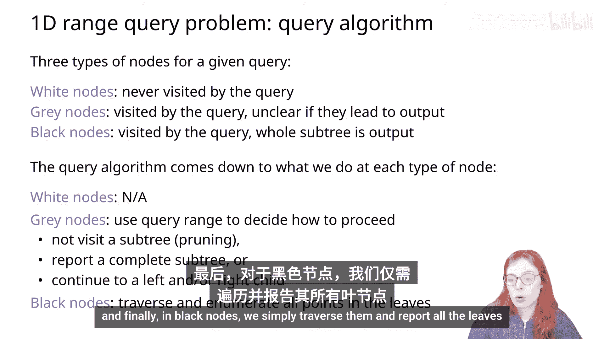

为了分析查询算法的运行时间，我们需要分析为白色、灰色和黑色节点所做的工作量。白色节点从未被访问，因此没有工作。对于灰色节点，我们使用查询范围边界来决定如何继续：我们可以决定剪枝一个由白色节点组成的子树；我们可以决定报告一个由黑色节点组成的完整子树；或者我们根据哪个子节点位于搜索路径上，继续向左或向右子节点前进。最后，对于黑色节点，我们只需遍历它们并报告所有叶子节点。

让我们考虑另一个例子。我们这里有相同的搜索树，但现在用另一个范围执行查询。对于范围 [61, 90]，我们搜索值 61，然后搜索值 90。有一段时间，这两条搜索路径可能沿着相同的路线，但在某个点它们会分叉。在这个例子中，它们在值为 80 的节点处分叉。一条搜索路径（搜索 61）转向左子节点，另一条转向右子节点。这个两条搜索路径分叉的节点被称为**分裂节点**。

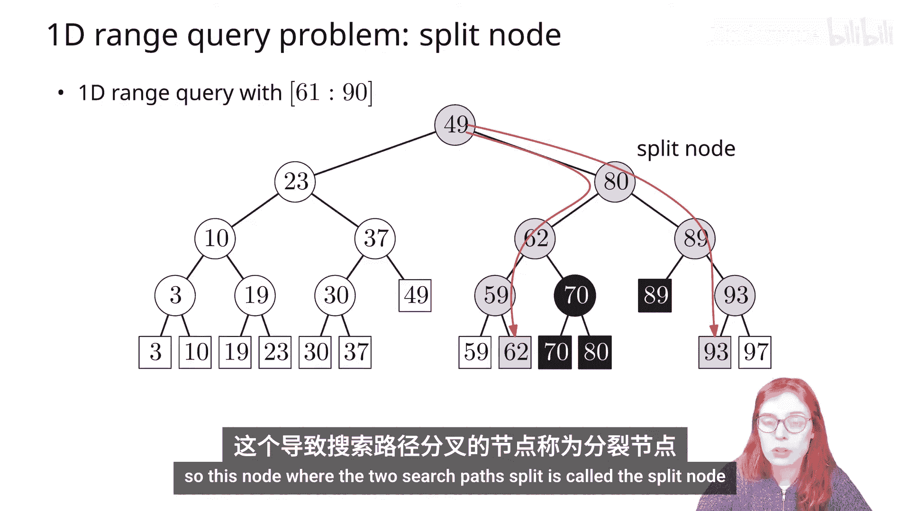

### 查询算法伪代码

我们可以给出以下查询算法的伪代码：

1.  **找到分裂节点**：沿着两条搜索路径前进，直到它们分叉。
2.  **检查分裂节点是否为叶子**：
    *   如果是叶子，则两条搜索路径从根到该叶子都沿着同一分支。我们只需检查该叶子是否需要报告（即是否落在范围内），然后结束。
3.  **如果分裂节点不是叶子（是内部节点）**，则执行以下操作：
    *   对于分裂节点的左子节点（称为 `V`），在循环中执行以下操作，直到 `V` 不是叶子：
        *   检查节点中存储的值是否大于等于范围的左边界（假设范围由 `x` 和 `x'` 给出）。
        *   如果范围的左端点小于等于节点中存储的值，则我们将递归到左子节点。但在递归之前，我们希望报告以 `V` 的右子节点为根的子树。
        *   否则（如果范围的左端点大于节点中存储的值），则我们简单地递归到右子节点。这里我们隐式地剪枝了以左子节点为根的子树（即完全由白色节点组成的子树）。
    *   当我们到达一个叶子节点（`V` 变成叶子）时，检查它是否需要报告，如果需要则报告。
    *   然后对范围的右端点 `x'` 重复相同的过程，但报告以左子节点为根的子树。

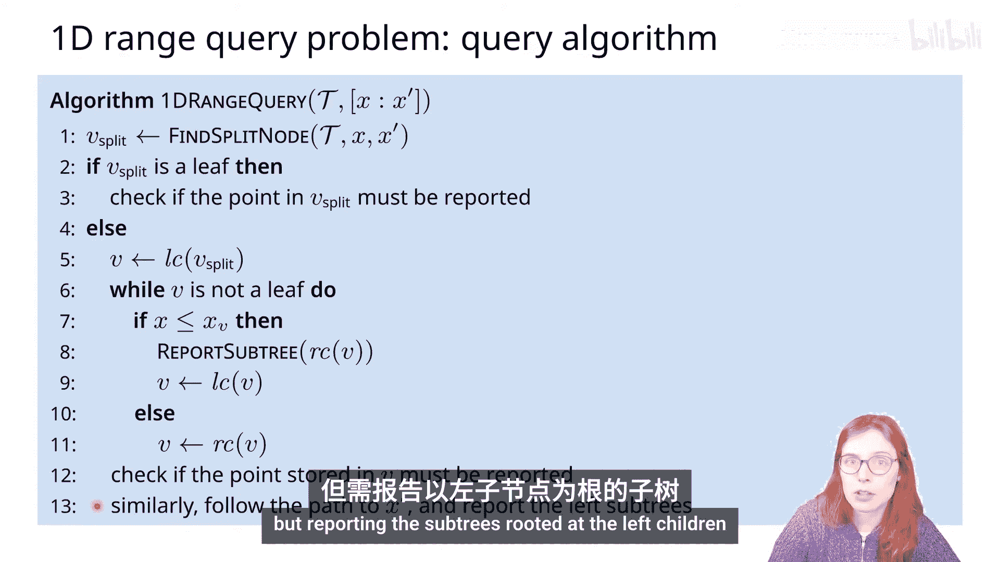

### 运行时间分析

我们现在可以正式分析这个算法的运行时间。我们需要做的就是计算访问了多少不同类型的节点，以及我们在每个节点上执行了多少工作。

*   **白色节点**：从未被访问，不花费时间。
*   **灰色节点**：位于搜索路径上的节点，会被访问，但不确定它们是否会导致需要报告的点。
*   **黑色节点**：整个子树需要被报告的节点。

灰色节点的数量将取决于输入点集的大小 `n`。黑色节点的数量将取决于输出结果的大小 `k`。因此，我们将运行时间表示为输入大小 `n` 和输出大小 `k` 的函数。

灰色节点只出现在两条搜索路径上，如果我们的树是平衡的，灰色节点的数量将是 `O(log n)`。

对于黑色节点，我们可以观察到：如果一个子树有 `M` 个叶子，那么它有 `M-1` 个内部节点。这意味着如果我们报告 `M` 个叶子，那么我们访问的其他黑色节点数量与 `M` 成线性关系。因此，如果 `k` 是我们报告的点数，那么我们访问 `O(k)` 个黑色节点。

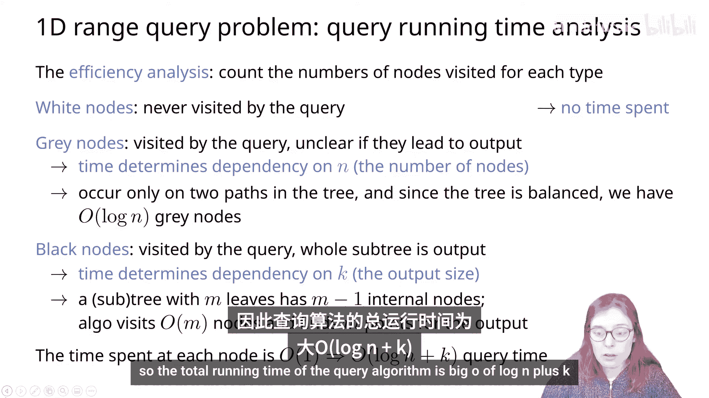

在每个灰色或黑色节点上花费的时间是常数。因此，查询算法的总运行时间是 **`O(log n + k)`**。

如前所述，预处理时间（构建给定数据结构所需的时间）在我们需要存储点的情况下是 `O(n log n)`，或者如果点已经按排序顺序给出，则是线性的。

### 一维范围查询总结

最后，我们可以得出结论：实线上的一组 `n` 个点可以在 `O(n log n)` 时间内预处理成一个线性大小的数据结构，使得一维范围查询可以在 `O(log n + k)` 时间内得到回答，其中 `k` 是报告答案的数量。

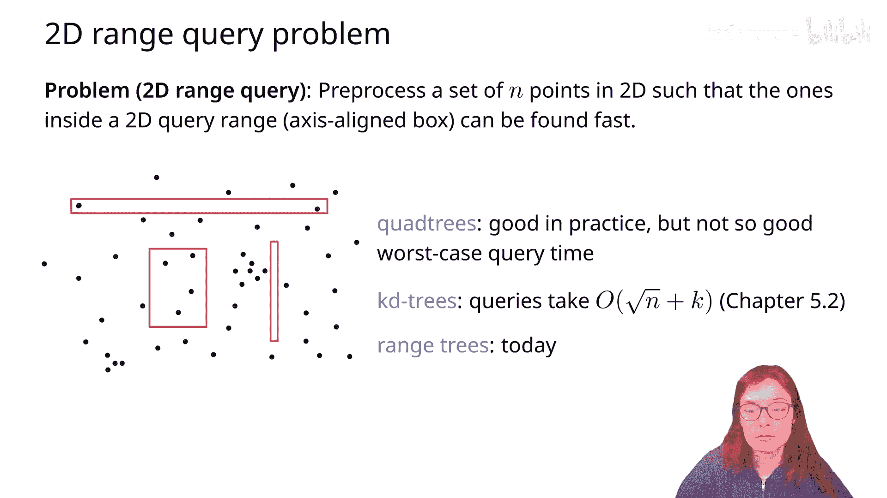

## 二维范围查询

现在让我们考虑二维范围查询问题：给定二维平面上的点集，我们希望报告所有落入二维查询范围（一个轴对齐的矩形）内的点。

你可能听说过的一些可以解决这个问题的数据结构是**四叉树**和**kd树**。四叉树在实践中通常表现良好，但在最坏情况下并非如此；kd树的查询运行时间与点数的平方根成正比。我们今天的目的是开发一种能提供更快查询运行时间的数据结构。

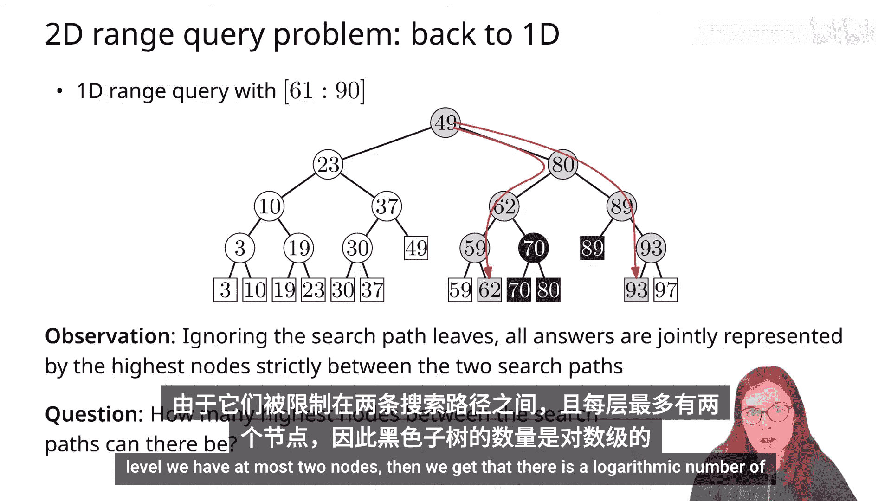

### 从一维到二维

为了设计二维范围查询的数据结构，让我们从我们已经开发的一维范围查询数据结构开始。

我们有一个将点存储在叶子中的二叉搜索树。这里一个有用的观察是：所有我们报告的点都位于这些黑色节点的子树中，这些黑色节点是严格位于两条搜索路径之间的最顶层节点。在这个例子中，我们有两个黑色子树，所有我们报告的黑色叶子都位于这些子树的并集中。

有多少个黑色子树的最顶层根节点？因为它们被限制在两条搜索路径之间，并且在每一层我们最多有两个节点，所以我们得到黑色子树的数量是对数级的。

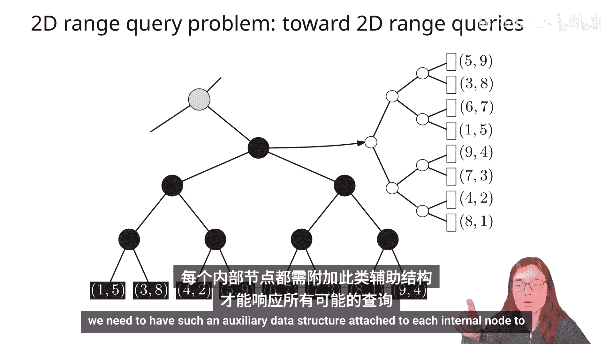

因此，对于任何一维范围查询，我们可以识别出对数数量的节点，它们共同代表了一维范围查询的所有答案。

这意味着对于二维范围查询，我们可以识别出对数数量的节点，它们共同代表了所有具有正确第一坐标（X坐标）的点。

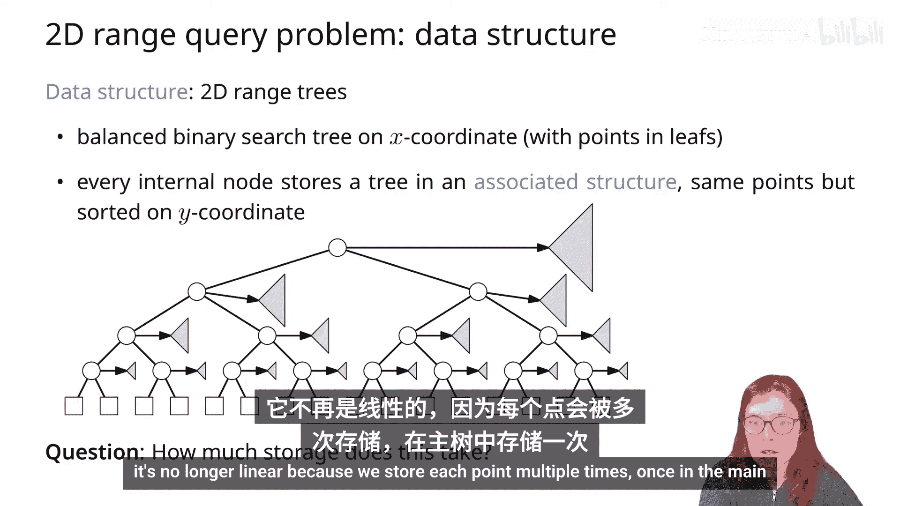

所以，如果我们在第一坐标上构建二叉搜索树，我们就可以表示所有落在给定第一坐标（X坐标）范围内的点。现在，我们不是报告所有这些点，而是需要找出如何过滤掉Y坐标落在感兴趣范围之外的点。

如果我们简单地检查每个黑色叶子是否落在范围内，这将太慢——我们可能在黑色节点数量上花费线性时间，却什么也不报告。我们需要更聪明的方法，我们将存储一个额外的数据结构，该结构将从那些最顶层的黑色节点引用。

因此，我们将有一个**辅助数据结构**，它包含构成给定子树叶子的所有相同点，并使我们更容易在Y坐标上搜索。我们可以再次使用一维范围查询结构，但现在按Y坐标排序。当然，现在我们需要将这样的辅助数据结构附加到每个内部节点，以便能够回答所有可能的查询。

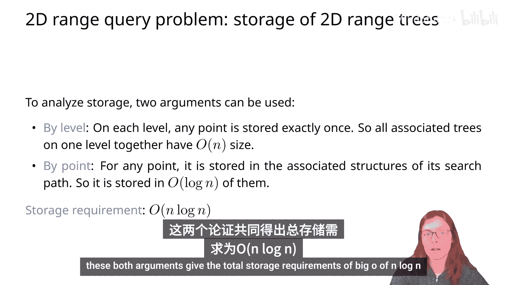

### 二维范围树结构

因此，二维范围查询问题的数据结构将由以下部分组成：一个基于X坐标的二叉搜索树，其中每个内部节点都有一个指向**关联结构**的指针，该关联结构存储了以该节点为根的子树中的所有相同点，但这些点现在按它们的Y坐标排序。

这个数据结构占用的空间不再是线性的，因为我们多次存储每个点：一次在主树中，也在关联结构中。

有两种方法分析这种数据结构的存储需求：
1.  **按层分析**：在每一层，每个点最多只存储一次。如果它是主结构中的叶子，则只存储在那里；如果是内部节点，则该点存储在关联数据结构中，但不在同一层的任何其他关联结构中。因此，在一层中我们存储线性数量的点。
2.  **按点分析**：对于任何点，它只存储在主树中或从该点到根的路径上所有内部节点的关联结构中。因此，每个点最多存储 `O(log n)` 次。

这两种分析都得出了总存储需求为 **`O(n log n)`**。

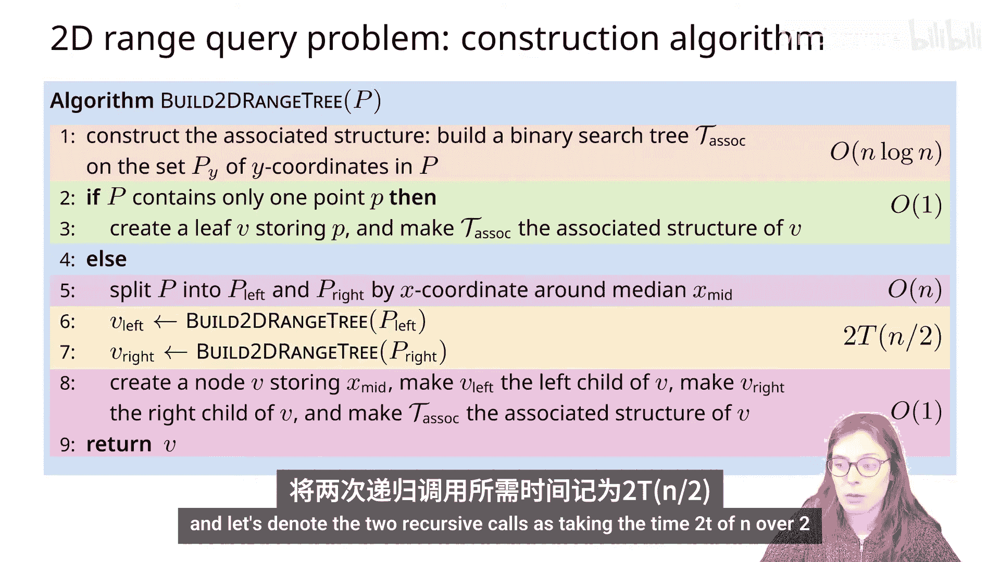

### 构建算法

二维范围树的构建算法如下：

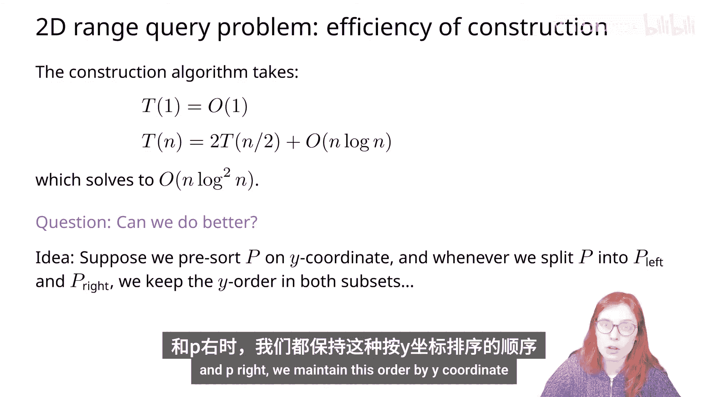

对于给定的点集 `P`：
1.  构建关联结构：一个基于Y坐标的二叉搜索树，将所有点存储在叶子中（不仅仅是Y坐标，而是整个点）。
2.  如果点集 `P` 只包含一个点，则创建一个叶子节点，将该点存储在该叶子中，并使其指向创建的关联结构。
3.  如果 `P` 包含多于一个点，则按X坐标的中位数将点集分成两个子集 `P_left` 和 `P_right`。
4.  对 `P_left` 和 `P_right` 集合作两次递归调用，算法将返回节点 `v_left` 和 `v_right`。
5.  创建一个节点 `v`，存储X坐标的中位数值，使 `v_left` 为其左子节点，`v_right` 为其右子节点，并创建关联数据结构作为 `v` 的关联结构。
6.  最后返回 `v`。

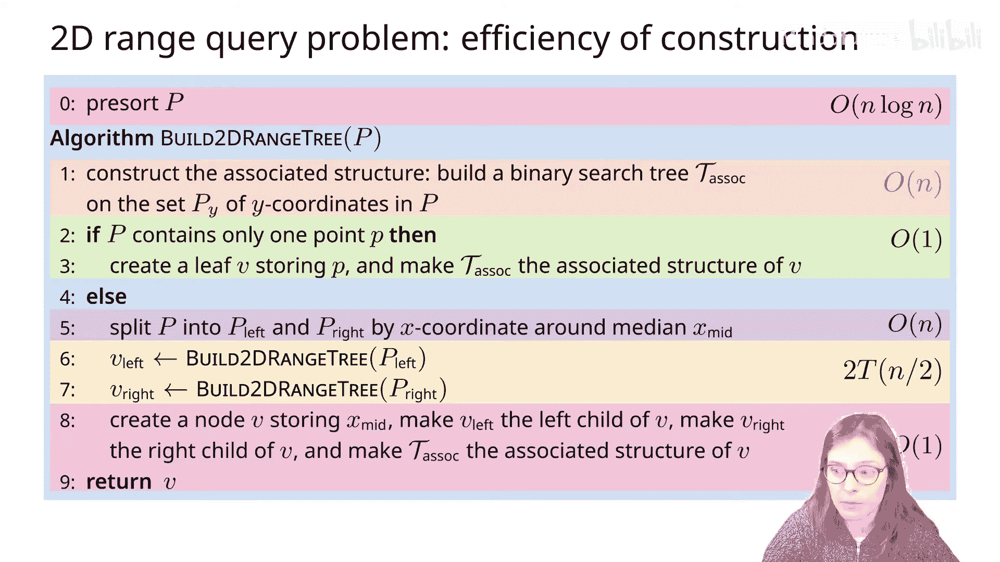

这个递归算法将在输入点集上构建一个二维范围树。

现在让我们分析它的运行时间：
*   创建节点和指针需要常数时间。
*   创建关联结构需要 `O(n log n)` 时间（如果 `n` 是输入大小）。
*   将点集分成两个子集需要线性时间。
*   两次递归调用各花费 `T(n/2)` 时间。

因此，构建算法的运行时间由以下递归公式给出：
`T(n) = 2 * T(n/2) + O(n log n)`
解为 `O(n log² n)`。

我们总是问的问题是：我们能做得更好吗？让我们想想如何优化这个构建算法。这里的瓶颈是创建关联数据结构需要 `O(n log n)` 时间，因为每次创建数据结构时都需要按Y坐标对点进行排序。那么，如果我们不需要每次调用算法时都按Y坐标排序，而是预先按Y坐标对点进行排序，并且每当我们将点集拆分为 `P_left` 和 `P_right` 时，都保持这种按Y坐标的顺序呢？

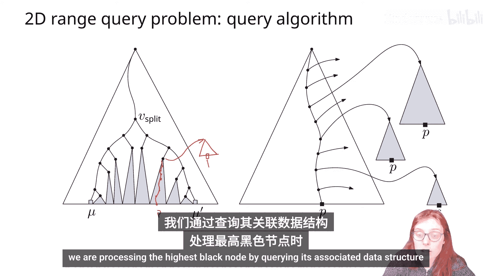

然后，我们用按Y坐标对点集进行预排序的步骤来增强相同的算法，这需要 `O(n log n)` 时间。然后，如果我们有点按Y坐标排序的顺序，那么创建关联数据结构只需要线性时间。

现在递归公式如下：
`T(n) = 2 * T(n/2) + O(n)`
解为 `O(n log n)`。考虑到预排序也需要 `O(n log n)` 时间，我们得到这种构建算法的总运行时间为 **`O(n log n)`**。

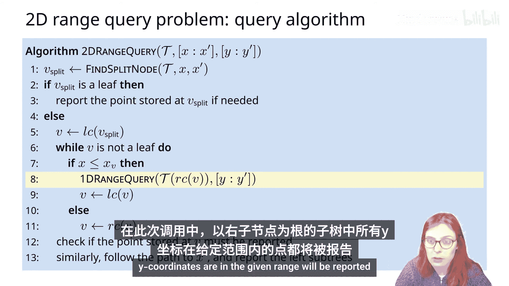

### 查询算法

现在让我们讨论二维范围树上的查询算法。首先，我们想回答查询是如何执行的，同时要确保找到所有需要报告的答案，并且不会多次报告同一个答案。

这里有一个二维范围查询问题的表示。在左侧，我们有顶层数据结构中的两条搜索路径，所有需要报告的树用灰色高亮显示。在右侧，我们显示同一个点 `p` 存储在从它到根的路径上的每一层的树中。因此，如果我们需要报告一个点 `p`，我们希望只报告一次，我们将在该点出现的最高层进行报告。因此，如果一个点 `p` 存储在这棵树中的某个地方，并且这是从它到包含该点 `p` 的最高黑色节点的路径，那么点 `p` 将存储在该路径上每个内部节点的关联数据结构中。因此，我们可以简单地通过查询其关联数据结构来处理最高黑色节点时报告 `p`。

以下是二维范围查询算法。输入是我们的二维范围树以及按X坐标和Y坐标给出的范围查询的两个维度。

伪代码几乎与一维范围查询完全相同，唯一的区别在于第8行：现在我们不是简单地报告以节点 `v` 的右子节点为根的所有节点，而是调用一维范围查询，使用Y坐标范围作为一维范围值，在 `v` 的右子节点的关联数据结构上进行查询。在这个调用中，所有以右子节点为根且Y坐标在给定范围内的点都将被报告。

### 查询运行时间分析

查询算法的运行时间取决于我们对关联结构进行多少次一维查询，即有多少次查询以及每次查询花费多少时间。

同样，搜索路径上将有对数数量的节点，并且我们将调用一维范围查询的黑色树的根节点也有对数数量。

因此，我们在对数数量的关联结构中执行一维范围查询。总查询运行时间则是 **`O(log n)`**（我们调用一维范围查询的次数）乘以查询时间，查询时间为 `O(log m + k')`，其中 `m` 是关联结构中存储的节点数，`k'` 是报告的节点数。

或者我们可以将其重写为所有最高黑色节点的 `O(log n_v + k_v)` 之和，其中 `n_v` 和 `k_v` 是给定黑色节点的节点数和报告的点数。所有的 `k_v` 加起来就是 `k`，即报告的点总数。

让我们看看这个运行时间的结果。再次，我们可以计算灰色和黑色节点的数量：
*   灰色节点的数量在原数据结构中是对数级的，在每个关联数据结构中也是对数级的。有 `O(log n)` 个关联数据结构，因此灰色节点的总数是 **`O(log² n)`**。
*   黑色节点的数量仍然是 `O(k)`，即被报告的节点数。

总结一下，灰色节点的数量是 `O(log² n)`，黑色节点的数量是 `O(k)`（如果 `k` 是被报告的点数）。这导致总查询时间为 **`O(log² n + k)`**。

### 二维范围查询总结

现在我们知道如何将平面上的 `n` 个点在 `O(n log n)` 时间内预处理成一个大小为 `O(n log n)` 的数据结构，使得二维范围查询可以在 `O(log² n + k)` 时间内得到回答，其中 `k` 是报告的点数。

二维范围树与例如kd树之间的权衡在于大小和查询运行时间：kd树具有线性存储大小，但查询运行时间较慢。因此，如果你的应用程序优先考虑大小，你可以选择使用kd树而不是二维范围树；另一方面，如果你更看重查询速度，那么你可以选择二维范围树。

## 高维范围树

类似于我们使用一维范围树作为基础来构建二维范围树，我们可以构建更高维的范围树。一个 `d` 维范围树将有一个一维范围树作为主树，每个内部节点将有一个 `d-1` 维范围树作为关联结构。

因此，主树将按点的第一坐标存储点，关联的 `d-1` 维范围树将按剩余的 `d-1` 个坐标存储点。

`d` 维范围树的存储可以通过以下递归不等式来评估：
*   一维范围树占用线性空间。
*   基于一个点的 `d` 维树占用常数大小。
*   基于 `n` 个点的 `d` 维范围树最多需要两个基于 `n/2` 个点的 `d` 维范围树，加上一个关联结构（即一个 `d-1` 维范围树）的大小。

这个递归式解为 **`O(n log^(d-1) n)`**。因此，一个 `d` 维范围树需要 `O(n log^(d-1) n)` 的存储空间。

使用类似的方法，我们可以估计查询算法访问的灰色节点数量：
*   在基于 `n` 个点的一维范围树中，灰色节点的数量是 `O(log n)`。
*   在基于一个点的 `d` 维范围查询中，灰色节点的数量是常数。
*   在基于 `n` 个点的 `d` 维范围树中，灰色节点的数量最多是 `2 * log n`（位于两条搜索路径上的节点）加上 `2 * log n` 乘以查询一个 `d-1` 维分支树（关联结构）所需的时间。

这解为 `d` 维范围树上的查询所访问的灰色节点数量为 **`O(log^d n)`**。

因此，我们可以得出以下结论：`d` 维空间中的一组 `n` 个点可以在 `O(n log^(d-1) n)` 时间内预处理成一个大小为 `O(n log^(d-1) n)` 的数据结构，使得超矩形范围查询可以在 `O(log^d n + k)` 时间内得到回答，其中 `k` 是报告的点数。

## 分数级联优化

在本节中，我们将学习一种称为**分数级联**的内在技术，它将帮助我们改进二维范围树以及 `d` 维范围树的查询时间，减少一个 `log n` 因子。在二维中，查询运行时间将从 `O(log² n)` 变为 `O(log n)`。

考虑一个略有不同的问题来帮助我们说明分数级联背后的思想：假设我们有一个集合序列 `S1, S2, ..., Sm`。第一个集合 `S1` 有 `n` 个值，每个后续集合都是前一个的子集（`S2` 是 `S1` 的子集，`S3` 是 `S2` 的子集，依此类推）。我们想要回答的问题是：给定一个查询数字 `x`，报告每个集合中大于 `x` 的最小值，即在每个集合中报告 `x` 的后继。

如果我们在每个集合上构建二叉搜索树，那么我们可以在每个集合中以对数时间搜索给定的查询值。但我们可以通过只进行一次树搜索来做得更好。

如果我们在集合之间维护对应值之间的指针，例如，对于出现在 `S1` 和 `S2` 中的每个值，我们将存储一个从 `S1` 中存储的值到 `S2` 中值的指针。如果值出现在 `S1` 但不出现在 `S2` 中，那么我们创建一个指向 `S2` 中该值后继的指针。在这些指针的帮助下，我们可以更高效地回答查询：我们不再需要 `S2` 等集合上的所有二叉搜索树。要回答查询，我们首先在 `S1` 上执行二分搜索，然后跟随指针到每个后续集合，报告我们访问的值。这将导致报告每个给定集合中大于查询值的最小值。

总结一下，我们有一个集合序列，其中每个后续集合都是前一个的子集，并且我们想要回答一个给定值 `x` 的查询，以报告每个集合中大于等于 `x` 的最小值。通过使用这个思想，我们可以在 `O(log n + m)` 时间内回答这个查询，而不是 `O(m log n)` 时间。

现在，假设我们不是报告给定值的后继，而是想回答每个 `M` 个集合上的范围查询。我们希望查询运行时间能达到 `O(log n + m + k)`，其中 `k` 是报告点的总数，`m` 是集合数，`n` 是 `S1` 中的值数。

这里是具有 `S1` 上二叉搜索树以及集合间值指针的相同结构。我们只需在每个集合内按排序顺序添加从小值到大值的指针。

现在，要回答每个集合内的范围查询，我们将搜索范围的左端点，然后在每个集合内线性报告所有落在给定范围内的点。在下一个集合中，我们再次从大于范围左端点的最小值开始，线性报告所有落在给定范围内的值。通过这种方式，我们回答了所有 `m` 个集合的范围查询，查询时间只包括一次二分搜索，其余部分在集合数量和需要报告的值数量上是线性的。

### 应用于二维范围树

现在我们将这个思想应用于二维范围树的关联结构。因此，我们不是在每个关联结构层级上构建一维二叉搜索树，而是将底部的搜索树替换为这些在不同层级之间连接前驱和后继指针的子集。

从示意图上看，我们所做的是：将每个关联搜索树（除了根节点的那一个）简单地替换为按Y坐标排序的点列表。我们将在这些集合之间创建从前一层级到下一层级的指针。注意，存储在节点子节点的关联结构中的列表是其父节点存储的所有点的子集。因此，如果我们选择树的任何分支，那么存储在关联结构中的点恰好形成了集合序列：这是集合 `S1`，每个后续集合都是前一个集合的子集。在每两个集合之间，我们将在相同值之间或一个值与它在下一个集合中的后继之间创建这些指针。

因此，现在当我们遍历主树时，我们可以并行地遍历底层关联结构——顶层是二叉搜索树，所有其他层级是这些由指针互连的排序列表。

让我们构建一个具体的例子。我们从一个点集的X坐标的二叉搜索树开始。在顶层的Y坐标集合上，我们将构建一个二叉搜索树，但在每个下一层级，我们将维护Y坐标的子集，以排序列表的形式，并使用层级之间的指针将每个值连接到下一层级的自身（如果存在），或者连接到下一层级中该值的后继（如果该值在下一层级中不存在）。当然，在每个值内部，我们希望记住原始点，而不仅仅是Y坐标。

同样，这里对应于最左边分支的集合将是顶层集合 `S1`，左子节点的子集，左孙子节点的子集，依此类推，直到我们到达最左边的叶子。

让我们考虑一个查询的例子，例如，我们想要搜索X坐标在 [4, 58] 范围内且Y坐标在 [9, 65] 范围内的点。和之前一样，我们首先在主二叉搜索树中搜索X范围的左端点和右端点，同时并行地在底层关联结构中搜索Y范围。

Y范围的最低值是19，我们将在顶层的二叉搜索树中搜索19。但对于遍历的每个下一层级，我们将使用层级之间的指针移动到下一层级的相同值，或者如果该值不出现在该子集中，则移动到下一层级中给定值的后继。

当我们的范围查询想要报告给定子树中所有落在Y坐标范围内的点时，我们只需从最左边的点开始线性遍历相应的列表，报告所有Y坐标符合Y范围的对应点。

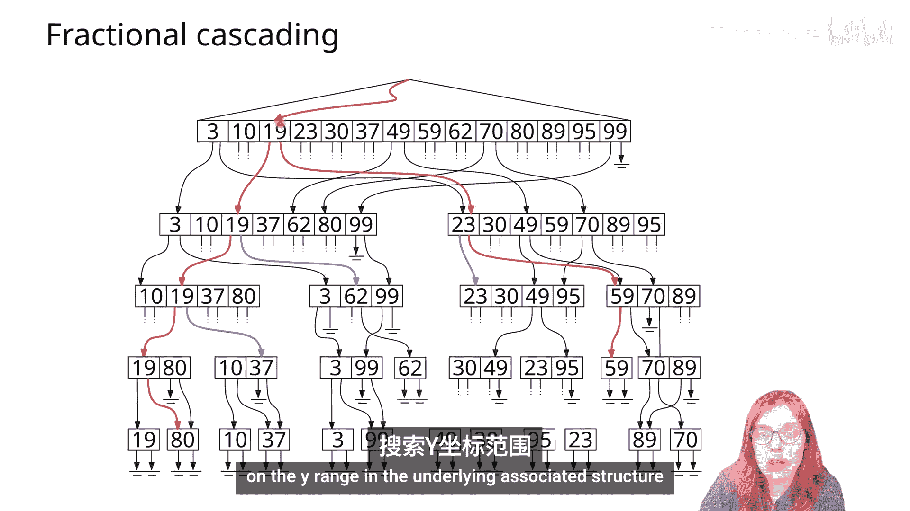

因此，假设这些列表对应于需要报告的黑色树。对于每一个，我们都从左到右遍历它。考虑这个例子，因为更有趣：值23是Y范围左端点19的后继，因此从这一点开始，我们将线性遍历集合，直到第一个落在我们搜索范围之外的点，并且对于每个Y坐标在此范围内的点，我们将报告对应的点。

当然，这里我们还需要检查两条搜索路径的叶子是否落入查询范围。

因此，我们不是对主树中最高黑色节点 `v` 的关联结构执行一维范围查询，而是找到符合需要报告范围的最小Y坐标的第一个点的位置，然后线性遍历此列表并报告每个符合范围的点。这样，我们将灰色节点的数量从 `log² n`（因为我们将在 `log n` 棵树中执行一维范围查询）减少到总共 **`O(log n)`**，因为我们只执行一次一维范围查询，而遍历结构的其余部分每层花费常数时间加上报告所有需要报告的点所需的时间。

### 优化后总结

因此，`d` 维空间中的一组 `n` 个点可以在 `O(n log^(d-1) n)` 时间内预处理成一个大小为 `O(n log^(d-1) n)` 的数据结构，使得任何范围查询都可以在 **`O(log^(d-1) n + k)`** 时间内得到回答，其中 `k` 是报告的点数。注意，现在我们将查询运行时间中 `log` 的指数从 `d` 减少到了 `d-1`。

和往常一样，如果我们的输入是退化的，特别是如果我们有多个具有相同X或Y坐标的点，那么在使用这种分数级联技术时需要小心。

## 总结

在本节课中，我们一起学习了**范围搜索**问题。我们从基础的一维范围查询开始，介绍了如何使用平衡二叉搜索树在 `O(log n + k)` 时间内解决问题。接着，我们将其扩展到二维，构建了**二维范围树**，它通过在主树节点上关联一维范围树（按另一坐标排序）来处理二维查询，实现了 `O(log² n + k)` 的查询时间。我们还探讨了构建算法及其优化。

然后，我们进一步将概念推广到 `d` 维，介绍了**高维范围树**的递归结构，其查询时间为 `O(log^d n + k)`，存储空间为 `O(n log^(d-1) n)`。

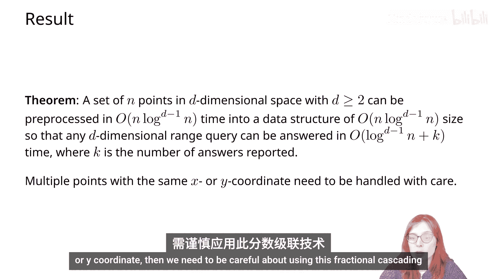

最后，我们学习了**分数级联**这一强大优化技术。通过在不同层级的关联结构间建立指针，我们避免了重复的二分搜索，成功将二维范围树的查询时间优化到 `O(log n + k)`，并将 `d` 维范围树的查询时间优化到 `O(log^(d-1) n + k)`。这展示了在空间和查询效率之间进行权衡的设计思想。