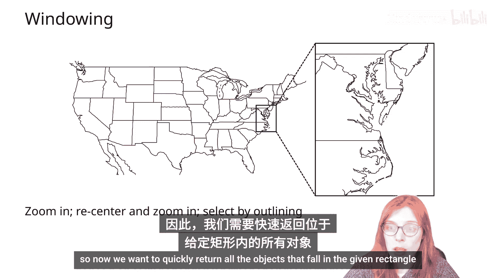
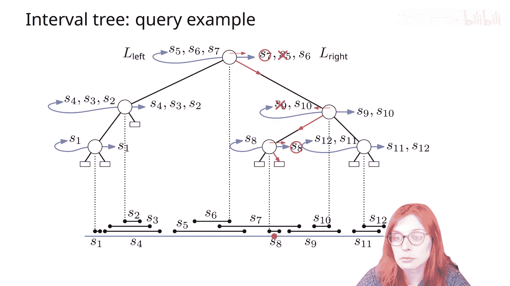
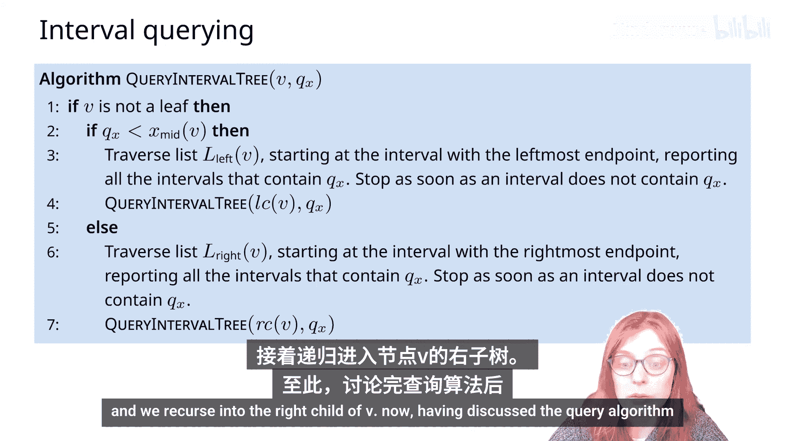
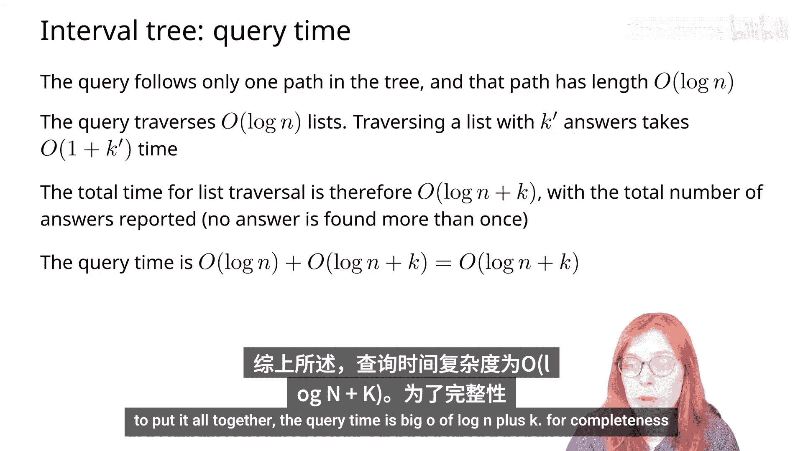
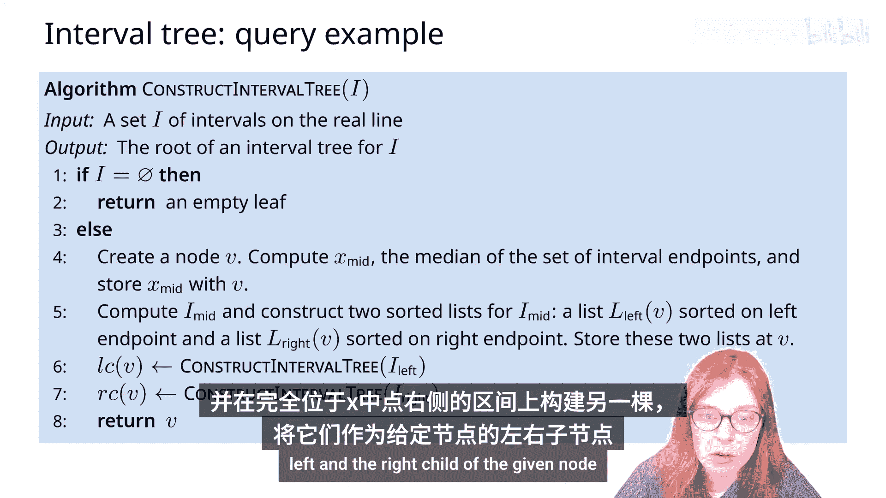
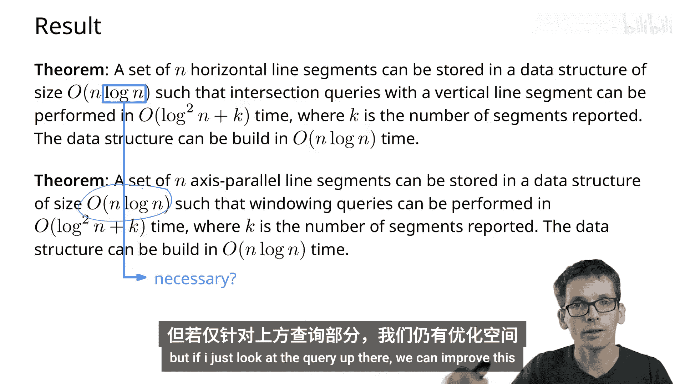

# 018：窗口查询与区间树

在本节课中，我们将学习一种新的查询问题——窗口查询。我们将探讨如何高效地报告与给定查询矩形相交的所有线段，并重点介绍用于解决一维区间查询问题的核心数据结构：区间树。

---

## 窗口查询问题概述

现在，我们将考虑不同类型的查询问题。
具体来说，这些问题被称为窗口查询。
例如，我们有一张地图的全局视图，我们只对其中一部分进行放大查看感兴趣。
因此，我们希望快速返回落在给定矩形内的所有对象。

首先，我们将把问题限制在具有固定方向的线段上，例如，只考虑垂直或水平线段。
尽管有限制，这种设定仍然有其应用场景，例如在电路设计中。

让我们来形式化这个问题：给定一组 N 条轴对齐的平行线段，我们希望将它们预处理成某种数据结构，以便能够高效地报告与给定查询矩形相交的线段。

仔细观察这张图，我们会看到线段与矩形相交的所有类型：
*   线段可能完全位于矩形内部。
*   线段可能与矩形边界相交，并且有一个端点位于矩形内部。
*   线段可能完全穿过矩形，并且两个端点都位于矩形外部。
我们还需要注意这些边界情况，即线段与矩形边界相交。

本质上，我们有两种类型的相交：
1.  线段的一个或两个端点位于矩形内部。
2.  两个端点都位于矩形外部的线段。
第二种类型的线段与边界相交两次。

现在，我们将修改问题的形式：不再存储线段并用矩形查询，而是存储线段的端点并用矩形查询；同时，我们将存储线段并用矩形的左侧和底边进行查询。这将确保我们报告所有与给定查询矩形相交的线段。

请注意，我们已经知道如何存储点并用矩形查询。
因此，现在我们需要设计一种数据结构来存储线段，查询对象是垂直或水平线段本身，我们希望报告存储在数据结构中并与给定查询线段相交的所有线段。

需要注意的是，同一条线段可能其端点位于矩形内部，同时也与矩形的左侧或底边相交。
这意味着有时我们会多次报告同一条线段。

那么，我们最多会报告同一条线段多少次呢？
实际上，最坏的情况是我们会报告同一条线段两次。

总结我们目前的讨论，与其存储线段并用矩形查询，不如将问题分为两部分：
*   在第一部分，我们将存储线段的端点并用矩形查询，我们知道如何使用二维范围树来实现。
*   在第二部分，我们将存储线段，并用查询矩形的左侧和底边进行查询，报告数据结构中与这两条边相交的所有线段。

我们的目标是存储一组垂直和水平线段，并用垂直或水平线段查询，返回存储在数据结构中并与给定查询线段相交的所有线段。

我们将进一步简化问题，开发一种数据结构来仅存储水平线段并用垂直线段查询，或者仅存储垂直线段并用水平线段查询。当然，我们可以使用相同的数据结构。

再做一个简化：目前，我们不用垂直线段查询，而是用垂直线查询，并返回所有与给定垂直线相交的水平线段。

请注意，现在线段的 Y 坐标不起任何作用，问题本质上变成了一维的。
我们现在得到的问题是：给定实线上的一组区间，我们希望将它们预处理成一种数据结构，以便能够高效地回答哪些区间包含给定的查询点。

例如，在下图中，两个红色线段需要被报告，因为它们包含了查询点。

我们将在此使用的数据结构称为区间树，构建方式如下：
我们有 2N 个区间端点。
我们将根据所有区间这 2N 个端点的 X 坐标中值来分割区间。
我们将得到三组区间：
*   集合 **I_left** 中的区间是完全位于分割值 X 左侧的区间。
*   类似地，集合 **I_right** 中的区间是完全位于 X 右侧的区间。
*   集合 **I_mid** 中的区间是包含或与给定值 X 相交的区间。

现在，我们可以使用以下递归定义来定义区间树：
在区间集合 I 上构建的区间树将有一个根节点，该节点包含所有 2N 个区间端点的中值 X。
它将存储所有与该值 X 相交的区间。
节点 V 的左子节点将是完全位于值 X 左侧的区间上构建的区间树。
节点 V 的右子节点将是包含所有完全位于值 X 右侧的区间的区间树。

现在，这里需要回答的问题是如何存储与给定值 x 相交的区间。
假设我们以某种方式将 I_mid 中的这些区间存储在节点中。
让我们考虑一下运行查询时会发生什么。
假设查询点位于 x 的左侧。
观察到，由于 I_mid 中的所有区间都与值 X 相交，这意味着它们的左端点值小于 x，而它们的右端点值大于 x。
因此，如果这是我们的查询值，并且我们知道它位于 X 的左侧，我们只需要将查询值与存储在给定节点中的区间的左端点进行比较。
类似地，如果查询点大于 x，那么我们需要将其与区间的右端点进行比较。

一个能让我们高效报告包含给定查询点 Q 的区间的解决方案是创建两个列表：
*   一个列表按左端点从左到右的顺序存储区间。
*   第二个列表按右端点从右到左的顺序存储相同的区间。
我们将这两个列表用作给定节点 V 的关联结构。

让我们看一个例子。
这是我们的区间树。
根节点存储这个值 X，由于 x 与三个区间 S5、S6 和 S7 相交，这三个区间将存储在节点 V 中。
每个区间在左列表中出现一次，按左端点从左到右排序；在右列表中也出现一次，按右端点从右到左排序。
类似地，对于任何子树中的给定值 x，与该值 X 相交的区间都存储在关联的两个列表中，分别按左端点和右端点排序。

为了分析这种数据结构的存储需求，我们可以观察到每个区间只存储在一个节点中，然后出现在两个列表中。
由于树中总共有线性数量的节点，总的存储需求是线性的。

现在让我们考虑一个查询的例子。
假设我们正在用这个红点 Q 的值搜索区间树。
我们从根节点开始。
由于查询点位于根节点存储值的右侧，我们将检查与根节点关联的右列表中的所有区间。
我们将线性遍历这个列表，并报告所有包含查询点的线段。
一旦我们遇到一个不包含查询点的线段，我们就可以停止遍历列表，并移动到根节点的右子节点。
在下一个节点中，我们重复这个过程。
对于这个特定的例子，查询点现在位于节点内存储值的左侧，因此我们将查询点的值与节点关联的左列表中存储的区间的左端点进行比较。
这里第一个区间不包含查询点，因此我们不继续搜索列表，并继续到节点的左子节点。
最后，这个子节点只包含一个区间，因为它的值只与一个区间相交，该区间尚未存储在树中。
查询点位于节点内存储值的右侧，因此我们检查右列表中存储的区间是否包含给定点，并报告它们。
最后，我们到达一个空叶子节点，并终止查询算法。

总结一下，区间树的查询将由以下伪代码给出：
我们用一个查询值 Q_x 查询给定节点 V。
如果 V 不是叶子节点，那么我们检查查询点是位于节点 V 存储值的左侧还是右侧。
*   如果位于左侧，那么我们遍历与节点 V 关联的左列表，并报告所有包含查询值 Q_x 的区间。一旦遇到第一个不包含值 Q_x 的区间，我们就停止，然后继续进入 V 的左子节点。
*   否则，如果查询值 Q_x 位于节点内存储值的右侧，我们类似地遍历存储区间的右列表，报告所有包含查询值 Q_x 的区间，一旦遇到第一个不包含 Q_x 的区间就停止，然后递归进入 V 的右子节点。

讨论了查询算法之后，请回答以下问题：
区间树查询算法的运行时间是多少？
实际上，查询只遵循树中的一条搜索路径，并且由于树是平衡的，这条路径的长度是对数级的。
对于每个节点，查询遍历与该节点关联的列表，因此它遍历对数个列表。
对于它遍历的每个列表，它报告一些包含给定查询点的区间，数量为 k'，因此遍历一个列表需要 O(1 + k') 时间。
当然，所有 k' 的总和等于 k，即报告的总区间数，因此所有列表遍历和报告区间的总时间是 O(log n + k)。
综上所述，查询时间是 **O(log n + k)**。

为了完整起见，我们也考虑一下区间树构建算法的伪代码。
我们从所有区间的集合 I 开始，并返回在集合 I 上构建的区间树的根节点。
如果集合 I 为空，那么我们创建一个空叶子节点（空叶子）并返回它。
另一方面，如果 I 不为空，我们执行以下操作：
1.  创建对应的节点 V。
2.  计算集合 I 中所有 2N 个区间端点的中值 x_mid。
3.  计算所有包含值 x_mid 的区间。
4.  构造两个列表：
    *   第一个列表：区间按左端点从左到右排序。
    *   第二个列表：相同的区间按右端点从右到左排序。
    将这两个列表存储在节点 V 中。
5.  在完全位于 x_mid 左侧的区间上构建一个区间树，并在完全位于 x_mid 右侧的区间上构建另一个区间树，使它们成为给定节点的左子节点和右子节点。
6.  最后，返回节点 V。

总结一下，我们可以在 N 个区间的集合上构建一个区间树。
该树使用线性存储，可以在 **O(N log N)** 时间内构建，查询运行时间为 **O(log N + K)**，其中 K 是报告的区间数。

我们现在知道了什么是区间树，但我们还不知道如何将其用于窗口查询，让我们开始吧。😊

## 将区间树应用于窗口查询

这是我们想要做的。😊
我们想用一条垂直线段查询一组水平线段，以便报告所有与该垂直线段相交的线段，如果输入是水平和垂直线段，这将有助于我们进行窗口查询。😊

所以这是我们想要实现的。😊
这是我们已有的：给定 N 条水平线段，我可以找到所有与给定垂直线相交的线段，为此我们可以使用区间树，因为如果只看 X 坐标，这本质上是一个一维问题。😊

好的，那么我们现在需要做什么？
假设我们在 X 坐标上使用一个区间树。
那么，我们需要做一些新的处理来处理 Y 坐标。
这对于范围和窗口查询以及这类数据结构来说非常典型。
我们需要看看如何组合不同的数据结构。
我们以什么作为主数据结构？以什么作为关联数据结构？
现在主数据结构是区间树，我们必须思考关联数据结构是什么。
让我们看一下。
这是一个区间树和水平线段。
假设这是我的查询。
现在，区间树本身在这个节点给了我线段 S5、S6、S7，我按顺序遍历它们。
这意味着，在这种情况下，这里的区间树会给我 S5、S6 和 S7。😊
这意味着我在这里存储的列表不再合适，因为我没有办法在不获取 S6 和 S5 的情况下访问 S7。😊
我们能做什么？
一种看到我们想要 S7 的方式如下：S7 的左端点在这个灰色范围内。😊
你可能还会想，这是否只是查看正确的 Y 范围的问题？那么，我是否可以只检查哪些线段在这个 Y 范围内？
情况并非完全如此。
这里再举一个例子。
把它画得更大一些。
如果是这样，那么 S9 会在 Y 范围内，但它太短了。😊
所以，实际上，让我们再画一张图。
实际上，我们可以通过找到左端点在这个灰色范围内的线段来找到相交的线段，这个范围是...所有垂直的...
这看起来很像范围查询。
在我们实际进行范围查询之前，再举一个例子，如果这是我的查询，那么我将转到树的右侧，我感兴趣的矩形是这个。😊
但所有这些都是范围查询，二维范围查询。
那么我们能做什么？
我们只需将这些区间端点的左端点存储在一个二维范围树中。😊
然后，当我访问这个节点时，并且我有一个查询，比如这个，在这个二维范围树上，我只需找到端点在这个区间内的线段。
我们可以把所有东西都放在一棵树里，因为所有的右端点都在这里，所有的左端点都在左边，所以我不可能意外地找到错误的端点。😊
好的，就是这样：主数据结构是区间树。😊
关联数据结构是二维范围树。

现在，当我们进行查询时，我们做什么？
我们不再像以前那样，在访问节点时，如果向左走就访问左列表，向右走就访问右列表。
相反，我们在相应的区域执行范围查询。😊
现在这看起来可能有点奇怪，因为这实际上不是一个矩形，但这边，你可以说我的最小值是负无穷大。
就范围查询而言，这实际上只是让查询变得更容易一些，因为我们不需要搜索范围的两个边界，在这个例子中，只需要搜索右边界，另一个边界向左是完整的。
这就是设置。

再次说明：
*   对象是水平线段。
*   查询对象是垂直线段。
*   查询是：报告所有与我的查询线段相交的输入对象 S_i。
*   数据结构是带有关联数据结构（二维范围树）的区间树。

现在让我们思考一下这需要多少空间。
区间树本身（忽略所有那些范围树）占用线性空间。
现在记住，一个二维范围树为 N 个端点占用 O(N log N) 空间。
现在，我们有很多这样的树，而不是一棵树。
等等，任何端点只在这些树中的一棵里。
假设这里的线段数是 N1，这里的线段数是 N2，依此类推。
如果我把所有这些范围树的大小加起来，我会得到类似 Σ(N_i log N_i) 的和。
如果 N_i 的总和是 N，那么这个和总计为 O(N log N)。
在某种程度上，最坏的情况是如果所有东西都在一棵树里，那么我得到 N log N；如果我有很多小树，实际上我会得到更少的存储空间。😊

好的，这就是我们拥有的：我们需要存储最多线性数量的范围树，它们总共存储 2N 个端点。
因此，总存储空间将是 **O(N log N)**。

让我们思考一下查询。
如果我进行查询，我将移动到树中，比如像这样。😊
然后每次我访问一个节点，比如这个节点，我需要做一个二维范围查询。
所以我在 O(log N) 个节点上做二维范围查询。
每个范围查询，如果我使用分数级联，将花费 O(log N) 加上在该节点中报告的节点数，我们称之为 K_i。
所以我得到 log N 乘以 log N，也就是这里的 (log N)^2，所有这些 K 加起来就是我的总 k。
这就是我们如何将区间树用于窗口查询。

还有一个问题。😊
构建这个数据结构需要多少时间？
A. O(N log N) 时间，B. O(N log² N) 时间，还是 C. O(N²) 时间？
所有这些都需要 O(N log N) 时间。
为什么？因为构建一个区间树需要 O(N log N) 时间，然后我需要构建所有这些小的范围树。
在 N 个节点上构建一个范围树需要 O(N log N) 时间。
再次，如果我把所有这些加起来，我会得到 O(N log N)。

总结我们使用区间树进行窗口查询的结果：
给定一组 N 条水平线段，我可以构建一个大小为 **O(N log N)** 的数据结构，使得给定一条垂直线段作为查询，我可以在 **O(log² N + K)** 时间内找到所有与此相交的线段。😊
并且我可以在 **O(N log N)** 时间内构建这个数据结构。

如果我现在将其用于窗口查询，那么回想一下，这是针对与我的窗口查询边界相交的线段。
此外，我可能还有完全在内部的线段，对于这些线段，我也需要进行范围查询。
因此，总体结果是，如果我有 N 条轴对齐的线段（到目前为止我们讨论了水平线段，但我们也可以为垂直线段构建相同的数据结构以进行水平查询），那么对于 N 条轴对齐的线段，我们可以构建一个大小为 **O(N log N)** 的数据结构，使得我们可以在 **O(log² N + K)** 时间内执行查询，查询对象是一个轴对齐的矩形，以便报告所有与此矩形相交的线段。😊
我们可以在 **O(N log N)** 时间内构建所有这些，因为我们可以用 O(N log N) 时间构建带有二维范围树的区间树，然后用于完全在矩形内部的线段的二维范围树，我也可以在 O(N log N) 时间内构建。

到目前为止，一切顺利。
我们将在下一个视频中看到一个小的改进。
那就是以下内容：
这里我们的数据结构使用 O(N log N) 空间。
我们希望能够改进这一点。
让我说，总体而言，我们无法避免这里的 O(N)，因为范围树需要 O(N) 空间。
但是，如果我只关注上面的查询，我们可以改进这一点，我们将在接下来看看如何做到。

---

## 总结

在本节课中，我们一起学习了窗口查询问题的基本框架。我们了解到，可以通过将问题分解为端点查询和边界线段查询两部分来解决。我们深入探讨了用于高效解决一维区间包含查询的核心数据结构——**区间树**。我们学习了它的构建方法（`O(N log N)`）、存储特性（`O(N)`）以及查询算法（`O(log N + K)`）。最后，我们看到了如何将区间树与二维范围树结合，以处理更复杂的二维窗口查询问题，从而能够报告所有与给定轴对齐矩形相交的线段，整体查询时间优化为 `O(log² N + K)`。