# 019：优先搜索树 🧠

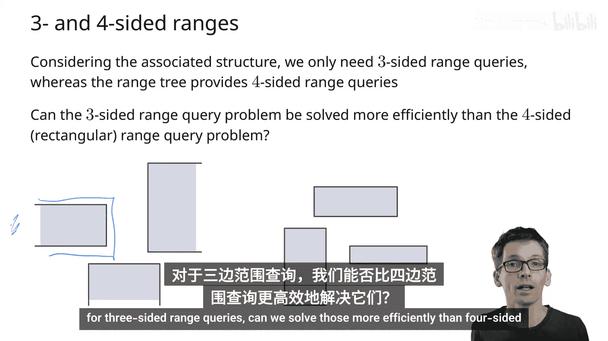

在本节课中，我们将学习一种用于高效处理三边范围查询的数据结构——优先搜索树。我们将了解其动机、结构、查询算法以及性能分析。

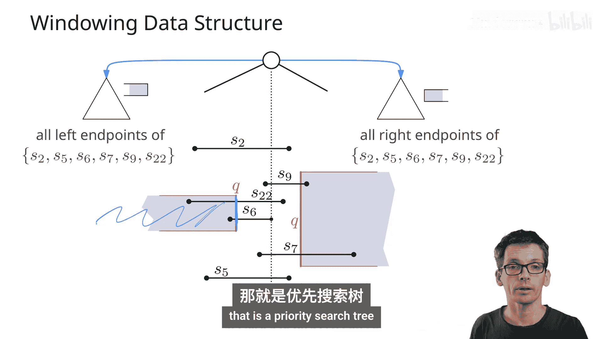

## 概述

我们之前学习了正交范围搜索，通常使用矩形进行查询。然而，在某些情况下，查询区域的一边是开放的（例如，延伸到无穷远），形成三边查询。虽然我们可以将其视为特殊的正交范围查询来处理，但存在一种更高效的数据结构专门用于此场景。这就是优先搜索树。

上一节我们介绍了窗口查询的背景，其中查询垂直线段时，需要找到所有位于特定三边区域内的水平线段端点。对于这类查询，优先搜索树提供了一种简单高效的解决方案。

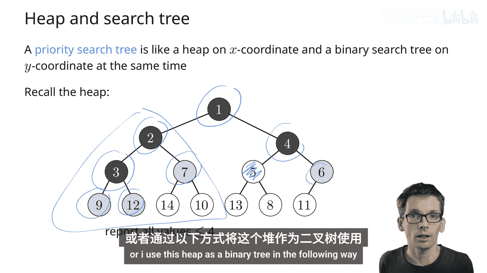

## 优先搜索树的结构

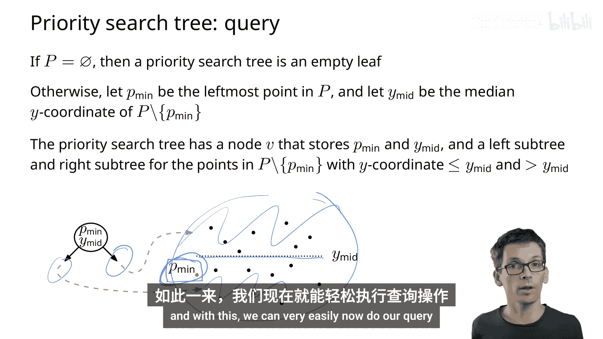

优先搜索树本质上是**堆**和**二叉搜索树**的结合体。

*   **堆**：一个近乎完全的二叉树，具有最小堆性质，即节点的键值总是小于或等于其子节点的键值。
*   **二叉搜索树**：用于在另一个维度（通常是y坐标）上组织数据。

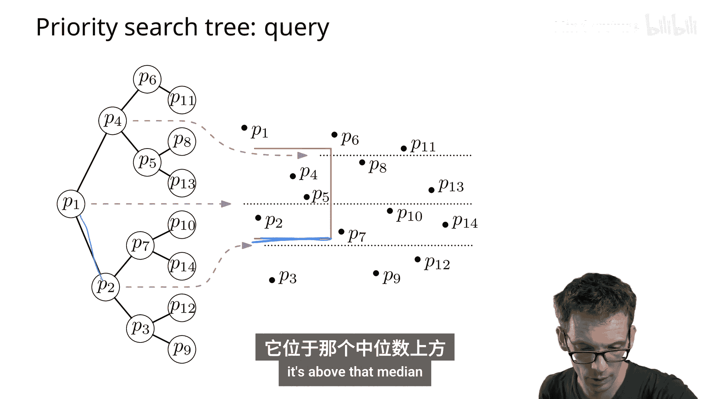

以下是构建优先搜索树的步骤：

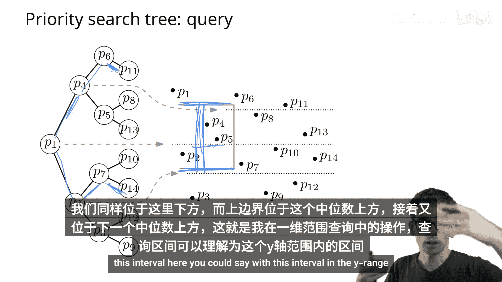

1.  在根节点，存储点集中**x坐标最小**的点。
2.  对于剩余的点，根据它们的**y坐标找到中位数**。
3.  将y坐标中位数存储在该节点。
4.  递归处理：在左子树中存储所有y坐标**低于**中位数的点，在右子树中存储所有y坐标**高于**中位数的点（注意，已处理的x坐标最小点被排除在外）。

通过这种方式，树在x坐标维度上表现为一个最小堆（根节点x最小），在y坐标维度上表现为一个二叉搜索树。

## 三边范围查询算法

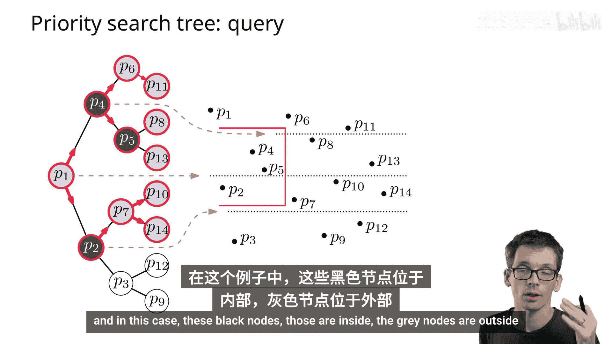

假设我们的三边查询区域是：`x <= x_query` 且 `y_low <= y <= y_high`。查询算法结合了堆的遍历和二叉搜索树的一维范围查询。

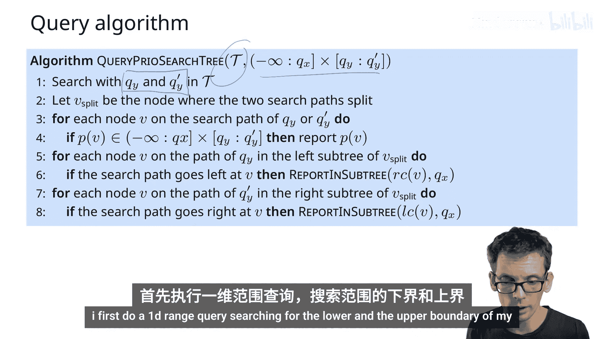

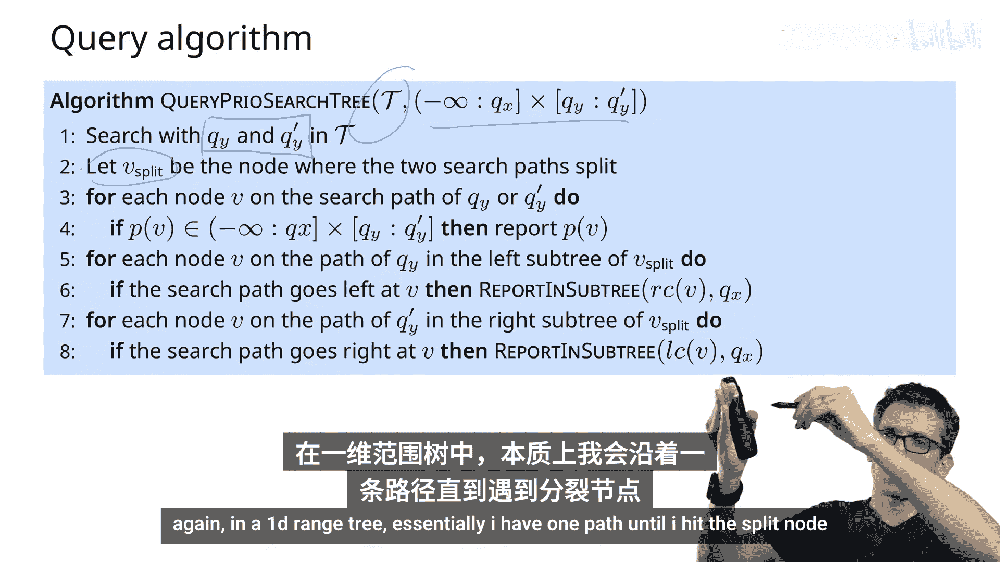

算法步骤如下：

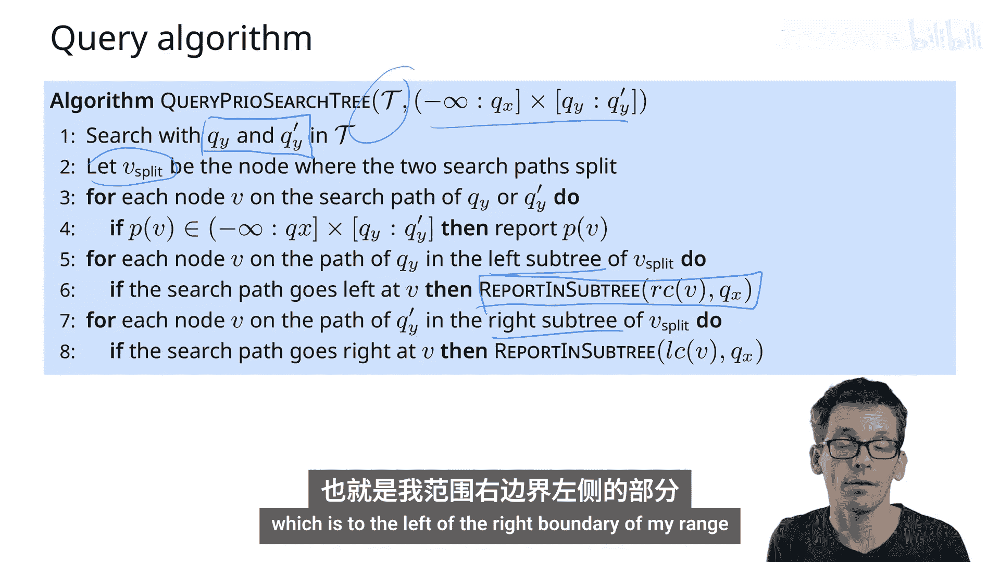

1.  **执行y坐标的一维范围查询**：在树的y坐标搜索路径上，找到覆盖区间 `[y_low, y_high]` 的路径。这类似于在二叉搜索树中查找分裂节点（split node）及其左右边界路径。
2.  **沿搜索路径处理**：
    *   对于搜索路径上的每个节点，检查其存储的点是否满足 `x <= x_query`。如果满足，则报告该点。
    *   此外，当搜索路径向左或向右分支时，需要进入相应的“内部子树”进行报告。具体规则是：
        *   在**下边界路径**上，如果向右走，则需要报告其**左子树**中满足x条件的点。
        *   在**上边界路径**上，如果向左走，则需要报告其**右子树**中满足x条件的点。
3.  **报告子树中的点（`ReportInSubtree`函数）**：当进入一个子树报告时，我们将其视为一个堆来处理：
    *   访问子树的根节点。
    *   如果该节点的x坐标 `<= x_query`，则报告该点，并**递归检查其两个子节点**。
    *   如果该节点的x坐标 `> x_query`，则可以**停止**对该子树的进一步探索，因为堆的性质保证了其所有后代节点的x坐标都更大。

这个算法的关键在于，在内部子树中，我们利用堆的性质，一旦发现一个点的x坐标超出查询范围，就可以剪枝，停止向下搜索。这保证了查询时间与报告的点数成线性关系。

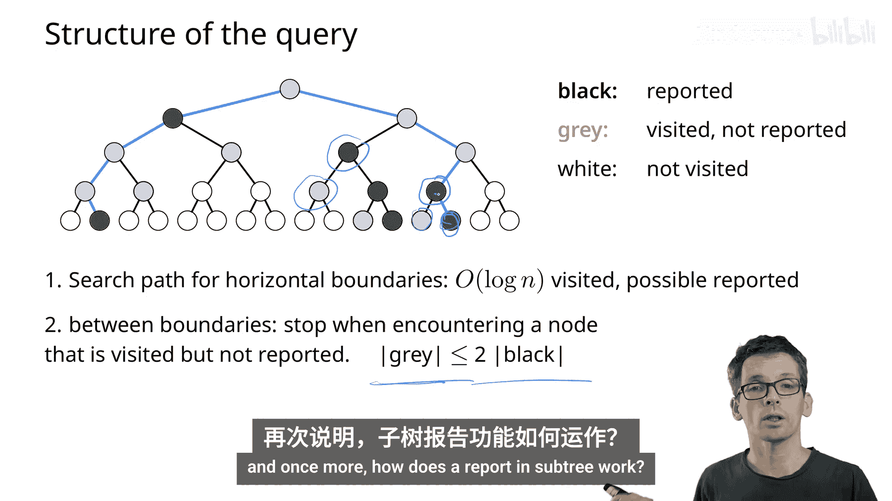

## 性能分析

*   **查询时间**：`O(log n + k)`，其中 `k` 是报告的点数。
    *   `O(log n)` 用于在y坐标维度上进行二叉搜索，找到搜索路径。
    *   `O(k)` 用于报告点。通过分析可以证明，在搜索路径之外访问的“灰色”节点（被检查但未报告的点）数量最多是“黑色”节点（被报告的点）数量的两倍。
*   **存储空间**：`O(n)`。因为优先搜索树本质上是一个二叉树，每个节点存储一个点。
*   **构建时间**：`O(n log n)`。需要在每个递归步骤中查找x最小点和y中位数。

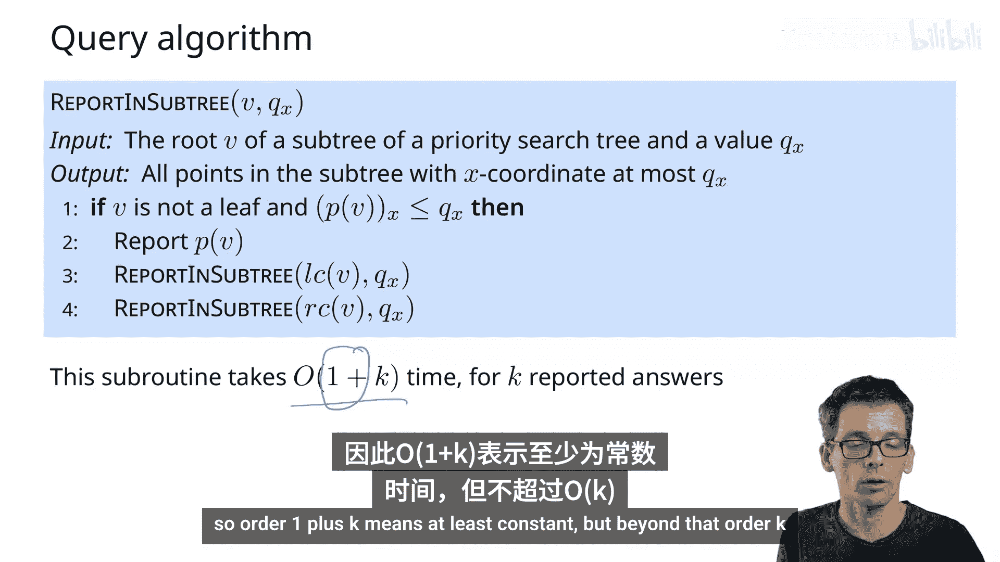

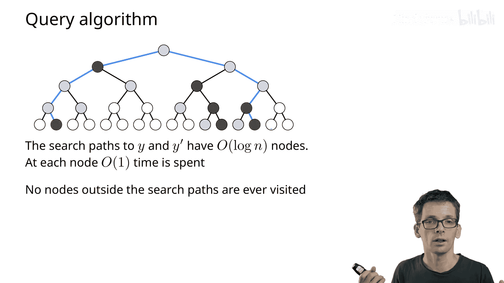

## 在窗口查询中的应用

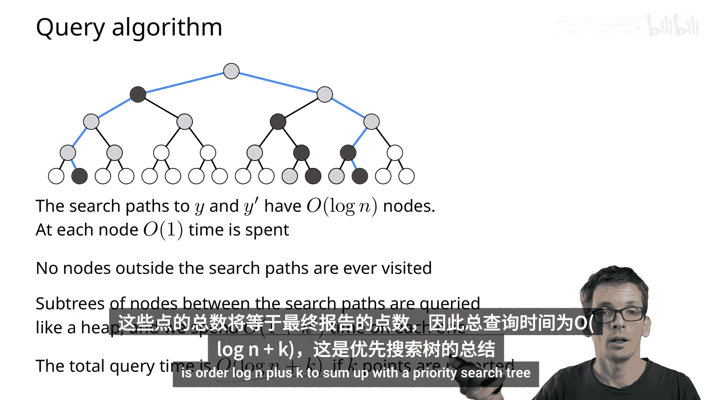

回到窗口查询问题，我们有一个区间树（Interval Tree），其关联数据结构用于存储与节点相关的线段端点。

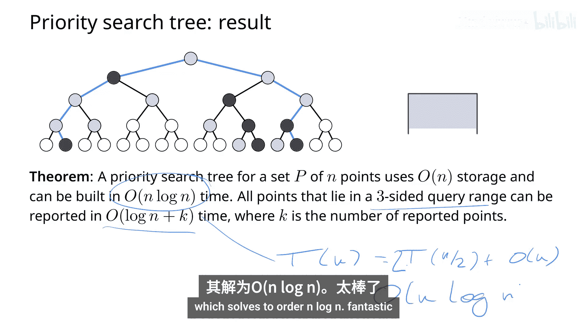

*   如果我们使用优先搜索树作为区间树的关联数据结构，来查询与垂直线段相交的水平线段：
    *   **存储空间**：由于每个优先搜索树占用线性空间，且所有树存储的总点数为 `O(n)`，因此总体存储空间为 `O(n)`。
    *   **查询时间**：我们需要访问区间树中的 `O(log n)` 个节点。在每个节点，对其关联的优先搜索树进行查询需要 `O(log n + k_v)` 时间，其中 `k_v` 是在该节点报告的点数。因此，总查询时间为 `O(log² n + k)`，其中 `k` 是总共报告的点数或线段数。

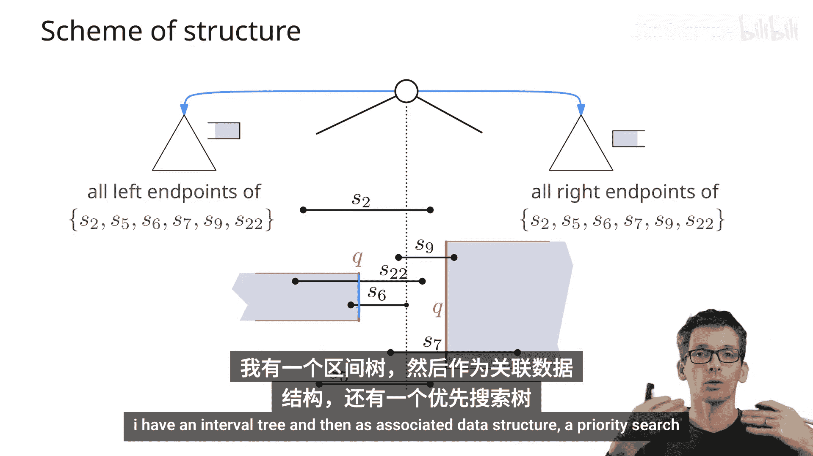

## 总结

本节课我们一起学习了优先搜索树。它是一种巧妙结合堆和二叉搜索树特性的数据结构，能够以 `O(log n + k)` 的时间回答三边范围查询，并使用线性存储空间。

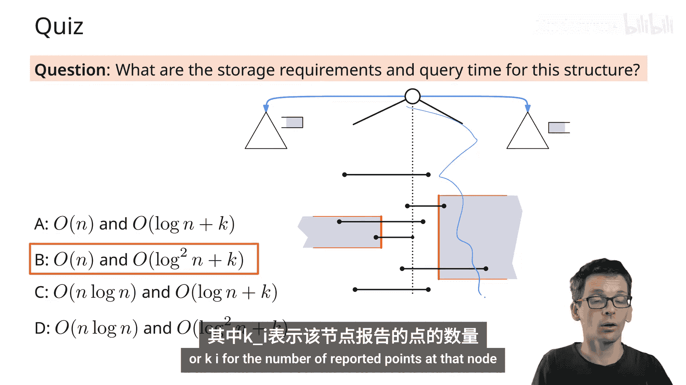

我们看到了如何将其应用于窗口查询问题中的特定子问题（查询与垂直线段相交的水平线段），从而将关联数据结构的存储空间从 `O(n log n)` 优化到 `O(n)`，尽管查询时间仍为 `O(log² n + k)`。这为处理更复杂的几何查询问题奠定了基础。

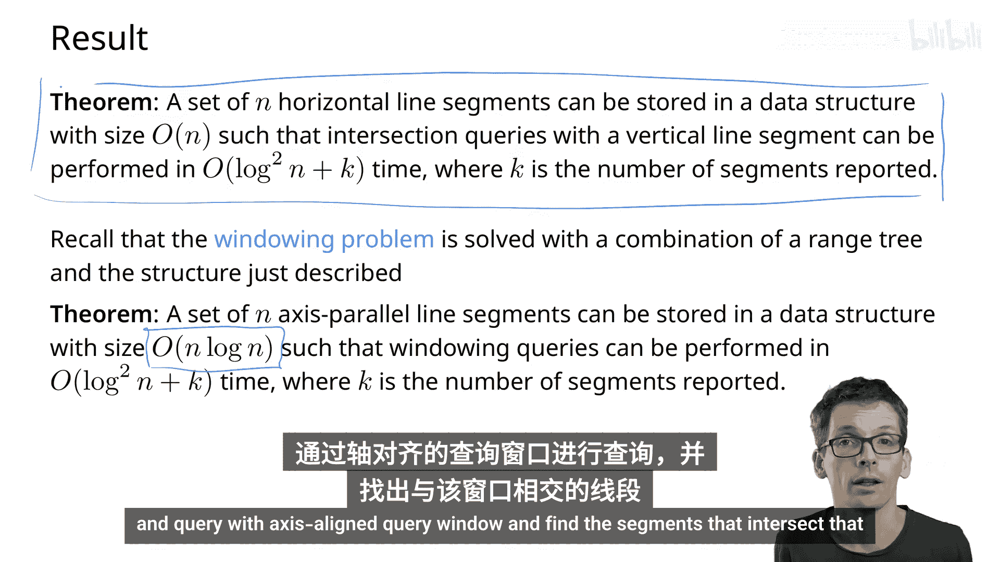

接下来，我们将探讨如何将方法推广到处理任意非相交线段，以及查询轴对齐矩形窗口的问题。