# 020：窗口查询3_3-线段树

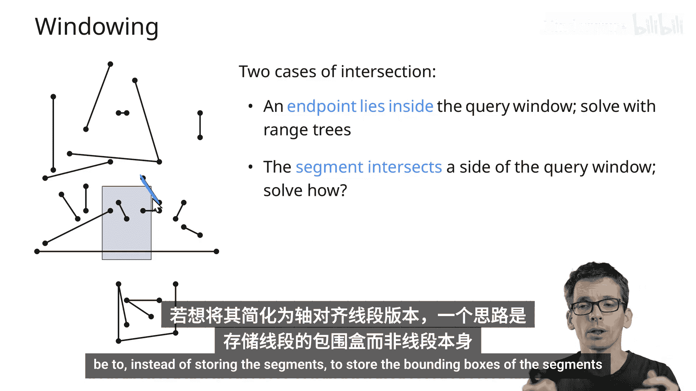

在本节课中，我们将学习如何解决针对任意非相交线段的窗口查询问题。我们将从分析现有方法的局限性开始，然后引入线段树这一关键数据结构，并最终展示如何组合线段树与一维范围树来解决复杂的窗口查询问题。

## 问题定义与现有方法的局限性

上一节我们介绍了针对轴对齐线段的窗口查询解决方案。本节中，我们来看看如何处理任意方向的非相交线段。

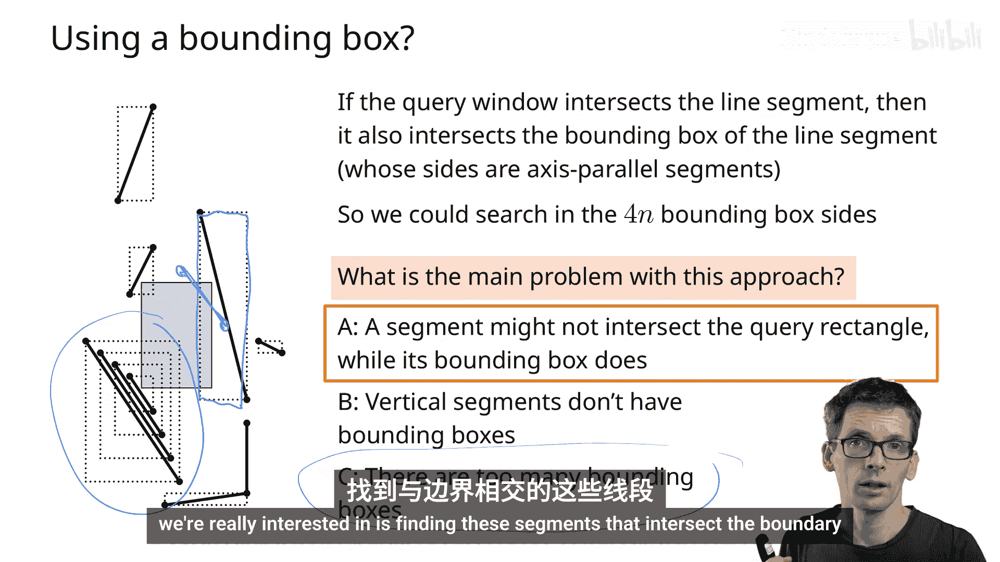

我们的问题是：给定一组任意方向的非相交线段，我们需要对它们进行预处理，使得给定一个轴对齐的查询矩形时，能够报告所有与该矩形相交的线段。这包括端点位于矩形内的线段，也包括两个端点都在矩形外但与矩形边界相交的线段。

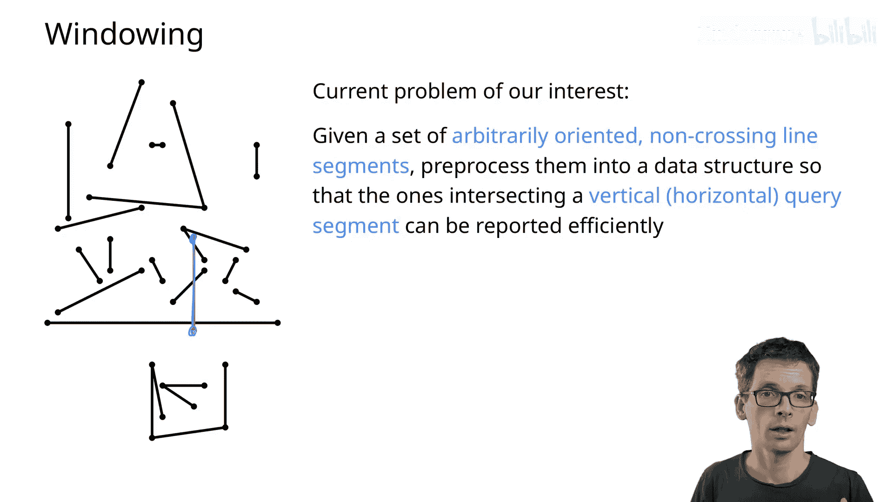

一个直观的想法是将线段的包围盒（轴对齐矩形）存储到之前为轴对齐线段设计的数据结构中。然而，这种方法存在致命缺陷：一个线段的包围盒可能与查询矩形相交，但线段本身并不相交。在最坏情况下，我们可能需要在查询中检查大量实际上并不相交的线段，导致查询时间从 `O(log² n + k)` 退化到 `O(log² n + n)`，即使没有线段相交，查询时间也是线性的。

因此，我们需要一种新的方法。

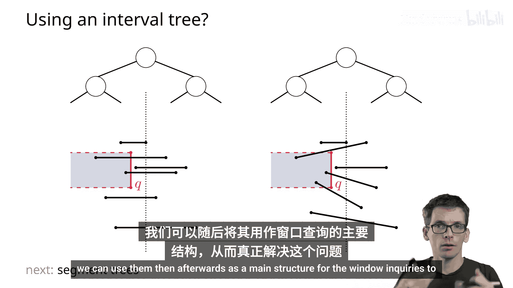

## 核心问题：线段与垂直查询线段的相交查询

窗口查询问题可以分解。首先，我们可以用范围树找到完全位于矩形内部的线段。剩下的挑战是找到与矩形边界相交的线段。这可以进一步简化为以下子问题：给定一组任意方向的非相交线段和一个垂直查询线段，报告所有与该垂直线段相交的线段。

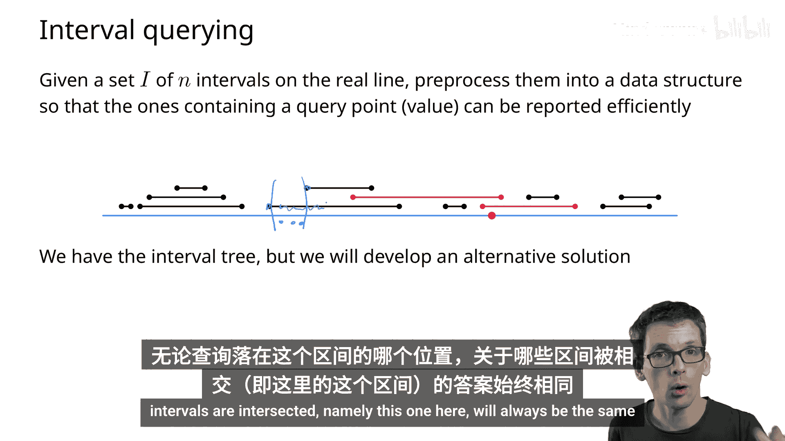

这正是我们之前为轴对齐线段所做的简化，但现在对象是任意线段。

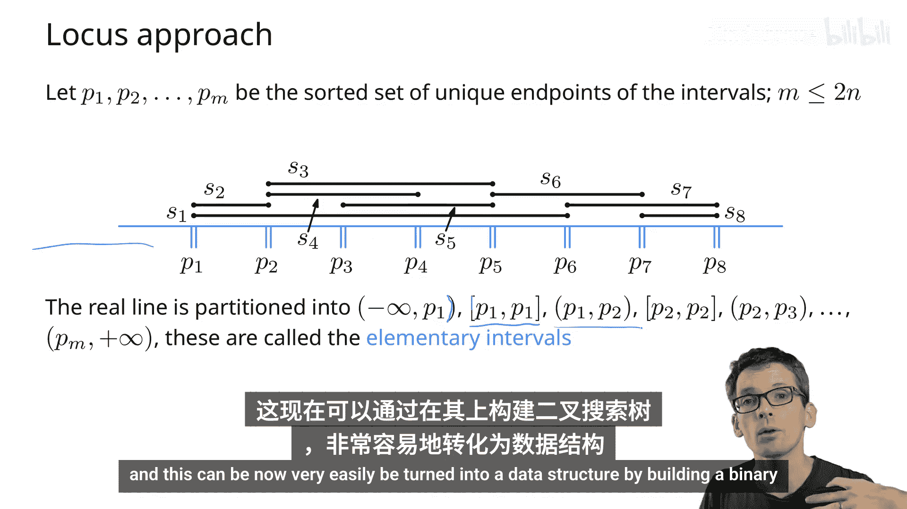

我们之前用于轴对齐线段的区间树在这里不再适用。因为区间树依赖于一个关键性质：与垂直边界相交的线段，其端点必然落在边界定义的某个区域内。对于任意线段，即使端点落在该区域内，线段本身也可能并不与边界相交。

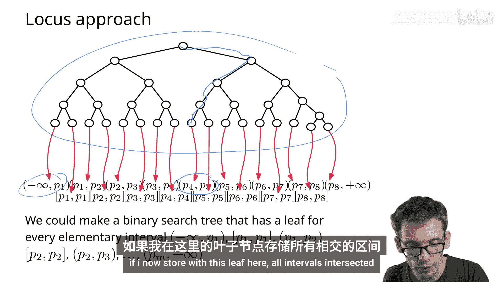

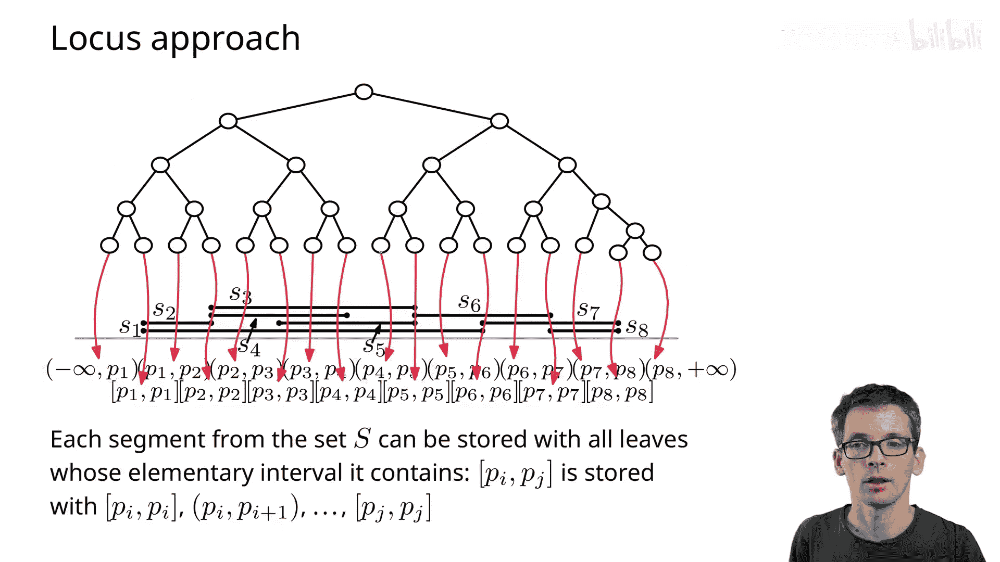

因此，我们需要一种新的数据结构：线段树。

## 线段树：区间穿刺查询的另一种解法

线段树是解决一维区间穿刺查询问题的另一种数据结构。给定一组一维区间和一个查询点，我们需要报告所有包含该查询点的区间。

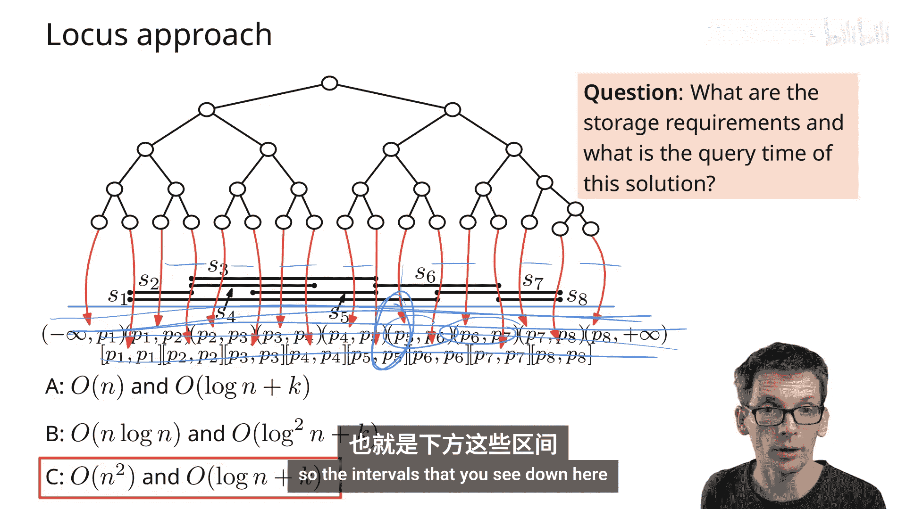

线段树采用了一种“轨迹法”思想：将整个解空间（即一维数轴）划分为多个区域，使得在每个区域内，查询的答案（即被哪些区间包含）是恒定的。这些区域被称为“基本区间”，由所有区间端点的排序序列定义。

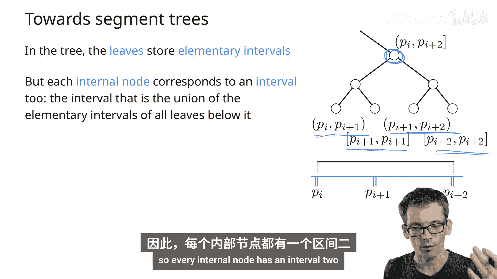

例如，区间 `[p_i, p_{i+1})` 和单点 `{p_i}` 都是基本区间。在这些基本区间内，被哪些区间覆盖的结果是相同的。

基于这些基本区间，我们可以构建一棵平衡二叉搜索树。树的每个叶子节点对应一个基本区间。每个内部节点 `v` 也对应一个区间 `Int(v)`，即其子树中所有叶子节点对应基本区间的并集。

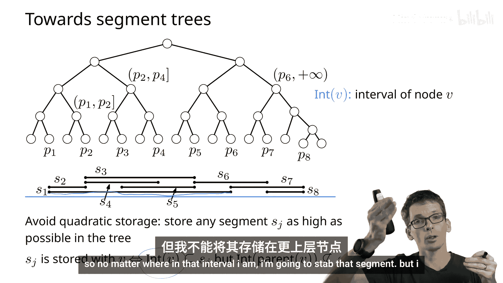

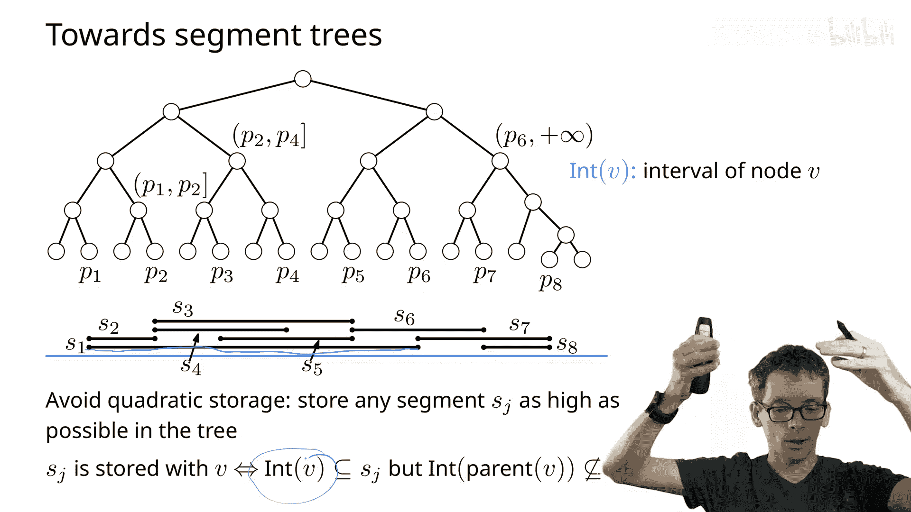

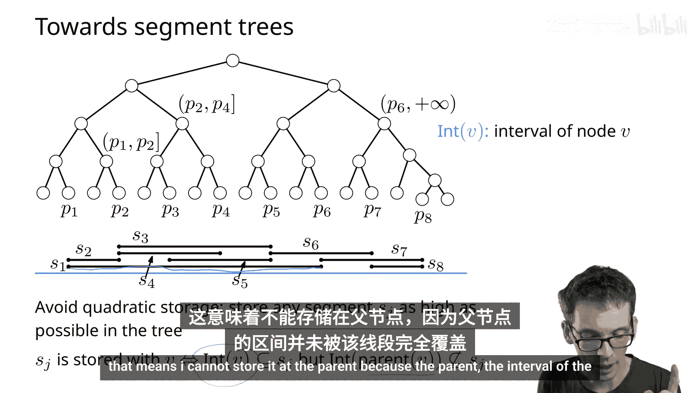

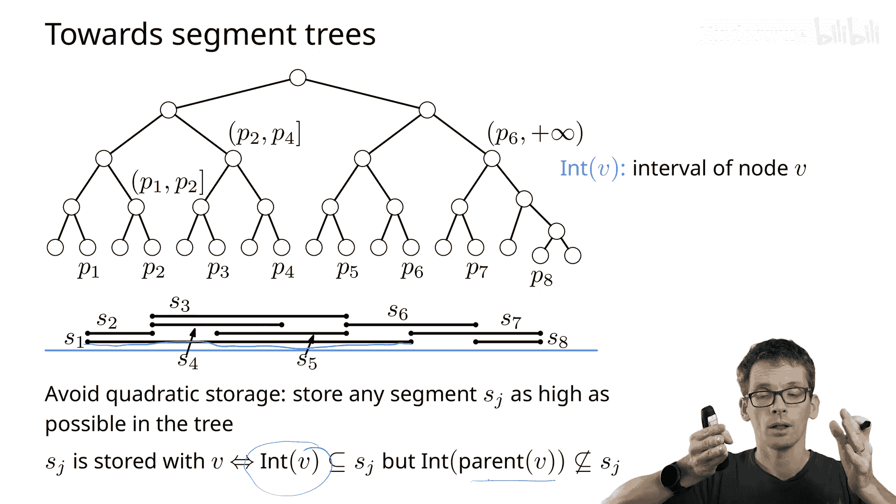

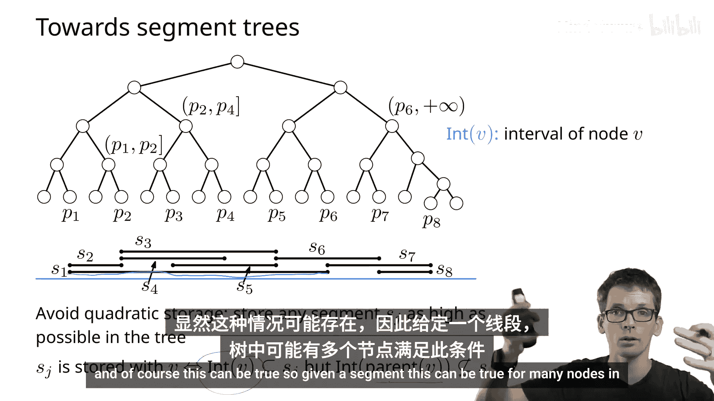

### 存储策略与规范化子集

如果简单地在每个叶子节点存储覆盖其对应基本区间的所有区间，会导致最坏情况下 `O(n²)` 的存储空间，因为一个长区间会被存储在大量叶子节点中。

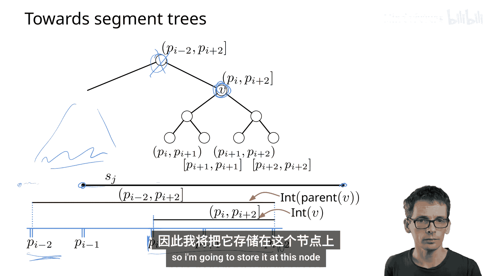

线段树的关键优化在于：**将区间存储在尽可能高的节点上**。具体来说，对于一个区间 `S`，我们将其存储在节点 `v` 上，当且仅当 `Int(v)` 被 `S` 完全覆盖，但 `Int(v)` 的父节点对应的区间不被 `S` 完全覆盖。所有存储在节点 `v` 上的区间集合称为该节点的**规范化子集**。

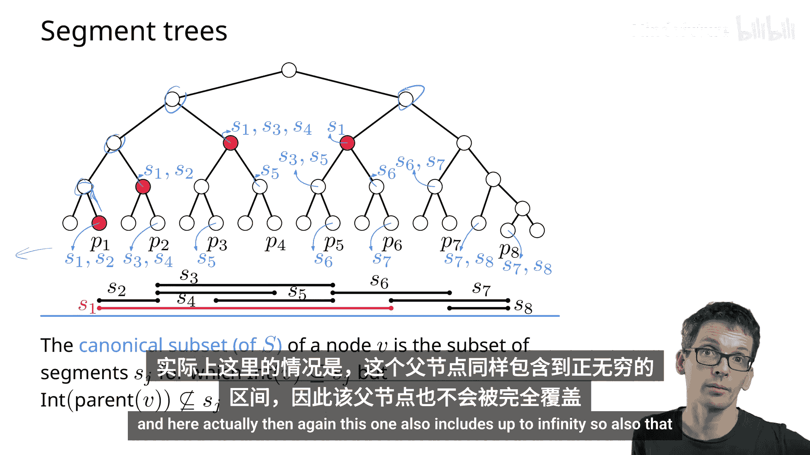

这种存储策略保证了：对于任意查询点 `q`，所有包含 `q` 的区间，都恰好出现在从根节点到包含 `q` 的叶子节点的路径上所经过的某个（或某几个）节点的规范化子集中。

### 查询与复杂度分析

**查询过程**：给定查询点 `q`，我们从根节点开始，沿着搜索路径向下遍历到包含 `q` 的叶子节点。对于路径上的每一个节点 `v`，我们报告其规范化子集中的所有区间。

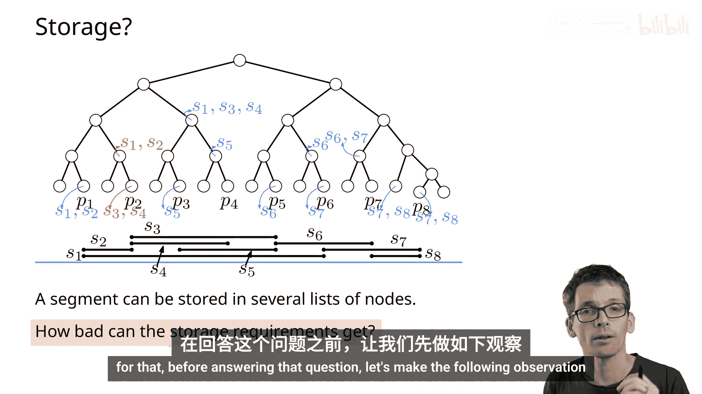

**查询时间**：搜索路径长度为 `O(log n)`。在路径上的每个节点，我们以常数时间报告其存储的区间。因此，总查询时间为 `O(log n + k)`，其中 `k` 是报告的结果数量。

**存储空间**：核心观察是，任何一个区间 `S`，在树的同一层中，最多被两个节点的规范化子集所包含。因为如果同一层有三个节点都存储了 `S`，那么中间那个节点的父节点区间也必然被 `S` 完全覆盖，这与“存储在尽可能高的节点”的原则矛盾。树有 `O(log n)` 层，因此每个区间最多被存储 `O(log n)` 次。对于 `n` 个区间，总存储空间为 `O(n log n)`。

**构建时间**：线段树可以在 `O(n log n)` 时间内构建。

总结一下，线段树以 `O(n log n)` 的存储空间和 `O(log n + k)` 的查询时间，解决了区间穿刺查询问题。虽然它比区间树多了一个 `log n` 的存储因子，但其简单的查询逻辑为后续解决更复杂的问题奠定了基础。

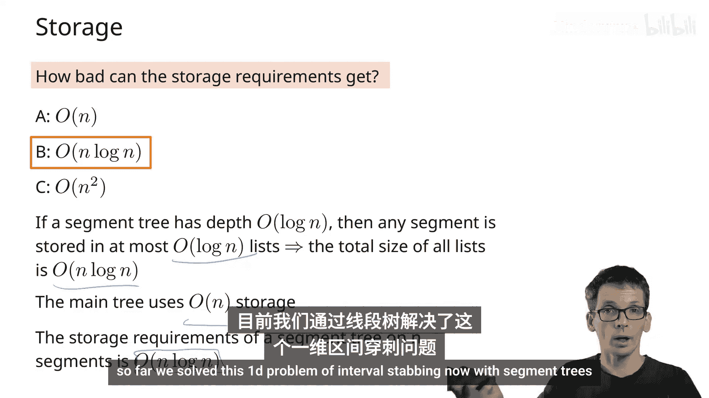

## 应用于窗口查询：组合数据结构

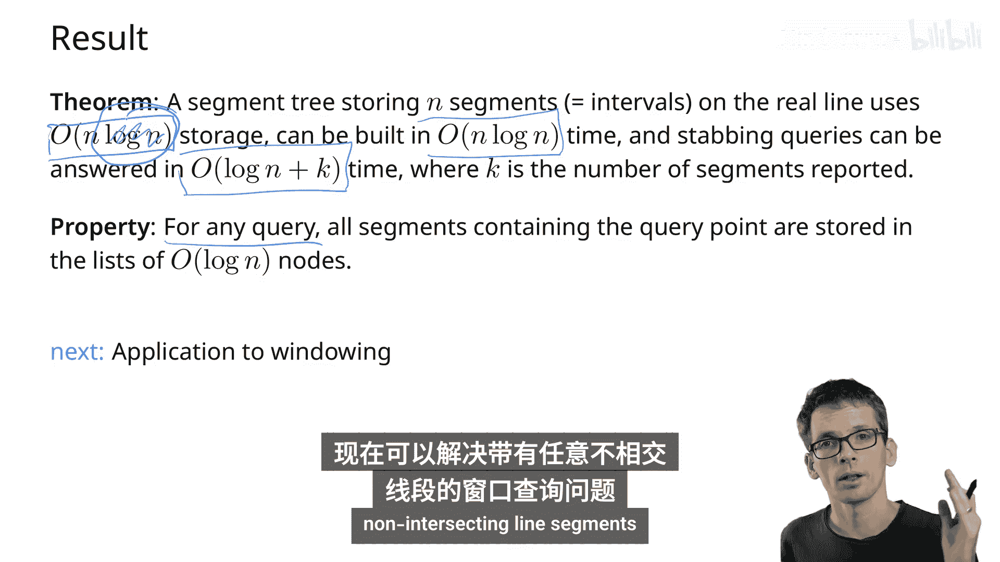

现在，我们回到最初的目标：解决任意非相交线段的窗口查询。

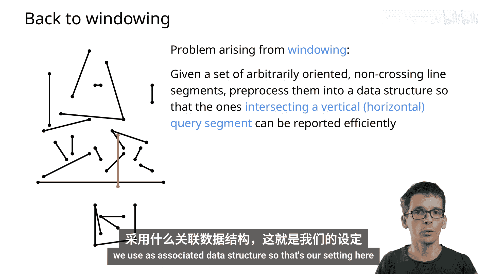

我们之前已经将问题简化为：如何高效查询与一条垂直（或水平）查询线段相交的所有线段。

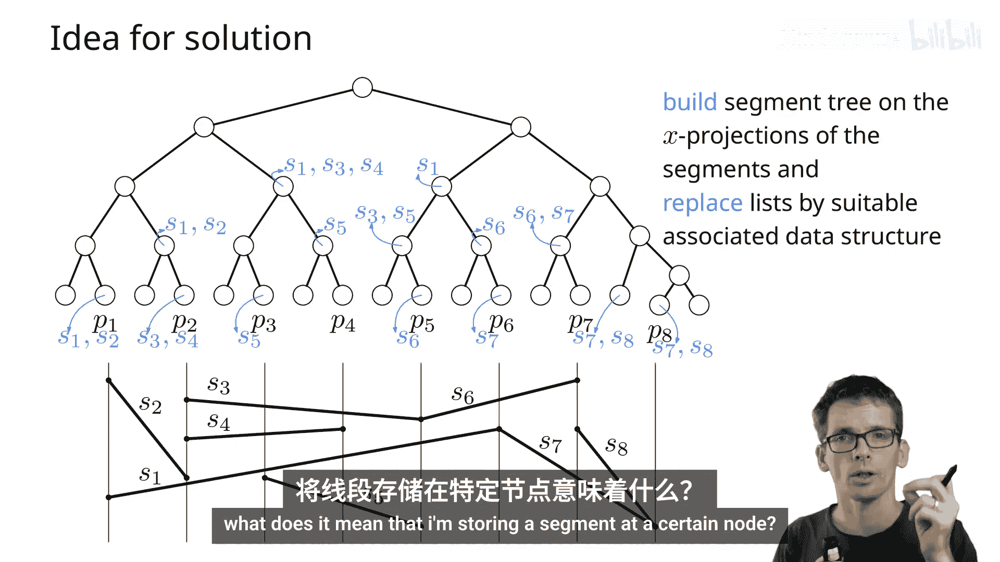

**核心思路**：我们以线段的 **x坐标投影** 为基础，构建一棵一维线段树作为主数据结构。

*   每个树节点 `v` 对应一个垂直条带 `Int(v)`。
*   在节点 `v` 的规范化子集中，我们存储所有完全跨越该垂直条带、且无法存储在更高层节点的线段。

考虑节点 `v` 对应的垂直条带。所有存储在该节点规范化子集中的线段都完全跨越这个条带，因此它们在这个条带内有一个明确的 **从上到下的顺序**。

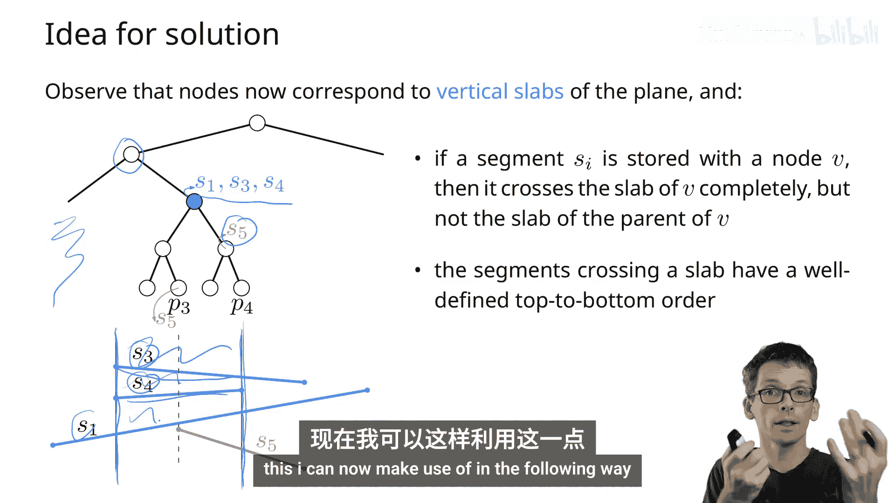

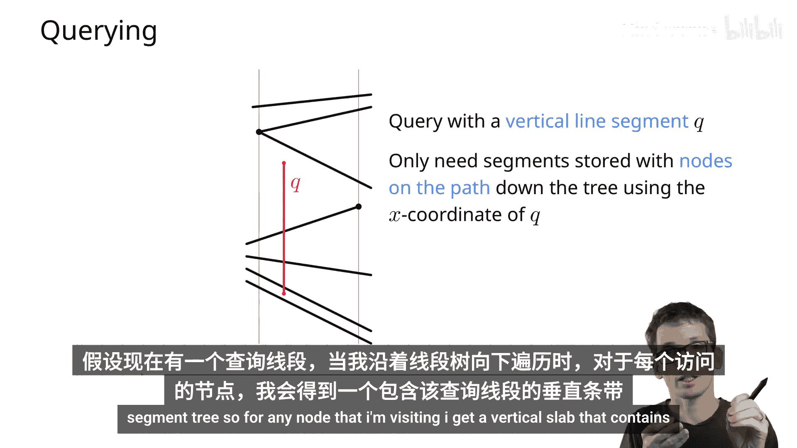

**关联数据结构**：对于每个节点 `v`，我们为其规范化子集中的所有线段，按照它们在该垂直条带内的 **y坐标顺序**，构建一棵**二叉搜索树**（即一维范围树）。

**查询过程**：对于一条垂直查询线段 `Q`（其x坐标固定，y坐标范围为 `[y1, y2]`）：
1.  在线段树中搜索 `Q` 的x坐标。这会访问 `O(log n)` 个节点。
2.  对于访问的每个节点 `v`，其对应的垂直条带包含 `Q` 的x坐标。我们在节点 `v` 的关联二叉搜索树（y坐标顺序）中，执行一维范围查询：报告所有y坐标落在 `[y1, y2]` 范围内的线段。这正是与 `Q` 相交的、存储在 `v` 中的线段。

**复杂度分析**：
*   **查询时间**：我们需要查询 `O(log n)` 个节点。在每个节点，进行一维范围查询需要 `O(log n + k_v)` 时间，其中 `k_v` 是在该节点报告的结果数。总时间为 `O(log² n + k)`。
*   **存储空间**：主线段树需要 `O(n log n)` 空间。每个线段最多出现在 `O(log n)` 个节点的规范化子集中，每个关联的二叉搜索树是线性的。因此总空间仍为 `O(n log n)`。

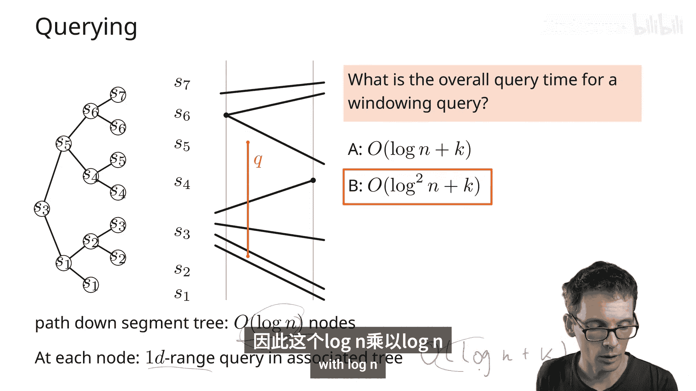

## 最终解决方案与总结

本节课中我们一起学习了如何解决任意非相交线段的窗口查询问题。

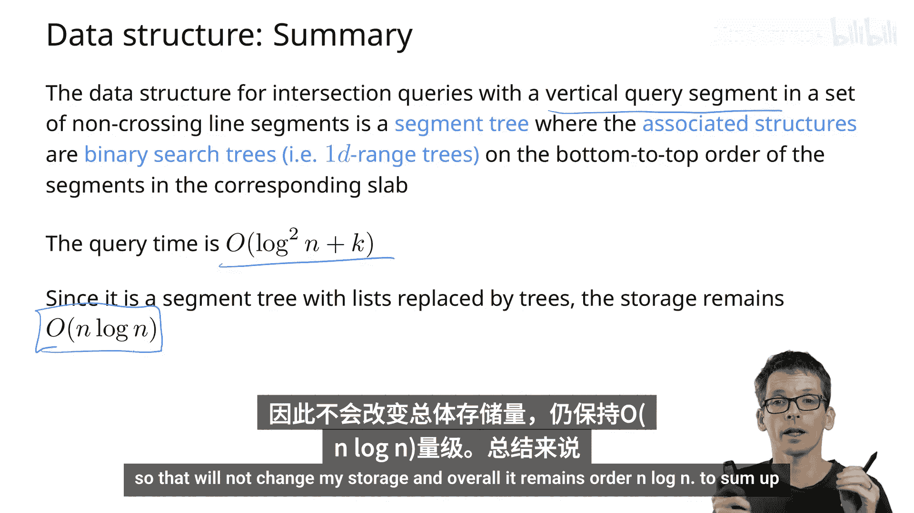

1.  **完全内部的线段**：使用二维范围树在 `O(log n + k)` 时间内找到。
2.  **与边界相交的线段**：分解为与四条边（两条垂直、两条水平）相交的查询。
    *   对于垂直边查询：使用上述的 **线段树（主结构，按x坐标） + 一维范围树（关联结构，按y坐标）** 组合，查询时间为 `O(log² n + k)`。
    *   对于水平边查询：对称地，使用 **线段树（主结构，按y坐标） + 一维范围树（关联结构，按x坐标）** 组合。

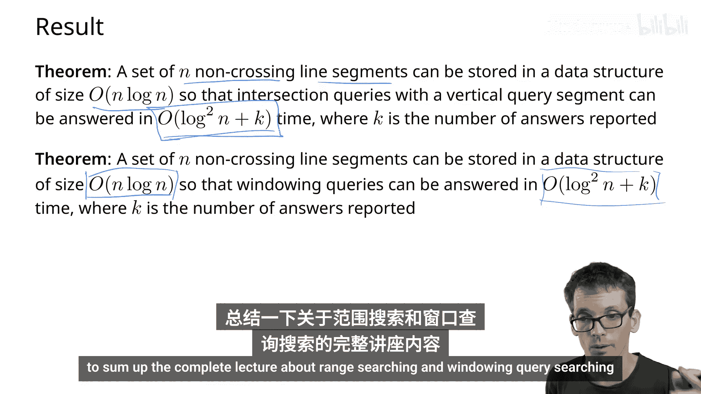

将所有这些数据结构组合起来，我们得到了一个完整的窗口查询数据结构：
*   **预处理时间**：`O(n log n)`
*   **存储空间**：`O(n log n)`
*   **查询时间**：`O(log² n + k)`

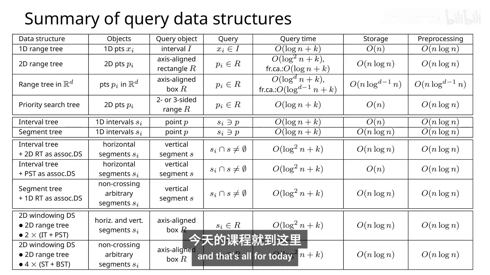

通过本课程，我们看到了如何将不同的基础数据结构（范围树、区间树、线段树）像积木一样组合起来，以解决更复杂的几何查询问题。关键在于分析查询对象的特性，选择合适的主数据结构和关联数据结构，并清楚计算由此带来的时间与空间复杂度。