# 021：四叉树、平衡四叉树与网格化 🗺️

在本节课中，我们将学习一种名为四叉树的新数据结构及其在网格生成中的应用。我们将从应用场景出发，逐步介绍四叉树的定义、构建、平衡，并最终利用它来生成满足特定要求的三角形网格。

## 概述与应用场景

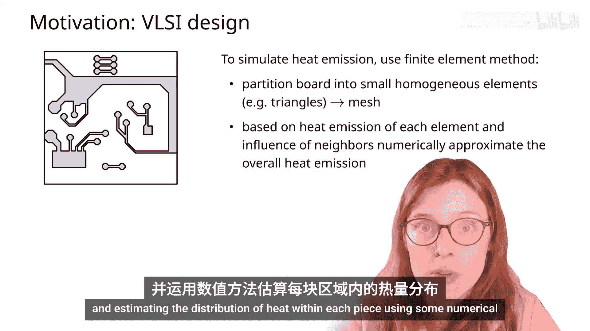

我们从一个电路板的图像及其在应力下的热辐射分布图开始。

从工程角度看，在实际生产电路板之前，根据其设计来模拟这样的热辐射图非常有用。为了模拟热辐射图，我们可以使用有限元方法。该方法将电路板划分为小块，并使用数值方法估算每块内的热分布。网格越精细，近似效果越好；网格越粗糙，计算速度越快。

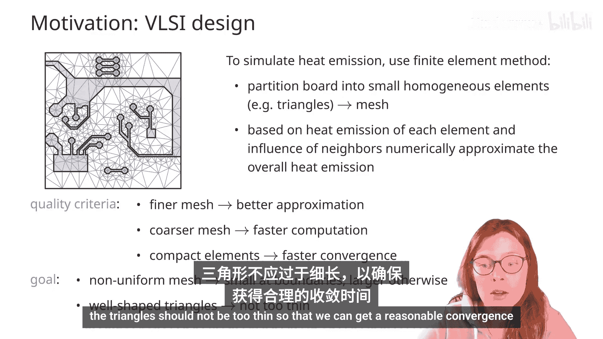

此外，如果网格单元形状紧凑，将有助于数值方法更快地收敛。

因此，今天的目标是开发一种方法，能够根据（例如）电路板的设计来构建网格。我们希望构建一个非均匀网格：在感兴趣物体的边界附近更精细，在远离边界的地方更粗糙，以节省计算时间。同时，我们希望网格由形状良好的单元组成（本例中为三角形）。三角形不应过于细长，以确保合理的收敛时间。

## 问题形式化

我们将考虑的问题限制在边界由有限方向线段描述的物体上。具体来说，我们考虑**正交多边形**，并假设其顶点坐标为整数，且多边形位于一个足够大的正方形内。我们取该正方形的边长为2的幂次。

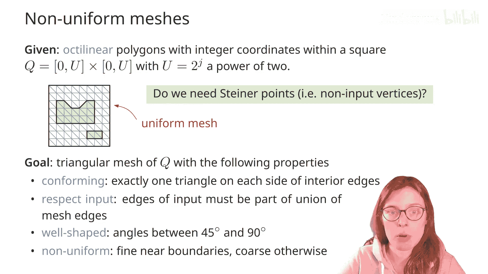

我们的目标是在此输入上构建一个三角形网格，并满足以下属性：
1.  **网格必须一致**。相邻的两个三角形必须共享完整的公共边。图中示例是一个不一致网格，因为例如这个三角形与其上方的相邻三角形只共享了部分边。
2.  **网格必须尊重输入**。这意味着生成的三角形边不应与多边形的边相交。
3.  **网格形状必须良好**。我们将限制三角形的角度在45度到90度之间。
4.  我们感兴趣的是构建一个**非均匀网格**，使其在多边形附近有更小的三角形，在远离多边形边界的地方有更大的三角形。均匀网格的三角形数量过多，无法实现高效计算。

## 是否需要引入新顶点？

为了达到目标，我们是否需要引入新顶点（即创建网格的新顶点）？

让我们从形状良好的属性开始，考虑以下任务：给定输入，我们希望找到一个能最大化最小角度的三角剖分。

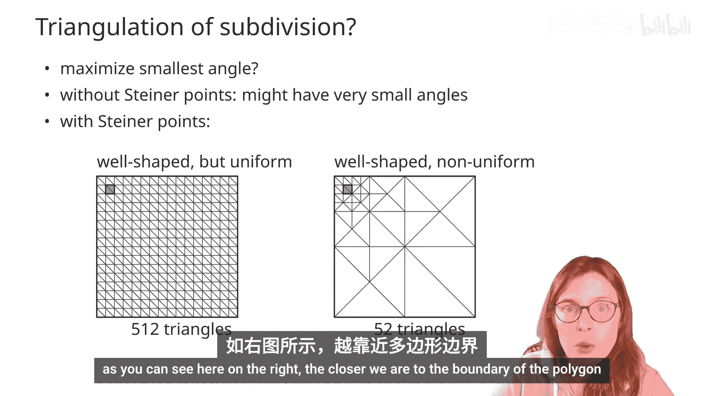

请解决以下练习：给定正方形内的一个输入多边形，我们希望找到一个不使用新顶点的网格，即我们希望将多边形内部和外部三角剖分，使得最小角度最大化。你构造的三角剖分可能类似这样。

即使我们试图最大化最小角度，仍然会得到一些角度非常小的三角形。因此，确实，如果不引入新顶点，我们无法保证三角形具有良好的形状。而引入新顶点后，我们可以得到一个形状良好且非均匀的网格。

这里比较左侧的均匀网格和右侧的非均匀网格。左侧有超过500个三角形，而右侧只有52个三角形。如右图所示，越靠近多边形边界，三角形越小。

## 四叉树简介

为了构建良好的网格，我们将使用四叉树。四叉树不仅可用于网格生成，还可用于各种不同的应用。例如，在地图中，它们用于在不同缩放级别之间平滑导航。你可以通过下方链接探索谷歌地图如何使用四叉树。

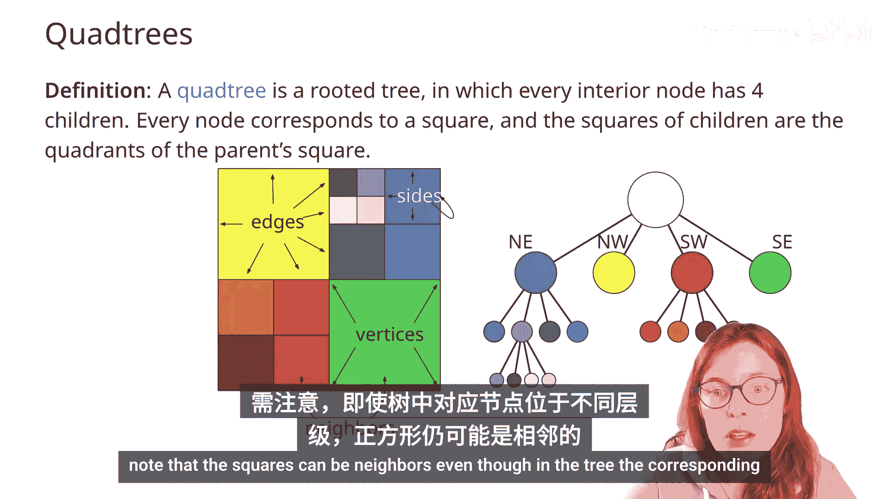

现在，让我们定义这个非常有用的数据结构。要在正方形上构建四叉树，我们将迭代地将正方形划分为越来越小的正方形。

对应的四叉树将是一棵有根树，其中每个内部节点有四个子节点，对应将正方形分割为四部分时得到的四个象限。树中的每个节点对应划分中的一个正方形。父节点对应较大的正方形，树中的子节点对应较小的正方形。

当我们讨论正方形的划分时，将使用**细分**的术语：细分有边、顶点和面。但我们也会讨论**站点**，即正方形的边界。我们将学习通过在相邻正方形之间移动来遍历划分。注意，即使对应的节点在树中位于不同层级，正方形也可以是相邻的。

## 四叉树的正式定义与构建

正式地，对于正方形Q内的点集P，四叉树可以用以下递归定义：
*   如果集合P包含一个点或为空，则对应于该正方形的四叉树是一个叶子节点，存储该点集（一个点或零个点）。
*   如果点集包含多于一个点，则将其划分为四个较小的正方形。此时，四叉树是一个根节点，有四个子节点，分别对应四个较小的正方形（我们将其标记为东北、西北、东南、西南方向）。点集P将被这些正方形划分为四个子集。例如，所有位于东北正方形内的P中点将归入集合P_ne。

根据定义，如果一个点恰好位于两个正方形的边界上，则它将被分配给左侧或底部的正方形。

让我们为这个例子构建一个四叉树。我们从一个包含多于一个点的正方形开始。因此，对应于此点集的四叉树将是一个有四个子节点的根节点，每个子节点对应一个较小的正方形。

现在，其中两个正方形是空的，因此根据定义，它们在树中是叶子节点。但另外两个正方形各自仍包含多于一个点，需要进一步划分，因此我们将在树中创建对应的父节点，每个父节点有四个子节点。

在东北方向，每个正方形现在包含零个或恰好一个点，因此所有较小的正方形都对应叶子节点。另一方面，在西南方向，有三个包含零个或一个点的正方形，它们对应叶子节点，但有一个正方形需要进一步细分，并且树中对应的节点将获得四个子节点。

我们将重复此过程，直到每个较小的正方形恰好包含零个或一个点。

因此，右侧的树是对应于点集和左侧正方形细分的四叉树。

请在下一页完成此练习，并为给定的点集构建一个四叉树。记住，根据定义，如果一个点落在两个正方形的边界上，则它将被分配给左侧或底部的正方形。

你得到了这部分正方形和树吗？如果是，做得很好；如果不是，请将你的解与屏幕上看到的解进行比较。

我们在上一节介绍的四叉树的递归定义直接引出了构建四叉树的算法。

## 四叉树的深度与规模

让我们探讨四叉树的一些性质，首先考虑四叉树的深度。

考虑以下问题：如果我们知道四叉树有n个节点，它的深度可能是多少？

我们可以证明以下引理：如果参数C表示构建四叉树所用点对之间的最小距离，s是原始正方形的边长，则在该点集上为该正方形构建的四叉树的深度最多为 `log(s/C) + 3/2`。

引理的证明如下：我们从一个边长为s的正方形开始。假设它处于某个层级i，意味着其深度大于i。如果存在一个层级为i的正方形，其边长将为 `s / 2^i`。在第0层，正方形的边长是s，这对应 `s / 2^0`。在树的第一层，我们将正方形分割为四个，因此每个正方形的边长为 `s/2`。在接下来的每一层，我们进一步细分正方形，意味着我们将正方形的边长减半。现在，在深度为i的正方形内，如果有两个点，这两点之间的最大距离最多为正方形边长的 `√2` 倍。

因此，如果包含两个点的正方形的深度为i，根据引理假设，正方形内两点之间的距离至少为C，这意味着正方形的对角线必须大于或等于C。如果我们对这个不等式求解i，我们得到 `i ≤ log(s/C) + 1/2`。并且由于假设这是一个包含两个点的内部节点，四叉树的高度最多为 `log(s/C) + 3/2`，即再加一。

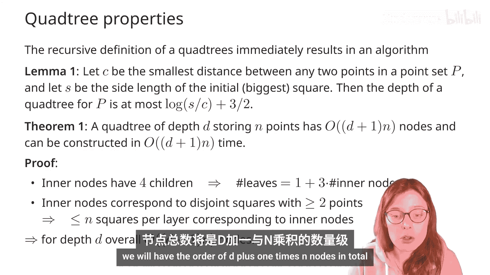

现在我们知道如何限制树的深度。如果D是在由n个点组成的点集上构建的最终四叉树的深度，那么它将有 `O((D+1)n)` 个节点，并且可以在 `O((D+1)n)` 时间内构建。

证明如下：注意我们可以找到四叉树中叶节点数与内部节点数之间的关系。因为当我们分割一个正方形时，我们用一个内部节点和四个新叶节点替换一个叶节点，这意味着我们增加了一个内部节点和三个叶节点。因此，我们得到关系：树中叶节点的数量等于 `1 + 3 * (内部节点数量)`。并且因为所有内部节点都对应需要分割的正方形（即那些至少包含两个点的正方形），那么在树的每一层，最多有n个对应内部节点的正方形。从这两个观察结果，我们可以得出结论：如果D是最终四叉树的深度，那么节点总数将为 `O((D+1)n)`。

## 遍历四叉树细分

现在讨论如何遍历四叉树细分。给定四叉树中的一个节点v，我们将看看如何找到它的邻居。我们以寻找北邻居为例。

考虑伪代码：给定四叉树T的节点v，我们将找到最深节点v‘，其层级与v相同或高于v，使得v’对应的正方形是v对应正方形的北邻居。

算法如下：
1.  检查v是否是树的根。如果是，则根没有北邻居，返回null。
2.  否则，令p为树中v的父节点。
3.  如果v是该父节点p的西南或东南子节点，那么我们只需返回该父节点p的西北或（相应地）东北子节点。即，如果这是父节点p，节点v对应西南正方形，那么我们只需返回p的西北子节点。类似地，如果v对应p的东南子节点，那么我们只需返回p的东北子节点。
4.  另一方面，如果v不是p的西南或东南子节点（如本例所示，这是正方形p），那么我们递归地找到父节点p的北邻居（这里这将是节点p的北邻居μ）。如果μ不存在（返回null），或者μ本身是叶子节点，那么我们直接返回μ。否则，根据v是p的西北还是东北子节点，我们返回μ的西南或东南子节点。

以下定理展示了该算法运行时间的分析：如果我们的四叉树深度为D，则可以在 `O(D+1)` 时间内找到节点v在任何方向上的邻居。

为了证明这个定理，我们可以观察到递归深度是 `O(D+1)`。我们只在调用递归时向上移动树，并且每个递归步骤的成本是常数。因此，确实，通过在邻居之间移动来遍历四叉树细分可以在四叉树深度的量级内完成。

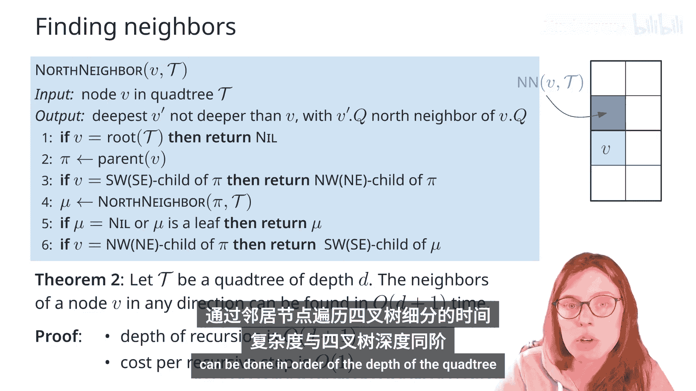

## 平衡四叉树

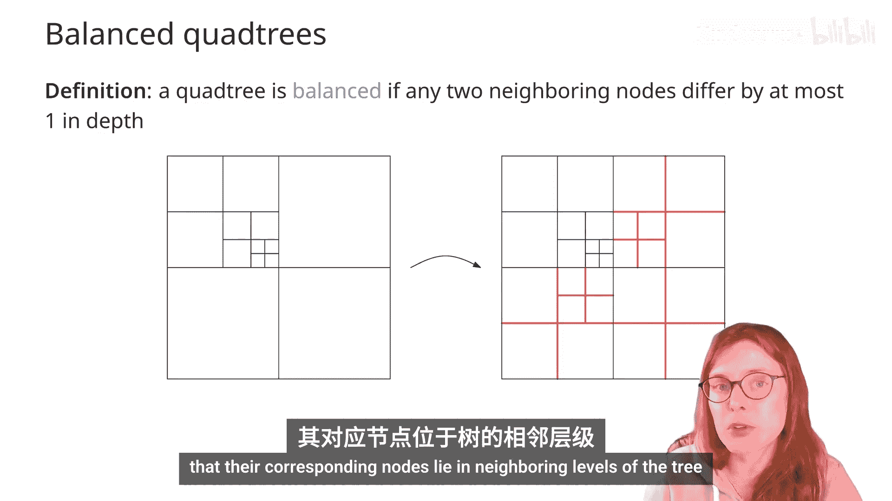

如果任何两个对应相邻正方形的节点在深度上最多相差1，则称该四叉树是**平衡的**。

这是一个不平衡四叉树的例子，我们看到有两个相邻的正方形，其对应的节点在树中的深度相差超过1。为了使这个四叉树平衡，我们可以细分一些正方形，直到所有相邻正方形的大小最多相差两倍（即它们对应的节点位于树的相邻层级）。

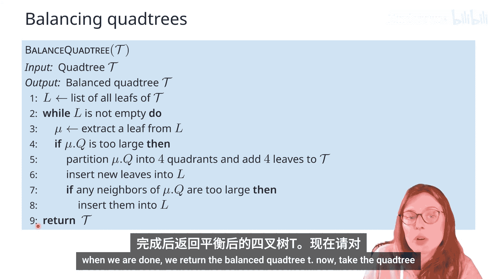

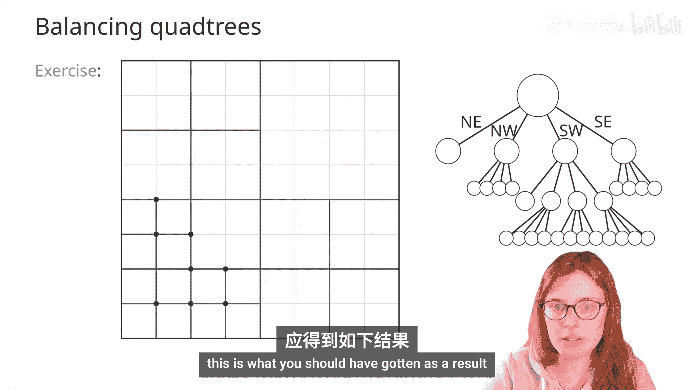

考虑以下平衡四叉树的算法。输入是一个四叉树T，输出是一个平衡的四叉树T‘。
1.  定义一个列表L，并将树的所有叶子节点放入其中。
2.  当列表L不为空时，执行以下操作：
    *   从L中取出任意一个叶子节点。
    *   如果这个叶子节点对应的正方形“太大”，则将其划分为四个象限，向树中添加四个叶子节点，并将这四个新叶子节点插入L。
    *   之后，如果旧正方形的任何邻居“太大”，则也将它们插入L。
3.  我们重复这个细分叶子节点的操作，直到列表L为空。完成后，返回平衡的四叉树T‘。

现在，请将你在上一个练习中构建的四叉树进行平衡。这是你应该得到的结果。

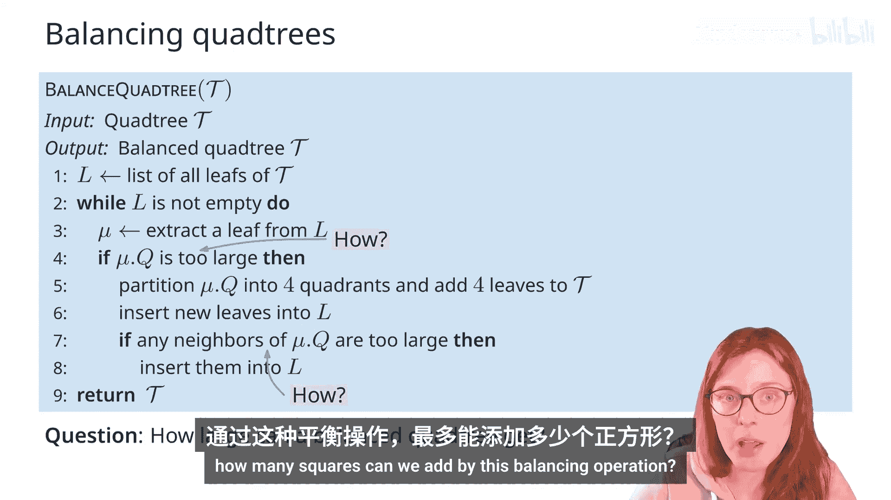

## 平衡算法细节与复杂度

回到算法。我们究竟如何决定一个正方形是否“太大”需要细分？或者一个正方形的邻居是否“太大”需要稍后考虑并加入列表？

如果树中的节点处于同一层级或相邻层级，那么它们对应的正方形大小最多相差两倍。但如果节点相距更远（不在相邻层级），那么正如我们之前提到的，它们对应的正方形大小差异将超过两倍。这正是我们判断正方形Q是否“太大”的依据：如果它有一个邻居，其大小比Q小两倍以上。类似地，如果在将Q细分为四个象限后，任何新正方形相对于旧正方形来说“太小”，我们也会将它们添加到列表L中。

通过这种平衡操作，我们可以添加多少个正方形？

事实上，我们将证明：给定一个有M个节点的四叉树，我们可以平衡它并获得一个平衡的四叉树，其节点数为 `O(M)`，并且可以在 `O((D+1)M)` 时间内构建，其中D是原始树的深度。

为了证明这一点，我们将进行以下观察：在平衡四叉树T时，我们最多会分割其正方形 `8M` 次。为什么？

我们的分析将基于考虑旧正方形与新正方形。旧正方形是原始四叉树T中的正方形，新正方形是我们在平衡操作期间引入的正方形。

考虑在平衡操作中被分割的正方形σ。我们将考虑它的八个邻居（即位于同一层级或更高层级的正方形）。我们将声称：如果σ必须被分割，那么它的八个邻居中至少有一个是旧正方形（即存在于原始四叉树中的正方形）。我们将通过反证法证明这一主张。

假设存在被分割的正方形σ，其所有邻居都是新的。那么我们将考虑其中最小的这样的σ。在所有违反“其八个邻居中有一个是旧的”这一假设的σ中，我们取最小的σ。然后通过推导出必然存在一个更小的具有此性质的σ‘来得出矛盾。

假设σ是被分割的、周围所有八个邻居都是新邻居的最小尺寸正方形。让我们考虑正方形σ‘，它是导致σ被分割的原因（即σ‘本身被分割成更小的象限，并迫使σ被分割）。由于σ周围的所有八个邻居根据假设都是新的，那么σ‘的父节点是新的，并且σ‘本身也是新的。所有这些正方形都是在平衡过程中出现的。现在观察σ‘周围的这些正方形都是新的，因为它们包含在σ的邻居正方形中，而根据假设所有这些正方形都是新的。这意味着σ不可能是所有邻居都是新的最小正方形，存在一个更小的正方形σ‘，其所有邻居都是新的。因此，我们的假设不正确，如果任何正方形被分割，它的一个邻居必须是旧的。

这意味着我们可以使用分摊论证，将每次分割分摊给一个旧邻居。每个旧邻居最多会从同一层级的邻居那里获得八次分割。这意味着最多可以有 `8M` 次分割。

现在对于算法的运行时间，当我们执行分割时，我们会在每个考虑的节点的邻居中搜索，我们知道这可以在 `O(D+1)` 时间内完成。因此，如果我们执行 `O(M)` 次分割，每次 `O(D+1)` 时间，总运行时间为 `O((D+1)M)`。

注意，有些四叉树可能相当空。即使它们有很多层，也可能包含很少的点，如图所示。为了节省存储这些空正方形的空间，我们可以使用所谓的**压缩四叉树**。我们在这里做的是压缩由空节点组成的路径。这将产生一个线性大小的数据结构。不过，我们在此不进一步讨论压缩四叉树。

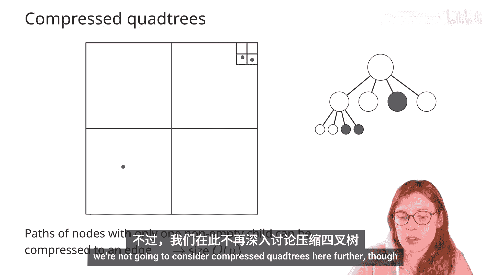

## 回到网格生成问题

让我们回到网格生成问题。回想一下，我们给定一组位于正方形内的正交多边形，其顶点坐标为整数，正方形边长是2的幂次。我们的目标是构建一个三角形网格，该网格需要满足：
*   **一致**：相邻三角形共享完整边。
*   **尊重输入**：三角形边不与输入多边形边界相交。
*   **形状良好**：所有三角形角度在45度到90度之间。
*   **非均匀**：在多边形附近更精细，远离多边形边界更粗糙。

我们将使用四叉树作为构建此类网格的基础。

到目前为止，我们已经学会了如何在点集上构建四叉树。这里的输入是多边形，我们需要如何调整才能使四叉树在此工作？

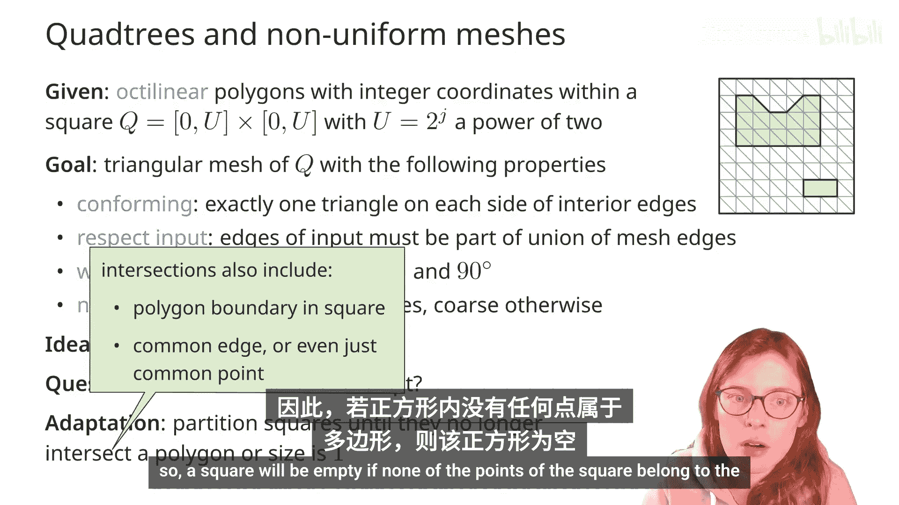

我们将细分正方形，直到它们要么为空，要么达到单位大小。当我们达到小尺寸的正方形时，由于多边形是正交的，它们与正方形的相交可能沿着对角线穿过内部，或者与正方形有公共边，甚至公共点。对于所有这些正方形，我们将说多边形与这些正方形**相交**。因此，如果一个正方形的任何点都不属于多边形，则它是空的。

考虑这个例子：我们给定正方形内具有整数坐标的正交多边形。我们将开始将正方形细分为越来越小的正方形，直到达到完全空的正方形或达到单位大小的正方形。这是我们将继续使用的四叉树结果。观察完成后，如果一个多边形与正方形的内部相交，那么它将沿着正方形的一条对角线相交。

现在，我们在多边形之上有了这个四叉树细分，如何从这些正方形中得到网格？第一个简单的方法是简单地沿对角线分割每个正方形。但这样我们会得到一个不一致的网格：会有些相邻的三角形没有完全共享它们之间的整个边。

也许我们可以为正方形的每个顶点添加顶点。现在我们得到的三角形角度太小了。

如何获得有效网格的解决方案是：首先平衡四叉树，然后如果必要，在正方形内部添加新顶点。因此，首先，我们将平衡四叉树。然后，我们将要么沿对角线分割这些正方形，要么如果一个正方形有相邻的较小正方形，我们将在面的中心添加一个新顶点，并将其连接到所有相邻正方形的顶点，如下图底部所示。

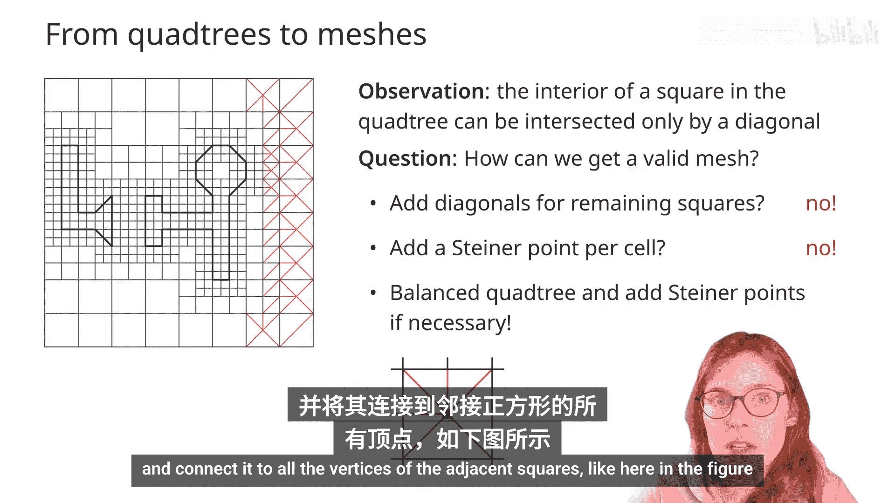

## 网格生成算法

让我们用以下伪代码形式化这个算法。

我们从一个平衡的四叉树T及其对应的正方形Q的四叉树细分开始。我们将输出T的一个三角剖分。
1.  我们从四叉树细分的双向连接边表表示开始。
2.  对于其中的每个面：
    *   如果它是一个单位正方形并且其内部与某个多边形相交（回想一下，该多边形将沿其对角线与正方形相交），那么我们将这条对角线添加到相应的三角剖分中。
    *   如果一个正方形没有被多边形沿对角线相交，那么让我们考虑相邻正方形的顶点。
        *   如果它们没有分割正方形的任何边，那么我们将简单地添加一条对角线。
        *   否则，我们将在面的中心添加一个新顶点，并将其连接到正方形的所有顶点，以及被相邻正方形顶点分割的边的中点。

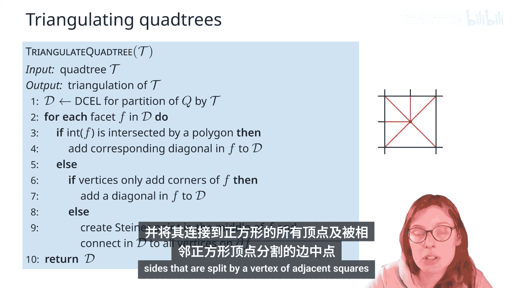

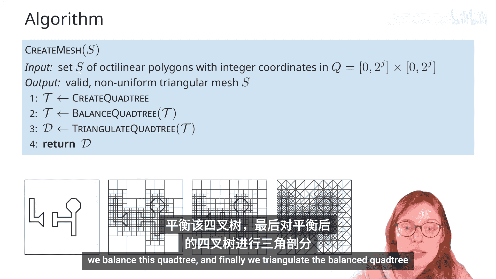

最终，从正方形内具有整数坐标的一组正交多边形开始创建网格的算法如下：
1.  首先，在输入上创建一个四叉树。
2.  平衡这个四叉树。
3.  最后，对平衡后的四叉树进行三角剖分。

请为这个输入多边形在正方形内构建一个四叉树，平衡它，然后构建三角剖分。将你的解与屏幕上的解进行比较。

## 总结与定理

总结我们的网格生成方法，我们得出以下定理：给定正方形网格上边长为U的正方形内的一组数字多边形对象，我们可以在这些对象集上构建一个非均匀三角形网格，该网格将是一致的、形状良好的并尊重输入。网格内的三角形数量为 `O(P(S) log U)`，其中 `P(S)` 是所有对象的总周长，并且网格可以在 `O(P(S) log² U)` 时间内构建。

为了证明这个定理，首先我们分析网格的大小。我们首先计算与多边形边界相交的单位正方形的数量。我们观察到多边形对象的每单位周长只与常数个单位正方形相邻。这意味着被多边形对象相交的单位正方形数量与这些对象的周长成正比。但对于四叉树任何层级的较粗网格也是如此，因此由于四叉树的深度与原始正方形边长U的对数成正比，我们得到四叉树的大小与多边形周长乘以 `log U` 成正比。这给出了最终网格中的三角形数量。

对于构建时间，构建四叉树需要与四叉树大小成线性时间，平衡过程为运行时间增加了一个对数因子，而最终的三角剖分步骤可以在与四叉树大小成线性时间内完成。这为我们提供了一个三角形数量为 `O(P(S) log U)` 的网格，并且可以在 `O(P(S) log² U)` 时间内构建。

## 讨论与扩展

我们以一些讨论问题结束今天关于四叉树和网格生成的主题。
1.  前面提到了压缩四叉树，它们能否被高效计算和更新？事实上，可以，那些将被称为跳跃四叉树，它们将具有线性复杂度，并支持对数时间的更新和搜索操作。请参阅引用的论文以获取更多细节。
2.  今天，我们提到了使用四叉树的两个应用。还有其他应用吗？正如前面提到的，四叉树确实应用广泛，从计算机图形学到地理信息系统，甚至在几何算法中，它们经常被用来构建近似算法。
3.  最后，我们的标准问题：这能推广到更高维度吗？确实，四叉树很容易推广到更高维度。在三维中，它们将被称为八叉树，因为现在每个立方体将被细分为八个较小的立方体。

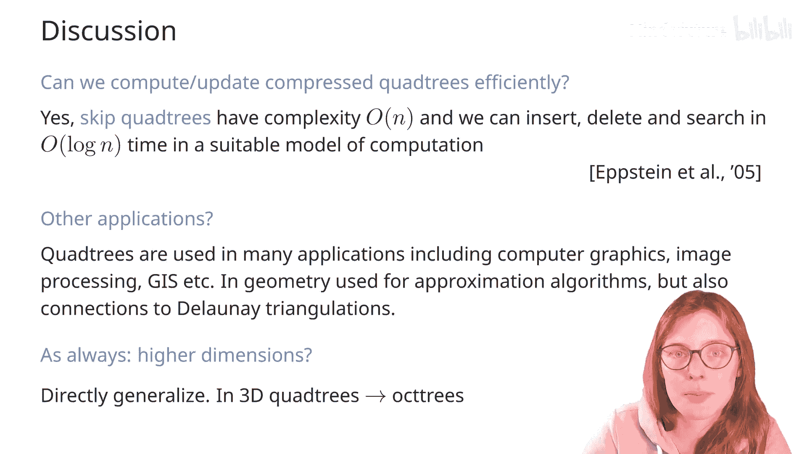

## 本节课总结

在本节课中，我们一起学习了四叉树数据结构。我们从其定义和构建开始，探讨了其深度和规模性质，并学习了如何遍历和平衡四叉树。最后，我们将四叉树应用于网格生成问题，展示了如何通过构建、平衡四叉树并对其进行三角剖分，来为给定的正交多边形集合生成一个一致、形状良好、尊重输入且非均匀的三角形网格。四叉树是一个强大而通用的工具，在计算几何及其他领域有着广泛的应用。