# 022：几何算法-超越理论 🧮

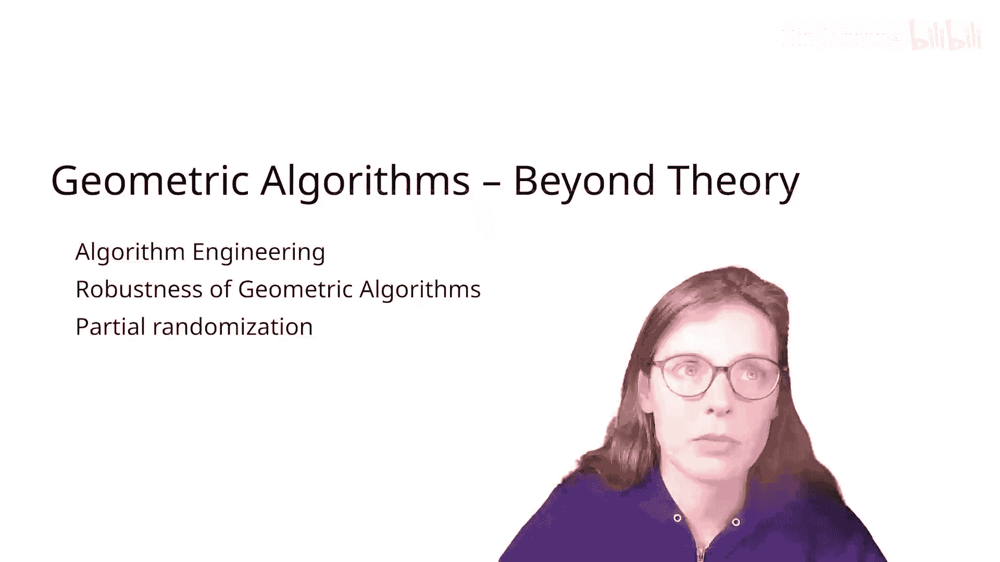

在本节课中，我们将探讨几何算法从理论设计到实际实现过程中可能遇到的挑战。我们将从一个凸包算法的例子出发，分析浮点数精度、算法鲁棒性以及内存访问模式等实际问题，并学习如何通过精确计算、谓词过滤和部分随机化增量构造等技术来应对这些挑战。

---

## 从理论到实践的挑战 ⚠️

上一节我们介绍了增量法构建凸包的算法思路。本节中，我们来看看该算法在实际实现中可能遇到的问题。

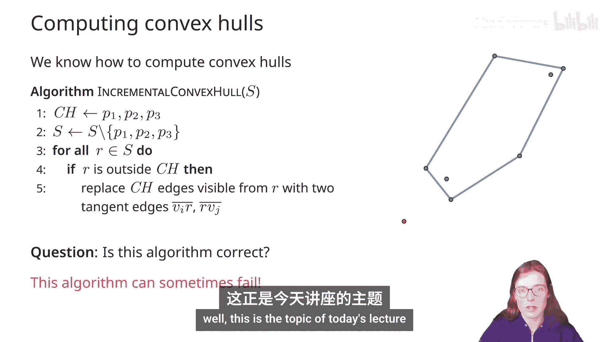

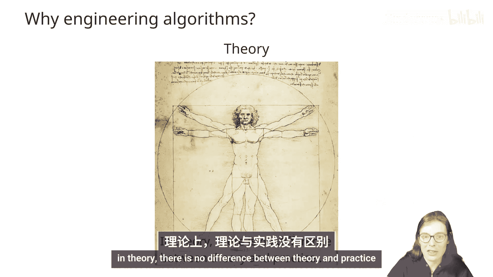

该算法从一个由三个点初始化的凸包开始，按任意顺序处理剩余点。对于每个新点R，检查它是否位于当前凸包外部。如果是，则用从R到凸包边界的两条切线（绿色）替换R可见的边（橙色）。理论上，如果正确计算了可见边和切线，算法是正确的。但在实践中，该算法有时会失败，例如某些点可能被错误地留在凸包外部。

> “理论上，理论与实践没有区别。但在实践中，有区别。”

在设计算法时，我们使用自然数或实数等数字类型，但在计算机内存中这些数字有特定的表示方式。分析运行时间时，我们通常只关注渐近复杂度，而实际中每一秒都很重要。在课堂上设计算法时，我们常常停留在抽象描述，并假设“一般位置”以简化问题。但在实现时，我们可能遇到非平凡的挑战，实现可能包含错误。此外，在设计算法时，我们通常不关心算法将使用的内存量，一个常见的假设是访问任何已计算的值不需要成本。当然，在实践中，我们必须处理内存层次结构和数据访问成本。最后，在分析算法时，我们假设基本操作需要常数时间。实际上，不同的操作需要不同的时间，并且它们通常通过指令流水线并行执行。

---

## 算法工程周期 🔄

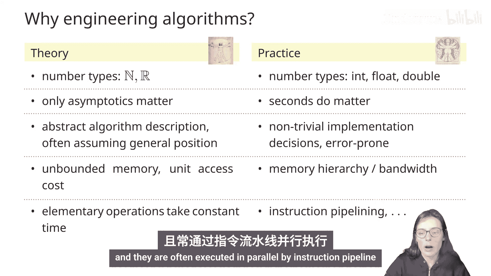

下图展示了一个算法工程周期的示意图。

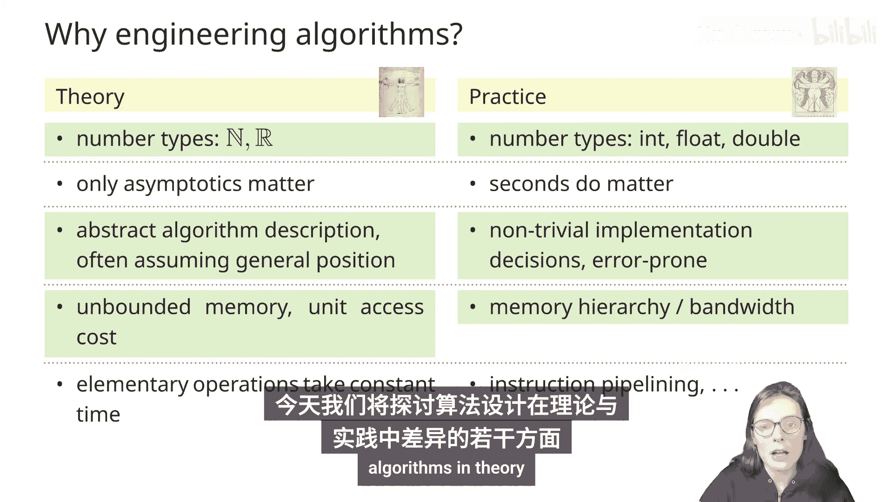


我们从算法设计开始，然后进行理论分析。在课堂上，过程通常到此结束，但在现实中，你会希望继续实现这个算法。实现后，我们当然希望测试它，并可能进行实验分析。这样做我们可能会观察到来自现实生活的输入数据的某些特性，这可以为我们提供改进算法分析的见解。我们也可能遇到一些瓶颈，或者获得一些启发式改进算法性能的想法，然后我们会希望回去重新实现。最后，我们可能会产生更深入的见解，并回到流程的最开始，改变算法的设计。通过多次迭代重复这个循环，我们可以收敛到一个给定问题的良好解决方案。

接下来，我们将介绍一些将理论算法设计转化为实际实现的技术。

---

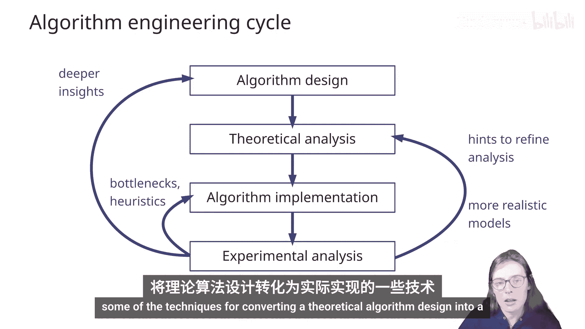

## 增量凸包算法的实践陷阱 🕳️

让我们回到增量凸包算法，看看在实践中可能出什么问题。

首先，考虑以下问题：点R“看到”凸包的某条边 V_i V_{i+1} 是什么意思？如果边 V_i V_{i+1} 的方向是沿凸包边界逆时针遍历的，那么如果三个点 V_i, V_{i+1} 和 R 构成一个右转，我们就可以说 R 看到了这条边。那么，如何测试三个按给定顺序排列的点是否构成右转呢？

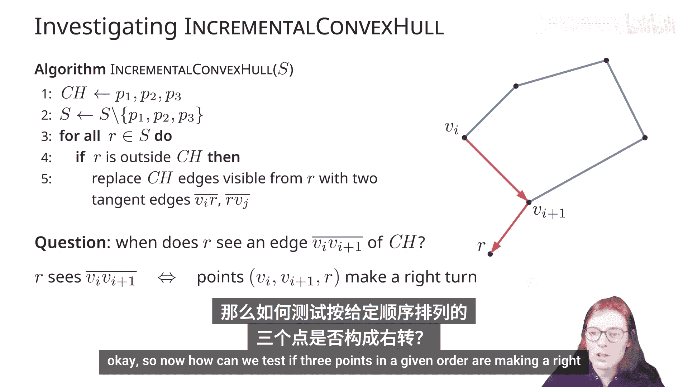

### 方向测试的实现

我们定义一个方向函数 `orientation(p, q, r)`，它接受三个点 p, q, r：
*   返回 **+1**，如果 r 位于有向边 pq 的左侧。
*   返回 **-1**，如果 r 位于有向边 pq 的右侧。
*   返回 **0**，如果三点共线。

例如，在下图中，R 位于有向边 pq 的右侧，因此 `orientation(p, q, r)` 在这种情况下将返回 -1。

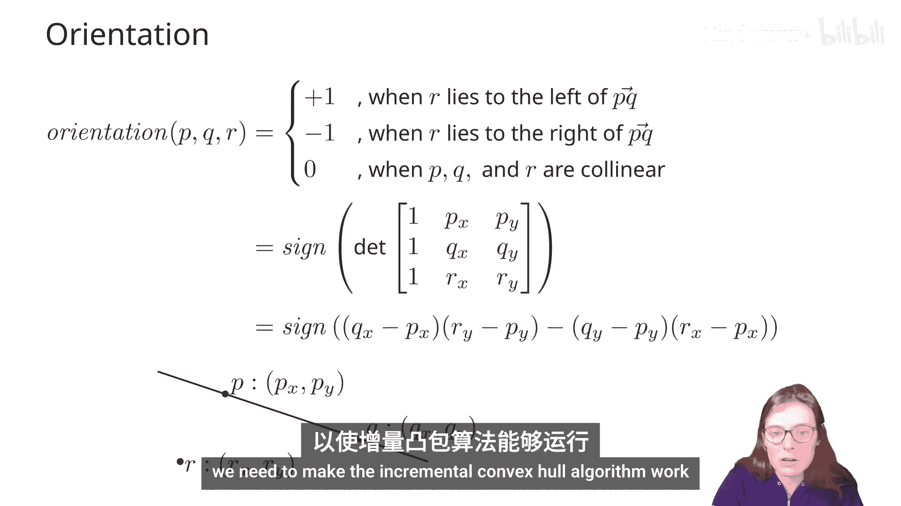


为了计算这个方向函数，我们可以检查以下矩阵行列式的符号：

```
| 1  p.x  p.y |
| 1  q.x  q.y |
| 1  r.x  r.y |
```

它可以进一步简化为以下表达式：

```
(q.x - p.x)*(r.y - p.y) - (q.y - p.y)*(r.x - p.x)
```

所以，计算行列式值的符号即可实现方向测试。在代码中，这通常通过计算上述表达式的值并判断其正负来实现。

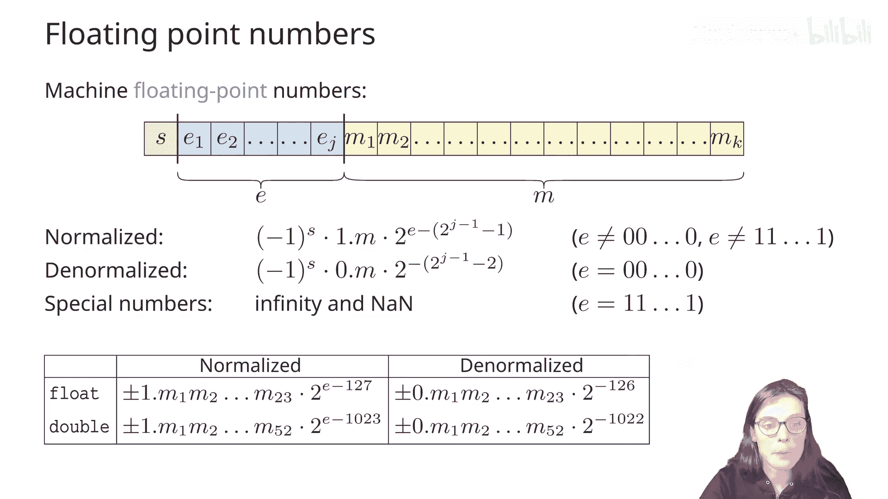

```cpp
int orientation(Point p, Point q, Point r) {
    double val = (q.x - p.x) * (r.y - p.y) - (q.y - p.y) * (r.x - p.x);
    if (val > EPSILON) return 1;      // 左转
    else if (val < -EPSILON) return -1; // 右转
    else return 0;                     // 共线
}
```

---

## 浮点数表示与精度问题 🔢

现在讨论数字在计算机内存中的表示方式，特别是浮点数的表示。

一个浮点数存储在一定数量的比特中。第一个比特 S 表示数字的符号。接下来的 E 个比特表示指数。最后的 M 个比特表示尾数。有两种方式可以将符号、指数和尾数值组合起来表示一个浮点数。

第一种称为**规范化表示**。在这种情况下，浮点数由以下表达式给出：

```
(-1)^S * 1.M * 2^(E - Bias)
```

这里，Bias 是偏移量，等于 `2^(E-1) - 1`。

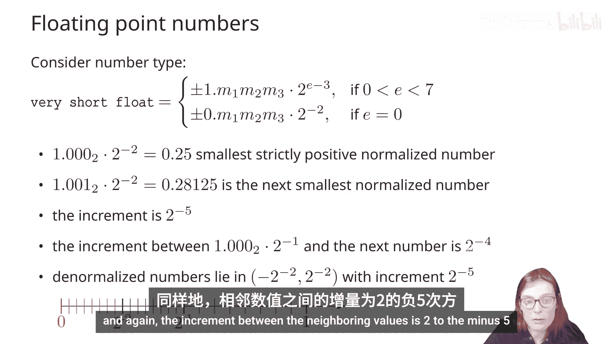

还有数字的**非规范化表示**。与规范化表示的区别在于，小数点前是 0 而不是 1。计算机可以通过检查指数的所有比特是否为零来识别何时使用非规范化表示存储数字。如果指数不全为零或不全为一，那么它就是浮点数的规范化表示。最后，所有比特都设置为 1 的指数保留用于特殊数字表示，如无穷大、NaN 等。

在许多编程语言中经常遇到的两种标准浮点数类型是 `float`（单精度）和 `double`（双精度）。下表显示了它们在其规范化和非规范化表示中可以表示的值范围。

| 类型 | 总比特数 | 符号位 | 指数位 (E) | 尾数位 (M) | 规范化范围 (近似) | 非规范化最小正值 (近似) |
| :--- | :---: | :---: | :---: | :---: | :--- | :--- |
| `float` | 32 | 1 | 8 | 23 | ±1.2e-38 到 ±3.4e38 | ~1.4e-45 |
| `double` | 64 | 1 | 11 | 52 | ±2.2e-308 到 ±1.8e308 | ~4.9e-324 |

### 一个简化的例子

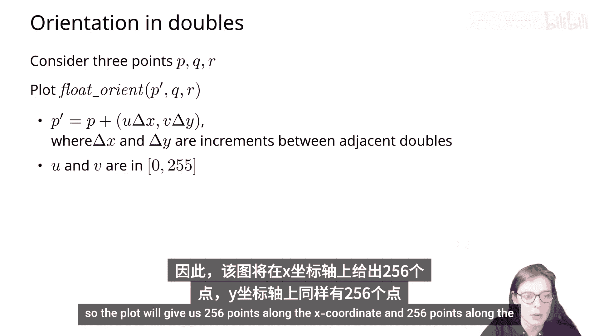

考虑一个我们称之为“超短浮点数”的新数字类型。它的指数和尾数都有 3 比特的容量，因此它们都可以取 0 到 7 的值。当指数在 1 到 6 的范围内时，这对应于超短浮点数的规范化表示；当它为 0 时，是非规范化表示。

*   **最小的严格正规范化数**：选择最小的尾数值（0）和仍对应于数字规范化表示的最小指数值（1）。代入公式 `1.0 * 2^(1-3) = 1/4 = 0.25`。
*   **次小的规范化数**：尾数 M=1，指数 E=1。得到 `1.001 * 2^(-2) = 0.28125`。

在区间 `[2^{-2}, 2^{-1}]` 上，超短浮点数类型可以表示增量为 `2^{-5}` 的数字。在下一个区间 `[2^{-1}, 1]` 上，相邻值之间的增量是 `2^{-4}`。非规范化数字落在区间 `[-2^{-2}, 2^{-2}]` 内，相邻值之间的增量也是 `2^{-5}`。

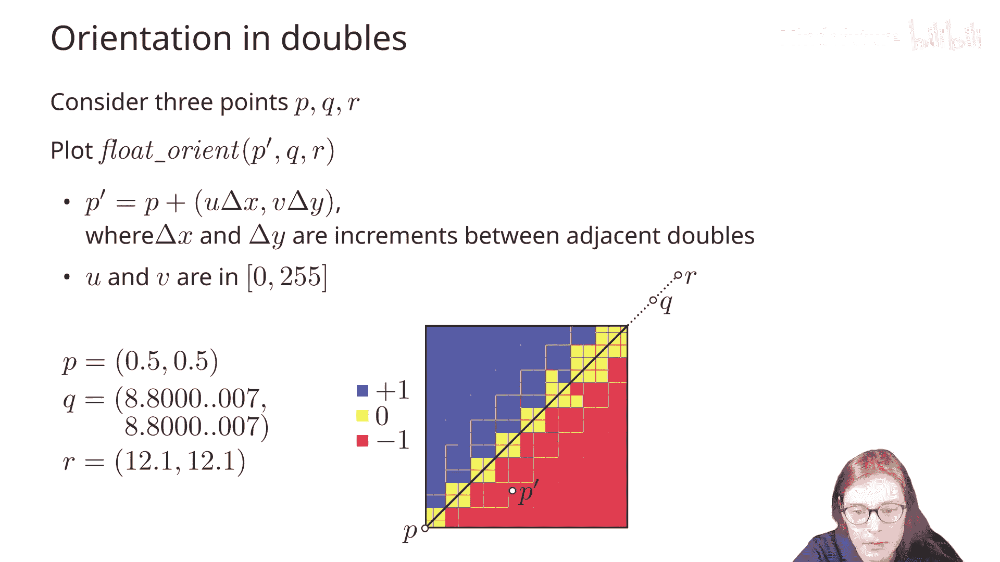

### 精度问题实例

现在回答以下问题（仍考虑相同的超短浮点数类型）：使用这个超短浮点数计算 4 + 0.25 的结果是什么？

令人惊讶的是，你得到的结果是 **4**。第二个加数太小，无法使总和达到 4 之后下一个可以用超短浮点数表示的值。这种类型的舍入错误在实现几何算法时会导致很多问题。

现在回到方向测试。考虑三个点 P, Q, R。我们将在点 P‘, Q, R 上绘制方向测试的值图，其中我们将 P’ 定义为 `P + (u * Δx, v * Δy)`，Δx 和 Δy 是两个相邻浮点数之间可能的最小增量，u 和 v 在 0 到 255 的范围内。因此，该图将沿 X 坐标给出 256 个点，沿 Y 坐标给出 256 个点。

如果我们设置 P 的坐标为 (0.5, 0.5)，Q 为 (12, 12)，R 为 (24, 24)，那么下图显示了在点 P‘, Q, R 上测试方向可以得到的结果。


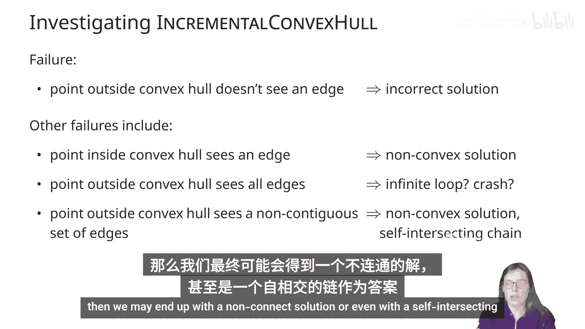

如图所示，我们不仅可能得到值 0（意味着三点共线，而实际上它们并不共线），而且还可能得到**假阳性**和**假阴性**。方向测试可能告诉我们点正在形成右转，而实际上它们正在形成左转，反之亦然。对于另一组不同的点，我们得到不同的模式，但仍然有假阳性、假阴性，并且可能得到三点共线的结果，而实际上它们并不共线。

---

## 增量凸包算法中的具体错误 🚫

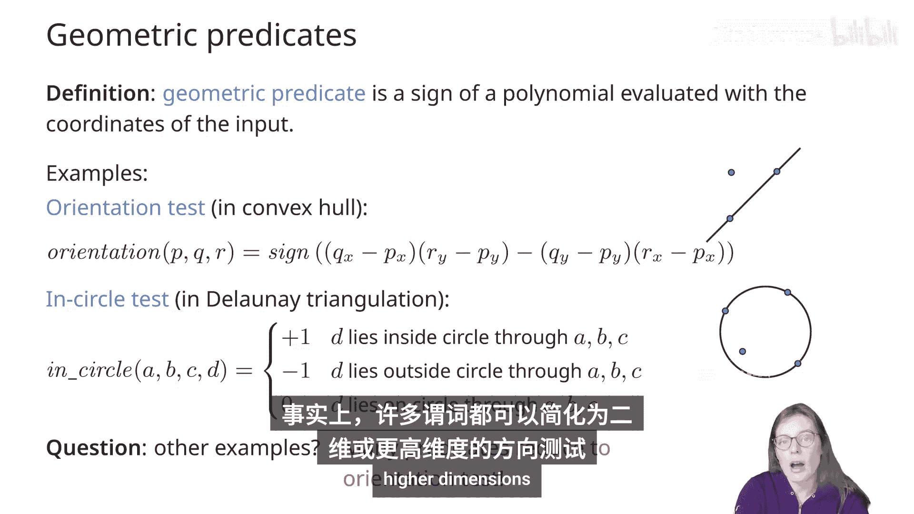

现在让我们看看增量凸包算法中到底可能出什么问题。关于点的具体细节和精确坐标值，请参考 Kettner 等人的论文。

考虑以下点集。P2 和 P3 非常接近，但却是不同的点。我们首先将 P1, P2, P3 放入凸包。接下来，对于点 P4，我们检查它是否与当前凸包的三条边形成右角。作为对所有边执行方向测试的结果，我们实际上可能得到 P4 看不到当前凸包的任何边。因此，当我们完成算法运行时，P4 将被留在凸包外部。

这里出现的问题是，凸包外部的一个点看不到任何边。因此，我们得到了一个不正确的解。其他故障可能发生在，例如，凸包内部的一个点被评估为看到一条边。在这种情况下，我们将得到一个非凸多边形作为解。

另一个例子是，当凸包外部的一个点被评估为看到所有边时。在这种情况下，根据实现方式，我们可能会陷入无限循环或崩溃。

另一个故障可能发生在凸包外部的一个点被评估为看到一组不连续的边时。那么我们可能最终得到一个非凸解，甚至是一个自相交的链作为答案。

---

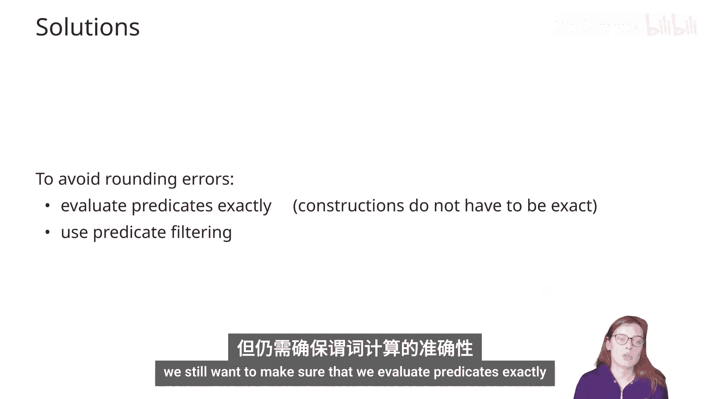

## 几何谓词与鲁棒性计算 🛡️

在设计几何算法时，我们依赖于**几何谓词**。几何谓词是在给定输入上评估的多项式的符号。例如，我们刚刚介绍的方向测试就是一个谓词。它接受三个点作为输入，并返回其坐标上多项式的符号。

另一个几何谓词的例子是**圆内测试**。给定四个点 A, B, C, D，如果 D 位于通过点 A, B, C 的圆内，则返回 1；如果位于圆外，则返回 -1；如果位于通过这三个点的圆上，则返回 0。

你能想到其他几何谓词的例子吗？事实上，许多谓词可以简化为二维或更高维的方向测试。

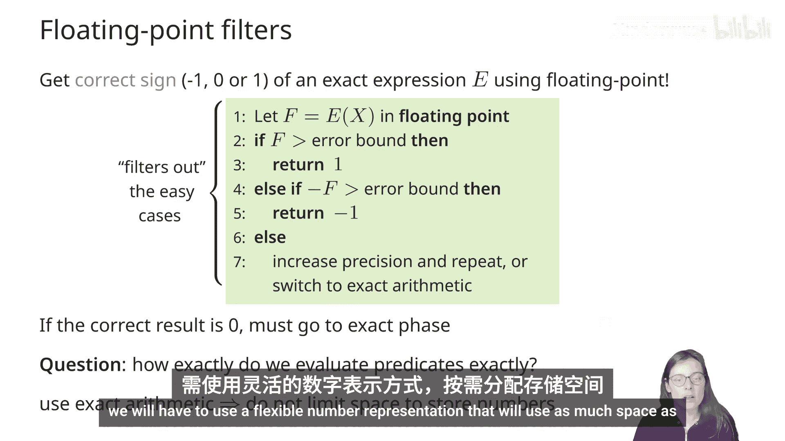

### 谓词的简化

例如，即使是圆内测试也可以简化为三维空间中的方向测试。简化的方式是：对于给定的三个点 A, B, C，我们在三维空间中构造三个点，称之为 Â, B̂, Ĉ，前两个坐标等于原始点的坐标，第三个坐标是前两个坐标的平方和。这个操作将点“提升”到一个抛物面上。那么，第四个点 D 将位于通过点 A, B, C 的圆内，如果其提升版本 D̂ 位于通过点 Â, B̂, Ĉ 的平面 H 下方。D 位于圆外，如果其提升版本 D̂ 位于平面 H 上方。

与方向测试类似，圆内测试也可以写成一个 4x4 矩阵的行列式的符号。

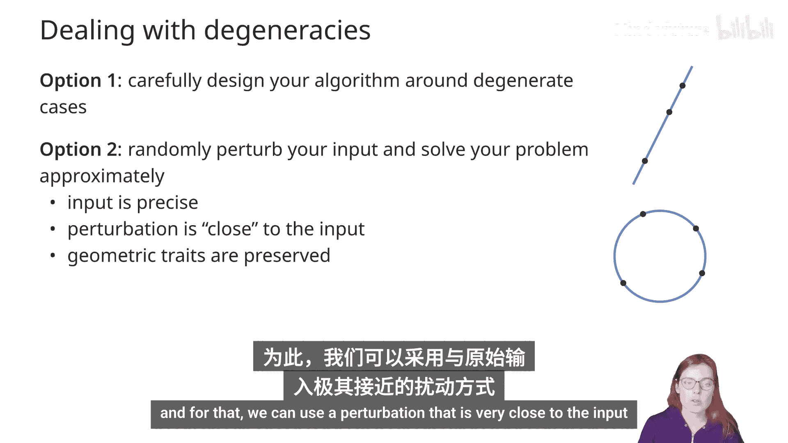

```
| A.x  A.y  A.x^2+A.y^2  1 |
| B.x  B.y  B.x^2+B.y^2  1 |
| C.x  C.y  C.x^2+C.y^2  1 |
| D.x  D.y  D.x^2+D.y^2  1 |
```

为了避免几何算法实现中的舍入错误，我们可以**精确评估谓词**，或者使用**谓词过滤**来确保我们在评估谓词时得到的答案对应于真实值。

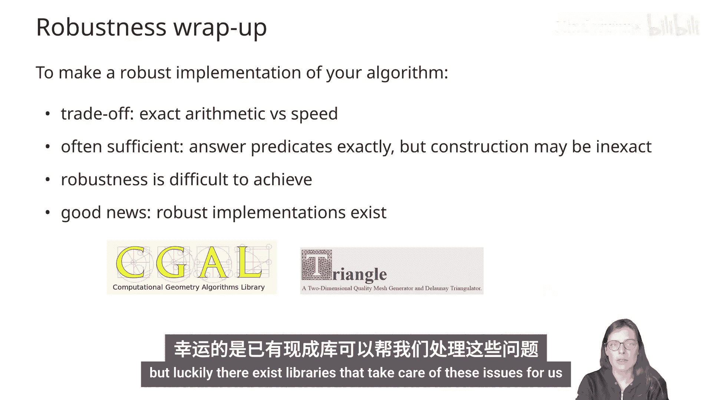

在第一种情况下，当我们评估谓词时，构造本身不必是精确的。例如，当我们计算某些对象（如直线或圆）的交点时，我们不需要精确计算交点的坐标，但我们仍然希望确保精确评估谓词。

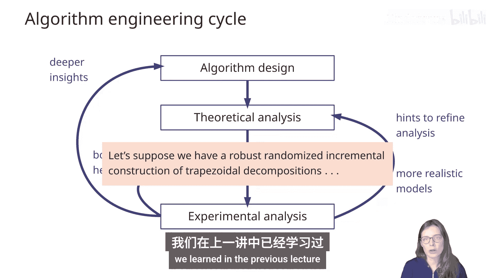

### 谓词过滤

首先，让我们谈谈过滤。我们的目标是获得表达式 E 的正确符号。当 E 为负时，我们希望得到 -1；为正时，得到 +1；为 0 时，得到 0。

考虑以下伪代码：

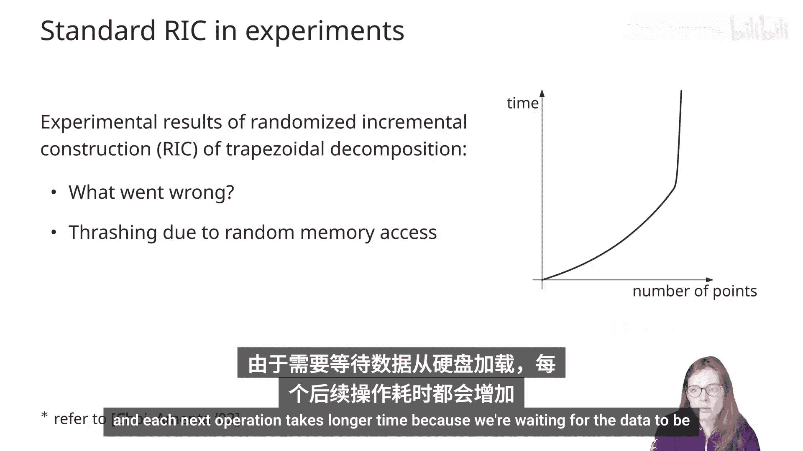

```
function filtered_sign(E):
    value = evaluate E using floating-point arithmetic
    if value > ERROR_BOUND:
        return 1
    else if -value > ERROR_BOUND:
        return -1
    else:
        // 结果太接近零，无法信任浮点结果
        increase precision (e.g., use double-double arithmetic)
        repeat the evaluation with higher precision
```

当然，通过这种方式，我们永远不会返回 0，并且在某些时候我们可能需要切换到精确算术。

### 精确算术

现在让我们讨论如何精确评估谓词。我们必须诉诸于使用**精确算术**，这意味着我们不能限制存储坐标值的空间，我们将不得不使用灵活的数字表示，该表示将使用所需的空间。

精确算术库（如 CGAL 的 Exact_predicates_exact_constructions_kernel）使用多精度整数或有理数来表示几何计算中的中间值，从而完全避免舍入错误，但会牺牲一定的性能。

### 退化情况处理

当我们的谓词返回零时，意味着我们正在处理**退化情况**。例如，我们可能有三个点位于同一条线上，或者四个点共圆。如果我们的输入包含退化情况，我们需要仔细设计算法来处理它们。

但还有另一种在实践中通常效果很好的选择。在运行算法之前，我们**随机扰动**我们的输入以消除这些退化。我们需要确保应用于输入的扰动不会改变任何几何特性，为此我们可以使用非常接近输入的扰动。

---

## 鲁棒性问题总结 📝

让我们总结一下关于鲁棒性问题的讨论。

首先，我们经常在使用精确算术与算法速度之间进行权衡。通常精确评估谓词就足够了，但不需要精确构建我们的几何构造。总的来说，几何算法中的鲁棒性很难实现。但幸运的是，存在一些库（如 CGAL）可以为我们处理这些问题。

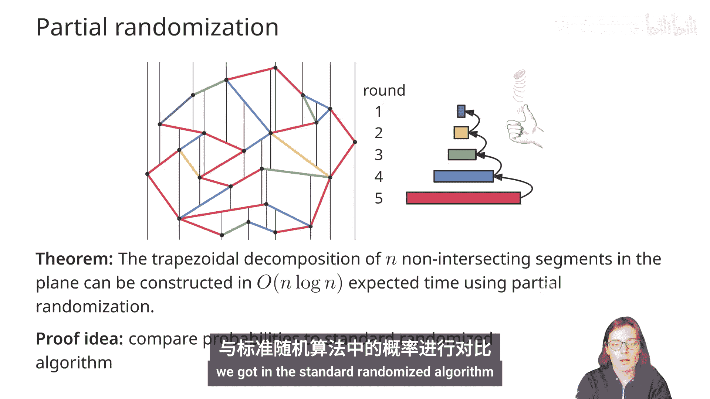

现在，回到算法工程周期，我们为处理算法实现步骤做好了更多准备。

---

## 内存访问与算法优化 🚀

假设我们拥有上一讲中学到的垂直分解的随机增量构造算法的鲁棒实现。

Ci 和 Amenta 在他们的论文中观察到这种随机增量构造实现的以下奇怪行为。在右侧，您可以看到他们获得的运行时间示意图，取决于输入的大小。运行时间在初始范围内增长缓慢，然后在某个点几乎垂直地开始急剧上升。那么这里出了什么问题？

答案是**内存颠簸**。当计算机的虚拟内存被过度使用时，就会发生这种情况，每个后续操作都需要更长的时间，因为我们在等待数据从硬盘加载。

特别是，随机增量构造容易发生此类故障。如果你有大量数据，最好按顺序访问它，而不是随机顺序。那么这里的解决方案是不随机化我们的算法吗？理论上，随机化效果很好，它产生了简单的算法，并给我们带来了非常好的运行时间。这里的折衷方案是**部分随机化增量构造**。

在这里，我们获得了两个世界的最佳效果：我们从理论算法设计中获得了随机化，并且我们获得了足够的数据局部性，以避免过度使用虚拟内存。

### 部分随机化增量构造设计

让我们设计一个部分随机化增量构造来构建给定线段集的垂直分解。我们将把计算分成若干轮。

从最后开始，从最后一轮开始，我们将以概率 1/2 将每条线段分配给该轮。因此，大约一半的线段将被分配到最后一轮。在我们的示例中，我们将以五轮结束，第五轮获得所有红色线段。

在所有剩余的线段中，我们将再次抛硬币，每条线段以概率 1/2 被分配到前一轮（第四轮）。因此，大约一半的剩余线段被分配到第四轮。只要我们有未分配的线段，我们就重复这个过程。

因此，在这个例子中，我们确实以五轮结束：第一轮只包含一条紫色线段，第二轮包含两条线段，后面的每一轮都包含越来越多的线段。从一轮到另一轮，线段是在每轮内以有利于信息局部性的顺序处理的。因此，我们在每轮内处理线段的顺序不是随机的。

现在，当我们开始构建垂直分解时，我们从第一轮的所有线段开始（本例中是一条紫色线段）。完成后，我们将转到第二轮并插入分配给第二轮的两条线段。接下来，我们插入第三轮、第四轮和第五轮的线段。完成。

重申一下，在每轮内搜索线段的顺序不是随机的，而是专门选择的，以免导致我们访问大量数据时出现问题。

尽管采用这种分轮构造垂直分解的方法，并且在最后一轮中，一半的线段不是以随机顺序插入，而是以某种特定顺序插入，我们仍然可以获得与随机增量构造算法相同的渐近运行时间。

### 性能证明概要

我们将通过以下引理来证明这个定理：对于给定的梯形 Δ，它在部分随机化增量构造中出现的概率最多是它在标准随机增量构造算法中出现概率的 16 倍。

证明的核心思想是比较两种算法中梯形 Δ 出现的概率。梯形 Δ 由最多四条线段（称为触发器）定义。对于 Δ 出现在构造中，所有触发器线段必须在任何阻挡器（红色显示）之前插入。阻挡器是与 Δ 相交的线段，因此，如果任何其他阻挡器在最后一个触发器之前插入，Δ 就永远不会出现在构造中。

通过分析触发器被分配到第 i 轮或之前、而阻挡器被分配到第 i 轮或之后的概率，并利用随机分配的性质（每条线段以 1/2 的概率进入当前轮），可以推导出上述 16 倍的上界。最终，利用该引理和期望的线性性质，可以证明部分随机化增量构造的期望运行时间仍然是 O(n log n)。

---

## 实验分析与最佳实践 📊

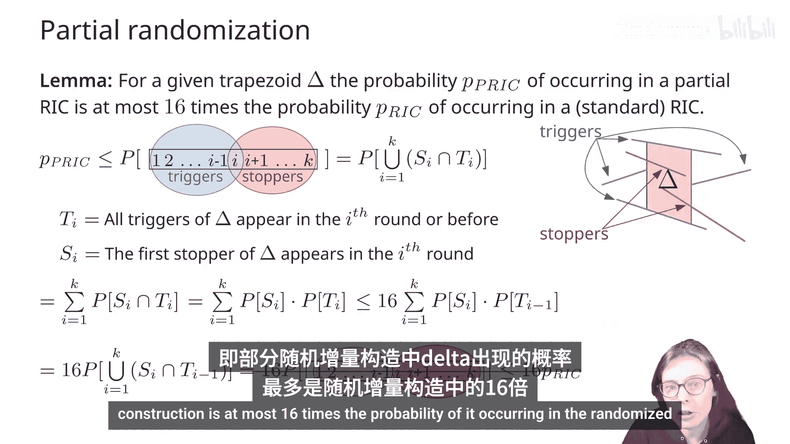

总结我们今天所学的内容：算法的实现、运行实验和理论是相辅相成的。产生鲁棒的实现具有挑战性，但幸运的是，有足够的工具和库可以帮助我们进行软件工程。最后，执行实验分析至关重要，因为它可以导致意想不到的发现，使我们不仅能够改进算法的实现方面，而且能够发展新的理论结果。

关于进行实验分析的良好实践，请参考 Johnson 编写的指南。总结他的观点：在设计实验分析时，我们应该尝试进行有新闻价值的实验，将工作置于科学领域的一般背景中，使用高效的实现，并使用通用的测试平台将我们的实验与他人的实验进行比较。我们可以使用精心设计的实验来支持关于算法性能的主张，但在设计和进行实验分析时，确保其他人可以重现你的结果，并且他们可以将结果与我们的结果进行比较，这一点很重要。

---

## 课程总结 🎯

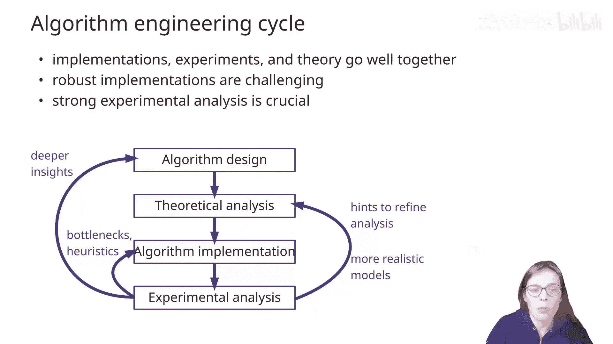

在本节课中，我们一起学习了：

1.  **理论与实践之间的差距**：认识到算法在理论设计和实际实现中面临的挑战，如数字精度、内存访问和退化情况。
2.  **几何谓词与鲁棒性**：理解了方向测试等几何谓词的核心作用，并学习了通过精确算术和谓词过滤来确保计算鲁棒性的方法。
3.  **浮点数表示**：回顾了浮点数在计算机中的表示方式（规范化/非规范化），以及由此产生的精度限制和舍入误差。
4.  **算法工程周期**：了解了从设计、分析、实现、测试到迭代改进的完整算法开发流程。
5.  **性能优化实践**：探讨了内存访问模式（如内存颠簸）对算法实际性能的影响，并学习了部分随机化增量构造这种兼顾理论效率和实际性能的优化技术。
6.  **实验分析的重要性**：强调了严谨的实验设计、可复现性和对比分析在验证和提升算法性能中的关键作用。

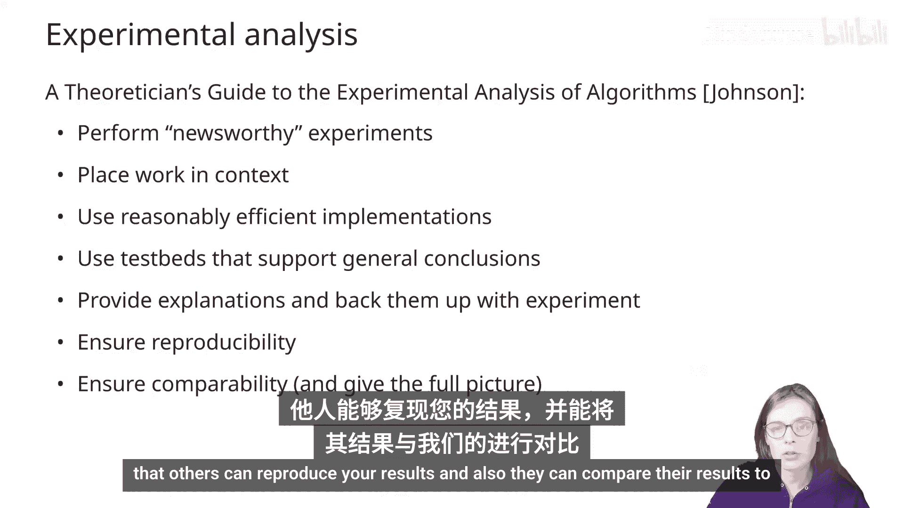

通过掌握这些“超越理论”的实践知识和技能，你将能够更可靠地将几何算法从纸面设计转化为高效、健壮的软件实现。