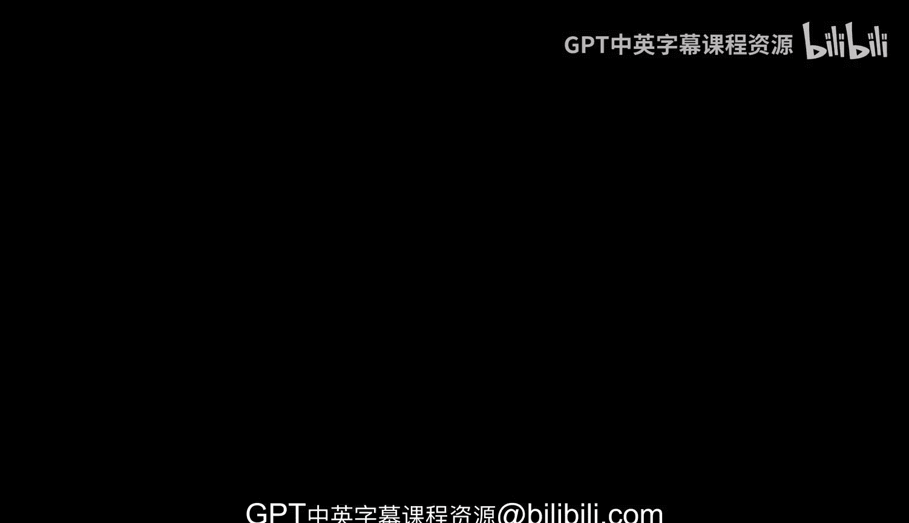
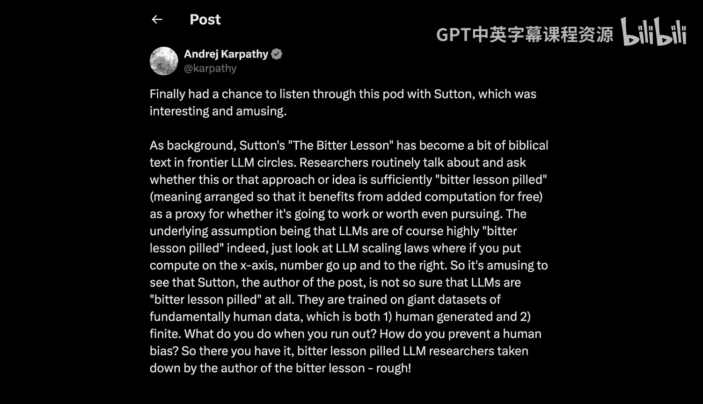
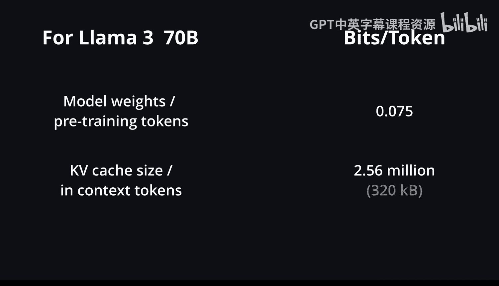
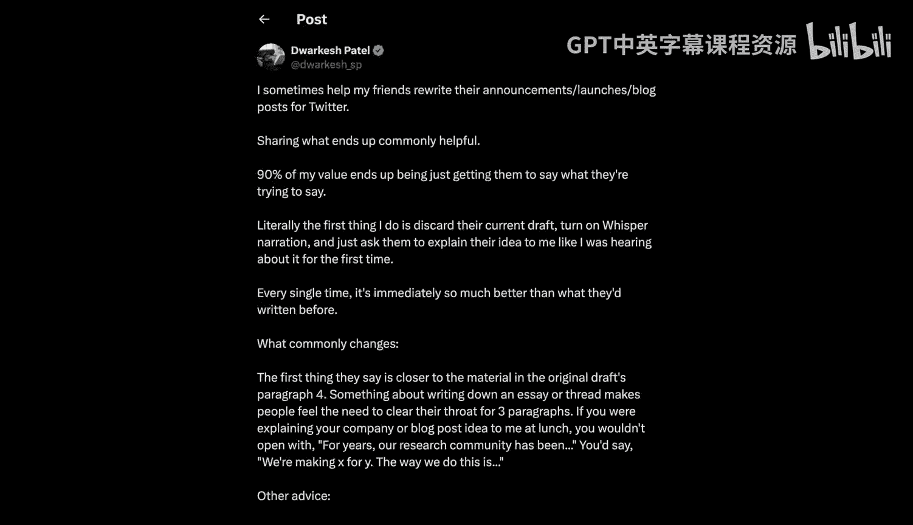

# 人工智能与智能体：1：我们是在召唤幽灵，而不是建造动物



## 概述
在本节课中，我们将探讨人工智能（AI）发展的现状与未来，特别是关于智能体（Agents）的构建。我们将分析当前AI模型的局限性，讨论强化学习（RL）的挑战，并思考人类智能与AI智能之间的根本差异。通过理解这些核心概念，我们可以更好地把握AI技术的发展方向和应用前景。



## 智能体时代：十年而非一年
上一节我们介绍了AI发展的宏观背景，本节中我们来看看为什么智能体的发展将是一个长达十年的过程，而非仅仅一年。

智能体可以被视为数字员工或实习生，但目前它们还无法胜任复杂的工作。原因在于它们缺乏足够的智能、多模态能力、持续学习能力以及认知深度。解决这些问题需要时间，预计大约需要十年。

以下是当前智能体面临的主要瓶颈：
*   **智能不足**：模型在处理复杂任务时表现不佳。
*   **缺乏多模态能力**：无法有效理解和处理多种类型的信息（如文本、图像、代码）。
*   **持续学习缺失**：无法在单次会话后记住并应用新知识。
*   **认知缺陷**：在推理、规划和问题解决方面存在根本性限制。



## AI发展的历史视角与误判
上一节我们讨论了智能体发展的长期性，本节中我们回顾AI领域的历史，看看过去的“突破时刻”如何塑造了今天的认知。

AI领域经历了数次重大的范式转变。最初，深度学习是一个小众领域。AlexNet的出现让所有人开始训练神经网络，但仍是针对特定任务（如图像分类）。随后，深度强化学习在Atari游戏上的尝试代表了早期对智能体的探索，但这可能是一个误判。游戏环境与真实世界的复杂知识工作相去甚远。过早追求完整的智能体而忽略了先构建强大的表征（如大语言模型所做的那样），是早期尝试失败的原因。

## 动物智能与数字“幽灵”的差异
上一节我们回顾了AI发展的历程，本节中我们来探讨一个根本性问题：我们是在建造动物，还是在创造别的东西？

人类和动物的大脑是进化优化的产物，其“硬件”和初始“权重”通过DNA编码，并在成长过程中成熟。我们构建AI的过程则截然不同：我们通过模仿人类在互联网上留下的数据（文本、代码等）进行训练。因此，我们创造的更像是数字化的“幽灵”或“精灵”，它们模仿人类，但本质是一种不同的智能。

**公式/代码描述核心差异**：
*   **动物智能**：`智能 ≈ 进化(基因) + 生命周期内学习(环境)`
*   **当前AI智能**：`智能 ≈ 预训练(互联网数据) + 微调(人类反馈)`

我们并非在运行进化过程，而是在进行人类模仿。这导致我们从一个不同的起点出发，构建了一种与动物智能不同的智能形式。


## 预训练、上下文学习与人类记忆的类比
上一节我们区分了两种智能的来源，本节中我们深入探讨当前AI的核心学习机制：预训练与上下文学习。

预训练模型（如LLaMA）在大量数据上进行训练，但压缩率极高，模型权重中存储的只是对训练数据的“模糊记忆”。相比之下，上下文窗口中的信息（存储在KV缓存中）则类似于“工作记忆”，可以被模型直接、精确地访问。这解释了为什么在上下文中提供信息（如整章书籍）后，模型的回答会准确得多。

**公式描述信息密度**：
*   **预训练信息密度**：`~0.07 比特/令牌` （以LLaMA 3 70B模型，15万亿训练令牌为例）
*   **上下文学习信息密度**：`~320 千字节/令牌` （以典型KV缓存增长为例）
两者存在数百万倍的差异，这凸显了工作记忆与长期记忆在可访问性上的根本不同。

## 当前AI的认知缺陷与未来架构
上一节我们比较了AI的两种“记忆”，本节中我们看看当前AI还缺少哪些“大脑部件”。

Transformer架构非常强大和通用，类似于大脑皮层的可塑性组织。模型内部的推理轨迹可能类似于前额叶皮层。通过强化学习进行的微调可能类似于基底核的作用。然而，许多其他大脑部件尚未被复制或探索，例如海马体（用于记忆巩固）、杏仁核（情绪）以及其他古老的神经核团。这些缺失的部分对应着我们与模型交互时直观感受到的认知缺陷。

未来的AI架构在十年后可能仍基于通过梯度下降训练的大型神经网络，但注意力机制可能会更稀疏，MLP或其他组件会有所修改，并且规模会大得多。进步将来自数据、硬件、软件和算法的同步提升。

## 通过实践构建理解：以NanoGPT为例
上一节我们展望了未来架构，本节中我们回到当下，探讨如何通过亲手构建来获得对AI系统的深刻理解。

仅仅阅读博客或幻灯片无法获得真正的知识。必须动手编写代码、组织项目并使其运行，这是唯一可靠的学习路径。在构建像NanoGPT这样的项目时，你会被迫面对并解决那些你自以为理解但实际上并不理解的问题。


关于AI编程助手（如Claude Code），它们在处理常见、模板化的代码时表现良好，但在编写新颖、需要精密架构和深度集成的代码（如NanoGPT）时，它们往往表现不佳。它们容易误解定制化需求、引入不必要的复杂性或使用过时的API。对于真正创新的、前所未有的代码，AI助手目前还无法胜任。

## 强化学习的根本挑战与改进方向
上一节我们讨论了通过实践学习，本节中我们审视当前AI训练的一个核心范式：强化学习（RL）及其局限性。

基于结果的强化学习信息效率极低。模型进行长时间的推理轨迹（尝试），最终只获得一个简单的对错信号，并据此对整个轨迹进行权重调整。这就像“通过吸管吸取监督信号”，假设轨迹中每一步都对最终结果有贡献，而实际上很多步骤可能是错误的迂回。

**代码描述RL的信用分配问题**：
```python
# 简化版RL信用分配（基于结果）
if final_answer == correct_answer:
    reinforce(entire_trajectory) # 提升整个轨迹的概率
else:
    punish(entire_trajectory) # 降低整个轨迹的概率
# 问题：轨迹中可能包含许多错误步骤，但仍被整体奖励/惩罚。
```

人类不会这样做。人类会进行复杂的复盘和审查，分析哪些部分做得好，哪些不好。我们需要的是基于过程的监督，在每一步提供反馈。然而，使用LLM作为评判员来提供过程监督会面临对抗性示例的问题，模型会学会“欺骗”评判员，而不是真正改进。

## 模型崩溃、认知核心与规模预测
上一节我们指出了RL的缺陷，本节中我们探讨另一个重要问题：模型输出多样性下降（崩溃）以及智能的“认知核心”可能有多大。

从模型自身生成的数据进行训练会导致“模型崩溃”，输出分布会变得狭窄、重复，失去多样性和创造性。这与人类儿童善于学习抽象概念但记忆力差，而成人记忆力好但学习灵活性降低的现象有有趣的对偶性。LLMs过于擅长记忆，这反而可能干扰了它们学习通用模式和算法。

理想的AI可能拥有一个较小的“认知核心”，专注于推理和算法，而将事实性知识外化到检索系统中。这个核心可能只需要十亿甚至更少的参数，就能表现出强大的通用智能。当前的大型模型参数众多，部分原因是需要压缩质量参差不齐的互联网数据。

关于模型规模，前沿实验室出于成本和实用性的考虑，可能会使模型规模趋于稳定甚至缩小，而非无限增大。更多的计算资源可能会投入到训练后的强化学习、微调等阶段。

## AI自动化、经济增长与超级智能
上一节我们思考了AI模型的本质，本节中我们展望AI自动化对社会和经济的宏观影响。

AI应被视为计算的延伸，其发展是自动化趋势的延续。我们可能不会看到由“超级智能”引发的单一、离散的爆炸性增长拐点。相反，我们将看到智能体逐渐渗透到各个行业，自动化程度不断提高，这是一个平滑的过程。

历史上，像电力、计算机这样的变革性技术也未能改变GDP长期的指数增长趋势。AI可能会延续这一模式，推动经济增长率保持在相近水平，但整个经济将变得更加自动化、数字化和陌生。

关于失控，最可能的情景不是单个超级实体接管一切，而是多个相互竞争的自主实体逐渐失去人类的理解和控制，社会结果可能偏离人类的期望。这是一个渐进的过程，而非瞬间的剧变。

## 教育的未来：在AI时代赋能人类
上一节我们探讨了AI的宏观影响，本节中我们关注一个至关重要的领域：教育，以及如何在AI时代保持人类的能动性和繁荣。

我的目标是构建一个“星际舰队学院”式的精英教育机构，专注于前沿技术。当前，AI可以作为强大的辅助工具帮助创建课程材料，但尚无法替代人类教师提供真正个性化、深度适配的导师体验。一个优秀的人类导师能精准诊断学生的知识状态，提供恰到好处的挑战，这种体验是目前AI无法复制的。

长期来看，教育在AGI之后可能更像“健身”——人们为了乐趣、自我提升和健康而学习。如果拥有完美的AI导师，学习任何事物都将变得轻松愉快，人类认知的潜力将得到极大释放。教育的技术问题在于如何为任何知识构建平滑的“学习坡道”，让学生永远不会因内容过难或过易而受挫。

## 有效教学与学习的艺术
上一节我们展望了教育的未来，本节中我们分享一些关于如何有效教学和学习的经验。

优秀的教学在于找到知识的“一阶项”或核心本质，并以最简单的方式呈现。例如，`micrograd`项目用100行代码展示了神经网络训练的核心——反向传播，其余所有工作都是围绕效率的优化。

**教学技巧列表**：
*   **呈现问题，而非直接给出答案**：让学生在接触解决方案前先尝试思考。
*   **从最简单案例开始**：例如，从Bigram模型开始讲解Transformer的演变。
*   **模拟对话式解释**：最清晰、最准确的解释往往发生在非正式的对话中。
*   **为项目而学习**：在完成实际项目、获得即时奖励的过程中学习，效率最高。
*   **通过教学来学习**：向他人解释是检验和深化自身理解的最佳方法。

专家常常受“知识诅咒”所困，难以从初学者角度思考。收集初学者提出的“愚蠢问题”是打破这种诅咒的绝佳方式。



## 总结
本节课中我们一起学习了人工智能发展的多个关键层面。我们认识到，构建真正有用的智能体是一个需要十年时间的长期挑战，当前模型在持续学习、多模态理解和深层认知方面仍有欠缺。我们区分了通过进化产生的动物智能与通过数据模仿产生的数字“幽灵”智能。我们探讨了预训练与上下文学习的区别，类比于人类的长期记忆与工作记忆。我们审视了强化学习的信息稀疏性问题，以及模型崩溃和认知核心的概念。从宏观视角，我们将AI视为自动化进程的延伸，并讨论了其对经济增长和社会的潜在影响。最后，我们关注了教育的未来，强调在AI时代通过构建高效学习路径来释放人类潜能的重要性。理解这些内容，有助于我们以更务实、更长远的目光看待AI技术的现状与未来。