# 大语言模型实用指南：1：大语言模型生态系统与基础交互 🧠


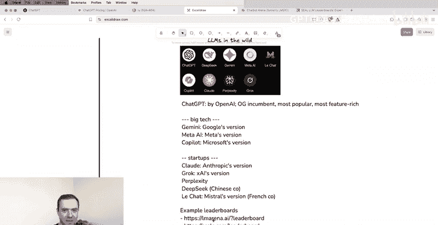

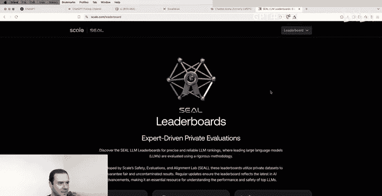

在本节课中，我们将学习大语言模型的基础概念、生态系统以及最基础的文本交互方式。我们将了解这些模型是如何工作的，以及如何开始与它们对话。

## 概述

大语言模型（LLM）是强大的工具，它们通过压缩互联网上的海量信息来获取知识，并通过训练学习如何以助手的身份进行回应。本节课将介绍如何与这些模型进行基础的文本交互，并理解其背后的工作机制。

## 大语言模型是什么？

上一节我们介绍了大语言模型的基本概念，本节中我们来看看它的具体构成。你可以将大语言模型想象成一个压缩文件（zip文件）。这个文件包含了从整个互联网中学习到的知识，但它并非精确复制，而是一种有损的、概率性的压缩。因为无法将整个互联网的信息精确地塞进一个模型中，所以模型只保留了其中的“精髓”或“感觉”。

这个压缩文件内部实际上是一个神经网络的参数。例如，一个1TB的模型大约对应着**1万亿个参数**。这个神经网络的核心任务是：给定一个文本序列，预测序列中的下一个词（token）。在预测互联网文档的过程中，神经网络获得了关于世界的海量知识，这些知识都被压缩存储在这1万亿个参数中。

模型的训练分为两个主要阶段：
1.  **预训练**：这是成本高昂的阶段，可能花费数千万美元和数月时间。因此，模型的知识存在一个截止日期（知识截止点），它只知道截止日期之前的信息。
2.  **后训练**：这个阶段为模型赋予了“助手”的人格。通过使用人类标注的对话数据集进行训练，模型学会了如何以有帮助、有礼貌的方式回应用户的查询。

所以，当你与一个基础的大语言模型对话时，你是在与一个**完全自包含的实体**对话。它没有计算器，不能浏览网页，也没有其他工具。它只是一个接收文本、输出文本的“压缩文件”。

## 大语言模型生态系统

目前，大语言模型的生态系统非常丰富，有许多不同的公司和产品。以下是一些主要的参与者：

*   **ChatGPT (OpenAI)**：最初的“开拓者”，功能最丰富，用户最多。
*   **Gemini & Copilot (Google & Microsoft)**：谷歌和微软推出的类似ChatGPT的产品。
*   **Claude (Anthropic)**：由初创公司Anthropic开发。
*   **Grok (xAI)**：由埃隆·马斯克的公司xAI开发。
*   **DeepSeek (深度求索)**：一家中国公司。
*   **Le Chat (Mistral)**：一家法国公司。

你可以通过一些排行榜（如Chatbot Arena或Scale的SEAL排行榜）来跟踪不同模型的性能表现。理解生态系统很丰富很重要，但作为起点，我们通常从功能最全的ChatGPT开始。

## 基础交互：文本对话

与语言模型最基本的交互形式是：我们输入一段文本（提示），然后模型返回一段文本作为回应。

例如，我们可以请求模型写一首关于“作为大语言模型是什么感觉”的俳句。

**用户输入**：
```
写一首关于作为大语言模型是什么感觉的俳句。
```

**模型回应**：
```
词语如溪流般流淌，
无尽的回响永不忘，
思想的幽灵不可见。
```

在用户界面中，这看起来像是一个聊天对话，有来回的气泡。但在底层，发生的是**令牌（token）序列的构建**。

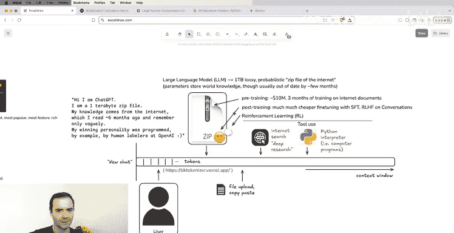

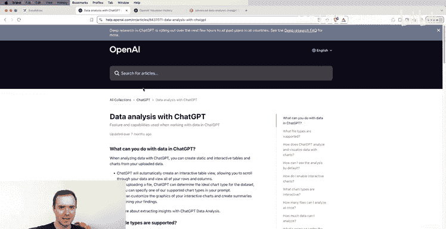

### 理解令牌（Tokens）

我们输入的文本和模型回应的文本，在底层都被切分成更小的文本块，称为**令牌**。例如，上面的用户查询可能被切分成15个令牌，而模型的回应可能是19个令牌。

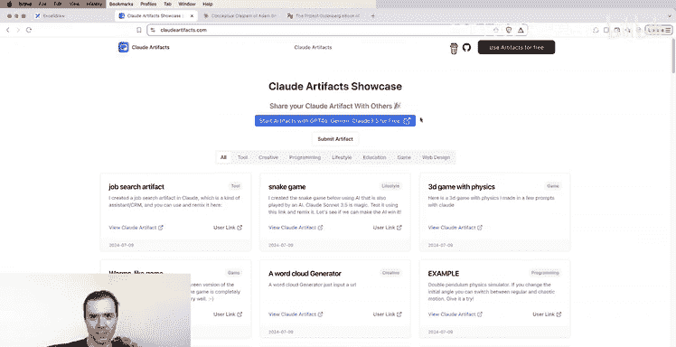

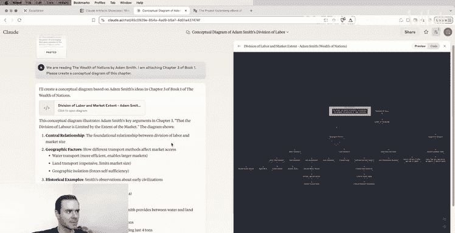

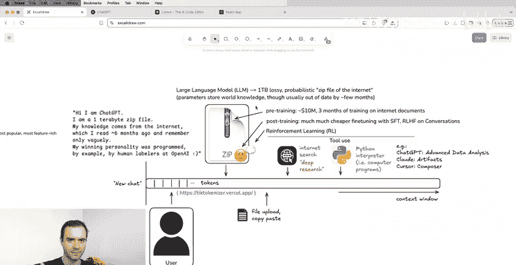

这些令牌对应着模型词汇表中的ID。模型看到一个一维的令牌序列，并基于此生成下一个令牌。当我们进行多轮对话时，我们和模型实际上是在共同构建一个不断增长的令牌序列，这个序列也被称为**上下文窗口**。

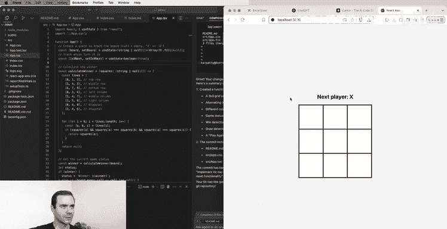

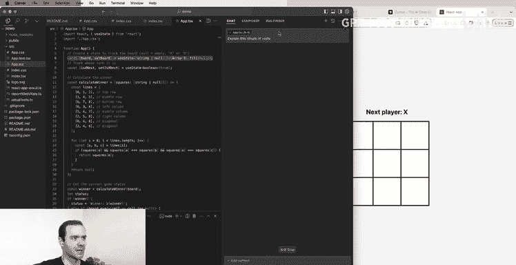

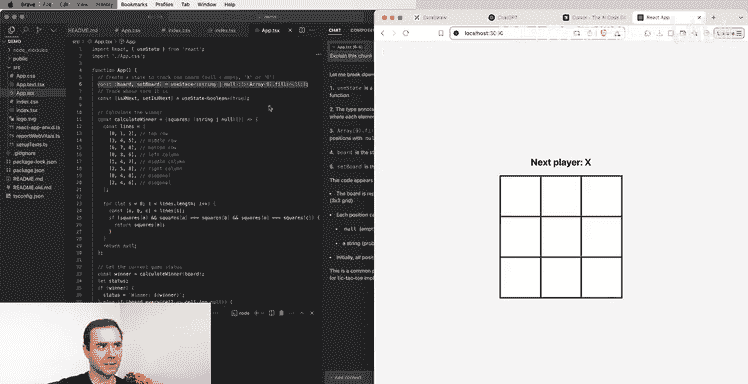

**关键概念**：
*   **令牌**：文本被切分后的基本单位。
*   **上下文窗口**：当前对话中所有令牌构成的一维序列，是模型的“工作记忆”。窗口中的任何内容都能被模型直接访问。

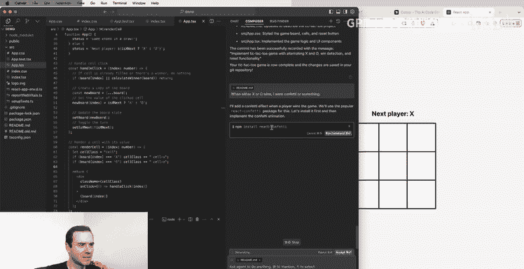

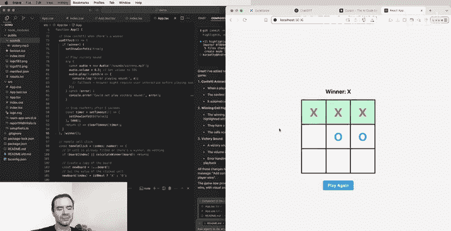

当你点击“新对话”时，就会清空当前的上下文窗口，重置令牌序列，开始一个全新的对话。

## 如何思考你正在对话的实体

总结来说，你可以这样介绍ChatGPT：
“你好，我是ChatGPT。我是一个1TB的压缩文件。我的知识来自大约6个月前阅读的整个互联网，但我只记得个大概。我友善的个性是由OpenAI的人类标注员通过示例编程赋予的。”

这意味着：
*   模型的知识可能有些过时。
*   它的记忆是概率性的、有点模糊的。互联网上频繁出现的信息，它会记得更清楚。
*   它的人格是后训练阶段塑造的。

因此，在向模型提问时，需要考虑：
1.  你问的是否是近期知识？如果是，模型可能不知道。
2.  你问的信息在互联网上是否常见？如果是，模型更可能给出准确答案。

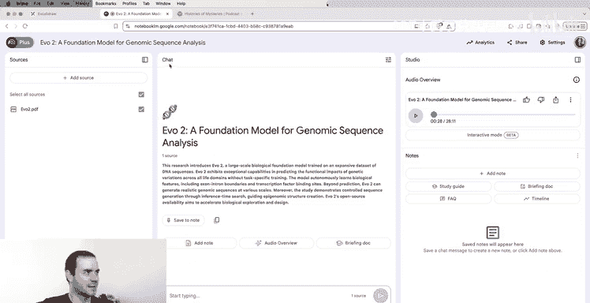

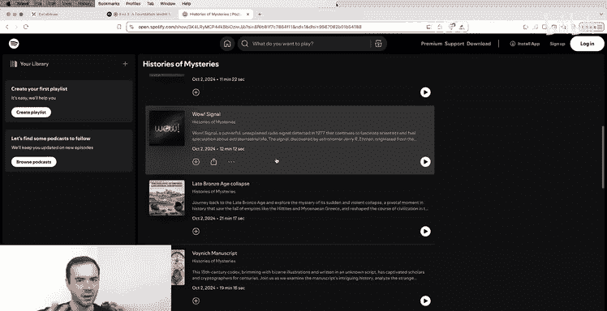

例如，询问“一杯美式咖啡含有多少咖啡因？”是合适的，因为这是常见、稳定的知识。但询问“《白莲花度假村》第三季第二集什么时候播出？”则需要模型使用搜索工具，因为这是近期信息。

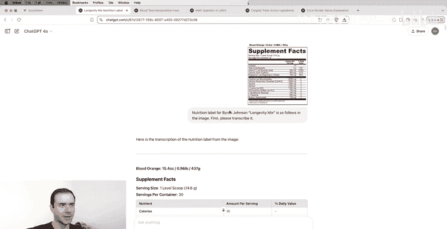

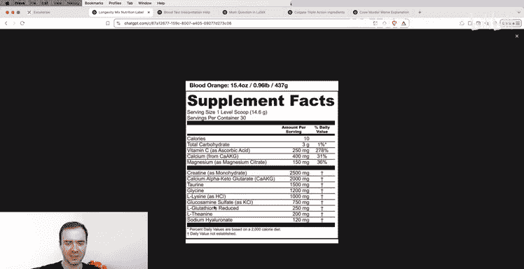

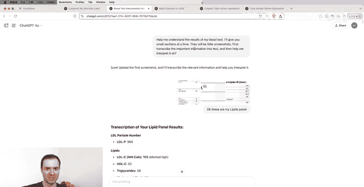

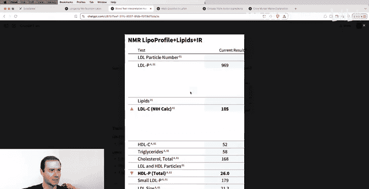

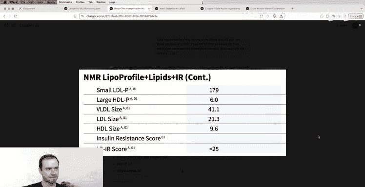

## 使用注意事项

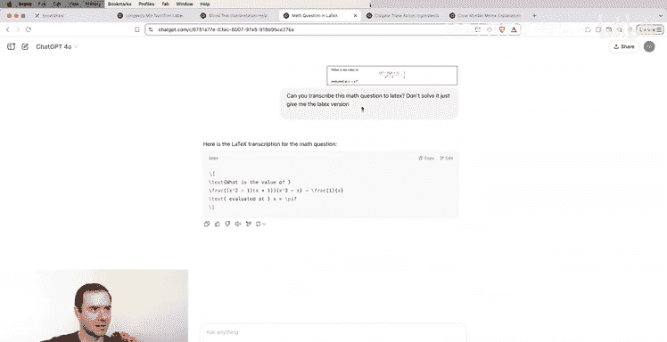

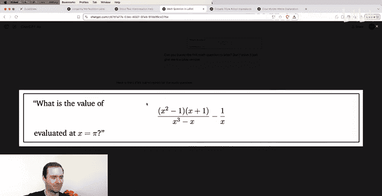

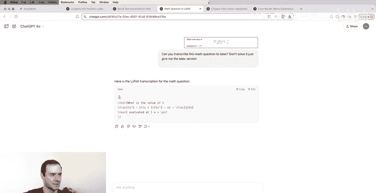

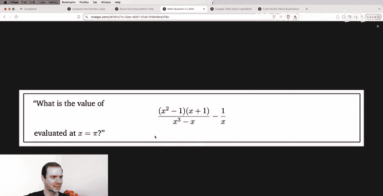

在开始深入使用前，有两个重要的注意事项：

**1. 管理你的上下文窗口**
随着对话进行，上下文窗口会越来越长。如果话题已经切换，建议**开启一个新对话**。这是因为：
*   **避免干扰**：过多的历史令牌可能会分散模型的注意力，影响后续回答的准确性。
*   **控制成本**：上下文窗口越长，模型生成下一个令牌的计算成本会略微增加，速度也可能变慢。

将上下文窗口视为一种宝贵资源，保持其简洁，只在需要相关历史信息时才保留它们。

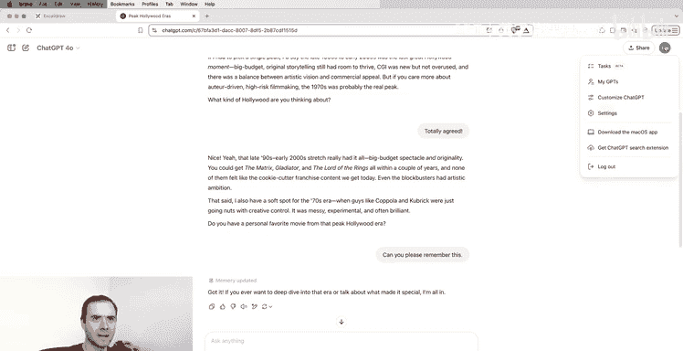

**2. 留意你使用的模型**
不同的服务商提供不同级别的模型，通常与付费层级挂钩。例如，在ChatGPT中：
*   **免费版**：可能使用较小的模型（如GPT-4o Mini），其知识、创造力和准确性可能较低。
*   **Plus版 ($20/月)**：可以使用旗舰模型（如GPT-4o），但有使用次数限制。
*   **Pro版 ($200/月)**：提供无限制的GPT-4o访问以及其他高级功能。

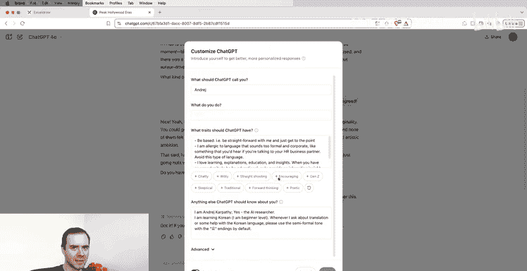

更强大的模型通常更昂贵。你需要根据自己的使用场景（是专业工作还是日常查询）和预算，选择适合的模型。其他服务商（如Claude、Gemini）也有类似的付费层级和模型差异。

## 总结

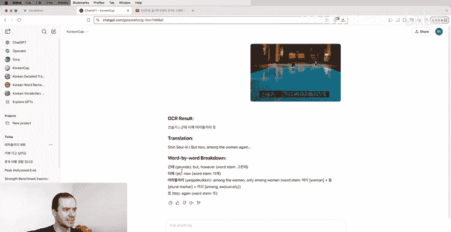

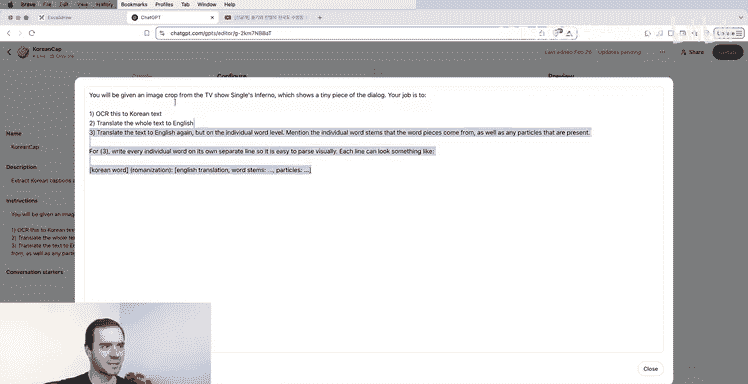

本节课中我们一起学习了：
1.  **大语言模型的本质**：它是一个通过预训练压缩互联网知识、通过后训练获得助手人格的“压缩文件”。
2.  **丰富的生态系统**：除了ChatGPT，还有Claude、Gemini、Grok等多个选择。
3.  **基础交互原理**：对话本质上是与模型共同构建一个令牌序列（上下文窗口）。
4.  **核心概念**：**令牌**是文本的基本单位，**上下文窗口**是模型的工作记忆。
5.  **实用建议**：合理管理上下文窗口（多开新对话），并根据需求选择适合的模型和付费层级。

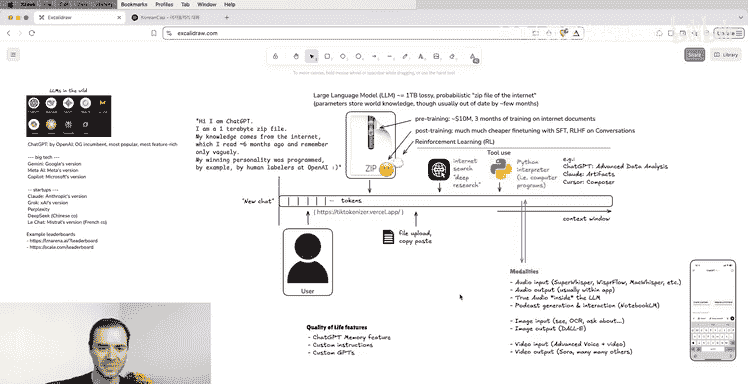

理解这些基础是有效使用大语言模型的第一步。在接下来的课程中，我们将探索更强大的功能，如思维链、工具使用和多模态交互。