# 构建GPT分词器：1：分词器概述与动机

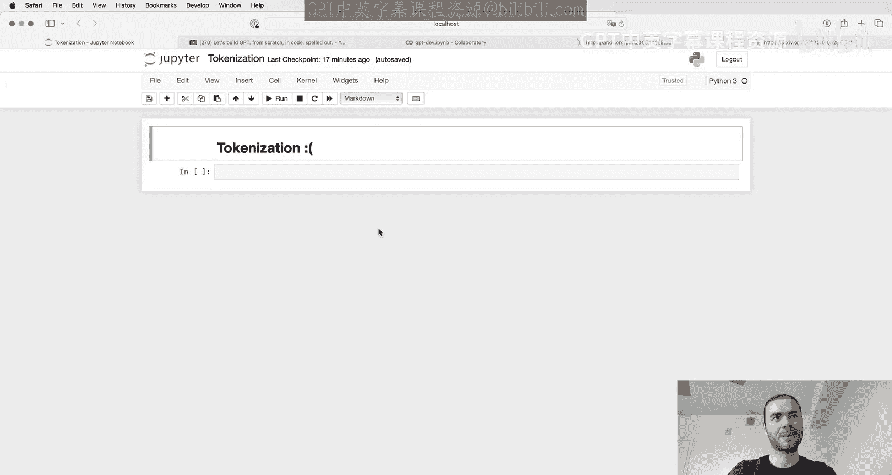

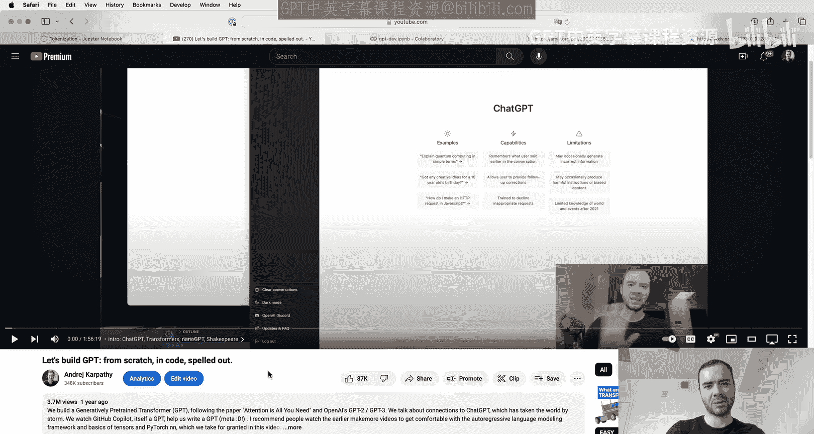

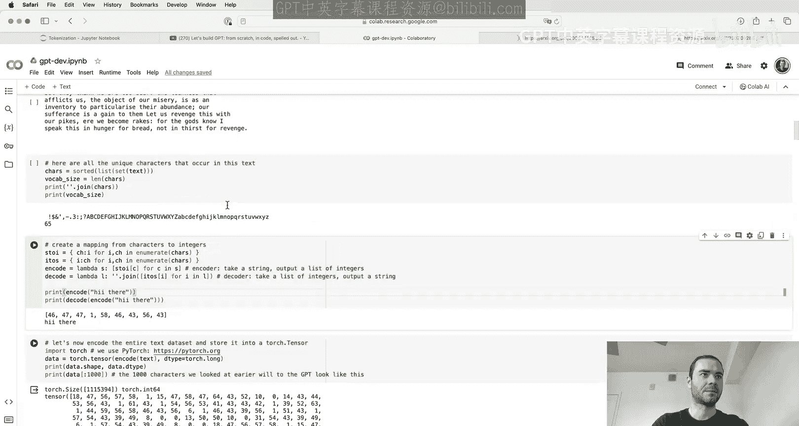

在本节课中，我们将要学习大型语言模型（LLM）中一个核心但常被忽视的组件：分词器。我们将了解什么是分词、为什么它至关重要，以及它如何成为许多LLM“怪异”行为的根源。

## 什么是分词？

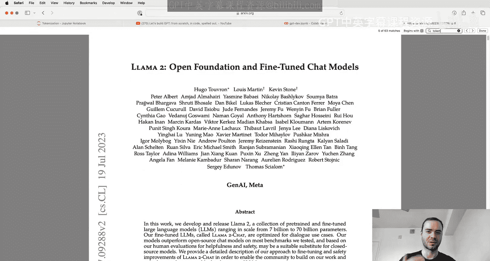

在之前的视频“从零构建GPT”中，我们已经接触过一种非常简单的分词方法。我们将莎士比亚数据集加载为一个长字符串，然后创建了一个包含65个可能字符的词汇表。我们建立了一个查找表，将每个字符映射为一个整数（即“词元”）。

例如，字符串 `"hi there"` 被分词为整数序列 `[46, 47, 1, 58, 46, 43, 56, 43]`。我们将前1000个字符编码为1000个词元。这些词元随后通过一个嵌入表输入到Transformer模型中。嵌入表有65行，每个词元对应一行可训练的向量参数。

这是一种非常简单的**字符级分词器**。然而，在实际的先进语言模型中，人们使用更复杂的方案，例如**字节对编码**算法。我们不再处理单个字符，而是处理字符块。

## 为什么分词如此重要且棘手？

分词是许多大型语言模型奇怪行为的核心。许多看似是神经网络架构或模型本身的问题，实际上都可以追溯到分词。

以下是分词可能导致的一些问题：
*   **拼写任务困难**：LLM通常不擅长拼写任务，因为单词被分成了词元块，模型难以处理单个字符。
*   **字符串处理困难**：模型原生处理字符串（如反转字符串）可能很困难。
*   **非英语语言性能较差**：部分原因是分词器训练数据中非英语文本较少，导致这些语言的词元序列更长、更稀疏。
*   **简单算术能力不佳**：数字的分词方式可能非常任意（例如，`127`可能是一个词元，而`677`可能是两个词元），这给模型带来了额外负担。
*   **特定代码处理问题**：例如，GPT-2处理Python代码时效率低下，因为代码缩进中的每个空格都被分成了独立的词元，浪费了上下文长度。
*   **特殊警告**：例如，关于“尾部空格”的警告。
*   **触发奇怪行为**：某些罕见的词元（如`solid gold Magikarp`）可能从未在模型训练数据中出现，导致模型产生未定义或异常的响应。

理解分词对于诊断和解决这些问题至关重要。

## 分词器演示

通过一个在线分词器演示，我们可以直观地看到分词过程。例如，句子“tokenization is”中的“tokenization”被分成了两个词元。在算术表达式“127 + 677”中，“127”是一个词元，而“677”被分成了两个词元。同一个单词“egg”根据其位置（句首、句中）和大小写，可能会被分成不同数量和类型的词元。

对于非英语文本（如韩语），相同的语义内容通常需要更多的词元来表示，这“拉伸”了序列长度，消耗了宝贵的上下文窗口。

在代码示例中，GPT-2分词器将Python代码中的每个缩进空格都视为独立词元，效率低下。而GPT-4分词器则会将多个空格合并为一个词元，从而更高效地表示代码，这也是GPT-4代码能力提升的部分原因。

---

# 构建GPT分词器：2：从Unicode到字节对编码（BPE）

上一节我们介绍了分词的基本概念和其重要性。本节中，我们来看看如何将文本转化为模型可以处理的词元序列，并深入讲解核心的**字节对编码**算法。

## 文本的数字化表示

在Python中，字符串是Unicode码点的不可变序列。Unicode标准定义了约15万个字符及其对应的整数（码点）。我们可以使用 `ord()` 函数获取字符的码点。

那么，为什么不直接使用这些Unicode码点作为词元呢？
1.  **词汇表过大**：约15万个码点，对于模型来说词汇表较大。
2.  **标准不稳定**：Unicode标准仍在不断更新和扩展。

因此，我们需要更好的方法。我们转向**编码**，将Unicode文本转换为二进制数据（字节流）。最常见的编码是**UTF-8**，它是一种变长编码，每个码点对应1到4个字节。

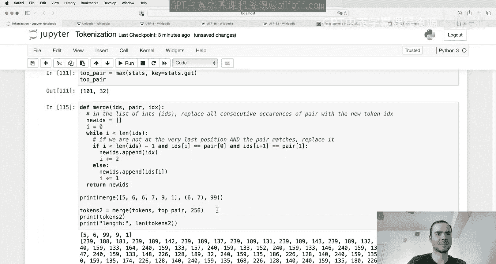

UTF-8编码的字节流可以直接使用吗？理论上可以，但这意味着词汇表大小只有256（所有可能的字节）。虽然嵌入表很小，但文本序列会变得非常长，会迅速耗尽Transformer有限的上下文长度，导致模型无法看到足够长的上文来预测下一个词元。

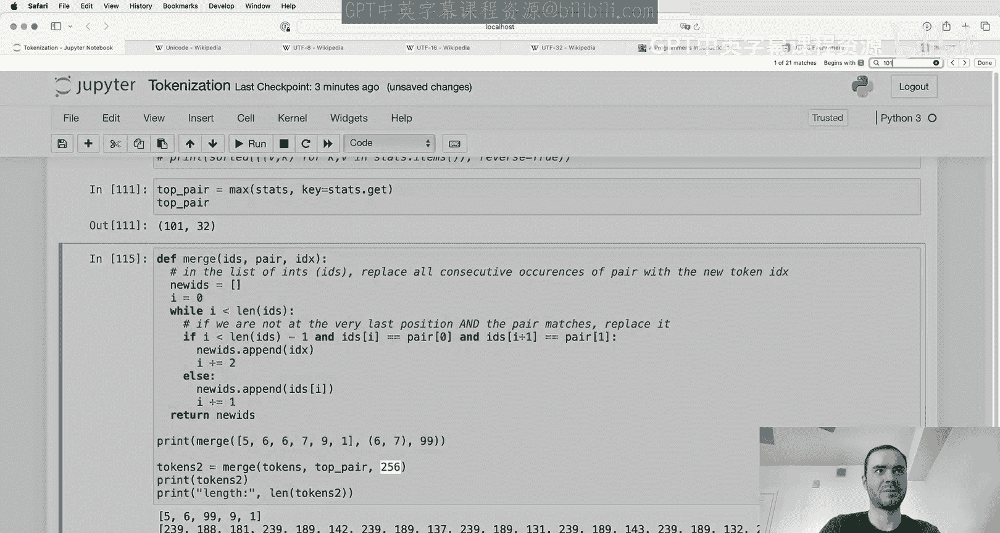

因此，我们的目标是：**在坚持使用UTF-8编码的前提下，支持更大的、可调节的词汇表大小，以压缩序列长度**。答案就是**字节对编码**算法。

## 字节对编码算法

BPE算法的核心思想是迭代地合并最常见的连续字节对，从而用新的、更大的“词元”来替代它们，达到压缩序列的目的。

以下是算法的简化步骤：
1.  从256个字节（0-255）作为初始词汇表开始。
2.  在训练文本的字节序列中，找到出现频率最高的连续字节对（例如，`(101, 32)` 代表 `‘e‘` 和空格）。
3.  为这个字节对创建一个新的词元（例如，ID 256），并将其添加到词汇表中。
4.  在序列中，将所有出现的该字节对替换为这个新词元。
5.  重复步骤2-4，直到达到预定的词汇表大小或合并次数。

通过这个过程，我们从一个长序列、小词汇表的状态，逐步压缩为短序列、大词汇表的状态。训练完成后，我们就得到了一个**合并规则表**，它定义了所有从原始字节到新词元的合并路径。

## 分词器与语言模型的分离

需要理解的关键点是：**分词器的训练是完全独立于大型语言模型训练的预处理阶段**。

分词器有自己的训练数据集，通过BPE算法训练出词汇表和合并规则。一旦分词器训练完成，我们就可以进行**编码**（文本 -> 词元ID）和**解码**（词元ID -> 文本）。通常，我们会将整个语言模型的训练数据通过分词器预处理成巨大的词元序列文件，然后语言模型直接在这些词元序列上进行训练。

分词器训练数据的选择至关重要。如果你希望模型在某种语言或代码上表现更好，就需要在分词器训练数据中包含足够多的此类数据，这样BPE算法才会为该语言创建更高效（更少词元）的合并规则。

---

# 构建GPT分词器：3：实现BPE分词器

上一节我们介绍了BPE算法的原理。本节中，我们将动手实现一个基础的BPE分词器，包括训练、编码和解码功能。

## 训练分词器

首先，我们需要准备训练文本，并将其编码为UTF-8字节流，再转换为整数列表以便处理。

以下是实现BPE训练循环的核心步骤：
1.  设定目标词汇表大小（例如，276，即在256个字节基础上进行20次合并）。
2.  初始化词汇表为0-255的字节。
3.  初始化一个空的`merges`字典，用于记录合并规则（`(byte1, byte2) -> new_id`）。
4.  循环进行合并：
    *   调用 `get_stats` 函数，统计当前词元序列中所有连续词元对的出现频率。
    *   找到出现频率最高的词元对。
    *   为该词元对分配一个新的ID（从256开始递增）。
    *   调用 `merge` 函数，在序列中将所有出现的该词元对替换为新ID。
    *   将 `(pair, new_id)` 记录到 `merges` 字典中。
5.  循环结束后，我们就得到了训练好的 `merges` 字典和压缩后的词元序列。

训练完成后，我们可以计算压缩率：`初始序列长度 / 最终序列长度`。合并次数越多，词汇表越大，压缩率通常也越高。

## 实现解码

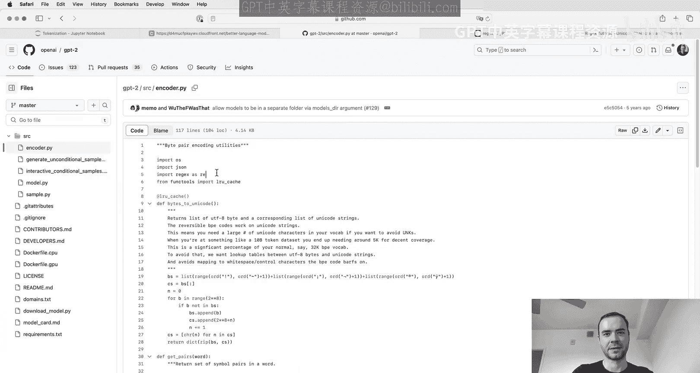

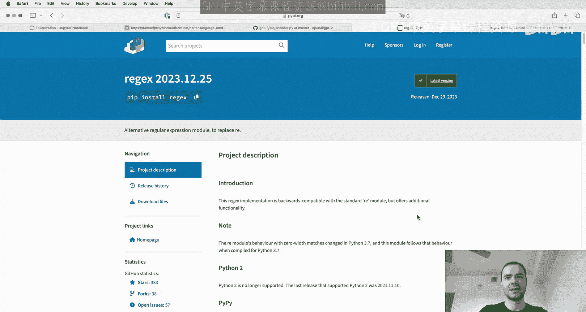

解码是将词元ID序列转换回文本的过程。

以下是实现解码的步骤：
1.  根据 `merges` 字典重建 `vocab` 映射：`{id: bytes}`。初始 `vocab` 是0-255的单个字节。然后按合并顺序，将每个合并产生的新ID映射到其子词元对的字节拼接。
2.  给定一个ID列表，使用 `vocab` 将每个ID查找并转换为其对应的字节对象。
3.  将所有字节对象拼接成一个完整的字节流。
4.  使用 `bytes.decode(‘utf-8‘, errors=‘replace‘)` 将字节流解码回字符串。使用 `errors=‘replace‘` 是为了处理模型可能产生的无效UTF-8字节序列。

## 实现编码

编码是将文本转换为词元ID序列的过程，比解码稍复杂。

以下是实现编码的步骤：
1.  将输入文本用UTF-8编码为字节流，并转换为整数列表，作为初始词元序列。
2.  进入一个循环，尝试进行所有可能的合并：
    *   获取当前序列的统计信息（所有连续对）。
    *   从 `merges` 字典中找出**具有最小合并索引**且出现在当前序列中的词元对。这确保了合并按训练时的顺序进行。
    *   如果找不到可合并的对，则跳出循环。
    *   找到后，在序列中合并该词元对。
3.  循环结束后，返回最终的词元ID列表。

我们需要确保编码后再解码，能得到原始文本（对于有效的UTF-8输入）。但反过来，并非所有词元ID序列都能解码为有效文本。

至此，我们实现了一个基础的BPE分词器。在接下来的章节中，我们将看到实际生产中的分词器（如GPT系列）在此基础上增加了更多复杂的规则和特性。

---

# 构建GPT分词器：4：GPT分词器的实现细节

上一节我们实现了一个基础的BPE分词器。本节中，我们来看看OpenAI的GPT系列分词器是如何实现的，以及它们引入了哪些额外的复杂性。

## GPT-2的分词策略

在GPT-2论文中，作者指出朴素的BPE算法存在一个问题：常见的单词（如“dog”）经常会与紧随其后的各种标点符号（如“dog.”、“dog!”）合并。这导致语义（单词）和格式（标点）被混合在同一个词元中，被认为不是最优的。

因此，GPT-2引入了一个关键改进：**在应用BPE之前，使用一个复杂的正则表达式模式对文本进行预分割**。这个模式旨在确保某些类别的字符（如字母、数字、标点、空格）永远不会被合并在一起。

这个正则表达式大致执行以下操作：
*   匹配可选的空格后跟一个或多个字母（任何语言）。
*   匹配可选的空格后跟一个或多个数字。
*   匹配特定的英文缩写（如 `‘s‘, ‘t‘, ‘re‘` 等）。
*   匹配不属于字母、数字或空格的字符（即标点符号）。
*   使用前瞻断言巧妙地处理空格，确保单词前的空格能与单词合并（形成如“ spacehello”这样的词元），而多余的空格则被单独分离。

通过这种预分割，BPE合并只会在每个分割块内部进行，从而避免了跨类别的合并（例如，“e”和空格不会被合并）。然而，这也带来了一些不一致性，例如该正则表达式对大小写敏感，导致大小写不同的缩写处理方式不同。

## 特殊词元

除了从BPE合并中产生的词元，分词器还支持**特殊词元**。这些词元不来自文本合并，而是具有特殊功能。

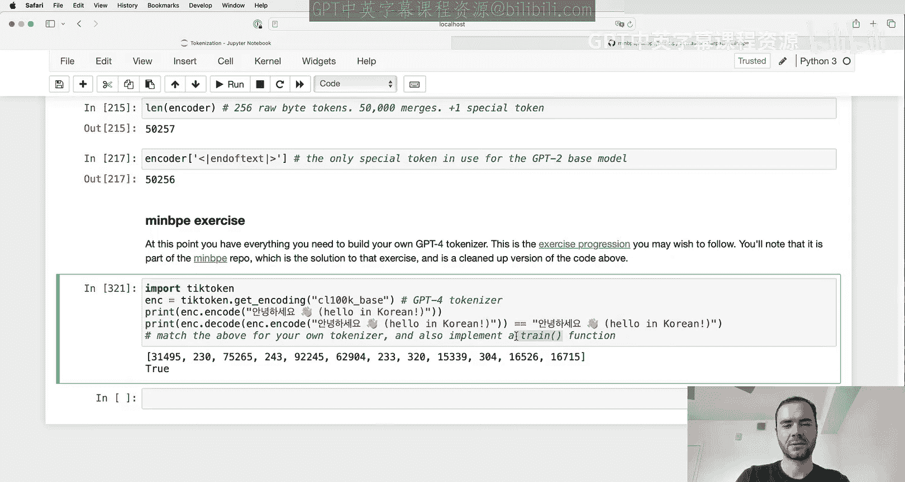

*   **文档分隔符**：例如GPT-2中的 `<|endoftext|>` 词元，用于在训练数据中分隔不同文档，提示模型上下文已切换。
*   **对话结构词元**：在ChatGPT等对话模型中，有大量特殊词元用于标记消息的开始、结束、角色（用户、助理）等，例如 `<|im_start|>`, `<|im_end|>`。
*   **功能词元**：GPT-4中引入了 `<|fim_prefix|>`, `<|fim_middle|>`, `<|fim_suffix|>` 等词元，用于“中间填充”代码补全任务。

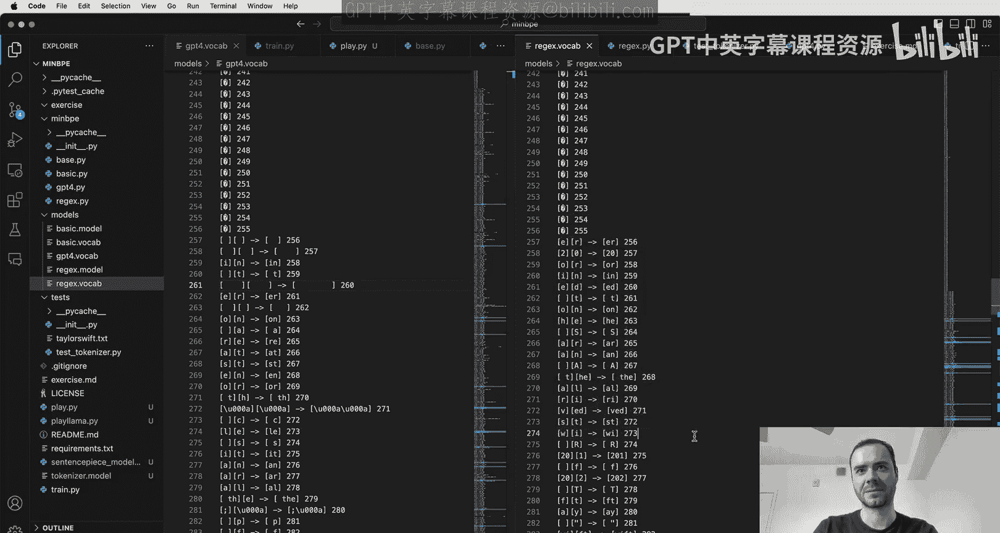

添加特殊词元后，需要对语言模型进行“手术”：扩展嵌入矩阵和输出层的权重矩阵，为新词元添加对应的行和列。

## 查看OpenAI的实现

OpenAI发布了GPT-2的推理代码（`encoder.py`）。其中关键部分是两个文件：
*   `encoder.json`：相当于我们的 `vocab` 映射（ID -> 词元字符串）。
*   `vocab.bpe`：存储了BPE合并规则。

其 `bpe` 函数的核心循环与我们实现的编码循环类似：不断查找可合并的词元对并进行替换，直到无法合并为止。OpenAI还使用了一个额外的“字节编码器/解码器”层来处理一些边缘情况，但这并非算法核心。

OpenAI的 `tiktoken` 库是当前处理GPT分词的首选工具，它用Rust编写，效率很高，并支持添加自定义特殊词元。

---

# 构建GPT分词器：5：SentencePiece与分词器设计考量

上一节我们探讨了GPT分词器的细节。本节中，我们将介绍另一个广泛使用的分词库——**SentencePiece**，并讨论分词器设计中的一些关键考量，如词汇表大小。

## SentencePiece分词器

SentencePiece被许多知名模型使用，如LLaMA和Mistral系列。它与TikToken的一个主要区别在于**操作顺序**：

*   **TikToken**：文本 -> UTF-8字节 -> 在字节上运行BPE。
*   **SentencePiece**：文本 -> Unicode码点 -> 在码点上运行BPE。对于训练数据中罕见的码点，如果设置了 `byte_fallback=True`，则会回退到使用其UTF-8编码的字节来表示。

SentencePiece提供了大量的配置选项，其中许多源于其历史背景（如机器翻译时代的文本规范化）。对于现代LLM，我们通常希望保持数据原始性，因此需要关闭许多预处理选项（如小写化、规范化）。

SentencePiece的一些特点：
*   **必须存在 `<unk>` 词元**。
*   可以添加虚拟前缀空格（`add_dummy_prefix=True`），使句首单词和句中单词具有相同的表示（都是“空格+单词”），这可能有助于模型学习。
*   概念上区分“句子”，这可能在某些场景下造成困扰。
*   配置繁多且文档相对简略，需要仔细调整以避免踩坑。

尽管有些复杂，但SentencePiece因其训练和推理的高效性以及广泛使用而依然流行。

## 词汇表大小的考量

词汇表大小是一个重要的超参数。它主要影响模型的两个部分：
1.  **词元嵌入表**：词汇表大小决定了嵌入矩阵的行数。更大的词汇表意味着更多的参数。
2.  **语言模型头部**：最后的线性层需要为每个可能的词元输出一个logit。更大的词汇表增加计算量。

选择词汇表大小时需要权衡：
*   **太大**：每个词元在训练数据中出现的频率降低，可能导致嵌入向量训练不充分。同时，过长的文本块被压缩进单个词元，模型可能没有足够的“思考步骤”来处理其中的信息。
*   **太小**：序列过长，消耗宝贵的上下文窗口，模型难以看到足够长的上文。

目前，先进模型的词汇表大小通常在10万量级（例如GPT-4约10万，LLaMA 2为3.2万）。这是一个根据经验调整的超参数。

## 扩展词汇表

在实际应用中，经常需要在预训练模型基础上扩展词汇表，例如添加大量特殊词元用于对话或工具调用。这需要对模型进行“手术”：
1.  扩展嵌入矩阵，为新词元添加新的行（通常用随机小值初始化）。
2.  扩展语言模型头部的权重矩阵。
3.  可以选择冻结原有参数，只训练新添加的参数。

这属于一种参数高效的微调技术。更有趣的是，有研究通过训练新的“概要词元”来压缩长提示词，用少数几个新词元代表很长的上下文，从而节省上下文长度。

## 多模态分词

当前的研究趋势是将Transformer统一用于多种模态（图像、视频、音频）。其核心思想是：**将不同模态的数据都“分词”成离散（或连续）的词元序列，然后像处理文本一样用Transformer建模**。例如，Sora模型将视频分割成视觉块，这些块就相当于视频的“词元”。

---

# 构建GPT分词器：6：回顾与总结

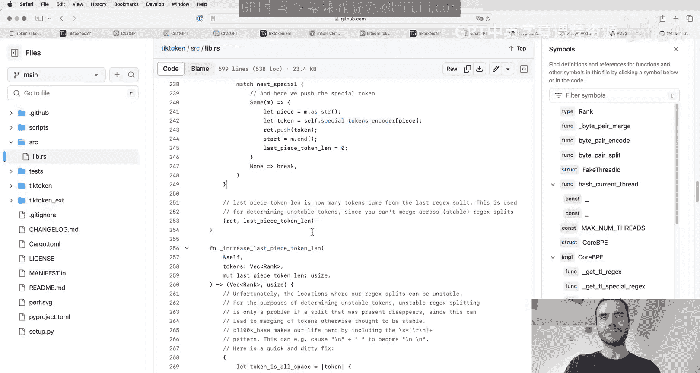

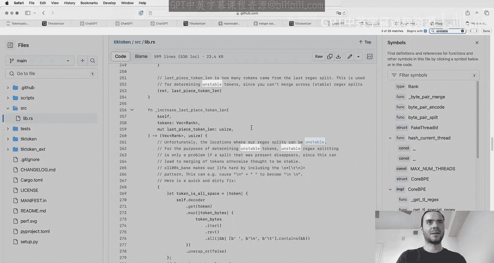

在本节课中，我们一起深入学习了大型语言模型中的分词器。让我们回顾开头提到的一些奇怪现象，并理解其根本原因。

## 现象解释

*   **拼写/字符任务困难**：因为单词被分成词元块。例如，“default-style”在GPT-4中是一个单独的词元。如果问模型这个词里有几个‘l‘，模型很难回答，因为它从未在训练中“看到”过这个词的字符组成。
*   **非英语语言性能差**：分词器训练数据中非英语文本较少，导致这些语言的词元序列更长、更稀疏，消耗更多上下文长度。
*   **简单算术不佳**：数字的分词方式任意且不一致（如`127`是一个词元，`128`可能是两个），破坏了数字的位结构，给模型带来额外负担。
*   **GPT-2的Python问题**：GPT-2分词器将每个缩进空格都作为独立词元，极大浪费了上下文窗口。GPT-4通过合并空格修复了此问题。
*   **尾部空格警告**：当提示文本以空格结尾时，这个空格本应是下一个词元（如“ spacehello”）的一部分。单独留下它，使得模型遇到了一个极少见的“部分词元”情况，导致预测行为异常。
*   **“solid gold Magikarp”等触发词**：这些可能是分词器训练数据（如Reddit）中的常见字符串，被合并为单个词元。但后续语言模型训练时并未包含这些数据，导致这些词元的嵌入向量从未被训练过。当在推理时触发它们，就等于向模型输入了一个完全随机的、未训练过的向量，导致模型行为错乱、产生幻觉或安全护栏失效。

## 总结与建议

分词是一个复杂、微妙且充满“陷阱”的领域，但它对于理解和优化LLM行为至关重要。

**当前建议**：
*   **对于大多数应用**：直接使用GPT-4的词表，并通过 `tiktoken` 库进行推理。其字节级BPE实现非常清晰高效。
*   **如需从头训练词表**：可以使用 **SentencePiece**，但要极其小心其繁多的配置，最好参照LLaMA等成熟模型的设置。请注意，它在码点上进行BPE并回退到字节的方式与TikToken不同。
*   **未来的理想**：一个像 `tiktoken` 一样高效、清晰且包含训练代码的库。这也是 `MinBPE` 项目努力的方向。

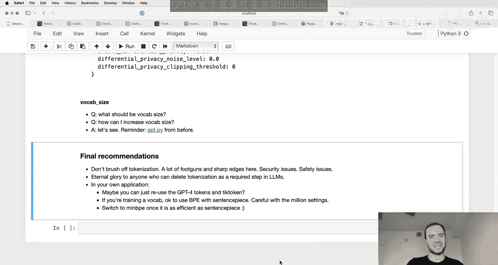

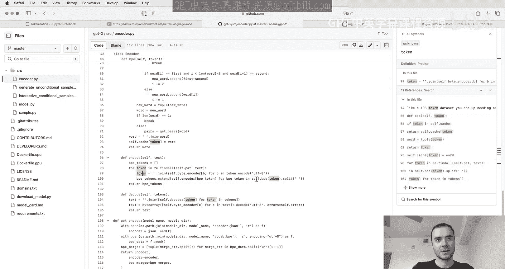

**最终愿景**