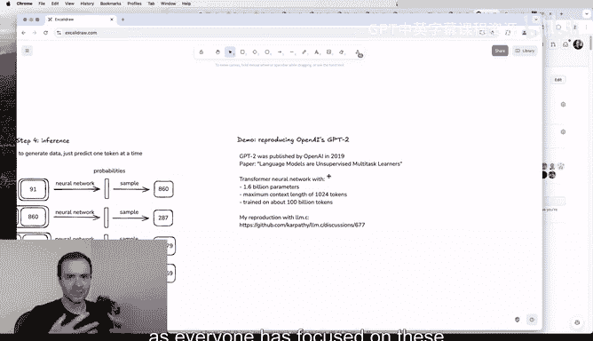
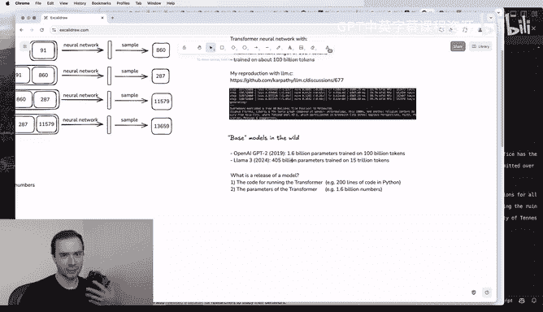
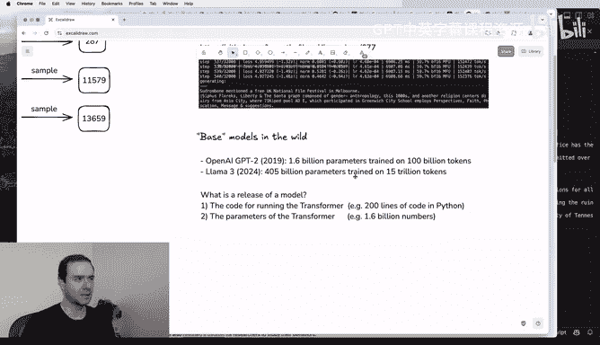
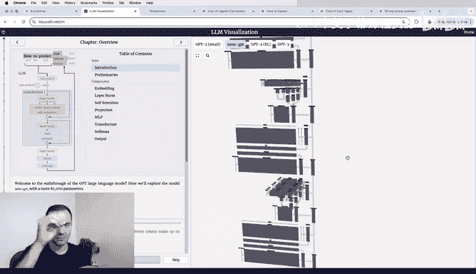
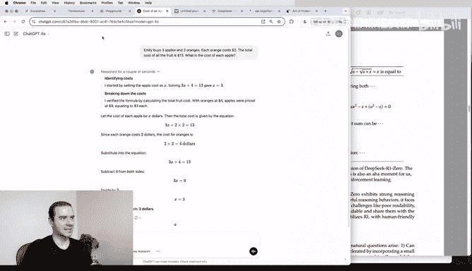
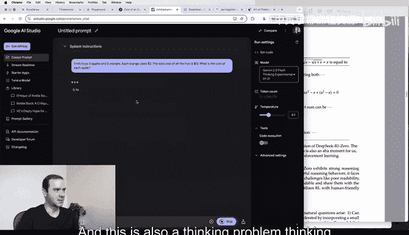
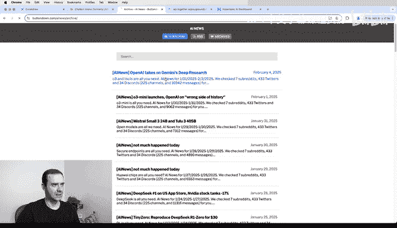
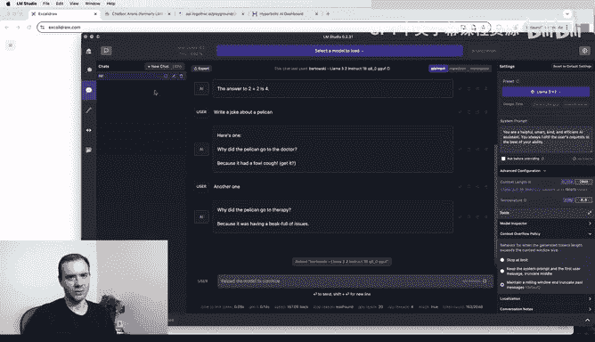
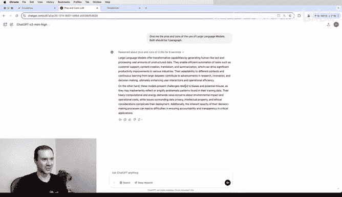

# 深入了解ChatGPT之类的大语言模型：P1：Deep Dive into LLMs like ChatGPT 🧠

## 概述

在本节课中，我们将一起学习大型语言模型（如ChatGPT）的完整构建流程。我们将从数据准备开始，逐步深入到神经网络的训练、推理，以及如何将这些模型塑造成有用的助手。课程内容将涵盖预训练、监督微调和强化学习等核心阶段，并探讨这些模型的工作原理、能力边界以及一些需要注意的“认知”特性。我们的目标是为你建立一套清晰的心智模型，帮助你理解这个既神奇又存在局限性的工具。

---

## 1. 预训练阶段：构建基础模型

在本节中，我们将探讨构建像ChatGPT这样的模型的第一步：预训练。这个阶段的目标是让模型从海量互联网文本中学习语言的统计规律。

### 数据收集与处理

构建大型语言模型的第一步是下载和处理互联网上的文本数据。一个典型的例子是Hugging Face公司收集和整理的“FineWeb”数据集。像OpenAI、Anthropic和Google这样的主要LLM提供商内部也会有类似的数据集。

我们的目标是获取大量来自公开来源的高质量、多样化的文档。最终，像FineWeb这样的代表性数据集，经过一系列过滤和处理后，其磁盘空间大约为44TB。这个数据量在今天看来并不算巨大，甚至可以存放在单个硬盘上。

数据处理通常包括多个阶段：
*   **URL过滤**：根据黑名单（如恶意软件、垃圾邮件、成人网站等）过滤掉不希望出现在数据集中的网站。
*   **文本提取**：从网页的原始HTML代码中提取出我们真正需要的文本内容，过滤掉导航栏、CSS等无关信息。
*   **语言过滤**：使用语言分类器判断网页的语言，例如，FineWeb只保留英语内容超过65%的网页。这是一个设计决策，不同公司会根据其目标（如多语言性能）做出不同选择。
*   **其他过滤与去重**：包括去除个人身份信息（PII）等步骤。

经过这些处理后，我们得到的就是纯粹的文本数据，一个由无数网页文本拼接而成的“巨大挂毯”。我们的目标是训练神经网络来内化和建模这些文本的流动规律。

### 文本的表示：分词

在将文本输入神经网络之前，我们需要决定如何表示它。神经网络期望输入是一个一维的符号序列，并且符号集合是有限的。

目前我们拥有的是一维的文本序列。在计算机中，文本以UTF-8编码的比特流形式存在。但直接使用比特（0和1）作为符号会导致序列过长。因此，我们需要在符号数量和序列长度之间进行权衡。

一种简单的方法是**将8个比特组合成一个字节**，这样序列长度缩短为原来的1/8，但符号数量增加到256个。你可以将这些字节ID想象成256个独特的表情符号。

在实际生产中，为了进一步缩短序列长度，我们会使用**字节对编码算法**。该算法会寻找数据中频繁出现的连续字节对，将它们合并成一个新的符号，并迭代此过程。最终，一个较好的词汇表大小约为10万个符号。例如，GPT-4使用了100,277个符号。

**将原始文本转换为这些符号（或称“词元”）的过程就叫做分词。**

我们可以通过[Tiktokenizer](https://tiktokenizer.vercel.app/)等工具来观察GPT-4的分词过程。例如，“Hello world”被分词为两个词元：“Hello”和“ space world”。分词是大小写敏感的，并且空格等字符的处理会影响分词结果。

最终，我们庞大的文本数据集（如FineWeb的15万亿个词元）被转换成了一个一维的词元ID序列。这些ID本身没有数学意义，只是代表文本块的唯一标识符。

### 神经网络训练

现在，我们进入计算量最大的部分：神经网络训练。我们的目标是让神经网络建模这些词元在序列中如何相互跟随的统计关系。

具体做法是：从数据中随机抽取一个词元窗口（例如，长度为4个词元），将其作为**上下文**输入神经网络。神经网络的**输出**是一个概率向量，其长度等于词汇表大小（例如，100,277），每个数值代表对应词元作为序列中下一个词出现的概率。

在训练开始时，神经网络的参数是随机初始化的，因此其预测也是随机的。但我们知道数据中下一个词元的正确答案（即**标签**）。我们有一个数学过程（如梯度下降）来调整和更新神经网络，使得正确词元的预测概率略微提高，而其他词元的概率降低。

这个过程并非只针对一个窗口，而是同时在数据集的无数个窗口上并行进行。通过大量这样的更新步骤，神经网络逐渐学会使其预测与训练数据中的统计模式保持一致。

### 神经网络内部结构

神经网络的输入是词元序列（长度可变，例如0到8000个词元）。这些输入与网络的**参数**（或称**权重**）在一个巨大的数学表达式中混合。现代神经网络拥有数十亿甚至上万亿个参数。

在训练开始时，这些参数是随机设置的。训练过程就是不断调整这些参数，使得网络的输出与训练数据中的模式一致。你可以把这些参数想象成DJ调音台上的旋钮，扭动它们会改变网络对任何输入序列的预测。

现代生产级神经网络通常采用**Transformer**架构。信息从顶部的输入词元开始，经过一系列简单的数学变换（如嵌入、层归一化、矩阵乘法、注意力机制、前馈网络等），最终流向底部的输出概率。

这些中间值可以粗略地理解为“合成神经元”的激活率，但请注意，它们比生物神经元简单得多，没有记忆，只是一个从输入到输出的无状态数学函数。

---

## 2. 推理：从模型生成新数据

上一节我们介绍了神经网络的训练，本节我们来看看如何使用训练好的模型生成新数据，这个过程称为**推理**。

推理过程相对直接：
1.  我们从一个**前缀**（一些起始词元）开始。
2.  将前缀输入神经网络，得到下一个词元的概率分布。
3.  我们像一个有偏的硬币一样，**根据这个概率分布采样**出一个具体的词元（概率高的词元更可能被选中）。
4.  将这个新词元追加到序列末尾，形成新的上下文。
5.  重复步骤2-4，持续生成后续词元。

由于采样是随机的，我们每次生成的序列都可能不同。模型生成的词元流在统计特性上与训练数据相似，但并非训练数据的逐字复现，而是一种基于训练数据的“再混合”。

在大多数场景中，下载互联网数据并进行分词是预处理步骤，只需做一次。然后，我们会训练许多不同设置和大小的神经网络。一旦获得一个训练满意、参数固定的模型，就可以用它进行推理。当你使用ChatGPT时，你就是在与一个已完成训练、参数固定的模型进行推理对话。

---

## 3. 实例：GPT-2与计算需求

让我们通过一个具体例子——OpenAI的**GPT-2**——来感受训练和推理的实际过程。GPT-2发布于2019年，是现代LLM堆栈的雏形，只是规模比现在小得多。

*   **架构**：Transformer神经网络。
*   **参数量**：15亿个。
*   **最大上下文长度**：1024个词元。
*   **训练数据量**：约1000亿个词元。

如今，模型的规模（参数量、上下文长度、训练数据量）都已大幅提升。训练GPT-2在2019年估计花费约4万美元，而今天利用更好的硬件和软件，成本可以显著降低。

训练时，研究人员会监控一个叫做**损失**的数值，它衡量网络当前的表现，数值越低越好。随着优化步骤的进行，损失不断下降，意味着网络预测下一个词元的能力在提高。同时，我们定期进行推理，观察模型生成的文本从最初的乱码逐渐变得连贯。

训练如此庞大的模型需要强大的计算能力。这通常是在云端的GPU集群上完成的。例如，一个包含8块NVIDIA H100 GPU的节点。这些GPU非常适合训练神经网络，因为它们能并行处理大量计算。科技公司们争相获取这些GPU，以训练更大、更强的语言模型，这也推动了像英伟达这样的公司市值的飙升。

---

## 4. 基础模型：互联网文本模拟器

幸运的是，一些大公司训练完这些模型后会发布所谓的**基础模型**。基础模型是一个**词元模拟器**，或者说**互联网文本模拟器**。它本身还不是一个能回答问题的助手，而只是能生成具有互联网文本统计特性的词元序列。

例如，Meta发布的**Llama 3**就是一个现代的基础模型，拥有4050亿参数，在15万亿词元上训练。我们可以通过[Hyperbolic](https://hyperbolic.xyz/)等平台与Llama 3基础模型互动。

基础模型不是助手。如果你问它“2+2等于几？”，它不会直接回答“4”，而是会像自动补全一样，根据其训练数据（网页）的统计规律，继续生成可能跟随“2+2”之后的词元，结果可能是一段关于数学的论述。

然而，基础模型在预测下一个词元的过程中，已经将大量关于世界的知识压缩存储在了其网络参数中。我们可以通过巧妙的**提示**来引导它展现出这些知识。例如，给出一个“巴黎十大景点”的列表开头，模型可能会继续完成这个列表。

但要注意，模型给出的信息是基于其训练数据的模糊、概率性的回忆，不一定精确可靠。模型也可能**逐字记忆**某些高频出现的文档（如维基百科文章），这种现象称为“复述”。对于训练数据截止日期之后的信息（如2024年大选），模型只能根据已有知识进行“最佳猜测”，这会导致**幻觉**。

即使只是基础模型，通过巧妙的提示设计也能实现一些实用功能，例如：
*   **少样本提示**：通过提供几个“单词-翻译”的例子，模型能学会在上下文中扮演翻译的角色。
*   **通过提示创建助手**：通过构造一个看起来像是“有帮助的AI助手与人类对话”的网页文本作为提示，基础模型会继续这个对话，从而扮演助手的角色。

---

## 5. 监督微调：将基础模型变为助手

基础模型虽然有趣，但我们想要的是能回答问题的**助手**。这就需要进入第二阶段：**后训练**，特别是**监督微调**。

这个阶段的计算成本远低于预训练，但至关重要。目标是让模型不再模拟互联网文档，而是学会进行对话。我们需要考虑多轮对话，并规划助手应如何与人类互动。

由于神经网络是通过数据训练的，我们无法用代码直接“编程”助手的行为。相反，我们需要通过创建**对话数据集**来隐式地编程。这个数据集包含成千上万条多轮、多样化的对话示例。

这些对话数据来自**人类标注员**。公司（如OpenAI）会编写详细的**标注指南**，要求标注员在给定对话上下文中，写出理想的助手回复。通过在这些对话数据上继续训练基础模型，模型会迅速调整，学会模仿人类标注员在类似情境下的回应方式。

### 对话的分词表示

对话也需要被转换成词元序列。我们需要设计一种编码协议。例如，GPT-4使用特殊的词元（如`<|im_start|>`, `<|im_end|>`）来标记对话中不同角色的发言开始和结束。通过这种结构，多轮对话被编码成一个一维词元序列，从而可以应用之前的所有训练和推理方法。

### 监督微调数据集实例

OpenAI在2022年的InstructGPT论文中首次详细描述了这种方法。他们雇佣人类标注员来创建提示和理想的助手回复，并提供了详细的标注指南（要求助手有帮助性、真实性、无害性）。

如今，最先进的方法已经演进，语言模型本身被大量用于帮助生成这些对话数据集（合成数据），但人类监督和 curation 仍然是核心。最终，我们得到一个由人类意图（通过标注指南）塑造的、通过示例编程的助手模型。

**因此，当你与ChatGPT对话时，你得到的回复在统计意义上，是在模拟一个遵循OpenAI标注指南的人类标注员会给出的答案。** 你不是在与一个神奇的AI对话，而是在与一个平均标注员的瞬时模拟对话。

---

## 6. LLM心理学：幻觉、工具使用与认知局限

在了解了训练流程后，我们来探讨一些由此产生的“认知”效应。

### 幻觉及其缓解

**幻觉**指模型编造信息，这是LLM助手的一个大问题。其根源在于训练数据：在数据集中，“谁是XXX？”这类问题通常都配有自信的答案。因此，即使模型内部“知道”自己不了解某个实体，它也会模仿数据中的风格，给出一个统计上最可能的猜测（即编造）。

**缓解方法1：知识边界拒绝**
我们可以通过探测模型，找出它不知道答案的问题，然后在训练数据中加入对于这些问题，助手应回答“我不知道”的例子。这样，模型就能学会将内部的不确定性神经元激活与“拒绝回答”的文本输出关联起来。

**缓解方法2：工具使用（如网络搜索）**
更好的方法是赋予模型使用工具的能力。我们可以引入特殊的词元（如`<|search_start|>`, `<|search_end|>`），让模型在不确定时发起网络搜索。外部的程序会执行搜索，将结果文本插入模型的上下文窗口。这相当于模型的**工作记忆**，使其能直接访问最新信息，从而给出有依据的答案。ChatGPT的“联网搜索”功能就是基于此原理。

### 模型需要词元来“思考”

神经网络在每个词元上的计算量是有限的。因此，复杂的推理需要**分布在多个词元上**进行。这意味着，在训练数据或提示中，我们应该鼓励模型生成**中间步骤**，而不是要求它在一个词元内给出最终答案。

例如，解决数学问题时，让模型一步步列出方程和计算过程，比让它直接蹦出答案更可靠。如果你强制模型“用一个词元回答”，对于复杂问题它很可能出错。在实践中，对于数学或逻辑任务，更好的做法是要求模型**使用代码解释器**工具，让Python等编程语言来执行精确计算。

### 其他认知局限

*   **计数能力差**：由于模型处理的是词元而非字符，并且不擅长“心算”，直接要求它数点数或字母数往往失败。同样，使用代码工具是更可靠的选择。
*   **拼写任务**：基于同样的原因（词元化），模型在处理字符级任务（如“每隔三个字母输出”）时表现不佳。
*   **“瑞士奶酪”能力**：模型在某些极其复杂的领域表现出色，却可能在简单问题上犯错（例如，比较9.11和9.9的大小）。这可能是由于训练数据中的干扰模式（如《圣经》章节编号）导致的。这提醒我们，模型并非万无一失，需要将其作为工具来谨慎使用。

---

## 7. 强化学习：让模型学会“练习”

监督微调让模型模仿专家，但要达到更高水平，我们需要第三阶段：**强化学习**。这类似于学生通过**做练习题**来巩固和发现自己的解题方法。

在强化学习中，我们给模型提供大量问题（提示），但不提供标准解题步骤（专家解决方案），只提供最终答案。模型尝试生成多种不同的解决方案（“尝试”），我们评估哪些方案得到了正确答案。然后，我们鼓励那些能导向正确答案的解决方案路径。

这个过程是“试错”学习。模型通过大量练习，自行发现哪些词元序列（哪些“思考”方式）能可靠地解决问题。它可能会发展出人类解题时不常写出来、但内部却存在的“思维链”，例如反复验证、从不同角度审视问题等。这些策略是优化过程中**涌现**出来的，而非人类预设的。

**DeepSeek-R1** 模型是强化学习在推理领域应用的著名例子。当向它提出数学问题时，它的回复会包含大量的内部思考过程（“让我再检查一下”、“换个方法试试”），最后才给出整理好的答案。这种“思考模型”在数学和代码等可验证领域表现尤为出色。

在ChatGPT中，`o1`、`o3`系列模型就是应用了强化学习的“思考模型”。它们生成答案的速度可能较慢，因为在进行内部推理。对于简单知识性问题，使用GPT-4这类以监督微调为主的模型可能更高效；对于复杂推理任务，则应该求助于思考模型。

强化学习的威力早在AlphaGo战胜人类围棋冠军时就已证明。它能让系统发现超越人类专家经验的新策略（如著名的“第37步”）。在开放领域的思维问题上，强化学习同样有望让模型发现人类未曾想到过的类比和解题策略。

### 人类反馈的强化学习

对于诗歌、笑话、摘要等**不可验证**的领域，我们无法用标准答案自动评分。这时可以使用**基于人类反馈的强化学习**。

核心思想是**间接学习**：
1.  训练一个独立的**奖励模型**：让人类标注员对模型的多个输出进行排序（哪个更好），然后用神经网络学习模仿人类的这种排序偏好。
2.  **对奖励模型进行强化学习**：将训练好的奖励模型作为评分模拟器，让LLM针对它进行强化学习，以生成能获得高评分的输出。

RLHF 的优点是可以将强化学习应用于更广泛的领域，并且让人类执行更简单的排序任务而非困难的生成任务。但其缺点是奖励模型只是对人类偏好的有损模拟，并且强化学习很容易找到“欺骗”奖励模型的方法（对抗性示例），因此RLHF的训练不能无限进行，效果也有上限。它更像是一种精细的微调，而非能产生质变的“魔法”式强化学习。

---

## 总结

本节课我们一起学习了构建大型语言模型（如ChatGPT）的完整流程：

1.  **预训练**：模型在海量互联网文本上学习，成为一个**基础模型**（互联网文本模拟器），将世界知识压缩存储于网络参数中。
2.  **监督微调**：在人类标注的对话数据上继续训练，将基础模型变为能遵循指令、进行对话的**助手模型**。其行为本质上是人类标注员行为的统计模拟。
3.  **强化学习**：在可验证的问题（数学、代码）上，通过试错让模型自行发现高效的解题策略和“思维链”，产生**思考模型**，其能力可能超越单纯模仿。对于不可验证领域，则使用基于人类反馈的强化学习进行微调。

我们还探讨了模型的“心理学”：它们会**幻觉**，需要**工具**（如搜索、代码）来扩展能力，其推理需**分布到多个词元**，并且存在一些像“瑞士奶酪”一样的**能力盲区**。

展望未来，模型将变得更加**多模态**（处理图像、音频），更擅长作为**智能体**执行长时任务，并更深度地集成到各种工具中。

请记住，这些模型是极其强大的工具，能显著加速工作。但务必**将其视为工具**，核查其输出，对其工作成果负责。利用它们获取灵感、完成初稿，但始终保持批判性思维，你将会更有效地利用这项变革性技术。