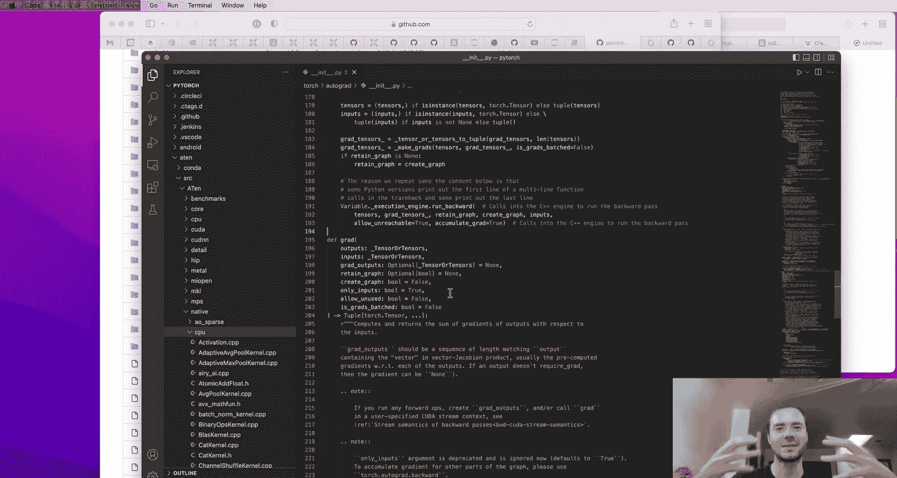
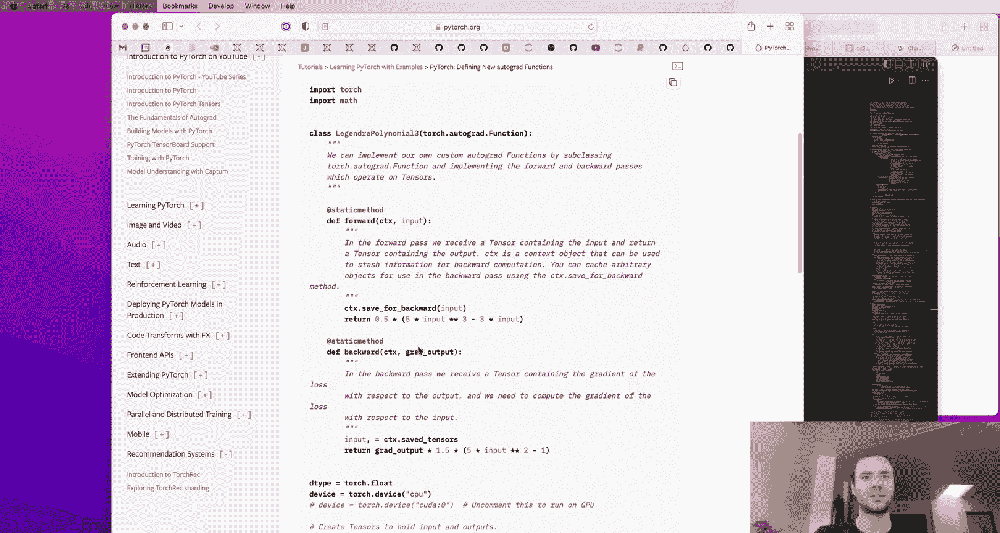
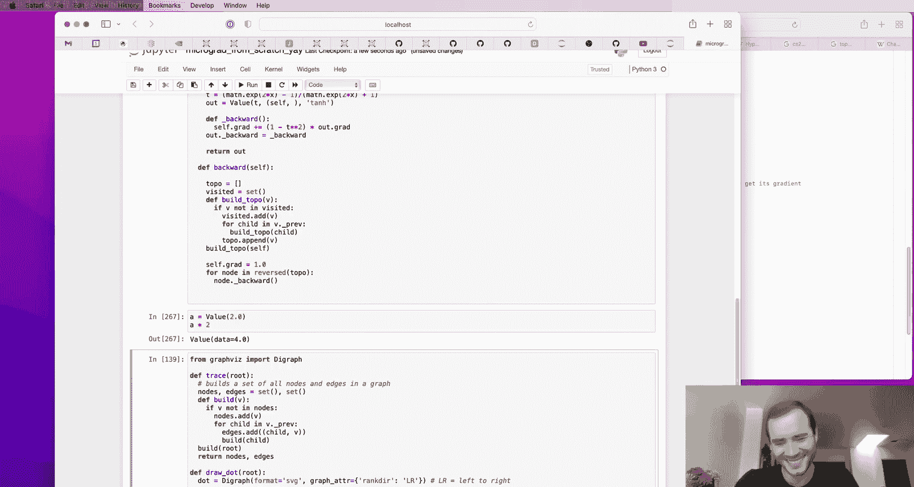

# 神经网络与反向传播详解：构建 micrograd 🧠

## 概述

在本课程中，我们将从零开始构建一个名为 **micrograd** 的微型自动微分引擎。通过这个过程，我们将深入理解神经网络训练的核心机制——反向传播算法。我们将从最基础的导数概念出发，逐步构建出能够表示复杂数学表达式的数据结构，最终实现一个可以训练简单神经网络的完整系统。本教程旨在用最简单直白的方式，让初学者也能看懂神经网络背后的数学原理和代码实现。

---

## 第1部分：导数的直观理解 📈

在深入构建自动微分引擎之前，我们首先需要建立对导数的直观理解。导数衡量的是函数在某个点上的瞬时变化率，即当输入发生微小变化时，输出会如何响应。

### 一个简单的标量函数

让我们从一个简单的二次函数开始：`f(x) = 3*x**2 - 4*x + 5`。

```python
def f(x):
    return 3*x**2 - 4*x + 5
```

我们可以计算在 `x=3.0` 处的函数值，结果为 `20`。为了理解导数，我们使用其定义进行数值近似：

```python
h = 0.001
x = 3.0
(f(x + h) - f(x)) / h  # 输出约为 14.0
```

这个结果 `14.0` 就是函数在 `x=3.0` 处的斜率。它告诉我们，如果我们将 `x` 稍微增加一点，`f(x)` 将以大约 `14` 倍的速率增长。通过解析求导（`f'(x) = 6*x - 4`）并代入 `x=3`，我们得到 `6*3 - 4 = 14`，验证了我们的数值近似。

### 扩展到多输入函数

上一节我们介绍了单变量函数的导数，本节中我们来看看一个具有三个输入 `a, b, c` 的函数：`d = a * b + c`。

假设在点 `(a=2.0, b=-3.0, c=10.0)` 处，`d` 的值为 `4`。我们想分别求 `d` 关于 `a`、`b`、`c` 的偏导数。

以下是计算 `d` 关于 `a` 的偏导数的数值方法：

```python
h = 0.001
a, b, c = 2.0, -3.0, 10.0

d1 = a * b + c
# 将 a 增加一个微小量 h
a += h
d2 = a * b + c
print(‘d 关于 a 的斜率：‘, (d2 - d1) / h) # 输出约为 -3.0
```

结果 `-3.0` 是负数，这意味着增加 `a` 会使输出 `d` 减小。这与解析结果（`∂d/∂a = b = -3.0`）一致。同理，`∂d/∂b = a = 2.0`，`∂d/∂c = 1.0`。

**核心概念**：导数（或梯度）是一个向量，它指明了每个输入变量如何影响输出。在神经网络中，这些输入最终将代表**权重**和**数据**，而输出代表**损失**。我们通过调整权重（沿着梯度的反方向）来最小化损失。

---

## 第2部分：构建表达式图 🔗

神经网络本质上是复杂的数学表达式。为了处理它们，我们需要一种数据结构来构建和跟踪这些表达式。这就是我们的 `Value` 类。

### 基础的 Value 类

我们首先创建一个类来包装标量值，并记录它是如何通过运算产生的。

```python
class Value:
    def __init__(self, data, _children=(), _op=‘‘, label=‘‘):
        self.data = data
        self.grad = 0.0  # 导数，初始为0
        # 内部变量，用于构建计算图
        self._prev = set(_children)
        self._op = _op
        self.label = label

    def __repr__(self):
        return f“Value(data={self.data}, grad={self.grad})”
```

现在我们可以创建值对象：`a = Value(2.0, label=‘a‘)`。

### 实现基本运算

为了让 `Value` 对象能够进行数学运算，我们需要重载 Python 的运算符。

以下是加法的实现：

```python
def __add__(self, other):
    # 如果 other 不是 Value 对象，则将其转换为 Value
    other = other if isinstance(other, Value) else Value(other)
    out = Value(self.data + other.data, (self, other), ‘+‘)
    return out
```

乘法的实现类似：

```python
def __mul__(self, other):
    other = other if isinstance(other, Value) else Value(other)
    out = Value(self.data * other.data, (self, other), ‘*‘)
    return out
```

为了让像 `2 * a` 这样的表达式也能工作，我们还需要实现反向乘法 `__rmul__`：

```python
def __rmul__(self, other): # other * self
    return self * other
```

现在我们可以构建表达式了：

```python
a = Value(2.0, label=‘a‘)
b = Value(-3.0, label=‘b‘)
c = Value(10.0, label=‘c‘)
e = a * b; e.label = ‘e‘
d = e + c; d.label = ‘d‘
f = Value(-2.0, label=‘f‘)
L = d * f; L.label = ‘L‘
```

我们构建了一个计算图：`L = (a*b + c) * f`。每个 `Value` 对象都通过 `_prev` 属性记住了它的子节点（输入），并通过 `_op` 属性记住了产生它的操作。

### 可视化计算图

为了直观地看到我们构建的表达式，我们可以使用 `graphviz` 库来绘制计算图。以下是一个简化的绘图函数：

```python
from graphviz import Digraph

def trace(root):
    nodes, edges = set(), set()
    def build(v):
        if v not in nodes:
            nodes.add(v)
            for child in v._prev:
                edges.add((child, v))
                build(child)
    build(root)
    return nodes, edges

def draw_dot(root):
    dot = Digraph(format=‘svg‘, graph_attr={‘rankdir‘: ‘LR‘}) # LR 表示从左到右
    nodes, edges = trace(root)
    for n in nodes:
        uid = str(id(n))
        # 为每个值创建一个矩形节点
        dot.node(name=uid, label=f“{n.label} | data {n.data:.4f} | grad {n.grad:.4f}“, shape=‘record‘)
        if n._op:
            # 如果这个值是由操作产生的，为操作创建一个操作节点
            dot.node(name=uid + n._op, label=n._op)
            dot.edge(uid + n._op, uid) # 从操作节点指向结果值节点
    for n1, n2 in edges:
        # 连接子节点到操作节点
        dot.edge(str(id(n1)), str(id(n2)) + n2._op)
    return dot
```

调用 `draw_dot(L)` 将生成一个显示数据流和当前值（梯度尚未计算）的图。

---

## 第3部分：手动反向传播与链式法则 ⛓️

现在我们已经有了计算图，接下来进行最重要的部分：反向传播。我们将手动计算图中每个节点关于最终输出 `L` 的梯度。

### 从输出开始

首先，`L` 关于自身的梯度是 1.0：`L.grad = 1.0`。这表示 `L` 对自身变化的敏感度是 1。

### 通过乘法节点反向传播

`L` 是由 `d` 和 `f` 相乘得到的：`L = d * f`。
根据微积分，`∂L/∂d = f.data`，`∂L/∂f = d.data`。

因此：
```python
f.grad = d.data # 4.0
d.grad = f.data # -2.0
```

### 通过加法节点反向传播

`d` 是由 `e` 和 `c` 相加得到的：`d = e + c`。
加法运算的局部导数为 1。根据链式法则，上游梯度 `d.grad` 会直接传递（乘以1）给它的所有输入。

因此：
```python
e.grad = d.grad * 1.0 # -2.0
c.grad = d.grad * 1.0 # -2.0
```

**链式法则核心公式**：如果 `z` 依赖于 `y`，`y` 依赖于 `x`，那么 `dz/dx = dz/dy * dy/dx`。在反向传播中，我们将上游梯度 (`dz/dy`) 乘以局部梯度 (`dy/dx`)，得到传递给更下层节点的梯度 (`dz/dx`)。

### 通过另一个乘法节点

`e` 是由 `a` 和 `b` 相乘得到的：`e = a * b`。
乘法运算的局部导数：`∂e/∂a = b.data`，`∂e/∂b = a.data`。

应用链式法则：
```python
a.grad = e.grad * b.data # (-2.0) * (-3.0) = 6.0
b.grad = e.grad * a.data # (-2.0) * (2.0) = -4.0
```

### 验证与意义

现在，我们手动为图中所有节点填充了梯度。我们可以用数值梯度来验证：
```python
h = 0.001
a = Value(2.0); b = Value(-3.0); c = Value(10.0); f = Value(-2.0)
d = a*b + c
L = d*f

L1 = L.data
# 测试 a 的梯度
a.data += h
d = a*b + c
L = d*f
L2 = L.data
print((L2 - L1) / h) # 应接近 6.0
```

梯度 `a.grad = 6.0` 告诉我们，如果我们将权重 `a` 增加一点点，损失 `L` 会以大约 6 倍的速率增加。因为我们要**最小化**损失，所以我们应该向梯度的**反方向**更新参数：`a.data += -0.01 * a.grad`。对所有权重进行这样的更新，并重新计算前向传播，应该会使损失 `L` 的值下降。这就是**梯度下降**的基本思想。

---

## 第4部分：实现自动反向传播 🤖

手动计算梯度非常繁琐。现在，我们将把反向传播的逻辑编码到 `Value` 类中，使其自动化。

### 为每个操作定义反向传播函数

我们需要在每个 `Value` 对象中存储一个 `_backward` 函数，该函数知道如何将本节点的梯度传播到其子节点。

在 `__init__` 中初始化：`self._backward = lambda: None`（对于叶子节点，这是一个空操作）。

在创建运算结果时，我们需要定义其特定的 `_backward` 方法。

**加法节点的反向传播**：
```python
def __add__(self, other):
    other = other if isinstance(other, Value) else Value(other)
    out = Value(self.data + other.data, (self, other), ‘+‘)

    def _backward():
        # 链式法则：上游梯度 out.grad 直接传递给两个输入
        self.grad += out.grad * 1.0
        other.grad += out.grad * 1.0
    out._backward = _backward
    return out
```
注意我们使用 `+=` 而不是 `=`。这是因为一个变量可能在计算图中被多次使用（例如 `a + a`），梯度需要累加。

**乘法节点的反向传播**：
```python
def __mul__(self, other):
    other = other if isinstance(other, Value) else Value(other)
    out = Value(self.data * other.data, (self, other), ‘*‘)

    def _backward():
        # 局部导数：∂out/∂self = other.data, ∂out/∂other = self.data
        self.grad += other.data * out.grad
        other.grad += self.data * out.grad
    out._backward = _backward
    return out
```

### 实现 tanh 激活函数

神经网络需要非线性激活函数。我们实现 `tanh`。
`tanh(x) = (e^(2x) - 1) / (e^(2x) + 1)`，其导数为 `1 - tanh(x)^2`。

```python
def tanh(self):
    x = self.data
    t = (math.exp(2*x) - 1) / (math.exp(2*x) + 1)
    out = Value(t, (self, ), ‘tanh‘)

    def _backward():
        # 局部导数：d(tanh)/dx = 1 - t^2
        self.grad += (1 - t**2) * out.grad
    out._backward = _backward
    return out
```

### 拓扑排序与自动反向传播

为了以正确的顺序调用所有 `_backward` 函数（先子节点，后父节点），我们需要对计算图进行拓扑排序。

```python
def backward(self):
    # 拓扑排序
    topo = []
    visited = set()
    def build_topo(v):
        if v not in visited:
            visited.add(v)
            for child in v._prev:
                build_topo(child)
            topo.append(v)
    build_topo(self)

    # 反向传播
    self.grad = 1.0 # 输出节点关于自身的梯度为1
    for node in reversed(topo):
        node._backward()
```

现在，只需调用 `L.backward()`，所有节点的 `.grad` 属性就会被自动、正确地填充。

### 修复一个常见错误：梯度累加

在训练循环中，每次前向传播后我们都会调用 `backward()`。由于 `_backward` 函数使用 `+=`，我们必须确保在每次反向传播之前将所有权重的梯度归零，否则梯度会不断累积。

```python
def zero_grad(self):
    for p in self.parameters():
        p.grad = 0.0
```

---

## 第5部分：构建神经网络 🧱

有了自动微分引擎，我们现在可以构建神经网络模块了。我们将模仿 PyTorch 的 API 设计。

### 神经元 (Neuron)

一个神经元接收多个输入，对每个输入乘以一个权重，加上偏置，然后通过一个激活函数（如 `tanh`）。

```python
class Neuron:
    def __init__(self, nin):
        # 随机初始化权重和偏置
        self.w = [Value(random.uniform(-1,1)) for _ in range(nin)]
        self.b = Value(random.uniform(-1,1))

    def __call__(self, x):
        # w * x + b
        act = sum((wi*xi for wi, xi in zip(self.w, x)), self.b)
        out = act.tanh()
        return out

    def parameters(self):
        return self.w + [self.b]
```

### 层 (Layer)

一个层由多个独立的神经元组成。

```python
class Layer:
    def __init__(self, nin, nout):
        self.neurons = [Neuron(nin) for _ in range(nout)]

    def __call__(self, x):
        outs = [n(x) for n in self.neurons]
        return outs[0] if len(outs) == 1 else outs

    def parameters(self):
        return [p for neuron in self.neurons for p in neuron.parameters()]
```

### 多层感知机 (MLP)

一个 MLP 是多个层的堆叠。

```python
class MLP:
    def __init__(self, nin, nouts):
        sz = [nin] + nouts
        self.layers = [Layer(sz[i], sz[i+1]) for i in range(len(nouts))]

    def __call__(self, x):
        for layer in self.layers:
            x = layer(x)
        return x

    def parameters(self):
        return [p for layer in self.layers for p in layer.parameters()]
```

现在我们可以创建一个神经网络：`n = MLP(3, [4, 4, 1])` 表示一个 3 维输入，两个隐藏层各有 4 个神经元，输出层有 1 个神经元的网络。

---

## 第6部分：训练神经网络 🏋️

### 定义损失函数

我们需要一个标量来衡量网络预测的好坏。对于回归或二分类问题，一个简单的选择是均方误差 (MSE) 损失。

```python
# xs 是输入数据列表，ys 是对应的目标值列表
ypred = [n(x) for x in xs]
loss = sum((yout - ygt)**2 for ygt, yout in zip(ys, ypred))
```

损失值越低，表示预测越接近目标。

### 梯度下降训练循环

训练就是重复以下步骤：
1.  **前向传播**：计算预测和损失。
2.  **反向传播**：计算损失关于所有参数的梯度 (`loss.backward()`)。
3.  **参数更新**：沿着梯度反方向微调参数，以减小损失。

```python
learning_rate = 0.01
for k in range(20): # 训练20步
    # 前向传播
    ypred = [n(x) for x in xs]
    loss = sum((yout - ygt)**2 for ygt, yout in zip(ys, ypred))

    # 反向传播
    for p in n.parameters():
        p.grad = 0.0 # 关键步骤：清零梯度
    loss.backward()

    # 更新参数（梯度下降）
    for p in n.parameters():
        p.data += -learning_rate * p.grad

    print(k, loss.data)
```

如果学习率设置得当，你应该会看到损失值随着训练步数增加而稳步下降，网络的预测 `ypred` 也会越来越接近目标 `ys`。




---

## 总结 🎉

在本课程中，我们一起学习了神经网络训练的核心原理：






1.  **神经网络是数学表达式**