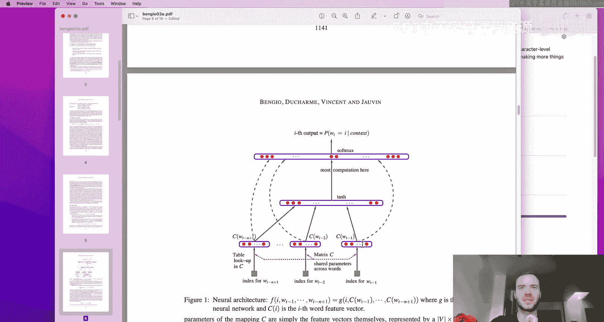
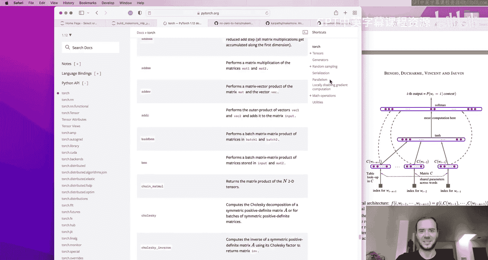
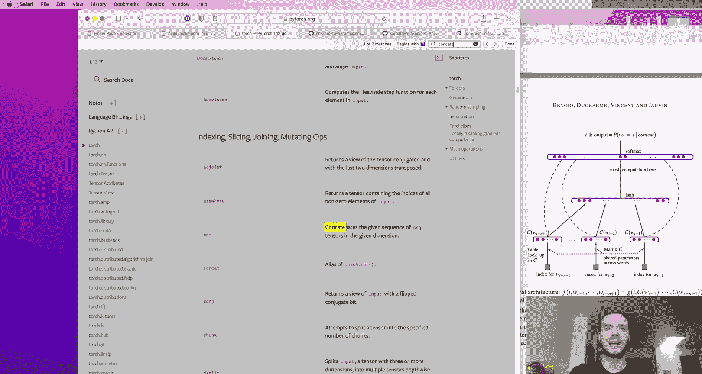
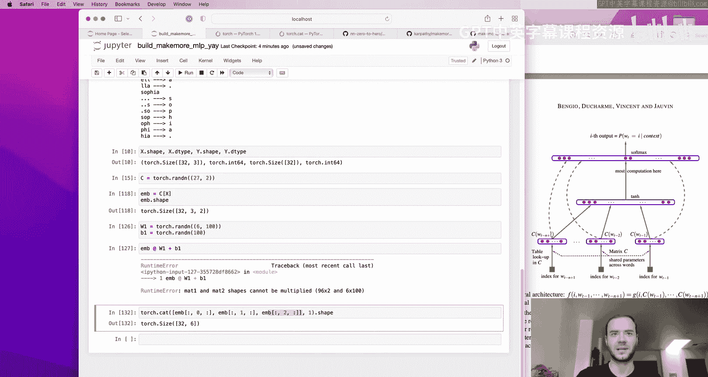
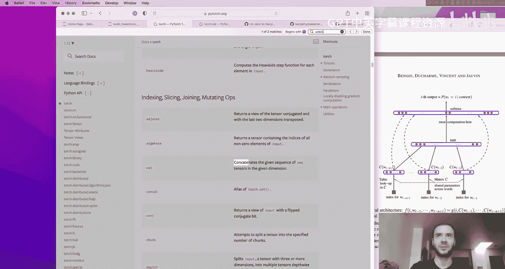
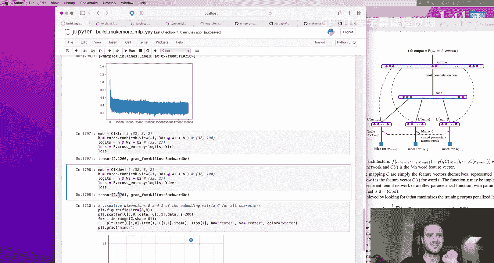
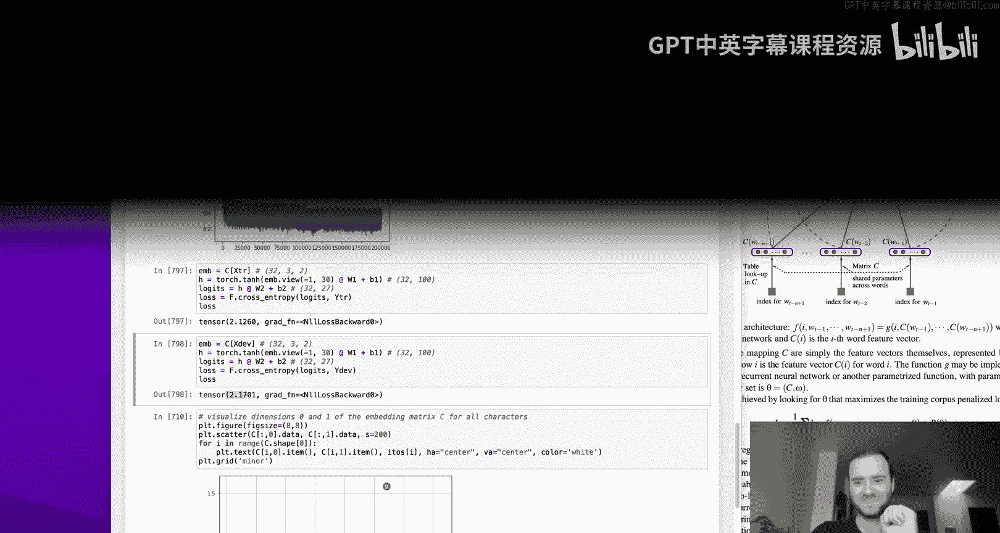
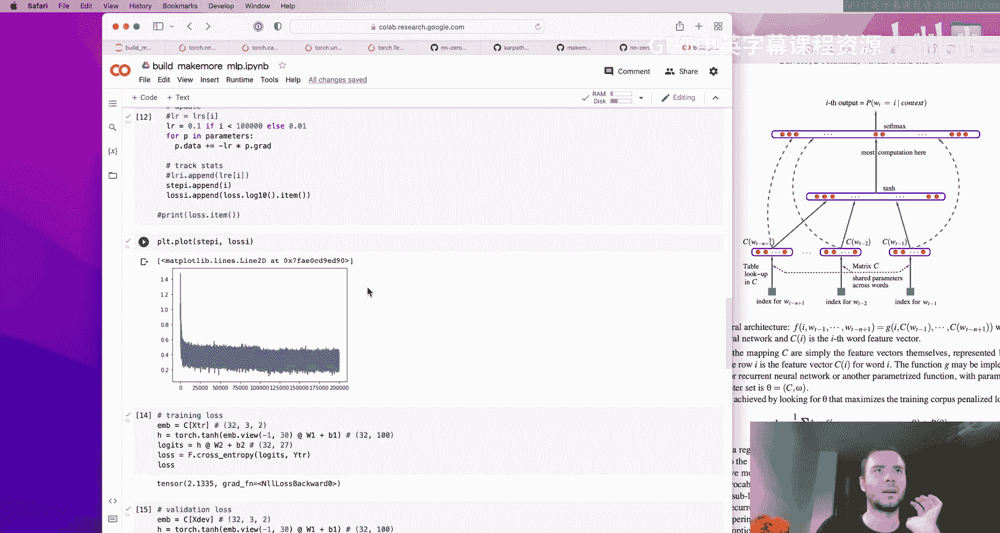

# 语言建模的详解入门：构建 makemore：2：多层感知机 (MLP)

在本节课中，我们将继续构建 `makemore` 项目。上一节我们介绍了基于计数的二元语言模型，以及一个使用单层线性神经网络的简单实现。本节中，我们将探讨如何利用多层感知机模型来预测序列中的下一个字符，这种方法能更好地处理更长的上下文信息。

## 概述

上一节我们实现的模型仅考虑前一个字符来预测下一个字符。这种方法虽然简单，但预测效果不佳，因为上下文信息太少。如果我们尝试考虑更多上下文（例如前两个或三个字符），可能性组合的数量会呈指数级增长（例如，考虑三个字符时，有 27^3 = 19683 种可能的上下文组合），导致数据稀疏，模型无法有效学习。

为了解决这个问题，我们将实现一个多层感知机模型。该模型的灵感来源于 Bengio 等人在 2003 年发表的论文《A Neural Probabilistic Language Model》。该论文提出使用词嵌入（将单词映射为低维向量）和神经网络来预测下一个词，从而能够通过向量空间的相似性来泛化到未见过的上下文组合。

## 模型架构详解



论文中的模型是一个词级语言模型，但我们将遵循其架构思想，构建一个字符级模型。核心思想是为每个字符学习一个低维的嵌入向量，然后使用一个神经网络基于多个前序字符的嵌入向量来预测下一个字符。

以下是模型的关键组成部分：

1.  **嵌入层 (Embedding Layer)**：这是一个查找表 `C`，其大小为 `[vocab_size, embedding_dim]`。`vocab_size` 是词汇表大小（对我们来说是 27 个字符），`embedding_dim` 是嵌入向量的维度（例如 2、10、30 等）。该层将输入的字符索引（整数）转换为对应的嵌入向量。
2.  **输入层 (Input Layer)**：我们将多个（例如 3 个）前序字符的嵌入向量拼接起来，形成一个更长的输入向量。如果嵌入维度是 2，上下文长度是 3，那么输入向量的长度就是 `3 * 2 = 6`。
3.  **隐藏层 (Hidden Layer)**：这是一个全连接层，具有 `hidden_size` 个神经元（例如 100、200），并使用 `tanh` 作为激活函数。该层接收拼接后的嵌入向量作为输入。
4.  **输出层 (Output Layer)**：这是另一个全连接层，其神经元数量等于词汇表大小（27）。它接收隐藏层的输出，并产生每个可能的下一个字符的“得分”（logits）。
5.  **Softmax 层**：将输出层的 logits 通过 softmax 函数转换为概率分布，所有可能字符的概率之和为 1。

模型的参数包括嵌入矩阵 `C`、隐藏层的权重和偏置、以及输出层的权重和偏置。训练时，我们通过反向传播最大化训练数据中真实下一个字符的对数似然（即最小化交叉熵损失）。

## 代码实现步骤

现在，让我们一步步实现这个模型。

### 1. 准备数据集





首先，我们需要构建数据集。与之前不同，现在每个输入样本是多个（`block_size` 个）连续的字符，标签是紧随其后的那个字符。





```python
import torch
import matplotlib.pyplot as plt

# 读取数据
words = open('names.txt', 'r').read().splitlines()
print(f"总单词数: {len(words)}")
print(words[:8])

# 构建字符词汇表
chars = sorted(list(set(''.join(words))))
stoi = {s:i+1 for i,s in enumerate(chars)}
stoi['.'] = 0
itos = {i:s for s,i in stoi.items()}
vocab_size = len(itos)
print(f"词汇表: {itos}")
print(f"词汇表大小: {vocab_size}")

# 构建数据集函数
def build_dataset(words, block_size=3):
    X, Y = [], []
    for w in words:
        context = [0] * block_size # 初始用 '.' (索引0) 填充
        for ch in w + '.':
            ix = stoi[ch]
            X.append(context)       # 输入是当前上下文
            Y.append(ix)            # 标签是下一个字符
            context = context[1:] + [ix] # 滑动窗口，移出最旧的字符，加入新字符
    X = torch.tensor(X)
    Y = torch.tensor(Y)
    print(f"构建了 {len(X)} 个样本")
    return X, Y

# 划分训练集、验证集和测试集
import random
random.seed(42)
random.shuffle(words)
n1 = int(0.8 * len(words))
n2 = int(0.9 * len(words))

Xtr, Ytr = build_dataset(words[:n1])   # 训练集 (80%)
Xdev, Ydev = build_dataset(words[n1:n2]) # 验证集 (10%)
Xte, Yte = build_dataset(words[n2:])    # 测试集 (10%)
```

### 2. 初始化模型参数

接下来，我们初始化模型的所有参数：嵌入矩阵、隐藏层和输出层的权重与偏置。

```python
# 超参数
block_size = 3        # 上下文长度
embedding_dim = 10    # 每个字符的嵌入维度
hidden_size = 200     # 隐藏层神经元数量
learning_rate = 0.1
iterations = 100000

# 初始化参数
g = torch.Generator().manual_seed(2147483647) # 为了可复现性

# 嵌入层 C: [vocab_size, embedding_dim]
C = torch.randn((vocab_size, embedding_dim), generator=g)

# 隐藏层: 输入维度 = block_size * embedding_dim, 输出维度 = hidden_size
W1 = torch.randn((block_size * embedding_dim, hidden_size), generator=g) * 0.2
b1 = torch.randn(hidden_size, generator=g) * 0.01

# 输出层: 输入维度 = hidden_size, 输出维度 = vocab_size
W2 = torch.randn((hidden_size, vocab_size), generator=g) * 0.01
b2 = torch.randn(vocab_size, generator=g) * 0

# 将所有参数放入一个列表，方便管理
parameters = [C, W1, b1, W2, b2]
print(f"参数总数: {sum(p.nelement() for p in parameters)}")

# 告诉 PyTorch 这些张量需要计算梯度
for p in parameters:
    p.requires_grad = True
```

### 3. 训练循环

我们将使用小批量随机梯度下降来训练模型。在每个迭代中，我们从训练集中随机抽取一批样本，计算前向传播的损失，然后执行反向传播来更新参数。

```python
# 记录损失用于绘图
lossi = []

for i in range(iterations):
    # 1. 构造一个小批量 (mini-batch)
    ix = torch.randint(0, Xtr.shape[0], (32,)) # 批量大小 32
    Xb, Yb = Xtr[ix], Ytr[ix]

    # 2. 前向传播
    # 嵌入层: 将输入索引转换为嵌入向量
    emb = C[Xb] # 形状: [batch_size, block_size, embedding_dim]
    # 将多个嵌入向量在最后一个维度之后拼接起来
    # 使用 `view` 来高效地改变形状，相当于拼接
    emb_concatenated = emb.view(emb.shape[0], -1) # 形状: [batch_size, block_size * embedding_dim]

    # 隐藏层 (带 tanh 激活)
    h = torch.tanh(emb_concatenated @ W1 + b1) # 形状: [batch_size, hidden_size]

    # 输出层 (logits)
    logits = h @ W2 + b2 # 形状: [batch_size, vocab_size]

    # 计算损失 (交叉熵)
    loss = F.cross_entropy(logits, Yb)

    # 3. 反向传播
    for p in parameters:
        p.grad = None # 将梯度置零
    loss.backward()

    # 4. 更新参数 (梯度下降)
    lr = learning_rate
    if i > iterations // 2: # 后半程学习率衰减
        lr = 0.01
    for p in parameters:
        p.data += -lr * p.grad

    # 记录损失
    lossi.append(loss.log10().item())

# 绘制训练损失曲线
plt.plot(lossi)
plt.title('Training Loss (log10 scale)')
plt.show()
```

### 4. 模型评估

训练完成后，我们在训练集和验证集上评估模型的损失，以检查是否过拟合或欠拟合。

```python
@torch.no_grad() # 在此上下文中不计算梯度，节省内存和计算
def evaluate_loss(X, Y):
    emb = C[X]
    emb_concatenated = emb.view(emb.shape[0], -1)
    h = torch.tanh(emb_concatenated @ W1 + b1)
    logits = h @ W2 + b2
    loss = F.cross_entropy(logits, Y)
    return loss.item()

train_loss = evaluate_loss(Xtr, Ytr)
dev_loss = evaluate_loss(Xdev, Ydev)
print(f'训练集损失: {train_loss:.4f}')
print(f'验证集损失: {dev_loss:.4f}')
```

### 5. 从模型生成样本

最后，我们可以使用训练好的模型来生成新的“名字”。

```python
# 生成样本
g = torch.Generator().manual_seed(2147483647 + 10)
for _ in range(20):
    out = []
    context = [0] * block_size # 以 '.' 开始
    while True:
        # 前向传播
        emb = C[torch.tensor([context])] # 注意增加批次维度
        emb_concatenated = emb.view(1, -1)
        h = torch.tanh(emb_concatenated @ W1 + b1)
        logits = h @ W2 + b2
        probs = F.softmax(logits, dim=1)
        # 根据概率分布采样下一个字符
        ix = torch.multinomial(probs, num_samples=1, generator=g).item()
        # 更新上下文
        context = context[1:] + [ix]
        out.append(ix)
        if ix == 0: # 遇到 '.' 结束
            break
    # 将索引解码为字符并打印
    print(''.join(itos[i] for i in out))
```

## 总结

本节课中，我们一起学习了如何构建一个基于多层感知机的字符级语言模型。我们首先分析了仅考虑短上下文的局限性，然后引入了 Bengio 2003 年论文中的思想，即使用嵌入向量和神经网络来捕获更长的依赖关系并实现泛化。





我们详细实现了模型的各个部分：嵌入层、隐藏层和输出层，并使用小批量随机梯度下降进行训练。我们还介绍了如何划分数据集以进行正确的模型评估，以及如何从训练好的模型中采样生成新的序列。



通过调整嵌入维度、隐藏层大小、上下文长度和优化超参数，你可以进一步降低损失，生成更逼真的“名字”。这个简单的 MLP 模型为我们理解更复杂的现代语言模型（如 RNN、LSTM 和 Transformer）奠定了重要的基础。