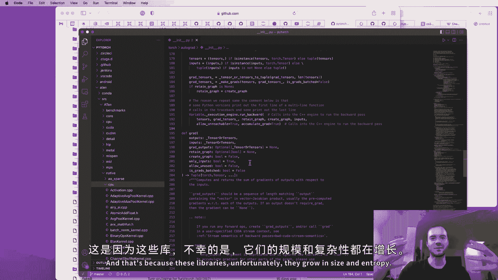

# 课程 P1：神经网络与反向传播详解 🧠

在本课程中，我们将从零开始，深入探索神经网络训练的内部机制。我们将从一个空白的 Jupyter 笔记本开始，最终定义并训练一个你自己的神经网络。你将亲眼看到并理解在这个过程中发生的所有事情。

## 概述：什么是 Micrograd？🤔

Micrograd 是一个自动梯度引擎（Autograd），它实现了反向传播算法。反向传播是一种能够高效计算损失函数相对于神经网络权重梯度的算法，这使得我们能够通过微调权重来最小化损失函数，从而提高网络的准确性。它是 PyTorch 或 Jax 等现代深度学习库的数学核心。

Micrograd 的有趣之处在于，它通过构建数学表达式图来工作。虽然它处理的是标量值（出于教学目的），但其背后的数学原理与处理多维张量的生产级库完全相同。

## 直观理解导数 📈

在深入代码之前，我们需要对导数有一个坚实的直观理解。导数衡量的是函数在某个点上的瞬时变化率，或者说斜率。

上一节我们介绍了本课程的目标，本节中我们来看看导数的基本概念。

考虑一个简单的标量函数 `f(x) = 3x² - 4x + 5`。我们可以通过导数的定义来数值近似其在某点 `x` 的导数：

```python
def f(x):
    return 3*x**2 - 4*x + 5

h = 0.001
x = 3.0
numerical_gradient = (f(x+h) - f(x)) / h
```
这个公式 `(f(x+h) - f(x)) / h` 在 `h` 趋近于 0 时的极限，就是函数在 `x` 点的精确导数。它告诉我们，如果我们将 `x` 向正方向轻微推动（增加 `h`），函数值 `f(x)` 会如何响应。

对于一个多输入函数，例如 `d = a*b + c`，我们可以分别计算输出 `d` 相对于每个输入 `a`, `b`, `c` 的导数。这些导数（或梯度）告诉我们每个输入对最终输出的影响有多大。

## 构建表达式图 🔗

神经网络本质上是复杂的数学表达式。为了处理这些表达式，我们需要一种数据结构来跟踪计算过程。这就是 `Value` 类的作用。

上一节我们理解了导数的含义，本节中我们开始构建能够表示数学表达式的数据结构。

我们将创建一个 `Value` 类，它包装一个标量值，并记录该值是如何通过操作从其他值计算而来的。

```python
class Value:
    def __init__(self, data, _children=(), _op=''):
        self.data = data
        self.grad = 0.0  # 初始化梯度为0
        self._prev = set(_children) # 子节点（产生此值的输入）
        self._op = _op # 产生此值的操作

    def __repr__(self):
        return f"Value(data={self.data}, grad={self.grad})"
```
现在，我们需要定义基本的数学运算，如加法和乘法，并让它们返回新的 `Value` 对象，同时正确设置子节点和操作类型。

```python
    def __add__(self, other):
        other = other if isinstance(other, Value) else Value(other)
        out = Value(self.data + other.data, (self, other), '+')
        return out

    def __mul__(self, other):
        other = other if isinstance(other, Value) else Value(other)
        out = Value(self.data * other.data, (self, other), '*')
        return out
```
通过这种方式，我们可以构建如 `d = a*b + c` 这样的表达式，并形成一个计算图，其中每个 `Value` 对象都知道自己的来源。

## 手动反向传播与链式法则 ⛓️

有了表达式图，我们就可以执行反向传播来计算梯度。我们从最终输出开始，逆向遍历整个图。

上一节我们构建了表达式图，本节中我们手动进行反向传播来理解其过程。

以表达式 `L = (a*b + c) * f` 为例。反向传播的目标是计算损失 `L` 相对于所有输入值（如 `a`, `b`, `c`, `f`）的梯度。

1.  **初始化输出梯度**：`L.grad = 1.0`（因为 `dL/dL = 1`）。
2.  **通过乘法节点反向传播**：对于 `L = d * f`，局部导数是：
    *   `dL/dd = f.data`
    *   `dL/df = d.data`
    根据链式法则，我们将 `L.grad` 乘以上述局部导数，得到 `d.grad` 和 `f.grad`。
3.  **通过加法节点反向传播**：对于 `d = c + e`（其中 `e = a*b`），加法节点的局部导数都是 1。因此，梯度直接传递：`c.grad = d.grad * 1`，`e.grad = d.grad * 1`。
4.  **通过乘法节点反向传播**：对于 `e = a * b`，局部导数是：
    *   `de/da = b.data`
    *   `de/db = a.data`
    同样应用链式法则：`a.grad += e.grad * b.data`，`b.grad += e.grad * a.data`（注意使用 `+=`，因为一个变量可能被多个节点使用）。

链式法则的核心是：若 `z` 依赖于 `y`，`y` 依赖于 `x`，则 `dz/dx = (dz/dy) * (dy/dx)`。在反向传播中，我们将从输出传来的梯度（`dz/dy`）与局部梯度（`dy/dx`）相乘，得到对更早输入的梯度。

## 实现自动反向传播 🤖

手动计算梯度对于复杂网络是不现实的。现在，我们将在 `Value` 类中实现自动反向传播机制。

上一节我们手动应用了链式法则，本节中我们将这个逻辑编码到每个操作中。

我们为每个 `Value` 对象添加一个 `_backward` 方法，它定义了如何将该节点的梯度传播到其子节点。

```python
class Value:
    # ... __init__, __add__, __mul__ 等 ...

    def _backward(self):
        pass  # 叶节点的反向传播为空

    def __add__(self, other):
        other = other if isinstance(other, Value) else Value(other)
        out = Value(self.data + other.data, (self, other), '+')

        def _backward():
            # 加法：梯度均等分发
            self.grad += 1.0 * out.grad
            other.grad += 1.0 * out.grad
        out._backward = _backward
        return out

    def __mul__(self, other):
        other = other if isinstance(other, Value) else Value(other)
        out = Value(self.data * other.data, (self, other), '*')

        def _backward():
            # 乘法：局部导数是另一个因子
            self.grad += other.data * out.grad
            other.grad += self.data * out.grad
        out._backward = _backward
        return out
```
为了按正确的顺序调用所有节点的 `_backward` 方法，我们需要对计算图进行拓扑排序。

```python
def backward(self):
    # 拓扑排序
    topo = []
    visited = set()
    def build_topo(v):
        if v not in visited:
            visited.add(v)
            for child in v._prev:
                build_topo(child)
            topo.append(v)
    build_topo(self)

    # 反向传播
    self.grad = 1.0
    for node in reversed(topo):
        node._backward()
```
现在，调用 `L.backward()` 将自动填充图中所有 `Value` 对象的 `.grad` 属性。

## 从神经元到神经网络 🧠➡️🌐

一个神经元是神经网络的基本构建块。它接收多个输入，进行加权求和，加上偏置，然后通过一个非线性激活函数（如 tanh）产生输出。

上一节我们实现了自动求导引擎，本节中我们利用它来构建神经网络组件。

一个神经元的数学模型如下：
```
output = tanh(x1*w1 + x2*w2 + b)
```
我们可以用已有的 `Value` 操作来构建它。首先，我们需要实现 `tanh` 函数及其反向传播。

```python
def tanh(self):
    x = self.data
    t = (math.exp(2*x) - 1) / (math.exp(2*x) + 1) # tanh 公式
    out = Value(t, (self, ), 'tanh')

    def _backward():
        # tanh 的导数是 1 - t^2
        self.grad += (1 - t**2) * out.grad
    out._backward = _backward
    return out

Value.tanh = tanh # 将 tanh 方法添加到 Value 类
```
有了神经元，我们就可以构建层（一组神经元）和最终的多层感知机（MLP），即多个层的堆叠。

## 训练神经网络：损失函数与梯度下降 🎯⬇️

神经网络的目的是学习一个映射。我们通过定义损失函数来衡量网络预测与真实目标之间的差距，然后使用梯度下降来最小化这个损失。

上一节我们组装出了神经网络，本节中我们让它学习。

以下是训练一个简单神经网络的关键步骤：

1.  **前向传播**：输入数据，计算网络预测和损失值。
    ```python
    # 假设 xs 是输入列表，ys 是目标列表
    y_pred = [n(x) for x in xs] # n 是我们的 MLP
    loss = sum((yout - ygt)**2 for yout, ygt in zip(y_pred, ys))
    ```
2.  **反向传播**：计算损失相对于所有网络参数的梯度。
    ```python
    loss.backward()
    ```
3.  **梯度下降更新**：沿着梯度的反方向微调参数，以减小损失。
    ```python
    learning_rate = 0.01
    for p in n.parameters(): # 收集所有权重和偏置
        p.data -= learning_rate * p.grad
    ```
4.  **迭代**：重复步骤 1-3 多次。在每次迭代前，需要将参数的 `.grad` 属性归零（`p.grad = 0.0`），防止梯度累积。

通过不断迭代，网络的预测会逐渐接近目标，损失值会下降。

## 与 PyTorch 对比及总结 🆚🏁

我们构建的 Micrograd 在概念上与 PyTorch 这样的工业级库是一致的。PyTorch 的核心 `torch.Tensor` 就像我们的 `Value` 对象，它同样有 `.data`、`.grad` 和 `.backward()` 方法。主要区别在于 PyTorch 针对效率进行了大量优化，使用多维张量并行计算，并支持 GPU 加速。




在本课程中，我们一起学习了：
*   **导数和梯度**的直观意义。
*   如何构建**计算图**来表示数学表达式。
*   **反向传播**和**链式法则**的原理与实现。
*   如何从基本的**神经元**构建**多层感知机**。
*   如何使用**损失函数**和**梯度下降**来训练神经网络。


虽然 Micrograd 很简单（约 100 行代码），但它包含了训练现代深度神经网络所需的所有核心概念。其他的一切，都是为了规模和效率。希望这次探索能帮助你揭开神经网络训练的神秘面纱！