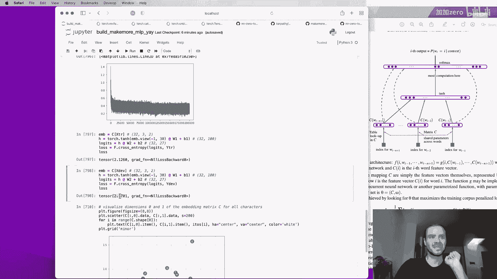
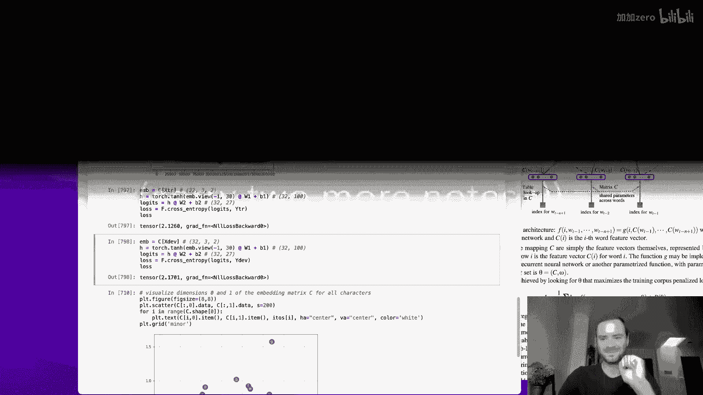
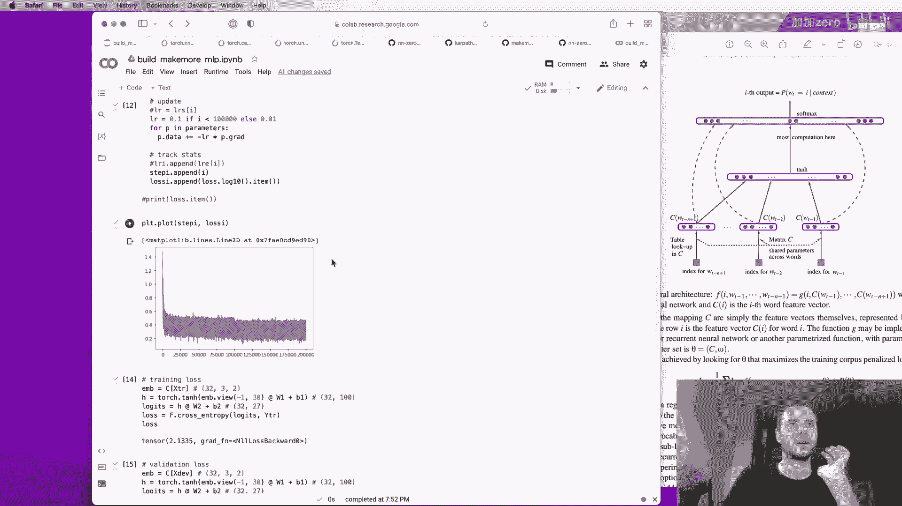

# 课程 P3：构建 makemore 第二部分：多层感知器 (MLP) 🧠

在本节课中，我们将学习如何构建一个多层感知器 (MLP) 模型，用于预测序列中的下一个字符。我们将从回顾上一节课的简单模型开始，然后深入探讨如何通过引入嵌入层和隐藏层来构建一个更强大、更灵活的神经网络模型。

## 概述

在上一节课中，我们实现了一个基于单个前序字符的简单模型（大词袋模型）。这种方法虽然易于理解，但预测效果不佳，因为它只考虑了一个字符的上下文。当我们尝试增加上下文长度时，可能的组合数量会呈指数级增长，导致模型参数过多且数据稀疏。

为了解决这个问题，本节课我们将转向多层感知器模型。我们将遵循一篇有影响力的论文中的方法，通过将字符嵌入到低维空间，并使用神经网络来捕捉字符间的复杂关系，从而实现对更长上下文的建模。

## 从简单模型到多层感知器

上一节我们介绍了基于计数的简单模型。本节中我们来看看如何构建一个更复杂的神经网络模型。

简单模型的问题在于其有限的上下文窗口。如果我们只考虑一个字符，模型无法捕捉到更长的依赖关系。考虑两个或三个字符的上下文会使状态空间急剧膨胀，导致模型难以训练。

因此，我们需要一种更高效的方法来建模长距离依赖关系。多层感知器通过引入可学习的嵌入和隐藏层来实现这一点。

## 论文方法解析

我们将参考一篇论文中提出的方法。该方法的核心思想是将每个字符（或单词）表示为一个低维的、可学习的特征向量（嵌入）。

**核心概念**：
*   **嵌入查找表 C**：一个矩阵，其行数等于词汇表大小，列数等于嵌入维度。例如，`C[5]` 返回第5个字符的嵌入向量。
*   **前向传播公式**：对于上下文中的每个字符索引 `i`，我们查找其嵌入 `e_i = C[i]`。将多个嵌入拼接后，输入到隐藏层：`h = tanh(concat(e_1, e_2, ..., e_n) * W1 + b1)`。最后，输出层计算逻辑值：`logits = h * W2 + b2`。

在训练开始时，这些嵌入向量是随机初始化的。通过反向传播训练神经网络，语义或功能相似的字符的嵌入向量会在空间中彼此靠近，这使得模型能够泛化到未见过的字符组合。

## 实现数据集构建

以下是构建训练数据集的步骤。我们需要将原始的名称列表转换为神经网络可以处理的输入（`x`）和标签（`y`）对。

我们首先定义块大小（`block_size`），即用于预测下一个字符的上下文长度。例如，如果 `block_size = 3`，则我们使用前3个字符来预测第4个字符。

```python
block_size = 3 # 上下文长度
X = [] # 输入
Y = [] # 标签

for word in words[:5]: # 先用少量单词示例
    context = [0] * block_size # 初始用0填充的上下文
    for ch in word + '.':
        ix = stoi[ch]
        X.append(context) # 当前上下文是输入
        Y.append(ix)      # 当前字符是标签
        # 滚动更新上下文窗口：移除最旧的字符，加入当前字符
        context = context[1:] + [ix]
```

这段代码为每个单词生成多个训练样本。`X` 中的每个元素是一个包含 `block_size` 个整数的列表，代表上下文。`Y` 中的每个元素是一个整数，代表序列中下一个字符的索引。

## 构建神经网络层

上一节我们准备好了数据。本节中我们来看看如何构建神经网络的各个层。

### 1. 嵌入层

嵌入层 `C` 是一个可学习的查找表。它将字符索引映射到一个低维的连续向量空间。

```python
# 假设有27个字符，我们将它们嵌入到2维空间
vocab_size = 27
embedding_dim = 2
C = torch.randn((vocab_size, embedding_dim), requires_grad=True)
```

对于一个整数索引 `5`，我们可以通过 `C[5]` 直接获取其嵌入向量。PyTorch 支持使用张量进行批量索引，因此对于整个输入批次 `X`（形状为 `[batch_size, block_size]`），我们可以用一行代码完成所有嵌入查找：`embeddings = C[X]`，结果形状为 `[batch_size, block_size, embedding_dim]`。

### 2. 隐藏层

隐藏层是一个全连接层，它对拼接后的嵌入向量进行非线性变换。

```python
# 输入维度：block_size * embedding_dim
# 隐藏层神经元数量：例如 100
input_dim = block_size * embedding_dim
hidden_dim = 100
W1 = torch.randn((input_dim, hidden_dim), requires_grad=True)
b1 = torch.randn(hidden_dim, requires_grad=True)
```

为了将形状为 `[batch_size, block_size, embedding_dim]` 的 `embeddings` 输入到线性层，我们需要将其重塑为 `[batch_size, input_dim]`。这可以通过 `view` 方法高效完成：

```python
emb_flat = embeddings.view(-1, input_dim)
```

### 3. 前向传播计算

现在我们可以计算隐藏层激活和输出层的逻辑值。

```python
# 计算隐藏层激活 (使用 tanh 非线性函数)
h = torch.tanh(emb_flat @ W1 + b1) # 形状: [batch_size, hidden_dim]

# 输出层（逻辑值层）
W2 = torch.randn((hidden_dim, vocab_size), requires_grad=True)
b2 = torch.randn(vocab_size, requires_grad=True)
logits = h @ W2 + b2 # 形状: [batch_size, vocab_size]
```

`logits` 是网络对下一个字符的原始预测分数。为了得到概率分布，我们需要对其应用 softmax 函数。

## 计算损失与训练

得到逻辑值后，我们需要计算损失以评估模型预测的好坏，并通过反向传播来更新参数。

### 计算损失

我们使用交叉熵损失函数。它直接接受逻辑值 `logits` 和真实标签 `Y`（一个包含正确字符索引的张量）。

```python
loss = F.cross_entropy(logits, Y)
```

使用 `F.cross_entropy` 比自己实现 softmax 再计算负对数似然更高效、数值更稳定。它会内部处理可能的数值溢出问题。

### 训练循环

训练过程包括前向传播、损失计算、反向传播和参数更新。

```python
learning_rate = 0.1
for step in range(10000):
    # 前向传播
    emb = C[X]
    h = torch.tanh(emb.view(-1, block_size*embedding_dim) @ W1 + b1)
    logits = h @ W2 + b2
    loss = F.cross_entropy(logits, Y)

    # 反向传播
    for p in [C, W1, b1, W2, b2]:
        p.grad = None
    loss.backward()

    # 参数更新（梯度下降）
    for p in [C, W1, b1, W2, b2]:
        p.data += -learning_rate * p.grad
```

在实际训练中，我们不会使用全部数据（22万个样本）计算梯度，而是采用小批量随机梯度下降，每次迭代只使用一小部分数据，这能极大提高训练速度。

## 模型评估与超参数调优

训练模型后，我们需要评估其性能，并调整超参数以获得更好的结果。

### 数据集划分

为了避免过拟合，我们将数据划分为三部分：
*   **训练集**（80%）：用于更新模型参数。
*   **验证集**（10%）：用于调整超参数（如网络大小、学习率）。
*   **测试集**（10%）：用于最终评估模型性能，应极少使用。

### 寻找合适的学习率

学习率是训练中最重要的超参数之一。一个寻找合适学习率范围的方法是进行学习率扫描。

```python
# 在一系列学习率上运行少量迭代，观察损失变化
lrs = torch.logspace(-3, 0, 1000) # 从 0.001 到 1.0
losses = []
for lr in lrs:
    # 用该学习率训练几步...
    # 记录最终损失
    losses.append(loss.item())
# 绘制 lr (x轴) 和 loss (y轴) 的关系图
```

理想的区域是损失快速下降但尚未剧烈震荡的部分。根据扫描结果，我们可以选择一个合理的学习率（例如 0.1）。

### 扩大模型容量

如果模型在训练集和验证集上的损失都很高且相近，说明模型可能“欠拟合”，即模型容量不足。我们可以通过以下方式增加容量：
*   增加嵌入维度（例如从 2 维增加到 10 维）。
*   增加隐藏层的神经元数量。
*   增加上下文长度（`block_size`）。

每次调整后，都应在验证集上评估性能，选择效果最好的配置。

## 从模型采样生成名称

训练好的模型可以用来生成新的名称。以下是采样过程：

```python
for _ in range(20):
    out = []
    context = [0] * block_size # 初始上下文
    while True:
        # 前向传播
        emb = C[torch.tensor([context])]
        h = torch.tanh(emb.view(1, -1) @ W1 + b1)
        logits = h @ W2 + b2
        probs = F.softmax(logits, dim=1)
        # 根据概率分布采样下一个字符索引
        ix = torch.multinomial(probs, num_samples=1).item()
        # 更新上下文
        context = context[1:] + [ix]
        out.append(ix)
        if ix == 0: # 遇到结束符 '.'
            break
    print(''.join(itos[i] for i in out))
```

## 总结





本节课中我们一起学习了如何构建一个用于字符级语言建模的多层感知器模型。

我们首先指出了简单计数模型的局限性，然后引入了通过嵌入层将离散字符映射到连续向量空间的思想。我们详细实现了神经网络的前向传播过程，包括嵌入查找、隐藏层变换和输出层计算。我们使用交叉熵损失函数和梯度下降法来训练模型，并讨论了如何通过划分数据集、寻找合适学习率以及调整模型容量（嵌入维度、隐藏层大小）来优化模型性能。最后，我们展示了如何从训练好的模型中采样生成新的名称。



通过本课的学习，你现在应该能够理解并实现一个基本的神经网络语言模型，并掌握对其进行分析和改进的基本方法。