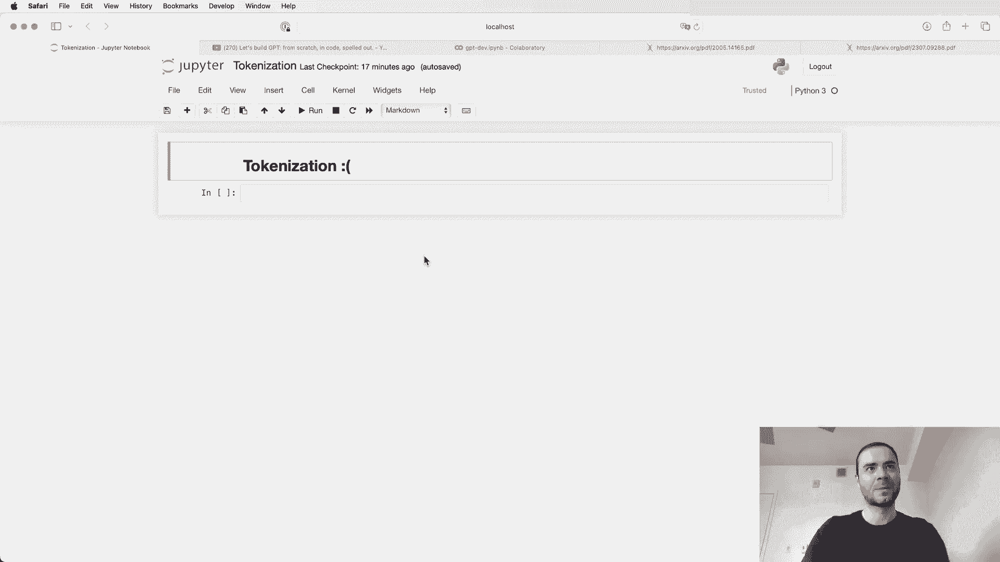
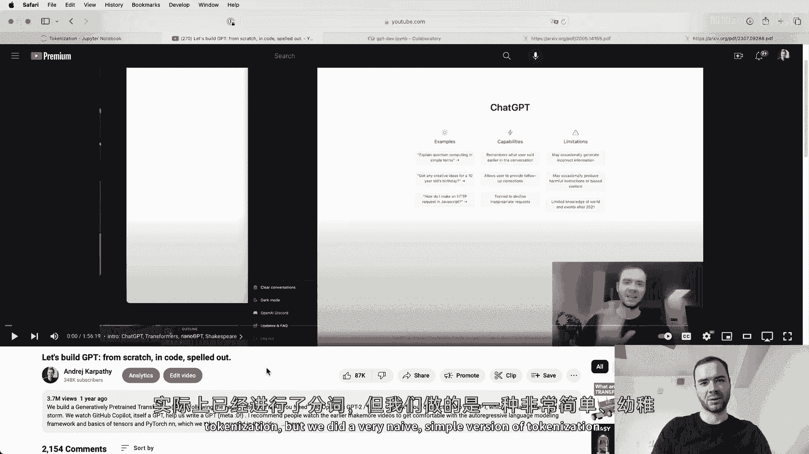
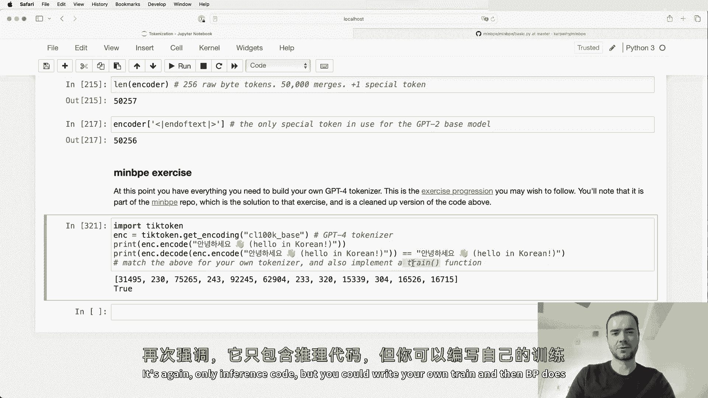
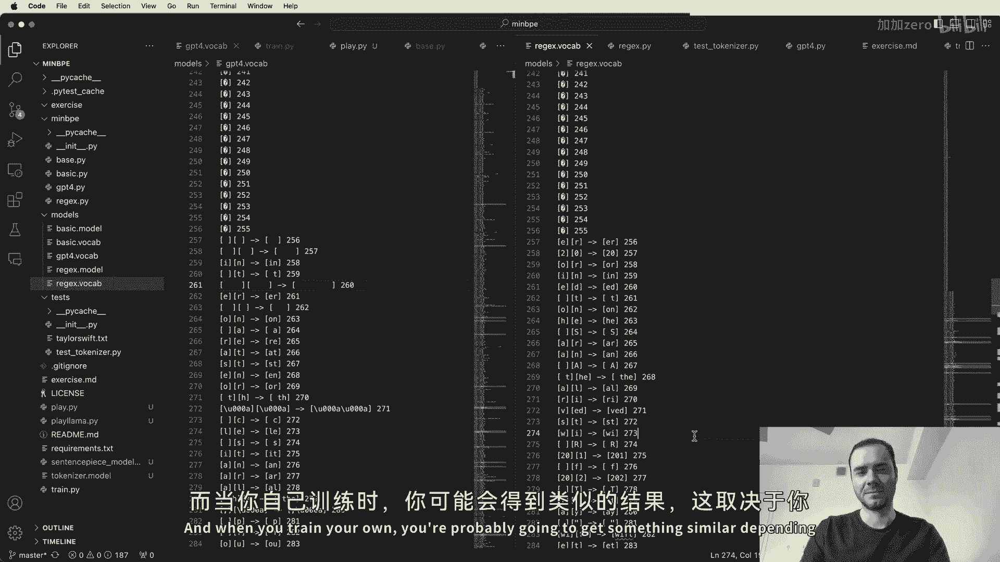
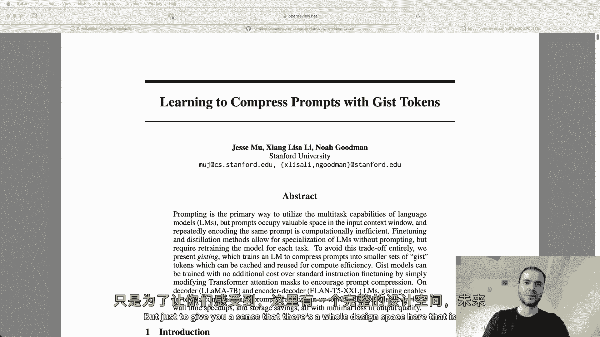
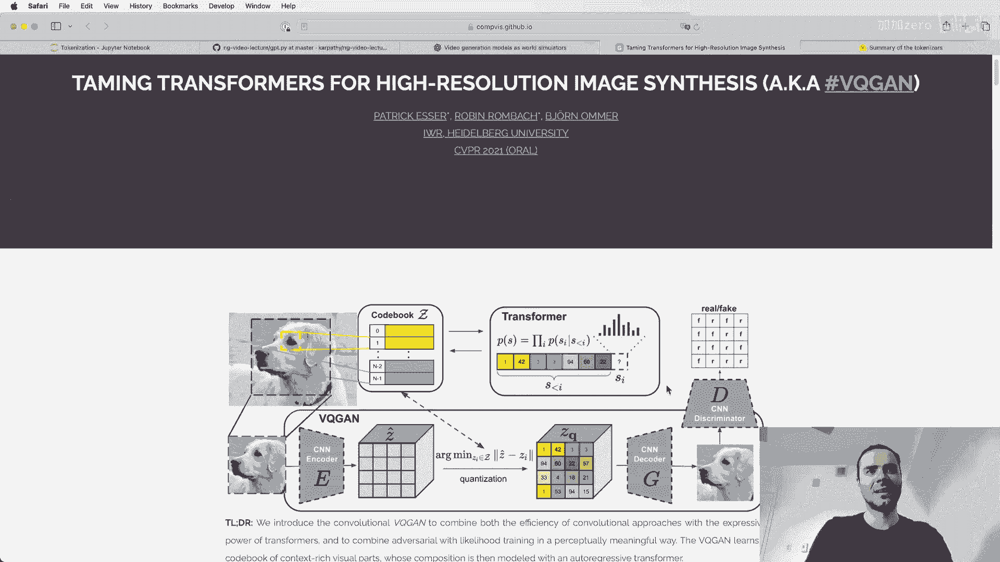
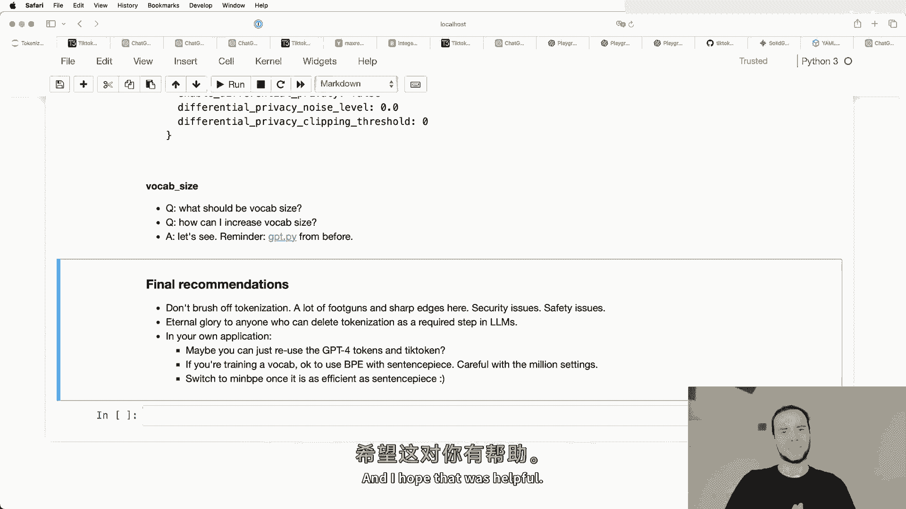
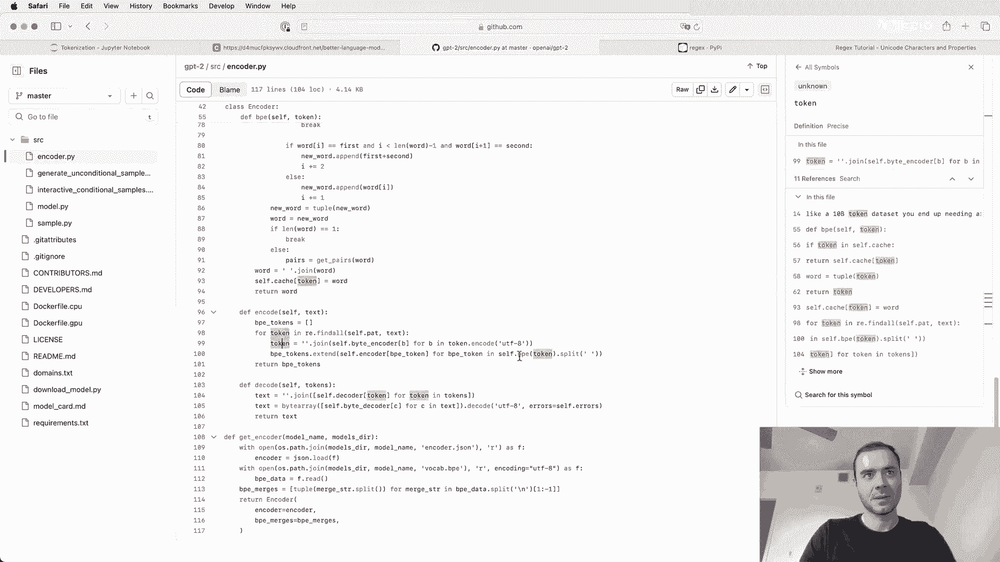

# 课程 P9：构建 GPT 分词器 🧩





在本节课中，我们将要学习大型语言模型（LLM）中一个关键但常被忽视的组件：分词器。我们将了解什么是分词、为什么它如此重要，并动手从零开始实现一个基于字节对编码（BPE）的分词器。通过本教程，你将理解分词如何影响模型的性能，并掌握构建和训练自定义分词器的核心技能。

## 概述：什么是分词？

分词是将文本字符串转换为一系列整数（称为“词元”或“标记”）的过程，这些整数是语言模型能够理解和处理的基本单位。在之前的课程《从头开始构建 GPT》中，我们使用了一个简单的字符级分词器。然而，实际应用中的 LLM（如 GPT 系列）使用更复杂的分词方案，例如字节对编码。

分词是许多 LLM 奇怪行为的根源，例如拼写困难、处理非英语语言效果差、算术能力不佳等。理解分词的工作原理对于深入理解 LLM 至关重要。

## 从字符级分词到子词分词

上一节我们介绍了简单的字符级分词。本节中我们来看看更先进的子词分词方法。

在字符级分词中，每个字符（如 `‘h’`, `‘i’`）被映射为一个独立的整数。虽然简单，但这会导致序列非常长，效率低下。例如，句子 “hello there” 会被编码为一系列代表每个字符的整数。

实际操作中，我们使用子词分词。它将常见的字符组合（如 `‘he’`, `‘ll’`, `‘o’`）合并为单独的标记，从而压缩序列长度。这通过字节对编码等算法实现。

## 字节对编码算法详解

字节对编码是一种数据压缩算法，后来被应用于 NLP 的分词任务。其核心思想是迭代地合并数据中最常见的字节对。

以下是 BPE 算法的基本步骤：

1.  将文本编码为 UTF-8 字节序列，初始词汇表为 256 个字节（0-255）。
2.  统计所有相邻字节对的出现频率。
3.  找到出现频率最高的字节对。
4.  为该字节对创建一个新的标记，并将其加入词汇表。
5.  在数据中，将所有出现的该字节对替换为这个新标记。
6.  重复步骤 2-5，直到达到预设的词汇表大小或没有更多可合并的对。

通过这种方式，我们从基础的字节开始，逐步构建出代表常见字符组合的标记，从而实现对文本的高效压缩。

## 实现 BPE 分词器

现在，让我们动手实现一个基础的 BPE 分词器。我们将编写训练函数来从数据中学习合并规则，并编写编码/解码函数来进行文本和标记之间的转换。

首先，我们需要一个函数来统计字节对的出现频率。

```python
def get_stats(ids):
    """
    统计给定整数ID列表中相邻元素对的出现次数。
    Args:
        ids: 整数列表，代表字节或标记。
    Returns:
        一个字典，键为(元素1, 元素2)的元组，值为出现次数。
    """
    counts = {}
    for pair in zip(ids, ids[1:]):
        counts[pair] = counts.get(pair, 0) + 1
    return counts
```

接下来，实现合并最高频字节对的函数。

```python
def merge(ids, pair, idx):
    """
    在ID序列中，用新ID替换所有出现的指定字节对。
    Args:
        ids: 整数列表。
        pair: 要合并的字节对，例如 (101, 32)。
        idx: 用于替换的新标记ID（例如 256）。
    Returns:
        合并后的新ID列表。
    """
    newids = []
    i = 0
    while i < len(ids):
        # 如果找到匹配的对，则进行合并
        if i < len(ids) - 1 and (ids[i], ids[i+1]) == pair:
            newids.append(idx)
            i += 2
        else:
            newids.append(ids[i])
            i += 1
    return newids
```

现在，我们可以编写训练循环，迭代地进行合并，构建词汇表。

```python
def train_bpe(text, vocab_size):
    """
    在文本上训练BPE分词器。
    Args:
        text: 训练文本字符串。
        vocab_size: 目标词汇表大小。
    Returns:
        merges: 记录合并规则的字典，键为合并后的ID，值为被合并的字节对。
        vocab: 从标记ID到字节表示的映射。
    """
    # 1. 将文本编码为UTF-8字节，并转换为整数列表
    tokens = list(text.encode(‘utf-8’))
    # 初始词汇表大小是256（0-255）
    num_merges = vocab_size - 256

    merges = {} # (id1, id2) -> new_id
    vocab = {idx: bytes([idx]) for idx in range(256)} # id -> bytes

    for i in range(num_merges):
        # 2. 统计当前标记序列中字节对的频率
        stats = get_stats(tokens)
        if not stats:
            break
        # 3. 找到最常出现的字节对
        top_pair = max(stats, key=stats.get)
        # 4. 分配新的ID（从256开始）
        idx = 256 + i
        # 5. 记录合并规则
        merges[top_pair] = idx
        # 6. 更新词汇表：新标记是子标记字节的拼接
        vocab[idx] = vocab[top_pair[0]] + vocab[top_pair[1]]
        # 7. 在序列中应用合并
        tokens = merge(tokens, top_pair, idx)

    return merges, vocab
```

## 编码与解码

训练好分词器（获得 `merges` 和 `vocab`）后，我们需要实现编码（文本 -> 标记）和解码（标记 -> 文本）功能。

解码相对简单：将每个标记 ID 通过 `vocab` 映射回其字节表示，然后连接并解码为字符串。

```python
def decode(ids, vocab):
    """
    将标记ID序列解码为文本字符串。
    Args:
        ids: 标记ID列表。
        vocab: 从标记ID到字节表示的映射。
    Returns:
        解码后的字符串。
    """
    # 将每个ID转换为其字节表示
    tokens_bytes = b’’.join(vocab[idx] for idx in ids)
    # 将字节解码为字符串，使用 ‘replace’ 处理无效字节
    text = tokens_bytes.decode(‘utf-8’, errors=‘replace’)
    return text
```





编码过程需要模拟训练时的合并过程，将文本转换为字节后，反复应用合并规则。

```python
def encode(text, merges):
    """
    将文本字符串编码为标记ID序列。
    Args:
        text: 输入文本。
        merges: 训练得到的合并规则字典。
    Returns:
        标记ID列表。
    """
    # 将文本转换为UTF-8字节，再转为整数列表
    tokens = list(text.encode(‘utf-8’))

    # 只要还有可合并的对，就持续合并
    while True:
        stats = get_stats(tokens)
        # 找到当前序列中优先级最高（在merges中索引最小）的可合并对
        pair_to_merge = None
        min_idx = float(‘inf’)
        for pair in stats:
            idx = merges.get(pair)
            if idx is not None and idx < min_idx:
                min_idx = idx
                pair_to_merge = pair
        # 如果没有可合并的对，结束循环
        if pair_to_merge is None:
            break
        # 应用合并
        idx = merges[pair_to_merge]
        tokens = merge(tokens, pair_to_merge, idx)
    return tokens
```

## 实际分词器的复杂性

我们上面实现的是一个基础的、纯算法的 BPE 分词器。在实际应用中（如 GPT-2, GPT-4），分词器引入了更多规则来处理复杂情况。

**预处理规则**：例如，GPT-2 使用一个复杂的正则表达式模式，在 BPE 合并之前先将文本分割成不同的块（如字母、数字、标点符号）。这确保了合并只发生在特定类别内部，防止了像将 “dog.” 和 “dog!” 合并成不同标记的情况，使分词更加一致。

**特殊标记**：除了从数据中学习到的标记，分词器还会引入特殊标记，如 `<|endoftext|>` 用于分隔文档，或在聊天模型中用于区分用户、助手和系统消息的标记。这些标记在词汇表中拥有独立的 ID，并在处理时被特殊对待。

**词汇表大小的影响**：词汇表大小是一个关键超参数。太小的词汇表（如字符级）会导致序列过长，消耗大量计算资源。太大的词汇表则会使每个标记出现的频率降低，可能导致嵌入训练不足，同时也会增加模型输出层的计算负担。目前先进的模型通常在数万到十万左右。





## 分词器与模型训练的关系

需要明确的是，分词器的训练与语言模型本身的训练是两个独立的阶段。

1.  **分词器训练**：使用一个代表性数据集（可能与模型训练集不同），运行 BPE 算法，确定合并规则和最终词汇表。这个过程产生 `merges` 和 `vocab` 两个核心组件。
2.  **模型训练**：使用训练好的分词器，将海量的模型训练文本全部转换为标记序列。这些标记序列被保存下来，语言模型在此标记序列上进行训练，学习预测下一个标记。

这种分离意味着我们可以针对不同的目标（如多语言支持、代码处理）优化分词器，而不必重新训练整个大模型。

## 总结

本节课中我们一起学习了构建 GPT 分词器的核心知识：

*   **分词的重要性**：分词是文本进入 LLM 的桥梁，其设计直接影响模型处理各种任务（拼写、多语言、算术、代码）的能力。
*   **BPE 算法原理**：通过迭代合并最常见字节对来构建词汇表，实现从字符到子词的压缩表示。
*   **分词器实现**：我们实现了 `train_bpe`、`encode` 和 `decode` 等核心函数，构建了一个可工作的基础分词器。
*   **实际考量**：了解了实际分词器（如 OpenAI 的 tiktoken）引入的预处理规则、特殊标记等复杂性，以及词汇表大小等设计选择。
*   **训练流程**：明确了分词器训练与语言模型训练是两个独立且先后进行的阶段。






分词虽然是一个预处理步骤，但它深远地影响着语言模型的行为和能力。希望本教程能帮助你揭开分词的神秘面纱，并为深入理解和使用大型语言模型打下坚实基础。