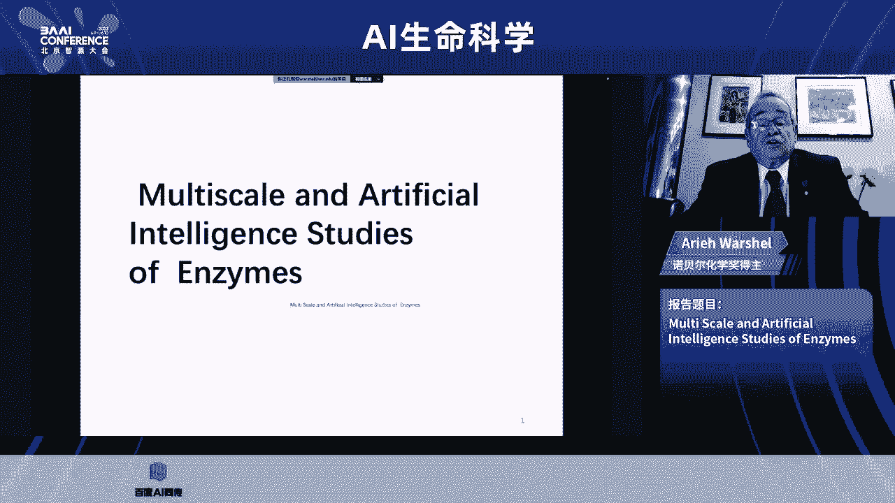
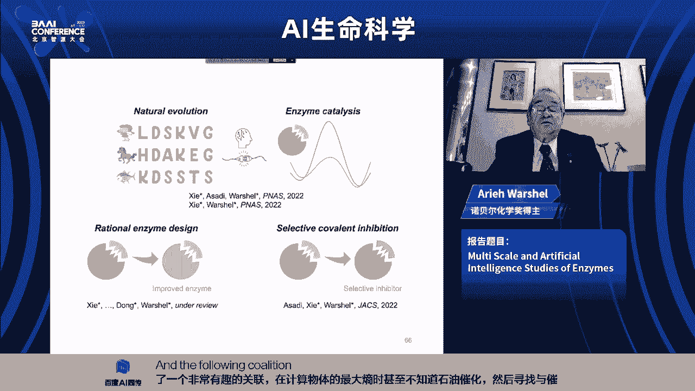
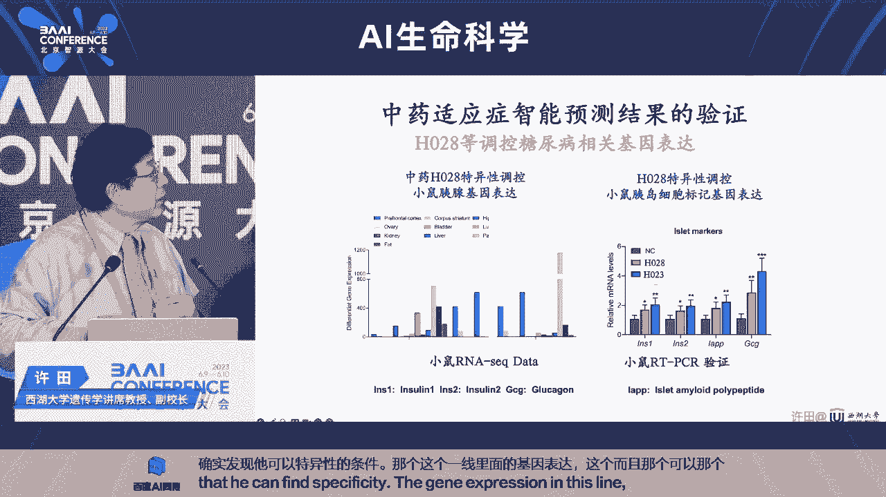

# AI生命科学前沿进展与挑战 🧬🤖

## 课程概述
在本节课中，我们将学习人工智能在生命科学领域，特别是酶催化、蛋白质设计、药物发现及中医药现代化等方向的前沿应用与核心挑战。课程内容基于2023北京智源大会的专题报告整理，旨在为初学者提供一个清晰、全面的入门视角。



---

## 第一节：多尺度建模与人工智能在酶研究中的应用 🧪

现代生命科学始于达尔文的进化论和孟德尔的遗传定律。自70年前DNA双螺旋结构发现以来，生命科学迅速发展，这主要得益于结构生物学、分子生物学、基因组学和计算机模拟等技术的出现。这些工具使生命科学从数据匮乏的定性科学，转变为数据丰富的定量信息科学。近年来，人工智能和机器学习的进步为生命科学带来了革命性工具，其标志性事件是AlphaFold2成功从氨基酸序列预测蛋白质结构，并引发了一系列后续发展。

上一节我们介绍了AI生命科学的宏观背景，本节中我们来看看如何利用多尺度建模和人工智能研究酶。

### 酶催化与计算建模
酶是卓越的催化剂，有时能将反应速度加速至水溶液中相应反应的10^20倍。它们主要通过降低反应的活化能垒来实现这一点。在分子水平上理解酶催化需要计算机模拟，因为这是一个涉及大量原子的复杂系统。

主要的研究方法是结合量子力学和分子力学的QM/MM方法。其中，化学活性区域用量子化学描述，系统其余部分用分子力学描述。我们偏好的方法是所谓的“价键”方法，它将化学反应描述为在不同“价键态”之间的移动，这些态通过一个拟合实验数据的混合项进行混合。然后，通过改变环境与这两个价键态的相互作用，将模型应用到酶中。

以下是利用QM/MM方法模拟酶催化反应的一个简化示例：
```python
# 伪代码示例：QM/MM模拟框架
initialize_system(protein_structure, substrate)
setup_qm_region(active_site_atoms)
setup_mm_region(rest_of_system)
for each simulation_step:
    calculate_qm_energies()
    calculate_mm_energies()
    propagate_dynamics()
analyze_reaction_pathway()
```

通过这种方法，我们研究了无数酶系统，并得出结论：在大多数情况下，催化的起源在于对过渡态的静电稳定化作用，这与溶剂重组能的降低有关。在好的酶中，环境已经部分预先组织到正确的方向，因此不需要支付重组能。

### 从理解到设计：酶设计的挑战与尝试
我们不仅希望理解生物化学，更希望利用知识来设计酶。随机突变探索所有序列空间（约20^300种可能性）是不可行的。目前主要有两种途径：
1.  **定向进化**：模仿自然进化，随机突变并筛选每一代中更快的变体。
2.  **理性设计**：基于物理原理预测突变效果。

使用基于物理原理的方法（如自由能微扰）预测单点突变效果相对较好，但在涉及多个残基同时改变的复杂设计中，我们遇到了瓶颈。因此，我们转向大规模计算筛选，生成许多突变体，观察各自的活化能垒。虽然最佳预测的突变体排名靠前，但效果仍不理想。

### 引入人工智能辅助酶设计
由于理性设计遇到困难，我们尝试从人工智能中寻求帮助。我们的方法不是直接关注催化数据（因为已知数据少），而是关注通过最大熵方法评估的整个蛋白质的进化约束（与折叠、稳定性等相关）。我们发现了酶的最大熵能量与其催化效率（如k_cat）之间存在显著的相关性。

以下是核心发现：
*   **对于天然酶**：酶越稳定（最大熵能量越低），其催化活性往往越高。
*   **对于人工设计的酶（如坎普林酶）**：关系相反，稳定性较低的变体催化更快。这表明在活性位点附近，提高催化可能需要牺牲一些稳定性，即存在“催化-稳定性”的权衡景观。

基于最大熵与催化活性的相关性，我们可以筛选具有更高最大熵的序列，以期获得更高催化活性的突变体。我们在荧光素酶等系统中验证了此方法，成功预测出比野生型更高效、更稳定的突变体。

### 共价药物设计与选择性挑战
最后一个案例是共价激酶抑制剂的设计，核心挑战是选择性。我们通过QM/MM计算分析了不同激酶中抑制剂共价键形成的能垒，模拟了抑制时间进程，从而更好地理解了选择性控制的物理因素，并可能指导如何改进它。

**本节过渡**：以上我们探讨了如何结合物理模型与AI来理解和设计酶。接下来，我们将视角转向更广泛的复杂分子系统，看看如何融合基于物理和基于数据的模拟方法。



---

## 第二节：复杂分子系统研究：物理与数据模拟方法的结合 ⚛️📊

在生物医药中，分子模拟的应用远不止简单的分子对接。我们关心小分子结合后如何在信号通路中传递信息，这涉及蛋白-蛋白、蛋白-DNA等复杂相互作用。模拟细胞在分子水平已极具挑战。

### 计算模拟的本质与多尺度挑战
计算机模拟在分子体系中本质上是进行数学映射。我们可以：
*   **微分算符**：基于牛顿力学或量子力学演化体系动力学。
*   **积分算符**：从原子坐标分布积分获得热力学性质，如结合自由能。
*   **微分-积分算符**：描述随机过程。

基于物理原理的模型可解释性好，但计算复杂、速度慢。基于数据（如神经网络）的模型可以学习映射关系，加速推理，但需要数据且可解释性差。两者各有优劣。

### 统一框架：SPONGE平台
我们致力于构建一个统一的深度学习与分子模拟软件平台——SPONGE。其核心优势在于，分子力学计算与深度学习模型在数学上同构，因此可在同一框架下实现。这使得：
*   深度学习得到的信息（如势能面）可直接用于分子动力学模拟。
*   分子动力学模拟的结果可反向传播给深度学习模型进行优化。

这实现了从“序列->结构->动力学->功能”的端到端闭环研究。

### 蛋白质结构预测的突破与延伸
AlphaFold2的成功是深度学习与基础理论（序列决定结构、共进化信息）的共同胜利。我们利用国产硬件（华为昇腾）和框架（MindSpore）独立复现并训练了AlphaFold2模型，性能相当。

为了突破AlphaFold2的局限（如需要大量同源序列），我们开发了双向映射模型，不仅能从序列预测结构，还能从结构生成可能序列，减少了对同源序列的依赖，大大加速了预测。

对于实验数据不足的蛋白，我们开发了新方法，将核磁共振等实验数据作为约束，整合到AI预测模型中，迭代地进行谱峰指认和结构确定，将数月甚至一年的解结构时间缩短到数小时，且精度更高。

### 分子生成与药物设计
在药物发现中，我们采用混合策略：
*   **结合位点预测**：数据相对充足，使用深度学习模型（如EquiBind），可在0.3秒内预测一个小分子的可能结合姿态，大幅提升虚拟筛选效率。
*   **结合强度预测**：数据稀缺，使用基于物理的自由能微扰等方法。

我们还开发了基于扩散模型的分子生成方法，能够根据特定条件（如原子间距、环类型）生成分子，用于抗体设计等。

**本节过渡**：我们看到了统一计算框架的强大潜力。接下来，我们将聚焦于AI在蛋白质建模中的三个基础性问题。

---

## 第三节：蛋白质建模的AI方法：表征、预测与设计 🧬

蛋白质是细胞功能的主要执行者。理解蛋白质功能对生物医药、工业酶设计等领域至关重要。AI方法可以从数据中学习蛋白质的“序列-结构-功能”关系。

### 1. 蛋白质特征表示学习
蛋白质的一级序列是字符串，早期工作借鉴自然语言处理，训练蛋白质语言模型。但蛋白质功能由结构决定，因此从结构学习特征应更有效。

我们提出了几何深度学习模型**GearNet**：
*   **输入**：蛋白质三维结构。
*   **构图**：以氨基酸为节点，基于序列邻接和三维空间距离构造边。
*   **编码**：使用图神经网络进行信息传递。为了更好利用三维几何信息，我们提出了边级信息传递，能捕捉空间角度信息。

我们利用对比学习在大量无标签结构数据上预训练该编码器。方法是：从同一蛋白结构中提取基于序列的模体和基于空间的模体作为正样本对，不同蛋白的模体作为负样本对。预训练后的模型在下游功能预测任务上表现显著提升，超越了仅从序列学习的模型。

我们还探索了多模态学习，联合训练蛋白质序列和其文本功能描述，将两者映射到同一语义空间。这使得模型可以进行零样本学习，即对没有功能注释的新蛋白，也能通过文本-蛋白的语义关联预测其功能。

### 2. 蛋白质结构预测
AlphaFold2主要预测蛋白质主链。我们关注**侧链预测**，因为侧链在分子相互作用中至关重要。

传统方法基于物理能量函数进行采样，速度慢且不准确。我们提出了基于扩散模型的侧链预测方法**DiffPack**：
*   **关键思想**：将侧链预测建模为在扭转角空间（而非三维坐标空间）的扩散过程。扩散模型本质上是学习一个能量场。
*   **有序生成**：侧链的四个扭转角（χ1, χ2, χ3, χ4）有强依赖关系。我们采用自回归方式，依次预测每个扭转角，类似语言模型预测下一个词。

该方法在标准测试集上，无论是基于真实主链还是预测主链，其侧链预测精度都显著优于传统物理方法和之前的深度学习方法，且模型参数更少。

### 3. 蛋白质从头设计
蛋白质从头设计的目标是创造具有特定功能的全新蛋白质序列和结构。目前主流方法（如RFdiffusion）是两阶段的：先设计结合剂的结构，再为这个结构设计序列。

我们提出了**Fold**模型，能够**同时**对蛋白质的结构和序列进行联合扩散和优化：
*   **过程**：模型输入当前（噪声）的序列和结构，以及靶点信息。在每一步，模型学习一个力场，同时对序列和结构进行去噪优化。经过多次迭代，模型收敛到一个稳定的序列-结构对。
*   **应用**：我们成功将其应用于抗体CDR区设计、蛋白质环设计等任务，能够生成结构接近天然但序列多样化的设计。

为了促进AI社区进入该领域，我们构建了开源框架**TorchProtein**，提供了标准数据集、任务和基线模型。

**本节过渡**：AI正在重塑蛋白质研究的方方面面。最后，我们将目光转向一个拥有悠久历史但亟待现代化的领域——中医药，看看AI如何助力其创新发展。

---

## 第四节：人工智能与生物医药驱动中医药现代化 🌿💊

中华民族几千年的中医药实践积累了丰富资源：上万种药材、百万首方剂。但现状是，仅614种药材和1607种方剂被药典收录，这座宝库远未充分发掘。

### 挑战一：信息标准化与数字化
中医药古籍浩如烟海（约4.5亿字）。首要任务是将信息数字化、标准化。我们借鉴西药体系，为每一味中药建立三层命名系统：
1.  **常用名**（如麻黄）。
2.  **学名**（基于物种拉丁学名、用药部位、炮制方法的精确描述）。
3.  **唯一标识码**。
我们正在构建“神农Alpha”系统，即中医药文献智能信息系统，以实现信息的标准化与自动翻译。

### 挑战二：质量控制与机制研究
中药成分复杂，质量控制难。我们采用“人工智能+基因组学”的方法：
*   **思路**：绘制疾病的基因表达特征谱，以及药物（包括中药）改变基因表达的特征谱。如果某药能逆转疾病引起的基因表达变化，则可能治疗该病。
*   **应用**：我们曾用此方法成功预测老药新用，治疗癌症和渐冻症。将此方法用于中药，可通过中药的整体基因表达效应来研究其药效和质量控制，无需预先知道具体成分。



### 挑战三：毒性预测与安全用药
中药毒性是制约其广泛应用和走向世界的关键。我们训练图模型来预测中药毒性。令人惊讶的是，模型预测出一种传统认为无毒、用于消炎止咳的药材具有肝毒性，后续动物实验证实了这一点。这凸显了AI在安全性再评价中的价值。

### 挑战四：生产污染与资源可持续
中药材栽培面临农药和重金属污染问题。我们利用合成生物学技术应对。例如，与茶农合作，通过基因编辑技术培育不开花结果的茶树，可节省40%化肥。我们在实验室克隆龙井茶，并尝试导入香味基因、保健成分基因，甚至七彩荧光基因，旨在实现标准化、无污染、高附加值生产。

### 从药材到分子：发现有效成分
从药材（如青蒿）到单一有效成分（如青蒿素）的发现和生产通常需要数十年。我们创立了“双深科技”，利用人工智能+代谢组学分析海量化合物数据，最快可在3个月内锁定中药中的有效分子。找到分子后，再利用合成生物学，解析并移植植物体内的生物合成途径到微生物中发酵生产，已成功实现红景天苷的商业化生产。

### 案例：糖尿病中药的现代化研究
1.  **预测**：用“神农Beta”模型预测某中药可治疗糖尿病。
2.  **验证**：动物实验证实其可调节胰岛基因表达，降低血糖，甚至对脂肪肝有疗效。
3.  **找分子**：利用上述技术，成功找到了其有效分子，并解析了其作用机制和生物合成路径。
4.  **优化**：未来可基于找到的分子和作用靶点，用AI设计更优的衍生物。

### 新靶点发现：从遗传学到人工智能
我们此前创立“药物牧场”，利用转座子基因突变系统在疾病小鼠模型中大规模筛选新药靶，发现了20个全新靶点。针对第一个新靶点LPAR5，我们采用“AlphaGo模式”训练AI辅助药物化学家设计分子，成功研发出新药，并已进入全球多中心临床试验。这是中国首次在全球范围内获得全新靶点药物专利。

**本节过渡**：中医药的现代化是一个系统工程，AI在其中扮演了加速器和连接器的角色。现在，让我们进入讨论环节，深入探讨一些共性问题。

---

## 第五节：讨论与展望 💬

### 议题一：实验数据与AI模型的闭环
*   **问题**：AI模型（如AlphaFold2）在数据不足时（如MSA同源序列少）预测不准。如何整合少量实验数据（如核磁共振约束）来提升预测？
*   **观点**：可以将实验数据作为物理约束整合到AI预测模型中，进行迭代优化。例如，将核磁共振的NOE约束加入，模型在优化结构的同时，也能反向帮助更准确地指认谱峰，形成“实验-计算”闭环，极大缩短解结构时间，并能处理多构象问题。

### 议题二：动态结构与功能
*   **问题**：晶体结构是静态的，但蛋白质在溶液中有动态变化，这对理解功能和药物设计很重要。AI如何帮助？
*   **观点**：上述整合实验数据的方法本身就支持解析多构象及其种群分布。对于RNA等更动态的分子，其结构预测更难，但序列决定相互作用的模式可能相对简单，AI预测蛋白-RNA相互作用已能达到较高精度，这为新药研发（如靶向RNA）提供了可能。

### 议题三：生成式AI vs. 筛选式AI in 蛋白质设计
*   **问题**：对于酶或抗体设计，生成式AI（从头设计）相比定向进化（筛选式）优势何在？
*   **观点**：生成式AI理论上能探索更大的序列-结构空间，有望发现超越自然进化的设计。但目前完全依赖AI从头设计高活性酶或抗体仍不成熟。更现实的路径是“AI生成初筛 + 实验验证筛选”相结合，利用AI缩小搜索范围，用高通量实验进行验证和优化。

### 议题四：多组学数据整合与计算挑战
*   **问题**：整合基因组、转录组、表观基因组等多组学数据能提升模型性能，但计算复杂度也大增。其收益和挑战如何？
*   **观点**：评估发现，除转录组外，开放染色质（ATAC-seq）数据对预测准确性贡献最大（约占40%），甲基化数据贡献约20%。多组学整合是理解基因调控网络的必然方向。虽然数据量巨大（单细胞数据已达亿级），但预计不需要达到GPT级别的参数量，可能在百万到十亿参数级别即可有效建模。

### 议题五：AI在中医药复杂体系中的应用
*   **问题**：中药复方“君臣佐使”理论如何用现代科学验证？中药出海面临化学成分和作用机制不明确的监管挑战。
*   **观点**：复方可能通过多种低浓度有效成分的叠加效应或协同作用于多靶点通路起效。现代化的破局之路在于：利用AI和组学技术从复方中找出有效成分群，明确其各自的靶点和机制，提高单一成分的浓度或优化组合，从而满足现代药监的明确性要求。同时，利用合成生物学实现标准化、无污染生产。

### 议题六：AI的极限与生命系统的复杂性
*   **问题**：生命系统极其复杂，存在大量异质性和难以量化的特征。当前的AI模型（包括多模态大模型）能否真正为生命系统建模？
*   **观点**：
    *   **许田**：交叉学科人才是关键。当前AI已很有用，但完全描述生物体还不行，未来难料。
    *   **高歌**：AI在快速演进。单细胞数据从10个到亿级的增长，带来了新的可能性。AI通过“升维”和“降维”帮助处理高维、非连通的生物数据，是通向理解复杂系统的有力途径，而非终极解决方案。
    *   **唐建**：核心还是数据问题。只要数据充足，深度学习能解决大部分问题。未来取决于能否获得更多体内或类器官等更接近真实生理环境的数据。
    *   **高一鹏**：AI是探测和理解复杂世界的工具。它将复杂数据映射到可计算空间，允许我们用物理模型和科学假设对其进行扰动和检验，从而抽提知识。

**共识**：人工智能在硬件（突破物理层限制）和软件（学习与记忆能力）上都展现出超越生物极限的潜力。它并非万能，但正以前所未有的速度和方式变革生命科学的研究范式。未来的突破有赖于生命科学家与AI专家的深度融合，以及“干湿实验”闭环的不断迭代。

---

## 课程总结
本节课中，我们一起学习了AI在生命科学多个核心领域的应用：
1.  **酶学**：结合QM/MM多尺度建模与AI（如最大熵方法），不仅能深入理解催化机理，还能辅助设计更高效的酶。
2.  **计算框架**：构建统一的物理-数据融合计算平台（如SPONGE），是实现从序列到