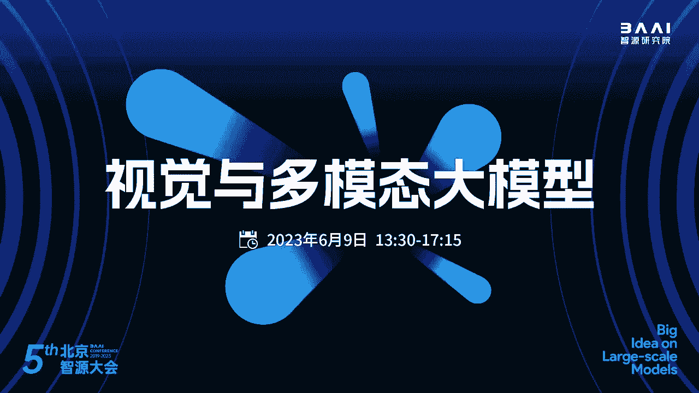
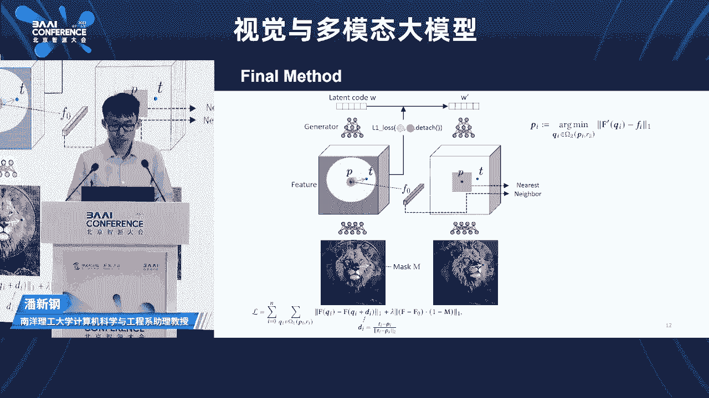
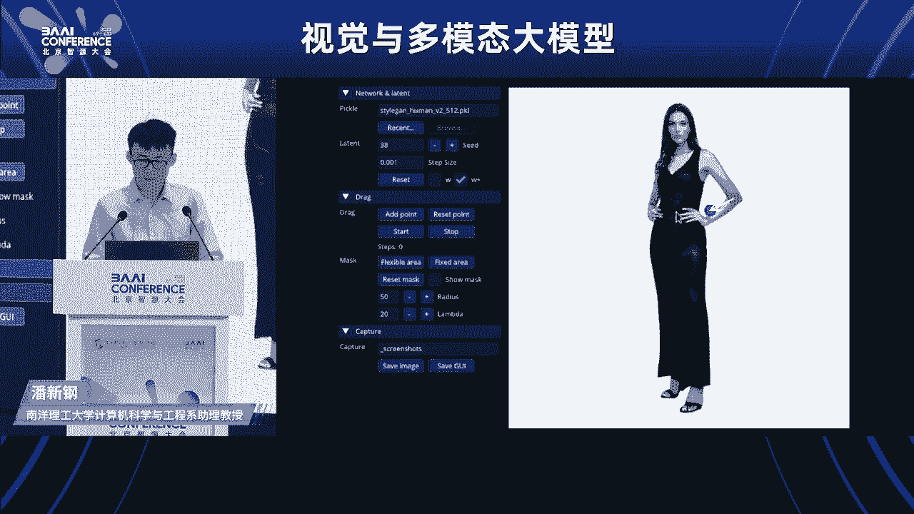
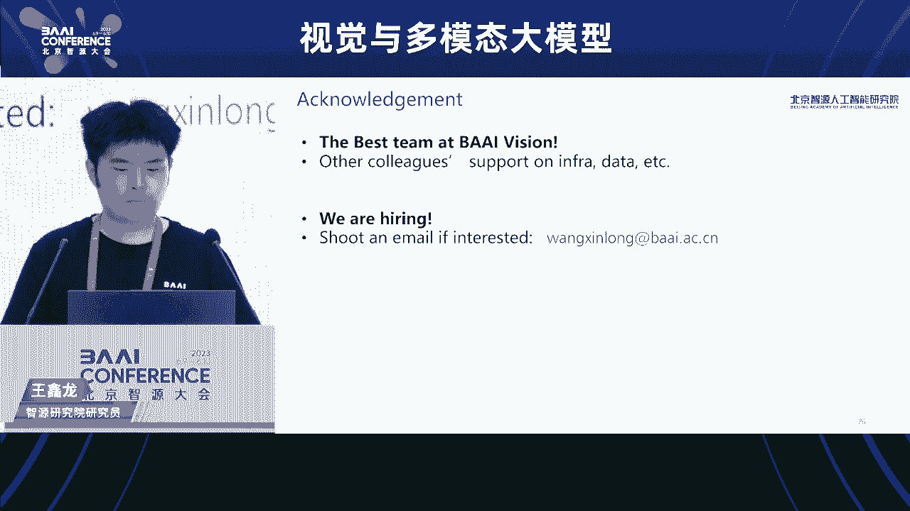
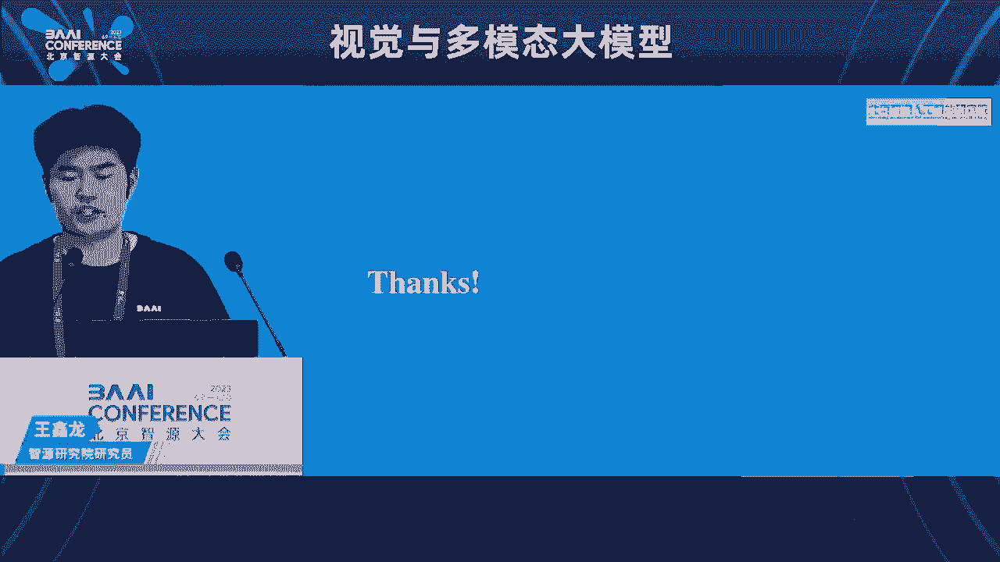
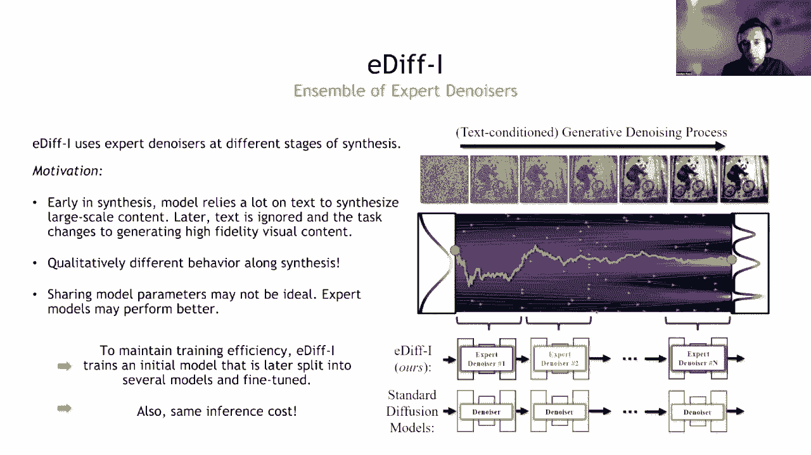
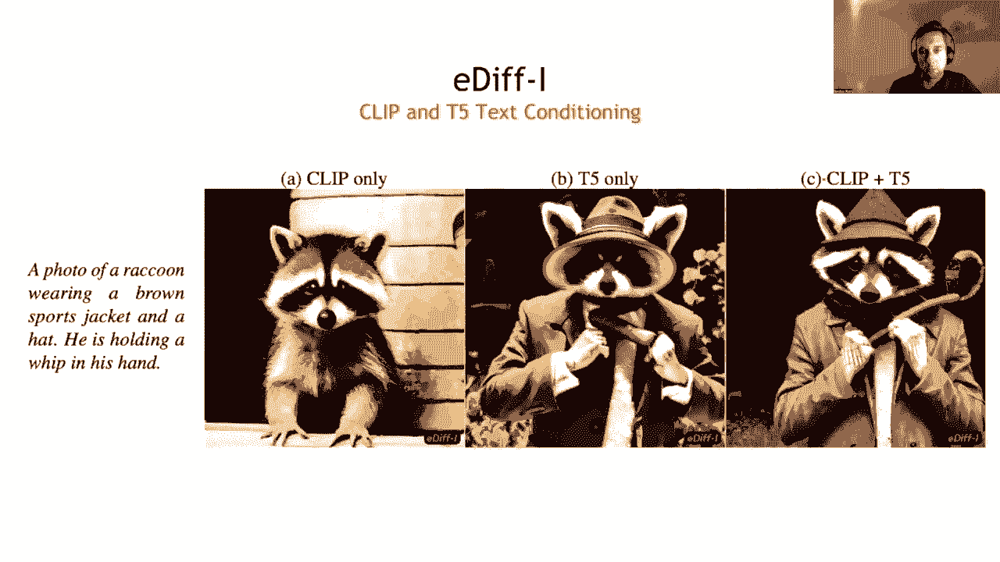
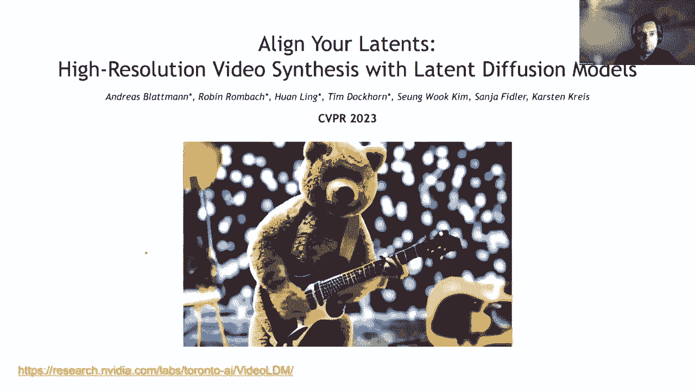
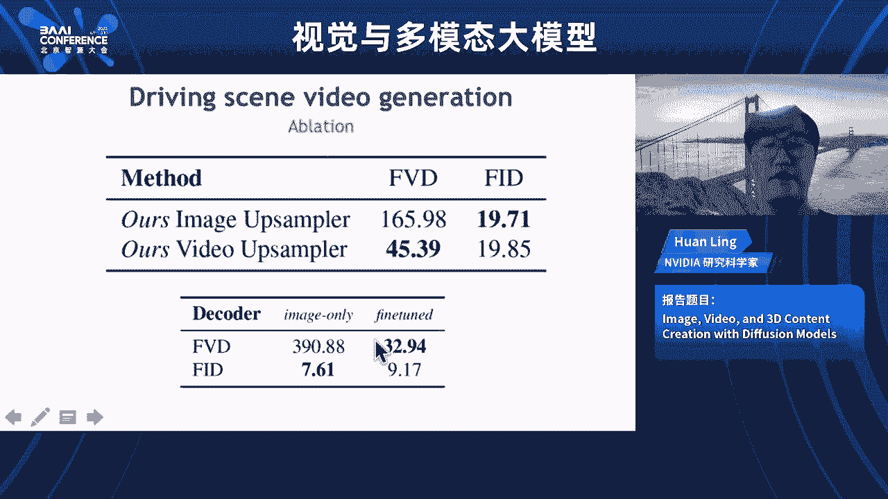

# 视觉与多模态大模型前沿进展 🚀

## 课程概述
在本节课中，我们将学习2023年北京智源大会上关于视觉与多模态大模型的最新研究成果。课程内容涵盖基于关键点的图像编辑、三维内容生成、通用视觉模型探索以及扩散模型在图像、视频和三维生成中的应用。我们将深入探讨这些技术的核心思想、实现方法以及未来发展方向。

---

## 第一节：基于关键点的生成式图像编辑 🎨

在上一节概述中，我们了解了本课程的整体框架。本节中，我们来看看如何实现一种直观的图像编辑方式——通过拖拽关键点来编辑生成式对抗网络（GAN）生成的图像。

图像编辑是计算机视觉和图形学中的经典问题。近年来，生成模型的发展催生了一系列图像编辑方法。然而，对于图像空间属性（如轮廓、物体位置、姿态、大小）的编辑，现有方法在灵活性、准确性和通用性方面存在局限。

观察人与物理世界的交互，最直接的方式是直接移动物体的位置。皮影戏的操纵者通过控制关键点就能完全控制图像中物体的动作。受此启发，我们探索能否像控制皮影戏一样控制图片。

理想的空间属性编辑需要符合物体自身结构，并能想象出被遮挡的内容。生成模型，特别是生成对抗网络（GAN），因其对物体结构的感知和生成新内容的能力，成为实现这一目标的自然选择。

GAN在训练完成后，将一个符合高斯分布的潜向量映射到一张高维图片。通过扰动潜向量，可以实现对图像内容的改变。本工作的目标是将这种拖拽式编辑基于GAN来实现。

为了实现基于关键点的拖拽编辑，核心问题是如何改变GAN的潜向量来实现所需的关键点变化。我们设计了一个迭代式的算法框架。

以下是该框架的两个关键子问题：

1.  **运动监督**：为了将红色抓取点推向蓝色目标点，需要施加一个力。这个力可以形式化为一个运动监督损失函数，用于优化GAN的潜向量。
    *   **公式**：`L_motion = ||F_blue - F_red.detach()||`，其中 `F` 代表特征图（feature map）上对应位置的特征值。
2.  **点追踪**：优化一步得到新的潜向量和图片后，需要更新抓取点的位置，使其跟随图像内容移动。这通过特征匹配来实现，即在新的特征图中寻找与初始抓取点特征最接近的像素位置。
    *   **方法**：最近邻搜索（Nearest Neighbor Search）。

通过迭代进行运动监督和点追踪，直到所有抓取点都移动到对应的目标点，就完成了图像编辑。

该方法可以实现多种空间属性编辑，例如改变物体姿态、形状、表情等，并且编辑结果符合物体自身结构，能生成被遮挡部分。

---

## 第二节：机器学习驱动的三维内容生成 🧊

上一节我们介绍了基于GAN的交互式图像编辑。本节中，我们来看看如何利用机器学习，特别是大模型，来生成高质量的三维内容。

人类生活在三维世界，创建三维数字世界有助于我们更好地理解现实世界，并解决许多实际问题。三维内容生成是构建虚拟世界的核心。

当前三维内容创建主要依赖人工，流程复杂且门槛高，难以规模化。与此同时，机器学习在语言和二维图像生成领域取得了迅猛发展。然而，在三维内容生成领域，尽管有进展，但在几何和纹理质量上仍远不如二维生成。

我们的研究目标是利用机器学习生成高质量的三维形状，并使其能够直接应用于图形学软件。这面临两大挑战：三维表示和算法设计。

一个优秀的三维表示需要既适合机器学习，又适合下游应用，并能支持不同的拓扑结构和纹理材质。我们提出了 **DM** 方法，它是一种可微分的等值面提取技术，能够将隐式函数表示（非常适合机器学习）可微地转化为显式的网格（非常适合图形学应用）。

在算法层面，我们探索了如何高效地训练三维生成模型。我们提出了 **GET3D** 模型，其核心思想是将二维GAN的成功经验带到三维。我们使用可微分渲染将生成的三维形状渲染成二维图片，然后在二维空间利用成熟的二维判别器进行监督，并通过渲染过程将梯度回传到三维生成器。

为了超越训练数据集的限制，并利用更丰富的二维数据，我们提出了 **Magic3D**。这是一个高分辨率文本到三维的生成框架。其核心思想是从强大的二维扩散模型中提取知识，并蒸馏到三维表示中。我们采用了两阶段流程：先用低分辨率扩散模型得到粗略几何，再提取网格并用高分辨率扩散模型进行细化，从而生成高质量、高细节的三维模型。

这些工作展示了利用二维先验和可微分渲染等技术，在三维生成领域实现高质量和可控内容创作的潜力。

---

## 第三节：通用视觉模型初探 👁️

上一节我们探讨了三维内容的生成。本节中，我们将视角转回更通用的视觉智能，探讨如何学习更大、更强的视觉表征，以及如何构建能够解决多种任务的通用视觉模型。

我们的研究分为两部分：学习通用的视觉表征和构建视觉通才模型。

对于视觉表征，我们提出了 **EVA** 模型。其核心思想是结合CLIP模型的高层语义和MAE掩码图像建模的结构化空间信息。我们通过重建被掩码部分的CLIP特征来预训练模型。重要的是，我们将模型规模扩大到10亿参数，并发现EVA作为图像编码器的初始化，能够显著稳定并提升CLIP模型的训练。基于此，我们进一步提出了 **EVA-CLIP**，通过一系列技巧将模型扩展到50亿参数，并在ImageNet零样本分类上取得了领先性能。

对于视觉通才模型，我们希望构建一个像GPT-3那样能够通过上下文学习解决各种视觉任务的模型。我们提出了 **Painter**。其关键创新是将所有视觉任务（如分割、深度估计、关键点检测）的输出都统一为图像形式。然后，我们使用简单的掩码图像建模方法，在一个统一的Transformer架构上训练模型。训练完成后，模型具备了上下文视觉学习的能力，只需提供几个输入-输出对作为示例，就能自动完成对应的新任务。

基于Painter的框架，我们进一步提出了 **SegGPT**，旨在实现“分割一切”。我们将各种分割数据（语义、实例、全景分割等）统一为上下文示例进行训练。训练后的模型能够根据给定的示例（例如，一张图片和其分割掩码），对新的图像执行相同语义的分割，甚至能分割训练中从未见过的概念（如“影子”、“损失函数曲线”）。

最后，我们介绍了正在进行的 **InterLM** 工作，这是一个能够接受多模态输入并产生多模态输出的大模型。它通过统一的序列形式处理图像、文本、交错图文和视频数据，并进行多模态上下文学习，从而具备感知、推理和生成多种模态数据的能力。

我们的研究思路可以总结为一个简单公式：**统一的学习方法 + 可扩展的数据 + 大模型 = 规模化效应**。

---

## 第四节：扩散模型在内容生成中的应用 🌪️

上一节我们探讨了通用视觉模型。本节中，我们聚焦于当前生成式人工智能的主流——扩散模型，并了解其在图像、视频和三维内容生成中的前沿应用。

扩散模型（或称基于分数的生成模型）已在深度生成学习中占据主导地位，特别是在高质量图像合成方面。我们将介绍英伟达在多伦多AI实验室的相关工作。

首先介绍 **Edify**，这是一个大型文本到图像生成系统。它的特别之处在于使用了“专家降噪器”集合。在扩散模型的迭代生成过程中，早期阶段更依赖文本语义来构建大尺度内容，而后期阶段则更关注生成局部高保真细节。Edify针对生成过程的不同阶段使用不同的专家模型，从而提升了生成性能，且不增加推理成本。Edify还支持通过修改交叉注意力图来实现“用文字绘画”，精确控制不同概念在图像中的位置。

对于文本到三维生成，我们介绍了 **Magic3D**。它通过从二维扩散模型中蒸馏知识来创建三维内容。其流程是：使用一个神经场表示三维形状，从不同视角渲染该形状得到二维图片，然后利用Edify模型评估这些图片与文本的匹配程度，并将梯度回传到三维神经场进行优化。为了提高效率和质量，Magic3D使用了Instant Neural Graphics Primitives进行高效参数化，并采用了两阶段优化策略。

在给定三维数据集（如点云）的情况下，我们提出了 **潜在点扩散模型**。这是一个复杂的层次化点云潜在扩散模型。它首先将点云编码为全局形状潜变量和潜在点云，然后在这两个潜在空间上分别训练扩散模型。这种层次化结构有助于学习高度多模态的三维数据分布，并能生成多样且合理的三维形状。

最后，我们探讨了扩散模型在视频生成中的应用，即 **Video LDM**。为了从图像生成扩展到视频生成，关键是要确保生成的帧序列在时间上对齐。Video LDM在预训练的图像潜在扩散模型基础上，添加了可训练的时间层（包括3D卷积层和时间注意力层），并在视频数据上进行微调。模型采用分层结构：先由关键帧模型生成低帧率、低分辨率视频，然后通过两轮插帧模型提升帧率，最后通过一个时空解码器和上采样器得到高分辨率视频。该方法还能与DreamBooth等技术结合，实现个性化文本到视频生成。

---

## 课程总结
本节课我们一起学习了视觉与多模态大模型领域的多个前沿方向。

我们首先学习了 **DragGAN**，它通过运动监督和点追踪，实现了基于关键点的、符合物理结构的交互式图像编辑。
接着，我们探讨了 **三维内容生成** 的挑战与进展，包括DM可微分等值面提取、GET3D利用二维监督训练三维生成器，以及Magic3D从二维扩散模型蒸馏三维知识。
然后，我们了解了构建 **通用视觉模型** 的尝试，如EVA-CLIP学习大规模视觉表征，以及Painter和SegGPT通过统一图像输出和上下文学习来解决多种视觉任务。
最后，我们深入研究了 **扩散模型** 在内容生成中的强大能力，包括Edify专家降噪器、Magic3D文本到三维生成、潜在点扩散模型以及Video LDM视频生成。

这些工作展示了统一的学习框架、可扩展的数据和大规模模型结合所带来的巨大潜力。未来，视觉与多模态大模型的研究将继续朝着更大规模、更通用、更可控以及与语言模型深度融合的方向发展。