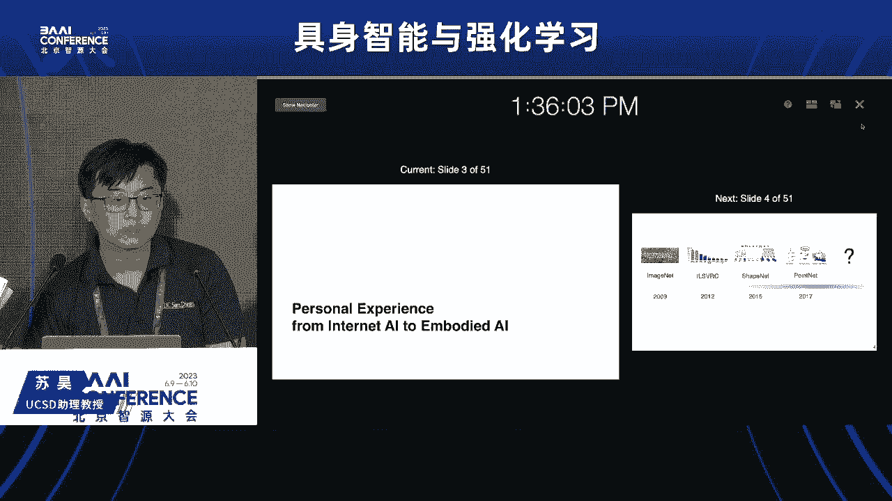
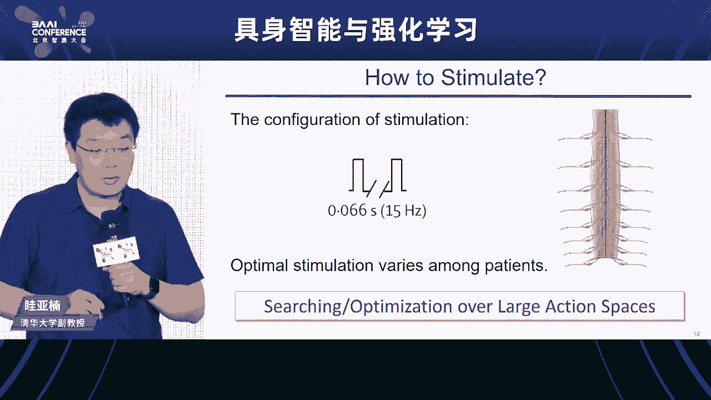
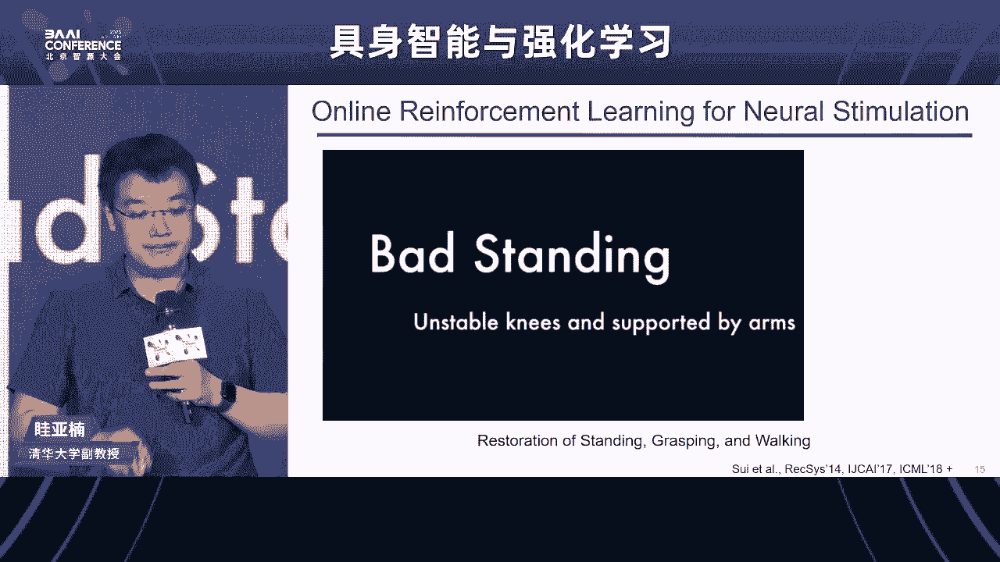
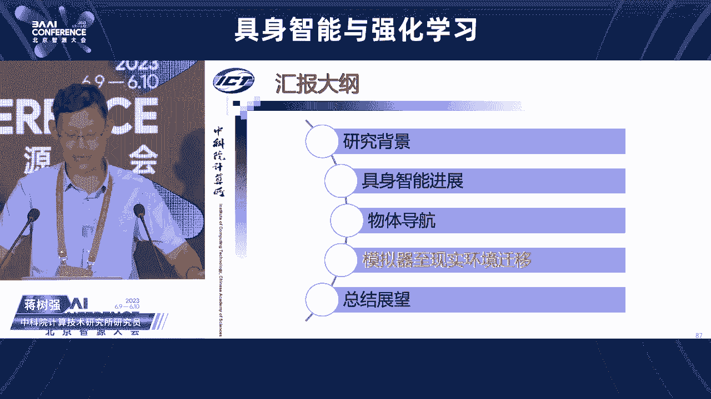
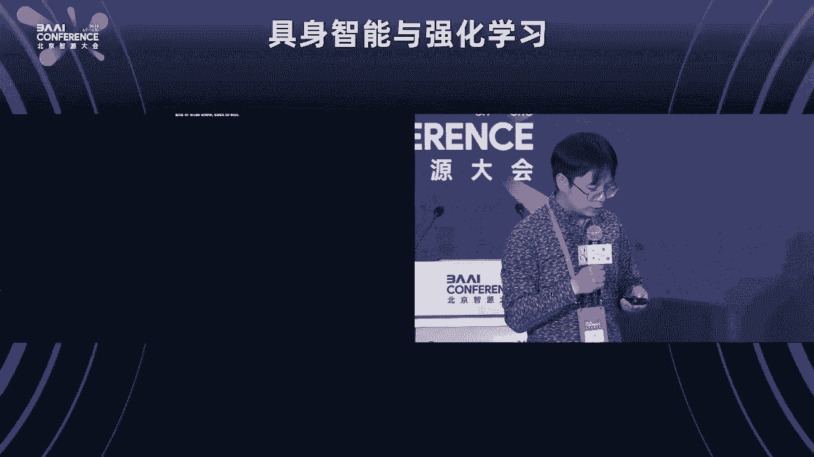

# 具身智能与强化学习论坛教程 📚

## 课程概述
在本节课中，我们将学习具身智能与强化学习的基本概念、核心挑战、研究方法以及未来展望。通过整理2023年北京智源大会“具身智能与强化学习论坛”的内容，我们将深入探讨具身智能的定义、数据获取、算法设计、应用场景以及与大模型的结合。

---

## 一、具身智能的定义与背景 🌍

上一节我们介绍了课程的整体内容，本节中我们来看看具身智能的基本定义和背景。

具身智能（Embodied Intelligence）强调智能体通过感知、认知和行动的闭环与物理世界交互。与传统的互联网智能不同，具身智能的核心在于智能体在环境中通过交互涌现智能。例如，谷歌发布的PALM-E模型展示了智能体从语言、图像到物理行动的跨越，特斯拉的人形机器人也进一步推动了具身智能的发展。

具身智能的核心科学问题是概念的涌现和表征的学习，其基础框架耦合了感知、认知和行动。最终目标是构建像人一样聪明、能够自主学习的机器人智能体。

---

## 二、具身智能的核心挑战 ⚙️

上一节我们介绍了具身智能的定义，本节中我们来看看其核心挑战。

具身智能面临多方面的挑战，主要包括数据获取、算法设计和性能评估。以下是具体内容：

1. **多模态学习**：机器人需要通过图像、视频、音频、语言和触觉反馈等多种模态理解世界。
2. **数据获取**：从互联网智能到具身智能，数据收集的主体从人类转向机器人自身，涉及探索与利用的平衡。
3. **数据处理**：数据从感知端流动到决策端，需要经过对世界的建模，涉及任务驱动的表征学习。
4. **性能评估**：评估指标包括任务完成率、采样复杂度和组合泛化能力。

---

## 三、数据获取与模拟器 🎮

上一节我们介绍了具身智能的核心挑战，本节中我们来看看数据获取与模拟器的作用。

模拟器在具身智能中具有重要作用，主要体现在以下方面：

1. **可扩展性**：模拟器可以低成本生成大量数据，避免真实机器人收集数据的高成本和危险性。
2. **可复现性**：模拟器支持大规模测试，确保算法的严谨性和可重复性。
3. **快速原型**：模拟器允许快速迭代和升级，降低硬件更新的成本。

例如，MiniSkill平台提供了20类操作技能、超过2000个物体和400万个物体操作实例，支持高效的算法测试和训练。

---

## 四、算法设计与策略学习 🧠

上一节我们介绍了数据获取与模拟器，本节中我们来看看算法设计与策略学习。

在具身智能中，算法设计需要解决鲁棒性和泛化性问题。例如，通过结构化策略（如基于思维链的预测控制）可以提高组合泛化能力。以下是具体方法：

1. **技能链接**：将复杂任务分解为基本技能，通过技能组合完成长程任务。
2. **思维链技术**：仿照语言模型的思维链技术，将复杂任务分解为关键状态序列，逐步完成。
3. **模型对齐**：通过神经网络结构设计，使其与决策所需的算法推理过程对齐。

例如，基于思维链的预测控制（COT-PC）方法在精细控制任务中取得了显著效果。

---

## 五、具身智能与大模型的结合 🤖

上一节我们介绍了算法设计与策略学习，本节中我们来看看具身智能与大模型的结合。

大模型（如GPT-4）在具身智能中具有潜在应用，主要体现在以下方面：

1. **任务规划**：大模型可以用于高层任务规划，将复杂任务分解为基本技能序列。
2. **世界模型**：大模型可以作为抽象的世界模型，帮助智能体理解环境和任务。
3. **数据生成**：通过3D AI生成内容（AIGC），可以生成大量几何数据，丰富模拟器中的虚拟世界。

例如，在Minecraft环境中，通过大模型规划任务，结合强化学习训练底层技能，可以完成复杂的长程任务。

---

## 六、具身智能的应用场景 🏥

上一节我们介绍了具身智能与大模型的结合，本节中我们来看看其应用场景。

具身智能在多个领域具有广泛应用，主要包括以下方面：

1. **机器人操作**：通过强化学习训练机器人完成物体抓取、精细操作等任务。
2. **运动功能重建**：通过神经刺激和外骨骼机器人，帮助运动功能损伤的患者恢复行动能力。
3. **视觉导航**：在未知环境中，通过视觉和语言输入完成导航任务。

例如，孙亚楠老师的研究通过神经刺激和外骨骼机器人，帮助高位截瘫患者恢复手部抓握和行走能力。

---

## 七、未来展望与挑战 🚀

上一节我们介绍了具身智能的应用场景，本节中我们来看看未来展望与挑战。

具身智能的未来发展面临多方面的挑战和机遇，主要包括以下内容：

1. **数据基础设施**：需要构建大规模、多模态的数据集，支持具身智能模型的训练。
2. **算法创新**：需要设计更高效、鲁棒的算法，解决长程任务和组合泛化问题。
3. **人机共融**：需要确保机器人与人类的安全交互，解决伦理和社会接受度问题。
4. **大模型融合**：需要探索大模型在具身智能中的具体应用，实现抽象规划与底层控制的结合。

例如，未来可能需要通过解耦的方式，将具身智能分解为多个子模型（如感知模型、世界模型、决策模型），逐步实现通用具身智能。

---

## 课程总结
在本节课中，我们一起学习了具身智能与强化学习的基本概念、核心挑战、研究方法以及未来展望。具身智能通过耦合感知、认知和行动，实现智能体与物理世界的交互。其发展离不开数据获取、算法设计、大模型融合等多方面的努力。未来，具身智能将在机器人操作、运动功能重建、视觉导航等领域发挥重要作用，推动人工智能向通用智能体的迈进。