# AI安全与对齐论坛

## 课程概述 📚

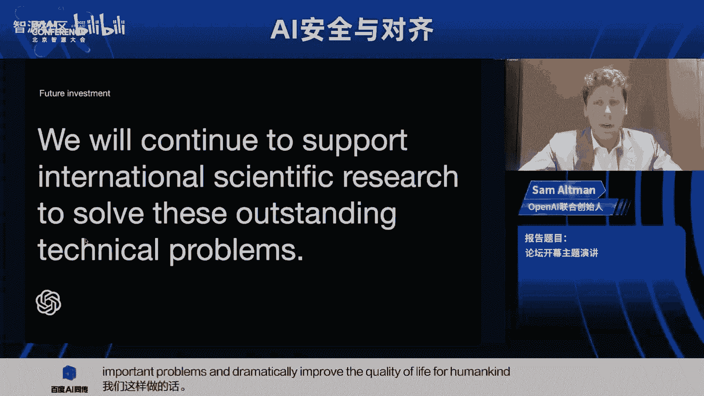

在本节课中，我们将学习AI安全与对齐的核心概念、当前面临的挑战以及前沿的研究方向。课程内容整理自智源社区AI安全与对齐论坛的嘉宾演讲，涵盖了从基础理论到实际应用的多个方面，旨在帮助初学者理解这一重要领域。

---

## 论坛开幕与致辞 🎤

大家好，欢迎来到今年的智源大会AI安全与对齐论坛。我是谢明，西安远AI创始人，也是今天的主持人。进入大模型时代，如何确保越发强大和通用的AI系统安全可控，并使其与人类意图和价值观对齐，是实现人类社会与AI可持续发展的关键问题。

今天的论坛很荣幸邀请到了许多海内外的重量级嘉宾。

以下是线下参会嘉宾：
*   论坛主席，清华大学人工智能研究院名誉院长张钹院士。
*   专程到北京参加交流的加州大学伯克利分校教授 Russell。
*   图灵奖得主，中国科学院院士姚期智先生。
*   智源研究院理事长张宏江博士。
*   智源研究院院长黄铁军教授。
*   清华大学副教授黄民烈博士。
*   首次到访中国的剑桥大学助理教授 David Krueger。
*   北京大学助理教授杨耀东老师。
*   以及参与圆桌讨论的李博老师、黄文浩博士和付杰博士。

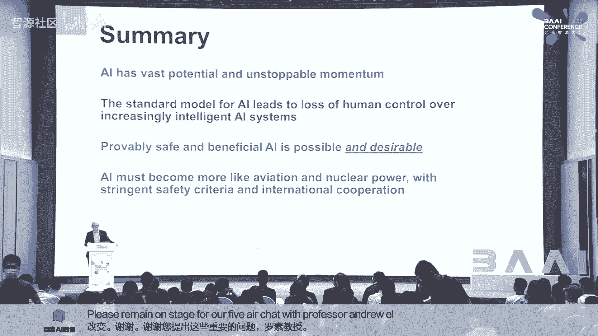

我们也很荣幸能够邀请到以下嘉宾线上参会：
*   包括深度学习之父、图灵奖得主 Geoffrey Hinton。
*   OpenAI CEO， Sam Altman。
*   Anthropic 联合创始人 Chris Olah。
*   加州大学伯克利分校助理教授 Jacob Steinhardt。
*   Google DeepMind 研究科学家 Victoria Krakovna。
*   以及纽约大学副教授 Sam Bowman。

现在有请本次论坛主席张钹院士为大家致辞。

各位专家早上好，因为我不知道是否可以用中文来讲，所以我准备了英文的稿子。现在对不起，我就用英文念稿子吧。

AI安全是备受关注的话题。随着AI（如基础模型、GPT）的进步，这个问题变得更加紧迫。AI安全主要源于两个来源。第一是AI生成模型本身，它可能产生各种不符合人类道德伦理的偏见和错误。这种结果将是不可避免的，没有理由乐观。首先，正如维纳在1949年提到的，我们给予机器的每一度独立性，都是它可能违背我们意愿的一度可能性。其次，是训练数据的问题。

另一个来源是用户。恶意用户可能通过攻击来误导和滥用AI模型，利用模型生成对人类有害的结果。

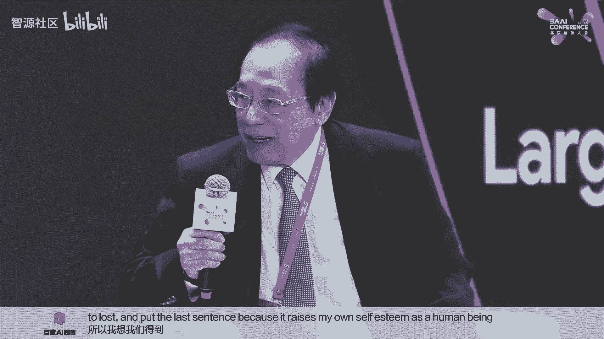

今天，杰出的专家们将讨论的不仅仅是AI安全，还包括我们如何利用AI对齐来引导AI系统朝向人类预期的目标、偏好和伦理原则。我们应该关注AI治理，并通过国际合作（如知识共享、实践传播、联合研究倡议）共同努力，促进AI的健康发展，造福人类。

谢谢张钹院士。

---

## 主题演讲：Sam Altman (OpenAI) 🎙️

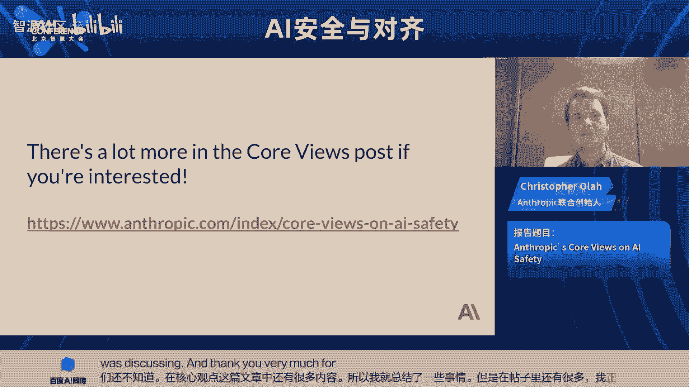

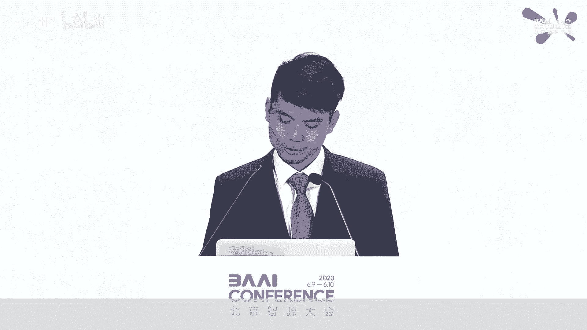

我们开幕主题演讲的嘉宾是OpenAI的CEO Sam Altman。Sam Altman是OpenAI的CEO，该公司在生成式AI领域处于领先地位，取得了包括DALL-E、GPT和GPT-4在内的突破。

你好，Sam，我们知道你正和OpenAI领导团队进行全球巡访，非常感谢你今天抽出时间与我们交流。Sam，你准备好演讲了吗？

是的，太好了。现在请开始。

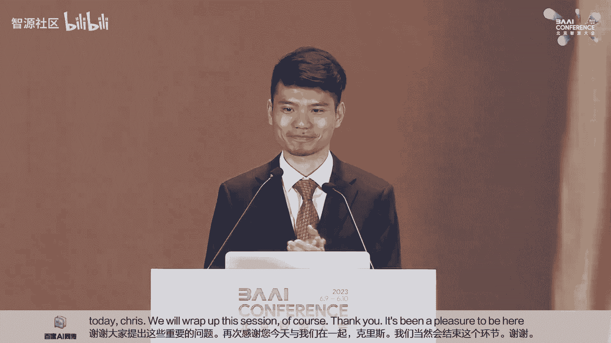

谢谢张主席和北京智源人工智能研究院的成员们召集这次重要且及时的会议。能与如此杰出的AI研究者和计算机科学家群体为伍，我感到非常荣幸。

正如你提到的，我现在正在进行为期四周的世界巡访，已经走遍了五大洲近20个国家。我见到了学生、开发者和国家元首。这次旅行激励了我。

我们看到了世界各地的人们已经在以令人难以置信的、改变生活的方式使用AI技术。我们也从用户那里收到了宝贵的反馈，了解如何让这些工具变得更好。我们还有机会与外国领导人进行有意义的对话，讨论需要建立的监管护栏，以确保日益强大的AI系统能够安全可靠地部署。

世界上许多人的注意力，理所当然地，都集中在解决今天的AI问题上。这些都是需要我们努力解决的严重问题。我们还有很多工作要做，但鉴于我们已经取得的进展，我相信我们能够做到。

今天，我想谈谈未来。具体来说，是我们看到的AI能力增长的速度，以及我们现在需要做什么，以便负责任地为它们进入世界做好准备。

科学史告诉我们，技术进步遵循指数曲线。我们在过去几千年里，在农业、工业和计算革命中都看到了这一点。但让我们现在实时见证的AI革命如此重要的原因，不仅是其影响的规模，还有其进步的速度。它正在迅速拉伸人类想象的画布。

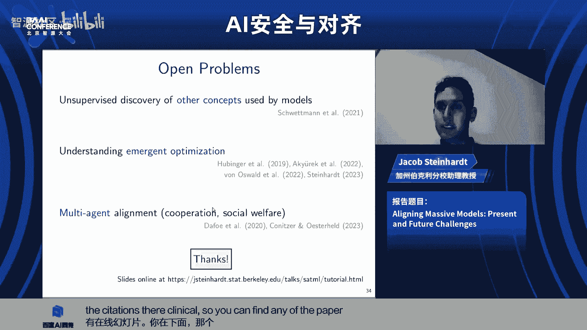

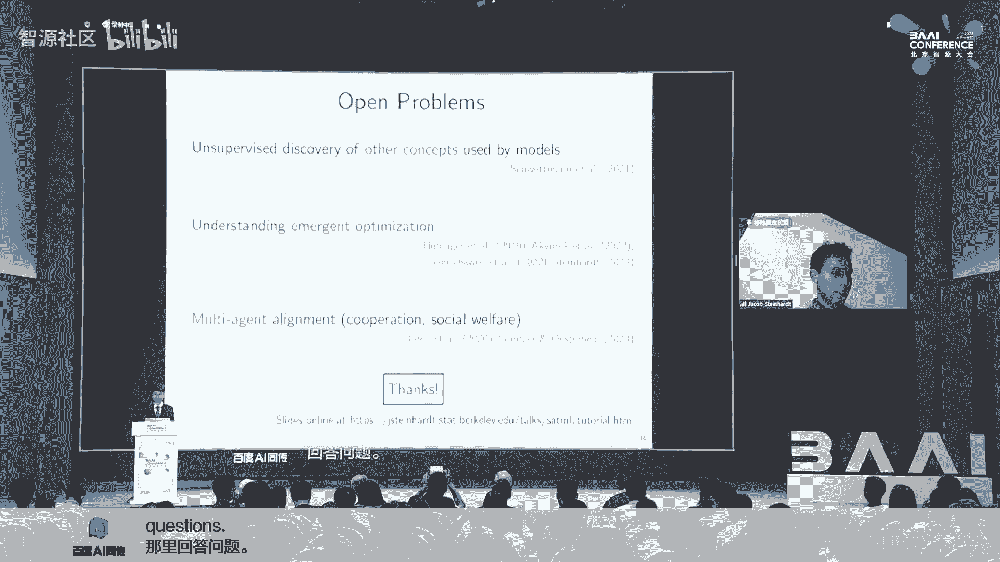

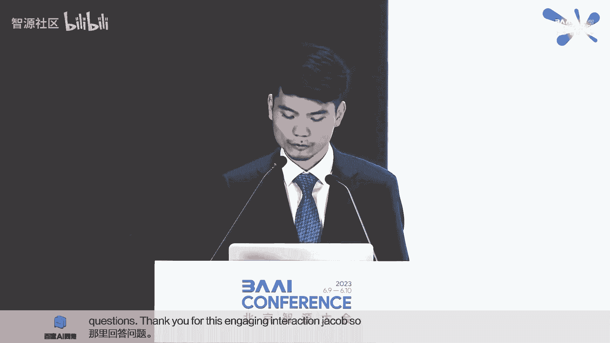

想象一下，在未来十年，通用人工智能系统（通常称为AGI）在几乎所有领域都超越了人类的专业知识。这些系统最终可能超过我们最大公司的集体生产力。这里的潜在收益是巨大的。AI革命将创造共享财富，并有可能显著提高每个人的生活水平。

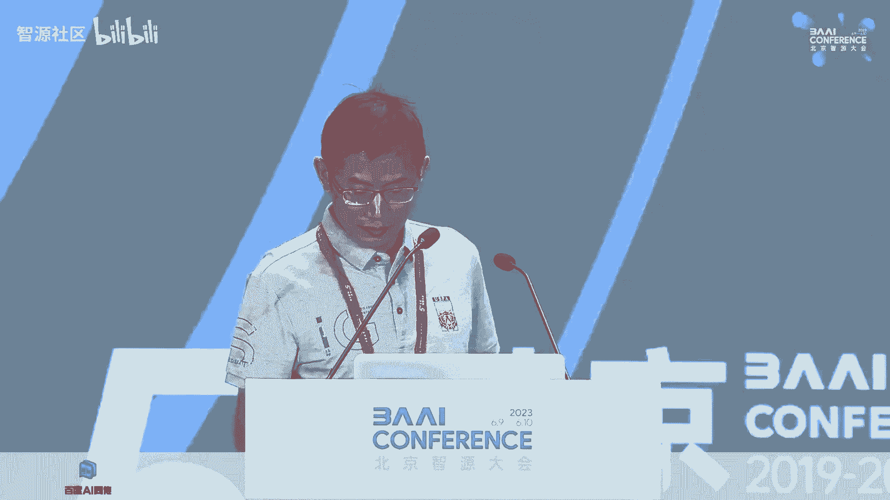

但我们必须共同管理风险才能实现这一点。我知道，大国之间有时会有分歧。今天如此，过去也是如此。但即使在最困难的时期，大国也找到了在最重要的事情上合作的方法。这种合作促成了关键的医学和科学进步，例如根除脊髓灰质炎和天花等疾病，以及全球减少气候变化风险的努力。

随着日益强大的AI系统的出现，全球合作的利害关系从未如此之高。如果我们不小心，一个旨在改善公共卫生结果的未对齐AI系统，可能会通过提供无根据的建议来扰乱整个医疗保健系统。同样，一个旨在优化农业实践的AI系统，可能由于缺乏对长期可持续性的考虑，无意中耗尽自然资源或破坏生态系统，从而影响粮食生产和环境平衡。

我希望我们都能同意，推进AGI安全是我们找到共同点的最重要领域之一。我想把接下来的发言重点放在我认为我们可以开始的地方。

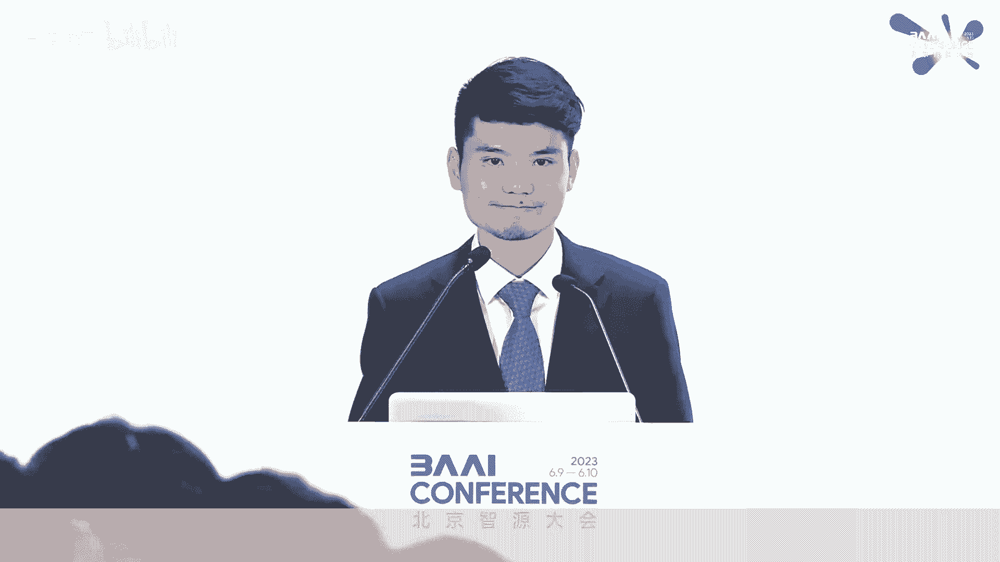

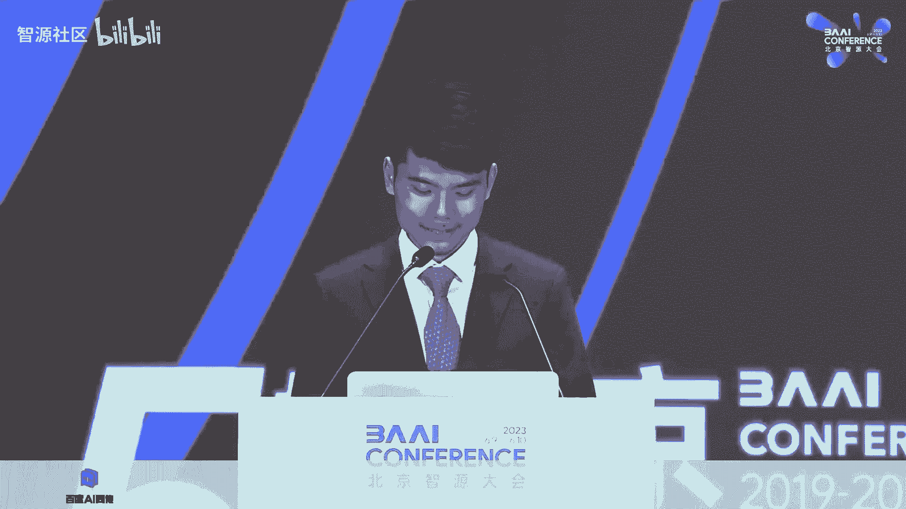

一个领域是AGI治理。AGI从根本上改变我们文明的力量，凸显了有意义的国际合作与协调的必要性。每个人都能从合作的治理方式中受益。如果我们安全、负责任地驾驭这一进程，AGI系统可以为全球经济创造无与伦比的经济繁荣，解决气候变化和全球卫生安全等共同挑战，并以无数其他方式增强社会福祉。我也深深相信这个未来，我们作为一个星球需要投资于AGI安全来实现并享受它。

这样做需要仔细的协调。这是一项具有全球影响的技术。鲁莽开发和部署事故的代价将影响我们所有人。有两个关键领域似乎最为重要。

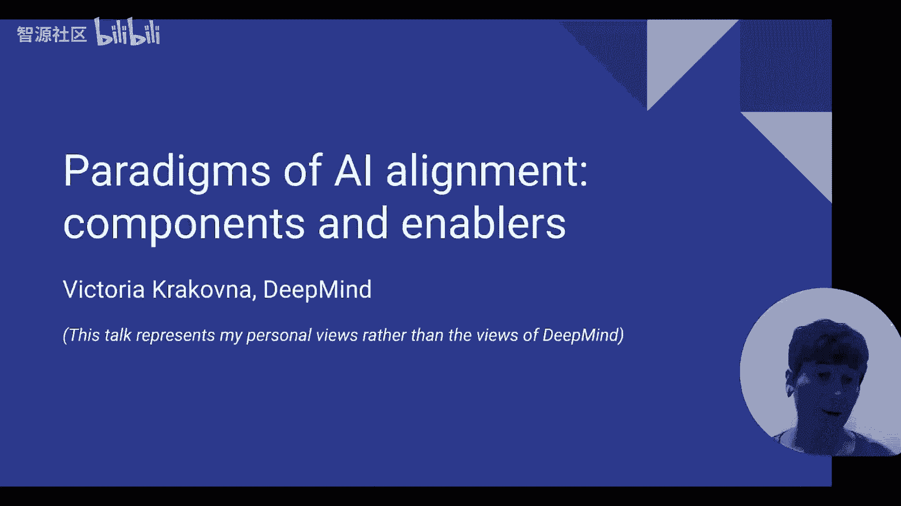

首先，我们需要在一个包容性的过程中建立国际规范和标准，并为所有国家使用AGI制定统一的护栏。在这些护栏内，我们相信人们有充足的机会做出自己的选择。

其次，我们需要国际合作，以可验证的方式建立对日益强大的AI系统安全开发的全球信任。

我不幻想这会很容易。我们需要作为一个国际社会投入大量且持续的注意力才能做好这件事。《道德经》提醒我们，千里之行始于足下。我们认为，这里最具建设性的第一步是与国际科技界合作。特别是，我们应该促进增加AGI安全技术进步透明度和知识共享的机制。发现新兴安全问题的研究人员应该为了更大的利益分享他们的见解。我们需要认真思考如何在尊重和保护知识产权的同时鼓励这种规范。如果我们做得好，这将为我们深化合作打开新的大门。

更广泛地说，我们应该投资、促进并引导对齐和安全研究的投资。在OpenAI，我们今天的对齐研究主要侧重于让AI系统作为一个有帮助且更安全的系统来行动的技术问题。在我们当前的系统中，这可能意味着我们如何训练ChatGPT，使其不发出暴力威胁或协助用户进行有害活动。但随着我们接近AGI，任何未对齐的潜在影响和严重性都将呈指数级增长。通过现在主动应对这些挑战，我们努力将未来灾难性结果的风险降至最低。

对于当前的系统，我们主要使用基于人类反馈的强化学习来训练我们的模型，使其成为一个有帮助且安全的助手。这是各种训练后对齐技术的一个例子，我们也在忙于研究新的技术。要正确做到这一点，需要大量的艰苦工程工作。从GPT-4完成预训练到我们部署它，我们花了八个月的时间来研究这个问题。总的来说，我们认为我们走在正确的轨道上。GPT-4比我们之前的任何模型都更加对齐。

然而，对于更先进的系统，对齐仍然是一个未解决的问题，我们认为这将需要新的技术方法，以及加强治理和监督。考虑一个未来提出10万行二进制代码的AGI系统。人类监督者不太可能检测到这样的模型是否在做一些邪恶的事情。

因此，我们正在投资一些新的、互补的研究方向，希望能取得突破。

一个是可扩展监督。我们可以尝试使用AI系统来协助人类监督其他AI系统。例如，我们可以训练一个模型来帮助人类监督者发现其他模型输出中的缺陷。

第二个是可解释性。我们想尝试更好地理解这些模型内部发生了什么。我们最近发表了一篇论文，使用GPT-4来解释GPT-2中的神经元。在另一篇论文中，我们使用模型内部状态来检测模型何时在撒谎。虽然我们还有很长的路要走，但我们相信先进的机器学习技术可以进一步提高我们生成解释的能力。

最终，我们的目标是训练AI系统来帮助对齐研究本身。这种方法的一个有希望的方面是，它可以随着AI发展的步伐而扩展。随着未来的模型作为助手变得越来越智能和有用，我们将找到更好的对齐技术。

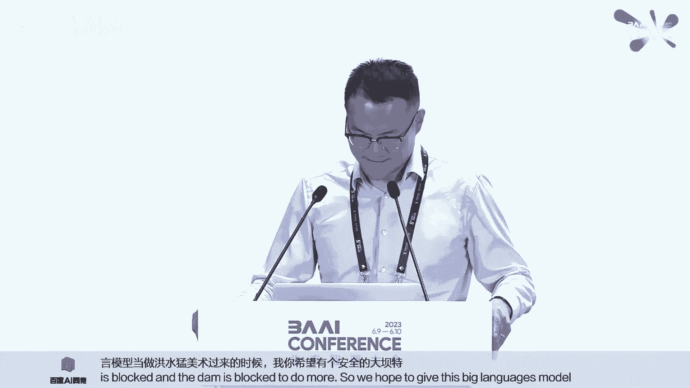

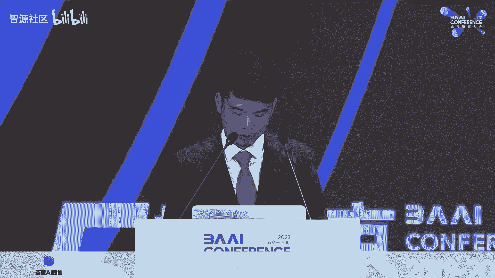

实现AGI的非凡好处同时减轻风险，是我们这个时代的开创性挑战之一。我们看到美国、中国和世界各地的研究人员有巨大的潜力共同努力实现这一共同目标，并致力于解决AGI对齐中突出的技术挑战。如果我们这样做，我相信我们将能够利用AGI来解决世界上最重要的问题，并显著提高人类的生活质量。

非常感谢。

非常感谢，Sam。我现在将介绍北京智源人工智能研究院院长张宏江博士来主持与你的问答环节。

---

## 主题演讲：Stuart Russell (加州大学伯克利分校) 🧠

我们下一位嘉宾是加州大学伯克利分校教授 Stuart Russell。Russell是计算机科学教授，也是伯克利大学人类兼容AI中心的创始人。他是教科书《人工智能：现代方法》的合著者，该书在135个国家的1500多所大学使用。

欢迎回到智源大会。Stuart，很荣幸你能访问北京。

非常感谢，非常荣幸受邀在此发言，尤其是在这可能是人类历史上最重要的一年。事实上，在我的文件系统中，我现在有一个名为“2023”的目录，用来存放今年发生的所有信息，试图跟上变化的步伐。

让我从过去常做的事情开始，即尝试解释AI，以及构成教科书基础的这种解释，是一种思考AI的方式，我称之为标准模型，因为它非常普遍、被广泛接受且非常有效，就像物理学中的标准模型一样。简单来说，我们可以说机器是智能的，其程度取决于它们的行动在多大程度上可以预期实现其目标。这种智能概念直接借用了20世纪中叶的哲学和经济学。这些领域与致力于创建AI领域的早期研究人员之间有直接联系。

在这些领域中，这被称为理性行为，它构成了我们迄今为止在人工智能中开发的几乎所有技术的基础。自该领域诞生之初，我们就明确追求通用AI的目标，有时我们现在称之为AGI（通用人工智能）。这意味着系统能够快速学习，在任何任务环境中（即人类智能适用的任何领域，可能还有许多人类无法有效运作的其他领域）高水平地执行任务，通常超过人类能力。我们预计，由于机器在速度、内存和通信带宽方面的巨大优势，这样的系统将在几乎所有领域远远超过人类能力。

因此，为了延续Sam Altman提到的一些主题，让我们思考一下成功创造通用AI的一些简单后果。根据定义，它将能够做人类已经能够做的事情。我们已经能够做的事情之一是为地球上的一部分人口提供高质量的生活，也许占人口的十分之一到五分之一，取决于你如何定义。但我们可以为地球上的每个人提供这种生活。我们可以扩大我们创造高质量生活的能力。一个功能齐全、实用、支持人类文明的系统，可以通过AI系统基本上免费工作，以更大的规模和低得多的成本来提供。

如果我们计算其价值，那将是世界GDP的大约十倍增长。经济学家喜欢使用一个叫做净现值的量，即该增加收入流的现金等价物，现金等价物大约是1350万亿美元。所以，这是我们试图创造的技术价值的下限估计。

现在，这个估计。把它想象成一个巨大的磁铁。在未来，它正把我们向前拉。这几乎是不可阻挡的势头。我们还可以拥有更多东西，对吧？除了在整个星球上重建我们的生活水平，我们还可以拥有更好的医疗保健、更好的教育、更好的科学，以及我们现在无法真正想象的新发现。

那么下一个问题就是，我们成功了吗？有些人相信，是的，我们已经处于AGI的存在之中，或者我们非常接近拥有AGI。我的观点是，不，我们还没有成功创造AGI，事实上，仍然存在主要的未解决问题。

我目前的想法是，语言模型是创造AGI拼图的一部分。AI在其75年的研究中已经产生了这个拼图的许多其他部分。我们实际上不太理解这个新拼图是什么形状。我们并不真正理解它是如何工作的，它能做什么，不能做什么，以及如何将它连接到拼图的其他部分以创建AGI。我相信也仍然缺少我们尚未发现的拼图部分。

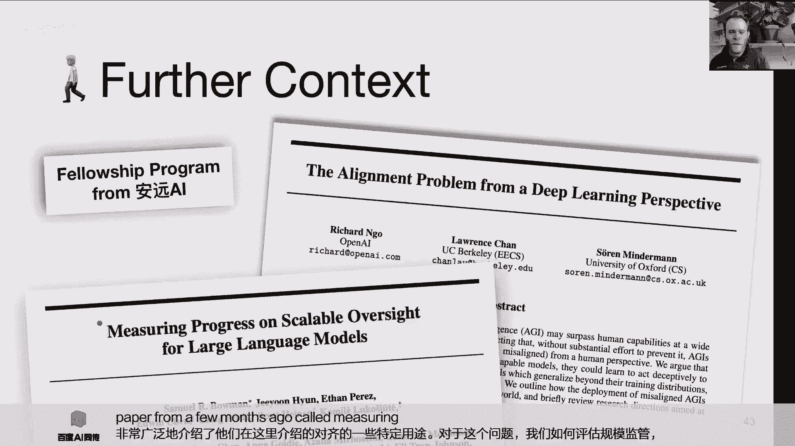

话虽如此，我必须承认，有一些研究人员已经花了几个月时间研究GPT-4，这是微软研究院的一个小组，一个非常杰出的团队，包括两位美国国家科学院院士。他们写了这篇名为《通用人工智能的火花》的论文，因此根据他们与系统的经验，他们认为这真的是导致AGI的不可阻挡过程的开始。我对此表示怀疑。

许多人已经观察到的一个现象是，ChatGPT或GPT-4是否在回答问题时参考了一个一致的世界内部模型，这一点并不清楚。事实上，我认为正确思考这些系统的方式是，它们并不回答问题。对于人类来说，大多数时候，回答问题意味着将问题指向我们努力保持更新和一致的世界内部模型。ChatGPT似乎并非如此。

让我给你一个简单的例子。哪个更大，大象还是猫？系统正确回答：大象比猫大。哪个不比另一个大，大象还是猫？大象和猫都不比另一个大。在短短两句话的空间里，它在一个你能想象到的最基本的事实上自相矛盾了。所以至少对于这个事实，它在看似回答问题时并没有参考一个内部世界模型。因此，人们不得不怀疑它是否在任何主题上都有内部世界模型。我们当然观察到，尽管其输入数据中有数百万的训练样本，但它对于算术、国际象棋等并没有一致的内部世界模型。

我认为这实际上是一个症状，即我们正试图从电路中获得高度智能的行为。而电路是一种相当受限的计算形式。

让我说明另一类系统，不是大型语言模型，而是深度强化学习系统。我们已经承认它非常成功。那就是围棋程序。众所周知，在2016年和2017年，围棋程序，特别是AlphaGo及其后继者，击败了最好的人类棋手。在过去的几年里，这些系统已经远远落后于人类。但我们安排了我们的一位研究人员Kyun Pellin（蒙特利尔的学生）与一个名为JBX CatA 005的程序（Cattergo的一个版本，目前宇宙中评分最高的围棋棋手）之间的比赛。Kyun的评分是2300。Catatego的评分是5200。作为比较，评分最高的人类棋手是来自韩国的申真谞，他的评分是3876。所以你可以看到围棋程序是超人的。然而，这是一场业余人类棋手Kyun Pellin和Catatego之间的比赛。Kyun要让Catatego九子。我想你们大多是围棋棋手，所以我不需要解释让对手九子基本上就是把对手当作小孩子对待。

让我们看看这场比赛。记住，Catatego执黑，Kyun Pellin执白。注意棋盘的右下角区域。注意Kyun建立了一个小群，然后Catatego迅速包围了那个群。然后Kyun开始包围Catatego的群。所以它形成了一种循环三明治。Catatego似乎对此毫不在意，它只是允许Kyun Pellin继续包围这个群，没有尝试救援这些棋子，即使它有很多很多机会，然后它失去了所有棋子。所以我们看到，一个普通的业余人类棋手可以击败超人的围棋程序。不仅仅是Catatego，事实上，所有领先的程序都可以被一个普通的人类棋手击败。似乎事实上，围棋程序没有学会围棋的基本概念，这些概念包括“群”的概念和“死活”的概念。它根本没有正确表示和理解这些概念，因为电路无法正确表示这些概念，它只能表示一个有限的近似，这个近似必须为数百万个特殊案例学习，而不是可以很容易地用具有表达能力的编程语言表示的简单逻辑定义。

所以我认为，实际上发生的是，电路在计算其输出时，时间与电路大小成线性关系，这基本上意味着所有Transformer模型都具有此属性。循环神经网络可以进行额外的计算，但Transformer模型是线性时间计算设备。当它们试图学习一个复杂函数，特别是表示一个计算上难以做出的决策（例如，一个NP难决策）的函数时，那么该函数的表示将呈指数级大，这意味着它将需要指数级的训练数据来学习一个在程序形式中具有相当简单定义的东西。这是这些技术方法的根本弱点，我们一直在通过使用比人类实现相同认知能力所需多数百万倍的训练数据来补偿这种弱点。

因此，我相信，我们实际上将看到AI的下一步将是回归到基于知识的显式表达表示的技术，我认为这种技术的一个例子是概率编程，可能还有其他技术。我们在伯克利正在进行一项基础研究工作，试图证明事实上，如果你不这样做，你将需要比使用更具表达性语言的系统所需多得多的训练数据。

让我给你一个人类能做什么的例子，我想让你思考如何让深度学习系统或大型语言模型做到这一点。这里有两个在宇宙另一端的黑洞，它们相互旋转，并以引力波的形式释放能量。它们释放的能量是宇宙中所有恒星输出总和的50倍。数十亿年后，这些引力波到达地球，并被这个设备——大型激光干涉引力波天文台（LIGO）探测到。它探测到那些引力波。利用数千年的物理学研究和材料科学研究成果，极其复杂的设备、激光、镜子、电子设备，这个设备的灵敏度足以测量地球和半人马座阿尔法星（距离4.5光年）之间距离的变化，如果你改变那个距离一根人类头发的宽度，这个系统就能测量到那个变化。这就是它的灵敏度。它正确地探测到了这次黑洞碰撞，物理学家正确地预测了来自这种碰撞的引力波的形状，他们甚至能够通过观察波的形状来测量相互碰撞的两个黑洞的质量。这是人类思维的一项惊人成就。如果你从事深度学习工作，我想让你思考你的深度学习系统将如何成功地创建这个设备并进行这些预测和测量。

让我们假设，事实上，我们确实解决了AI中的这些开放问题，并且我们确实创造了通用人工智能。接下来呢？嗯，艾伦·图灵问过这个问题：如果我们成功了会怎样？艾伦·图灵，如你所知，是计算机科学的奠基人，他在1951年做了一次演讲，我相信有人问他：如果我们成功了会怎样？他是这样说的：“似乎可以想象，一旦机器思维方法开始，它不会花很长时间就超越我们微弱的力量。因此，在某个阶段，我们应该预期机器会接管控制权。”

让我以不那么悲观的形式重述一下。至少让我把它变成一个问题：我们如何永远保留对比我们更强大的实体的控制权？这是我们面临的问题。如果我们找不到这个问题的答案，那么，我看不到除了真正停止开发通用人工智能之外的任何替代方案。

要回答这个问题，我相信有一个答案。我们需要看看随着我们让AI系统变得更好，出了什么问题，为什么事情会变得更糟。我相信答案实际上是未对齐。我们构建的AI系统正在追求目标，如果这些目标与人类的目标没有完美对齐，那么我们就是在制造冲突。而冲突会以有利于机器的方式解决。

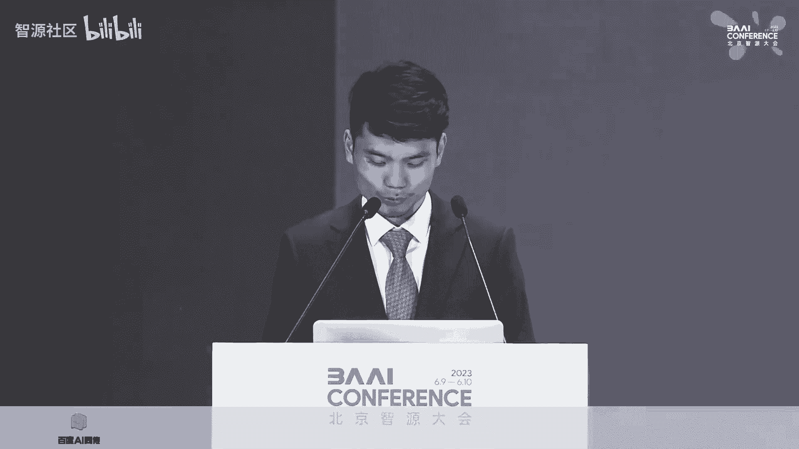

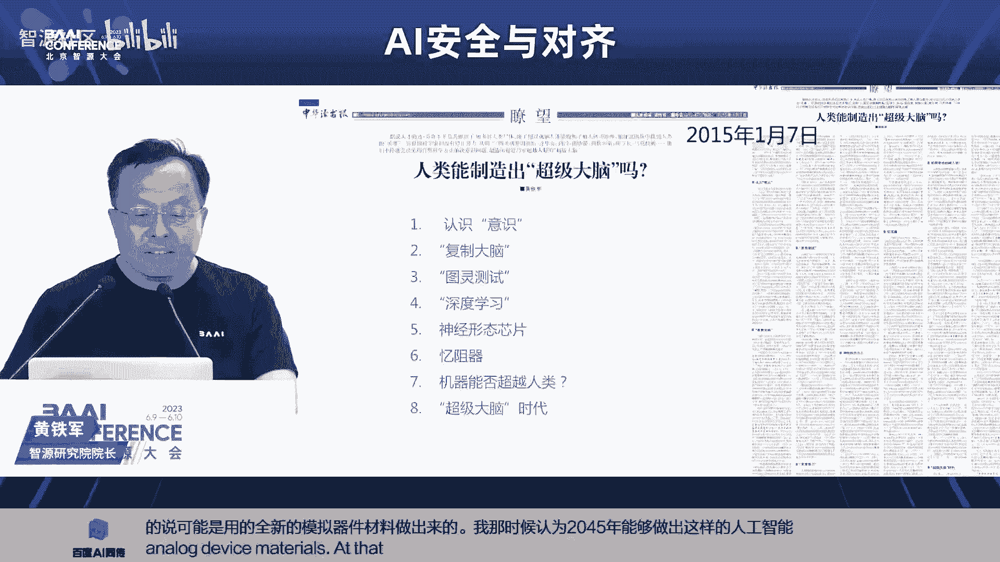

让我给你一个已经发生的简单例子。社交媒体算法，所谓的推荐系统，选择地球上数十亿人每天阅读和观看的内容。这些算法旨在最大化一个目标，通常这个目标可能是我们所说的点击率（每个用户产生的总点击次数）或用户与平台的互动量。你可能会想，好吧，为了让用户点击东西或与平台互动，系统必须学习人们想要什么，这是