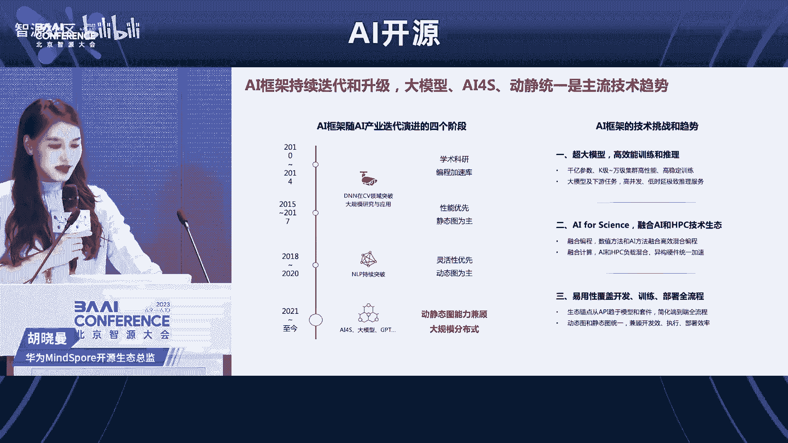
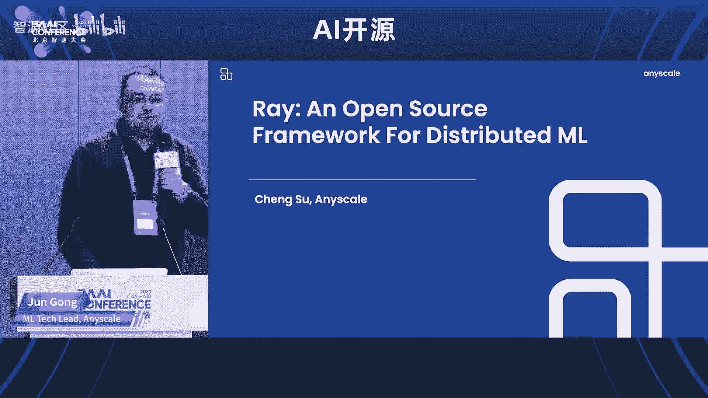
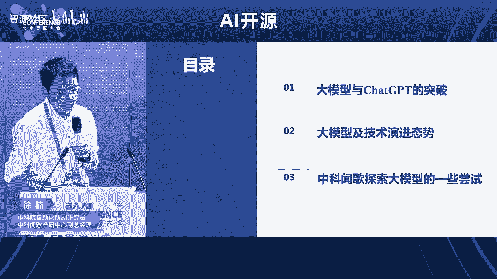

# AI开源论坛

## 课程概述 📚

在本节课中，我们将学习2023北京智源大会AI开源论坛的核心内容。课程将涵盖AI与数据开源的重要性、大模型开源生态的现状与挑战、以及各类开源工具与框架的介绍。我们将深入探讨开源如何成为推动AI技术进步和产业协同的关键力量。

---

## 第一部分：开场与基金会介绍

大家好，欢迎大家来到2023北京智源大会AI开源论坛。

我是主持人杨轩，来自LF AI & Data基金会亚太区。

LF AI & Data基金会是全球最大的开源非盈利组织Linux基金会旗下，专注于人工智能领域的子基金会。同时，LF AI & Data也是全球最大的AI领域开源社区。

现今，AI开源已经成为人类超大规模智力协同的最佳组织方式。可以说，没有开源，就不会有今天AI的成就。现在，AI已经成为人类开源创新的主战场。

今天我们有幸请到了非常多的AI领域专家，一起探讨从AI与数据的开源到大模型的机遇与挑战。我们希望这次大会能够对大家未来的工作或事业发展有所帮助。

另外，我们也呼吁更多的朋友能够加入到AI开源社区的行列。在LF AI & Data这边，我们有大概40到50个开源项目，这些都欢迎大家去使用和参与。

---

## 第二部分：主题演讲 - AI与数据开源挑战与机遇

接下来有请我们今天的第一位嘉宾，LF AI & Data基金会董事会主席杜俊平老师，为我们带来主题演讲《AI与数据开源挑战与机遇》。

感谢主办方智源研究院和林老师的邀请。今天给大家介绍一些关于AI和数据领域开源的一些挑战和机会。

首先介绍一下LF AI & Data基金会。LF AI & Data基金会是一个开源的软件基金会，它是一个非盈利组织，托管了在AI和数据领域全球最重要的一些开源项目。

当前基金会里，全球大概有50个左右的会员，包括国内大家熟悉的一些大企业，甚至包括智源研究机构也在里面。同时，我们全球托管了大概有46个关键的技术项目，有超过接近2万名的开发者，为我们的AI和数据类开源项目在持续贡献。

这张图能看到LF AI & Data作为一个大的基金会社区，它的开发者规模和技术在过去5年飞速发展，成长了大概5倍，530%的成长。一方面反映了当前在AI领域的开发趋势，就是更多的开发者、更多的开源公司投入到AI领域，也涌现到开源领域。同时，我们也希望借着这样一个平台，能够更好的拓展，让技术更好的发展。

这里面的关键项目包括一些深度学习框架，包括像ONNX这样的框架之间的翻译平台，包括像Horovod这种分布式的学习框架，甚至包括智源研究院的FlagAI也在这个里面。这些顶级的组织就是大家耳熟能详的，像亚马逊、微软、Meta等等，像国内的华为、百度、阿里，都在我们的组织里面，或者是会员，或者是托管了一些关键的项目。

我们的基金会运作主要是分层治理的架构。有Governing Board负责整个基金会层面的治理。另外我们有Technical Advisory Committee（TAC），它专注在技术层面的治理，包括我们整个开源社区这些项目，它的生命周期从Sandbox到Incubate到Graduate，是一整套毕业的演进流程。

我们通常认为Sandbox阶段是项目的一个早期阶段。在这个阶段里，更多的我们会关注他的开发者生态，更多的开源开发者能够加入到项目当中。到了Incubate阶段，就是更多的开始拓展自己的用户，它已经有足够完整的功能能够适应在一些场景之上。然后再往前走，它就是一个Graduate的状态，就是它的功能比较完善，生态比较丰富，用户也积累的比较丰富，它可以进行一些规模化的落地。这就是它完整的开源项目的生命周期。

回到我们今天的正题，我们在看看当前我们所属的时代。实际上当前我们的时代，不管是工业界还是学术界，大家的认知都是一致的。我们认为这是属于AI的技术爆炸的起点时刻，我们在通向通用人工智能的关键时刻。

现在的一个流行词就是从前几年的Machine Learning、Deep Learning、AI Framework，慢慢的现在更多的大家听到的都是Transformer、Attention、AIGC、LLM、Large Language Model这些词。其实这些都看到这两年每隔一年或者两年，它的焦点都不一样。尤其是当去年底ChatGPT出来之后，其实上引爆了一个核弹，快速的让AI的生态能够蓬勃的发展。

实际上业界把这些模型，就现在我们看现在应该是一个模型飞速发展的时代。业界把这些模型从小模型到中模型，中等的模型，大型的模型跟超大的模型，每一个模型的它能干的事情也看的比较清楚。一些小模型可以做一些简单的阅读理解，包括Debugging的工作。中型到大型的模型，类似于GPT-3、GPT-3.5之类的，它可以做一些GRE层次的阅读理解，甚至包括一些对于类比、比喻，还有一些逻辑的推导、代码的生成。我们在GitHub上的Copilot，很大程度上提高了我们在开发、生成文档、写代码开发的效率。

未来我们看到随着我们的模型会越来越发展，可能会有些进一步的功能会被开发出来，包括它有一些初步的更更强的自我意识，或者更复杂的一些工作，甚至是一些辩论它都可以去做。这就是我们这个时代的进程，它是一个飞速发展的过程。

实际上去年两周前我们看到Databricks发了一个报告，在2023年的State of Data + AI，有一些有趣的数据。比如说AIGC，就是ChatGPT发布以来的几个月，实际上大家用API的模式，或者是模型工具链的模式会成为主流。在这之前大家都是每家公司自己可能训一些，或者是依赖于一些开源的开放的一些模型。那么在这之后，可能直接我们就开始用API去访问这些模型。这短短的半年时间，从去年底到今年的5月份，这种直接对于API层次的访问量提升了13倍。

同时，现在在NLP领域，在整个Python的Data Science领域，它占的比例已经大概占到了50%左右，就非常的流行，也占用大量的机器学习和科学计算的任务。同时，还有一个有趣的现象，就是企业对于模型的重要性也是越来越有更强的认知。在过去的一年当中，模型上线的在生产中上线的模型，实际上翻了400%。甚至包括在这个过程中，大家使用模型的成熟度也提高了。与一年之前相比，大概是每5个在测试阶段的模型，最后变成一个生产模型。那么现在这个比例是3比1，就是每三个处于测试阶段的模型，就有一个进入生产。实际上这种比例的变化也意味着我们在AI推理或整个行业的应用当中慢慢的走向成熟。

一方面我们认为这个大模型的生态是发展欣欣向荣，但是从另外一个层面，我们看到冰山下的部分永远是数据。某种程度而言，模型只是数据的一个转化品或者衍生品，它是数据在某一个切面上的一个投影，或者是一种折叠，或者是一种压缩。所以一个高质量的数据集，实际上是可以训练出不同的维度的多个高价值的模型的。

作为冰山之下的部分，数据的重要性就是大家一直在强调，一直在提，但是始终大家都觉得这块可能有很多各种各样的挑战。今天我们待会儿也会去更多的讨论一下有哪些挑战。

第一个就是从模型训练的角度来说，数据从来就没有够过。这个“够”体现在一个是质量，一个是数量，我们需要更高的质量，然后更多的数据等等。不管在整个模型的产生、诞生，从训练阶段到后面的调优阶段，到后面的推理，到生成之后的Prompt Engineering，其实它都离不开不断对它进行数据的投喂。所以就是如果我们说大模型就像一个贪吃蛇或者一个贪吃的怪兽，那么就是它一直吃不饱，始终是需要更多的数据和更高质量的数据。

同时很多的企业初步已经感受到模型的威力之后，下一步就是说如何能够更好的提升我的模型的能力和质量，也是在数据这块层面做很多工作，就是所谓的Data-Centric的工作。

实际上当前这些数据来源无非就是三个来源。第一个来源就是自己去收集一些数据，去爬取一些数据。第二个就是从第三方去购买，或者是获得一些数据。第三个就是通过Publicly Available的方式，找一些公开的数据集，类似于Hugging Face，在这之上去获得一些。

但是这三个层面上，多多少少还都是有一些挑战的。第一个从主动收集领域，其实很多我们发现现在的数据很多公司还是在公司内部，属于私域之中，很难从外部去获得，而且是以一种合规合法的方式去获得，是比较难的。另外一个层面上讲，对于这种第三方的购买或者交易的数据，实际上也是有很多挑战。因为数据的定价如何定义？数据如何定义它的质量，或者它对外部的公司、外部的企业能够真正产生益处？所以有很多的数据交易市场，国内我们也有一些，海外的也有一些，在云甚至在一些云服务厂商，包括数据的Production或者数据的SaaS Service上都有相应的Market。但是目前来看它的交易量和规模其实还没有达到理想的状态和要求。

第三个实际上是在公有领域，就是Publicly Available的数据。实际上我们现在看到很大量的数据集还不是一种完全开源的状态，它可能还是在商用方面有很多的限制，就你可能做研究可以，但是你不允许相应分发，或者是当你训练完了之后，你的预训练模型，或者将来的AI模型的产品，不允许有各种各样的限制。实际上这也使得我们的可用的商业可用的这些数据集都是很有局限的。我认为这是一个很重要的挑战，在三种渠道上各有各自的挑战需要去做。

另外还有就是看到数据的Quality还是Quantity，大家会有很多不同的要求和纠结。现在基本上达成大家达成一个共识，就是Quality over Quantity，就是数据的质量可能优于它的数量。因为其实质量它决定了模型是否精确，是否是相关，是否会不会有一些Bias，会不会有一些不公平等等。但是Quantity它实际上也是有用的，包括你大量的数据训练出来的模型，它会有更强的泛化能力，包括它有更强的鲁棒能力，它不会说过度依赖某一部分的数据，然后同时它看到一些没有见过的场景的Case，它能够很好的处理。所以Quantity和Quality经常也是企业会去纠结的。

我们认为未来的方式就是可能在保证数据质量的情况下，我们更高的更多的获取数据。然后同时用一些，比如说现在当前是用人工的方式去打一些标签，或者是做一些相应的工作，未来可能会更多的自动化的标签，或者有相应的开发出相应的模型，自动的会给我们的数据贴上各种各样的标签，可以更好的训练我们的模型。

同时在数据集的治理层面，其实有很多问题。元数据的治理一直在业界就是一个问题。包括我们看到很多企业内部，大的公司内部，不同的团队其实互相之间因为一些沟通的问题，或者是部门墙的一些问题，其实没有办法很好的共享数据，哪怕这些数据在公司内共享是很有价值的。第一个难点就卡在数据元数据的发现，就是我们能不能有一套元数据的标准，很好的定义不同的数据集在做什么事。

我们其实看到比如说以Hugging Face为例，都同样是文本数据，IMDB的数据集和Wikipedia还是有些差别。那么对于我们普通大众来说，他的认知还好，还是能够理解，但是一旦这是牵扯到企业不同的业务，它的业务逻辑在里面的时候，互相之间就很难去达成一个一致。所以在这个层面上数据集的元数据是需要一个标准。我觉得在这个领域，其实LF AI & Data基金会可以做的更多，我们可以做更多的相应的开源的标准的工作。

从另外一个层面，其实从治理的层面，实际上当前很多时候在强调Data Governance。这种Data Governance设施包括一些元数据，包括一些数据的血缘。但实际上在当前来看，除了数据这块需要治理，其实在整个Machine Learning Pipeline上有很多更复杂的东西，包括我们从数据的预处理之后，会涉及到特征工程，在后面的Model Training，包括Management、Serving，到后面现在还有Prompt Engineering。所以这里面有很多大量的东西，你有很多从数据集到Feature的映射，从Feature到Model映射，Model到后面的一些Prompt的映射，这个形成了很多这种网状的关系。但当前现在是没有一个很好的治理的产品或者治理的框架来去完善。我们认为这个是市场上急需的一些方向。

刚才说到的这些挑战，其实还有一个很关键的，就是在于我们看到更多的挑战其实还来自于数据的全球的分布，然后多区域多云造成的新数据孤岛的问题。我们看到现在很多致力于开展国际化业务的公司，其实面临着越来越严苛的一些数据的监管。那么怎么样去兼顾以合规的前提，就是兼顾监管的要求，但同时从全局的角度，从业务的角度，他需要一个全局的视角，全局的视图能看到不同的地域它的业务策略和数据驱动的这些策略。其实这里面其实有一个很强的Gap。这样的话，如何统一去做数据的分析、治理、训练、推理，就是在当前越来越成为各个大公司或者是有国际化业务、有合规业务的公司的一个很大的难点。

近年来其实像如果我们关注像Berkeley，他们也提出了Sky Computing一个云联邦的架构，某种程度上在IaaS层面缓解了多云带来的这种复杂性和性能问题。但是要彻底解决这样一个多云造成的数据割裂、数据孤岛的问题，或者模型的孤岛问题，其实还需要更颠覆性的产品和技术出来。

但是虽然这里面讲了很多的问题，就是很多挑战，但我觉得这里面其实更意味着更多的机会。很多这些机会很多这些问题之前是隐藏在水下，那么现在随着这一波大语言模型的蓬勃发展，实际上我们有更多的可能性。我们的问题更多了，但是同时我们的手段、我们的能力，包括我们的聚焦的资源也很多了。现在有很多聪明的工程师，包括很多的资源都快速涌向AI这个领域和数据这个领域。我对未来我们快速这个领域快速的发展充满了信心。

我们现在正在做的我的一个初创的公司，也在以开源的方式来解决AI和数据开源碰到的各种各样问题。用开源的方式解决AI和数据领域的这些最尖端的痛点问题，一直是我的理想，也是我的公司未来的一个愿景。也希望更多的小伙伴可以跟我们一起在这个领域探索，创造一些伟大的技术，创造伟大的产品。谢谢大家。

---

## 第三部分：智源FlagOpen大模型技术开源体系

感谢杜老师的精彩分享。接下来有请智源研究院副院长兼总工程师林咏华老师，智源研究院自然语言多模态生成组负责人刘广老师，带来主题分享《智源FlagOpen大模型技术开源体系，开启大模型时代新Linux生态建设》。

谢谢。这个Session由我还有我同事刘广等会会把他请上来。首先我还是想借今天的机会感谢杜俊平老师，感谢LF AI & Data基金会对我们智源大会的支持，以及组织了这么好的一个AI开源的论坛。我看到后面大家都已经站满了，包括坐在楼梯上的小伙伴们。前面其实还有座位，大家可以坐。

开源很重要，包括在这一次智源我们发布大模型，其实我们很重要很重要的一个Keyword就是开源。所以为什么说AI开源论坛也是这次历届智源大会都是很重要的一个话题。今天说了太多了。

我发现用的这个图跟杜老师的图一样，但的确就是说看到了，实际上虽然现在从去年下半年到现在很火热的，例如像AIGC文生图，例如像GPT，大家其实看到的冰山上的部分，但水面之下大家看到的不一样。从智源来看，这个数据当然是很重要一部分，还有很重要的是它整个冰山水面下的技术栈。这里头的技术栈包括了各个重要的基础模型，包括语言、视觉、图文、文生图等等，也包括了我们这些数据集以及做数据集很多的重要的工具，还有大模型的评测的方法。另外还有就是支撑整个大模型高效训练的AI的系统技术。这里头也是很多，包括框架的并行优化、平台的调度、算子优化，甚至AI异构芯片技术。这也是为什么我们其实是说AI系统就是今天上午我们特别也是有一个专门的论坛去讨论。

对智源本身来说，正因为看到这个水面之下最重要的这个技术栈，所以这是我们的定位。就是说我们需要帮助整个产业、科研把这个技术栈整个打造出来。这里头就包括我们的一系列的基础大模型，从昨天早上我们的整个全体会议的时候，Announce的我们开源出来的几个大的包括语言、视觉、跨模态的大模型，也包括我们自己的数据集工具、AI基础大模型评测，这是等一下下一个Session介绍这个由我们杨希杨博士介绍FlagEval去介绍。然后还有我们的整个九鼎的智算平台。

首先我也想趁今天这个机会来说一下为什么我们智源要走大模型开源开放的道路。其实很简单就是说两个原因。第一个是说推动整个社会资源的合理使用，包括数据和算力。其实基础模型，如果我们这个基础模型不是一个行业性，而是一个通用性的话，其实它去构造这个基础模型所使用的东西是很类似的，都是需要我们有一定比例的互联网数据加高质量的数据，也需要海量的算力。所以其实大家是想就是说如果基础模型，尤其是通用性的基础模型没有开源出来，也进一步没有能够是以商用的版本开源出来，那势必只能够逼的各家企业自己去重复性的去造这个轮子。而这个轮子很高昂，很昂贵。我在昨天我们新发布的天鹰大模型的时候，我第一页就是说为什么我们认为基础大模型就像AI中造一个CPU，第一个原因就是它贵呀。贵是贵成什么样？在智源就是至少是小几千万到大几千万这样的一个量级。而另外一个就是说哪怕是金钱不是问题，但算力以及推动算力运载算力背后的能源也是很重要一个问题。要知道，大家要知道说现在我们实际上付给去租用GPU服务器，哪怕是英伟达这样子的，它在能耗比上面已经算是做的很不错的，其实我们很多很重要的一部分钱就是付给了电费。所以没有必要真的没有必要重复大家去造这个轮子，而这个轮子都是通用性的，何不就是有人能够把这个东西开源出来，并且它是商业可用。但当然重要一个是可以保证这个版本可以持续的往前迭代。

那第二个很重要的是，这个基础大模型今天它已经不是只是个理解，它是一个能力的生成，并且它是一个认知对外输出、价值观对外输出的东西。那因此它对社会可能带来的影响是巨大的。那因此我们在训练这些基础模型的时候，所使用的预训练的数据也是相当的考究。那这个可能大家也能留意是说，前阵子国家网信办也有一个征求意见稿出来，其实有很大一部分也是在探讨数据的安全的问题。

其实智源我们最近也对持续的关注ChatGPT，我们在今年1月份到5月份全球开源的这些通用的语言大模型的统计。这里头是有一些数字，未必完全准确。总数国外开源的语言大模型一共有39个，其中可以商用，并且并不是使用Copy Left的协议的大模型有16个。为什么这两个东西很重要？因为我们来看科研是一个问题，但现在最重要是怎么推动AI产业落地。产业落地必须我们要符合产业的游戏规则。而产业的游戏规则是说你要用的东西必须是带有可商用的版本。非商用版本其实是对企业未来的发展，它的使用是有风险的。另外一个Copy Left的协议，因为在座都是对开源可能就已经从事很多年，就知道例如像类似GPL这种类似的License的话，现在我们也看到有一些模型开源也用了类似这种Copy Left的协议。那种协议它定义了是说只要在这个模型上面Further的Continuing Training的模型，以及它的微调的模型都必须开源。那这个实际上对于很多企业的商业利益的保护是很有弊端的。这也是为什么其实咱们看整个开源界，它使用的版本也是越来越多的开源的代码使用像Apache、MIT、BSD这种不是Copy Left的。所以这是一个。

另外咱们回归到看咱们国内开源的发布了发布的大语言大模型有28个，开源的数量只有11个。那其中我们同样也是去看它这个开源可商用的版本的模型，目前只有一个就是百里的一个小的一个基于B的指定微调的对话模型。所以这里头可见是说，为什么这一次智源我们在发布我们的天鹰大模型的时候，直接很干脆的使用可商用的License，以避免企业的一个顾虑。

智源我们这一次开源的整个就是我们的大模型栈，但实际上最重要的是底层的基础的大模型。在这里头我就不多花时间。开源开放，使得我们可以站在前人的基础上去前行。那因此这是为什么智源刚才说我们打造的是冰山水面以下，这些对于咱们构造大模型应用很重要的技术的部分。而我们实际上在今年的2月28号就全面开源发布出来。这里头包括了最核心的FlagAI大模型算法开源项目，这里头会包含我们智源最新发布的天鹰大模型也是放在这个里头去进行发布。这个等会刘广博士会给大家介绍。哦，by the way我要强调这个大模型算法开源项目，我们去年6月份正式第一个开源出来的时候，就第一时间给Linux基金会内到AI and Data，这是因为我们希望是以这样一个决心