# AI系统论坛

## 📘 课程概述：大模型时代的AI系统挑战与编译器技术

在本节课中，我们将探讨大模型时代下AI系统面临的核心挑战，特别是编译器技术在连接上层算法与底层硬件、提升性能与可移植性方面的重要作用。我们将从多个专家的分享中，梳理出关键问题、技术趋势与实践方案。

---

## 🎤 开场致辞与背景介绍

大模型时代已经到来，AI系统需要高效支撑大规模模型的训练。这主要涉及两个关键方面：**高性能并行优化** 和 **多样化的芯片架构支持**。在算法与芯片之间，**AI编译器** 扮演着至关重要的桥梁角色。

为了深入探讨这些议题，本次论坛邀请了来自学术界与工业界的多位专家，他们将分享在深度学习框架、编译器、分布式系统及硬件加速等方面的前沿见解与实践。

---

## 🔧 第一部分：AI编译器的角色、挑战与未来

上一节我们介绍了课程的整体背景，本节中我们来看看AI编译器的具体角色与当前面临的挑战。

### 编译器的作用与现状

在追求极致性能时，我们需要从底层指令、向量化、缓存优化等硬件特定优化入手。编译器的作用是将特定领域（如机器学习）的高级抽象，高效地翻译成能在特定硬件上运行的底层代码。

当前AI编译的典型流程如下：
1.  **高层语言**：如PyTorch或JAX中的领域特定语言。
2.  **图分析与高层变换**：如自动微分、不同形式的并行化。
3.  **张量编译器**：将计算图转换为在CPU、GPU等硬件上运行的高效代码。

然而，现实并非如此理想。在许多硬件上（如NVIDIA GPU），大部分优化工作是由手工优化的库（如cuDNN）完成的。编译器通常被视为一个“附加项”，如果能带来更好的默认性能固然好，但并非必需。

### 当前编译技术面临的核心问题

以下是当前AI编译技术面临的主要挑战：

*   **实现困难**：手动实现高性能神经网络层需要深厚的HPC和硬件知识，且代码复用性差。
*   **优化层级过高**：现有编译器优化多集中在高层图变换（如自动微分），而真正决定性能的低层代码生成（如算子融合、循环优化）仍需依赖库或底层编译器。
*   **静态形状限制**：许多编译器优化针对固定的张量形状，而实际库需要支持所有可能的形状，这之间存在差距。
*   **缺乏精准代价模型**：对于硬件特定的优化，缺乏分析性能的代价模型，通常只能依靠机器本身去学习什么优化策略是有效的。

### 技术演进方向：调度语言与自动化

为了解决上述问题，一个重要方向是发展**调度语言**和**自动化调度**。

*   **调度语言**：允许性能工程师以可控的方式干预编译器的代码生成过程，而无需重写底层代码（如CUDA或Triton代码）。这提供了在复用编译器逻辑和获得峰值性能之间的平衡。
*   **自动化调度**：在调度语言的基础上，利用机器学习技术自动搜索给定硬件和计算形状下的最优调度策略。

一个研究案例表明，通过设计更专用、压缩的调度语言，可以比通用调度器（如TVM的Ansor）快10倍以上收敛到最优解。

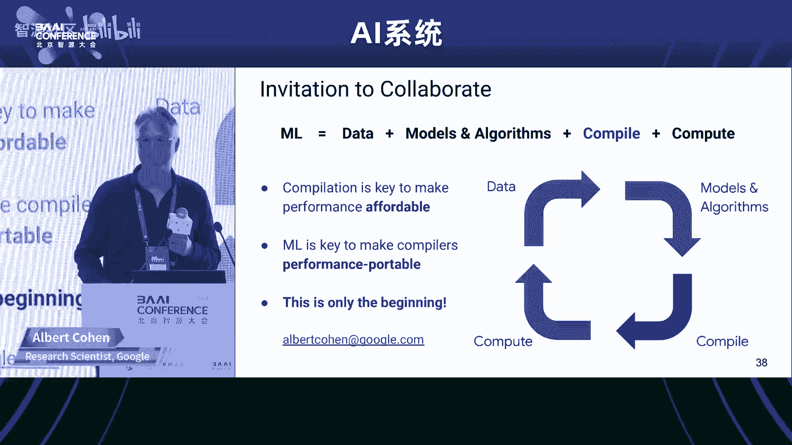

### 未来展望：Tile级操作与MLIR框架

我们提出了两个未来发展方向：

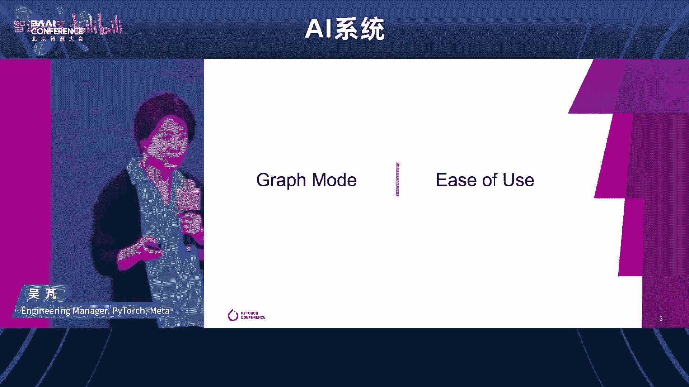

1.  **Tile级操作库**：在完全编译（针对Tile级计算）和动态分发（针对完整操作）之间建立边界。自动为特定领域和硬件合成Tile级操作库，在代码大小和专业化之间取得平衡。
2.  **利用MLIR构建可扩展编译器**：MLIR框架设计用于可扩展性，是构建编译器流程和桥接不同框架的理想基础。其“变换方言”允许以可扩展的方式构建自定义调度语言和自动调优逻辑。

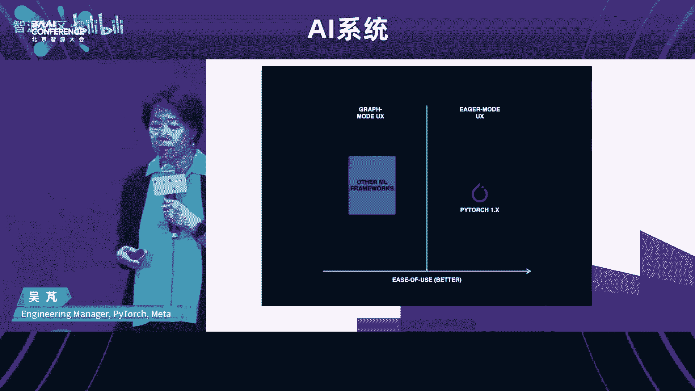

**总结**：AI编译器的道路依然漫长，需要将更多机器学习技术融入编译器本身，并加强学界与工业界的协作。

---

## ⚙️ 第二部分：PyTorch 2.0——将编译器置于核心

上一节我们探讨了通用AI编译器的挑战，本节我们聚焦于一个具体的框架编译器——PyTorch 2.0，看它如何平衡易用性与图模式性能。

### PyTorch 演进：从易用性到高性能

PyTorch 1.0 因其**易用性**和**即时执行（eager mode）** 体验而受到研究人员青睐，但这在性能上做出了妥协。PyTorch 2.0 的目标是引入**图模式（graph mode）** 以获得编译器优化的好处，同时不牺牲1.0的易用性。

其核心是提供了一个简单的API：`torch.compile`。用户只需添加一行代码，即可将模型（或部分）切换到图模式进行优化，编程模型依然是熟悉的即时执行模式。

### 关键技术突破：TorchDynamo

实现这一目标的关键技术是 **TorchDynamo**，它是一个“开箱即用”的PyTorch图捕获器。

*   **部分图捕获与图中断**：不再强求捕获整个模型为一个图，当遇到无法编译的部分（如数据相关控制流、C扩展）时，会安全地“中断”并回退到即时执行。
*   **守卫机制**：为捕获的图添加“守卫”，记录其有效的条件（如张量形状）。运行时检查这些条件，若不满足则即时重新捕获新图。
*   **无缝集成**：整个过程对用户透明，就像即时编译器一样工作。

TorchDynamo在超过14,000个GitHub PyTorch模型上测试，捕获成功率超过99%，并且即使生成部分图，其规模也足以让后端编译器进行有效的优化（如算子融合）。

### PyTorch原生编译器：TorchInductor

TorchDynamo负责捕获图，而性能提升的“魔法”来自后端编译器。PyTorch 2.0 推出了原生训练编译器 **TorchInductor**。

TorchInductor的设计特点：
*   **Python编写**：提升开发迭代速度，更易上手。
*   **通用优先**：设计之初就考虑处理长尾应用，以支持真实模型。
*   **PyTorch原生IR设计**：其中间表示专为PyTorch语义设计，这是其能有效处理PyTorch复杂操作（如原地更新）的关键。
*   **复用成熟组件**：其GPU代码生成器基于**Triton**，快速构建了可用的最小化产品。

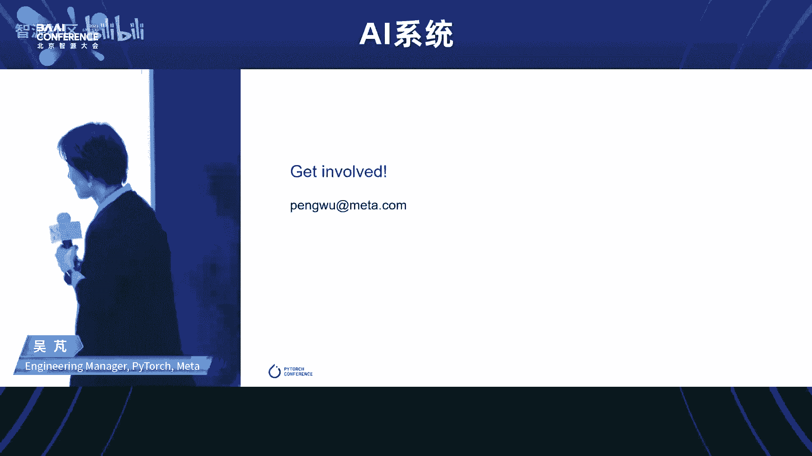

### PyTorch 2.0 的生态定位

PyTorch 2.0 的编译栈定位为**机器学习框架编译器**。其核心价值在于：
*   **为硬件厂商赋能**：让厂商能轻松地将PyTorch模型适配到其硬件上，而无需担心复杂的图捕获问题。
*   **提供多层次集成点**：硬件厂商可以像TorchInductor一样作为同级后端集成，也可以在TorchInductor之下集成（如Intel CPU后端），甚至可以集成到Triton层。集成点越低，复用PyTorch的工作就越多。

**总结**：PyTorch 2.0 通过 `torch.compile` API、TorchDynamo 和 TorchInductor 的协同，成功地将图模式性能与即时执行的易用性结合起来，并通过开放的集成架构推动整个AI硬件生态的发展。

---

## 🚀 第三部分：优化PyTorch以支持生成式AI

上一节我们了解了PyTorch 2.0的整体编译架构，本节我们深入看看它如何针对生成式AI的核心组件——Transformer模型进行专项优化。

### 生成式AI的模型与需求

当前主流的生成式AI模型（如大语言模型、扩散模型）大多是**基于注意力机制的Transformer模型**。它们规模巨大，对训练和推理的**速度与效率**有极高要求。此外，模型规模也催生了**分布式计算**的需求。

PyTorch 2.0 通过三方面来满足这些需求：
1.  **`torch.compile`**：加速各种模型。
2.  **加速的Transformer API**：优化Transformer核心计算。
3.  **PyTorch Distributed**：支持数据并行及完全分片数据并行训练。

### 加速Transformer API：从灵活到高效

PyTorch原生的Transformer API设计优先考虑**灵活性和易用性**，但这可能导致性能损失。一个标准的Transformer实现由许多细粒度的PyTorch算子顺序执行组成。

优化手段主要包括：
*   **算子融合**：将多个操作（如矩阵乘、Softmax）合并到单个内核中，避免实例化大型中间张量，减少内存访问瓶颈。
*   **推理快速路径**：捕获常见的推理模式，并使用针对可变输入序列长度优化的内核。

### 集成前沿注意力优化技术

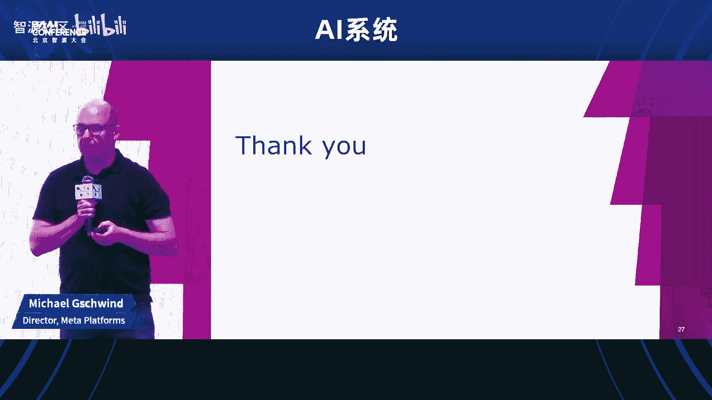

近年来，注意力计算优化取得显著进展：
*   **Flash Attention**：通过分块计算和IO感知算法，在减少内存占用（从O(n²)到O(n)）的同时实现精确注意力，显著提速。
*   **xFormers**：提供一组内存高效且快速的注意力计算组件，在研究中被广泛使用。

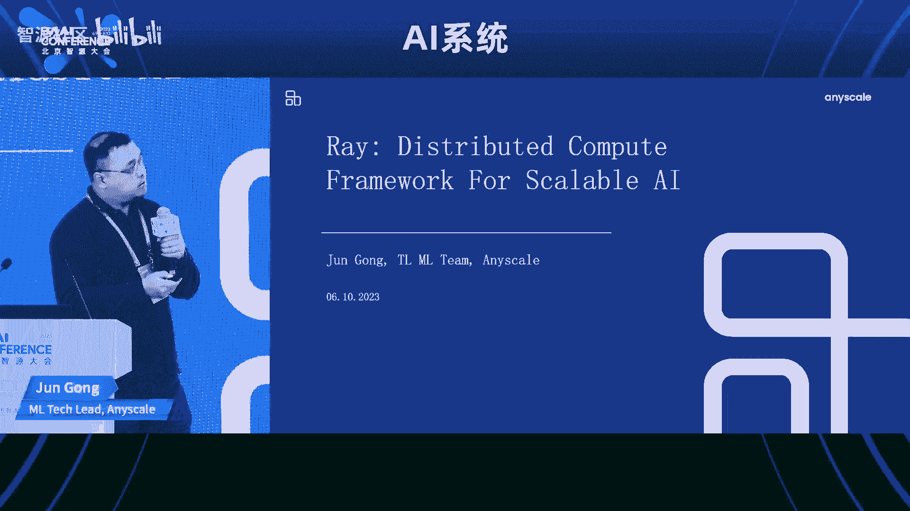

PyTorch 2.0 迅速集成了这些先进技术，引入了新的 **`scaled_dot_product_attention` (SDPA)** 算子。该算子是一个具有多后端实现的调度器，会根据输入形状、数据类型和硬件平台，自动分派到最优的实现（如Flash Attention内核、内存高效内核或回退的数学实现）。

### 实践效果与总结

通过启用 `torch.compile` 和切换到SDPA算子，在NanoGPT等模型上获得了显著的训练加速（约2倍）和内存节省。同时，通过支持**嵌套张量**以处理可变长度序列，在BERT类模型上实现了高达4倍的推理加速。

**总结**：PyTorch 2.0 通过集成Flash Attention、xFormers等优化，并抽象出SDPA接口，为Transformer模型提供了显著的开箱即用的训练和推理加速，同时保持了模型的抽象性和可移植性。

---

## 🌐 第四部分：Ray——面向大规模机器学习工作流的分布式计算框架

上一节我们讨论了单框架内的性能优化，本节我们将视野扩展到分布式计算框架，看看Ray如何支持从数据预处理到模型服务的大规模机器学习工作流。

### Ray简介与生态

Ray是一个开源的分布式计算框架，其最初是为了解决强化学习中模拟环境瓶颈问题而设计的。如今已发展成一个完整的机器学习生态系统。

Ray的核心架构：
*   **Ray Core**：抽象底层计算集群，提供基于Actor模型的简单分布式编程范式。
*   **上层库**：基于Core构建，包括 `Ray Train`（分布式训练）、`Ray Tune`（超参调优）、`Ray Serve`（模型服务）、`Ray Data`（数据 ingest 与处理）等，覆盖MLOps全流程。

### 应对常见痛点：数据、推理、训练与服务

以下是Ray各库针对的常见痛点：

*   **Ray Data：分布式数据摄取与处理**
    *   **问题**：数据预处理常受限于CPU，且需要处理异构集群和超大数据集。
    *   **解决方案**：Ray Data提供资源感知的分布式数据转换，能智能调度任务到合适的节点（CPU/GPU），并默认采用流式执行，避免内存溢出。

*   **Ray Data：批量推理**
    *   **问题**：对海量数据运行训练好的模型进行推理，同样面临数据加载和模型运行的异构性问题。
    *   **解决方案**：Ray Data将批量推理视为一种特殊的数据处理任务，通过优化任务融合和数据序列化开销，相比Spark等框架能获得数倍性能提升。

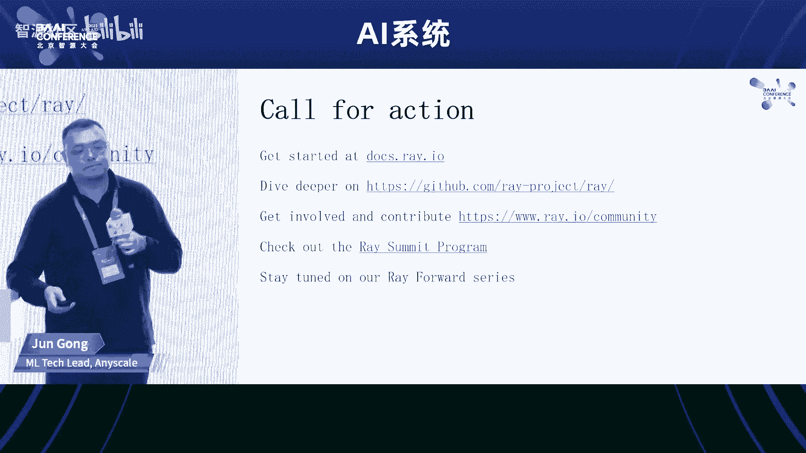

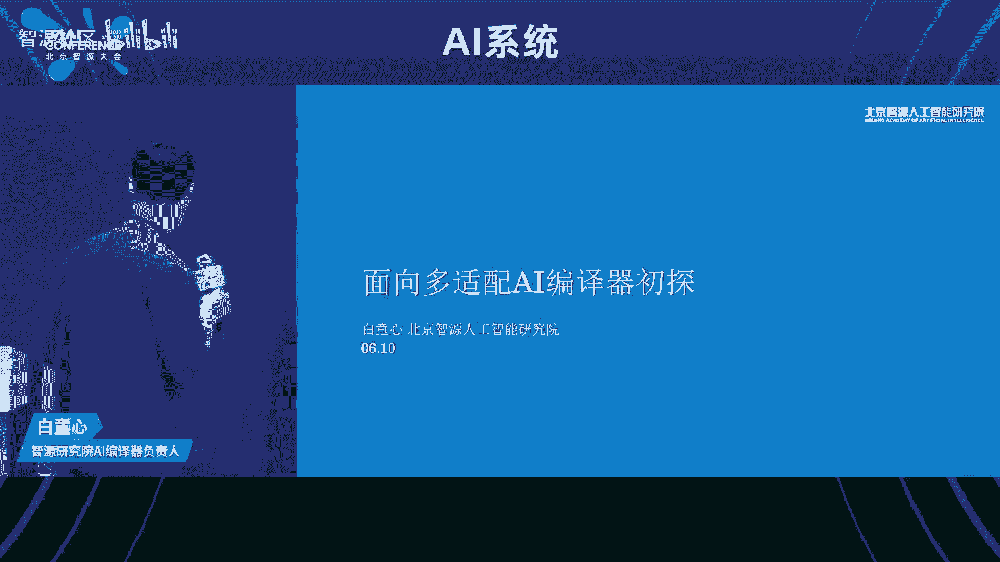

*   **Ray Train：分布式训练**
    *   **问题**：训练框架碎片化，技术迭代快，用户不想被锁定。
    *   **解决方案**：Ray Train不与特定训练框架紧耦合，而是提供与PyTorch Lightning、DeepSpeed、Hugging Face Accelerate等框架的集成，主要负责集群设置和环境管理，让用户能灵活选择底层框架。

*   **Ray Serve：模型服务**
    *   **问题**：生产服务需要自动扩缩容、高可用和模型组合（多模型流水线）。
    *   **解决方案**：基于Actor模型，Ray Serve易于实现高可用部署和复杂的模型组合图。近期还增强了对大模型流式输出和可扩展性的支持。

### Ray与大模型

Ray与大型语言模型的交互是多层次的：
1.  **单节点多卡**：提供开箱即用的示例。
2.  **中等规模训练**：通过Ray Train集成现有生态库进行训练。
3.  **大规模定制化训练**：像OpenAI、Cohere这样的公司直接使用Ray Core来构建自己的训练栈，利用其提升开发迭代速度。

**总结**：Ray通过其灵活的、以Python为中心的分布式抽象，为机器学习工作流的各个环节提供了可扩展的解决方案，并因其在易用性和性能上的平衡，被许多公司用作内部的机器学习平台。

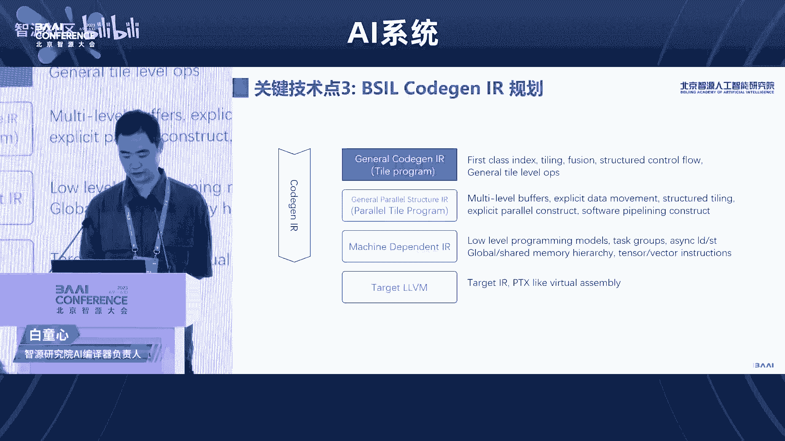

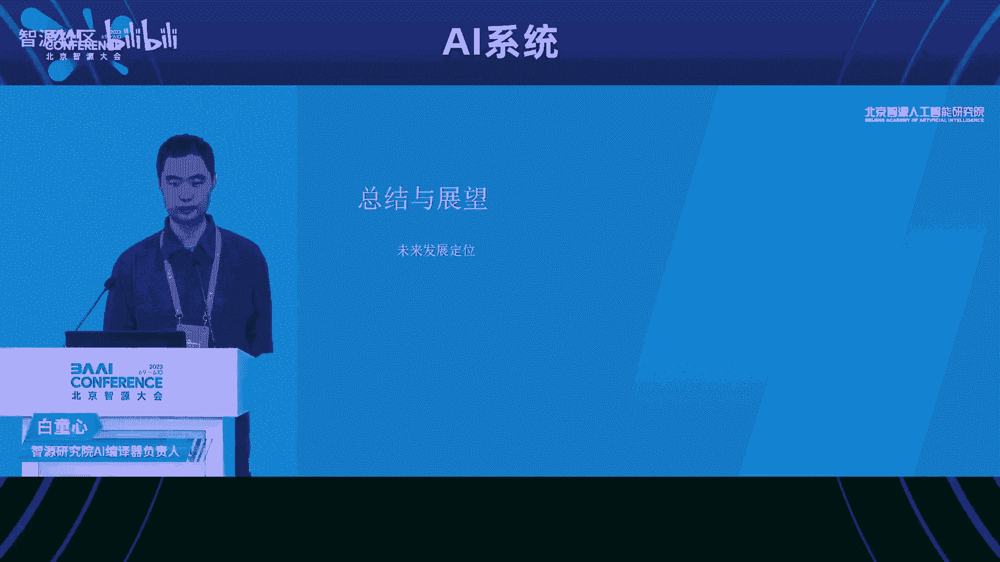

---

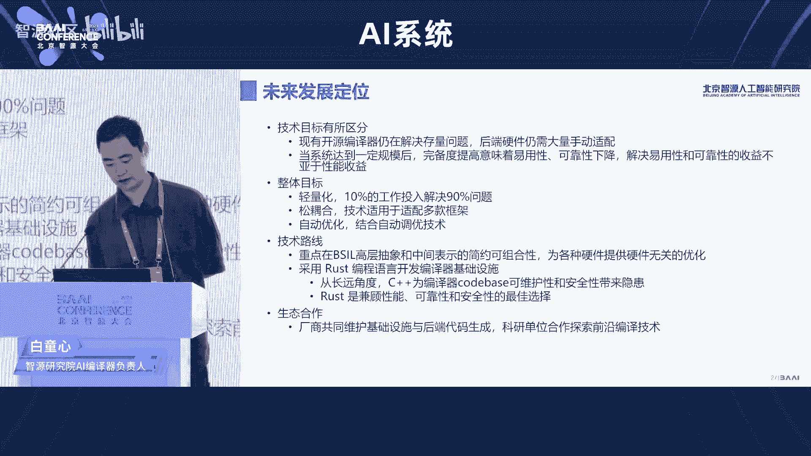

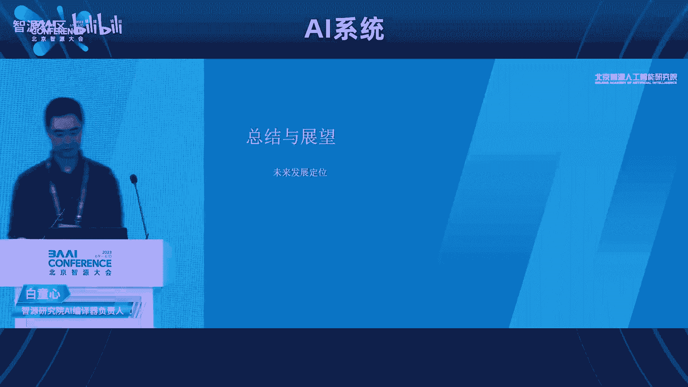

## 🛠️ 第五部分：智源AI编译器的探索与实践

上一节我们了解了通用的分布式框架，本节我们回归编译器主题，看看智源研究院在构建下一代AI编译器基础设施方面的思考与实践。

### 动机与目标

智源作为模型与算法研究机构，深入系统层支持出于以下考虑：
1.  帮助国产AI芯片更顺畅地适配上层框架。
2.  探索如何通过编译技术提升性能与易用性。

通过调研，发现当前AI编译器生态存在挑战：厂商对多框架适配、编译器泛化能力有较高诉求；现有框架自带编译器（如PyTorch+Triton）在易用性和性能上优秀，但在迁移性和扩展性上可能存在局限。

智源编译器的三大目标：
1.  构建统一、中立的下一代AI编译器基础设施。
2.  打造一个供研究和产品落地的开源平台。
3.  切实帮助厂商适配大模型等应用。

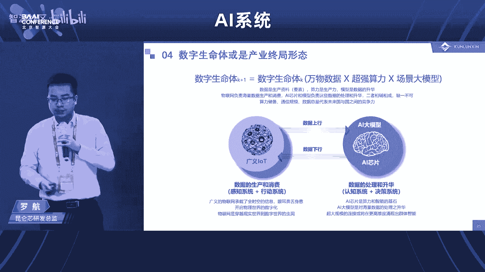

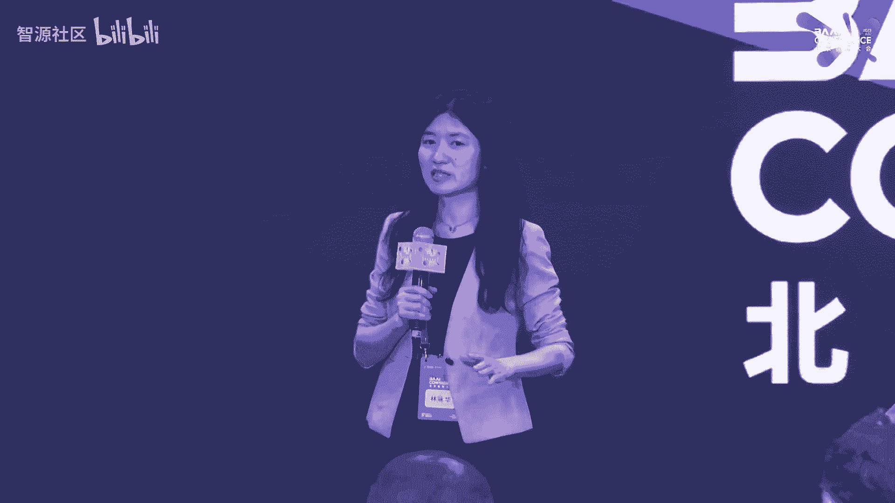

### 技术路线与核心设计

整体设计遵循分层思想：
1.  **前端**：通过TorchDynamo等机制捕获不同框架的计算图，统一到**图级IR**。
2.  **中层优化**：在硬件无关的图IR上进行变换，然后利用代价模型进行算子拆分/融合，再 lowering 到**算子级IR**。
3.  **底层代码生成**：在算子级IR上进行面向目标的优化和代码生成。

核心创新在于自主设计的轻量级、层次化中间表示 **Basis IR**。它采用类似MLIR的Region/Block结构，并将张量操作抽象为四大类：
*   **View操作**：仅涉及索引映射（如转置、广播）。
    *   **公式**：`view(X): Y[i,j,...] = X[f(i), g(j), ...]`
*   **Map操作**：逐元素计算。
    *   **公式**：`map(X): Y[i] = op(X[i])`
*   **Reduce操作**：降维计算。
    *   **公式**：`reduce(X): Y[...] = ⊕(X[i, j, ...]) over i,j`
*   **Join操作**：类张量收缩操作（如矩阵乘）。
    *   **公式**：`join(A, B): C[i,k] = ⊕(A[i,j] ⊗ B[j,k]) over j`

这种分类有助于更精确地表达计算和优化模式。

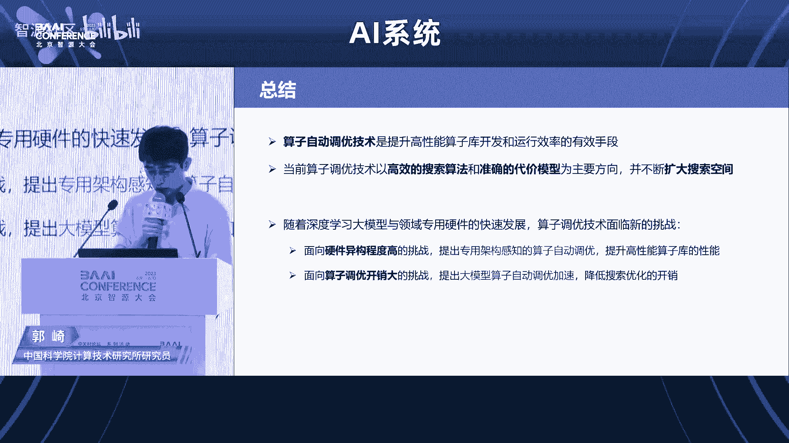

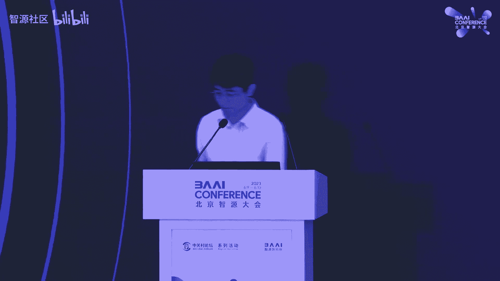

### 未来展望

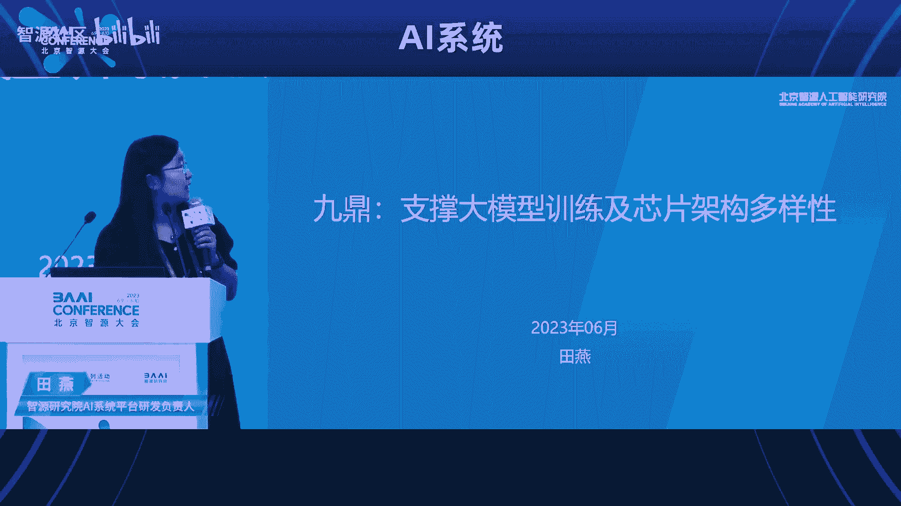

智源编译器希望与现有开源编译器形成差异化：
*   **聚焦易用性与可靠性**：在系统复杂度提升时，这两点的收益可能不亚于性能收益。
*   **保持轻量化与松耦合**：不绑定特定框架或硬件生态。
*   **探索Rust开发**：从长远可维护性和安全性考虑，探索使用Rust开发编译基础设施。
*   **强调生态合作**：希望与厂商共同维护基础设施，与学术界合作探索前沿技术。

**总结**：智源编译器项目是一个中长期的探索，旨在通过创新的IR设计和开放的生态合作，为AI编译领域提供新的解决方案。

---

## 🧩 第六部分：国产算力与大模型训练的产业实践

前面几节我们主要关注软件栈，本节我们将视角转向硬件和产业，看看国产AI芯片厂商如何应对大模型训练的系统性挑战。

### 计算产业发展与AI芯片的必然性

从历史看，计算产业架构随应用需求而演进：PC时代（x86+Windows）、移动互联网时代（ARM+Android/iOS）。AI时代，由于**非结构化数据（向量化）的爆发**，传统CPU处理乏力，专精于此的**AI芯片**应运而生。大模型的“涌现”能力预示着模型规模将持续增长，对**AI算力**的需求呈指数级上升。

### 芯片公司的“三道窄门”

AI芯片公司产业化需跨越三道门槛：
1.  **量产**：覆盖前期巨大投入，证明芯片成熟度。
2.  **生态**：构建完整的软件栈（编译器、库、社区），让客户能用起来。
3.  **产品化**：形成软硬一体的标品，降低部署成本，实现业务闭环。

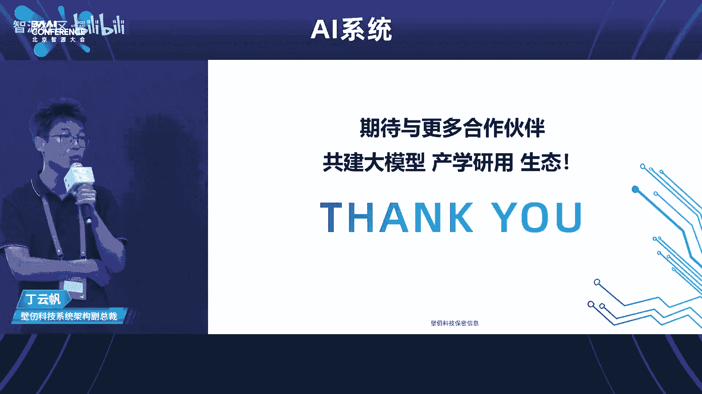

### 昆仑芯的实践：算力底座与全栈优化

昆仑芯依托百度的AI全栈生态（芯片-框架-模型-应用），提出大模型解决方案：
*   **硬件层**：提供从卡、服务器到集群的多种产品形态。
*   **软件层**：提供大模型加速库，支持数据并行、模型并行、流水线并行、分组切片、参数分级存储等优化技术。
*   **生态合作**：与智源研究院深度合作，支持FlagEval大模型评测平台，完成文心、CPM、EVA等系列模型的适配与性能验证。

### 产业终局展望：数字生命体

大模型正改变产业范式：从众多小模型解决分散问题，收敛到基于Transformer的大模型作为基座，再通过微调解决垂直领域问题。未来产业可能分层：
*   **底层**：少数拥有雄厚算力的大公司训练基础大模型。
*   **中间层**：高科技公司基于基座模型开发行业模型。
*   **应用层**：大量创业公司基于大模型开发原生应用。

最终，海量的IoT设备、AI算力与大模型、具体场景相结合，可能催生出类似于“数字生命体”的产业终局形态。

**总结**：国产AI芯片厂商正在通过跨越量产、生态、产品化的门槛，并与研究机构、应用方深度合作，积极融入大模型产业生态，为国产算力支撑大模型发展提供实践路径。

---

## 🤖 第七部分：面向大模型的算子自动调优技术

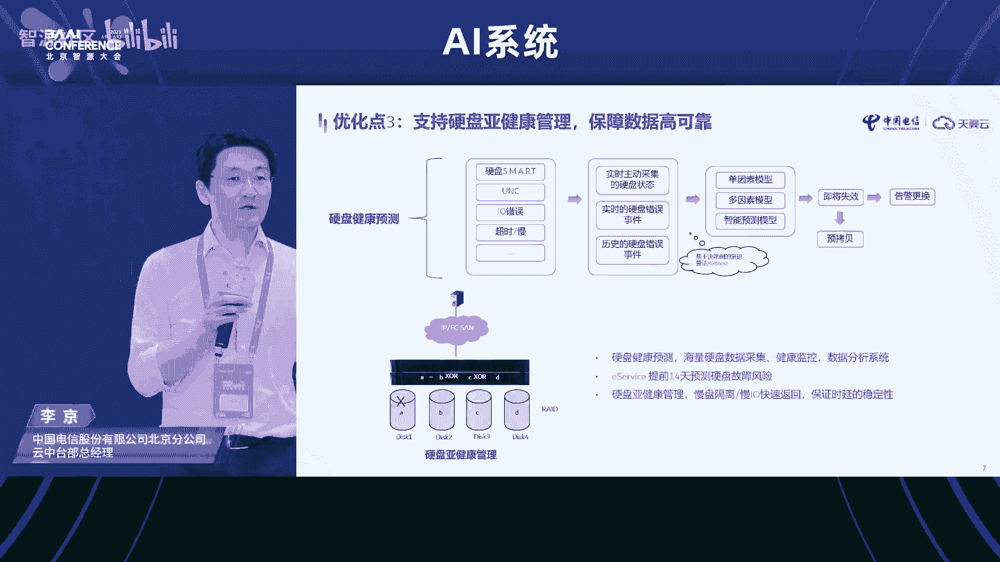

本节我们深入编译器中的一个关键技术点——算子自动调优，看如何利用自动化方法提升高性能算子库的开发与运行效率。

### 背景与挑战

高性能算子库是连接算法与硬件的关键桥梁。当前主要依赖专家手工优化，开发周期长、难度大。**算子自动调优与代码生成**是提升效率的有效途径。

大模型时代为算子调优带来