# 具身智能与强化学习论坛

## 📚 课程概述

在本节课中，我们将学习具身智能与强化学习的基本概念、核心挑战、前沿研究以及未来展望。课程内容基于北京智源大会的论坛讨论，涵盖了从理论到实践的多个方面，旨在帮助初学者理解这一领域的关键问题和发展方向。

---

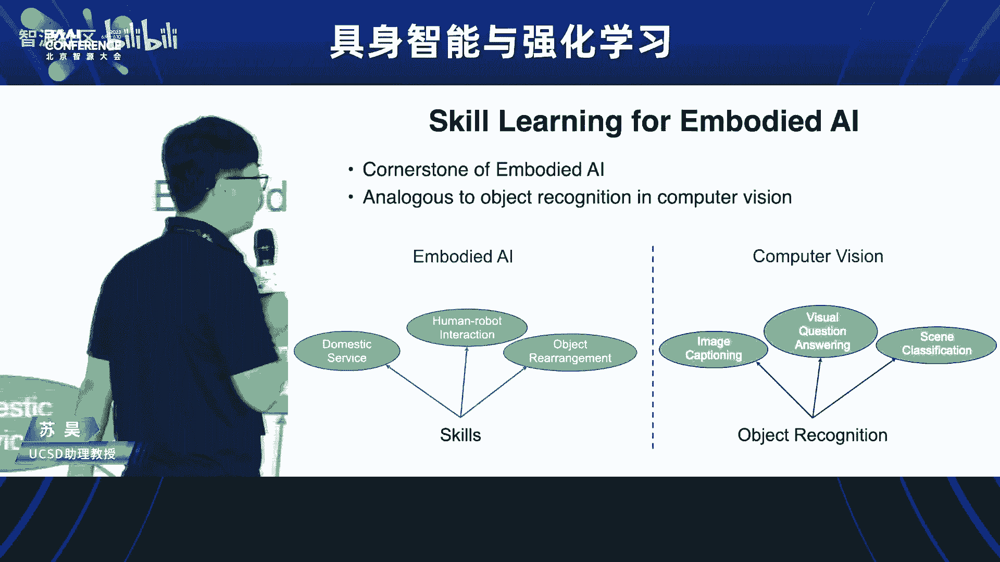

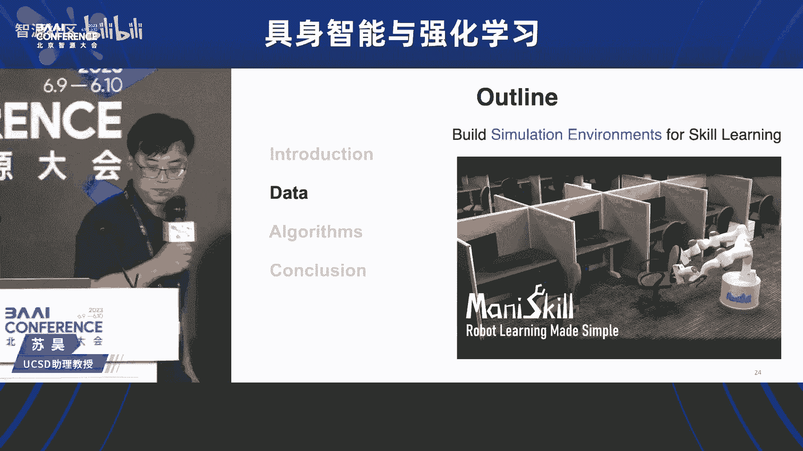

## 🎤 论坛背景介绍

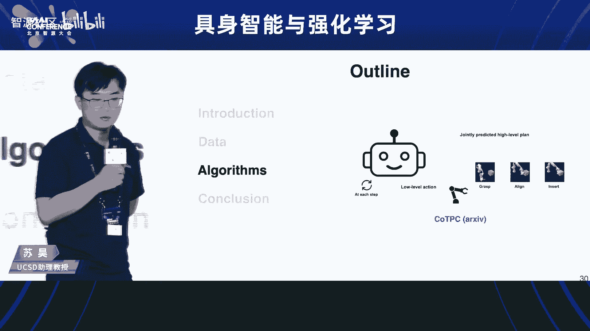

欢迎各位来到北京智源大会的具身智能与强化学习论坛。我是北京大学的助理教授王鹤。首先，我来介绍一下今天论坛的背景。

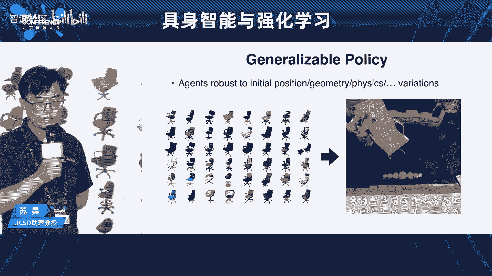

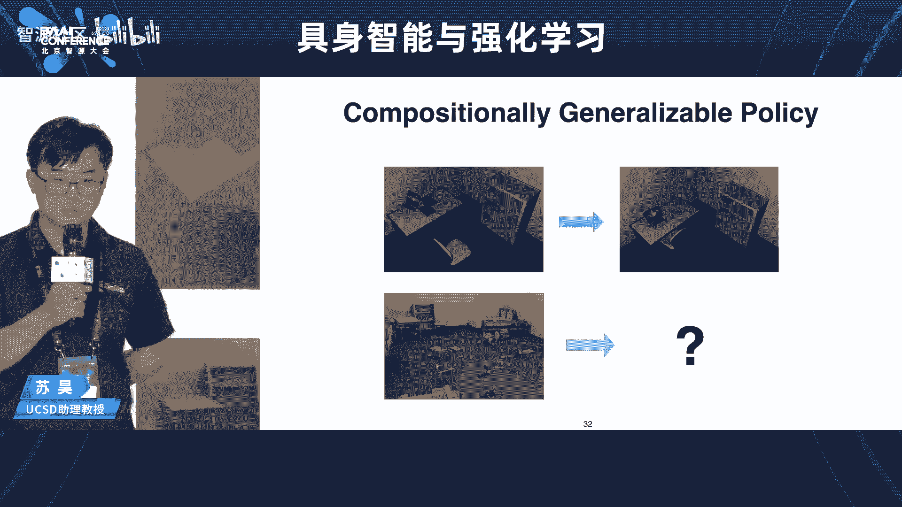

今天，在2023年智源大会上，我们畅谈具身智能与强化学习。实际上，我们看到最近一段时间，ChatGPT引爆了语言大模型，GPT-4引爆了多模态大模型。智能体和大模型的能力不断丰富，从能流畅地与人类交流，到理解图片中的世界并与文字进行交流。那么，我们再问下一步，大模型和智能体应该被赋予什么样的能力？

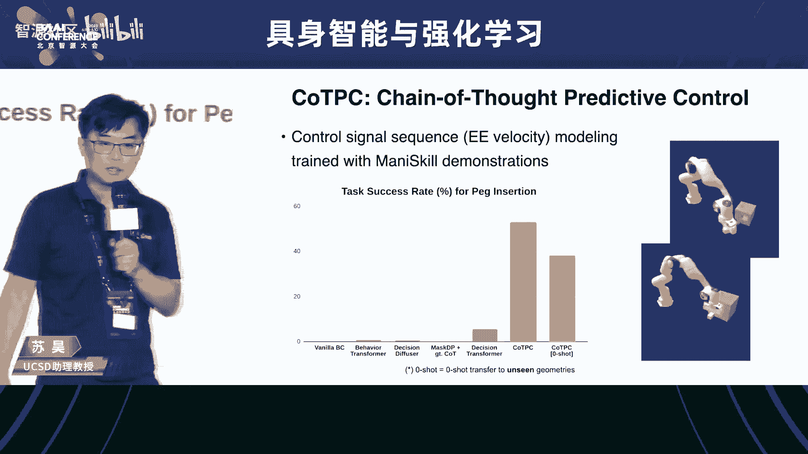

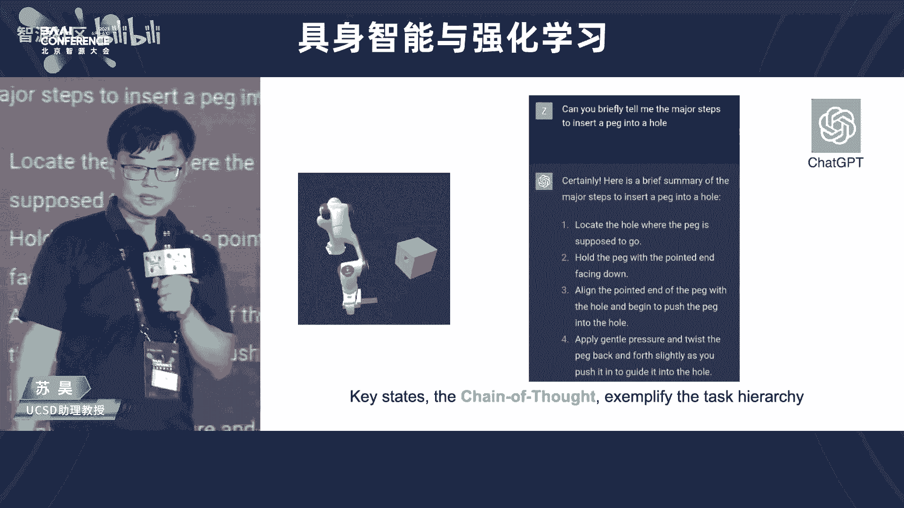

2023年对于具身智能来说是值得铭记的一年。谷歌发布了Palm-E，这是第一个具身多模态大模型，让我们看到了智能体从语言到图片，再到在物理世界中采取行动的能力。智能体能够在具有物理身体的机器人中，与世界进行智能交互。这是从模型层面的进展。

我们看到从谷歌出来的创业公司Everyday Robots，他们的移动机器人搭载了大模型，可以在谷歌的厨房里拿取东西，通过自然语言与人类沟通，并在大楼里进行垃圾回收。特斯拉的人形机器人也再次引爆了人们对具身智能和未来通用机器人的畅想。所以今天，我们欢聚一堂，探讨从今天的大模型到未来的通用人工智能体，具身智能与强化学习在其中将扮演什么样的角色。

今天，我们非常荣幸地请到了海内外顶尖的学者共聚一堂。有来自美国UCSD的助理教授苏浩老师，来自北京大学的助理教授卢宗清老师，来自清华大学的副教授孙亚楠老师，还有来自中科院计算所的研究员蒋树强老师。现在，我们快速进入下面的第一个报告。

---

## 🧠 报告一：为具身智能建模三维物理世界

欢迎来自UCSD的助理教授苏浩老师给我们带来第一个报告：**Modeling the 3D Physical World for Embodied AI**。

苏浩老师是美国加州大学圣迭戈分校计算机科学与工程系的助理教授，现任UCSD具身智能实验室主任。他致力于建模、理解和与物理世界进行交互的算法研究。他在计算机视觉、图形学、机器学习和机器人领域的顶级会议和期刊上发表了多篇论文。苏浩在斯坦福大学和北京航空航天大学分别获得计算机与应用数学博士学位，曾获得美国计算机图形学会最佳博士论文提名。截至2023年，他的论文被引用近8万次。他也参与了一系列知名工作，如ImageNet，并主导了ShapeNet、PointNet等重要的三维深度学习关键性工作。近三年，他专注于以具身智能为核心的下一代人工智能体系的研发。

让我们以热烈的掌声欢迎苏老师给我们带来报告。

**苏浩老师报告内容：**

非常荣幸能够来到这个讲台上，跟大家齐聚一堂，亲身讨论这个问题。我的报告会用中文进行，但我主要的教学工作都是用英文进行的，所以当我用中文讲的时候，有时候可能不太准确或者不太流利，首先希望大家能够原谅。

我的题目是 **Modeling the 3D Physical World for Embodied Intelligence**。这里的一个关键词就是所谓的Embodied Intelligence，或者具身智能。具身智能到底是什么呢？这个词近年来开始变得很流行，但也许不是每一位老师和同学都清楚它的内涵。事实上，在整个研究界中，这个词的内涵也没有完全对齐。今天，我想跟大家分享一下我对所谓具身智能的定义的理解，以及我们组在这个问题上的一些前沿性工作。

为了更好讲解我自己对这个事的理解，我会首先说一下我自身的研究经历，帮助大家更容易地理解这个认知发展的进程。

具身智能最近被引进来，主要是为了跟传统的互联网智能进行一次区分。我也是在互联网智能时代进入了人工智能研究。2009年，我有幸作为主要贡献人参与了ImageNet的创建。2012年，见证了AlexNet在ImageNet上引爆了深度学习的时代。在图片理解的过程中，我开始认识到物体关系的重要性。物体的关系实际上是在三维的物理世界中的。所以，我对三维视觉产生了很大的兴趣。大约在2014年左右，开始考虑如何去铺垫三维视觉的工作。2015年左右，我们当时做了ShapeNet，后来又基于ShapeNet做了算法PointNet。

时间轴来到2017年左右，差不多是我的博士完成的时候，有一个点就非常值得思考。以当时的技术发展来看，对于人类定义的概念，靠足够的数据、足够多的算力、足够大的网络，看起来它的核心技术问题已经基本上清晰，技术方案也清晰了。是不是这样，人工智能或者计算机视觉这样的问题就要被解决了呢？在我开始当教授之后，就非常多的去思考这个问题。那么，答案可能不是这样的。

我们可以说，在互联网智能时代，最大的问题就是对于人类已经定义好的概念，如何去识别、如何去理解。但是我们想想这个例子：大家可能很多同学，尤其是男生都有踢足球的这样一种体会。当你踢足球的时候，你知道你可以让这个球在空中走出一个弧线来，比如香蕉球。怎么踢香蕉球呢？你要用脚的一个部分打球的一个位置。具体怎么操作，你能够通过看视频得到吗？你能偷偷读书得到吗？他们都会帮助你，但是你知道你必须要去球场上练习。所以这个例子就说明什么呢？像踢香蕉球这样的东西，手工标注训练数据会是非常非常的困难，甚至有可能是不可行的。对于相当多的所谓的智能认知，它必须在做中学。所谓感知、认知和行动，它们是密切相关的，而且构成一个闭环。像这样一种认知，在最近几年，在如何识别这个问题得到突破之后，就会变得越来越受大家的重视。其实这是一个很本质的问题，这就回到了人类认识的理性极限在哪里这样一个哲学级的层面上。

如果要往前追溯的话，可能可以追溯到笛卡尔。在认知科学界，60年代也有很多人去回顾它。我这里回顾一个在认知科学界曾经被提出来的所谓的具身假设：**智能是智能体在智能体与环境的交互中涌现，是感觉运动行为的结果**。所以在这种观点之下，没有交互、没有具身，我们的智能就没有办法跟这个物理世界真正的打交道。当然也可能可以稍微引申一点，像大模型里边的相当一部分幻觉问题，大家都知道这是重要问题。有一部分的这种错误，它可能必须要回到物理世界，通过验证、通过假设检验完成。具身智能一定是人工智能中不可或缺的一环。

所以在具身智能时代，核心的科学问题是什么呢？我认为是**概念的涌现、表征的学习**。但是，它的基础框架是在耦合感知、认知和行动这样一件的大框架下。因此我们可以说，具身智能的最终目标是构造像人一样聪明的、能够自主学习的这种机器人智能体。但是，它跟传统的机器人科学在方法论上可能是有些区别的。这个区别就在于它是数据中心的，关心的是如何从数据中得到概念的涌现和表征的学习。

从数据科学的角度来看，从具身智能中，数据有非常多有意义或者说值得我们思考的事情。

以下是具身智能数据的特点：

1.  **多模态学习**：机器人通过看这个世界来了解这个世界，就有图像。如果它打算从互联网视频上学习，如果它打算从人类示范中学习，那么这里就有视频和音频。如果它接受人的指导，如果它需要描述任务，如果它需要对计划产生一种规划，那么需要有语言。交互是有力反馈的，那么这里它需要触觉反馈数据。最后，交互最终会变成某一种控制信号，因此它的输出必然是一种控制信号序列。所以具身智能必是一个多模态的设置，同时也就涉及到本质上来说各种各样的神经网络的架构，来处理矩阵、集合、图、序列等等。

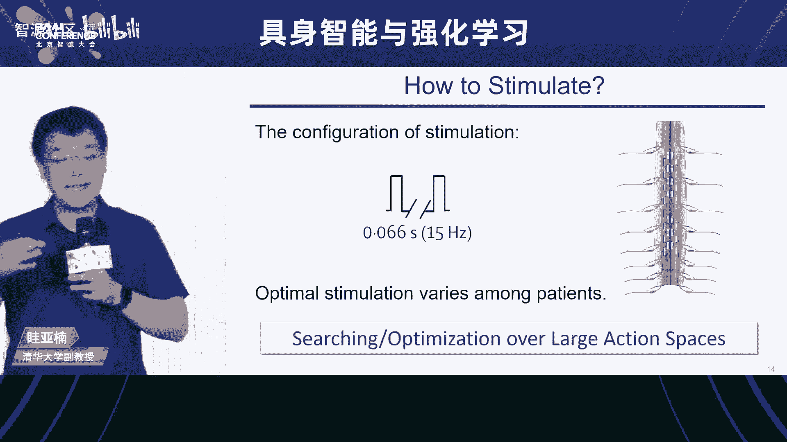

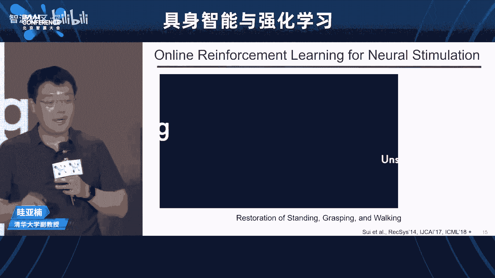

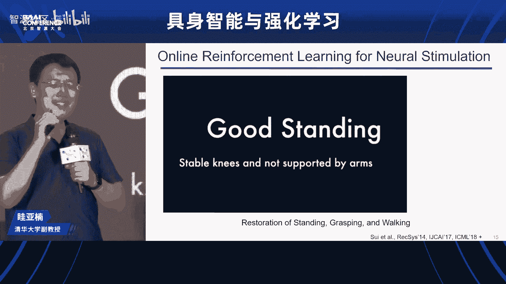

2.  **数据的获得**：从互联网智能到具身智能，这里也是个巨大的变化。互联网智能时代，总体的模式就是人类制作数据集，人类做标注，算法建立映射。而到具身智能时代，一个机器人应该能够自主的去学习，应该能够主动的跟环境交互中来收集数据。数据收集人不只是人，更是机器人自身。它必须能够通过历史来学习。这就涉及到了决策论中的一个很本质的一对矛盾：**探索和利用**。

3.  **数据的处理**：当数据被收集到之后，应该怎样被处理？数据从感知端流动到决策端，中间会经过一次对世界的建模。所以这里就产生了任务驱动的表征学习。比如除了我们要知道它叫什么以外，对物体的功能的一种理解。比如对于我们从来没有见过的物体，通过交互需要新的概念，包括物体的概念、材质的概念或者部分的概念等等，功能的概念。这些涌现现象怎么解决？这都是新的科学问题。

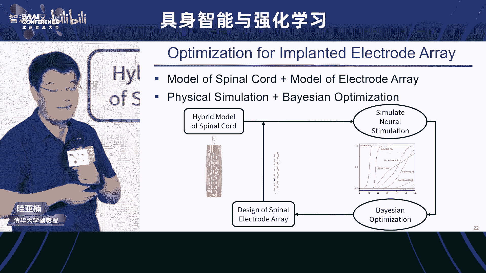

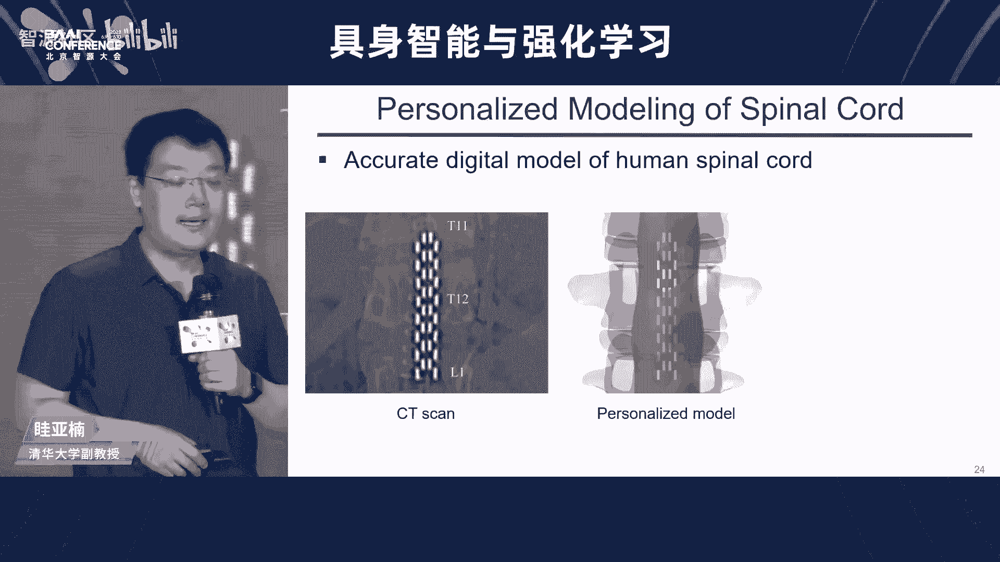

4.  **性能评估**：对于具身智能体的性能评估也是一个困难。它也面临很多问题。如果你是从计算机视觉来的话，这里边有些问题你过去可能并不太关心。比如如果要机器人整理一个混乱的屋子，它要能够去处理任何一个物体，还要能够把很多的基础技能串联起来。因此我们考察的角度，比如任务的完成率，还有比如有一个叫样本复杂度的概念，也就是说为了达到一定的成功率，你需要做多少次交互才是必要的。最后，决策这件事情是一个很长的序列，你可能需要某一种所谓的组合泛化能力。

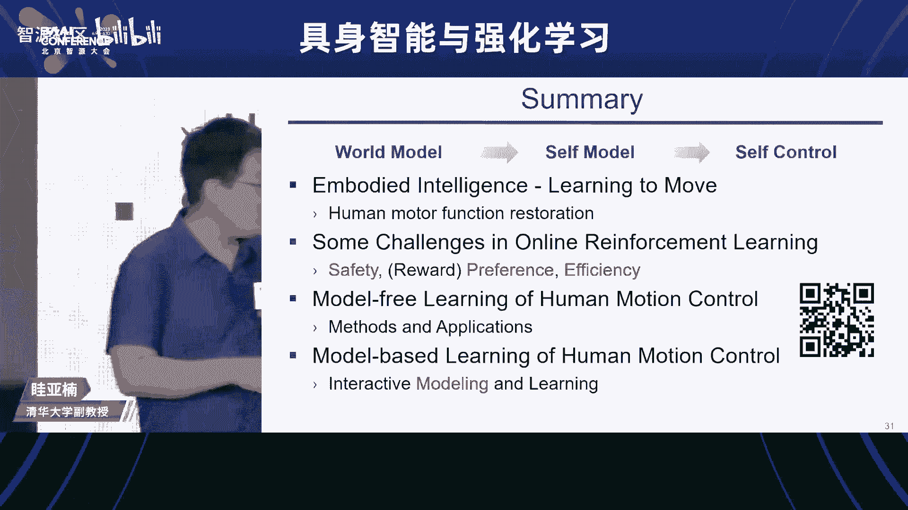

所以所谓具身智能，它其实是一个相对遥远的目标，它能够涵盖人工智能将来也许是一半的东西，另外一半那当然就是不具身的智能。它基于40年代的控制论、信息论、博弈论，60年代的认知科学，以及近年来视觉、图形学、自然语言、机器人、机器学习等等的进展。它是一个综合性的任务，是人工智能的下一个里程碑式的目标。

下面我再说一点我个人或者我们组对所谓的具身智能的核心挑战的一个理解。这样一个理解，我的感受是它在逐渐成为一个学界的共识，但并不是每个人都完全同意的。在这里，我来展示去年的两个工作。去年是具身智能有很大进展的一年。右边这个工作是谷歌的工作，它是在真实世界中的机器人，它跟大模型结合起来，工程师提前预定义的一些操作技能结合起来。左边这个工作是我们组今年在ICLR发表的，一个所谓移动物体操作的研究，通过强化学习学会了这么一个机器人去做这些事情。

虽然这些演示看起来都很漂亮，但是它背后是有一些小秘密的。什么秘密呢？它们基本的实现方法都是所谓的**技能链接**。这里我对技能稍微做一个定义：这里的技能或者叫基本技能，它是一些个短句任务的求解器。短句基本上你可以从时间上认为是两三秒或者最多是四五秒这么一个尺度。对于复杂的事情，它总是由这些基本的东西来串联起来的。比如我们这个工作训练了七个基础的操作物体操作技能。而谷歌的工作，如果我没记错的话，当时是40多个基础的物体操作技能，它是工程师手工设定的。

但是，事实上如果你看这些演示，他们到底能不能在真实世界中部署？那么你会认识到基础操作技能很大程度上是一个瓶颈。为什么呢？因为这个时候机器人要对付复杂的物理。这里的物理既包含光学的部分，也包含运动的部分。视觉的挑战也包含摩擦力、物体的转动惯量的变化，甚至是软的物体还是硬的物体之类的东西。还有物体的形状的变化。还有，当机器人去操作的时候，它的动作空间可能是高维的，例如你用五指，它有几十个关节，这些关节的控制这都是很困难的问题。

可以说，对于具身智能来说，尤其是像机器人似的这样的具身智能，那么我会认为所谓的物体操作技能的学习是其中的一个基石性的任务。它的地位就好像在计算机视觉里边的物体识别一样。如果识别能完成，那么剩下的很多事情都没有那么难。

所以下面呢，我就会讲讲我们组有关基本的操作技能学习的一些近期的代表性工作。这是一个采样式的介绍，如果对更多的事情感兴趣，可以看我的主页。

我会分成数据和算法两部分来介绍。

### 第一部分：数据

如果我们的具身智能也打算走大模型的路线，那么我们就需要大数据。大数据哪里来？两个基础的来源：真实世界或生成合成数据，当然就是指的模拟器。

当然在真实世界中采数据是有很多手段的，比如通过遥操作，比如在真实世界中去做强化学习等等。在这里，我主要想讲的是模拟器有一些真实世界数据收集所不可比拟的优点。

以下是模拟器的优点：

1.  **可扩展性**：真实数据收集需要很多真实的机器人。机器人的造价是高的，而且很多时候是危险性问题，而且也很容易坏。我们的深度学习之所以这么成功，一大原因就是因为显卡便宜。一块显卡当年可以做很多事，但是现在也变得受到了很多的制约。如果具身智能想大的发展，它的可扩展性、低成本必是一个重要的事情。
2.  **可复现性**：传统机器人很多时候都是基于视频来验证成功与否的。对于当年通过物理建模、通过控制理论的方法，这当然是可以的。但是如果我们的具身智能现在是以数据为中心的，这就有问题了。我们知道对于这种黑箱方法可重复性，基于大量的测试来验证它的性能是必要的。但是用真实机器人，这很难，因为机器人的出厂设置不一样，或者型号不一样等等，都会带来问题。因此，再通过一两个视频来看是不是做了一个好的具身智能算法，这显然是不太合适的。真实世界很难做到这么大规模的严谨的测试，这是模拟器也是有必要的。
3.  **快速原型**：如果一组硬件用来收集数据，但是硬件又升级了，这个时候你的演示可能会作废的。但是在模拟器里这一点要好很多，因为模拟器的数据收集的成本要相对低一些。

总之，我认为模拟器是一个一次投资，但是持续开发成本会较低的这么一种解决思路。基于这样一种思想，我们组长时间都在推动机器人模拟器这件事情的发展。今年我们做了一个工作叫做 **ManiSkill 2.0**，它是有关物体操作的一个统一的测试平台。现在有20类的操作技能或者任务的家族，超过2000个物体，以及包含了超过400万个物体操作的实例。

这儿有一个视频来看看。这是一个简单的推椅子的任务，这里我们建模了摩擦力、建模了碰撞等等，都是有很多精细的建模的。我们在计算机视觉、图形学、机器人等等会议上发了很多的文章，文章都是去思考如何提升它的真实性，从而使得它尽可能的能够在模拟器里，我们尽可能的避免创造在真实上不必要存在的一些困难。

我这儿给大家一个我们最近的一个有关触觉仿真的工作。我们通过有限元方法对基于形变的触觉传感器进行了仿真，并且可以证明的是，通过强化学习，你可以学到一个不需要视觉、只靠触觉反馈的这样一个对于任意一个物体的精细插孔操作的策略。那么在模拟器中进行训练之后，是可以直接的被迁移到真实世界中的。当然这个工作我们也是刚刚完成它的代码的开源还没有进行，我们会逐渐的去做这件事情。

### 第二部分：算法

下面我讲一讲算法的事情。

我们不管是通过真实世界还是模拟器，假设我们已经能得到一些数据了。那么下面一个问题是，我们用什么样的算法来得到这种鲁棒的、可泛化的物体操作策略？这里通过模拟器，我们是比较容易去测试它的方法性的。比如这么多的椅子在这个房间里，你都希望它能够被推走，推到一个指定的位置。

再一个就是所谓的组合泛化问题。作为决策，你应该尽量的做到在简单的环境中进行训练之后，这个策略能够在复杂的环境中被使用，所谓的组合泛化。

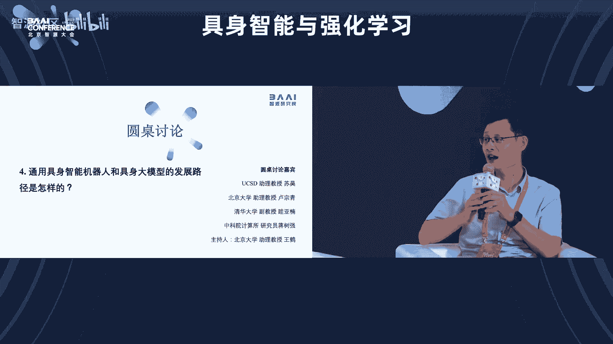

那么要点就是考虑如何让我们的策略是更加结构化的。那么我们考虑一种策略是，比如用简单的神经网络，这是强化学习一直在做的事情，比如用MLP或CNN来表达这个操作策略。这个问题就在于它的泛化性是比较成问题的，尤其是组合泛化性。当然如果用所谓的基于规则的系统，那么在你的规则能覆盖到的地方，它的组合泛化性和泛化性相对都是好的，但是它不具备灵活性，比如它很难能够通过示例来进行学习。

所以这样来看的话，我们能不能走一个中间路线？也就是说我们能不能考虑某一种结构化的、基于神经网络的策略呢？这是这样一个思考的重点。那么从理论上来说，背后的思维应该是叫做**算法对齐**。也就是说你的神经网络的结构设计，应该能够对应你的决策所需要的一种算法的推理过程。

给大家一点点感觉，比如你在理论上可以证明，比如2020年我们曾经展示过，实际上图学习方法可以去近似任意的动态规划可计算函数。同样的，近年来还有更强的结果告诉我们，为什么GPT这样的Transformer-based模型这么强大，因为实际上它的表达能力的上限是它可以近似任意的图灵可计算函数。那么我们的决策这件事情，背后有很多的推理，我们当然希望追求一种图灵可计算的函数逼近能力能够实现它。

因为这个Transformer这一类的大模型或者序列模型在自然语言上取得了很大的成功，所以我们也收到这件事情的启发，想看一看，毕竟控制信号也是序列，我们是不是有好的思路，能够用像语言模型一样的建模方法去弄它呢？那么我们今年有一个最近的工作叫做**基于思维链的预测控制**。这里我们考虑的是把终端控制器的速度控制信号，也当成是一种像语言一样的token去建模。因为我们有了ManiSkill收集的很多的轨迹，这使得我们有可能探索这个方向。所以这也是模拟器的一个好处，也许它做的东西还没有一步到位，但至少它降低了你的实验成本。

至少从结果上来看，我们跟之前的一些其他的序列建模控制信号序列建模的方法，比如Decision Transformer、Diffuser等等相比，在一些很困难的精细控制任务上是取得了很大的提高的。这儿的精细控制是，比如我现在打算把这个棍子插到这个洞里去。当然这里有很多的随机性，棍子的粗细位置都会变化，这个洞的大小、位置大小也会变化，但是我们有个很高的精度要求，就是只允许有3mm的误差。在这么困难的一个任务之下，你发现强大的大模型是有好处的。

好，我下面具体说一下。我们这个方法的核心思想实际上是仿照了所谓的思维链技术。因为大家如果对语言模型有一定的了解的话，大家知道这个语言模型之所以那么强大，能解很多的数学题，它用了一个叫“一步一步思考”的技巧，也就是思维链的技巧。它把复杂的事情变成一步一步的去完成的。那么一步一步去完成这件事，就开始逼近我前面讲的所谓的图灵可计算的这样一种程序的、对齐的思维模式。

所以我们这儿把整个物体操作中的关键状态，用它来构成这个思维链。例如说对于这个插入任务，这儿的关键状态就包括手抓住这个棍子、棍子已经跟孔洞对齐、棍子已经足够深地插入到了孔洞中。这些关键帧就可以成为一种操作序列的思维链。那么为什么是这些状态呢？很有意思的是，像ChatGPT这样的大语言模型，它很强的，你问它所谓的把一个棍子插到洞里分几步，他是真的可以告诉你的，他认为就是这样的。

但这后边有些更本质的原因。这个更本质的原因是什么呢？那就是