# 基础模型前沿技术论坛

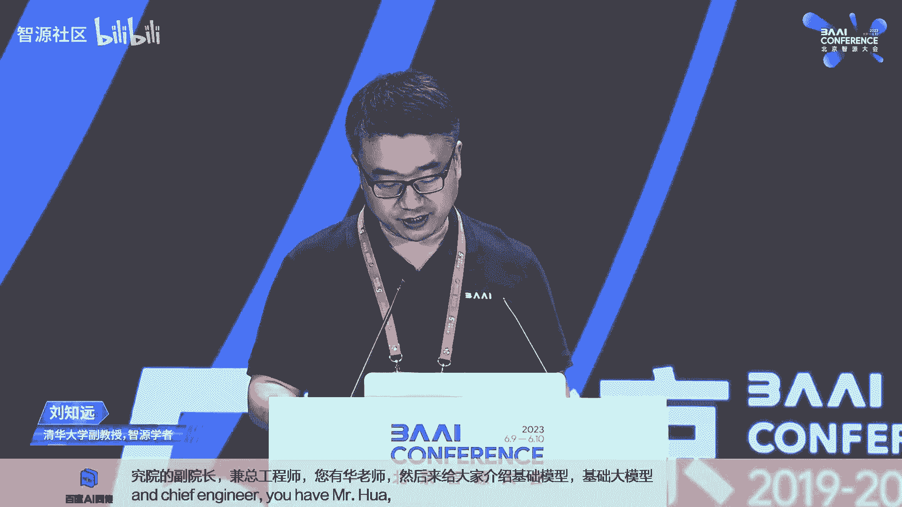

## 课程概述 📚

在本节课中，我们将学习基础大模型的前沿技术，包括大模型工程化、人类反馈强化学习、多模态大模型以及高效扩展大模型的方法。课程内容源自智源社区举办的论坛，由多位一线专家分享。

---

## 开幕致辞与背景介绍 🎤

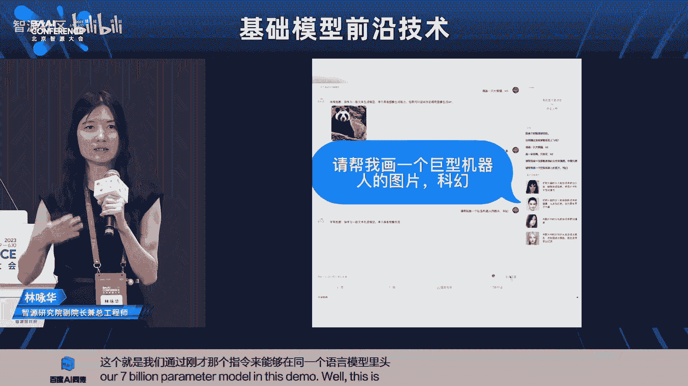

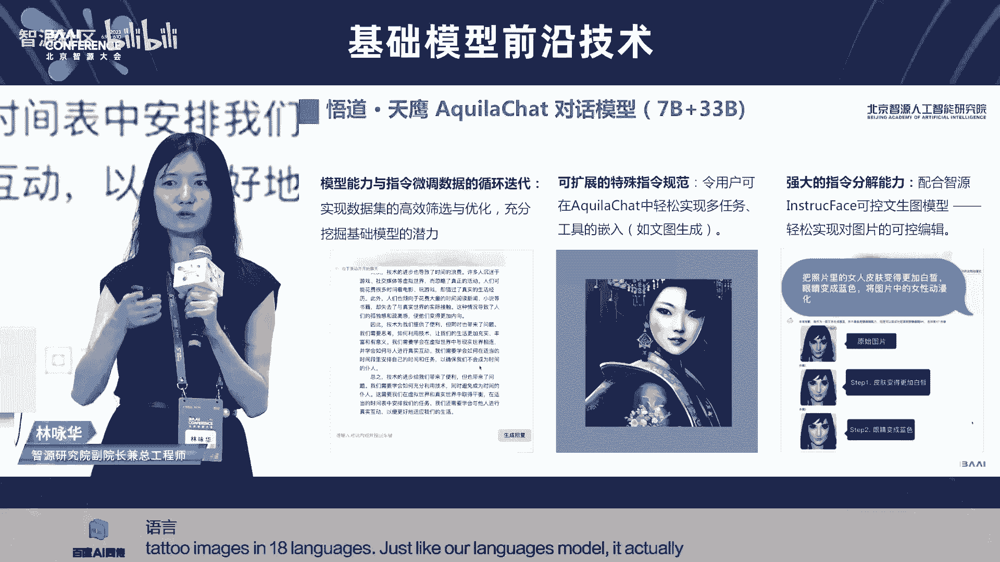

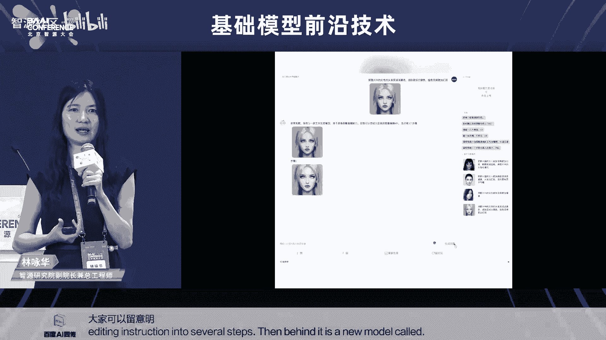

大家好，我是来自清华大学的刘志远。欢迎大家参加今天下午关于基础模型的论坛。

论坛给了我5分钟时间来做开幕致辞。今天所有的嘉宾，我们都会邀请他们来做特邀报告，因此我不一一介绍他们。我想表达一下我个人来到这个会场的一些感受。

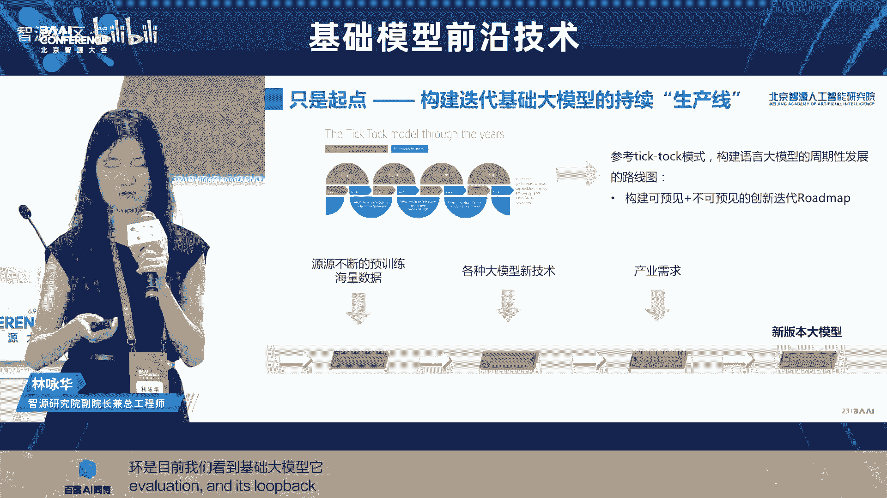

今天是一个特殊的时刻。我们在智源大会举行这个基础模型主题的论坛。回想起来，我们是在2020年，在智源研究院的支持下，开始了国内最早的大模型研发和研究工作。在过去的两年里，我们在智源大会上进行了相关大模型的发布。

一直到去年底之前，大模型更多还是在学术界和产业界引起从业者的关注。到了今天，在ChatGPT的影响下，有更多人士认识到了以大模型为代表的人工智能技术，在各个方面的巨大潜力。

我们一方面感受到以智源为代表的国内研究院，在技术探索上的前瞻性。同时，我们也能够感受到在技术浪潮上，我们机遇和挑战并存的趋势。

来到2023年，我们可以看到，无论是全世界还是在国内，都已经陆续涌现出来非常多和大模型有关的创新技术和创新应用。我们也相信，以智源为代表的国内大模型的先行者，也能够在最新的这次人工智能革命中，发挥重要作用。

我认为智源大会是国内最早比较系统地推动大模型技术普及和推广的论坛。我们今天以基础模型作为主题，邀请了国内外非常一线的专家，来给大家介绍大模型相关的一些比较前沿的技术。

今天我们在和讲者交流的时候，还看到我们今天邀请的四位特邀讲者都是女性。我们觉得这是一次非常有意义的巧合。我们也希望更多的女性工作者，能够加入到我们的大模型人工智能浪潮中来。

---

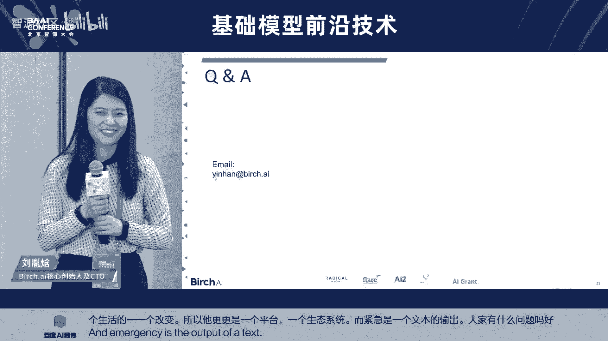

## 报告一：基础大模型工程化——打造AI中的CPU 💻

接下来，我们首先欢迎第一位特邀讲者，是来自于智源人工智能研究院的副院长兼总工程师林永华老师，来给大家介绍“基础大模型工程化——打造AI中的CPU”的主题报告。

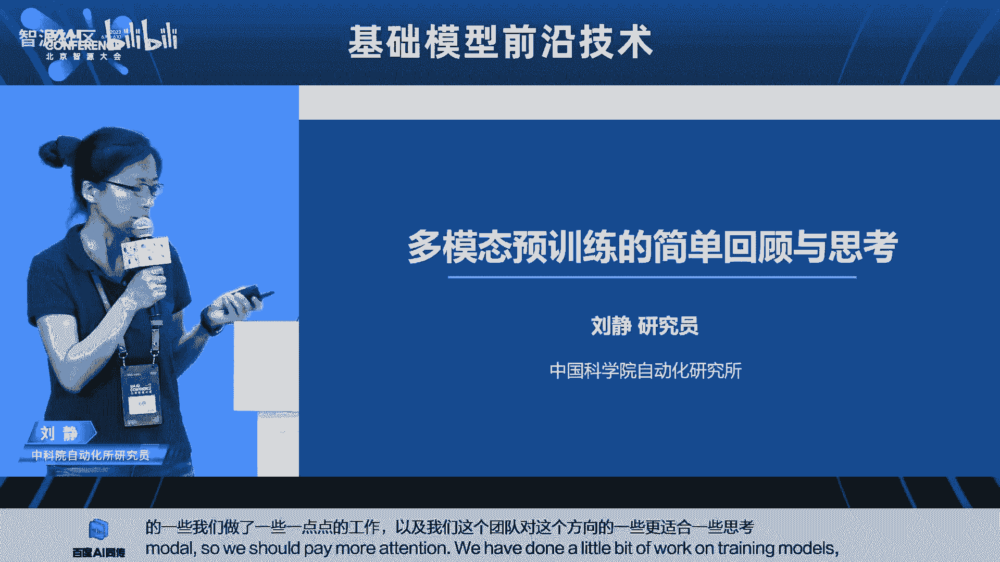

谢谢刘老师的介绍。今天上午我们整个大会kickoff的时候，大家也看到了智源发布了天鹰大模型。我也趁今天这个报告的机会，一方面想跟大家分享一下我们在打造大模型的过程中，为什么认为需要以工程化的方式来打造大模型，并且为什么它就像AI中的CPU。同时，也利用这样一个话题给大家介绍一下天鹰大模型。

在这里我想先说一点，因为我们的技术报告还没有出来，所以有点抱歉的是，今天的整个话题中一些具体的指标数字，可能都不会跟大家往外去说。可以期待我们的技术报告。

### 为什么基础大模型像AI中的CPU

首先，为什么我们会认为基础大模型在打造它的时候，就像打造AI中的CPU？实际上，第一个最重要的原因是，它的单一产品投入是巨大的，已经成为了整个AI里头的基础。如果我们说是一个基础的大模型，百亿甚至千亿规模的大模型，它的成本是很高的。

在这里给大家分享一下我们的一些具体实践以及预估的一些数字，因为有一些东西不好披露出来，所以大家主要是看这个比例。首先大家可以看到，对于几百亿的模型，蓝色部分是我们用于训练数据所需要花的人力、计算、处理等等。灰色部分是训练部分，包括人力和机器的花销。橘色部分是评测部分，也包括人力和算力。

大家可以看到，对于几百亿的模型，它用于数据上的投入跟训练时候的投入已经可以相当。所以从一个侧面说，为什么数据很重要。另外一块也是想提起大家的注意，评测很重要。这里有一些东西是没包括进去的，例如因为我们去探索一个新的模型的架构而要做的很多的创新，那些是没加进去的，因为我们认为那些投入还是可以去分摊到不同版本的模型。

这里就说单个版本，它的一个分布是这样子。对于330亿这样子的模型，它的成本大概是在2000万人民币的一个投入。后面如果拓展到1300亿这样子模型，那在这个成本上面就不一样了。这还是保持我们以一个T的token这样子的量来说，这个投入的量是另外一个数字，我就不具体说了，大家只是看这个量。如果对于一个千亿模型，一个T的数据不够，我希望让它的数据量变成2个T以上，那大家也可以看到它对于我们的数据成本和训练的成本也是有不一样的高度。

总体来说，对于语言模型来说，它的开发成本是十分高昂的，但这也值得。因为今天大家也越来越意识到，语言模型不仅仅是语言模型，它真的会成为我们未来AI中的大脑。

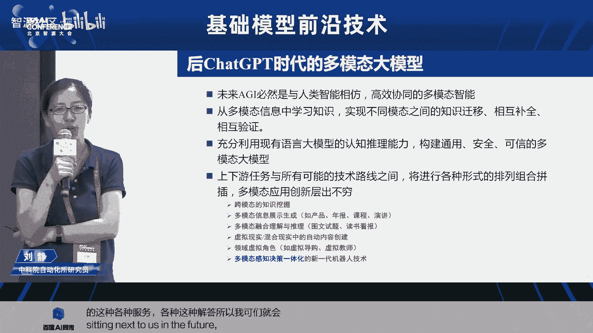

第二个角度来说，为什么它是AI中的CPU这么重要？因为基础模型很大程度上决定了后续模型的能力和产业落地的因素。首先是能力和知识。最近Meta有一篇文章是讲LLaMA，具体不说，但里头他的一个假设，我很认同。其实我们在大模型，尤其是基础模型里面，所有的能力和知识都是在基础模型这一部分所获得的。所以如果我们在基础模型这一块，没有把它的能力训练好，把它的知识能够训练进去的话，其实对我们后面再怎么进行SFT等等，其实是会面临很大的制约。所以这是第一，从能力和知识上，它决定了我们后续去持续训练，还是做微调训练的能力。

第二个很重要一点是合规性和安全性。因为训练模型，它的数据的干净程度，尤其是它的合规程度，很重要的会影响我们的AIGC的应用。毕竟语言模型很大程度是会生成内容。在这里给大家举一个例子，Common Crawl可能是很多人都很熟悉的一个全球的数据集，里头我们关心一下它那个中文数据集的情况。这是我们把里头的100万条中文带有中文的数据拿出来去分析它的站源情况，发现来自中国大陆的站源仅仅只占17%，有83%的站源是来自于海外的中文网站。所以在这里头，从内容的合规性上，从内容的一些安全性上，这个是有一个很大的风险在这里头。而当我们用很多这样子的数据去训练我们的基础模型的时候，其实对我们未来的微调后的模型是具有一定的风险。

当然大家可能会说，那我在最后模型的输出或模型的输入，我加一些安全的风控。但要知道这个不是所有的安全的风控都能够防得住所有的生成。例如我们有时候可能会问中国发生的时间大事。这种的问题不能不让人问吧。但是它在产生这10个不同的事件的时候，有可能就会存在一些不安全的输出。

另外，因为本身对于我们来说，不单我们要考虑这个模型是否可以拿出来给更多的学术界的去使用，我们还要考虑怎么可以让产业更宽广的去使用。所以在这里头会考虑这个版权和商用许可。到底这个基础模型，它是可商用许可还是非商用许可。它的使用的许可，是copyleft还是copyright的一个许可，是否具备这种开源的一个污染性，这些都是我们需要很仔细去考虑的。

这是从今年1月份到5月份，所有在国内国外发布的这些语言模型，我们做了一个简单的统计。在国外发布的语言模型，我们记录了有39个。其中可商用并且非copyleft的协议的大模型大约有16个。这里头例如LLaMA，我们也很熟悉，知道它其实是一个非商用的。那意味着我们所有基于LLaMA去进行做持续训练和SFT的模型，实际上都不能够合法商用的。那还有一些是使用了copyleft协议的模型，意味着我们通过这种copyleft的模型的协议的模型去进行进一步开发，例如持续训练或微调所得到的模型也必须开源，这是copyleft的协议。所以这个势必对产业，如果是企业正规企业要落地产业，其实是会造成很大的限制。

国内的情况是什么样呢？其中这个语言模型，我们统计了28个，开源的语言模型有11个，其中直接使用开源可商用的语言的大模型只有一个，并且是这只是一个进行了指令微调的对话模型。所以我们看到在基础模型上面，尤其是来自于咱们国内的完全开源可用的商用的中英双语商用的，其实是很缺乏。所以这里头就是我们寻找的实际上是说，第一能支持中英双语知识，这个知识不是只是翻译，所以这意味着我们需要把大量的咱们中文语言所表达的知识要放到这个预训练数据。第二，我们期待它是支持商用的许可协议，没有copyleft的限制。第三是符合国内数据合规的需要。

### 打造悟道·天鹰语言模型的目标

这个就是我们打造悟道·天鹰这个语言模型的一个目标。首先第一个就是我们希望为产业打造，像刚才所说的具备双语能力，并且是以商用许可协议的开放源代码及模型的系列。第二个，我们实际上是在设计之初就定下了一个高层的设计。我们希望这个语言大模型它有怎么样的一个能力的框架。这个能力框架其实很重要，决定了我们后面所寻找的数据以及我们的评测的方法。最后一点是说，我们越来越觉得重要的是为整个语言模型的打造，并且是持续打造，需要有一个端到端可持续循环的整一个模型的生产的流水线，打通从数据训练到微调到评测再回环回数据这么一个畅通的链路。

接这样的一个目标，我们今天也是开放了这些的一些模型。这里头其实就包括了330亿的和70亿的中英双语的基础模型。基于这两个基础模型，我们的对话模型，以及基于我们70亿参数的代码模型。其实在这里头对我们来说，对话模型和代码模型更多的是一个例子，就给大家看到是说基于这样的基础模型，我们可以怎么进一步的去打造通过SFT去打造我们所需要的对话模型，或基于持续训练去训练出我们需要的代码模型。其使用者可以基于他自己的应用需要去重新去做这样子的微调。

### 训练数据介绍

介绍这个模型的时候，首先我想还是给大家介绍一下这个训练数据。智源我们的中文数据实际上是持续一直在积累。在这里头也给大家分享一下，大家可以看一个右边的这个图，我们是接近30%多的数据是中文，60%多的数据是英文，这是目前的一个比例，不排除后续我们会有一个调整。

另外第二个大家可以看到这里头的这个分布，这个我就不说了。但我想给大家强调是说，中间其实最重要的，首先是互联网数据，它的一个质量。我们整个的这个中文的互联网数据，检查了所有的它的来源，其中99%以上的是国内的站源。所以这是我们很重要的一个基础，是说它的一个内容的安全性和干净的程度。

第二个，无疑大家可能做过中英双语模型的一个研发或调研的比较过这个数据集都知道，相比我们的英文的开源数据集，其实中文数据集最缺的是第一开源的高质量的文献的paper的中文的数据集，第二个是我们的开源可用的这种书籍的数据集。在这里头，智源也是得益于国内的一些数据机构跟我们的合作，他们愿意去把他的中文的文献数据，还有中文的书籍数据贡献到这样一个模型的训练里头。我想这也是因为我们这个模型是以一种完全公益的形式，以商用许可的方式再回馈给整个产业。所以他们愿意跟我们一起来做这个事情，也很在此也很感谢这些机构。

当前我们已经积累了超过1.4T token的训练数据。并且我们还持续正在增加更多高质量多样性的数据集，也在源源不断的把它训练到的这样一个基础模型里头的训练中。

### 基础模型技术细节

这个基础模型，第一，他在技术上承接了像GPT-3，还有LLaMA这些的架构设计的优点。另外，我想提一下是并行训练，我们使用了BMTrain，这个来自于刘老师团队很好的一个工作。那我们升级了BMTrain里头的这个并行的训练方法，它目前能够达到的直接可以对标的，例如像Megatron，以及我们实测是可以在一个具备一个大规模并行范围里头可以达到8倍的训练效率。

那可能大家会说为什么我们不跟Zero-3比，因为Zero-3有bug。这个给大家贴一下，这是我们团队大概两三周前，因为我们这个训练比较早就开始了，两三周前提交给DeepSpeed team的fix了，最后fix了这个Zero-3的bug。

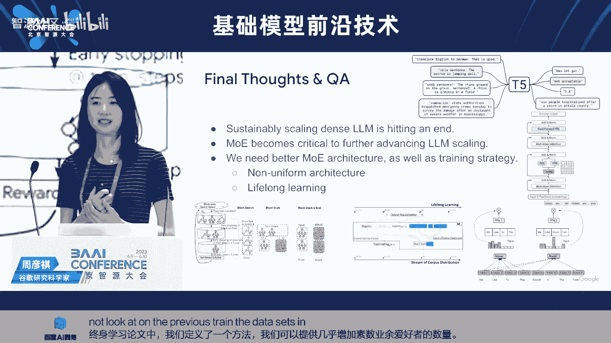

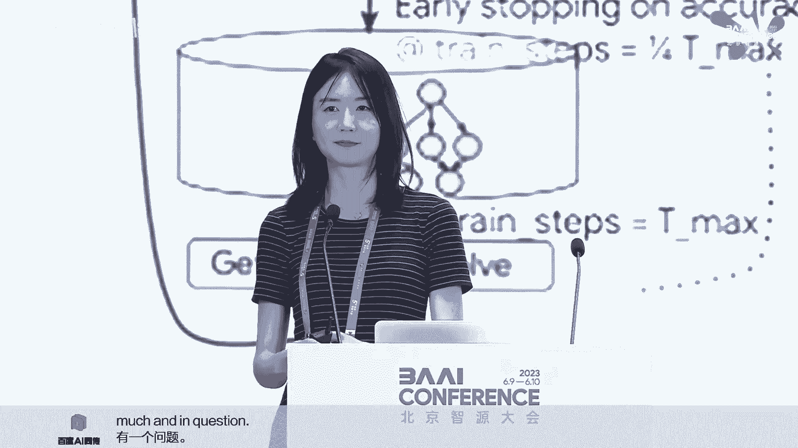

### SFT数据的打造

下一个就想给大家分享的是我们SFT数据的打造。因为这一次我们除了基础模型，我们也开源了我们的对话模型。这也是大家可能在实际用的时候经常会用到的模型。可能对于更多的一些爱好者或者是更多的下游的一些应用企业，可能会直接用到这样子的模型。

我们在整个SFT数据打造里头是分了四个阶段：数据采集，然后第二个阶段是根据这个数据的分布进行数据分布的分析，并行进行调整，第三个是进行这个SFT模型的测试，以驱动我们的一个数据的迭代，最后是包括这个重要指令的添加。在这里头给大家稍微分享一下。

不同的团队有不同的数据的采集的方法。智源这边我们是首先我们为了这个数据采集，指定数据的采集，因为它我们可以预见它是一个长久性的东西，因此我们特意打造了一整套叫OpenLabel这样一套指令数据采集的工具。但实际上它后来已经不单是我们的指令数据的采集和生成的工具，也包括我们在去reward model的时候，利用来做那个排序标注等等的这些工具集。

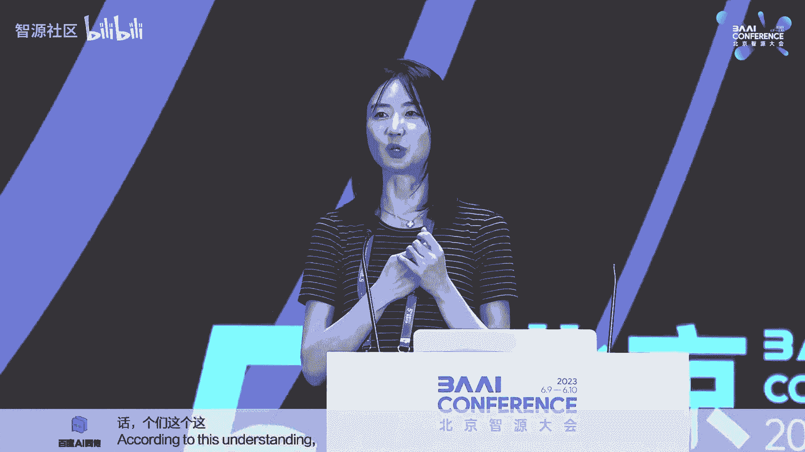

我们使用了就是说包括我们自然内部的一个固定的一个数据标注的团队，也包括向外面发起这个数据标注的公益活动，我们叫数据飞轮。我们在3月份的时候发起这个外部公益者这个数据飞轮的活动。我们当时是说等我们储备到了1万条，我们就把这个所有的这个在通过公益活动，他们来贡献这个数据标注的部分，把这个全部开源出来，整理好，全部开源出来。那正好其实是在昨天我们就把这一部分开源出来1万条。坦白说这个时间有点比我想象的要慢。我当时就觉得是说一个月就能够至少能够这个通过外部的公益活动能够标注够1万条。但发现其实这个东西不是那么容易，但我们会持续去做这个事情。

第二个，很重要的是整个数据分布的分析以及调整。前面说到了，其实我们定义了整个的大模型，我们认为语言模型的能力架构，能力的分布。那这个图实际上是对应前面那个图，我们会分析是说我们的指令微调数据集，它对于我们那个需要的能力分布来说，它从指令数据的角度，它的分布是不是能够对应上的。这不是我们目前的这个图，这个是稍微比较早期的一个分布图。那当时我们出了这个分布之后，我们就会看哪一些的方面的能力的数据偏少，那因此我们需要增加那一部分的数据的能力。

实际上我们一直有一个理念是说SFT的数据集不是越大越好。其实合理的，应该是说我们的基础模型很强，然后我们只需要少量高质量的SFT数据来让这个模型发挥很好的它的知识的一个执行能力。所以我们一直实际上在控制着我们这个指令微调这个数据集的大小。这一点其实是很重要。实际上我们一直控制到今天为止，大概就是十几万指令这样子。然后我们比过我们因为本身我们也有一个几百万甚至1000万的一个指令微调的数据集，包括有一部分也开源出来。比过是说到了今天为止，用这个数据集来翻就同一个基础模型，已经超过了用1000万或500万那个数据集来翻进这个基础模型了。

再往下一步，就是说我们持续的需要去构造这样一个迭代的过程。当我们这个SFT指定微调这个模型出来之后，我们会经过人工评测，看到它的不好和好的。然后呢，不好的那些case，我们会在一个很大的其实也就是1000万条的那个数据大的指定指令的数据的池子里头，通过检索方法把一些能力吻合的一些数据拿出来来进入到我们的下一个版本叠加到下一个版本。所以大家可以看到这个微调数据集，前一个版本是蓝色，上面一个版本是红色。其实我们持续的这样子去自动迭代，就除了人工来评测那个SFT的那部分会是人工，剩下的就会是自动的去调整我们的微调数据集。

最后一个，对我们也是很重要的一块，就是一些重要的指令的添加。那在这个过程中，首先是左边这块，就所有的我相信今天要放出来的对话模型都必须要做的是安全伦理等等的这样子的一个评测检测。那自然本身我们是有一个专门有一个Red Team，我们把它称之为Red Team，他们专门是帮助我们去评这个bad case，并且我们这个Red Team的选择是他既不是我们做前面就等我说到那个每天做这个评测的那些评测人员，也不是我们做数据集的人，他是完全一个separate team，然后不好的那些问题肯定要有重写这个答案，让他放回到我们的指令微调里头。

另外一个是我们这一次也定义了这个去构造连接一些应用或连接一些其他模型的指令数据。很简单的定义了这个格式，然后因此他可以帮助我们去很好的去链接其他的模型。例如在这里头有两个例子，一个是文生图的例子，上面说请画一只戴眼镜的狗，然后他就可以自动的去生成这样子的response。其实这个response里头前面半句话是说我作为一款文生文本生成模型，我没有这个能力，那后半句话它就真正的输出。如果我们要真的喂给一个例如diffusion的模型，那它就直接生成一个格式，一个特殊的字符的格式，以及后面需要用到的prompt。

我们这一次实际上是集成了两种不同的模型，这其实是一个范例。所有人如果用这个的模型，也可以用自己的方法来去同样的格式，就可以扩增自己要接的更多的模型和工具。这个是今天上午如果有看到黄老师的demo可以看到的。

第一个实际上就是我再放一遍哈，是这个但其实其实这个飞机这个是一个多轮对话，是一个多轮对话的。然后在下面这个还是一个多轮对话的一个场景。这一个是高考作文，其实我们这一篇高考作文大概800字左右，生成的时间不到10秒钟。其实这没有什么magic，其实这得益于说我们这个demo里头用的仅仅是我们的这个70亿参数的模型。

这个就是我们通过刚才那个指令，来能够在同一个语言模型里头去应对用户说要画图的这样子的一个需求，然后背后实际上是调用的是我们的AI diffusion。在这里头，其实我们放了这个我们的demo放在外面的demo booth，甚至大家先那里头是放video。大家到时候如果看到我们的同事在那可以要求他们去给你实操哈，其实我们是可以实操了。在那我们在这个上面其实也可以用不同的语言，包括韩语，包括西班牙语，包括法语等等。我们支持18种语言的文生图。正好就跟我们这个语言模型，他其实也已经具备了多语言的能力进行一个结合，就是用不同的国家的语言去输入给chat，然后让他生成相应的图。

那最后这个是一个把一个复杂的一个人脸编辑的指令，自动的划生成好几个step，然后背后是调用了我们新出来的一个叫InstructFace的这样一个模型。至于这部分的工作，大家可以留意明天上午AIGC内容生成生成模型的那个workshop，我们会有介绍。

### 代码模型

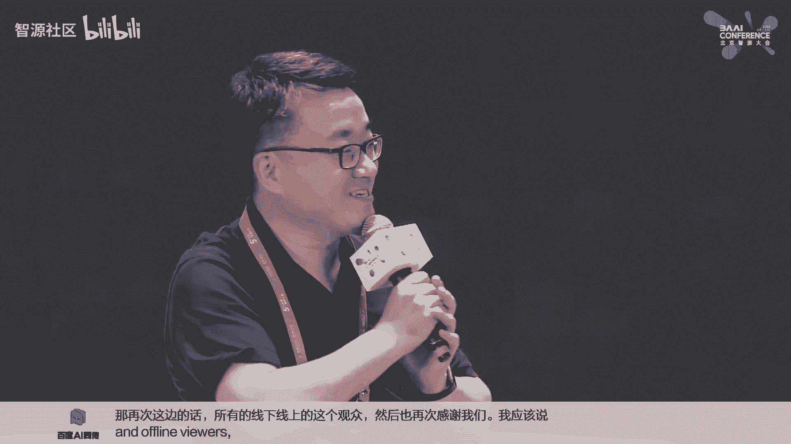

下一个是说我们这次发布里头其实也给大家提供了那个代码模型。我们认为其实代码模型它会扮演着未来，尤其是面对企业应用，企业用户场景很重要的一个角色。这次我们的确是说首先我们用的数据集，我觉得我们也比较lucky，当我们刚开始想做这个事情去尝试我们的Aquila base的这个模型的能力的时候，The Stack这个数据集出来了。这个是就是那个BigCode的那个团队，由HuggingFace来牵头的那个BigCode的这个项目团队开源出来的。这个数据集的好处是说他所有的代码数据都过滤干净他的版权，他去掉了所有没有版权声明的数据，只留下有版权声明的数据。他去掉了所有copyleft的数据。因为如果一旦有copyleft的数据，在我们的预训练数据里头，很难说以后出来的，我们给人家用户生成的数据，你是不是也得follow copyleft的这个规范，现在没有法律去规定，但是有这个风险。所以我们倾向于是说只保留有版权说明，并且只有copyright