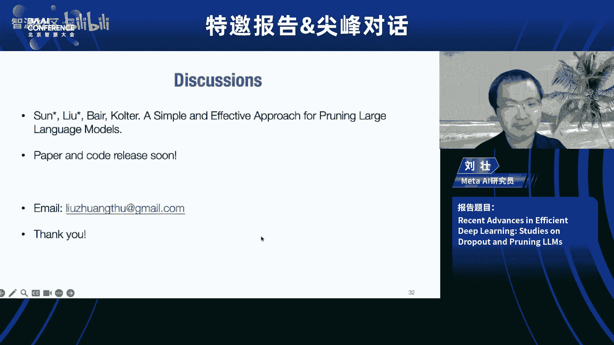
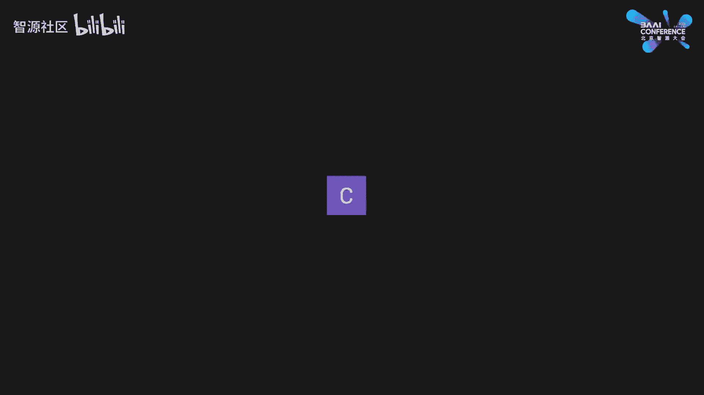
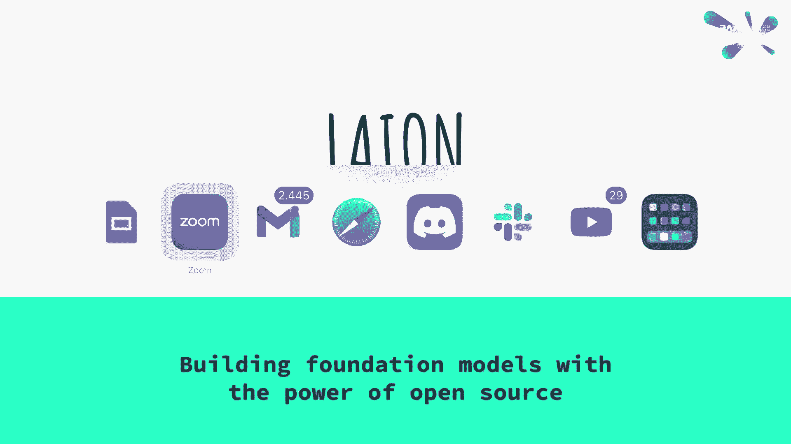
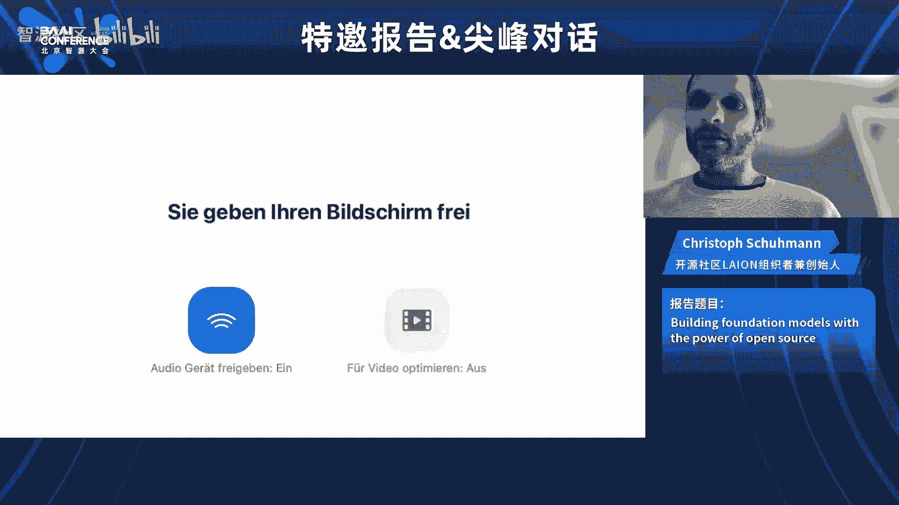
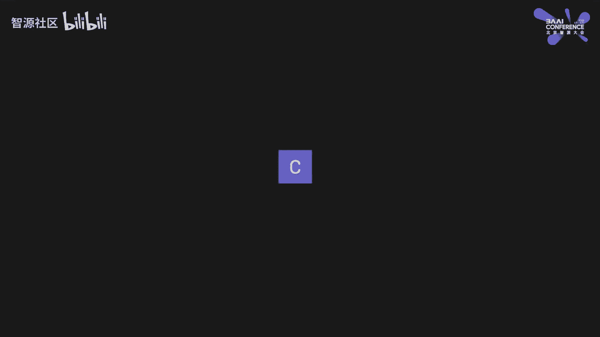
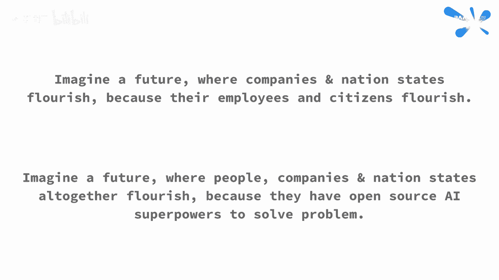

# AI创造力与开源精神 🚀

在本节课中，我们将学习人工智能如何赋能个人创造力，以及开源社区在推动AI民主化进程中的关键作用。课程内容整理自一场关于AI未来的深度对话。

## 概述：人工智能时代的创造力解放 💡

上一节我们介绍了课程的整体框架，本节中我们来看看对话的核心观点。人工智能，特别是生成式AI，正在从根本上改变我们创造、学习和解决问题的方式。Midjourney的创始人David Holz和LAION的联合创始人Christoph Schuhmann分享了他们的愿景：利用AI技术解放全人类的想象力，并通过开源协作让这项技术惠及每个人。

## 大卫·霍尔兹：解放想象力的使命 🎨

大卫·霍尔兹是Midjourney的创始人，他的动力源于一个宏大的目标：为人类集体解决问题提供基础设施。

### 创造力的三个核心环节
大卫认为，创造和解决问题可以归结为三个关键环节：
1.  **反思**：思考我们是谁、我们想要什么、问题在哪里。
2.  **想象**：构想未来的可能性。
3.  **协调**：与自身及他人协作，将想象变为现实。

人工智能在这三个环节都有巨大潜力，能够帮助我们更好地反思自我、拓展想象力并促进协作。Midjourney在图像生成领域的成功，正是这种“想象力基础设施”的一个概念验证。

### AI如何重塑学习与创造
当人们获得强大的创造工具时，他们对学习的兴趣反而会增强。例如，当用户可以通过说出“装饰艺术”来生成相应风格的图像时，他们便开始主动去了解这种艺术风格的历史。**知识因此从静态的历史记录，转变为可以立即运用的创作力量**。用户最迫切的需求之一，就是学习相关的艺术、历史和技巧，以更好地运用手中的工具。

### 赋能而非替代：AI作为创造力放大器
对于不同背景的用户，AI扮演着不同的角色：
*   **对于普通人**：AI提供了一个低门槛的入口，让人们首次有机会探索自己的审美偏好，进行深刻的自我反思，这个过程类似“艺术疗法”。
*   **对于专业人士**：AI不是替代，而是**放大器**。它让艺术家能够创作以前无法独立完成的作品，如完整的漫画书、电影或游戏世界，极大地扩展了专业创造力的边界。

### 初创公司的新范式
Midjourney团队规模小，没有销售和营销团队，却将技术带给上千万用户。这得益于AI时代的新范式：**强大的动机、清晰的愿景、研究能力以及对“好产品”的专注**，有时比庞大的团队更重要。大卫认为，未来会有更多这样的公司涌现。

### 垂直产品的未来与AGI
即使未来出现通用人工智能（AGI），垂直的、专注于特定领域的AI产品依然有价值。未来的社会可能由**数百万人类与数百万AI智能体共同协作**，形成复杂的“心智社会”。Midjourney的目标不仅是生成图像，更是成为全球视觉探索发生的中心，并将在视觉领域积累的经验应用于其他需要集体探索的领域。

---

## 克里斯托夫·舒曼：开源AI的愿景与实践 🌍

上一节我们探讨了AI如何赋能个体创造力，本节中我们来看看开源社区如何构建让这种赋能成为可能的基础设施。克里斯托夫·舒曼是LAION（大规模AI开放网络）的联合创始人，他坚信开源AI是让技术红利普惠全人类的关键。

### LAION的起源：从爱好到非营利组织
LAION始于一个简单的想法：让最先进的AI对所有人免费开放。最初，克里斯托夫作为一名高中计算机科学教师，在业余时间编写代码，从公共网络爬虫数据中过滤出高质量的图像-文本对，用以训练开源的文本到图像模型。

**关键步骤**：
1.  从“Common Crawl”等公共数据源获取网页数据。
2.  提取图像链接和候选文本描述（如HTML中的alt文本）。
3.  使用开源的CLIP模型计算图像与文本的匹配度。
4.  保留高匹配度的图像-文本对，构建数据集。

凭借开源社区的协同力量，他们在没有任何资金支持的情况下，短短几个月就构建了包含4.13亿对数据的LAION-400M数据集，并由此发展成一个正式的非营利组织。

### 开源哲学：乐观主义与赋能
面对AI风险论，LAION社区持一种乐观的赋能观点：
*   **风险观**：最大的风险不是技术本身，而是**权力过度集中在少数巨头或民族国家手中**。这会导致进步缓慢，且一旦被滥用，影响范围极广。
*   **赋能观**：相信大多数人会利用开源AI改善生活、增强能力。开源和广泛获取能催生更快的技术进步，并让每个人（包括小公司和个人）都能获得“超能力”，从而更好地抵御风险（如错误信息），形成更具韧性的社会。

**核心公式**：
`开源AI ≈ 开放解决问题的能力 ≈ 赋予每个人权力`

### 当前与未来的项目
LAION社区正在推进多个项目，以构建下一代开源AI基础：

以下是LAION重点推进的项目列表：
*   **Open Assistant**：一个开源聊天助手项目，通过社区众包的方式收集高质量的对话数据，用于微调大语言模型，已产出可媲美早期ChatGPT能力的模型。
*   **大交织数据集**：旨在构建一个统一的多模态数据集，包含**文本、图像、音频、视频**及其交错组合。这将为训练能理解和生成多种内容的基础模型提供燃料。
*   **多模态CLIP模型**：计划将CLIP对比学习的思想扩展到音频和视频领域，实现所有模态在统一语义空间中的表示，为更强大的多模态AI打下基础。

### 社区驱动的创新模式
LAION的成功源于其低门槛、去中心化的社区协作模式：
*   **成员多元**：包括高中生、教授、自由职业者、大公司员工等。
*   **协作灵活**：任何有好想法的人都可以在Discord服务器上发起项目，快速吸引志同道合者并获取闲置的计算资源。
*   **动机纯粹**：参与者多为志愿者，驱动他们的是让技术普惠人类的共同梦想，而非金钱报酬。克里斯托夫本人也拒绝高薪工作，选择保留教师职位以维持生活与理想的平衡。

### 对全球协作的展望
克里斯托夫希望开源AI能成为一个桥梁，减少全球性的稀缺和恐惧，最终让所有公民——无论身处何地——都更有能力、更富足、更幸福。技术发展的目标不应是让某个国家或公司更强大，而应是**平等地提升每个人的能力与生活品质**。

---

## 总结与核心启示 ✨

本节课中我们一起学习了AI时代创造力的新范式以及开源运动的核心精神。

**核心启示**：
1.  **AI是创造力的放大器**：它降低了创造的门槛，同时拓展了专业人士的边界，将知识转化为即时的创作力量。
2.  **开源是民主化的关键**：只有通过开源和开放协作，才能避免AI权力垄断，加速创新，并让技术红利真正普惠全人类。
3.  **聚焦于人**：无论是Midjourney关注的“想象力解放”，还是LAION追求的“赋能每个人”，其最终目标都是让技术服务于人的福祉与提升，创造一个更丰富、更公平、更具创造力的未来。

技术的未来充满希望，而选择权在我们手中：是走向封闭与控制，还是走向开放与赋能。本节课的分享为我们指明了后一条道路的广阔前景。