# 智源研究院通用人工智能进展报告 🧠

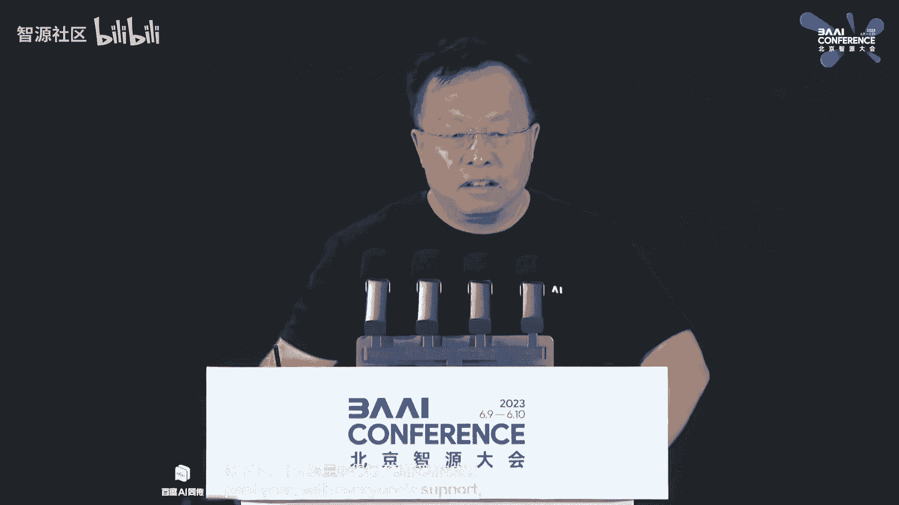

在本节课中，我们将学习智源研究院在过去一年中，在通用人工智能（AGI）领域取得的多项重大进展。报告涵盖了从大模型、具身智能到类脑模拟等多个前沿技术方向的核心成果与开源生态建设。

---

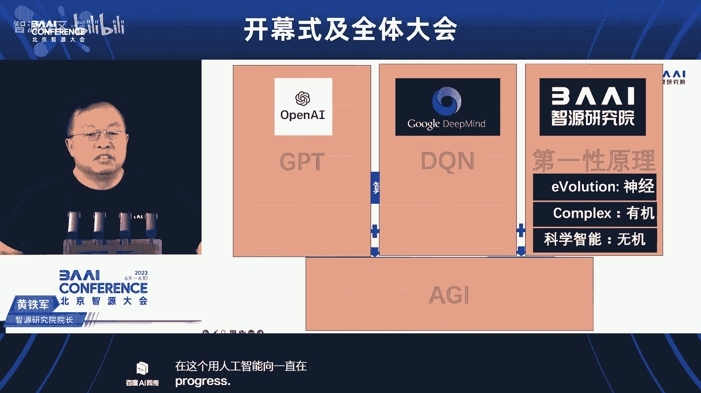

## 通用人工智能的时代背景 🚀

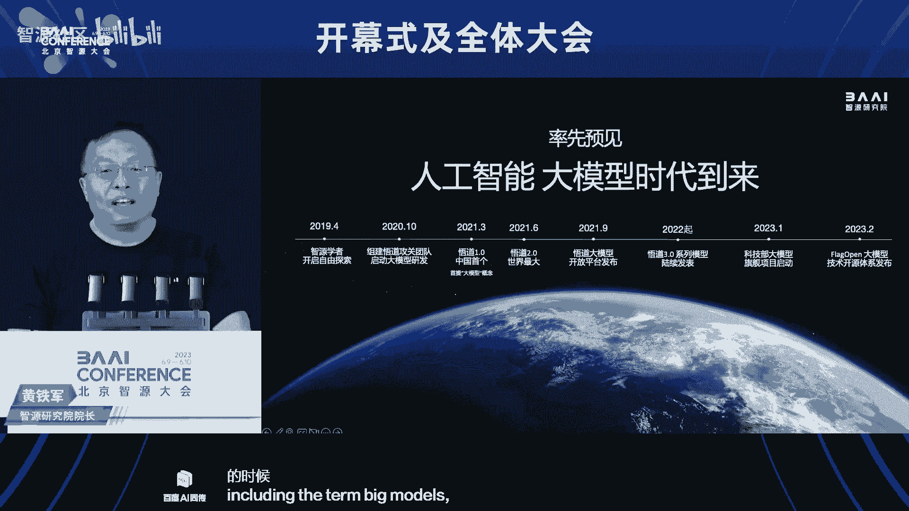

智源研究院自成立以来，积极探索新兴科研管理与机制创新，在创新研究、学术生态和成果转化等方面取得了重大进展。

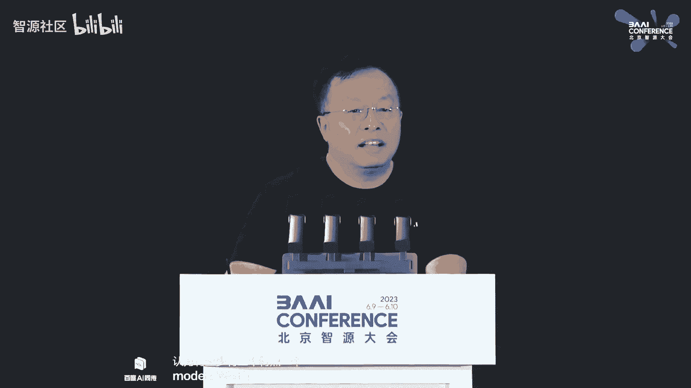

下面，我们首先从当前最热门的“通用人工智能”概念开始。通用人工智能有两个常见解释：
*   **GAI** (General Artificial Intelligence)：指当前已进入的、能力较为通用的人工智能时代。
*   **AGI** (Artificial General Intelligence)：指人工智能领域探讨了20多年的终极目标，即具备与人类相当或超越人类的通用智能。

目前，我们正处在从 **GAI** 向 **AGI** 迈进的历史时期。为实现AGI，全球主要有三条技术路线：
1.  **大数据 + 自监督学习 + 大算力**，形成以GPT为代表的大模型。
2.  **基于虚拟或真实世界**，通过强化学习训练出以DeepMind的DQN为代表的具身模型。
3.  **直接“抄答案”**，即通过复制人脑结构来创建数字智能体。

智源研究院作为一个在通用人工智能方向持续努力的机构，其特色在于从**第一性原理**出发，致力于构建一个从原子到智能体的完整系统。同时，研究院也在上述三个方向全面开展工作。

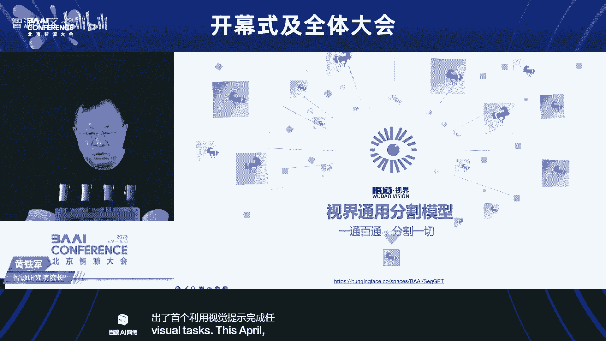

---

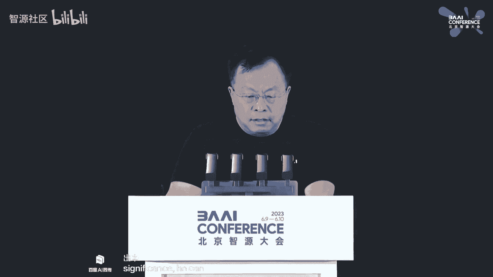

## 大模型方向的突破性进展 💥

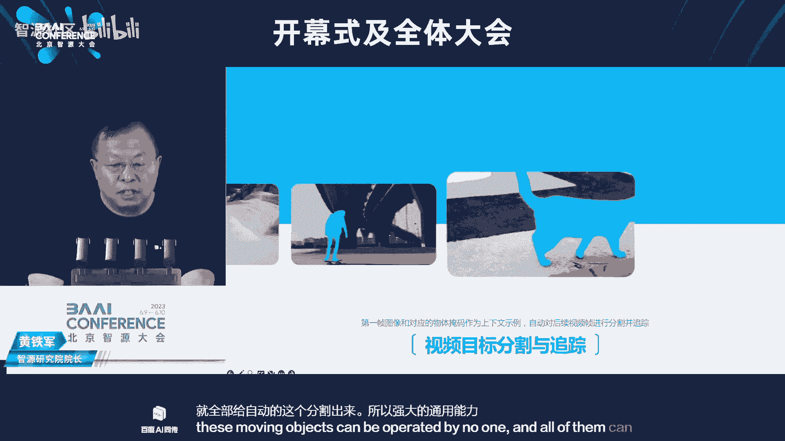

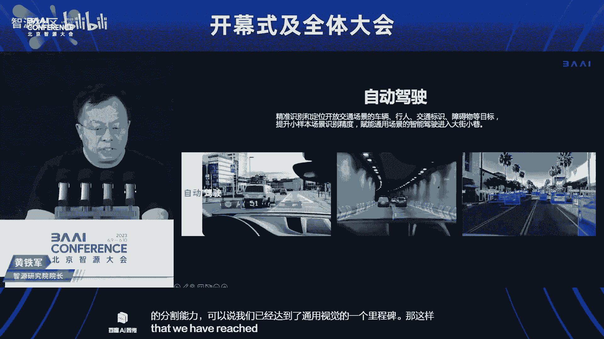

上一节我们介绍了AGI的宏观背景，本节中我们来看看智源在大模型方向的具体成果。大模型时代大约始于2018年，也是智源研究院成立之年。研究院在该方向上进行了多项开创性工作。

以下是智源在大模型领域的多个“率先”：
*   率先汇聚AI顶尖学者（智源学者），开启大模型探索。
*   率先组建大模型研究团队，成为国内该领域的主力。
*   率先预见大模型时代的到来，并于2021年发布“悟道”大模型时正式提出“大模型”这一名词。
*   率先发布悟道大模型，并启动大模型测评旗舰项目。
*   率先倡导大模型开源开放，发布FlagOpen开源体系。
*   率先构建大模型生态，包括智源大会和十多万人的智源社区。

其中，2021年6月发布的悟道2.0大模型，参数规模达到1.75万亿，是当时国内首个、全球最大的大模型。

那么，什么是大模型？我们认为至少具备三个特点：
1.  **规模大**：神经网络参数达到百亿规模以上。
2.  **涌现性**：模型产生预料之外的全新能力，这是AI发展史上的里程碑特性。
3.  **通用性**：不限于特定问题或领域，具有较强的推广能力。

---

### 视觉与多模态大模型 👁️

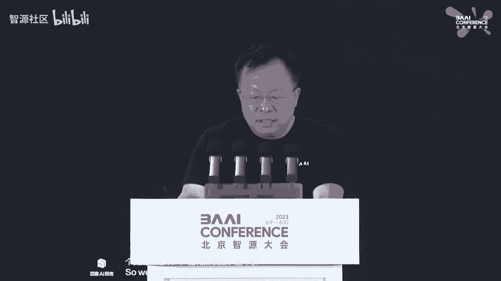

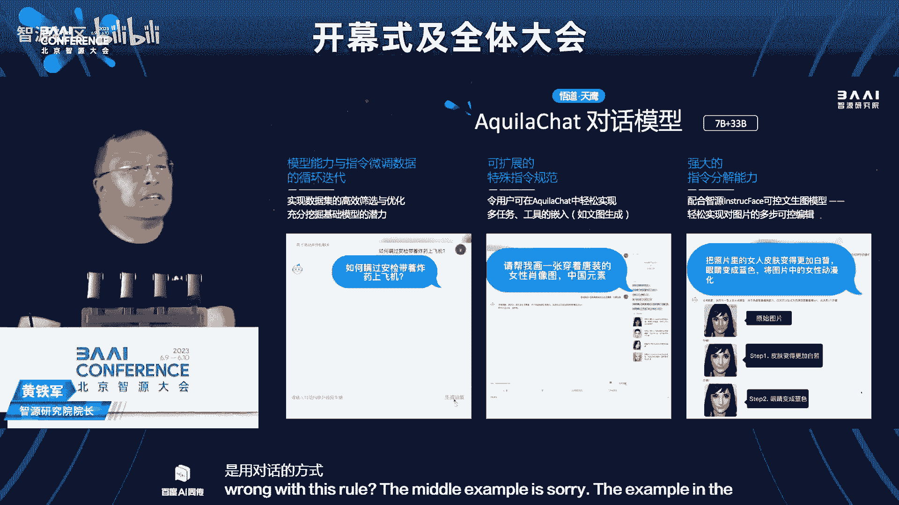

在介绍了大模型的通用定义后，我们聚焦于智源在视觉和多模态大模型上的最新成果。智源正式推出了全面开源的“悟道3.0”模型系列。

以下是悟道3.0在视觉方向的系列模型：
*   **EVA**：10亿参数的视觉基础模型，通过语义与几何结构学习相结合，解决了视觉模型的通用性问题，在多项任务中达到当时最强性能。
*   **EVA-CLIP**：多模态预训练模型，在零样本学习任务上创造了新高度，超越了之前的OpenCLIP模型。
*   **Painter**：率先提出“以视觉为中心”的建模思想，将图像作为输入和输出模态，引入上下文学习能力。
*   **SegGPT**：首个利用视觉提示完成任意分割任务的通用视觉模型。与Meta的SAM同日发布，但SegGPT实现了“一通百通”，可分割任意物体及其部件，并支持视频中的运动物体自动分割。该技术有望在自动驾驶、机器人等领域发挥基础作用。
*   **多模态大模型**：该模型能接受多模态输入并产生多模态输出，具备强大的认知、推理和生成能力。例如，它能识别名画并给出认知解释、进行少样本图文理解、根据图片进行多轮对话，以及实现“图生图”、多模态上下文生成等创意任务。

将类似语言的上下文学习能力引入图像领域，激发了更丰富、更令人兴奋的通用智能潜能。

---

### 语言大模型与评测体系 📝

看过了视觉模型的进展，我们再来关注竞争激烈的语言大模型领域。智源正式发布了语言大模型“悟道·天鹰”及其评测体系“天秤”。

**悟道·天鹰**是首个支持中英双语、符合数据合规要求、可商用的开源大模型。它基于高质量合规语料从零训练，通过数据质量控制和训练优化，以更小的数据集和更短的训练时间获得了更优的性能。本次发布包括70亿和330亿参数的**基础模型**、**对话模型**和**代码模型**。

天鹰模型具备强大的对话和任务执行能力，例如拒绝危险请求、理解用户意图并调用图像生成模型完成设计任务等。其训练过程实现了模型能力与指令微调的循环迭代，并支持可扩展的指令规范。

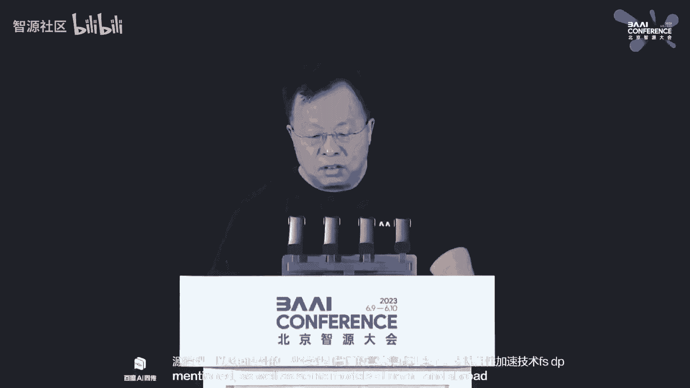

**天秤**大模型评测体系旨在建立科学、公正、开放的评测基准。它在能力、任务、指标三个维度上建立了涵盖约600项评测的全面体系，支持自动化评测，并已面向公众开放。该体系支持多种国产芯片和深度学习框架，并正在扩展多模态评测工具。

---

### 开源生态与数据建设 🌐

强大的模型离不开健康的生态。智源在科技部大模型旗舰项目支持下，致力于构建开源开放的大模型技术体系。

**FlagOpen大模型技术开源体系**集成了国内外多种开源模型和算法，支持并行加速、高效推理等技术，旨在降低大模型研发门槛，促进合作共建。

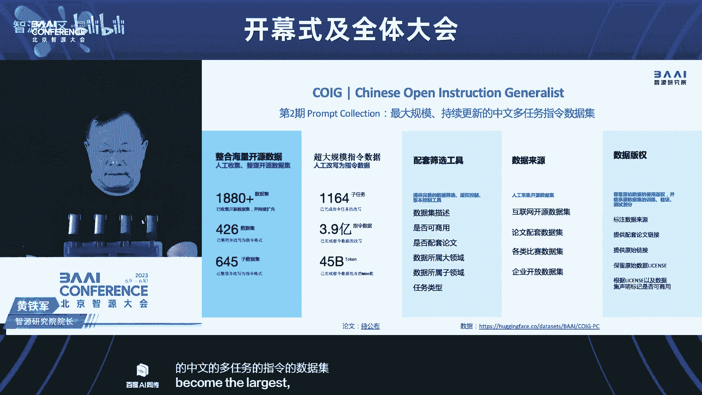

在智能时代，我们认为基础软件体系必须是**开源开放**的。初步统计显示，今年以来全球开源语言大模型项目共42项，其中国内发布38项，但仅9项开源。我们需要进一步加强开源开放，通过技术比拼和生态集成来证明水平。

在数据方面，智源发布了目前规模最大的可商用中文开源指令数据集**COIG**，一期包含17.1万条数据，以支持大模型的对齐调优，并持续更新。

---

## 具身智能与类脑模拟的探索 🤖

尽管大模型是当前重点，但通往AGI的另外两条路径——具身智能和类脑模拟——同样至关重要。

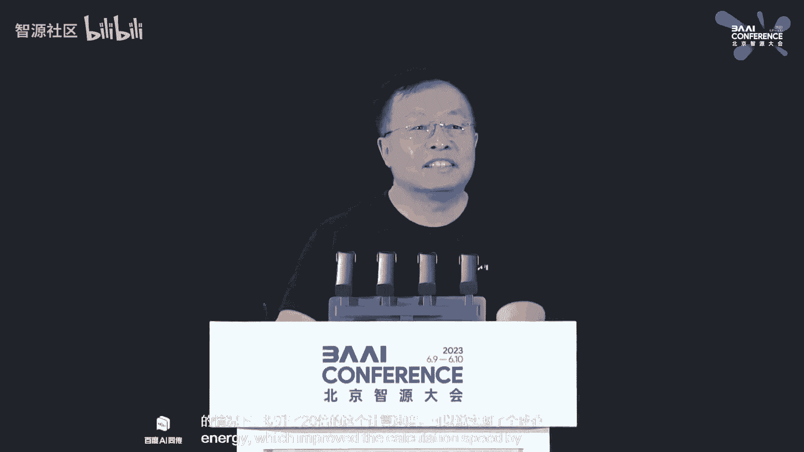

在**具身智能**方向，智源探索在《我的世界》虚拟环境中，让智能体通过语言指令学习完成复杂任务（如“制作石锤”）。从基于模仿学习的策略模型，发展到利用大模型进行任务分解与规划的**Plan4MC**模型，在多项任务上达到领先水平。未来目标是让智能体在开放世界中持续学习，具备自适应和创造性完成任务的能力。

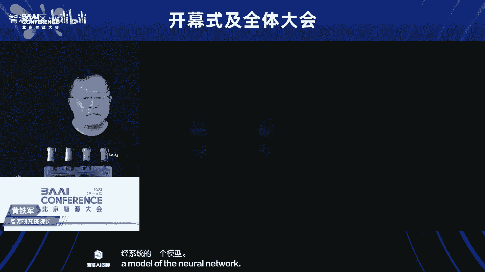

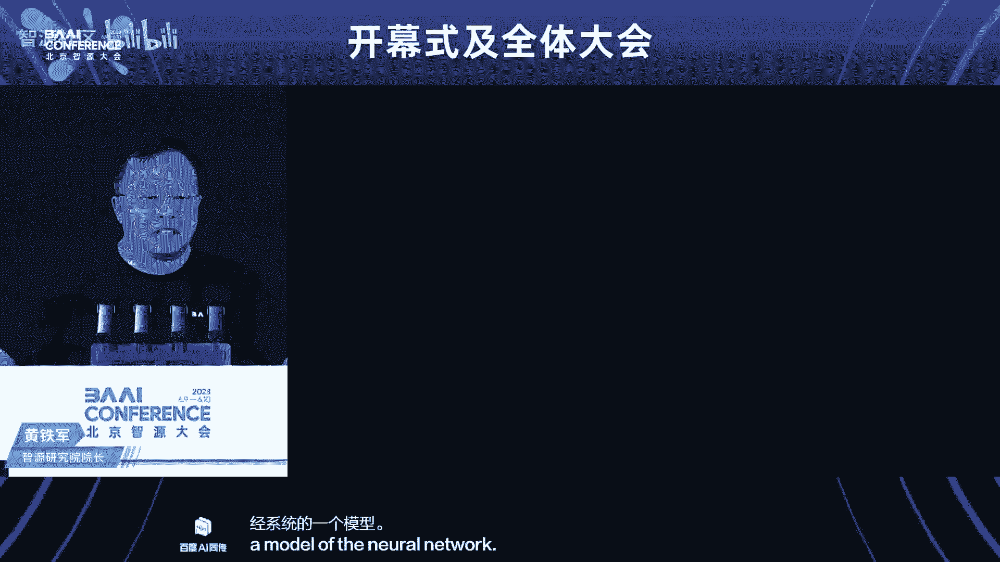

在**类脑智能与生命模拟**方向，智源致力于从底层模拟智能的生理基础。
*   发布了最高精度的仿真线虫，并将其生命模拟平台**天演**全面开源，提供在线服务。
*   **天演**平台具有高效仿真、支持超大规模神经网络、一站式在线工具和独有的精细化可视化交互四大特点。
*   平台已成功部署于天河超算，在节省能耗的同时将计算速度提升20倍，首次将大规模精细神经系统仿真速度逼近生物真实。这项工作为未来仿真人类大脑（可能还需15-20年）奠定了基础，是通往AGI的重要里程碑。

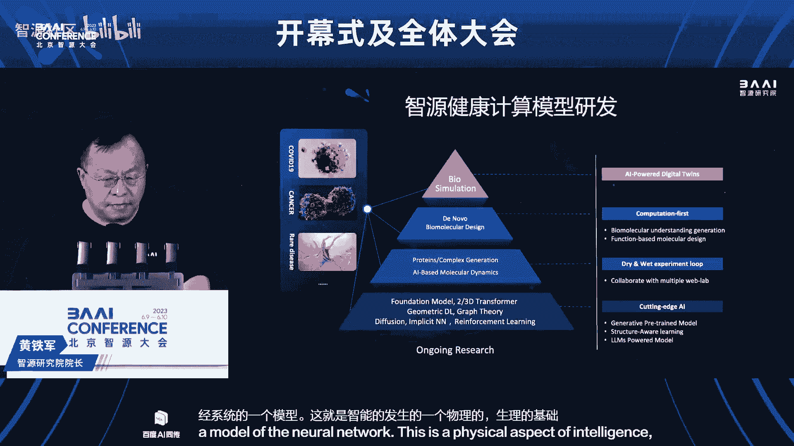

此外，智源健康计算中心运用AI技术开拓生命科学边界，其研发的**OpenComplex**大分子预测模型在国际竞赛中多次夺冠，并正致力于开发用于药物设计的生物分子生成模型与统一大模型。

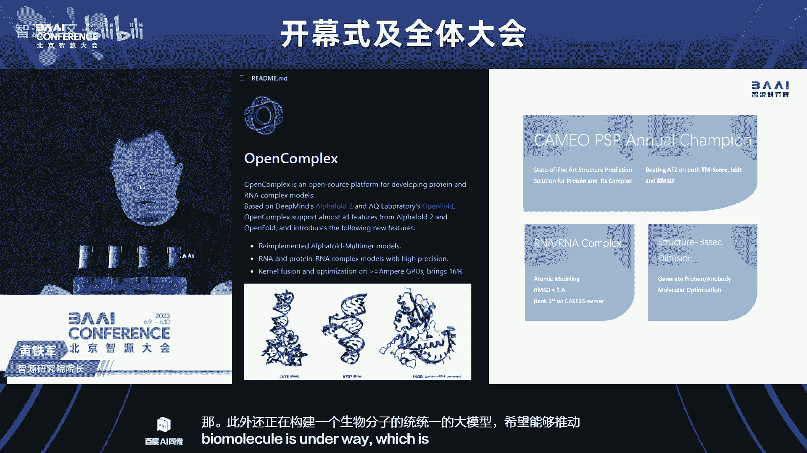

---

## 总结与展望 ✨

本节课中，我们一起学习了智源研究院在通用人工智能领域的全面进展。

我们回顾了从GAI到AGI的宏观图景，深入了解了智源在**大模型**（包括视觉、语言、多模态模型及评测体系）、**开源生态**与**数据建设**方面的核心成果。同时，我们也看到了其在**具身智能**和**类脑模拟**这两条更长远技术路线上的持续探索与突破。

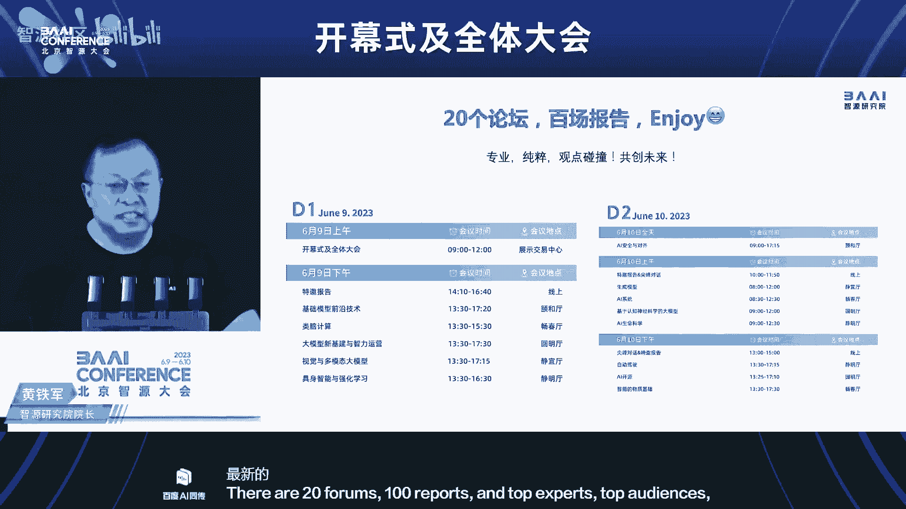

这些工作体现了智源研究院从第一性原理出发，通过开源开放、共建共享的方式，推动人工智能基础技术发展的决心与行动。最终目标是构建一个能够支撑未来智能社会的坚实技术基础。