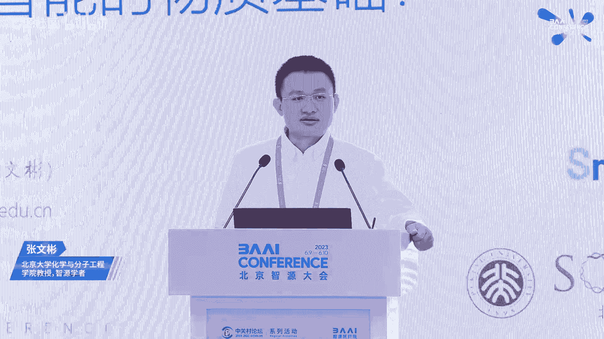
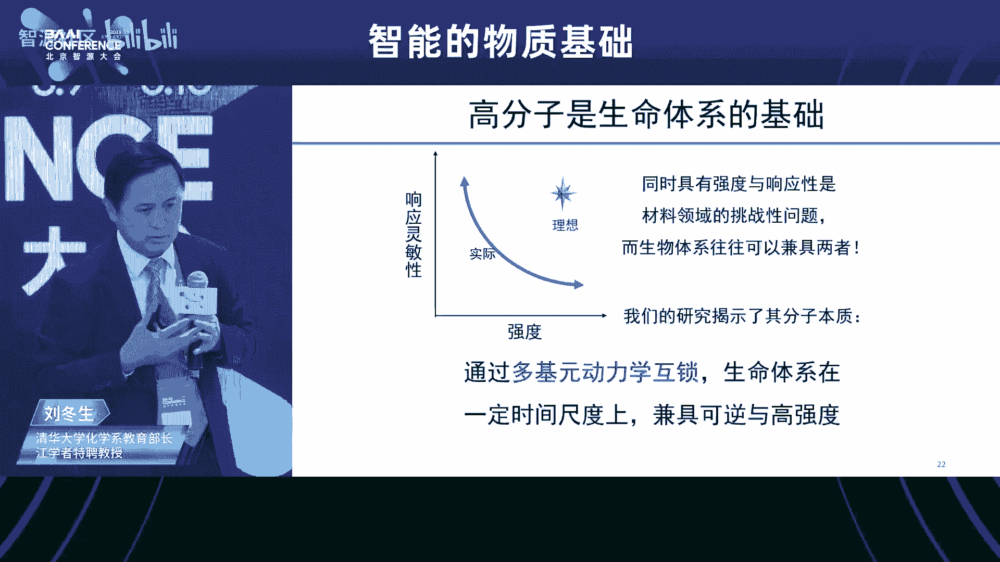
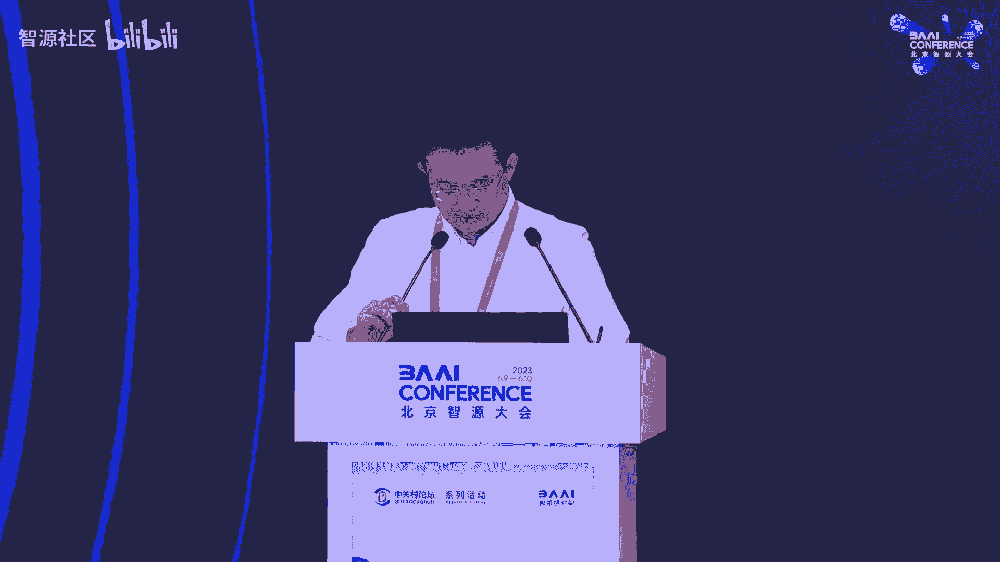
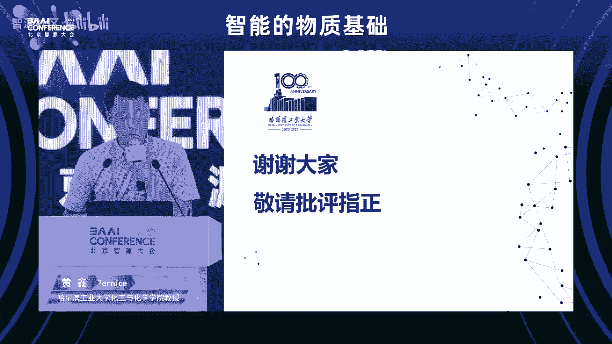
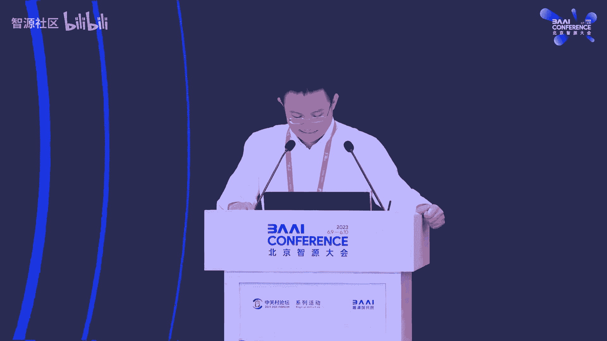
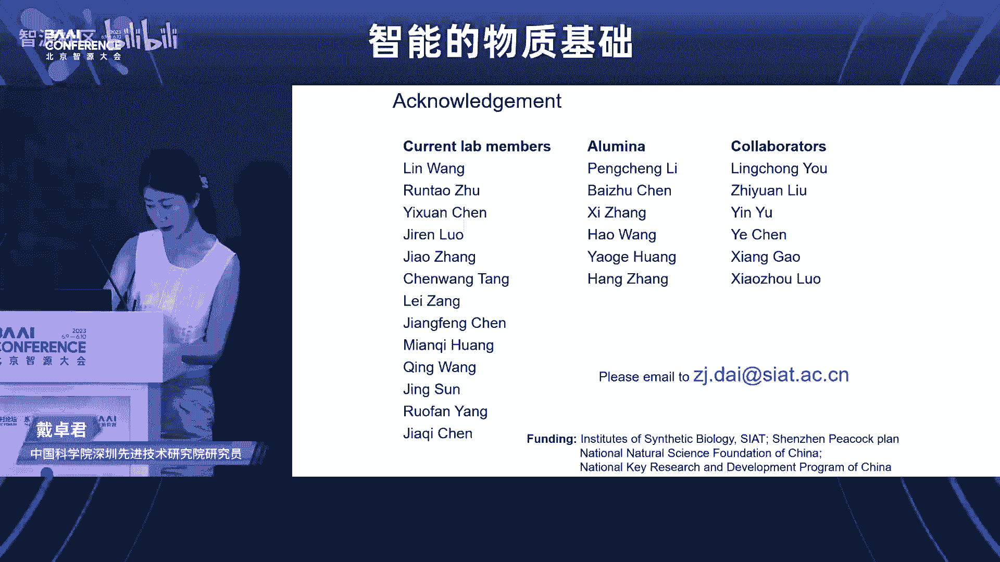
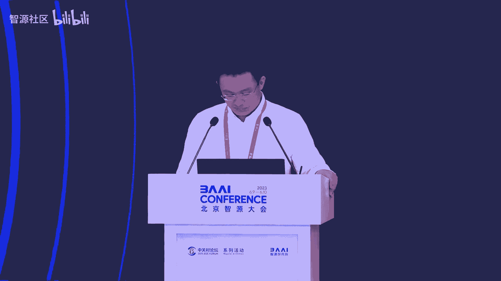
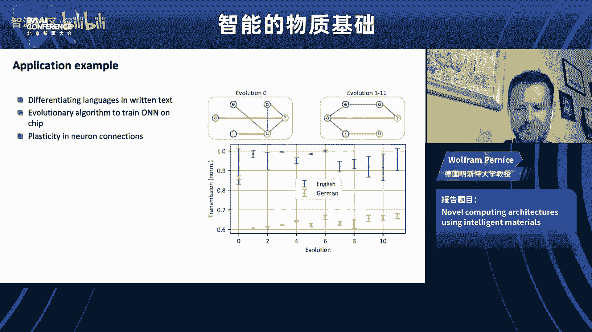
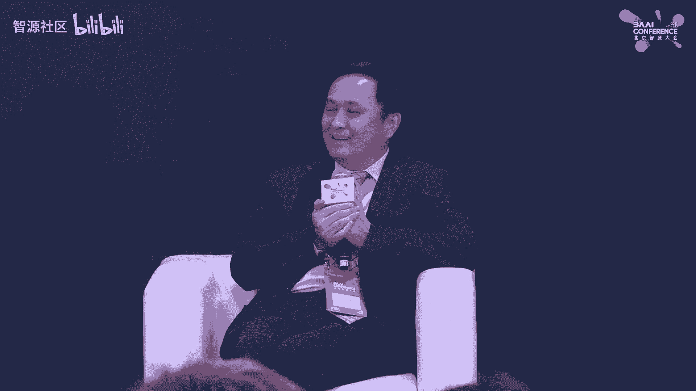

# 智能的物质基础论坛

## 概述 📘

在本节课中，我们将探讨“智能的物质基础”这一前沿交叉领域。我们将跟随多位顶尖学者的报告，从分子、细胞、活性物质、人工细胞、合成生物学以及神经形态计算等多个尺度，理解智能如何从物质中涌现，以及我们如何通过工程手段去模拟和创造智能。课程内容将涵盖从基础理论到前沿应用的广泛话题。

---

## 论坛开场与背景介绍

尊敬的线上和线下各位嘉宾，大家下午好。我是本次分论坛的主席张文斌。欢迎大家来到我们这个分论坛。

今天我们将一起讨论什么是智能的物质基础。这是本分论坛第二次举办。去年我们有6位讲者一起对这个领域进行了初步探讨。

在2021年，Wolfer Perence教授在《自然》杂志上发表了一篇文章，题为《智能物质的兴起》，提出了“智能物质”这一概念。这个概念说新也不新。

它与之前我们提到的“智能材料”有相似之处，在于它也具有一些响应性行为等。但它又包含了一些新的理念。例如，在这篇文章中，Wolfer教授希望这类物质能够同时实现计算、响应性学习等功能。

在去年的讨论之后，我们初步提出了一些观点，认为现在的智能物质是跨越多个尺度、能够集成信息和控制的物质体系。从小到分子尺度，分子进一步形成组装体，这些组装体的结构尺度越来越大，形成了细胞，而细胞再进一步组织，形成了一些器官。在这个过程中，逐渐涌现出越来越复杂的行为。

智能物质有几个非常有趣的特点。第一个是复杂性。

这个复杂性可以存在于广泛的尺度上的任何一个尺度。比如分子尺度有分子尺度的复杂性，细胞尺度有细胞尺度的复杂性，到了组织程度，又有组织程度的复杂性。这是它的第一个特点，也是人工智能能够处理的一个很好的对象。

第二个特点是涌现性。涌现是一个很有趣的概念，它指的是当物体之间的相互作用力足够多、足够复杂时，它能够作为一个整体展现出个体所不具有的性质。

涌现现象也同样发生在各个单独的尺度，然后这些涌现出来的新功能还会被进一步集成和转移到下一个更高的尺度上去。

智能物质的第三个特点是信息。信息是智能物质不可或缺的一部分。

它能够从环境中获取信息、感知信息、存储信息，并且处理信息。它是智能物质的核心。

最后就是集成。功能材料和一个可以重新组织的回路组织在一起，就可以实现真正的智能物质。

它曾经是生命起源的一种表现。现在这个概念也在激励着我们去发展一些人工的智能物质。

根据我们对这样的理解，这次报告我们非常有幸请来了几位杰出的讲者，他们在各个尺度上向我们阐释他们对于智能物质的理解。

---

## 报告一：生命智能中的高分子效应 - 刘东升教授

### 报告人介绍

刘东升老师是清华大学化学系教育部长江学者特聘教授、博士生导师、中国化学会会士、英国皇家化学会会士。他入选了创新人才推进计划中青年科技创新领军人才计划、中组部“万人计划”领军人才，获得过第一届中国化学会-英国皇家化学会青年化学奖、第七届中国化学会-巴斯夫青年知识创新奖等。他还担任了基金委杰出青年基金、重点项目、创新群体项目负责人等重要项目，现任《Smart Molecules》、《Polymer》、《高分子学报》和《高等学校化学学报》的副主编。他主要从事核酸的合成和修饰以及核酸超分子材料方面的研究。

### 报告内容

谢谢文斌的介绍。请我来做这个报告，我专门准备了两周。因为这与我们过去很多学术报告不同。文斌跟我说，今天可能会涉及到一些我们没有那么大把握，但基于我们现有知识体系对生命的一种新的理解。

我们在生命中其实看到了很多现象，但我们习以为常，往往没有深究它背后的机理。在我们真正去做研究的时候，我们发现跟我们学习以及应用到的很多理论知识是有背离的。所以，对生命现象的观察和思考，其实是能够促进我们真正推进基础研究以及对基础理论的理解。

我就举几个例子。刚刚文斌也提到了，生命是一个智能体系。那么它是怎么组织的呢？我们说它是从小分子一级一级组装起来的。当然不是很全面，我们从最简单的来说，最小的一个分子大概就是磷脂。生命的细胞膜是由磷脂构成的。

磷脂构成的细胞膜又是细胞的一部分。细胞是构成组织的最基础的机缘。有了组织，我们才有了器官，之后才有了生命体系。

有了这种体系以后，怎么去把这些分子一个一个地去组织成有智能的、我们现在还没有完全理解的体系，他是怎么办到的？在过去的这段时间里，我们做了一些工作。

下面我们来说一个最简单的问题。大家都知道细胞膜是由磷脂构成的。这是我们在小学的通识课里就有过的教导。

但是我们知道，其实小朋友们都喜欢吹肥皂泡。大家知道肥皂泡是什么构成的呢？它其实也是一个两亲分子，用磷脂也可以吹成肥皂泡。但是我们都觉得肥皂泡很美丽，跟梦想有一个共同特点：美丽，并且易碎。梦想总是很脆弱的。

但是，大家平时在所有的观察里，你可以看到为什么我们的细胞没有说一阵风吹来，我们的人破了，然后剩下的溶液流走了，只剩下一点骨骼存在在这里？我们的世界就真的成了一个非常恐怖的世界。为什么没有这样？

因为我们知道在细胞膜上的磷脂和我们吹肥皂泡的磷脂其实是同样一个分子，它的化学和物理性质应该是一样的。为什么它的表现不一样？

有很多讨论，但是从来没有深入去理解它的机制。有一个很简单的讨论，就是说细胞里面是有东西的。细胞里面有骨架，那么细胞骨架是由蛋白构成的一个非常细的纤维，纳米级别的，那么它就撑住了这个肥皂泡。猛一听，这个解释是非常合理的。

但是你想过没有？如果你有一个气球，你说我把气球的气放掉的时候，不要这个气球塌陷，那么我拿一个极细的针在这个气球里头撑住它，可能吗？不可能。是因为他会把气球刺穿。为什么他没把这层膜刺穿，而是撑住了它？

其实大家没有去深想。而我是一个喜欢刨根问底的人，我经常跟我儿子两个人辩论，最后总是要推演到最终最终的那个机理上来。

我自己画了一张图。其实我问这个问题的时候，我也被反问了，说你有什么样子的见解。其实我觉得这是做科研的人最喜欢听到的，就是你有什么见解。

我的见解是说，细胞是由一个磷脂双层膜界定的一个形状，它在生理条件下不会发生融合，尺寸稳定，形状是可以改变的。我们的细胞是可以变形的，并且它一直都很稳定。

在这样的一个情况下，其实我们就要回复到我上中学的时候，老师教我们的是说细胞膜是一个磷脂双层膜，它这个中间嵌入了很多的蛋白质，叫膜蛋白，它有嵌入的，也有通透的。这些膜蛋白当时是说漂浮在它的一个磷脂的海洋的表面。

其实在我们回过头去想的时候，不是这样子的。我们回过头去想它是一个什么样子的结构呢？是说如果你把它和细胞的这个骨架联合起来想的时候，它是这样子的：我用这个绿的和黑的这一部分是细胞骨架，它构成了一个三维的网络。那么在它的末端就是我们的膜蛋白，那个粉红色的，我用它来代表了我们的膜蛋白。

其实这就是一个先有鸡或者先有蛋的问题。那么我认为是先有了骨架，骨架确定了膜蛋白的位置，那么它就最终决定了细胞的形状。

那么这个膜在哪呢？膜并不是一个像我们想象出来的、吹的一个球形的体系。它是什么呢？它其实是在由这个膜蛋白，因为膜蛋白的侧面是疏水的，它构成了一个点。我们知道三点可以构成一个平面。其实磷脂它最容易形成的是一个平面的膜。那么就简单了，其实是磷脂填充了所有的膜蛋白之间的这些缝隙，然后形成了一个连续的多面体。这个多面体它只要改变它的二面角，细胞就可以很容易地去改变它的形状。同时的话呢，它的每一个面都是自由能最低的一个状态。所以说细胞非常稳定。那么由于它的每一个面都很小，所以说你在给它一个外界的力的时候呢，它都传导到直接传导到膜蛋白和这个最后的骨架上去。所以它既耐溶胀又耐压力，所以它是我们细胞稳定的机制。

是不是这样子呢？作为一个化学家，其实我们从2009年开始，我们有了这样一个解释，那就要去做。化学家就是这样的。刚刚费曼也说了，如果我不能够去创造，那么我就不是真正的去理解了这个原理。所以我们提出来这个原理，我们就尽了我们最大的努力去证明它，我们是可以用化学的办法去把它合成出来的。

从化学的角度，我们提出了一个简化的策略。当然我们去合成一个细胞骨架很难。但是呢我们可以用化学的办法，用一个金颗粒和一个核酸去构建了一个类似于细胞骨架的这样的一个体系。它是一个刚性的体系。那么在它的末端呢，我们通过化学合成引入了一个类膜蛋白，当然没有膜蛋白的功能，但是它有膜蛋白的疏水性的这样子的一个大分子。

然后呢，我们在用它来去看看是不是能够诱导磷脂以及其他的普适性的两亲分子能够去组装形成一个我们想要的任何的形状，任意的尺寸，但是在相同的条件下，有同样的一个物质组成的体系。那就是我们生命就是这样来玩的。那么我们能不能也玩同样的游戏？

有了这样的一个想法的时候，其实得到了基金委和很多同行的大力支持。因为这时候没有任何的基础，只是一个猜想。但是过去的十几年的时间，我们终于把它做出来了。因为这个过程是非常非常艰难的。我就想我毕业的那么多的学生，他们说起来都是一把辛酸泪，说跟着刘老师熬了无数个日日夜夜，然后刘老师就用了几分钟的时间就讲完了。

这是我们的结果，这是其中的一个过程。它形成了一个非常有意思的沉淀。其实为了解释这个结构，我们就花了接近一年的时间。但是最终呢，我们是用了一个分子把它重新融回来了。融回来了以后，大家可以在这个透射电镜上可以看到这样的一个结构。更清楚一点，它的外面有了一层薄薄的膜，里面是那个金颗粒，这个金颗粒和膜是不接触的，是中间有骨架撑着的。

这样的一个体系呢，我们也用这个骨架就是DNA的长短来去证明了你可以用相同的组装的材料，任意的去改变它的尺寸，它可以精确到比一个纳米还小的精度。所以这时候我们可以通过我们的这个方法去证明了细胞，极有可能就是这样来的。

那么你肯定还有一个疑惑，就是这个只是一个尺寸，但是细胞并不都是球形的。我们这个体系是球形的。证明它我们又花了4年的时间。这个4年的时间，我们其实为了回应这个问题，我们做了一块砖头，做了一个砖头一样的骨架。

我们知道在自然界体系里头，由于热力学的界面能最小的这样的一个驱动，它往往都会形成一个球形的结构。但是我们是在一个稳定的体系下做了一个砖头一样子的这个囊泡。这个囊泡是自然界里头基本上你是看不到的，它基本上不存在。但是呢我们也是一个热力学稳定的。

另外一个呢，我们又进一步的把它推进，能够把它做成一个二维的组装体，也就是把它从三维压缩到二维去。那么这是一个自由的纸质的这个平面。这样的一个平面的话，其实大家可以想象，我可以在溶液中无中生有的创造一个界面。这个界面和细胞膜的这个性质是完全一样子的。

这样的一个体系的话，我就可以把原来在球状体系上自由分布的这个所有的膜蛋白，我可以给你一个定向的标识。也就是我给它加了一个外标。这样子的话，你可以在电镜下自由的不用你再去猜了，你都知道它的这个膜蛋白的法线方向在哪里。它可以插入到我们这个膜里头，所以你可以更快的去解析这个膜蛋白的结构，不用那么多的猜想，也不用那么强的大脑。

当然，其实我们最早的时候是通过合成一个非常复杂的分子去模拟膜蛋白的这样的一个体系，证明了就是化学家的一个猜想。那么之后的话呢，我们又重新要回到膜蛋白是怎么起作用的？是不是真正的膜蛋白，它真正跟磷脂有一个什么样的匹配。所以我们去做了各种的组合，合成的高分子，然后有DNA和这个更简单的线性高分子的匹配。

直到在两年前的时候呢，我们才发表了这篇文章，就是这是个穿膜肽，它其实是膜蛋白的类似的一个结构的一部分。那么它是一个α螺旋，它是疏水的。那么我们就发现呢，它和磷脂有非常好的匹配。你会在整个研究过程中，你会发现生命的奇妙。我们做了那么多的合成体系，发现诱导磷脂都不好。但是用蛋白或者是穿膜肽，它诱导的磷脂效果就会非常的好。当然它是一个非常窄的窗口。

虽然我们经历了很多很多的痛苦，我们最终还是真正的达到了我们所说的。那么生命体系整个的细胞的形状是由什么来决定的呢？是由细胞的骨架确定了膜蛋白的位置，然后膜蛋白之间它们相互的这个关系，三点决定一个平面，才最终决定了这个细胞的形状是什么？当然它的稳定也是由骨架的稳定来去决定的。

这个方法呢，其实我们从自然界中抽提了这样的一个推理。然后用化学的办法证明了这是一个普适性的方法，它可以应用于各种各样子的人工的合成的体系。这个15年的这个研究也得到了很多同行的认可。就是国际上呢，其实我们联合了国际同行写了一篇Accounts，然后用的这个名字是我一直坚持的，是说这是我们起的名字就叫“框架诱导组装”，所有的两亲分子都可以做。

发表了以后，田中群老师是我们当时自组装重大研究计划的首席，他听了以后也非常高兴，然后专门给我们写了一个评述，是说这是我们起的名字，中国人起的名字，中国的标签，这是值得我觉得我自己非常非常自豪的这样的一部分的研究。

刚刚讲的其实是一个非常非常小的微观的层面。那么再比它更大一点的时候，我们再说组织。我们刚刚讲到了很多的这个都是在细胞这个层面。那细胞上面一个层面是组织。我们知道我们吃牛排的时候要讲口感，要五分熟七分熟。但是我们有没有想过，细胞我们说是稳定的，但是细胞并不是简单的堆在一起就可以形成组织。这个组织的时候，我们吃到的时候，其实是它的机械强度。所以你才知道这是肉还是喝的肉汤。

但是白细胞俗称白血球，它对人体具有重要的保护机能，能够防御外界的入侵，有人体卫士的称号。白细胞其实是可以穿透我们的细胞的，它不伤害细胞，但是能够从细胞间穿过去。那么如何能够既有强度，又让那个细胞能够穿过去，它是个很弱的体系，它是怎么实现的？这就是其实生命的智能。

我们知道其实在整个这个组织的里头呢，我们有了很多的细胞，其实细胞间并不是真空，也不是直接相连的。它是有很多的材料填充在其间的，我们叫细胞间质或者叫细胞外的基质。它负责支撑住细胞之间的距离，同时的话呢，它还要给细胞供养、供营养、供氧气，然后排泄废物。同时的话呢，这些体系还能够让别的细胞进行穿过去。也就是说它既要有强度，还要有动态性。

大家听起来就像我们布置作业一样，说我既要又要，就是德智体美劳样样都要。但是其实对这个材料来说，它是一个可怕的噩梦。我们都说我们喜欢要求极端，但是呢我们不希望要求既要还要又要。

这样子的话，我们去回头去看，其实细胞外基质是什么构成的呢？它是有多种成分，比如说胶原、蛋白、糖，还有一些信号分子。那么它是构成的其实是一个网络结构。那么我们还是从化学家的角度来说，我们把它简化了。它其实就是一个水溶性的材料，然后通过链间，它都是一些线状的高分子。那么这些线状的高分子呢，它通过链间的交联点构成一个高含水量的分子网络。也就是说它大部分都是水，那么这个水呢被固定在这个分子网络中。所以说它并不表现出来非常强的流动的性质，它叫结合的一部分的束缚的水。

那么这个水溶性高分子的话，如果它的交联点是共价键，那就是我们经常小孩子打的那个BB枪里头的那个小球球，那个透明的，你拿水泡出来那个小球，就是共价键交联的。它强度很好，但是你如果细胞长在里头，那它就要死掉了。为什么呢？细胞不能够分裂生长，因为它不能给你提供动态性，没有活动的空间。

如果说我们也有很多人造的，我们把这个人造的分子，然后我们把它中间的那个共价交联点换成氢键、换成一些主客体相互作用等等，那么我们就叫它超分子水凝胶。它其实具有了一个非常有意思的性质，它可逆性非常好，动态性很好。但是它的强度极低，往往就像鼻涕一样，它很软。

这样子的一个体系的话，其实它是有了动态性就没有强度，有了强度就没有动态性。大家可以想象，为什么是因为往往是对这个键的要求是不一样子的。那么如果是一个化学键，你要它有动态性的时候，这个键能就要低，也就是它要弱。但是你要强度的时候呢，他就要它比较强。其实往往就像我们去要求一件事情的时候，我们既要又要，最后我们要的其实是这。

很多时候我们说教育学生或者教育孩子也是这样子的。我们既要他这个活泼，又要他好好学习。到最后的话，他就是两头都没顾上，他既没玩也没有学好。所以我们如何去解决这个矛盾？其实生命给我们举了例子，有别人家的孩子是既要又要，是不是既有强度，同时还有高通透性，他还有动态性兼备，他是怎么实现的呢？我们也很想知道。其实生命给我们举了例子，而我们往往是没有去仔细的去想他是怎么统一的。

其实大学给了我们一个很好的环境。特别是这几十年来，我回国的接近20年，其实给了我们一个能够静下心来去思考的一个环境。虽然说大家也卷也很浮躁，但是多少的来说的话，活下去总是还是可以的。所以说我们就会想一些这种稀奇古怪的问题。

我的想法是这样子的，就是我们在做化学的时候，超分子相互作用也好，共价键相互作用也好，其实是两个基元之间的一个结合常数的问题。也就是说他们的强弱都是这两个之间结合的强弱。所以要不然就是强，不然就是弱。那你只有一个选择。而他们的这个要离开就离开了。这是一个简单的，大家都能想象的。你把它放到溶液中稀释了以后，它就解离了，结合很难，解离很快。如果没有一个拥挤的环境，它是很快的就解离开来的。

而我是认为呢，其实生命是怎么去把这种弱的结合和解离去把它能够变得有强度呢？其实它是用了高分子的概念。就是我们在高分子中，上面的这条线是共价连接的，也就是它是不可解离的。我经常跟我的学生说，我说这就像中国的血缘关系是不可解离的。然后呢，但是在链和链之间的话，就是含有信息。这个信息呢，它有它的越复杂，就使得是你的每一个解开的时候，它周围另外一个还没有解开。因为它解开是有几率的。那么他没有解开，就限制了你的离开。所以等到他要解开的时候，你已经又回去了。所以说大家就有一个竞争平衡，使得想结合完全的结合，其实是一个很慢的过程。但是要想完全解开，也是一个非常慢的过程。我们其实是通过信息的复杂度，使得整个体系慢下来，使得那么你在感知它的时候，如果你给它一个快速的剪切，你会感觉到它比较强。但是慢速剪切的时候，它又比较弱。

大家在生活日常生活中是有应用的，就是我们的粘扣体系，你可以想一想，它其实并不是拿这个焊在一起的，但是你可以一个一个拿针把它挑开，不需要多大的力。但是你想一次把它撕开，还是需要很多力的。这就是在分子之间用这样的一个体系。当然它在生命体系里头，为什么会有的话，是因为它有了多种的相互作用，还要有一个含有信息的序列的精确的互补匹配。那么他可以放大这种互锁效应。

在哪里有？其实在合成上，这是一个挑战。很多化学家不愿意去合成一个长链的具有序列的这样的一个高分子，因为它太贵了。那么生命体系里头呢，它不是用这种玩法的，生命体系是蛋白质，是一个精确序列的高分子。核酸也是。所以我们就用这样的1个20个碱基的这样子的一个序列。那么红的呢，它是一个字，大家可以从这头念和这头念，你会发现它翻过来