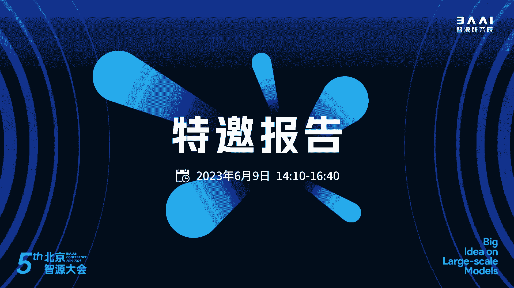
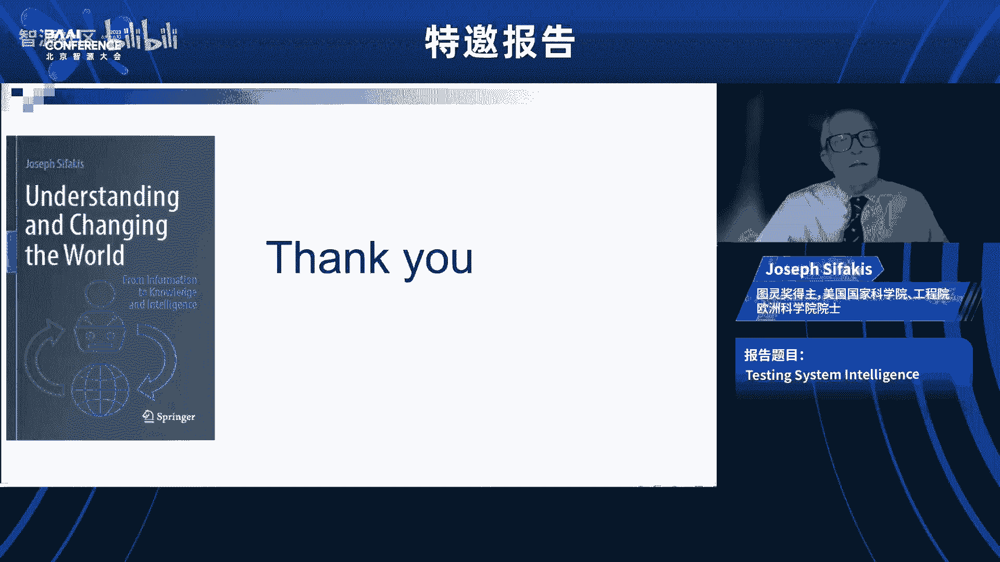
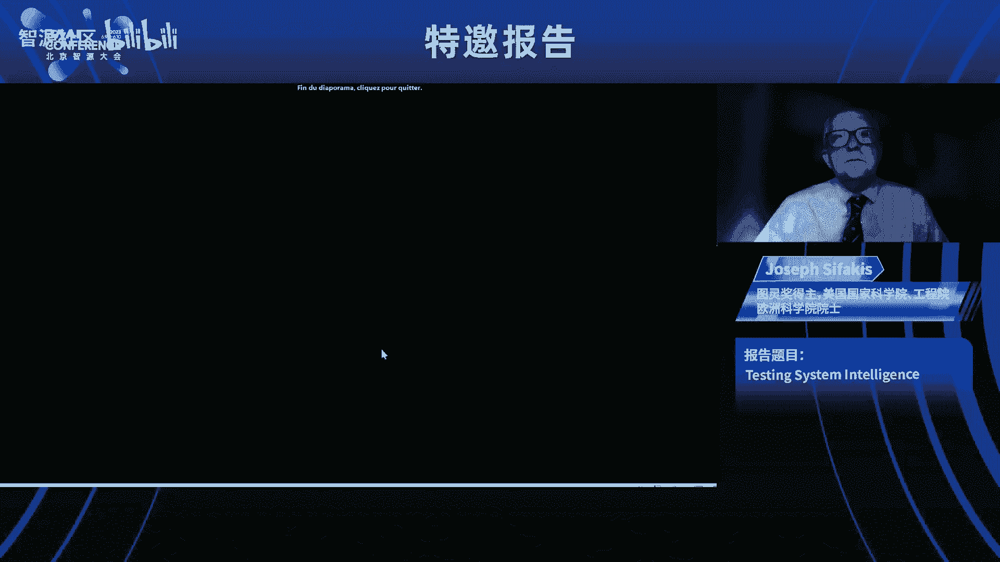
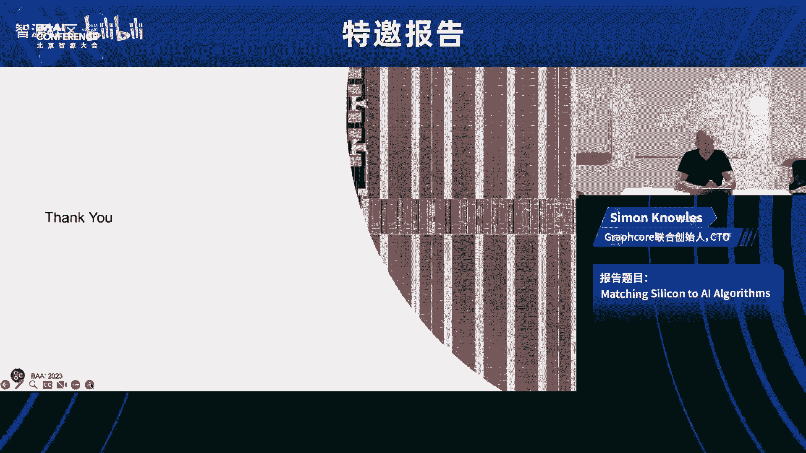
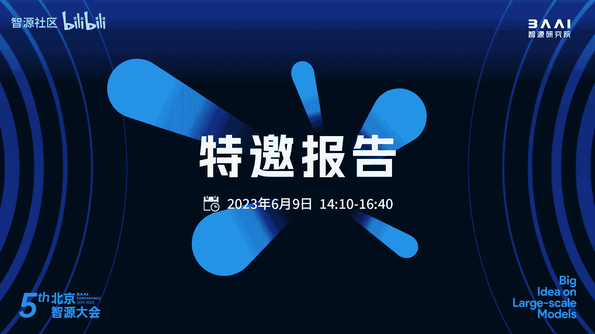

# 人工智能的现状、挑战与未来展望 🧠

在本节课中，我们将学习图灵奖得主Joseph Sifakis教授关于人工智能（AI）核心概念的深入探讨。课程将涵盖智能的定义、人类与机器智能的比较、自主系统的愿景，以及当前AI系统在验证和信任方面面临的重大挑战。

## 概述：什么是智能？

目前，对于什么是智能以及如何实现智能存在很多困惑。这种混乱由媒体和大型科技公司助长，它们传播的观点暗示人类水平的人工智能只需要几年时间。一些人相信机器可以离开人类独立运作，但这并非故事的结局。

字典将智力定义为学习、以合乎逻辑的方式理解和思考世界的能力。机器可以做出令人印象深刻的事情，但它们在情境感知、适应环境变化和创造性思维方面无法超越人类。对什么是智力达成明确的概念共识非常重要，没有这个概念，我们就无法发展出关于其工作原理的理论。

今天，我们只有弱人工智能，它为我们提供了构成智能系统的元素，但我们缺乏合成这些元素的原理和技术来构建一个更大的智能系统。未来，我们将观察到信息技术（IT）和人工智能（AI）之间的加速融合。

## 人类与机器智能的比较

上一节我们介绍了智能的基本概念，本节中我们来看看如何比较人类和机器的智能。

### 图灵测试及其局限性

艾伦·图灵提出了著名的图灵测试来比较人类和机器智能。测试设置如下：一个实验者C通过书面问题与两个房间（一个房间是机器A，另一个是人B）交流。如果C无法区分哪个是电脑，哪个是人，则认为A和B同样聪明。

今天，有些人声称他们的系统成功通过了图灵测试，因此是一个和人一样聪明的智能系统。然而，这个测试受到了批评，因为成功取决于人的主观判断，并且测试案例的选择可能带来偏见。另一个论点是，这个测试只是一个简单的对话游戏，而人类的大部分智慧是通过与环境的互动来表达的。

### 替换测试：一种更通用的方法

我提出了一种更通用的“替换测试”。其思想是：一个代理（可以是机器或人）A和另一个代理B一样聪明，如果A能成功地替换B执行给定任务。例如，如果一台机器能成功替换人类司机，那么它就和人类司机一样聪明。图灵测试只是此测试的一个特例，其任务仅限于对话游戏。替换测试将智力的概念相对化和泛化了。

### 两种思维与两种知识

人类思维结合了两个系统：
*   **系统一（快速思维）**：无意识、自动、毫不费力。这是我们走路、说话、演奏乐器时使用的思维方式，依赖于内隐知识。
*   **系统二（慢速思维）**：有意识、受控、费力的。这是理性、编程和问题解决的来源。

这与今天的两个计算系统有惊人的类比：
*   **传统计算机**：执行算法，类似于慢速思维，基于可理解的模型知识。
*   **神经网络**：经过训练后，基于数据知识运作，类似于快速思维。它们能区分猫和狗，但我们无法验证其内部运作，因为我们不理解它们是如何做到的。

人类和机器处理着不同类型的知识，其有效性和通用性各不相同。从技术角度看，机器学习产生的知识与科学知识之间存在巨大差异。

## 机器智能的短板：情境感知与常识

上一节我们比较了思维模式，本节中我们来看看机器在哪些关键领域落后于人类。

机器在情境感知方面难以与人类匹配。例如，自动驾驶汽车可能犯下将月亮误认为黄色交通灯的错误，而这永远不会发生在人类身上，因为人类明白交通灯不可能在天空中。

**常识知识**是一个世界的语义模型，从我们出生起就通过日常经验自动构建。我们用它来解释感官信息和自然语言。人类的理解结合了自下而上（从传感器到语义模型）和自上而下（从语义模型到感知）的推理。

相比之下，神经网络必须被训练在所有可能的天气条件下识别停车标志，而人类可以凭借心中的概念模型，即使标志部分被雪覆盖也能认出。同样，人类看到一系列图像能立刻解释为飞机事故，而机器只能单独分析每一帧，无法将因果关系联系起来。

总结来说，要让机器与人类的情境感知相匹配，它们需要能够建立环境模型、理解新情况，并整合水平和垂直推理。这是当今人工智能最难解决的问题之一。

## 人工智能系统的验证与信任挑战

上一节探讨了机器智能的局限性，本节中我们聚焦于确保AI系统可靠性的核心难题：验证。

一个重要的问题是人工智能系统的不可解释性。今天，一个系统被认为是可解释的，如果它的行为可以用我们可以理解的数学模型来描述。理论上，神经网络计算的函数可以被构建出来，但复杂性限制使得这在实际中不可行。

验证系统属性有两种主要方法：
1.  **形式化验证**：通过模型推理进行，尤其不适用于神经网络。
2.  **测试**：一种经验性验证方法，但存在限制，无法提供形式化验证那样的通用性保证。

系统工程关注三种主要类型的属性：**安全性**（系统永不进入危险状态）、**活性**（系统最终会做正确的事）和**性能**。目前，声称智能系统满足某些特性的出版物往往缺乏足够严格的定义和验证方法。

以下是测试方法的核心概念：
*   系统具有输入 `x`，产生输出 `y`。
*   属性 `P` 是输入和输出之间的关系。
*   验证系统满足属性 `P`，意味着对于任何可能的输入 `x` 和相应的输出 `y`，属性 `P(x, y)` 都成立。
*   对于具有大量输入的系统，穷举测试是不可能的，因此需要理论来指导测试用例的选择和结果评估。

然而，对于智能系统，我们缺乏这样的理论。另一个关键要求是**可重复性**，即测试结果应独立于特定输入集的选择。对抗性攻击的存在使得神经网络的测试与可重复性要求不一致。

对于智能系统，我们的验证能力是有限的，因为属性需要被严格形式化指定，这排除了像ChatGPT这样的通用语言转换器。以人为中心的属性（如“可信”或“有效”）也难以验证。

## 自主系统：人工智能的下一步

上一节讨论了验证的挑战，本节中我们转向一个更具前瞻性的话题：自主系统。

自主系统代表了从弱人工智能到人工通用智能的重要一步。自主系统支持智能系统的范式，超越了通常专门化的机器学习系统。它们源于用自主代理取代人类以进一步自动化组织的需求，例如在物联网、自动驾驶汽车、智能电网和智能工厂中。

自主系统是由代理组成的分布式系统，这些代理通常是关键性的，应表现出广泛的智慧：管理动态变化的相互冲突的目标集，应对物理环境中的不确定性，并与人类和谐合作。

然而，实现自主愿景受到两方面的阻碍：一是我们对必须使用的人工智能系统缺乏信任，二是系统工程中一些与智能关系不大的难题。

让我描述一个自主代理（如自动驾驶汽车）的架构。它包含以下核心组件：
*   **感知功能**：分析传感器数据，识别障碍物及其运动学属性。
*   **世界模型**：外部世界的内部表示。
*   **决策功能**：结合世界模型和多个目标（如避免碰撞、保持轨迹、抵达目的地）产生命令。
*   **知识库**：存储关于环境物体的知识。
*   **自学习功能**：监控信息并更新知识库，以增强预测和决策。

设计单个代理已经非常复杂，还需要将其集成到复杂的网络物理环境中，确保人机和谐交互，以及多个代理之间的协调（以实现集体智慧，如避免交通瓶颈）。

## 未来展望与总结

上一节我们勾勒了自主系统的蓝图，本节中我们以此为基础，展望人工智能的未来发展路径。

我认为未来将是传统系统工程与人工智能技术的集成。我们需要能够制造通用的人工智能制品。目前，传统的系统工程实践正在受到干扰，例如，一些制造商采用“端到端”基于AI的方法，并允许自我认证和关键软件的定期更新，这挑战了既定的安全概念。

未来发展的两个重要方向是：
1.  **全智能系统的混合设计**：在传统系统工程中集成人工智能组件。
2.  **发展建立可信系统的技术**：由于AI组件可能永远无法完全解释，我们需要发展基于统计估计置信度的验证技术，满足于比传统关键系统更弱的保证。

要弥合自动化与完全自治之间的鸿沟，还有很长的路要走。实现完全自治的愿景需要开发新的科学与工程基础。

关于智能本身，我们应该就智能的概念达成一致，并推广“替换测试”来相对化智能的概念。可以有多种智能，取决于选择的任务。人类智能是基准，人工通用智能应该能够执行和协调一系列具有人类技能特征的任务。

一个有趣的想法是探索可能的智能空间。人类和机器在不同维度上各有优势（例如，机器擅长分析多维数据，人类拥有常识、抽象和创造力），通过结合这些技能，可以创造出新的智能形式。

最后，智能系统的验证将是未来的热点话题。我们必须克服当前忽视验证局限性的趋势，避免降低逻辑和认知标准。神经网络的鲁棒性远不如人类思维，问题的细微变化可能导致截然不同的答案。我们应该承认对智能系统验证方法的需求，并以清晰的方式开发新的基础。

**本节课总结**：我们一起探讨了智能的定义，比较了人类与机器智能的差异，深入分析了机器在情境感知和常识方面的短板。我们审视了当前AI系统在验证与信任上面临的重大挑战，展望了自主系统作为AI发展的重要方向，并最终讨论了未来需要混合设计、新验证方法和更清晰智能概念的发展路径。通往强大且可信的人工智能之路依然漫长且充满挑战。