# 大语言模型前沿与挑战 🚀

在本节课中，我们将学习大语言模型（LLM）的当前发展状态、面临的挑战以及未来的研究方向。我们将探讨模型规模、多模态、安全性、学术与产业合作等核心议题，并了解训练大规模模型的实际工程经验。

---

## 大语言模型的突破与反思 🤔

这些模型在某些方面开始变得令人不安地像人类。显然，它目前还不是人类，但它具有一些类人的特质。这无疑吸引了大量的关注、资金和研究投入到这类模型中。因此，在不久的将来，我们显然会看到更多投资流向这个方向。

但关于人工智能、科学乃至技术的一个普遍事实是，总会有意想不到的惊喜。这并不意味着通向通用人工智能（AGI）的道路就是简单地让语言模型越来越大。我仍然期待会有惊喜出现。不过，我们确实从规模、数据和扩展性中学到了一些经验教训，这些经验很可能在未来继续适用，即使架构本身可能出现惊喜和转变。

---

## 智源研究院的视角与研究方向 🧭

本次会议的主题是大语言模型，这对于报道AI的我来说，是一个前所未有的激动人心的时刻。

那么，作为智源研究院的主席，我很想听听您对此的看法和思考。

好的，抱歉，这里的音响效果不太好，您能再重复一遍问题吗？

我的问题是，鉴于我们正在经历AI的重大时刻，从宏观角度看，您认为这对AI研究的现状和方向意味着什么？研究院未来可能会采取哪些方向？

这无疑是一个重大突破，它让我们每一个在该领域工作的人都开始重新思考我们一直在使用的方法、构建的系统架构以及研究的算法。

在ChatGPT出现之前，有大量工作在研究各种算法。但我一直非常推崇系统方法，即AI技术、AI本身将成为一个系统，而不仅仅是单一算法。这也是我参加这个论坛讨论的原因之一。

如果您回顾我们过去的工作，在计算机科学的大多数领域，尤其是在学术界，我们倾向于关注单一算法，并试图一点一点地改进它。但OpenAI采取了一种完全的系统方法。特别是，Transformer是由谷歌研究人员发明的，他们也推出了许多相当成功的模型，但其中没有一个真正展现出ChatGPT那样的涌现能力和强大力量。OpenAI如此出色地将数据、对齐算法和推理结合在一起，引领我们取得了这一突破。

因此，我认为整个领域都在重新思考我们如何进行研究，以及什么是解决AI问题最合适、最有效的方法。

举个例子，在自然语言处理这个AI非常基础的子领域，当ChatGPT出现时，据我所知，中国顶尖大学的一些研究组基本上都在告诉自己：我们需要回头审视。实际上，有一所大学真的告诉博士生：如果你今年毕业，我们无法阻止你，因为你必须毕业；但如果你明年毕业，你需要重新思考你的论文，因为你试图解决的问题可能已经被GPT模型解决了。所以，虽然你仍然可以毕业，但继续沿着原来的方向，你的工作就意义不大了，我的意思是，在推动前沿技术方面。

这确实非同寻常。我最近在麻省理工学院参加了一个活动，一些语言学家和认知科学家也在说，GPT-4和这些大语言模型正在改变他们的领域，我想也在改变科学的其他领域。

---

## 模型缺失的能力与创新方向 💡

肯尼斯，关于模型可能缺失什么这个话题，您觉得有趣吗？我是说，特别是ChatGPT，有没有让您觉得这是一个真正令人兴奋的新方向？洪江刚才提到了一些事情，我很好奇您的想法。

当我们思考可能缺失什么以及令人兴奋的新方向时，我的意思是，有些新方向是建立在现有成果之上的，现在我们可以探索以前不可能的事情；当然，模型也存在一些局限性。

也许可以先从建立在现有成果之上的令人兴奋的方向说起。我认为有一个非常不寻常的方向，我通常不常听人提起，但我经常思考，那就是我们以前从未有能力让计算机真正去处理“什么是有趣的”这个问题。

即使回想两三年前，你也无法想象从主观角度开始说：看看这个想法，告诉我你的看法，这真的是个好主意吗？它朝着好的方向发展吗？但这是第一次，你实际上可以让计算机开始处理这种主观问题。如果你仔细想想，这是一个极其重要的问题：什么是有趣的，什么是无趣的。尽管这完全是主观的，因为它是所有研究和创新生长的土壤。我决定做什么是基于我认为什么是有趣的。所以，如果这类模型有一天真的要解决我们世界上的重大、关键问题，它们需要思考哪些方向最有趣去追求，这样这些方向才能成为实际解决这些问题的垫脚石。

“有趣性”与你是否在解决问题是分开的，它只是一个问题：这是一个有趣的研究想法、一件有趣的艺术品还是一个有趣的故事？非常引人入胜的是，它突然可以开始参与这个问题，而不仅仅是给你一个评分，它甚至可以给你一个清晰的分析，说明为什么某件事有趣。这是创新的开始，是自主创新的开始。所以我认为这非常有趣，现在这成为可能了。

我也可以谈谈我认为有哪些有趣的局限性，但我不确定你是否想现在就朝那个方向讨论。

实际上，为什么不呢？洪江，您怎么看这个关于算法识别“什么是有趣”的想法，也许这是一种创新？这个概念听起来有前途吗？

绝对是，尽管我自己的专业领域不一定在这方面，但这绝对是一个非常有前途的方向。

---

## 模型的原创性与新颖性挑战 🎯

我想知道，肯尼斯，您认为……模型能告诉你一些人类无法告诉你的有趣事情吗？我的意思是，因为有时当你看到ChatGPT时，它令人印象深刻，但似乎并不那么原创。那么，您是否看到过它发现了一些可能没有人会认为有趣的东西的例子？

好问题。是的，我绝对相信，当与人类对有趣性的本能相比时，这些模型存在严重的局限性。确实，它们还差得远。所以，这只是处理“什么是有趣”这个问题的能力的开端。但这仍然非常有用，因为每当你思考“接下来我该做什么”时，它总是会出现。如果你想让某个东西自己思考“完成这个任务后，接下来做什么有趣的事情”，它必须稍微思考一下。即使只能做到一点点，也仍然非常引人入胜。但这显然是我们需要在此基础上继续发展的东西。

事实上，当你谈到缺乏原创性时，这完全正确。它们不会具有原创性，这是我认为需要改进模型的一个非常有趣的局限性。我想指出，原创性与新颖性相关。新颖性出现了，我认为当前的范式在真正识别新颖性方面存在问题。

因为如果你仔细想想，新颖性是时间顺序的函数，它取决于事件发生的顺序，你现在有的想法是否新颖。但如果你想想，模型是同时接触到所有历史数据的，它并不将其训练数据体验为按顺序发生的时间线。因此，它实际上并没有体验到那种“顿悟”的时刻，当你觉得“哦，这真的很有趣，因为我以前从未见过类似的东西”。所以，例如，如果数据中说“那是一个真正新颖的想法”，它并不是在“之前发生了什么”的背景下，而是在“曾经发生过什么”和“之后发生了什么”的背景下。这与我们体验新颖性的方式非常不同。

正因为如此，新颖性在任何实质性意义上都不存在于数据中。这意味着我预计它不擅长思考新颖性、生成新颖性等等。要解决这个问题，我认为需要某种范式转变，因为你必须处理时间顺序。

---

## 强化学习、对齐与多模态未来 🤖

这太迷人了。本周早些时候，我和DeepMind的人聊过，他谈到了强化学习的重要性。显然，AlphaZero和AlphaGo能够想出完全新颖的策略，这与语言模型非常不同，但这很有趣，比如人们永远无法想出的东西。

但我想知道，您提到了对齐，洪江，强化学习或其他类型的机器学习是否作为拓宽模型能力的一种方式，引起了研究院的兴趣？

实际上，强化学习和对齐在构建大模型时并不是两件不同的事情。实际上，在训练过程中，强化学习被用于对齐过程。这正是使ChatGPT、使GPT-4比GPT-3.5好得多的原因。从GPT-3到InstructGPT再到ChatGPT，真正关键的是使用了强化学习进行人类反馈的对齐过程。所以，在对齐过程中，强化学习是一种超级重要的学习算法。对齐本身也是通向AGI、大模型安全以及与人类价值观对齐的关键步骤方法。因此，它超级重要。

同时，对齐本身也是一种非常有效的方法，可以将模型精炼和训练到特定的应用中。通过对齐过程将更多领域特定的数据融入模型，这将帮助我们真正使模型适应各种场景、各种应用、各个垂直领域。

这很棒。还有其他您感兴趣或认为……我知道有WuDao模型，我的理解是它与其他模型有些不同，它从一开始就是多模态的，对吧？您是否在关注其他机器学习技术？对于下一代语言模型，您对什么感兴趣？

在ChatGPT或GPT-4之前，该领域的人们一直在研究各种模型，比如谷歌大脑推出了BERT等等。所有这些研究和研究人员都为大规模模型领域做出了贡献。尽管今天我们看到基于Transformer的预训练，结合对齐，是最有效的方法，引领了GPT-4以及许多试图复制GPT-4成功的模型。

但我们确实看到，存在一个广阔的空间，仍有许多问题尚未解决，需要进一步的研究，这为新的架构甚至全新的架构提供了理由。

您也提到了多模态模型。这绝对是该领域人们正在努力追求的一个方向，我们确实将其视为AI模型的未来方向，如果不是最终方向的话。我们人类通过多模态感知信息、获取知识。我们阅读，从语言中学习，但我们也看电影，看视频，看图片。我们获取信息的方式是多模态的。我不是神经科学家，但我相信我们大脑中的思维也是多模态的。所以，没有理由我们的AI模型只能是语言模型。

但我想强调，语言模型是基线，是平台。我们学习如何构建模型、构建语言模型的技术，我们从中学到的内部原理，将帮助我们开发多模态模型。实际上，多模态模型可以简单地看作是语言模型的延续。使用Transformer作为基本架构的好处在于，对于Transformer来说，每个模态的数据都只是一个序列。文本、语言是一个序列。图像，如果你通过图像块扫描，也是一个序列。视频是一个序列，音乐也是一个序列。所以它可以处理、承载所有这些信息，并将它们嵌入到学习训练结构和模型本身中。

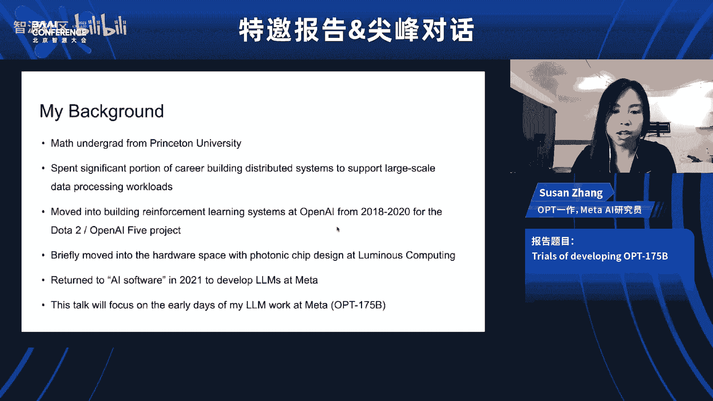

所以，如果我们相信未来将是自主智能，意味着模型本身可以进行推理、理解、规划和采取行动，那么模型本身必须是多模态的，并且肯定要应用于机器人技术、未来的自主机器人技术以及通用自主机器人技术，它绝对将是多模态模型。

---

## 时间顺序与模型局限性 ⏳

这是一个很好的过渡，肯尼斯。您关于开放式学习、持续学习的工作，以及您刚才提到的关于时间数据表明，也许我们接近智能的方式还有更多维度……这么说公平吗？我的意思是，您如何看待这种多模态性和构建智能系统的其他方式？您认为这需要完全不同的架构和方法吗？

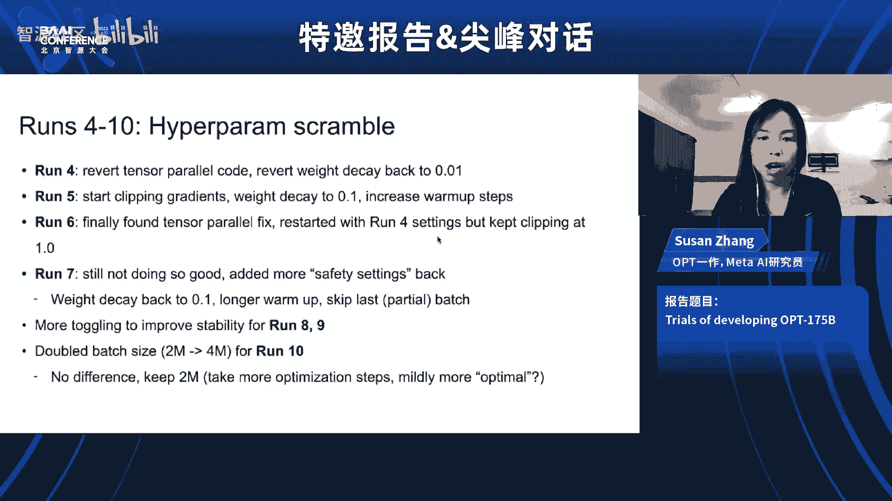

是的，我的意思是，我认为有很多，因为这些模型如此强大，从一个研究者的角度来看，思考缺失了什么非常引人入胜。我经常思考还缺少哪些基本的东西。你知道，没有很多东西是非常明显缺失的，因为你可以说，只要数据里有，它最终总会被捕捉到。所以我们拥有大量数据是一个巨大优势。

但有一些非常具体的事情，新颖性并不仅仅内在于数据中，因为数据呈现的方式。其中之一就是这种时间顺序。时间顺序不在数据中，因为数据不是按时间顺序呈现的。另一个类似的是多模态性。当然，多模态性不在纯文本数据中。所以这显然是一个机会。毫无疑问，我们将会看到多模态方面的进步。

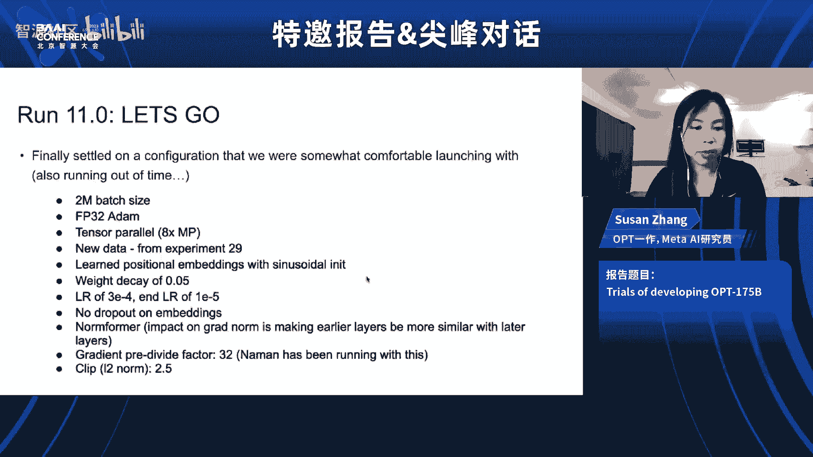

但时间顺序有点不同，因为你不能只是把它放进去。确切地说这意味着什么并不清楚。你不能只是把时间顺序数据放入一个不按时间顺序处理事物的东西中。有一个小地方你可以把时间顺序偷偷塞进这些模型，那就是上下文本身或提示中。这是一个它可以有顺序的地方。但问题是，像所有人类历史这样庞大的信息，通常无法放入当前类型的提示空间中，可能很长一段时间内都无法。对于整个互联网来说也是如此。所以这是一个问题，只是一个有趣的研究问题。

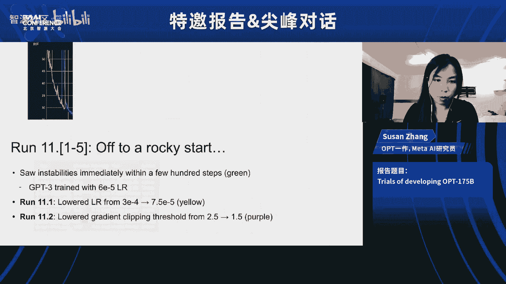

所以我认为只有少数几件这样的事情，比如时间顺序和多模态性，你可以具体指出。其他的则更像是模糊的愿望，比如“幻觉”问题，我们看到问题，但我们不能真正确切指出缺失的是什么，问题到底是什么。有时我在想，也许幻觉问题在于，理解你实际知道什么和不知道什么是一种非语言活动，这意味着它不会出现在数据中。就像我为了思考我是否真的记得某件事而在脑海中进行的推理过程，当我在头脑内部，并没有实际表达出来，只是试图回忆别人问我的事情时，有一个推理过程让我得出结论：我实际上不知道那个，或者我知道那个。也许如果它是非语言的，并且不在数据中，因为数据只是从你嘴里说出来的，而不是之前隐含在你脑海里的，那么也许那里缺少了什么东西。但这更模糊，更难具体指出。但这只是一个普遍有趣的练习，思考还缺少什么，我们可以在哪些地方推进，也许能从认知科学中获得一些重要的见解。

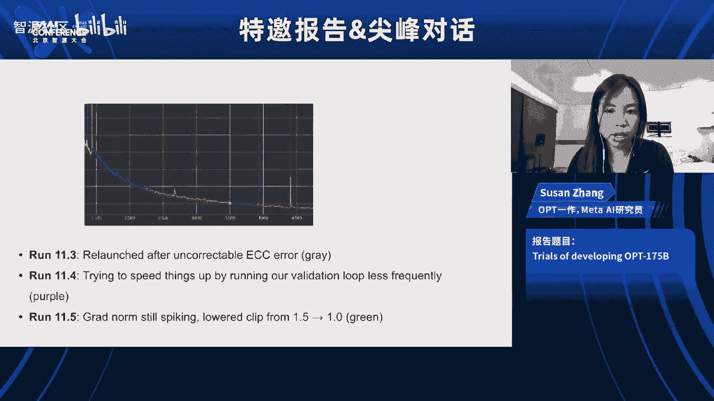

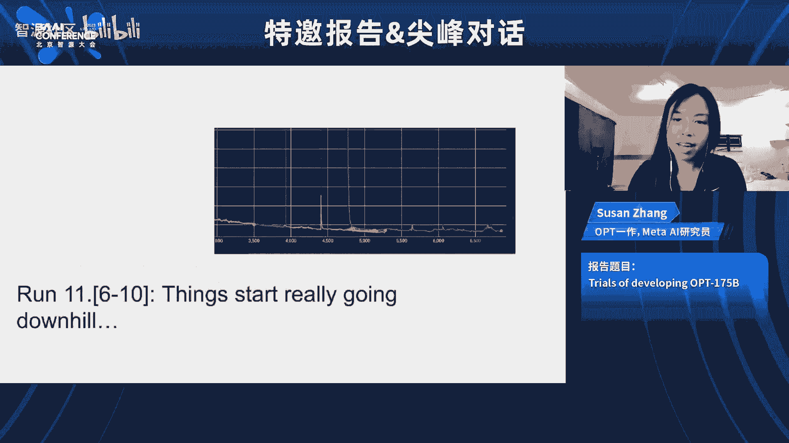

---

## 认知科学与神经科学的启示 🧠

所以，如果你想想那些展示人们思考或推理方式的实验，有时它不是语言的或不是文本的。您认为这是一个重要的方法吗？也许可以继续您刚才说的？

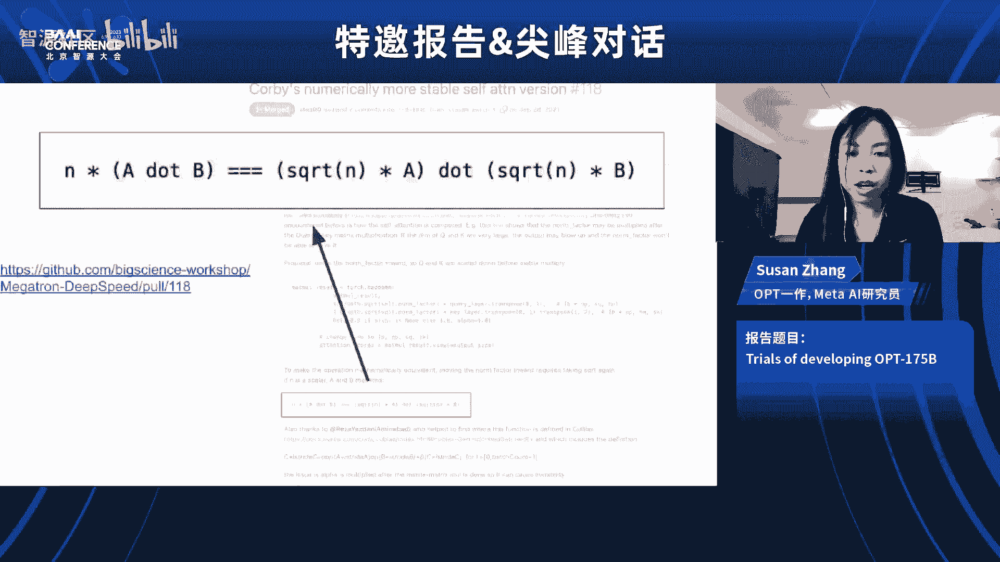

也许吧。我的意思是，我认为从历史上看，这并没有很好地实现。如果你看看大语言模型及其成功的方面，这是相当了不起的，其中大部分并不是研究认知科学实验的结果，也许这让认知科学家们感到懊恼。但这并不意味着它将来不会有帮助。但我更多地认为这只是作为一种灵感，因为你知道，非常隐式的非语言推理，如果它存在，是那么难以触及。我更期望它会是某种正确训练方式中涌现出来的东西，而不是你可以明确提取然后写下来“这就是它如何工作的”那种东西。所以我猜想，你更希望以某种方式重组训练，也许你可以强化类似那样的学习，这样我们就能引出这些非语言的步骤，这些步骤对应于当我们试图确定某件事是否真实或是否可以被记住时所做的事情。

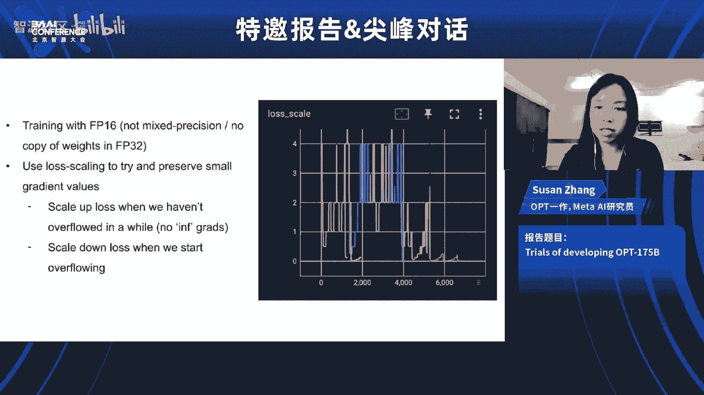

洪江，我知道您的研究院里有神经科学家和认知科学家。您认为我们可以从这些领域学到什么？

这是一个奇怪的时代，因为感觉语言模型解决了这么多问题。但是，是的，也许仍然有一些东西我们认为肯定可以从那些领域学习，但这仍然是正在进行的研究，老实说，目前还有很多工作要做，我们还没有得出任何可以应用于构建大模型的重要结论。

另一方面，实际上，我不知道你是否读过OpenAI团队最近发表的工作，关于使用GPT-4来分析GPT-2，以了解神经元在GPT-2中的功能。当GPT-2生成特定的上下文或输出时，这非常非常有趣。所以我实际上鼓励那些从事神经科学研究的人尝试从这里借鉴一些想法。不仅仅是我们从神经科学家那里借鉴想法，反过来也是一个非常有趣的研究方向。

回到你的问题，是的，在智源研究院，我们有一个来自清华大学和北京其他大学的科学家组成的扩展团队，我们正在精确地研究从神经科学学习的问题。我们还有一个小团队在构建我们所谓的生命模型，模拟人类器官和大脑，以帮助神经科学家研究，例如，如果特定的神经元被激活，整个大脑会如何反应。我们实际上有一个小团队在做这个，我们昨天在会议的年度报告中报告了这一点。

---

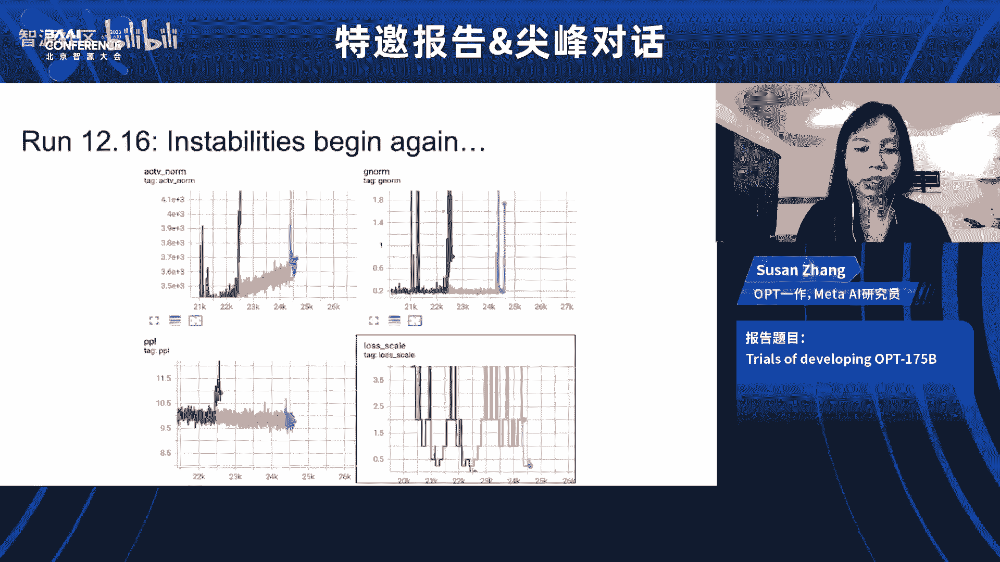

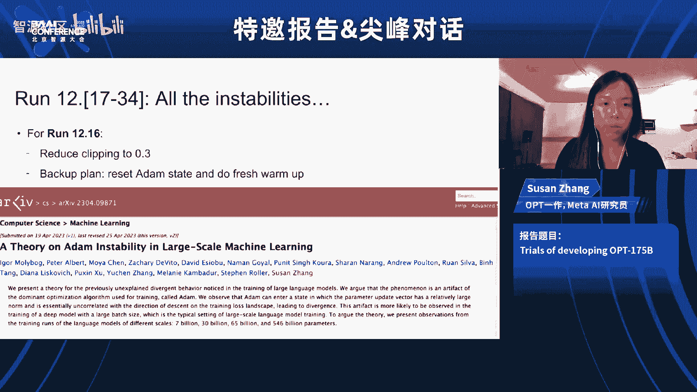

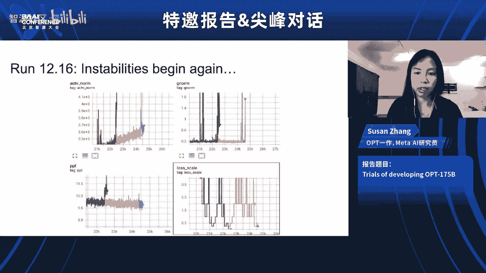

## 模型规模、算力与学术合作 💻

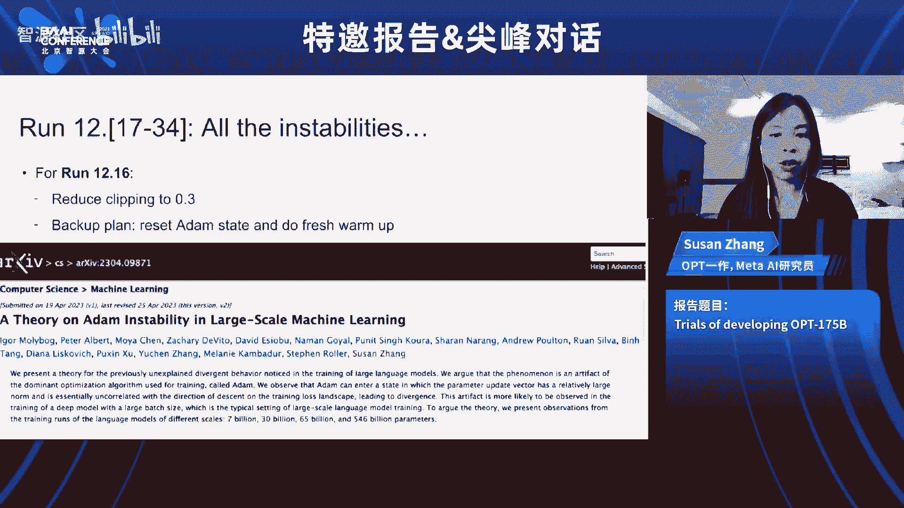

这太酷了。谈到大脑的复杂性，让我想到另一个话题，那就是这些模型的规模、所需的计算能力。你知道，这非常了不起，我想我们都知道这一点，这也是我们看到如此惊人结果的原因之一。但是，洪江，对您来说，您认为这对研究意味着什么？这是否意味着它将变得不那么容易获得，不那么可能让那么多人从事这些模型的研究？您认为我们是否会看到更多努力来制造更小的模型？这些模型的规模和数据量告诉您关于未来方向的什么？

你实际上提出了很多问题。一个非常直接的问题，我想解决的是，你提到了研究人员将如何应对这个问题，因为任何与大模型相关的工作都需要大量的计算能力，这显然需要他们在系统上合作，彼此之间合作，并与产业伙伴合作。

以清华大学为例，如果你数一数有多少教授和研究人员在从事与大模型相关的课题，他们实际上拥有相当多数量的GPU，但它们分散在不同的研究组中，对吧？所以，让他们联合起来，整合他们的资源，显然是解决他们想要研究更大问题的一个方案。

但我也想说，科学家，尤其是大学里的科学家，应该并且倾向于研究基本问题、基础问题，其中许多仍然可以在没有巨大计算能力的情况下进行研究。但如果他们想构建系统，他们绝对需要彼此之间以及与产业界合作。

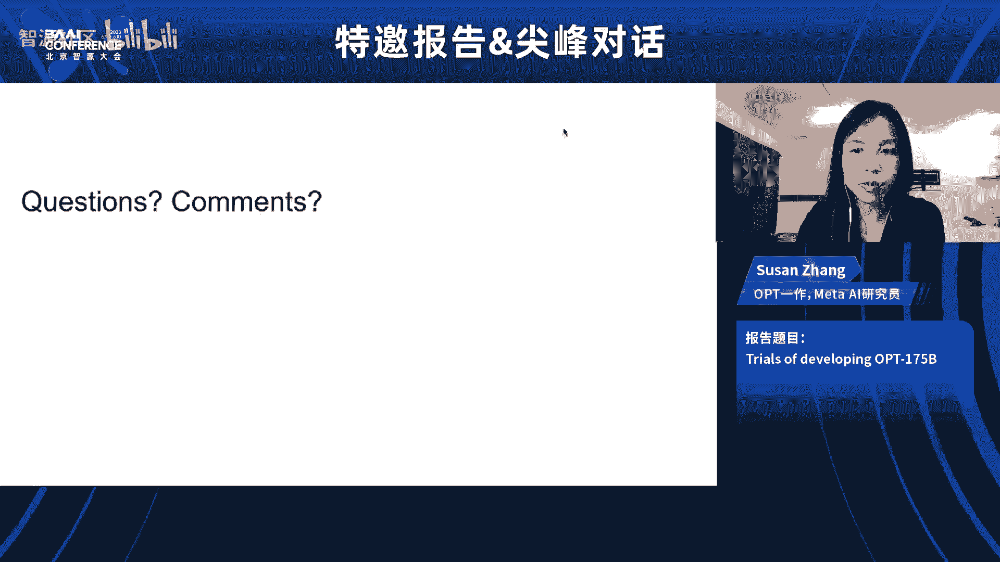

但我愿意从一个积极的角度看待这个问题。实际上，我认为GPT-4的突破让我们研究界，尤其是学术界的许多人重新思考在计算机科学和人工智能领域进行研究的最佳方式是什么。如果我们想构建一个系统，如果我们相信AI是一个系统，问题只能通过系统方法解决，那么我们就应该集中我们的努力，整合我们的资源，真正将研究问题塑造成我们可以共同合作的东西。

我认为您在将学术界和产业界结合起来方面已经做了一些令人印象深刻的工作。

但这确实需要付出很多努力。

---

## 产业与学术界的协作模式 🤝

那么，这其中最具挑战性的事情是什么？

嗯，我想我首先要说，GPT-4的成功实际上对我们帮助很大。所以从现在开始，我认为会容易得多。但两年前要困难得多。学术界的一个基本特征是自由，教授们可以研究他们感兴趣的任何东西，这是学术界的好事。但是，当我们想把学术界的所有人聚集起来共同研究一个问题时，他们自然会从不同角度看待问题，哦，我做这部分，他做那部分。但让他们共同致力于一件事，甚至试图将一个更大的问题分解成若干部分，让每个人负责一部分，这太难了，因为这不是学术界的运作方式。

实际上，这恰恰说明了为什么第一个成功来自OpenAI，因为他们采取了系统和工程方法。而谷歌大脑拥有更大的资源和更知名的科学家团队，但他们无法将努力集中到一个模型上，而是推出了许多模型。这展示了大学学术界的情况更加分散。所以这确实需要付出大量努力、信念以及激励人们和合理分配资源的能力。

---

## 资源鸿沟与学术研究的价值 🎓

是的，这很棒。肯尼斯，我的意思是，您曾在OpenAI，我猜他们围绕这种单一方法有很强的信念。但您后来去了学术界，那么您的想法是什么？为什么不留在拥有大量资源的地方？

您的意思是，我在OpenAI之后去了学术界？实际上，我在去OpenAI之前就是学术界的人。哦，我明白了，您实际上是反方向流动的。哦，我明白您的意思了。是什么吸引了您？是那样吗？

这是一个很长的故事。但故事的一部分是，我认识到我将获得 vastly greater resources。我的意思是，这当然是我考虑的因素，我认为这对学术界来说是一个大问题，产业界倾向于把教授从学术界吸走，这伤害了这些院系和整个学术事业。我认为值得大学方面深思如何应对这个问题，因为从他们的角度来看，这是前所未有的。我的意思是，大多数学术领域没有发生过这种事情，去其他地方更有利可图、条件更好，人们没有这种选择权。但在这个领域，情况非常不同。所以我认为大学需要以不同的方式对待这个领域的教授，这样我们才能维持那种培养下一代并孕育这些思想的架构，而这些思想在产业界是得不到的。所以双方都完全重要。

---

## AI安全与长期风险 ⚠️

这些想法很棒。我们讨论了很多关于语言模型和ChatGPT的话题，但还没有提到安全性，以及AGI带来的那种存在性安全。我的意思是，我通常不会提起它，但这是一个讨论的热门话题。似乎很多人都在认真对待短期和长期风险。

所以我想问，这如何影响研究？我的意思是，这似乎将成为一个巨大的新研究领域，它会影响信息披露吗？肯尼斯，您认为这会如何改变现状？我不知道您在AGI和AI担忧谱系上处于什么位置。

不，我认为值得担忧。但我的意思是，我更多处于一种不确定的状态，我不完全确定该有多担心。但我认为值得担忧，因为有很多事情可能最终成为非常重大的短期和长期威胁。但你知道，很多人以确定的态度讨论这个问题，我认为在目前这个时间