# 生成模型论坛

## 课程概述 📚

在本节课中，我们将学习生成模型的前沿进展。课程内容整理自2023年北京智源大会生成模型论坛的演讲，涵盖了从基础理论到多模态应用等多个方面。我们将跟随多位顶尖研究者的分享，深入理解生成模型的核心思想、技术挑战以及最新突破。

---

## 论坛开场与嘉宾介绍 🎤

欢迎来到2023年北京智源大会的生成模型论坛。我是论坛的主席和主持人李崇轩。

我们非常荣幸邀请到斯坦福大学Man教授、浙江大学赵州教授、智源研究院刘广研究员、UCLA周博磊教授以及斯坦福大学吴家俊教授，为大家带来生成模型的前沿进展报告。

论坛最后将有一个简短的圆桌讨论，邀请清华大学朱军教授与各位讲者进行更深入的探讨。

---

## 第一节：基于分数的生成模型理论 🔬

本节中，我们将跟随斯坦福大学Man教授的分享，探讨如何绕过概率密度函数建模的难题，转而使用“分数”来构建更灵活的生成模型。

### 生成模型的挑战与目标

生成模型的目标是理解并模拟自然数据的分布，例如图像。我们假设存在一个未知的底层数据分布 **P_data(x)**，它给合理的图像（像素组合有意义、物体结构正确）分配高概率。我们只能访问从该分布中采样得到的大量样本（例如互联网图像）。

目标是构建一个模型分布 **P_model(x; θ)**，使其尽可能接近真实数据分布。如果成功，我们可以：
1.  **从模型中采样**：生成符合数据分布的新图像。
2.  **评估概率**：判断给定图像是否可能来自该分布，可用于检测异常输入或对抗攻击。

### 直接建模概率密度的困难

一个自然的想法是使用深度神经网络来构建这个复杂的概率函数：**P_model(x; θ) = exp(f(x; θ)) / Z(θ)**。
*   **f(x; θ)** 是神经网络的输出。
*   **Z(θ)** 是归一化常数（配分函数），确保概率总和为1。

然而，计算 **Z(θ)** 涉及在高维空间（所有可能图像）上的积分，这在计算上是难解的（即使是离散空间，也是#P完全问题）。

### 分数函数：一个更好的替代方案

解决方案是转而建模概率密度函数的梯度，即**分数函数（Score Function）**：**s(x) = ∇_x log p(x)**。

直观上，概率密度函数 **p(x)** 在点 **x** 处的分数是一个向量，指向概率增长最快的方向。

**关键优势**：
*   分数函数不需要满足归一化约束。当我们对 `log p(x) = f(x; θ) - log Z(θ)` 求关于 **x** 的梯度时，与 **x** 无关的 `log Z(θ)` 项消失：**∇_x log p(x) = ∇_x f(x; θ)**。
*   因此，我们可以直接用一个神经网络 **s_θ(x)** 来建模分数，无需担心难解的归一化常数。

### 从数据中估计分数函数

给定从数据分布中采样的训练集，我们需要训练分数模型 **s_θ(x)** 以逼近真实分数 **∇_x log p_data(x)**。

一个合理的目标是最小化模型分数与真实分数之间的差异。这可以通过**分数匹配（Score Matching）** 目标函数实现，其基本形式是费舍尔散度（Fisher Divergence）：
**J(θ) = 1/2 * E_{p_data(x)} [ || s_θ(x) - ∇_x log p_data(x) ||^2 ]**

通过分部积分，可以将其转化为一个不依赖于真实分数的、可计算的形式：
**J(θ) = E_{p_data(x)} [ trace(∇_x s_θ(x)) + 1/2 || s_θ(x) ||^2 ] + const.**

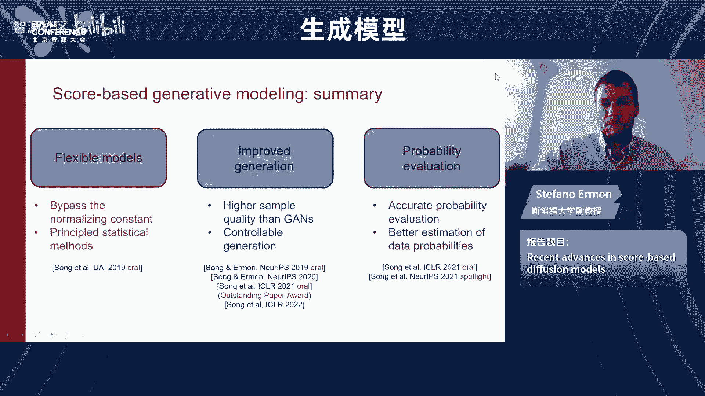

其中 `trace(∇_x s_θ(x))` 是分数函数雅可比矩阵的迹。为了高效计算，可以采用**切片分数匹配（Sliced Score Matching）** 等方法，通过比较随机投影来近似，从而将计算复杂度与数据维度解耦。

### 使用分数模型生成样本：朗之万动力学

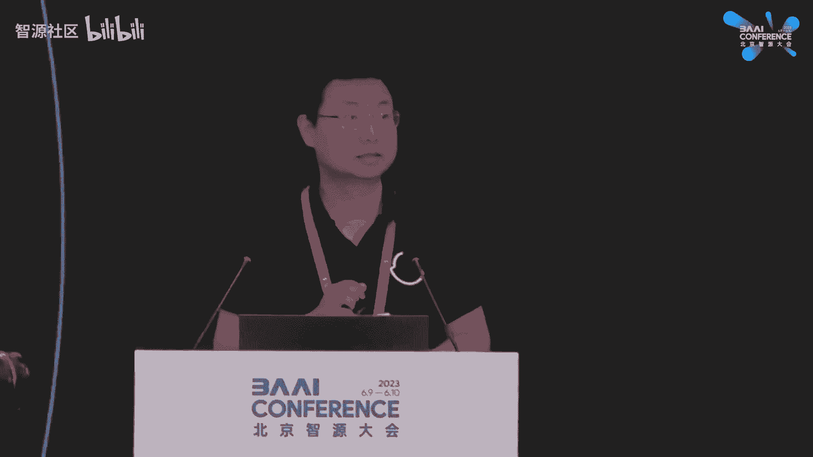

有了分数模型，我们如何生成样本？直观策略是：从随机噪声开始，沿着分数（梯度）方向移动，走向高概率区域。

一个有效的采样算法是**朗之万动力学（Langevin Dynamics）**：
**x_{t+1} = x_t + ε * s_θ(x_t) + √(2ε) * z_t**, 其中 **z_t ~ N(0, I)**

它在每一步跟随梯度并添加少量噪声。理论上，当步长 ε 足够小、迭代步数足够多时，生成的样本将服从模型分布。

### 解决低概率区域分数估计不准的问题

然而，直接应用上述方法可能失败。因为分数匹配只在训练数据覆盖的区域（高概率区域）能准确估计分数。在低概率区域（如随机噪声），分数估计可能非常不准确，导致朗之万动力学迷失方向。

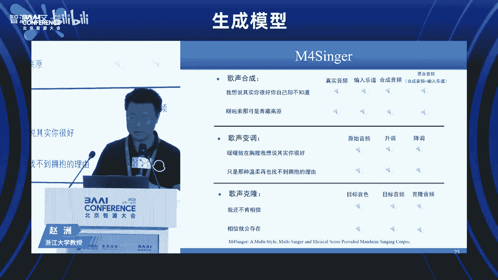

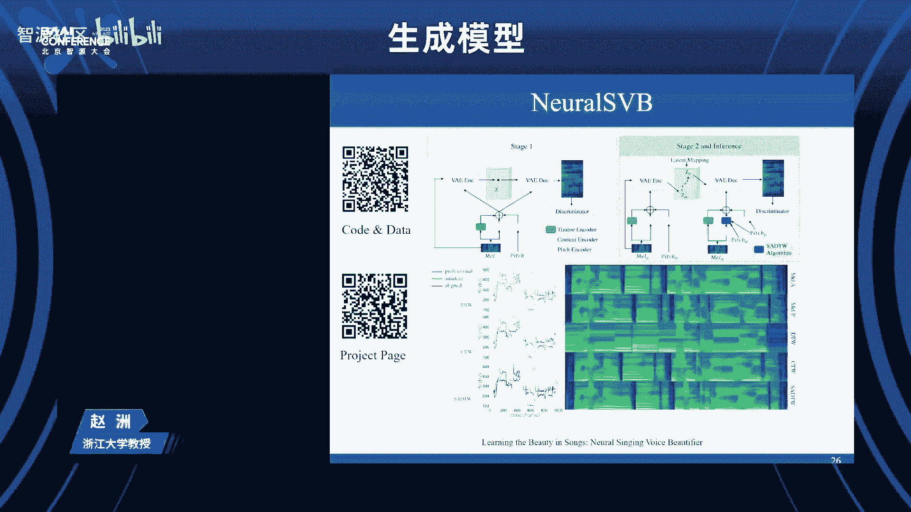

解决方案是**用噪声扰动数据**。通过向数据添加不同强度的高斯噪声，我们得到一系列扰动数据分布 **p_σ(x) = ∫ p_data(y) N(x; y, σ^2 I) dy**。
*   添加噪声后，分布的支持集覆盖整个空间，使得我们能够在所有区域估计分数。
*   但我们现在采样的是噪声数据，而非干净数据。

### 多噪声水平与退火朗之万动力学

最终的方案是使用**多个噪声水平**：**{σ_1, σ_2, ..., σ_L}**，其中 σ_1 最大，σ_L 趋近于0。
1.  我们训练一个**条件分数网络** **s_θ(x, σ)**，使其能估计每个噪声水平下的分数。
2.  采样时，采用**退火朗之万动力学（Annealed Langevin Dynamics）**：
    *   从最大噪声水平 σ_1 开始，用朗之万动力学从噪声中采样，得到近似分布 **p_{σ_1}(x)** 的样本。
    *   将这些样本作为下一级噪声水平 σ_2 的初始点，继续采样。
    *   重复此过程，直到噪声水平足够小（σ_L），此时采样结果近似来自干净数据分布 **p_data(x)**。

这种方法在2019年左右首次在CIFAR-10等数据集上取得了超越生成对抗网络（GANs）的生成质量，成为了当前Stable Diffusion、DALL·E 2、Midjourney等强大文生图模型的核心技术基础。

### 基于分数的可控生成

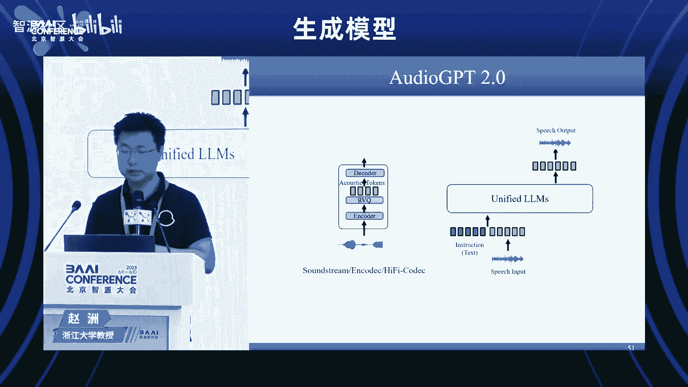

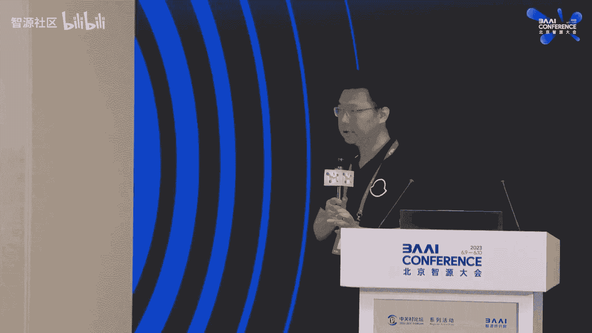

分数模型的一个强大之处在于便于进行**条件生成**。假设我们有一个先验生成模型 **p(x)** 和一个前向模型（如分类器）**p(y|x)**，我们希望从后验分布 **p(x|y)** 中采样。

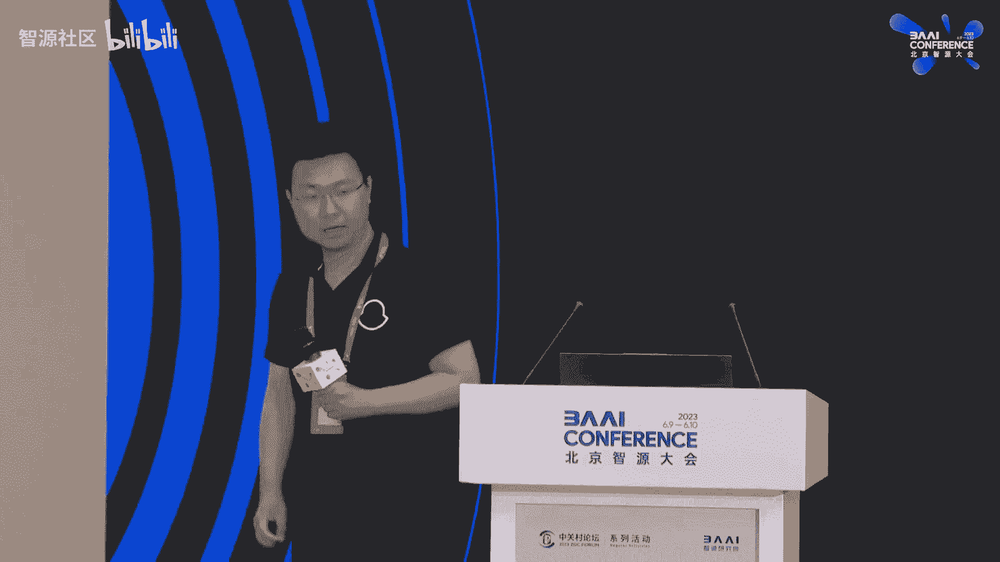

根据贝叶斯规则：**p(x|y) = p(y|x) p(x) / p(y)**。计算分母 **p(y)** 同样是难解的。

但如果我们考虑对数后验的分数：
**∇_x log p(x|y) = ∇_x log p(y|x) + ∇_x log p(x)**

可以看到，难解的归一化项 **p(y)** 在对数梯度中消失了。因此，后验分布的分数 = 先验模型的分数 + 似然函数的分数。

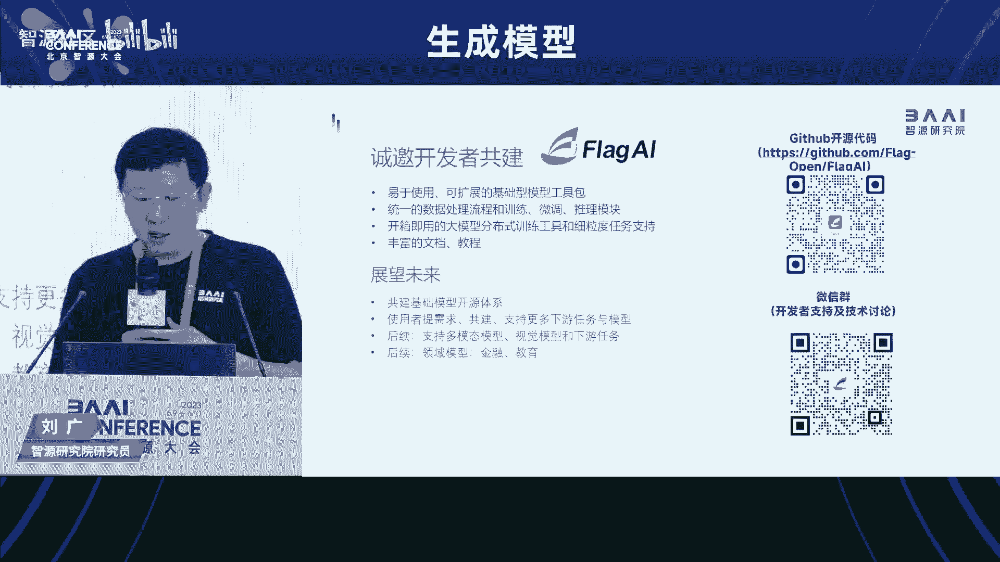

这开启了多种应用：
*   **类别条件生成**：结合无条件图像生成模型和图像分类器，生成指定类别（如“狗”）的图像。
*   **草图生成图像**：结合生成模型和草图一致性似然函数。
*   **语言引导图像生成**：结合生成模型和图像描述模型，实现文生图。
*   **医学图像重建**：结合医学图像先验模型和物理成像前向模型，实现高质量重建。

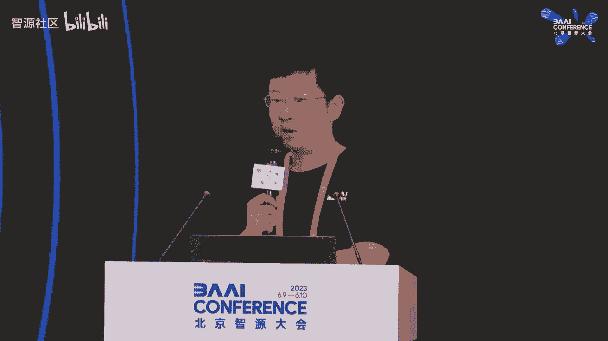

### 与扩散模型的联系

当考虑连续无限的噪声水平时，上述框架便与**扩散模型（Diffusion Models）** 联系起来。
*   **前向过程**：定义一个随机微分方程（SDE），从数据 **x(0)** 开始，逐步添加噪声，直到在时间 **T** 变成纯噪声 **x(T)**。
*   **反向过程**：生成数据对应于从噪声 **x(T)** 反向运行SDE到 **x(0)**。关键的是，这个反向SDE的漂移系数依赖于**分数函数** **∇_x log p_t(x)**。
*   因此，通过分数匹配估计分数，我们就能定义反向SDE，从而从噪声生成数据。

这种SDE视角带来了额外优势：
*   可以将反向SDE转化为一个确定性的常微分方程（ODE）。
*   利用数值ODE求解器的丰富技术，可以设计更快的采样器（如通过更粗的时间离散化、并行求解、知识蒸馏等），实现一步或几步的高质量生成。

### 本节总结

本节课我们一起学习了分数生成模型的核心思想：
1.  通过建模**分数函数**而非概率密度，绕过难解的归一化常数问题。
2.  使用**分数匹配**目标，可以从数据中直接训练分数模型。
3.  采用**多噪声水平**和**退火朗之万动力学**来解决低概率区域分数估计不准的问题，实现高质量样本生成。
4.  分数模型天然支持**可控生成**，通过简单相加即可结合先验和似然模型。
5.  该框架与**扩散模型**等价，并可通过ODE求解器加速采样。
这些技术构成了当前图像、视频、语音等领域生成式AI大进展的核心基础。

---

## 第二节：多模态音频生成式模型 🎵

上一节我们介绍了生成模型的基础理论，本节中我们来看看生成模型在音频领域的应用。我们将跟随浙江大学赵州教授的分享，探讨语音、歌声及开放域音频的生成技术。

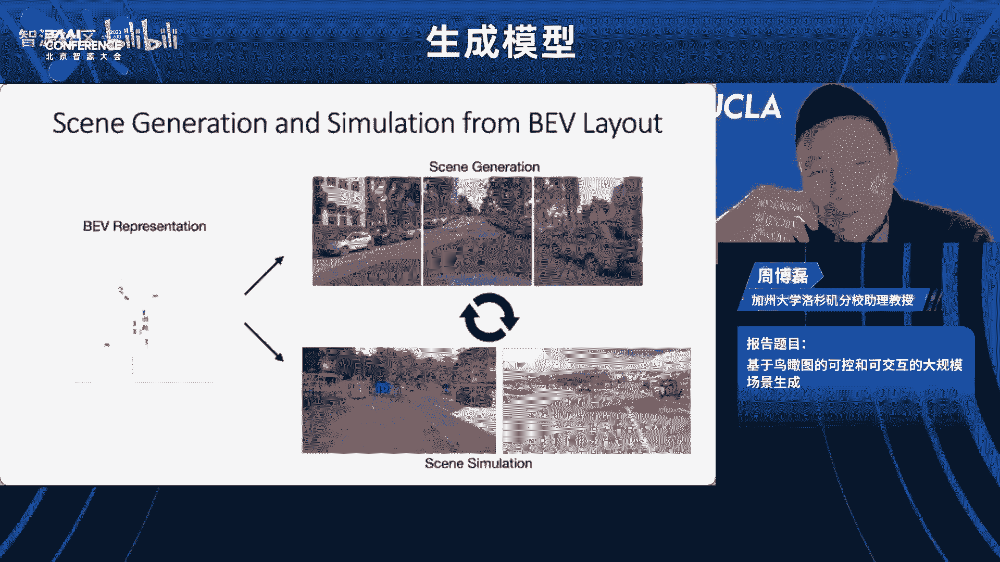

### 语音合成：从文本到语音

语音合成（TTS）旨在将文本转换为自然的人声语音。其流程通常分为三部分：
1.  **前端**：文本分析，提取音素、韵律等信息。
2.  **声学模型**：将音素序列映射为声学特征（如梅尔频谱图）。
3.  **声码器**：将声学特征转换为最终的语音波形。

本节聚焦于**声学模型**的生成式方法。

#### 快速推理与高质量生成的平衡

以下是语音合成模型演进中需要解决的关键问题及对应工作：
*   **问题：自回归模型推理慢，存在漏词**
    *   **工作：FastSpeech** 采用非自回归架构，引入长度调节器（Length Regulator）预测每个音素的持续时间，实现并行解码，极大加速推理。
*   **问题：在加速的同时保持或提升音质**
    *   **工作：FastSpeech 2** 扩展了预测目标，不仅预测持续时间，还预测音高、能量等更多声学特征，进一步提升了生成质量。
*   **问题：模型参数量大，不利于端侧部署**
    *   **工作：PortaSpeech** 级联变分自编码器（VAE）和基于流的模型，在保持音质的同时大幅压缩模型参数量。
*   **问题：中文的多音字问题**
    *   **工作**：引入中文词典，结合上下文信息来准确确定多音字的发音。
*   **问题：实现个性化与泛化**
    *   **工作**：对声学特征进行解耦，在韵律等离散特征上应用语言模型，实现零样本语音合成和音色转换。

### 歌声合成

歌声合成比语音合成更具表现力，得益于扩散模型的应用。

**核心思想**：采用两阶段级联模型。
1.  第一个模型（如FastSpeech）捕获语义信息，生成一个初步的、表现力较弱的频谱。
2.  第二个模型（扩散模型）以初步频谱为条件，进行多步去噪，生成高质量、富有表现力的歌声频谱。

这种方法（如DiffSinger）能合成音高准确、富有情感的歌声，并支持变调、音色克隆、歌声美化等编辑操作。

### 开放域音频生成

开放域音频生成的目标是根据文本、图像、视频等多种模态的提示，生成对应的音效或环境声。

以下是该方向的系列工作：
*   **Make-An-Audio**：基于扩散模型，支持从文本、图像、视频生成对应音频，或进行音频修复。通过设计数据增强规则，从有限的音频-文本对数据中构建大规模训练集。
*   **Make-An-Audio 2**：利用大语言模型（LLM）进行更复杂、时序性的提示词增强，生成更具时序结构和逻辑的音频。
*   **Make-A-Voice**：对音频进行解耦和离散化表示。将语义信息映射到离散token，声学信息用另一套token表示，从而实现高效的零样本语音合成、歌声合成和声音转换。
*   **AudioGPT**：将上述多种音频生成与理解能力集成到一个统一的大语言模型框架中，通过对话交互完成复杂的多模态音频任务。

### 本节总结

本节课我们一起学习了生成式模型在音频领域的应用进展：
1.  在**语音合成**上，通过非自回归、特征解耦、模型轻量化等技术，实现了高速、高质量、个性化的合成。
2.  在**歌声合成**上，利用扩散模型增强表现力，实现了富有情感的歌声生成与编辑。
3.  在**开放域音频生成**上，结合扩散模型与大语言模型，实现了从多模态提示生成复杂音频，并向统一的多模态对话系统演进。

---

## 第三节：低资源多语言文生图模型 🌍

上一节我们探讨了音频生成，本节我们将视角转向视觉领域，特别是文生图模型在多语言环境下的挑战。我们将跟随智源研究院刘广研究员的分享，了解如何解决高质量多语言数据稀缺的问题。

### 背景与挑战

Stable Diffusion等文生图模型取得了巨大成功，但其核心组件CLIP文本编码器主要基于英文训练，导致其对其他语言的理解和生成能力较弱。

**主要挑战**：
1.  **高质量多语言图文数据稀缺**：现有开源数据集语言分布极不均衡，中文等语言数据量少，且高质量艺术、设计类数据难以获取。
2.  **可控生成精度有待提升**。
3.  **生成效果评估困难**。

### 解决方案：AltCLIP与AltDiffusion

我们的工作重点解决第一个挑战，核心思路是**不依赖大规模多语言图文对，训练多语言文生图模型**。

**步骤一：训练多语言CLIP模型（AltCLIP）**
*   **方法**：通过**知识蒸馏**，仅使用**平行语料**（中英句子对），将英文CLIP的文本编码能力迁移到其他语言（如中文）。
*   **优势**：避免了收集海量多语言图文对的困难，且在提升中文能力的同时，基本保持了原有的英文能力。

**步骤二：构建多语言文生图模型（AltDiffusion）**
*   **方法**：将训练好的多语言CLIP（AltCLIP）替换Stable Diffusion中的原始CLIP，固定其参数，然后训练图像生成模块（U-Net）来适应新的文本编码器。
*   **结果**：得到了支持18种语言的文生图模型AltDiffusion-M18。

### 模型特性与应用

*   **文化感知**：模型展现出一定的文化感知能力。例如，使用亚洲语言生成“小男孩”可能得到亚洲人脸型，而使用欧洲语言则可能得到欧洲人脸型。
*   **无缝兼容开源生态**：模型可与ControlNet、LoRA等流行可控生成工具无缝结合，实现高精度编辑和个性化风格学习。
*   **与语言模型结合**：探索将大语言模型与文生图模型结合，通过语言模型解析复杂、多步骤的编辑指令，调用可控编辑模块执行，实现复杂的交互式图像编辑。

### 本节总结

本节课我们一起学习了针对低资源语言的文生图解决方案：
1.  通过**平行语料知识蒸馏**训练多语言文本编码器（AltCLIP），绕过了对海量多语言图文数据的依赖。
2.  将多语言CLIP与扩散模型结合，构建了**多语言文生图模型（AltDiffusion）**，并观察到其文化感知特性。
3.  模型能**兼容开源工具链**，并探索与**大语言模型结合**实现复杂指令编辑。所有模型和工具已在FlagAI开源平台发布。

---

## 第四节：基于鸟瞰图的可控场景生成与仿真 🚗

本节我们将进入三维视觉与机器人领域。跟随UCLA周博磊教授的分享，我们将学习如何利用鸟瞰图这一简洁表征，进行大规模场景的生成与物理仿真。

### 为何使用鸟瞰图？

鸟瞰图（BEV）提供了物体在三维空间中的布局信息，是一种紧凑且易于编辑的表征。相比于直接在二维图像上编辑，在BEV空间操作能更准确地反映物体的三维位置关系，非常适合用于**场景生成**和**驾驶仿真**。

### 从鸟瞰图生成多视角图像（BEVGen）

**任务**：输入一个描述场景布局的鸟瞰图，生成多个第一人称视角的相机图像。
*   **挑战**：保证不同视角生成图像的一致性（如重叠区域的物体应对齐）。
*   **方法**：采用VQ-VAE-2架构，将鸟瞰图编码为特征，解码时通过设计注意力机制来融合不同视角的位置信息，从而生成一致的多视角图像。

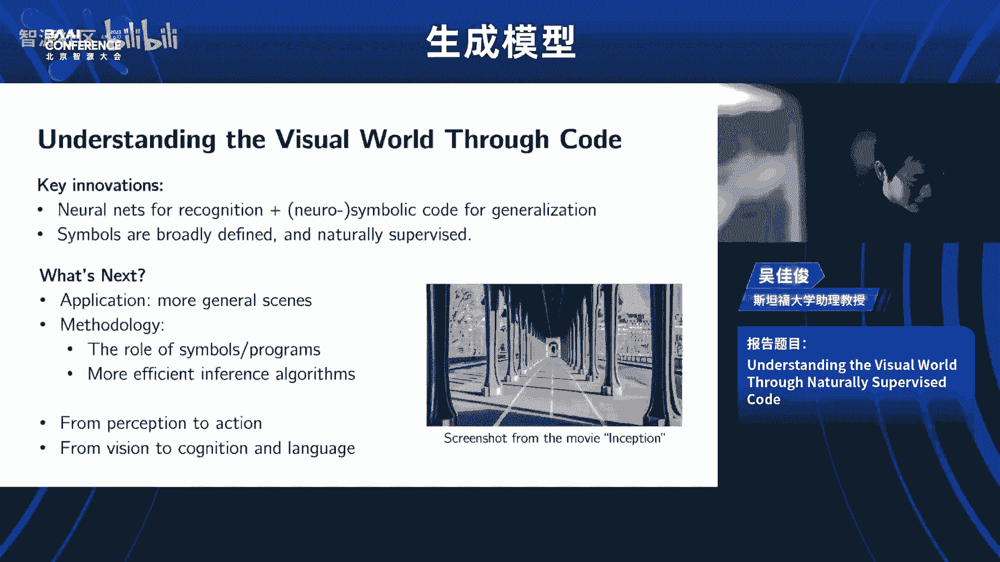

### 迈向三维感知生成（DiFusion）

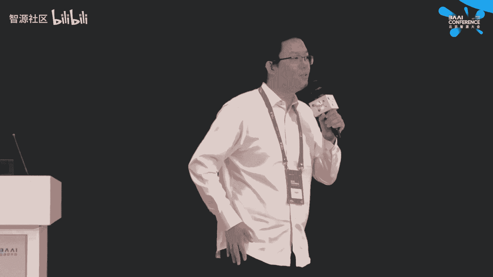

**目标**：生成具有三维一致性的场景，而不仅仅是二维图像。
*   **方法**：将生成模型与神经辐射场（NeRF）结合，提出生成式NeRF框架。
*   **流程**：输入鸟瞰图布局 → 生成三维场景的神经表征（包含背景和多个前景物体）→ 通过体积渲染得到任意视角的图像。
*   **优势**：支持在三维空间中进行直观编辑（如移动、添加、删除物体，改变物体形状材质），并保证渲染结果的三维一致性。

### 大规模场景生成

将生成范围从单个场景扩展到无限大的场景。
*   **思路**：将大场景生成视为空间上的“视频”生成问题，或者训练模型学习场景的局部结构，并通过平移等变性来合成更大范围。
*   **应用**：允许用户通过交互界面在鸟瞰图上放置物体，实时生成对应视角的图片，构建一个“神经仿真器”。

### 基于鸟瞰图的驾驶场景仿真（MetaDrive）

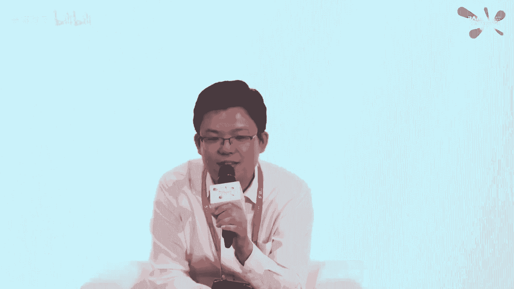

为了将生成的内容用于机器人决策（如自动驾驶），需要可交互的物理仿真。
*   **MetaDrive仿真器**：一个高效、开源的驾驶仿真平台，支持从真实驾驶数据集（如nuScenes, Waymo）导入道路网络和车辆轨迹。
*   **交通场景生成（TrafficGen）**：使用生成模型（两部分：车辆布局生成+轨迹