# 自动驾驶与大模型应用探索教程 🚗🤖

## 概述
在本教程中，我们将系统性地探讨大模型技术在自动驾驶领域的应用、挑战与未来展望。内容基于多位行业专家的分享，涵盖技术原理、实践案例、安全策略及商业化落地等多个维度，旨在为初学者提供一个全面且易于理解的入门指南。

---

## 一、背景与趋势 🌍

### 1.1 自动驾驶与大模型的交汇
智能网联汽车是全球汽车产业转型升级的战略方向。近年来，随着大模型技术的突破，自动驾驶与人工智能的结合成为科技前沿的焦点。大模型在自然语言处理领域的成功，为自动驾驶的视觉感知、决策规划等环节提供了新的技术路径。

### 1.2 视觉领域的“图灵测试”
自动驾驶被视为视觉领域的“图灵测试”。当车辆能在复杂环境中自主驾驶并超越人类水平时，意味着人工智能的视觉感知能力取得重大突破。专家预测，这一技术拐点可能在 **1到3年** 内到来。

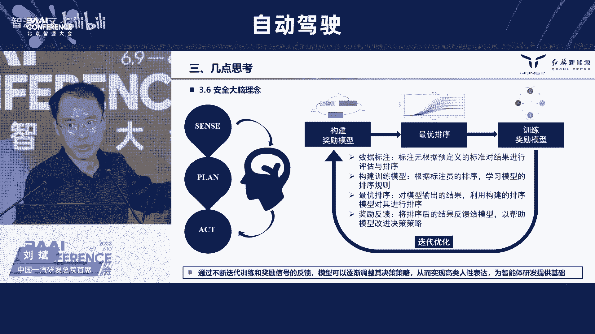

### 1.3 破除“人类中心主义”
在自动驾驶发展中，需避免以人类为中心的思维方式。人工智能具备多传感器融合、持续注意力、高速反应等优势，其驾驶逻辑和安全性能可能远超人类。例如，AI可以通过瞬时加速避免事故，而人类无法做到。

---

## 二、大模型在自动驾驶中的应用 🛠️

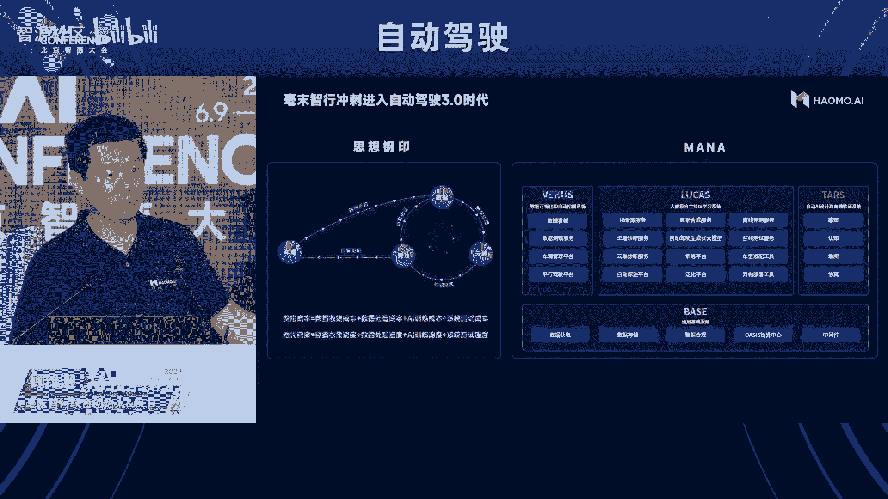

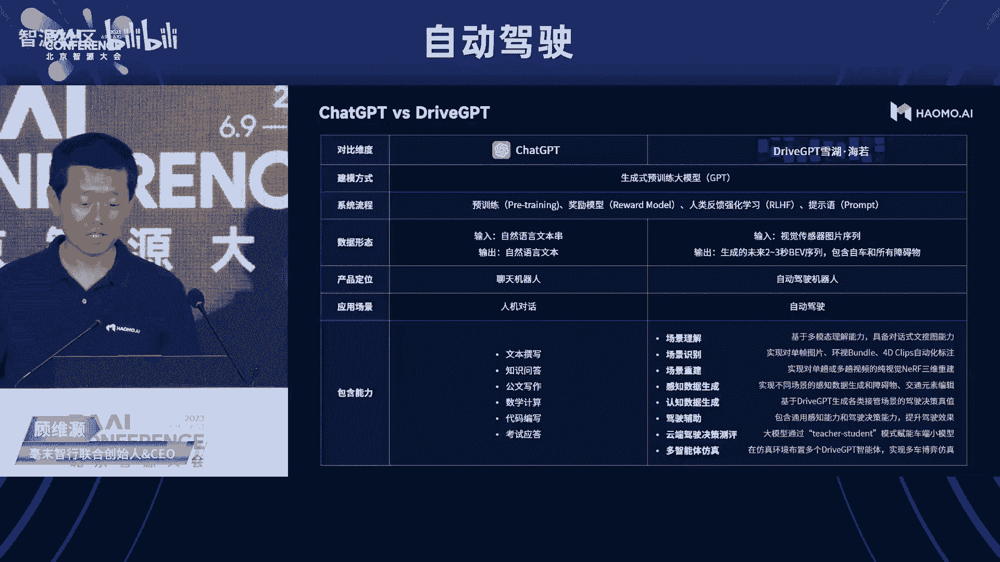

### 2.1 感知与决策的AI赋能
自动驾驶系统分为感知、决策、规划、控制等模块。传统方法依赖规则和特征工程，但在复杂场景下泛化能力有限。大模型通过隐式特征提取和多层次处理，显著提升了系统的智能化水平。

#### 2.1.1 感知型AI
- **特点**：基于静态特征表达，如车辆、行人的位置检测。
- **公式示例**：  
  \[
  P(\text{物体}|\text{图像}) = \text{Softmax}(f_{\text{CNN}}(\text{图像}))
  \]
  其中 \( f_{\text{CNN}} \) 是卷积神经网络提取的特征。

#### 2.1.2 决策型AI
- **挑战**：涉及动态交互和博弈，需处理多智能体协作问题。
- **代码示例（强化学习框架）**：
  ```python
  class DecisionAI:
      def __init__(self, state_space, action_space):
          self.policy_network = PolicyNetwork(state_space, action_space)
      
      def choose_action(self, state):
          return self.policy_network.predict(state)
  ```

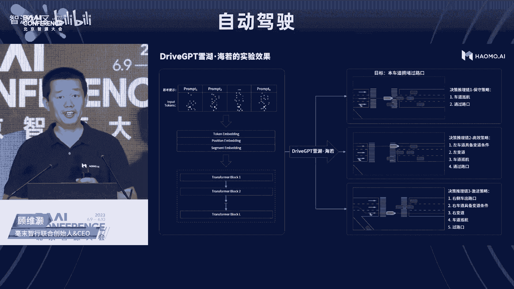

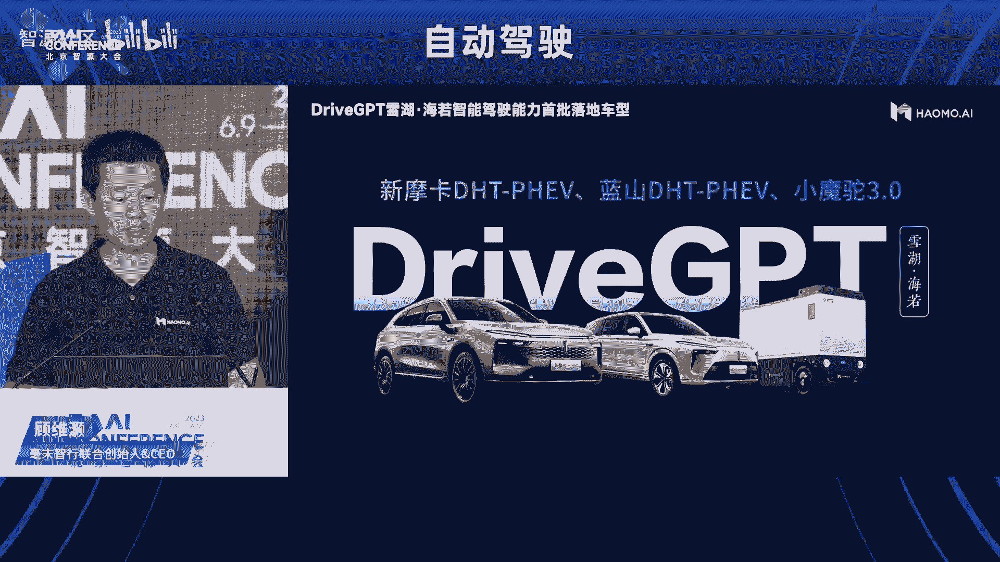

### 2.2 端到端自动驾驶模型
端到端模型将感知、决策、规划整合为单一网络，直接输出控制指令。例如，**DriveGPT** 基于Transformer架构，输入多帧感知数据，生成未来轨迹和驾驶决策。

#### 2.2.1 模型架构
- **输入**：多传感器数据（摄像头、激光雷达等）的时序序列。
- **输出**：未来轨迹分布或控制指令。
- **核心公式**：  
  \[
  \text{轨迹} = \text{Transformer}(\text{传感器序列})
  \]

### 2.3 数据闭环与仿真测试
数据是训练大模型的基础。自动驾驶企业通过量产车收集真实道路数据，构建数据闭环系统，并利用仿真测试生成边界场景和危险案例。

#### 2.3.1 仿真场景生成
- **方法**：基于逻辑场景描述（如OpenSCENARIO 2.0），通过大模型自动生成具体测试用例。
- **示例代码（场景生成）**：
  ```python
  def generate_scenario(description):
      # 使用大模型解析描述并生成场景文件
      scenario = llm.generate(description, format="openscenario")
      return scenario
  ```

---

## 三、技术挑战与安全策略 ⚠️

### 3.1 安全风险
大模型在自动驾驶中的应用面临多重安全挑战：

1. **安全盲点**：低质量数据可能导致模型行为异常。
2. **黑盒特性**：决策过程不可解释，影响责任认定。
3. **对抗攻击**：微小扰动可能引发错误输出。

### 3.2 “231”安全策略
针对上述风险，行业提出“231”安全策略：

- **2项安全基础**：  
  - **模型安全**：通过奖励模型和强化学习优化决策行为。  
  - **数据安全**：利用仿真系统筛选和泛化高质量数据。

- **3层监督机制**：  
  - **规则模型监督**：结合传统规则保障行为底线。  
  - **独立安全大脑**：设计专用模块监控AI决策。  
  - **车路云协同**：通过云端监控实现全局安全管控。

- **1套标准法规**：推动行业标准建设，确保技术合规发展。

---

## 四、实践案例与商业化落地 🚀

### 4.1 主机厂的探索
- **比亚迪**：构建数据闭环平台，累计 **150PB** 数据，研发BEV感知模型和规划大模型。
- **中国一汽**：聚焦决策AI，通过混合建模提升系统安全性和拟人化驾驶体验。

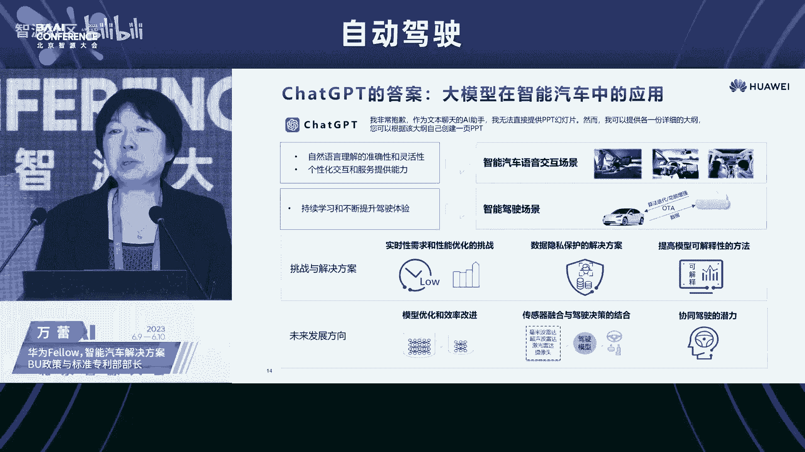

### 4.2 科技公司的创新
- **毫末智行**：推出 **DriveGPT**，实现端到端自动驾驶生成式模型，并开放云端能力助力行业创新。
- **文远知行**：打造通用技术平台，支持多场景（Robotaxi、小巴、环卫车）快速落地，累计自动驾驶里程 **1600万公里**。

### 4.3 仿真与测试企业
- **赛目科技**：基于大模型自动生成测试场景，提升仿真效率和覆盖度。
- **北京理工大学**：研究多方协同仿真平台，通过解耦架构促进数据共享与安全协作。

---

## 五、未来展望与总结 🌟

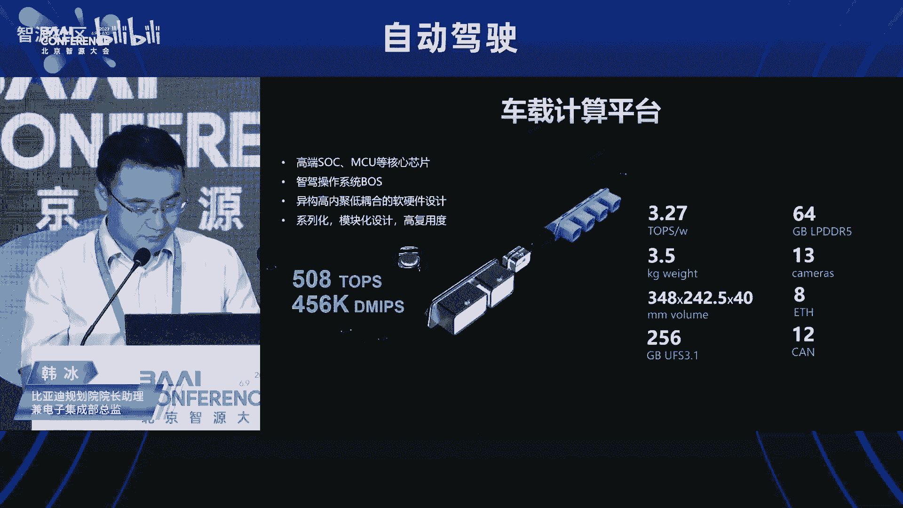

### 5.1 技术趋势
1. **多模态融合**：文本、图像、点云等多源数据统一建模。
2. **车路云一体化**：通过协同计算提升系统安全与效率。
3. **轻量化部署**：模型压缩与蒸馏技术助力大模型上车。

### 5.2 产业生态
自动驾驶与大模型的结合将重塑汽车产业技术路线。主机厂、科技公司、仿真测试企业需协同创新，共建安全、可靠、高效的智能出行生态。

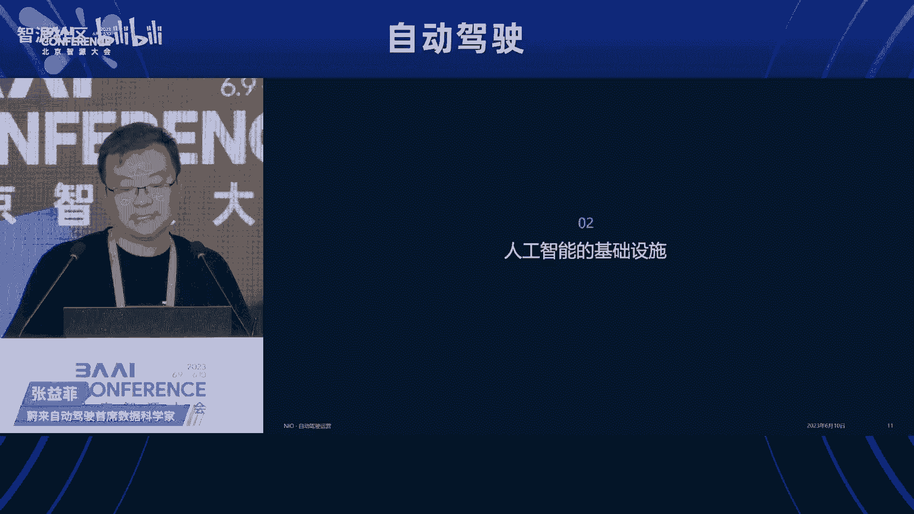

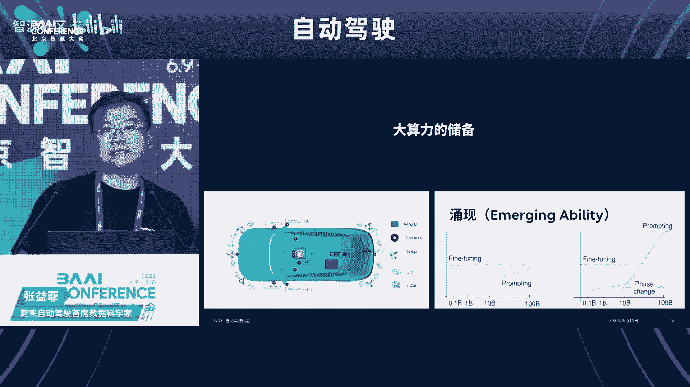

### 5.3 伦理与治理
需建立完善的AI治理框架，确保数据隐私、算法透明、人类监督，实现技术向善。

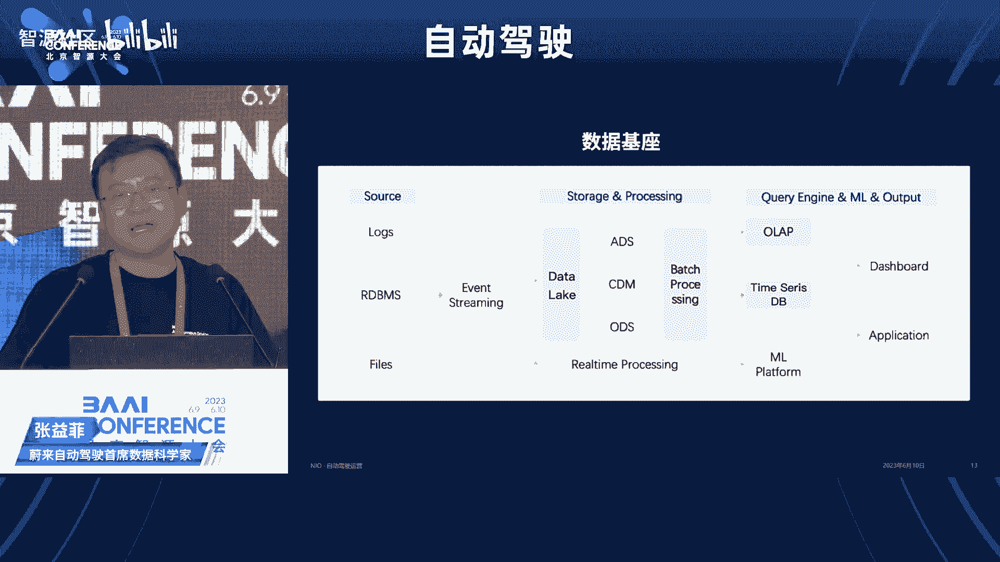

---

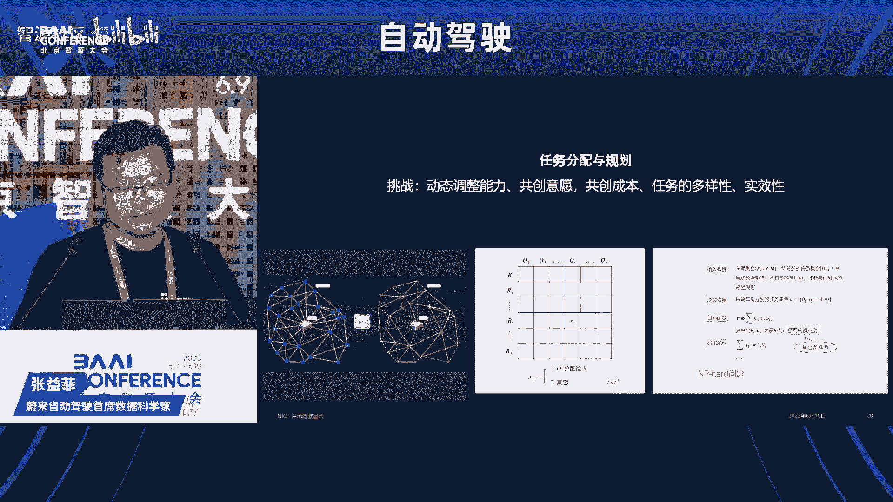

## 总结
本节课中，我们一起学习了：
- 大模型在自动驾驶中的应用原理与实践案例。
- 技术挑战与安全策略（如“231”方案）。
- 行业生态与未来发展趋势。

自动驾驶与大模型的结合正处于爆发前夜，技术创新与产业协作将共同推动这一领域的快速发展。希望本教程能为您的学习与研究提供有益的参考！ 🎉

--- 

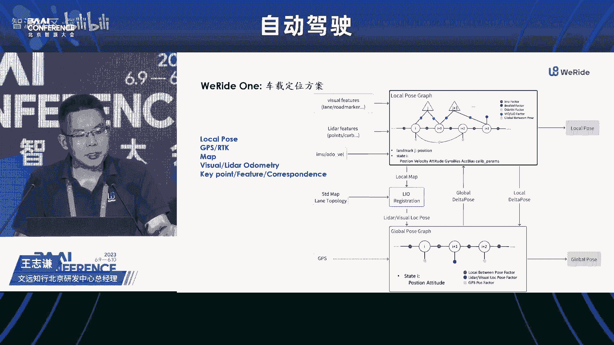

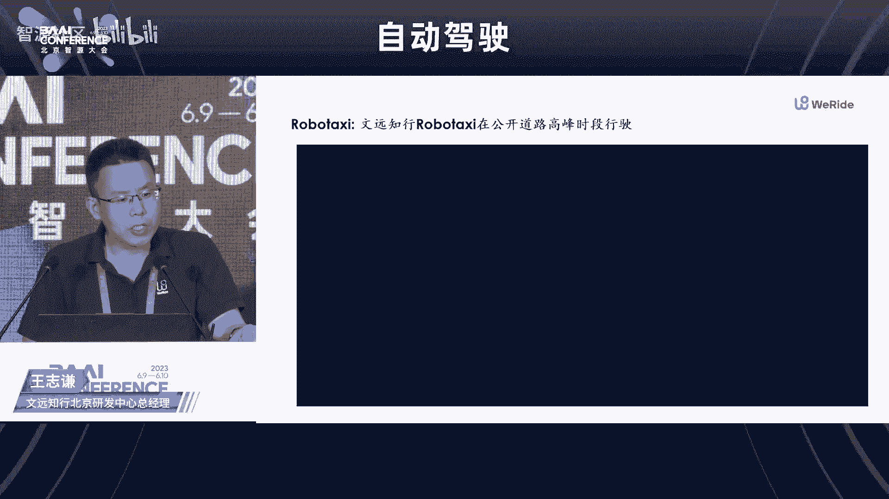

**备注**：本教程内容基于公开演讲整理，旨在知识分享，不涉及任何商业机密或未公开信息。