# 视觉与多模态大模型论坛

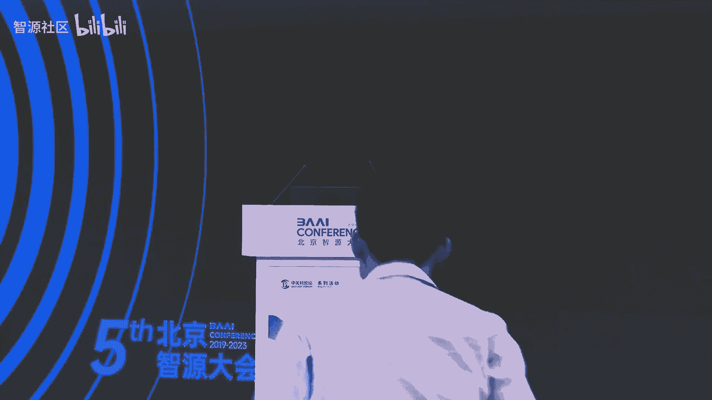

## 🎯 课程概述

在本节课中，我们将学习视觉与多模态大模型领域的前沿进展。课程内容整理自智源社区的一场论坛，涵盖了基于关键点的图像编辑、三维内容生成、通用视觉模型以及扩散模型在图像、视频和三维生成中的应用。我们将深入探讨这些技术的核心思想、实现方法以及未来的发展方向。

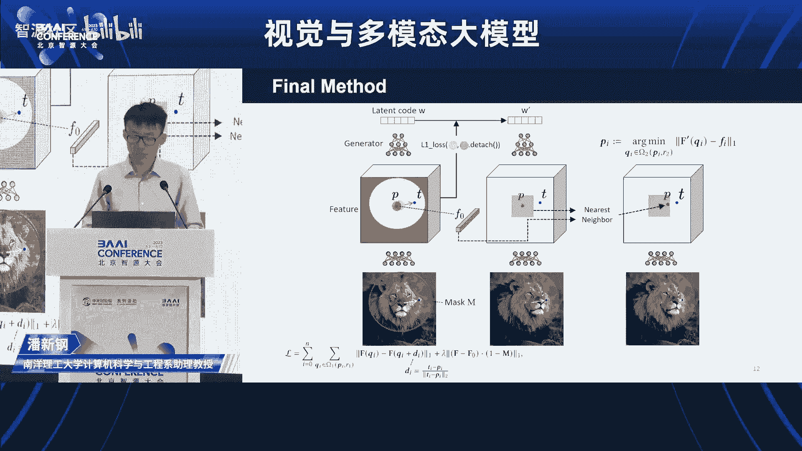

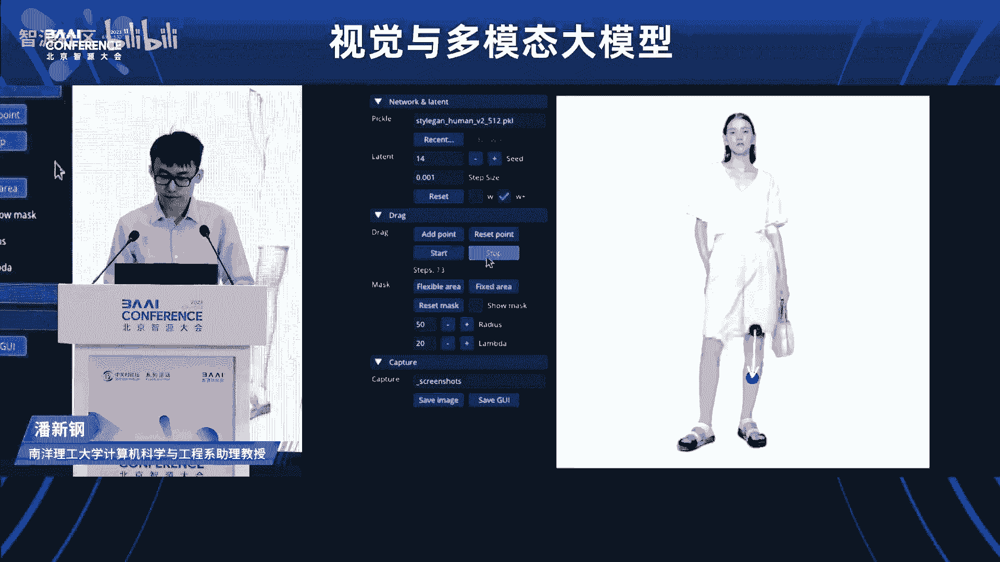

---

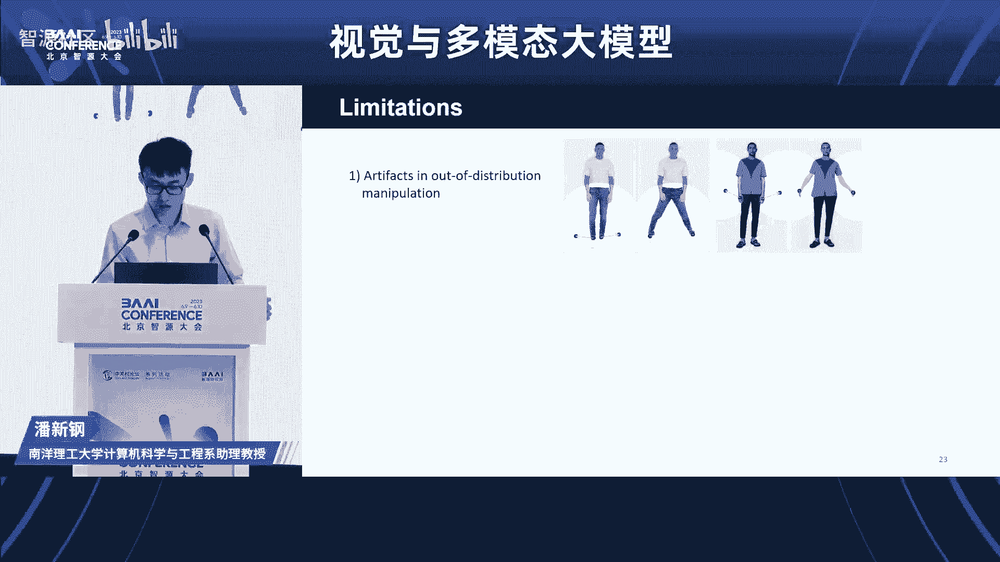

## 📝 论坛开场与报告介绍

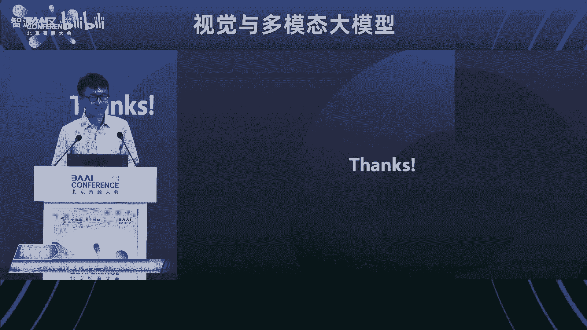

欢迎来到视觉与多模态大模型论坛。本次论坛共有四个报告。

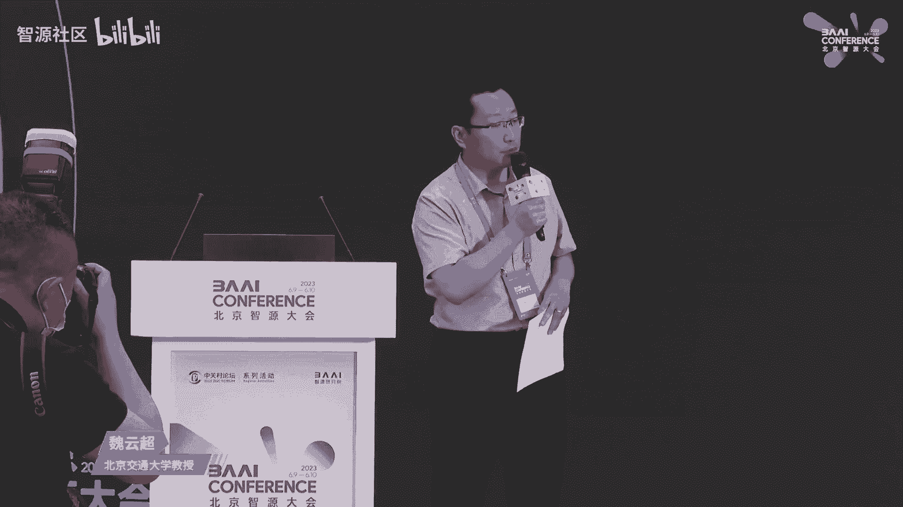

首先，第一个报告来自新加坡南洋理工大学的潘新刚教授。在报告开始前，我先对潘教授做个简单介绍。潘新刚隶属于MMLab NTU和S-Lab，他的研究方向是生成式人工智能和神经渲染，主要工作包括DragGAN和DeepGenerative等。在加入南洋理工之前，他曾是马克思·普朗克计算机科学研究所Risinen教授组的博士或研究员。他在香港中文大学MMLab获得博士学位，师从汤晓鸥教授，并在清华大学获得学士学位。他今天带来的报告是目前特别火的一个工作，叫DragGAN。大家欢迎新刚。

---

## 🖼️ 报告一：DragGAN - 基于关键点的生成图像流形交互式编辑

谢谢主持人的介绍。各位来宾、老师、同学们，大家好。很高兴在这里和大家分享我们近期的工作“Drag Your GAN: Interactive Point-based Manipulation on the Generative Image Manifold”，也就是在生成图像流形上实现基于关键点的交互式图像编辑。我是来自南洋理工大学的潘新刚。这个工作也是和马普所、MIT、宾大、谷歌的合作者共同完成的。

### 问题背景：图像编辑的挑战

这里我们关注的问题是图像编辑。图像编辑在计算机视觉和图形学中都是一个很经典的问题。近年来，由于生成模型的发展，有一系列的图像编辑方法被提出。例如，基于监督学习的算法，如果用户标注了标签，那么根据标签，我们可以将图像向指定的属性方向编辑。其次，有基于语义图的编辑，用户可以通过重新绘制语义图来实现对图像轮廓的编辑。以及基于人体先验的编辑，通过一个舞蹈姿态或骨架作为输入，可以生成一个人的不同姿态。近期由于扩散模型和大语言模型的发展，基于文字的编辑逐渐成为了主流。这些编辑方法在特定任务上都取得了非常大的进展。

但是，当我们在生成或编辑一张图片时，我们不仅希望编辑它的语义和内容，很多时候用户还需要对它的空间属性进行编辑，例如图片的轮廓、不同物体的位置、物体的姿态、朝向、物体的大小等等。对于空间属性的编辑，这些方法都受到了不同程度的局限性。它们没有办法兼顾灵活性、准确性以及通用性。例如，如果基于语义图编辑，如果我想对其中人的姿态或车的朝向进行变化，那就意味着用户需要重新绘制这个语义图，这不是一件非常直观和容易的事情。再例如，基于人的编辑没有办法拓展到其他类别的物体。基于文字的编辑虽然强大，但是它对于空间属性的精确编辑仍然不是特别方便。比如说这只猫，如果我希望它的头向左偏移10个像素的位置，那么基于文字的模型不太方便做到这一点。

### 理想的交互方式：直接拖拽

所以，怎样的一个对空间属性的编辑是我们希望实现的呢？如果我们观察人与物理世界的交互，如果一个桌子你希望去改变它的空间属性，最直接的就是你直接去移动茶杯的位置或者移动物体的位置。我们和手机交互也是直接通过手指去拖拽手机。另一个通过这种直接交互的方式来实现图像编辑的例子就是皮影戏。在皮影戏中，操纵者对于图像中的物体有完全的控制权，你只要去指定它的关键点移动到哪个位置，那么根据这个物体本身的结构，它就会发生相应的动作。我们有没有可能像控制皮影戏那样去控制图片呢？

相关的应用，一个是Photoshop中的液化功能，它也可以让用户实现一些拖拽的编辑。但是可以看到，它的拖拽只是一些简单的2D形变，并不考虑物体本身的结构，并且它没有办法生成新的内容，没有办法将被遮挡的部分生成出来或者将嘴巴张开。类似的基于拖拽的编辑，在图形学中有个经典的问题就是形状变形或几何处理。这里展示的是一个经典的方法“As-Rigid-As-Possible Shape Manipulation”，它是把物体网格化，然后假设这个物体具有一致的刚度来实现形变。可以看到这种方法同样假设物体有一致的刚度，那就不符合物体本身的结构了，因为很多时候物体是有骨架的，以及它仍然没有办法生成新的内容。

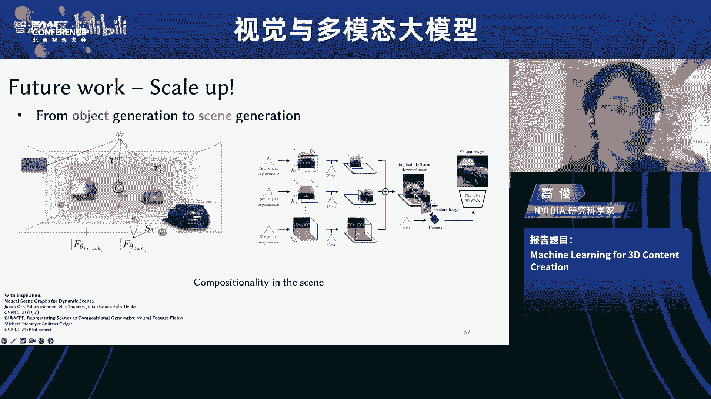

### 解决方案：结合生成模型

理想情况下，我们希望这样的编辑符合物体本身的结构，并且能够想象出被遮挡的内容。怎样可以做到这一点呢？能够对物体结构有感知力，并且能够产生新内容的模型，自然就是生成模型。在之前一个经典的生成模型就是对抗生成网络（GAN）。在训练完成后，GAN做的事情其实很简洁，它是将一个符合高斯分布的512维隐向量映射到一张高维图片。通过对隐向量进行一些扰动或变化，就可以实现对图像中内容的变化。

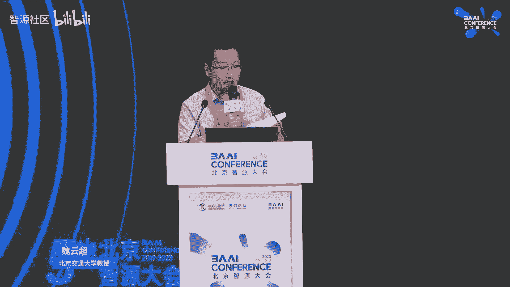

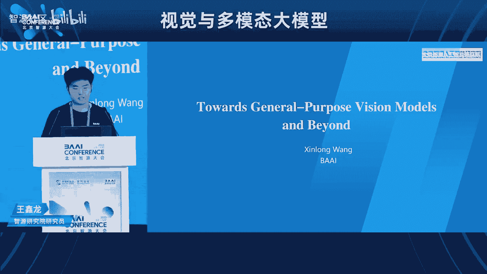

在这个工作中，我们想做的事情就是将这种拖拽式的编辑基于GAN来实现。对于一个GAN所生成的图像，我们希望用户只要指定关键点的移动，我们就可以让图片中的内容发生对应的变化。为了实现这种效果，一个核心的问题就是我们如何去改变GAN的隐向量来实现所需要的这种基于关键点的变化。

### 方法预览：迭代式算法框架

在介绍方法前，我们可以简单看一下最终所呈现的效果。用户只需要指定红色抓取点和蓝色目标点，算法就会将抓取点朝目标点移动，实现最后比较自然的生成效果。可以看到这个变化是符合物体自身的结构，并且可以想象出被遮挡部分的内容的。

为了实现这一点，我们设计了一个迭代式的算法框架。这里展示的是一个GAN的生成器，将隐向量W映射成为一张图片。这里是一个狮子的图片，然后用户只需要输入红色的抓取点和蓝色的目标点。为了将红色抓取点移动向蓝色目标点，我们需要给它施加一个力，将它朝蓝点推。这样一个力就可以形式化成一个运动监督损失函数。通过这样的运动监督损失函数将红点推向蓝点，这个损失函数用来优化GAN的隐向量W。在优化一步后，我们得到了一个新的隐向量W‘，那么新的隐向量会产生一张新的图片。这张新的图片已经按照我们推动关键点的方式去移动了一下。在它移动之后，其实我们还暂时不知道它移动到了哪里，所以下一步我们需要做点追踪，也就是去更新红色的抓取点的位置，让它跟随图像一起移动。比如说这里这个红点，最开始是在鼻子上面的红点在鼻子的位置，我应该要让它一直跟随着鼻子的位置一起走，只有这样最终才能准确的将它移动到蓝点的位置。在这之后，我们再重复以上的步骤进行运动监督以及点跟踪，直到最终所有的抓取点都移动到了它对应的目标点。

### 核心子问题：运动监督与点追踪

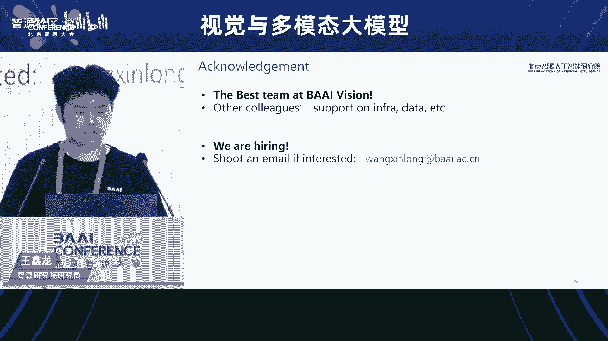

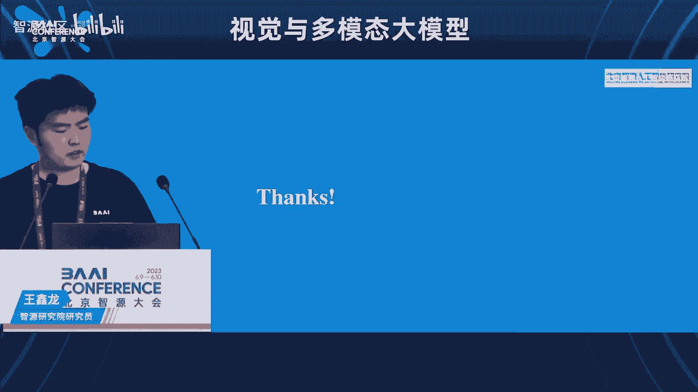

接下来我们就介绍这其中的两个关键的子问题，一个是运动监督，一个是点追踪。

在设计最终的方法之前，我们进行了一些不一样的初步探索。我们最初的想法其实和最终的实现方式不太一样。最初为了实现对运动的监督，我们想到的是使用光流模型，因为光流是最直观的对于运动的提取。我们的做法是这样，对于一个GAN所生成的图片，我们先复制这张图片作为一个参考图。另外我们还有这个用户的输入的关键点，将两张图片送给光流模型去预测两张图片之间的光流。由于这里两张图片是一样的，那么它的光流自然就是零了。那为了实现对关键点的运动的驱动，我们其实目标是让它这个关键点对应位置的光流不是零，所以我们就用目标的光流去监督关键点对应位置的光流。比如说我希望它是朝左移动，那么它理应输出的光流应该是-10，所以我们把-10作为ground truth去监督光流所预测的结果。这样就得到一个运动监督损失函数，我们用它去优化GAN的隐向量。这种方法是可行的，通过优化，我们确实可以让光流所输出的结果符合我们的预期，也就是说关键点的位置朝左移动了一点。

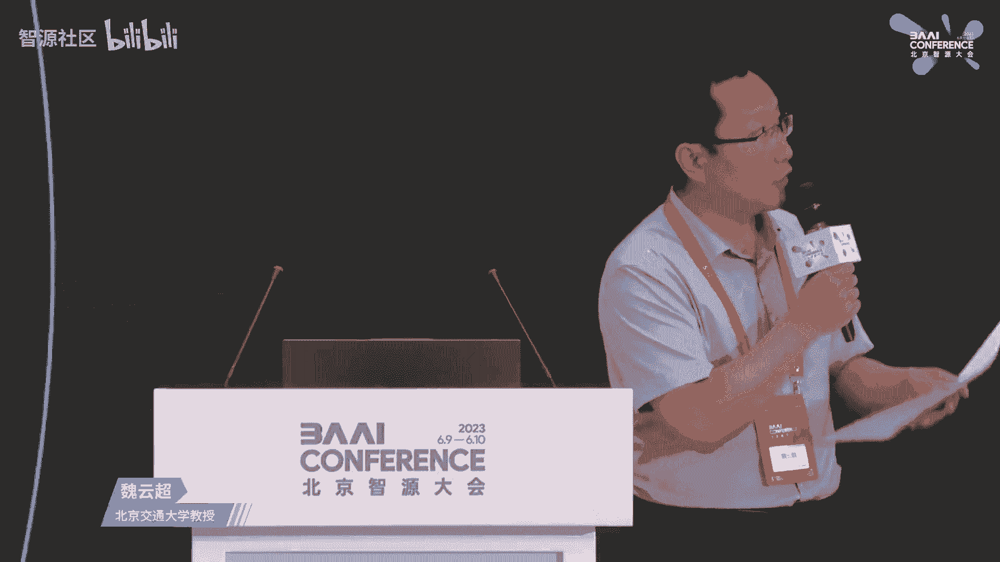

但是，这样做的一个问题是我们所用到的光流模型是一个经典的模型叫RAFT，它是一个迭代计算的模型，计算开销比较大。如果说我们在编辑的过程中一直使用这样一个光流模型的话，会大大降低运算的效率。我们作为一个交互式编辑的方法，希望它能够给用户及时的反馈，所以我们在想能不能让速度更快一点。我们大致的想法是，这里之所以要用到光流模型，是因为我为了驱动运动，需要提取出对图像空间位置敏感的特征。那么对于GAN来说，它在生成一张图片的过程中，生成的不仅仅是这一张图片，还有在生成这个图片过程中，这个生成器内部的一系列特征。之前的一些方法，其实分析过GAN它的中间特征，其实对于空间位置有很强的判别力或者说很敏感。一些算法展示了它可以用来做Few-Shot Segmentation，但是其实我们这里想说的是它和图像内容的密集对应关系有很强的耦合性。因此，运动监督可以直接基于GAN的特征来实现。

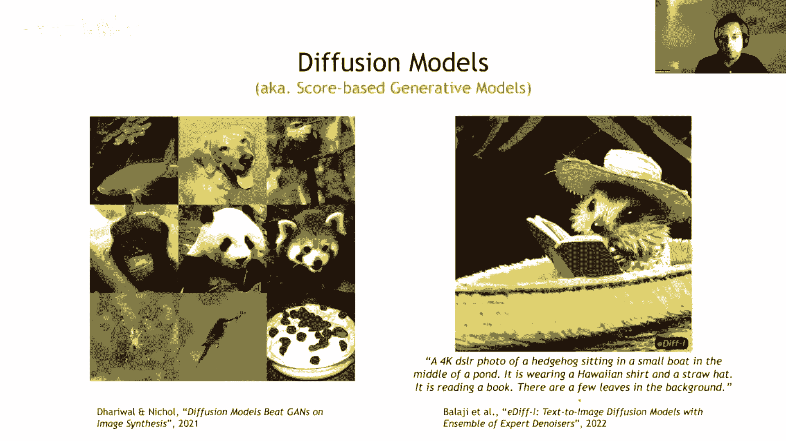

### 最终方法：基于GAN特征的运动监督

这里介绍我们最终的方法，其实非常简洁。这个方块就是GAN生成图像过程中的特征了。为了将红点移向蓝点，我们的想法是观察这个红点附近的一个小范围的patch，有这个小的红色的圆。为了将它移到蓝点，我们希望它先走一小步，走到这个蓝色patch的位置，因为这蓝色小圆圈的位置。那么这就可以形式化成一个简单的损失函数，也就是说我去优化这个蓝色位置的这个特征，让它的值接近红色特征的值，也就是以红色特征为ground truth来优化蓝色特征。那么当蓝色位置的数值变成红色位置的时候，其实就是红色的这个圈圈移动到了蓝色圈圈的位置。这里要注意的是为了使这种拖拽是单向的，所以我们需要将红色圈圈从反向传播的计算图中分离出来，也就是一个detach的操作。这样的运动监督的损失函数可以用来优化隐向量。

其实这里我们还让用户可以选择性的输入一个mask。因为用户在编辑图片的时候，可能有一些区域是他想要动的，有一些区域他希望保持不动，比如说背景的部分。这里这个图片中可以看到一个白色的圆圈，这个就是用户指定的可动区域。为了限制背景区域不动，我们在设计了一个在特征空间的重建损失，也就是这个特征中的阴影部分让它与最初的特征保持一致。好，那通过这两个损失进行优化之后，我们得到了一个新的隐向量。新的隐向量生成了新的图片和新的特征。

### 点追踪：基于特征匹配

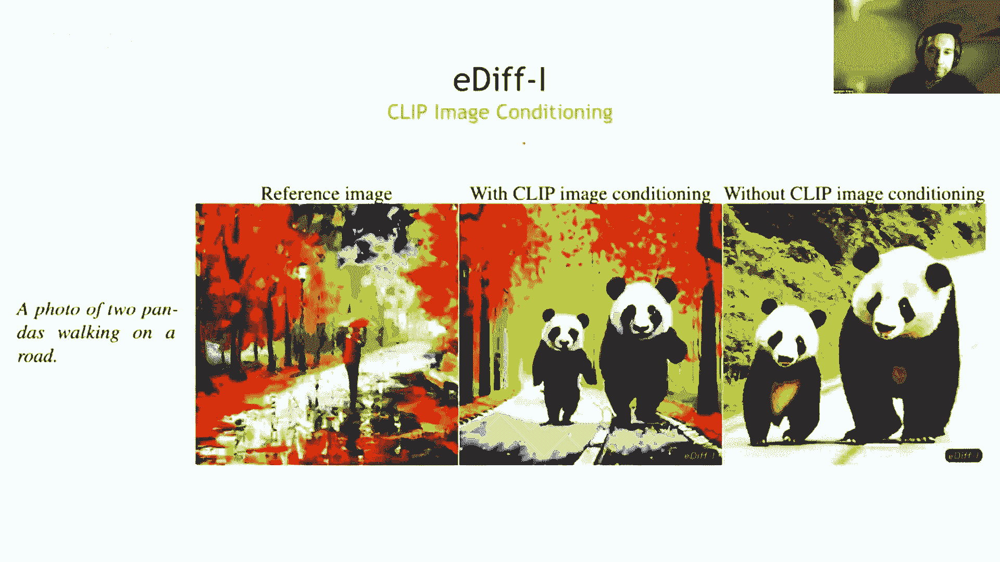

那么下一步问题就是如何更新抓取点的位置来跟踪图像的内容。关于关键点的跟踪其实也有一些相关的研究了，那么我们其实之前也尝试了一些不一样的方法，并且有一些专门做关键点跟踪的方法。但是在这个工作中，其实我们发现并不需要引入额外的神经网络，因为GAN特征就像刚才提到的，它对于空间位置有很强的敏感性。因此关键点跟踪也可以直观的通过特征匹配的方式来实现。具体来说，在这个新的特征中，我们去关注这个红点附近的一小块范围，就这个红色方框的范围。我们在其中去寻找那个和最初的抓取点所对应的特征值最近的那个像素的位置，也就是一个最近邻搜索。那么这样的找到的一个关键点，就是对应于最初的那个关键点所对应的语义的那个点，也就是说它实现了一个跟踪的功能。最初的关键点是在鼻子上的，那么通过特征匹配找到的关键点也会是在这个狮子的鼻子上。

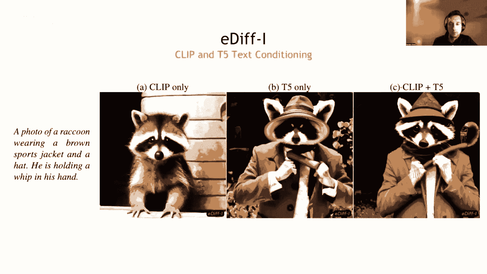

通过这两个简单的设计，我们实现了运动监督和点跟踪。那么再结合前面所介绍的迭代式的算法框架，DragGAN的算法就实现了。

### 应用效果展示

通过这种交互的方式，我们可以对物体的很多不同的空间属性进行编辑。例如张开嘴或者将耳朵提起来，或者让这个狗坐下来，或者让他的头转一下，或者重新设计一辆车子的外形，可能汽车外形设计者会喜欢这个功能。或者编辑各种各样的其他的动物，或者让一个猫只睁一只眼睛，那么这是在训练数据之外的一种结果。或者对人脸的编辑，那么瘦脸或者改变头发都可以比较直观的实现。或者对模特的衣服的编辑，或者是任何奇怪的物体，比如微生物。对风景的编辑，以及让太阳升起来等等。

### 与同期工作的对比

我们做的过程中，其实出现了一个同期的工作叫User-Controllable LT，或者User-Controllable Latent Transformer。它所实现的目标其实非常相似。但是这里它有两个重要的局限，一个是它对于位置的精确控制其实不够精确，因为它只能粗略的移动物体，并没有办法把关键点精确的移动到目标点的位置。其次是它对于多点的支持并不好。另外他也没有办法去只编辑图片的一部分区域，要保持背景不变。我们的方法可以更好的保持背景不变，以及实现更精确的控制。

这里展示了更多对比。第一行是输入的图片，还有用户的编辑。下面两行是User-Controllable LT和我们方法的结果。从第一个例子，马的例子就可以看出，他们对于多点的编辑并不好。那么我们方法可以对马尾、腿还有头都移动到对应的位置。我们方法同样可以编辑更加密集的关键点，比如说对于人脸的比较密集的关键点的编辑。这里每一个例子里面左边两个展示的是输入图片和目标图片，那么这里的目的就是把输入图片这个人脸的关键点挪动到和目标图片的关键点保持一致。所以可以看到这个输入图的表情，还有脸的轮廓都变成了和目标点差不多。

### 定量实验

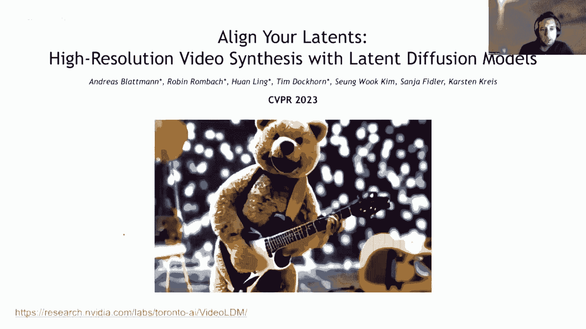

这里我们进行了一个定量实验。我们计算我们的方法所编辑达到的目标点的位置，以及目标图像本身的目标点的位置之间的误差。可以看到我们方法的误差显著优于基准的方法User-Controllable LT。我们也和其他的点跟踪的方法进行了对比，可以看到基于RAFT的跟踪，以及基于PIPs的跟踪方法，都是弱于我们的方法。另外我们进一步进行了一个匹配图像重建的定量实验。对于一个GAN所生成的图片A，我们对于隐向量进行扰动，随机得到另一个图片B，那么B相比较A发生了一点变化。我们计算它们之间的光流，在光流图上抽取32个稀疏的点，然后将图A和这个稀疏的光流作为我们的基于点的操纵方法的输入。那么这里可以用来测试我们的方法或者其他的方法，得到一个对B的估计。那么这样的话，我们通过比较对B图的估计以及真实的B图，就可以得到一个误差，这个误差可以用于衡量方法的好坏。那么同样我们的方法也是比其他的方法取得了明显的提升。

这里对比了点跟踪的结果。可以看到左边是输入的图片，还有用户的编辑。右边展示了编辑过程中点跟踪的过程。第一列展示了我们的方法，那可以看到这个红点抓取点是一直在狮子的鼻子上方一点点的位置。但是其他的点跟踪的方法，他们可能在编辑过程中逐渐出现了一些偏移。那么一旦出现了偏移，它最终就没有办法准确的将抓取点移动到目标点的位置。所以对于生成模型，我们也提供了一种进行点跟踪的一个新的思路。

### 真实图片编辑

对于以上展示的结果，其实基本上都是GAN所生成的合成的图片的编辑。但是在实际应用中，其实我们关注的是对真实图片的编辑。用GAN编辑真实图片，就需要进行一个额外的操作，也就是GAN重建。我们去优化这个GAN的隐向量来实现对一个用户输入的图片的重建，这样就可以进行后续的编辑。这里展示的是一个人脸的编辑效果，可以改变表情朝向或者头发，或者让眼睛睁大一点，诸如此类。这里展示了更多真实图片编辑的结果。

### 编辑的奇异性与用户控制

这里基于关键点拖拽的编辑，很多时候是存在多解的。为了让狗实现头朝右移动一点，可以有不同的方式，狗可以整体移动，狗可以身体旋转，狗可以只改变头。在这个算法中如果不施加额外的限制，它会寻找实现这种目标最近的解。那么在这里右侧的结果就是狗的一个旋转的效果。那么为了减少这种奇异性，用户也可以进行一些额外的限制，比如输入这个mask也来指定可动的区域，这样就可以只让狗的头的部分动。

### 超出数据分布范围的编辑

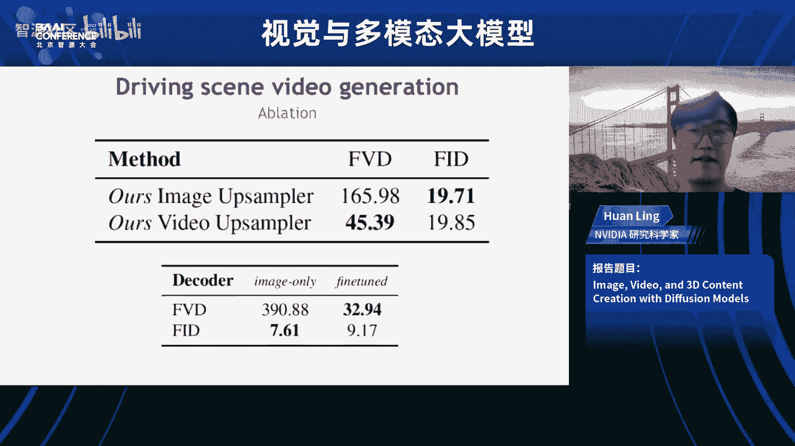

此外，我们也展示了一些超出数据集范围之外的一些编辑效果。比如说让这个狮子张开一个血盆大口，或者让车的轮胎大到夸张。那么也可以实现一些符合预期的效果，但是与之伴随的也会带来一些畸变等问题。对于GAN来说，它的隐空间有两种选择，一种是W，一种是W+。W+它的空间会更大一些，也就是说图像的编辑会允许更多的灵活性。在W+中间编辑的话，可以更好的实现一些超出训练数据之外的效果，例如说这种睁一只眼闭一只眼的情况。

### 方法局限性分析

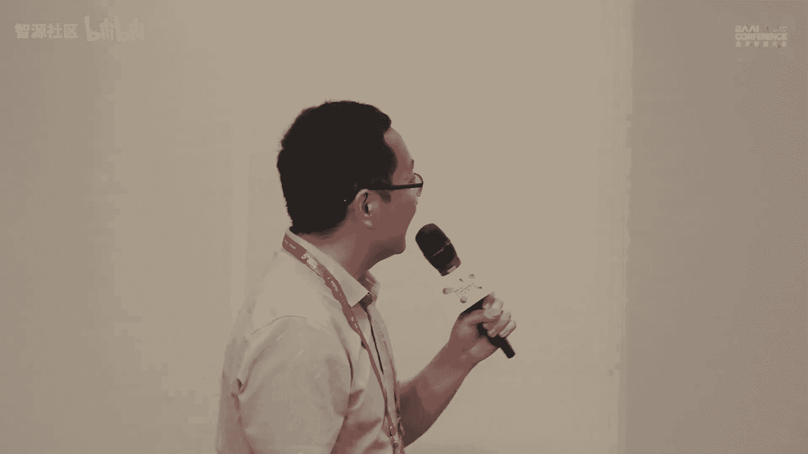

最后来分析一下方法的局限性吧。前面提了一些超出训练数据分布之外的一些编辑。那么当这种编辑当这种超出的范围过大的时候，会很容易产生一些不失真的效果，比如说这里这个人体的模型是在模特的数据上训练的，那么它很少会有一些夸张的动作，比如说手或者腿张的非常大。那么如果我们进行这种编辑的话，会容易产生一些畸变或者失真模糊。

此外，对关键点的选取也有一点讲究。它和这个关键点的纹理的丰富度有关。如果说是在非常平滑的部分选的关键点，例如这个车的车门的位置的话，那么在拖动的过程中，它会更容易发生一些偏移，就跟点跟踪的偏移。但是如果选在纹理丰富的位置，比如说车窗，那么它就可以更好的实现跟踪。

但是我觉得最重要的一个局限性其实是对真实物体的编辑。这也是可能需要澄清的一点吧。因为可能之前这个方法的视频在网上流传的时候，大家可能觉得类似的效果，它输入任意图片就可以做到。但是目前还不是这样。因为我们所展示的真实图片编辑更多的是有一个明确的主体物体，并且背景不是那么的复杂。但是如果你是这样的一个有非常多物体或者背景非常复杂的图片的话，GAN重建就很难保证质量，那么编辑的质量也会大大降低，这也是后续研究的一个重要的拓展方向。

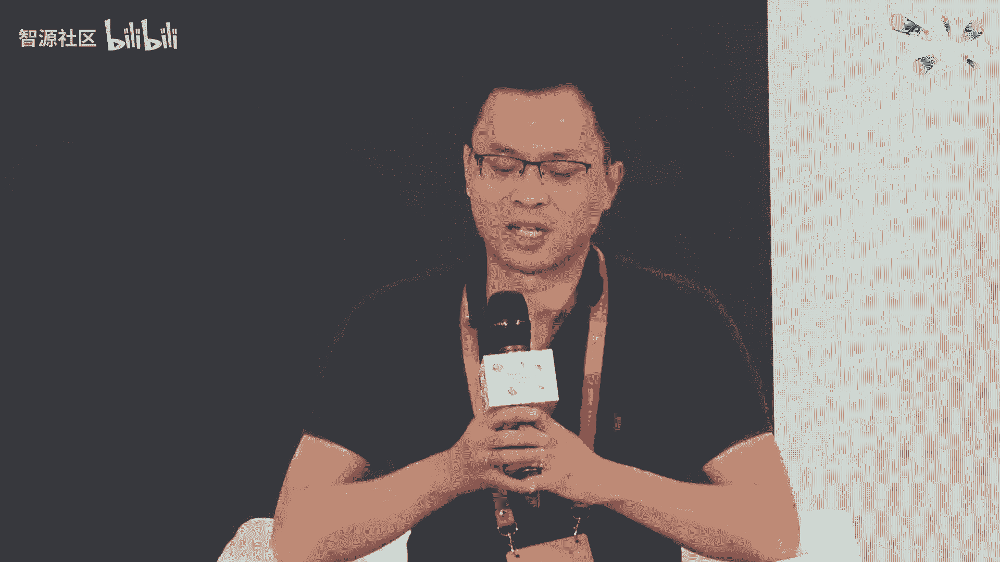

### 总结与展望

最后总结一下。我们提出了一种能够像控制皮影戏那样去控制图片的方法。通过关键点的目标位置的指定，就可以实现对物体空间属性的编辑。为了实现这一点，我们提出了两个模块：运动监督和点跟踪。它们都是基于GAN本身对空间属性具有判别力的特征而实现的。

最后可能大家会想，现在基于文字的编辑这么火，那么这种拖拽式的编辑，它的地位怎样？它是哪一种编辑会成为主流呢？那其实我觉得这两者是互补的。因为你通过文字很难直观的控制这些空间属性，那么空间属性也没有办法做文字能做的一些对内容的编辑。所以我觉得最终的AI生成图片的框架应该是将文字，还有对这种对空间拖拽的编辑都囊括在其中的一个系统。所以往后的话，在这个方向还有很多可以拓展的方向。所以如果说有同学对这个方向感兴趣的话，其实我们最近也在招生，那欢迎大家来申请。好的，我的介绍就到这里，欢迎大家提问。

---

## 🤖 报告二：机器学习用于三维内容生成

谢谢各位老师，也欢迎大家来听我的报告。因为不好意思，因为我现在人在加拿大，所以就只能在远程上给大家做报告，非常抱歉。如果大家有什么问题，都欢迎大家在给完报告之后或者是报告中间提问。

今天我要报告的内容，因为今天的这个论坛主要是探究的事情是视觉与多模态大模型，那我就跟大家来介绍一下大模型在这种三维内容生成当中的一些应用场景，以及我们组所做的一些相关的工作。

### 为什么需要三维模型？

首先第一个问题我们需要去回答的事情是为什么我们要做一个三维世界上的一个模型？在我看来一个最简单的回答，就是说我们人类生活在一个三维的世界，而创造一个三维的数字世界或者说一个三维的虚拟世界，不但可以帮助我们更好的去理解这个世界，同时也可以帮助我们去解决很多现实生活当中所无法解决的问题。

在一个三维的虚拟世界当中呢，我们可以进行交流或者互动，即便说在现实生活当中，比如说人与人之间相隔千里，比如说像现在我们可能是只能通过Zoom去开会。但如果说有一个虚拟世界，我们就可以不用通过Zoom了。创建虚拟世界，同时也能够带来很多的其他的应用场景，比如说是机器人学