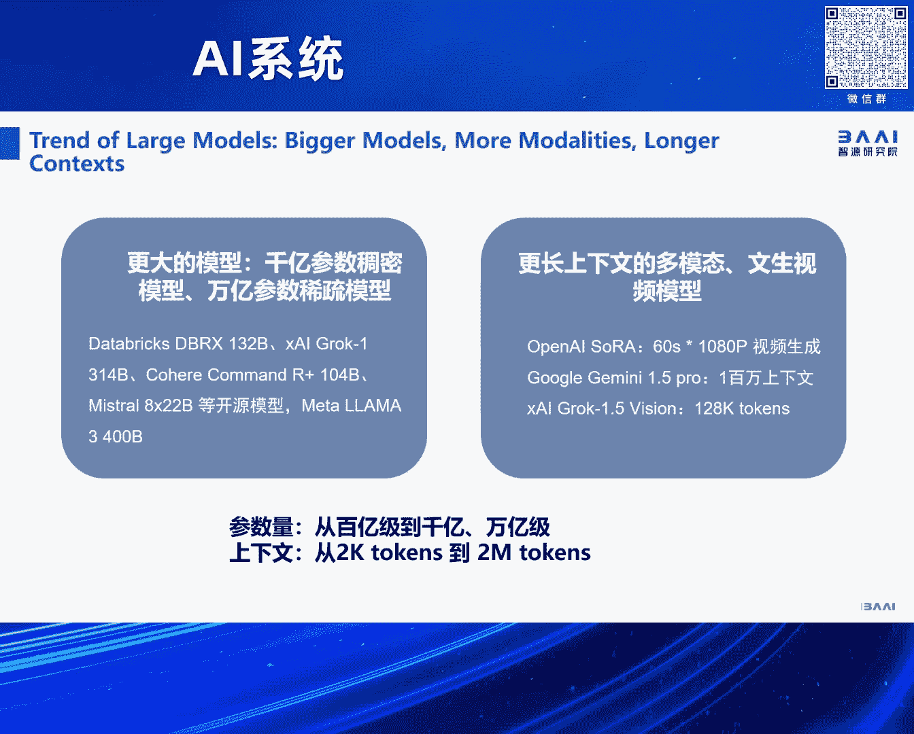
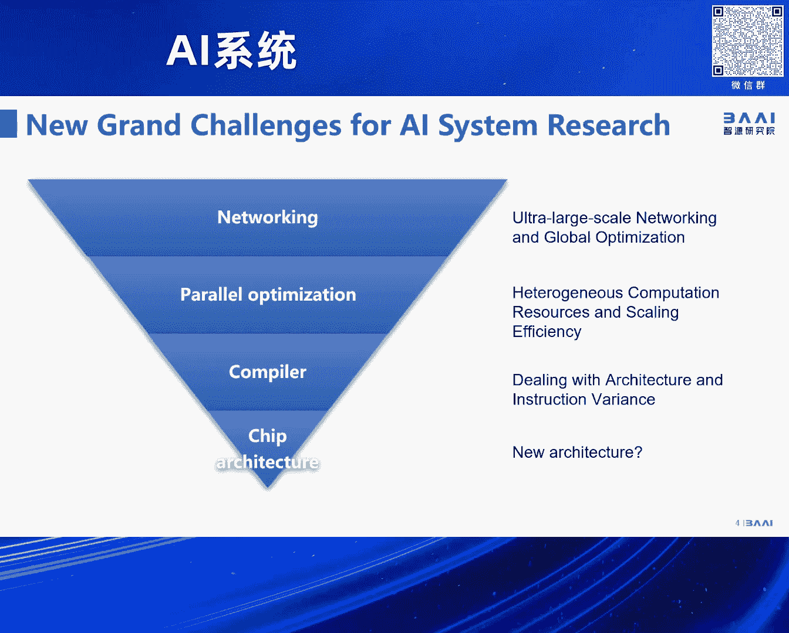

# 2024北京智源大会-AI系统---P1-论坛背景与嘉宾介绍-林咏华---智源社区---BV1DS411w7EG

在本节课中，我们将学习2024年北京智源大会AI系统论坛的背景、核心挑战以及论坛的整体议程安排。本次论坛聚焦于支撑大模型发展的底层系统技术，内容涵盖从芯片架构到大规模集群组网的完整技术栈。

## 论坛背景与重要性

上一节我们介绍了课程概述，本节中我们来看看本次AI系统论坛设立的背景及其重要性。该论坛是大会中唯一一个全面探讨大模型所需算力与相关系统问题的专场。

首先，当前大模型的发展呈现出明确的趋势：模型规模持续扩大，参数数量从千亿级迈向万亿级。同时，在多模态任务的驱动下，模型的序列长度（Sequence Length）已从几千个令牌（Token）增长至几十万甚至几百万个令牌量级。这些变化对底层计算系统提出了严峻挑战。

其次，训练数据量也急剧增长。无论是语言模型（如从Llama 2到Llama 3的演进），还是今年备受关注的多模态与视频生成模型，都使得训练数据集规模扩大了数个量级。数据量的激增进一步加剧了对算力的需求和系统设计的复杂性。

另一方面，大模型的算法远未固化。尽管去年语言模型多遵循类似GPT的路线，但随着模态多样化和研究者的大胆尝试，模型结构在今年已进入“百花齐放”的阶段。这意味着底层计算算子的需求更加多变且快速演进，如何让系统架构跟上这种快速变化，并适配多种不同的硬件架构，是一个关键问题。

## AI系统面临的全面挑战

上一节我们讨论了模型与数据层面的趋势，本节中我们来看看这些趋势给整个AI技术栈带来的系统性挑战。挑战自底向上贯穿整个技术栈。

以下是AI系统面临的核心挑战全景图，它涵盖了本次论坛的所有议题：

1.  **芯片架构创新**：未来是否会出现新的芯片架构，或在现有指令集上进行拓展，是算力基础的核心问题。
2.  **编译器技术**：面对多样化的芯片架构与指令集，编译器如何实现高效、统一的代码生成与优化。
3.  **大规模集群优化**：为应对万卡乃至更大规模的集群进行高性能训练，需要对并行计算框架和调度进行深度优化。
4.  **异构算力集成**：如何统一管理和优化CPU、GPU、ASIC等不同类型的计算单元，形成高效的异构计算平台。
5.  **高性能组网技术**：万卡集群对网络互联技术提出了前所未有的高带宽、低延迟要求，这是实现高效大规模训练的关键。

这张图概括了今天论坛的全部议题。我们很荣幸邀请到了来自上述各个领域的专家，他们将分享应对这些挑战的最新思考、研究成果以及对未来的展望。

## 论坛议程安排

上一节我们梳理了技术挑战，本节中我们来了解本次论坛的具体安排。今天的议题安排不分先后，旨在自底向上地为听众厘清AI系统技术栈的全貌。

论坛预计包含八个到九个主题演讲，内容覆盖从底层芯片到上层集群调度的完整链条。希望各位能够尽情享受今天上午这场关于AI系统各领域的知识盛宴。

---

本节课中我们一起学习了2024北京智源大会AI系统论坛的背景。我们了解到，在模型规模扩大、数据量激增、算法快速演进的背景下，AI系统在芯片、编译器、集群优化、异构计算与网络技术等方面面临着一系列严峻挑战。本次论坛旨在汇聚各方专家，共同探讨这些挑战的解决方案与未来方向。