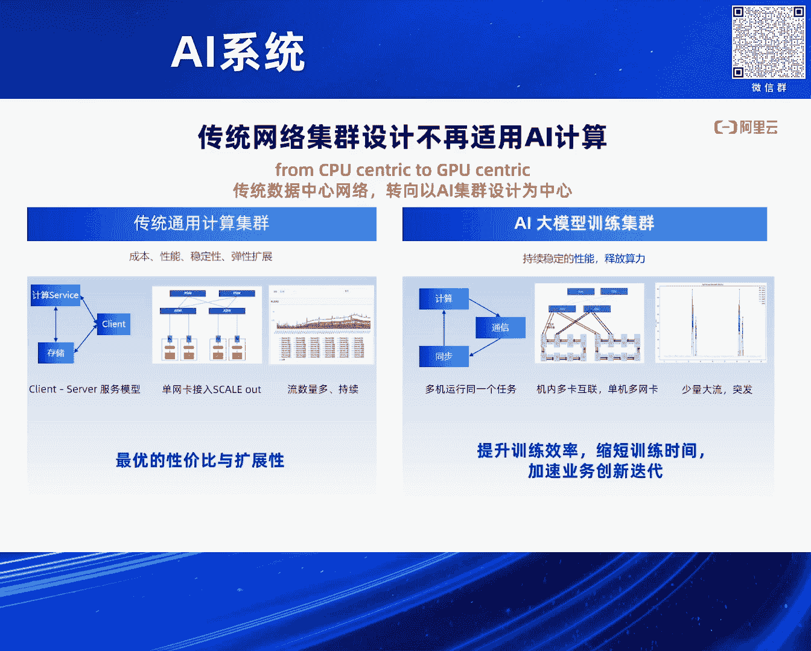
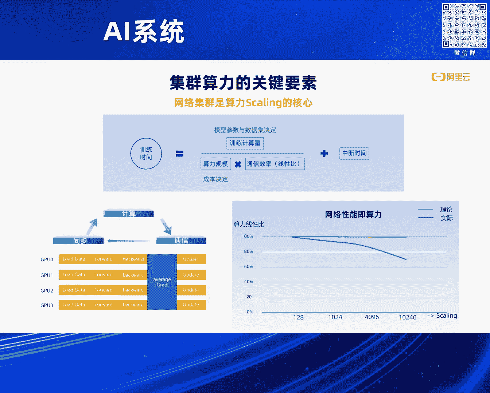
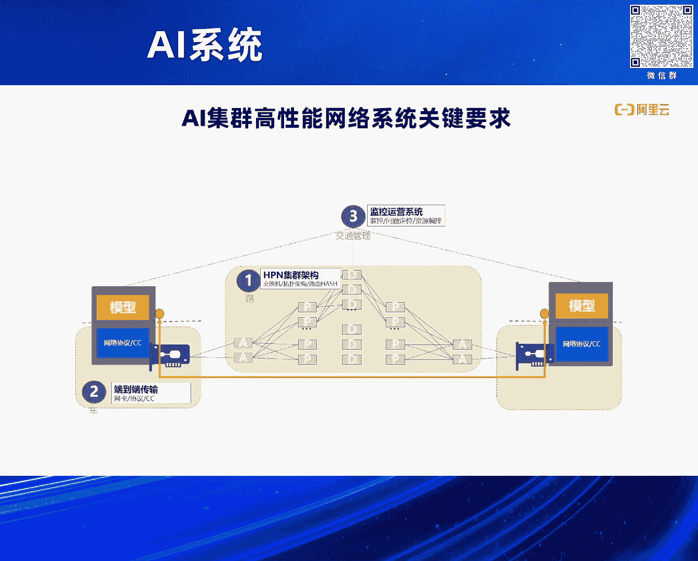
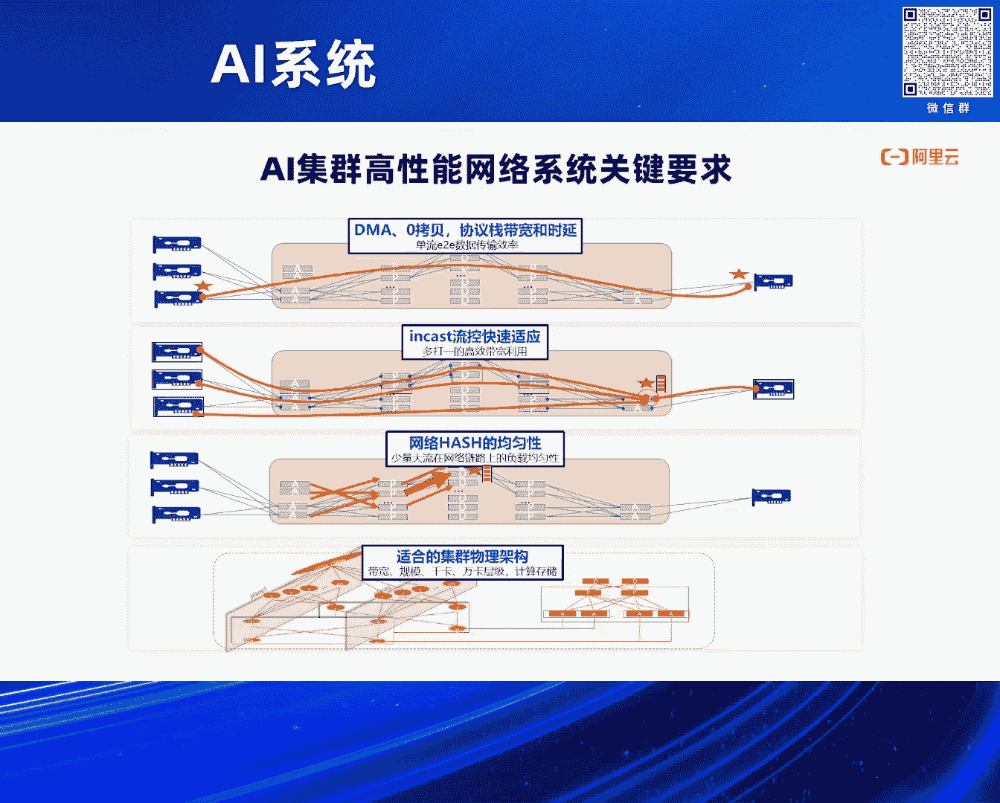
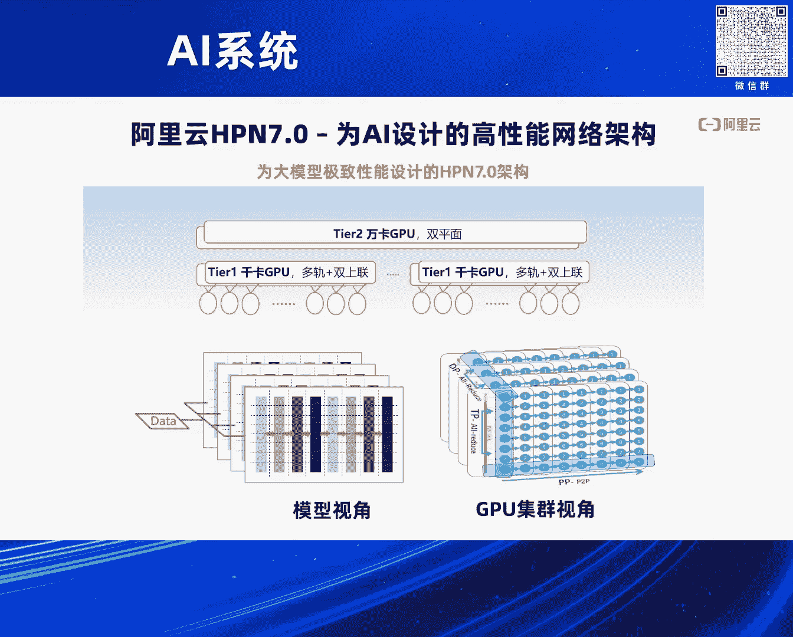
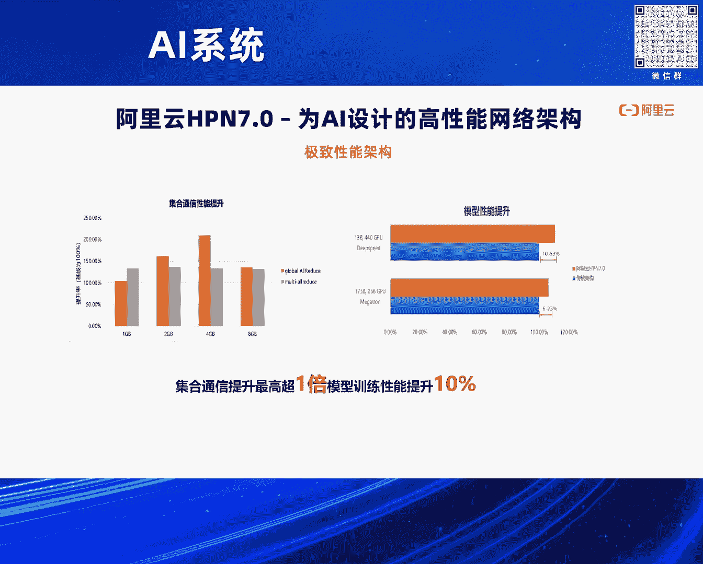
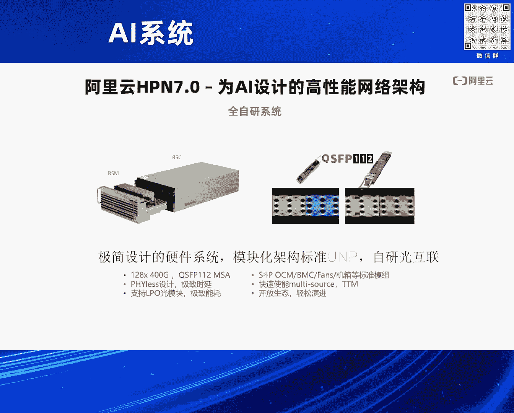
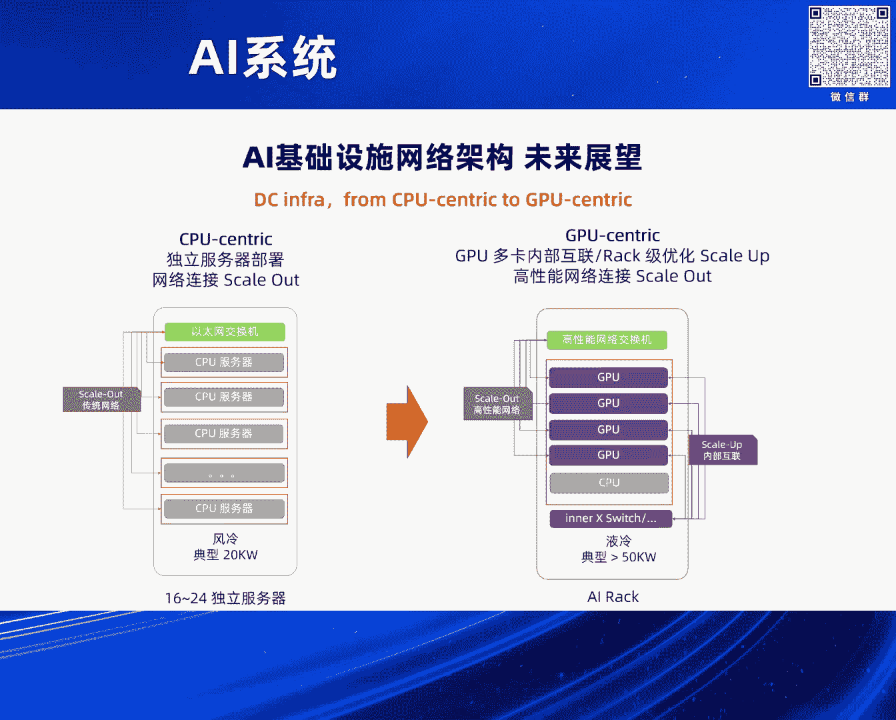
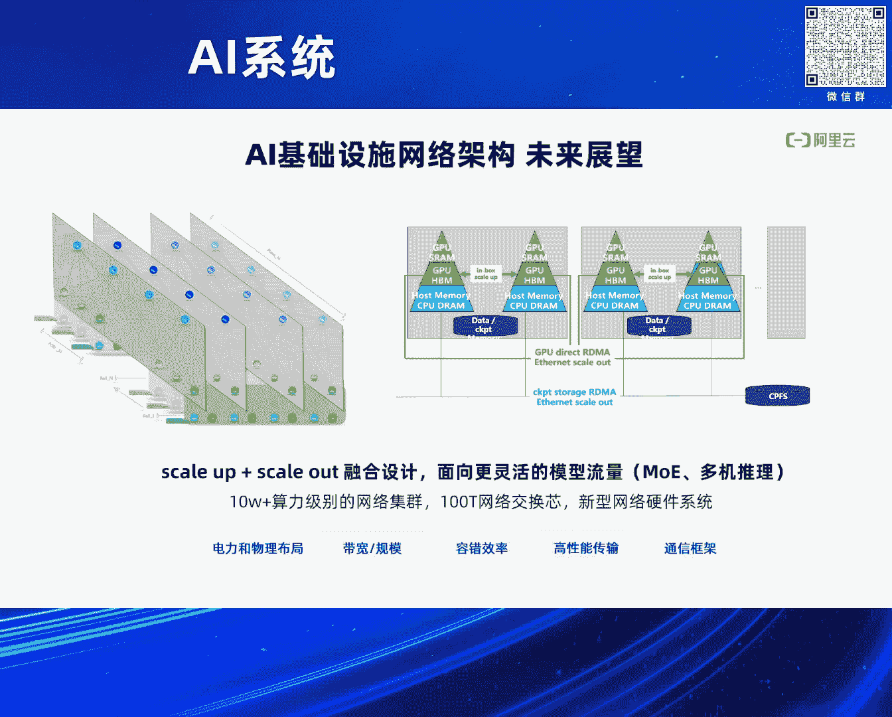

# 2024北京智源大会-AI系统---P10-网络驱动的大规模AI训练--阿里云可预期网络HPN7---智源社区---BV1DS411w7EG

## 概述
在本节课中，我们将学习大规模AI训练集群中网络的核心作用与挑战，并深入了解阿里云HPN7.0网络架构如何通过针对性设计，解决万卡乃至十万卡集群的互联问题，以保障算力的线性增长。

---

## 从CPU到GPU：数据中心网络的演进
上一节我们了解了课程的整体目标，本节中我们来看看数据中心网络是如何演进的。

整个数据中心已经从以CPU为中心的分布式系统，演进到以AI和GPU为中心的数据中心。这种演进对网络乃至整个数据中心基础设施（如制冷、供电、机房设计）都带来了颠覆性的挑战。

我们可以将数据中心网络的发展分为三个阶段：
*   **第一个十年（约2000年起）**：互联网初期，网络服务于客户端-服务器模式，规模较小。
*   **第二个十年（约2010年起）**：云计算兴起，出现了大数据和集群化存储系统。网络引入RDMA等技术来加速集群互联。
*   **当前阶段**：进入AI时代。训练任务需要上万张GPU卡协同完成，真正实现了“数据中心即计算机”的架构。这对网络提出了前所未有的新要求。

---

## AI训练对网络提出的新挑战
传统数据中心网络的设计已不适用于当前的大模型训练场景。这正是我们需要设计万卡级HPN7.0网络的原因。

以下是AI计算与传统计算在网络上三个关键差异：
1.  **任务协同性**：多台机器运行同一任务，存在“木桶效应”。任何一张卡或一个网络节点故障，都可能导致整个任务停止。
2.  **网络协同需求**：GPU卡内通过NVLink等高带宽互联，卡间通过以太网互联。这两级网络需要高效协同，才能充分发挥整体效率。
3.  **连接模式变化**：AI计算中，单卡发起的网络连接数量很少（通常在100以内），而传统CPU服务器可能发起数十万甚至百万级别的连接。这种连接熵的急剧降低，会导致网络哈希均衡出现问题，影响性能。

---

## 网络性能即集群算力
网络是决定集群算力上限（Skyline）的核心因素。

训练时间是AI竞争的关键。训练时间公式可以简化为：
`训练时间 = 计算量 / 算力 + 通信等待时间`
当算力规模（GPU数量）增大时，理论计算时间会缩短。然而，规模增大也意味着机器间同步的通信量急剧增加。网络通信的等待时间会随之变长，导致总体算力无法线性增长，出现性能下降。

因此，集群网络设计的核心目标就是：**在从几百卡扩展到一万卡的过程中，尽可能保持算力的线性增长**。这既能节约成本，更能节省宝贵的训练时间。可以说，**网络的性能即集群的算力**。

---

## 高性能网络系统的关键组成部分与挑战
构建一个高性能的AI网络系统，需要关注以下三个关键部分：
1.  **集群架构**：需要设计能够连接万卡、十万卡的物理网络拓扑。
2.  **高效协议**：需要像跑车引擎一样高效的端到端传输协议（如RDMA）和调度系统。
3.  **运维监控**：需要强大的性能剖析、优化和故障定位系统，确保大规模集群的稳定运行。

实现上述目标，主要面临四大挑战：
*   **集群网络架构**：需要设计能承载万卡/十万卡算力的合适拓扑，避免网络拥塞。
*   **流量均匀性**：解决多对一（Incast）等流量模式下的拥塞问题，实现全局最优的流量调度。
*   **高效传输**：通过零拷贝、DMA等技术，实现高带宽、低延迟的数据传输。
*   **可预期性能**：确保网络性能稳定、可预测，满足AI训练的要求。

---

## 阿里云HPN7.0的设计与解决方案
阿里云HPN7.0针对上述挑战，为AI集群设计了万卡及更大规模的网络系统。

HPN7.0的核心设计特点如下：
*   **规模与架构**：采用两层Clos Fabric结构，支持**1.6万卡**的集群规模。基于51.2T以太网交换机实现。
*   **高可用设计**：采用**双上联**和**双平面**设计，单链路或单节点故障对业务无感知，支持在线更换。
*   **无阻塞段**：通过多轨互联，在**千卡**范围内实现无阻塞网络，带宽达到理论极限。
*   **低延迟路径**：两层交换使网络跳数仅为**两跳**（传统三层架构为五跳），极大简化路径并降低延迟。
*   **自研技术**：搭载自研的Rocky v2 RDMA协议和HPC流控算法，优化传输细节。

通过拓扑与并行策略的协同映射、千卡无阻塞段、低跳数万卡互联、3.2T单机RDMA带宽以及自研通信库等技术的结合，HPN7.0实现了：
*   集合通信性能提升**一倍**。
*   在DeepSpeed框架下运行LLaMA 13B模型，端到端性能提升**10%**。

---

## 全栈自研：从硬件到系统的掌控
HPN7.0的成功得益于阿里在AI网络系统的全栈自研能力。

仅在网络通信层面自研不足以发挥极致性能。HPN7.0实现了全系统自研：
*   **网络设备自研**：自研了模块化硬件、128端口400G交换机等，掌握芯片和信号调优的主动权。
*   **光互联自研**：基于阿里专利，实现了400G光模块（QSFP112）的自研，保障了互联信号的稳定性和质量。

通过全栈自研，阿里将系统的稳定性、性能优化潜力掌控在自己手中，从而将集群网络能力发挥到极致。

---

## 未来展望：更大规模与更智能的网络
展望未来，AI基础设施将发生从硬件到系统的全面变革。

从以CPU为中心到以GPU为中心的转变，将驱动电力、机房、网络及GPU互联系统的全面升级。未来趋势包括：
1.  **AI机柜（AI Rack）**：出现集成64-72张GPU的高密度机柜，对散热、供电提出挑战。机柜内GPU间通过超大带宽（如3.2T）互联（Scale-Up）。
2.  **Scale-Up与Scale-Out融合**：关键挑战在于如何将机柜内的高带宽Scale-Up网络与机柜间通过以太网/IB互联的Scale-Out网络高效融合。需要将模型切分、训练流量模式与网络拓扑、RDMA、流控进行协同设计。
3.  **更灵活的流量模式**：未来可能出现MOE、All-to-All等新通信模式，以及多机推理中的KV Cache同步需求，网络需要提供新的带宽和能力。
4.  **更大规模集群**：网络需要面向**10万卡**乃至更大规模的集群，支持100T级交换网络和新型硬件。

业界已成立UEC（Ultra Ethernet Consortium）和UA Link（Ultra Accelerator Link）等联盟，旨在统一Scale-Out和Scale-Up网络的标准与技术。阿里作为UEC技术委员会成员，正积极参与其中，为未来更大规模的AI基础设施构建网络能力。

---

## 总结
本节课我们一起学习了大规模AI训练中网络的核心价值与挑战。我们了解到，网络性能直接决定了集群算力的上限。阿里云HPN7.0通过创新的两层Clos架构、千卡无阻塞设计、全栈自研硬件和协议，有效解决了万卡集群的互联问题，实现了算力的高效线性扩展。展望未来，Scale-Up与Scale-Out网络的融合、应对新流量模式、支持十万卡集群，将是AI网络系统持续演进的关键方向。