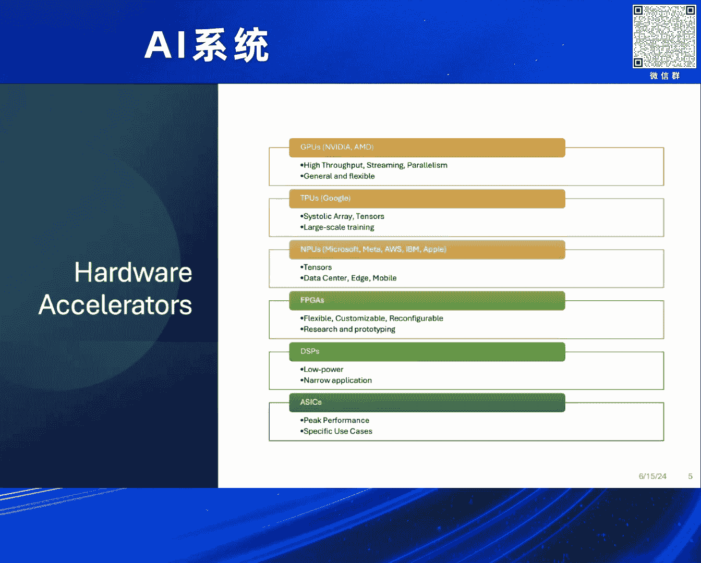
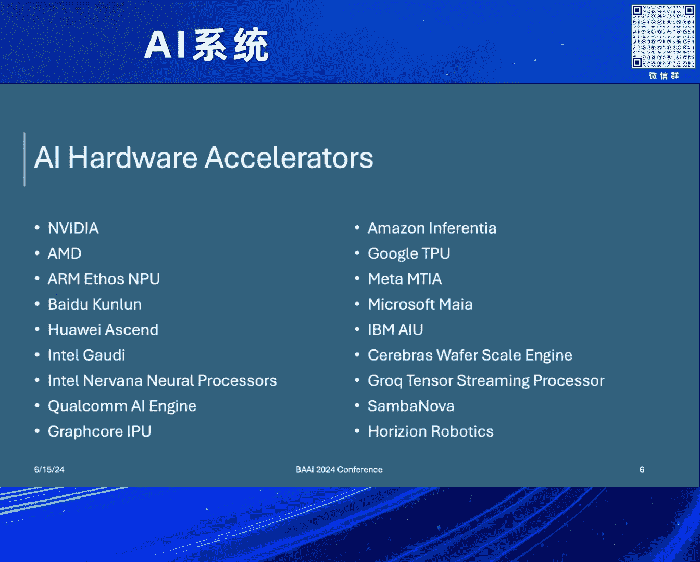
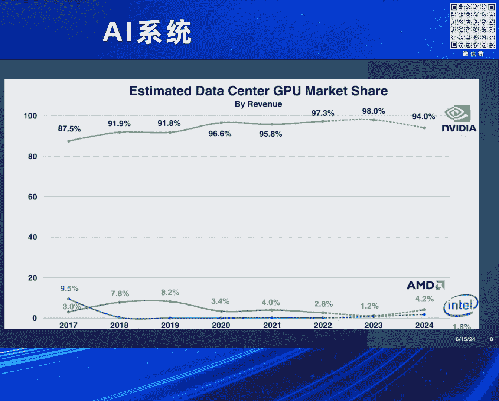
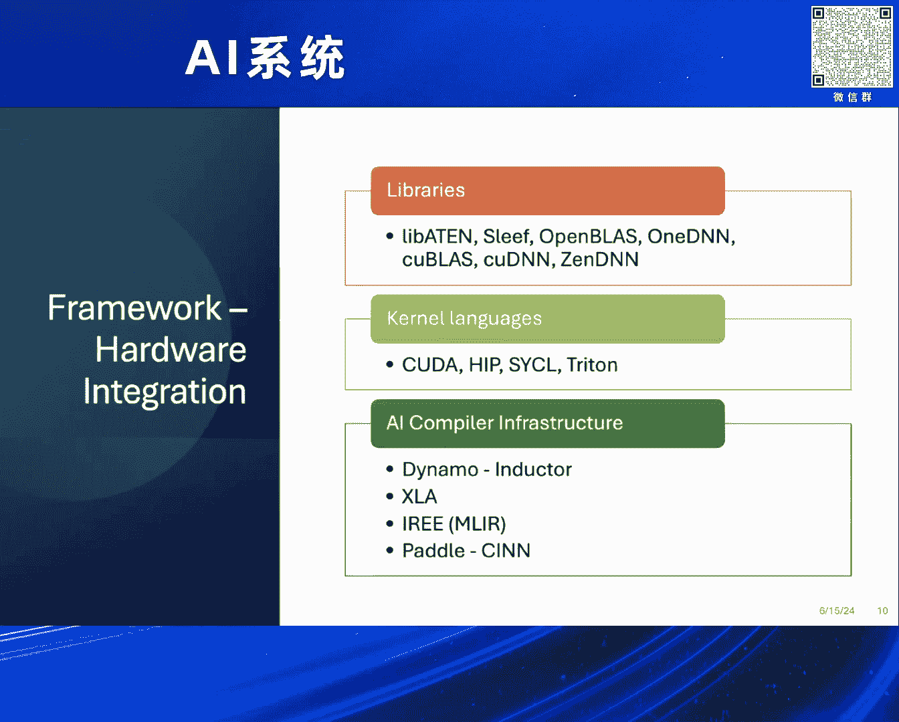
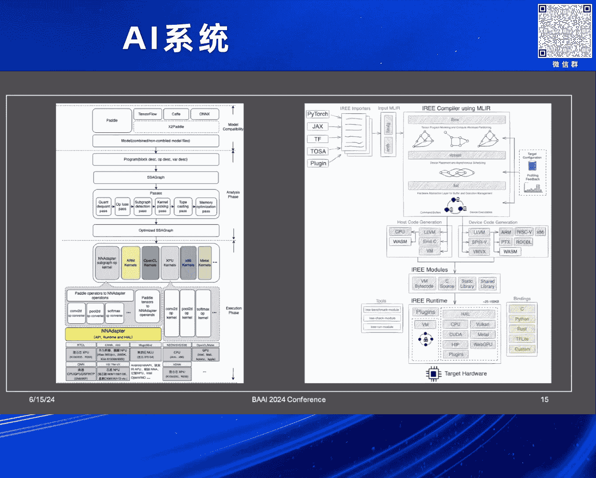
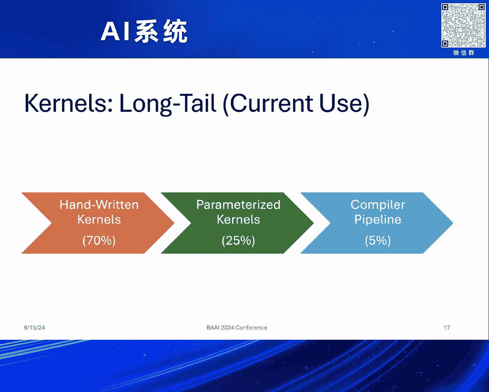
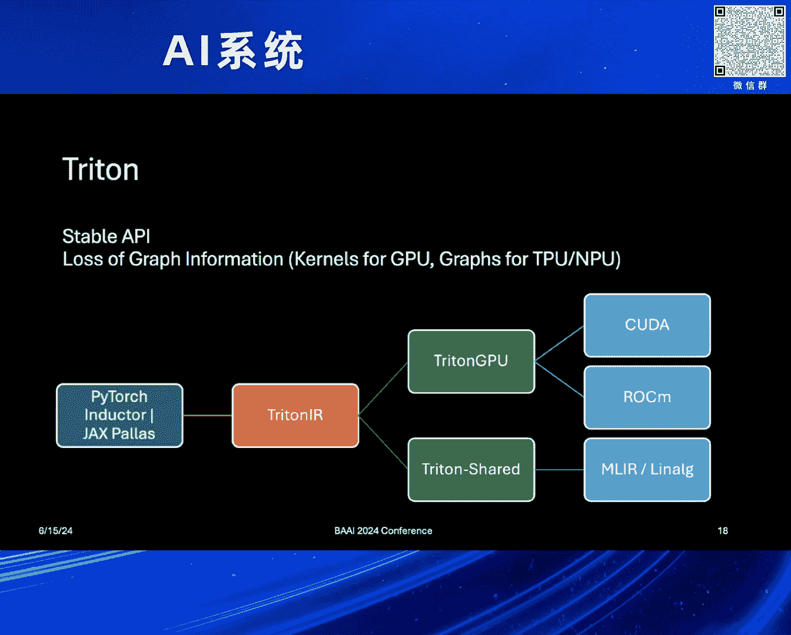
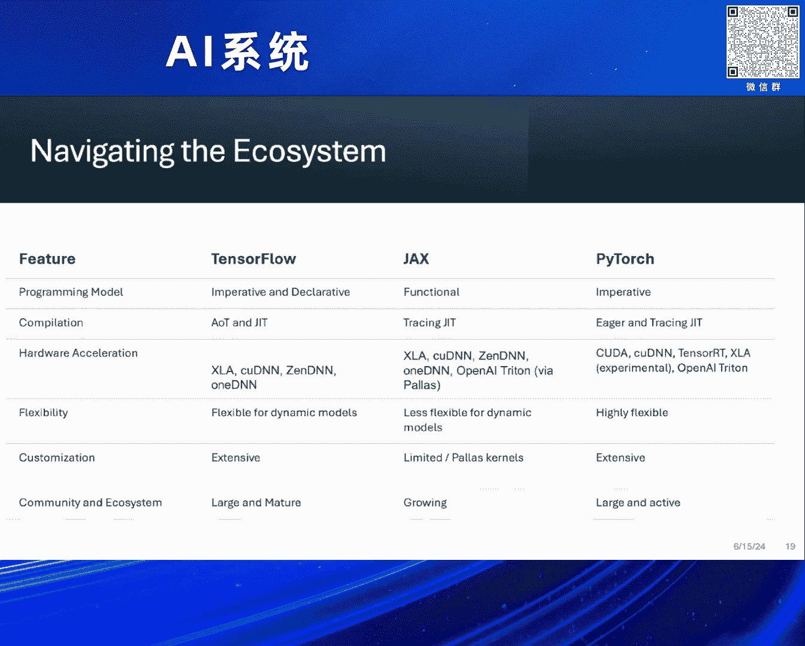
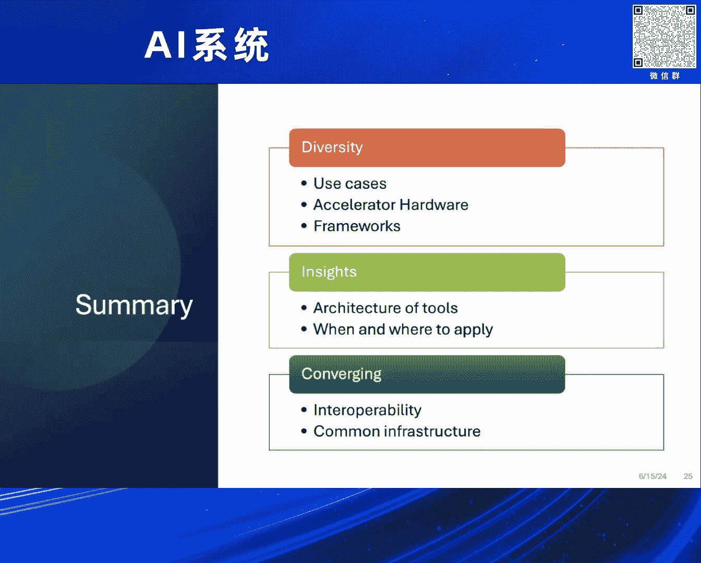

# 2024北京智源大会-AI系统---P2-Unlocking-Al-Potential-David-Edelsohn---智源社区---BV1DS411w7EG

## 概述

在本节课中，我们将要学习如何将AI模型与多样化的硬件加速器连接起来，并探讨构建一个高效、可互操作的软件生态系统所面临的挑战。我们将从硬件加速器的类型、主流AI框架、连接技术栈以及未来的发展方向等多个维度进行解析。

---

## 1. 动机与挑战

当前存在大量开源AI模型，它们需要在各种不同类型的硬件上运行。这些模型用途广泛，从生成式AI、自然语言处理、自动驾驶到欺诈检测和移动可穿戴设备，对计算能力、延迟、功耗和外形因素的要求各不相同。

**核心挑战**在于：如何将使用少数几种主流框架（如PyTorch, TensorFlow, JAX, PaddlePaddle）开发的模型，高效地部署到种类繁多、架构各异的硬件加速器上。

---

## 2. 硬件加速器概览

以下是主要的硬件加速器类型及其特点：

*   **GPU（图形处理器）**：如NVIDIA和AMD的产品。它们具有高吞吐量和强大的流式并行处理能力，非常适合计算密集型的AI模型训练和推理。
    *   **公式/代码**：`高性能 = 高并行度 + 高内存带宽`
*   **TPU（张量处理器）**：如谷歌的TPU，采用收缩阵列架构，对特定的张量运算极为高效，尤其擅长大规模训练。
*   **NPU（神经网络处理器）**：名称常用于移动设备或数据中心的专用AI芯片，例如苹果的神经网络引擎或华为的昇腾芯片。
*   **FPGA（现场可编程门阵列）**：具有高度灵活性和可重构性，在研究和原型设计阶段非常有效，便于探索特定计算模型。
*   **DSP（数字信号处理器）**：功耗极低，适用于对功耗和尺寸有严格限制的嵌入式设备，但用途较为专一。

硬件生态非常庞大，包括NVIDIA、AMD、百度、华为、昇腾等众多厂商，每种硬件都需要专门的代码和优化。

---

## 3. AI框架概览

不同的AI框架各有优势和适用场景：

*   **PyTorch**：以灵活性和易用性著称，便于快速构建和调试模型。
*   **TensorFlow**：历史悠久，生产环境部署稳健，生态系统成熟。
*   **JAX**：由Google开发，与XLA编译器紧密集成，擅长数值计算。
*   **PaddlePaddle**：百度开发，专注于从超大规模到移动端的全场景。
*   **ONNX（开放神经网络交换）**：并非框架，而是一种模型表示格式，能有效促进不同框架间模型的交换。

---

## 4. 连接框架与硬件的技术栈

上一节我们介绍了多样的框架和硬件，本节中我们来看看它们是如何连接起来的。这通常通过一系列软件层实现：

以下是连接技术栈的关键组成部分：

*   **计算库**：如PyTorch的`libtorch`、`oneDNN`等，提供基础算子实现。
*   **内核语言**：
    *   **CUDA/HIP**：NVIDIA/AMD的专用编程语言，用于编写底层GPU内核。
    *   **Triton**：一种基于Python的高级编程语言，能高效表达GPU内核，并正逐步支持更多硬件。
*   **手写优化内核**：针对特定硬件高度调优的代码，通常能获得最佳性能。
*   **AI编译器基础设施**：如PyTorch的**TorchDynamo/Inductor**、TensorFlow/JAX的**XLA**、PaddlePaddle的**PaddlePaddle**等。它们旨在将高级模型描述编译并优化为针对特定硬件的高效代码。

理想情况是，模型能像通过“魔法云”一样自动编译到任何硬件。但现实是，为了获得最佳性能，模型和编译器都需要针对目标硬件进行大量细致的调优。

---

## 5. 生态系统面临的挑战

连接框架与硬件的路径非常复杂，主要挑战包括：

*   **碎片化与复杂性**：框架、编译器、库、硬件组合爆炸，难以维护、调试和获得工具支持。
*   **互操作性不足**：不同框架和库之间的API交互存在障碍。虽然ONNX等工具提供了模型转换能力，但转换后的模型往往需要重新调优才能达到最佳性能。
*   **性能优化依赖手写代码**：根据行业对话，目前前沿部署中，约70%的关键路径内核仍依赖于手写代码，只有约5%完全依赖编译器自动优化。目标是将更多开发工作转移到高级语言和参数化内核上。

---

## 6. 新兴技术与未来方向

面对挑战，社区也在探索新的解决方案：

*   **Triton的作用扩展**：Triton不仅作为手写内核的高级语言，也正成为编译器（如PyTorch Inductor）的中间目标。项目如Triton-Shared正探索将其支持扩展到更多专用硬件。
*   **MLIR（多级中间表示）**：MLIR等编译器基础设施提供了创建可重用、可组合编译流程的机会，有望成为连接不同框架和硬件的公共基础层。
*   **未来计算范式**：量子计算、神经形态计算等新兴技术可能为处理高维数据、实现更高能效和容错性提供新的可能性。

未来的方向是**收敛与协作**：硬件供应商、框架开发者、库开发者和应用开发者需要共同努力，建立更统一的优化方法、更稳定的公共API和共享的基础设施，以开放合作的方式推动整个生态系统向前发展。

---

## 总结

本节课中我们一起学习了AI模型与硬件加速器连接的复杂图景。我们了解了：
1.  **多样化的硬件**（GPU、TPU、NPU等）和**主流AI框架**（PyTorch、TensorFlow等）构成了生态的两极。
2.  连接它们的技术栈包括**计算库**、**内核语言**和**AI编译器**，但路径复杂。
3.  当前生态系统面临**碎片化**、**互操作性差**和**过度依赖手写优化**等核心挑战。
4.  社区正通过**Triton**、**MLIR**等新兴技术和推动**开放协作**来寻求解决之道，旨在构建一个更高效、更统一的AI软件生态系统。

> **附加信息**：演讲者David Edelsohn提及了与联合国合作的“AI for Climate Innovation Grand Challenge”项目，旨在汇聚全球智慧，利用AI应对气候变化，并欢迎各界参与。