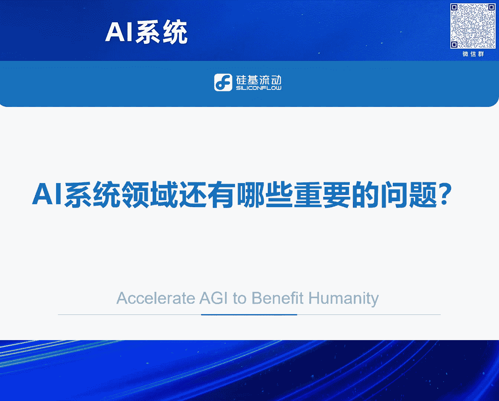
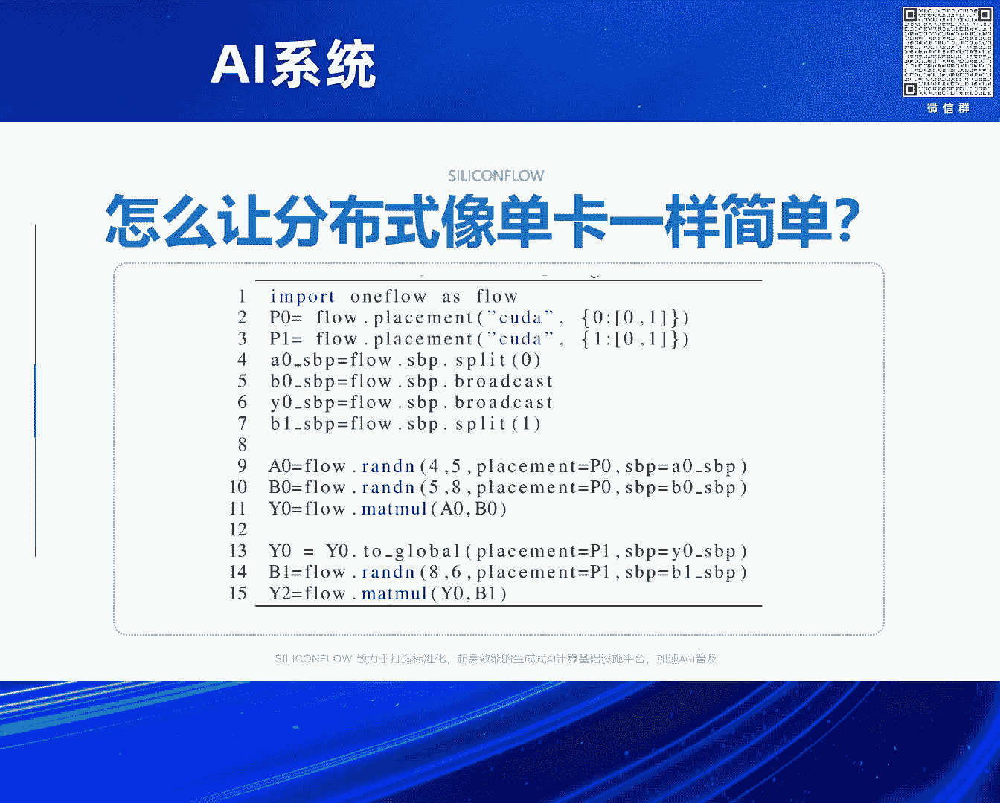
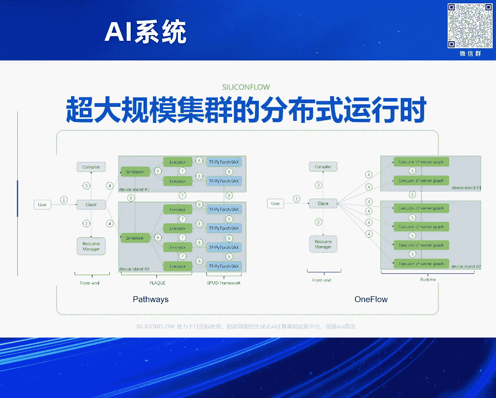
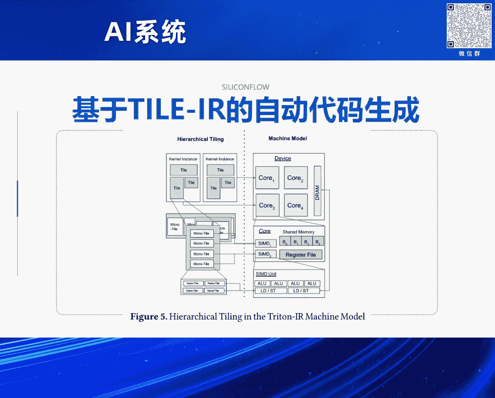
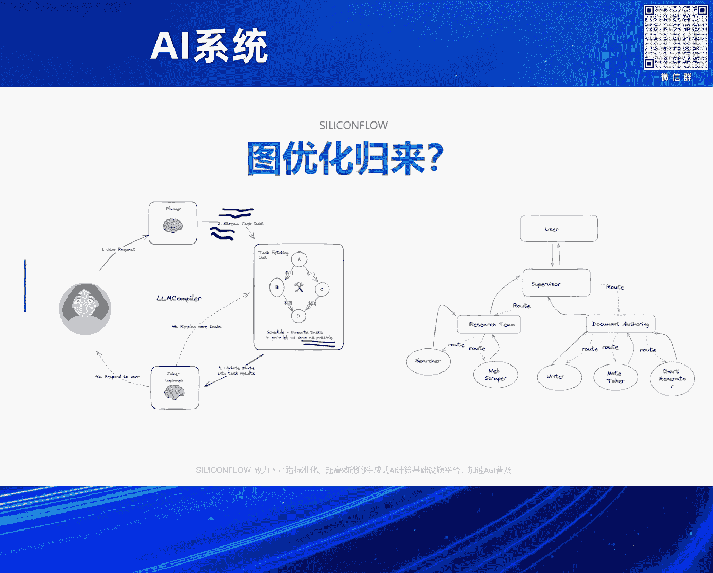
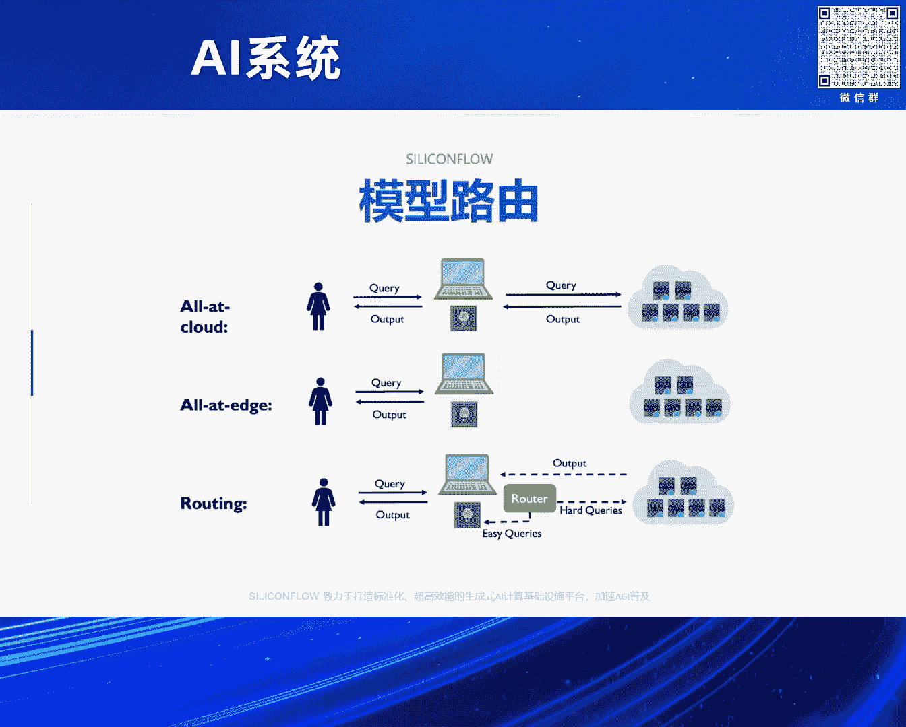
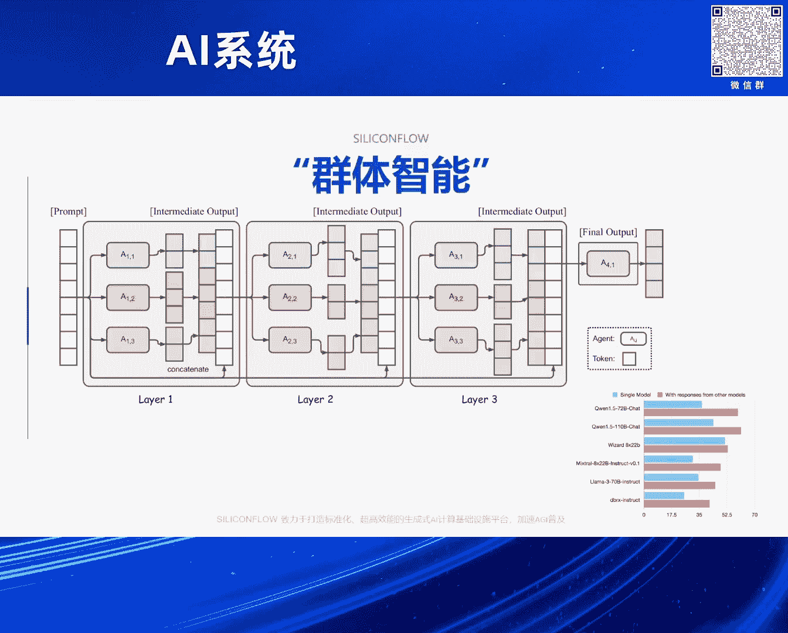
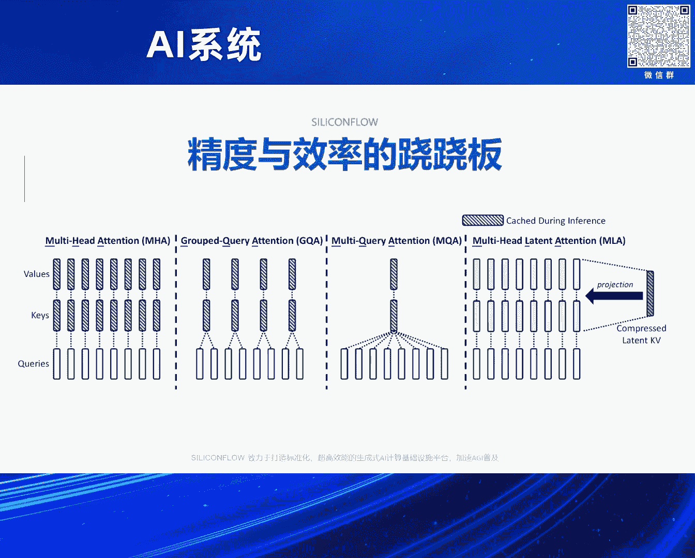
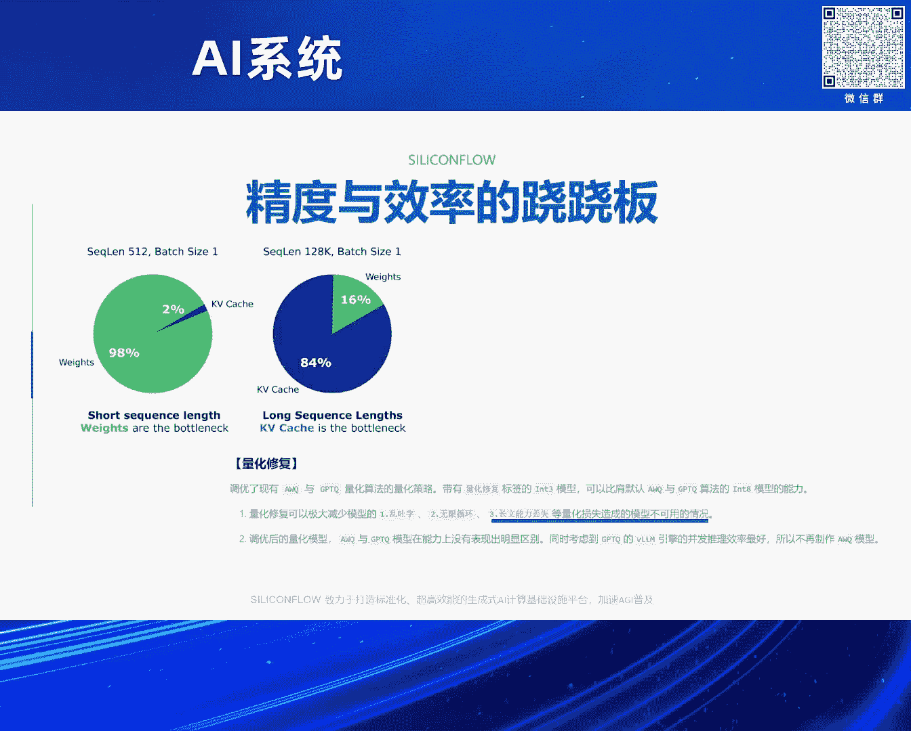
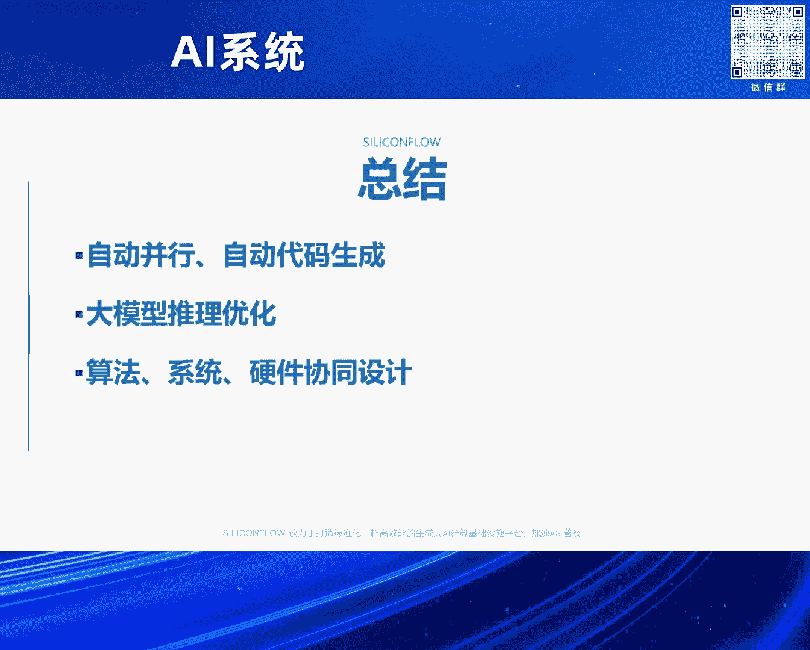

# 2024北京智源大会-AI系统---P3-Al系统领域还有哪些比较重要问题--袁进辉---智源社区---BV1DS411w7EG
## 课程编号：P3  

在本节课中，我们将探讨AI系统领域当前面临的重要问题。课程内容基于袁进辉在2024北京智源大会上的分享，涵盖从训练到推理的系统挑战，以及算法与系统协同的新趋势。  

---

## 概述  



AI系统领域在大模型兴起后，其重要性和研究方向发生了显著变化。本节课将回顾过去在训练系统方面的核心工作，分析当前推理系统的关键矛盾，并探讨算法与系统结合带来的新机遇。  

---

## 回顾：训练系统的核心工作  

上一节我们介绍了课程的整体背景，本节中我们来看看过去在AI训练系统方面的核心工作。  

在2016年至2023年期间，研究重点集中在训练系统上。当时，AI系统工作与算法和模型训练研究具有同等重要性。  

一个核心思路是使用编译器技术，将面向单卡编写的程序，通过多层重写转换为分布式执行的物理图。这涉及引入系统层面的表达，编译器或优化器在该表达上进行逐层转换。  

在OneFlow中，一个关键创新是**SBP（Split, Broadcast, Partial）规则**。该规则通过简单的张量映射，将逻辑视角转换为物理视角，从而表达各种并行模式。  

**公式示例**：  
```
逻辑张量 → SBP规则 → 物理张量
```



基于SBP，编译器可以通过简单的注解（annotation），将单卡程序自动转换为分布式执行代码。此外，自动并行化技术可以进一步优化这些注解，实现更高效的分布式执行。  

在运行时层面，Actor模型和消息传递机制被用于处理超大规模分布式场景。这种抽象方式在跨集群异步协作中表现出强大生命力，部分芯片公司（如Tenstorrent）也在硬件层面采用了类似思路。  

---

## 当前挑战：大模型时代的系统研究  

上一节我们回顾了训练系统的核心工作，本节中我们来看看大模型时代系统研究面临的新挑战。  

大模型（尤其是Transformer Decoder-only架构）的普及，使得许多自动并行和编译器优化技术似乎不再被广泛采用。例如，许多公司更倾向于使用手工优化的并行方案（如Megatron），而非自动并行框架。  

这种现象引发了一个问题：**纯系统研究的价值是否在下降？**  

然而，一些公司和研究机构（如Google的JAX、xAI）仍然青睐自动并行和编译器技术。这表明，在模型结构仍需探索的场景中，系统优化仍有重要需求。  



训练层面的另一个重大挑战是**超大规模可扩展性**（例如十万卡、百万卡集群）。这类研究需要大型计算装置，对多数研究者而言难以实现。  

---

## 转向推理：系统研究的新焦点  

上一节我们讨论了大模型时代系统研究的挑战，本节中我们来看看为何推理成为当前的研究焦点。  



推理研究受到关注的原因包括：  
1. 大规模训练集群难以获取。  
2. 推理在经济价值和应用需求上日益重要。  

推理的计算量约为训练的三分之一，但token生成量可能无限增长。例如，OpenAI每天处理的推理token量可达数万亿。  

当前芯片设计主要针对训练负载，导致在推理场景中存在资源错配。推理分为两个阶段：  
- **Prefill阶段**：类似训练，计算密集。  
- **Decoding阶段**：内存带宽瓶颈，尤其在batch size较小时。  

**Roofline模型分析**显示，当batch size较小时，推理受内存带宽限制；只有当batch size超过临界点后，计算单元才能被充分利用。  

---

## 算法与系统的协同优化  

上一节我们介绍了推理系统的核心矛盾，本节中我们来看看算法与系统协同优化的新趋势。  

在推理场景中，纯系统优化（如内核优化）的端到端贡献可能有限。因此，算法与系统协同优化成为提升效率的关键。  

以下是几个协同优化的例子：  

**投机采样（Speculative Sampling）**  
使用较小模型并行生成多个token，以提高解码阶段的并行度，从而更好地利用硬件资源。  

**Agent工作流优化**  
Agent任务通常涉及多个大模型调用，这些调用之间存在依赖关系，形成有向无环图（DAG）。通过图优化技术，可以消除不必要的调用，或并行执行多个调用。  



**模型路由（Model Routing）**  
将任务动态分配给不同规模的模型，例如将简单任务分配给小模型，复杂任务分配给大模型。这可以显著提升整体推理效率。  



**混合代理（Mixture of Agents）**  
通过多个较弱模型的协作，达到甚至超过单个强模型的效果。这需要系统层面的协同调度优化。  

**注意力机制优化**  
例如GQA（Grouped Query Attention）和MLA（Multi-Head Latent Attention），可以减少KV缓存占用，提升推理速度。但需注意，某些场景（如数理逻辑推理）可能需要完整的注意力机制以保证效果。  



**量化精度**  
量化可以减小KV缓存，但可能降低注意力计算的分辨率，影响长上下文处理效果。  

---



## 总结  



本节课中，我们一起学习了AI系统领域的重要问题与思考：  
1. 回顾了训练系统中的自动并行和编译器技术。  
2. 分析了大模型时代系统研究面临的新挑战。  
3. 探讨了推理系统中硬件与软件的矛盾。  
4. 介绍了算法与系统协同优化的新趋势。  



当前，AI系统研究正从纯系统优化转向与算法、硬件协同的创新模式。未来，如何在这些交叉领域找到高影响力的研究方向，仍是值得探索的问题。