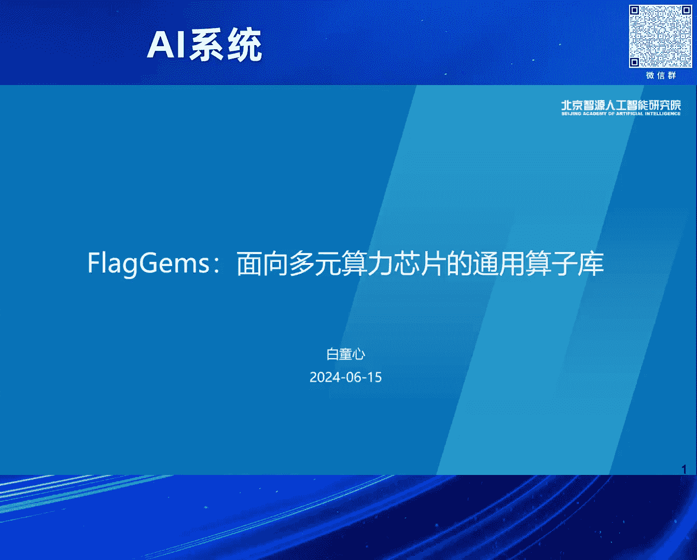
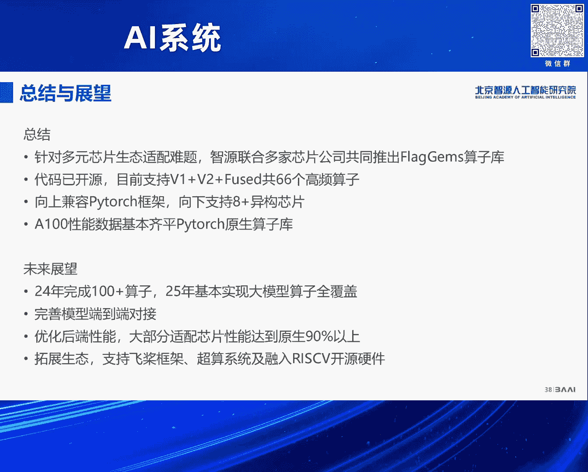

# 2024北京智源大会-AI系统---P4-FlagGems通用Triton算子库-白童心---智源社区---BV1DS411w7EG



## 概述

在本节课中，我们将学习由智源社区联合多家芯片公司共同研发的开源项目——FlagGems通用Triton算子库。我们将了解其诞生的背景、技术选型、核心优势、实现方法以及未来的发展规划。这个项目旨在解决AI领域，特别是大模型训练中，多元芯片生态适配与混合算力利用的难题。

---

## 多元芯片生态的挑战与机遇

上一节我们介绍了课程的整体背景，本节中我们来看看当前AI计算领域面临的核心挑战。

当前，除了英伟达的CUDA生态，市场上存在多种AI芯片架构。每家芯片厂商通常选择向CUDA生态对齐来构建自己的软件栈。然而，这种做法存在几个根本性问题：

1.  **编程接口限制**：CUDA的编程模型（SIMT）专为英伟达GPU架构设计。对于非SIMT架构（如SIMD、TPU等）的加速器，适配起来非常困难，甚至存在本质性障碍。
2.  **适配负担过重**：CUDA体系庞大而复杂。针对大模型AI领域所需的算子集合，全面适配CUDA既不具备充分性（用不上全部功能），也不具备必要性（投入产出比低），开发难度和成本极高。
3.  **生态割裂**：每家厂商独立构建生态，导致软件生态碎片化，无法实现不同芯片间算力的有效融合与统一调度。

因此，要解决多元算力混合使用的问题，必须在CUDA生态之外，寻找一种更轻量、更通用的统一编程方案。

---

## 为什么选择Triton？🚀

上一节我们分析了生态适配的难题，本节中我们来看看FlagGems选择Triton作为基础技术栈的原因。

Triton作为一种新兴的异构计算编程语言，在构建通用算子库方面展现出四大核心优势：

1.  **更优的编程模型**：Triton采用基于`Tile`或`Block`的编程范式。开发者只需关注数据块的并行划分，而如何将计算映射到具体的SIMT或SIMD硬件架构上，则由编译器后端完成。这使其能灵活适配多种硬件架构。
    *   **公式/代码示例**：在Triton中，一个简单的向量加法内核可能这样开始：
        ```python
        @triton.jit
        def add_kernel(x_ptr, y_ptr, output_ptr, n_elements, BLOCK_SIZE: tl.constexpr):
            pid = tl.program_id(axis=0)
            block_start = pid * BLOCK_SIZE
            offsets = block_start + tl.arange(0, BLOCK_SIZE)
            mask = offsets < n_elements
            x = tl.load(x_ptr + offsets, mask=mask)
            y = tl.load(y_ptr + offsets, mask=mask)
            output = x + y
            tl.store(output_ptr + offsets, output, mask=mask)
        ```
2.  **独特的开源与开发优势**：Triton专注于为AI领域，特别是自定义算子开发，提供了高质量、易用的编程接口。相比一些大而全的AI编译器（如基于MLIR的方案），Triton在自定义算子开发上更直接、高效。
3.  **经过验证的卓越性能**：实测表明，手动编写的Triton算子在性能上可与高度优化的CUDA内核媲美，甚至在某些情况下更具优势。
    *   **图示说明**：在矩阵乘（GEMM）和Flash Attention等关键算子上，Triton实现能达到与CUDA版本持平的性能。在LayerNorm等算子优化上，手动Triton实现也展现出显著优势。
4.  **日益增长的生态支持**：越来越多的国产芯片厂商已经开始适配Triton，将其作为接入PyTorch生态的重要途径。部分大模型在国产芯片上使用Triton算子的替换率已超过90%，证明了其可行性和覆盖率。

综合来看，Triton在编程灵活性、开发效率、性能表现和生态趋势上提供了一个非常均衡且领先的解决方案。

---

## FlagGems的设计目标与架构

上一节我们确立了Triton的技术优势，本节中我们具体探讨如何利用它来构建FlagGems算子库。

传统的算子库开发主要有两种模式：一是各厂商为自家芯片独立开发封闭的算子库；二是定义统一接口，各厂商分别实现。前者导致生态割裂，后者在混合算力场景下可能因实现不一致引发问题。

FlagGems提出了第三种路径：**基于Triton构建一个开源、共享的通用算子库**。其核心设计目标如下：

*   **通用性**：提供统一的编程接口，与PyTorch等主流框架对齐。
*   **共享与开源共建**：建立统一仓库，吸引多方共同开发，减少重复投入，保证算子实现的一致性。
*   **全覆盖**：支持大部分训练任务所需的全量算子，特别是大模型中的高频算子。
*   **高性能**：算子性能需达到可用于训练的水平，与原生算子库性能相当。
*   **多后端支持**：同一个Triton算子源码，应能编译并运行在多种不同的芯片后端上。

在技术实现上，FlagGems选择了**即时编译（JIT）** 路线，而非预编译（AOT）。即通过Triton的标准接口在运行时动态生成内核。虽然这会引入一定的运行时开销，但带来了更好的框架兼容性和灵活性，且该开销可通过优化技术显著降低。

---

## FlagGems的核心特性与易用性

上一节我们介绍了FlagGems的顶层设计，本节中我们来看看它如何让开发者用起来更简单。

FlagGems致力于提供极致的易用性，其核心特性体现在以下三个方面：

**1. 自动、透明地接入PyTorch**
FlagGems利用PyTorch的库扩展API（`torch.library`），在运行时动态替换PyTorch原生算子的实现。用户无需修改模型代码，也无需重新编译PyTorch。

以下是两种使用方式：

*   **全局替换**：在代码开头添加两行即可替换所有支持的算子。
    ```python
    import flag_gems
    flag_gems.enable()
    ```
*   **局部替换**：通过上下文管理器，只在特定代码块内启用FlagGems算子，便于测试和验证。
    ```python
    with flag_gems.use_gems():
        # 此代码块内的算子将被FlagGems替换
        output = model(input)
    ```

**2. 不依赖Torch Compile，追求低延迟**
FlagGems不强制要求使用`torch.compile`，这意味着它对算子本身的端到端延迟要求更高，无论算子大小都必须足够快。团队对Triton的运行时进行了深度优化，显著降低了小算子的CPU开销，使性能曲线与PyTorch原生算子（eager模式）基本持平。

**3. 基于真实模型Profile进行开发**
FlagGems的算子开发并非凭空想象，而是通过剖析主流大模型（如LLaMA、GPT等）的训练过程，提取其中出现频率最高（bottleneck）的算子集合进行优先开发和优化，确保投入产出比最大化。

---

## 开发工具与当前成果

上一节我们了解了如何使用FlagGems，本节中我们看看团队是如何高效开发这些算子的。

开发一个覆盖全面的算子库面临巨大工作量，特别是对于Pointwise等数量繁多、形状多变的算子。FlagGems为此开发了**自动代码生成工具**。

该工具能够：
*   自动处理不同输入形状。
*   处理非连续的内存排布（Non-contiguous layout）。
*   支持标量与张量的混合输入。
*   方便地定义算子融合（Fusion）。

例如，只需像写Python lambda表达式一样定义计算逻辑，工具就能将其扩展为一个完整的、优化的Pointwise算子内核。

**当前成果概览：**
截至分享时，FlagGems已实现**66个基础算子**和**6个融合算子**，涵盖以下类别：
*   线性代数类（如GEMM）
*   神经网络类（如激活函数）
*   基础数学与逻辑运算类
*   融合算子类

性能方面，大部分算子与CUDA实现性能持平，部分算子有优势，少数算子仍需持续优化。团队已在FlagScale等训练框架中进行了替换验证，在训练至5000步时，损失曲线与原生算子训练基本吻合，证明了其正确性与可行性。

---

## 开源、生态与合作展望

上一节我们展示了FlagGems的现有成果，本节中我们来看看它的开源状态和未来计划。

FlagGems项目已在GitHub上开源，由智源、中科嘉禾、硅基等团队共同维护。目前，除了支持英伟达GPU外，已适配并支持国内多家芯片公司的产品。

**未来规划：**
1.  **算子覆盖**：2024年底前，实现100个以上高频算子；2025年，基本实现大模型训练算子的全覆盖。
2.  **性能优化**：持续优化后端编译器，使在大部分适配芯片上的性能达到原生性能的90%以上。
3.  **生态拓展**：
    *   支持PyTorch之外的框架，如飞桨（PaddlePaddle）。
    *   探索融入RISC-V开源生态体系。
    *   探讨在超算平台上的落地应用。

---

## 总结

本节课中，我们一起学习了FlagGems通用Triton算子库。我们从当前AI多元算力生态的挑战出发，深入探讨了选择Triton作为解决方案的原因，了解了FlagGems的设计目标、核心特性以及极致的易用性设计。我们还看到了团队通过自动代码生成工具提升开发效率，并展示了项目当前的开源成果和未来的发展蓝图。



FlagGems的核心价值在于，它试图通过一个开源、共享、基于现代编程语言（Triton）的算子库，降低多元芯片的软件生态适配成本，推动不同算力的融合与高效利用，为AI计算的基础设施建设提供了一种新的、可行的思路。