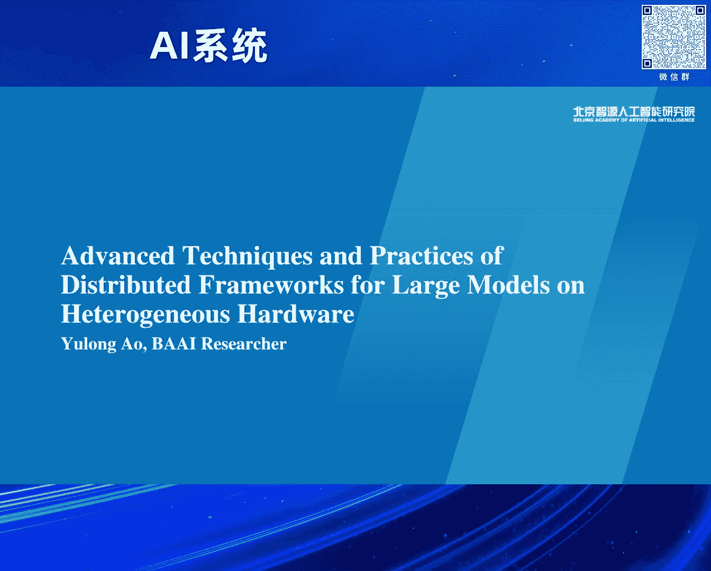
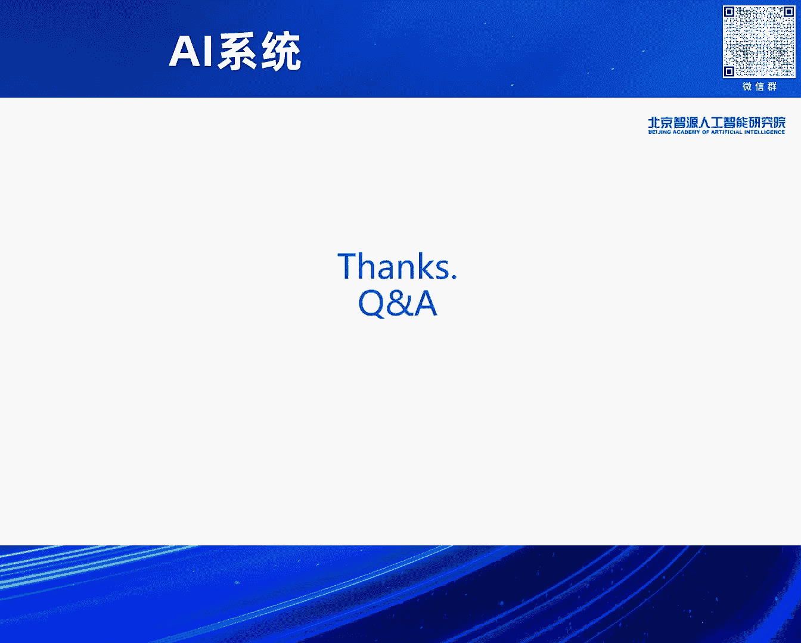

# 2024北京智源大会-AI系统---P6-多元算力下大模型并行训练框架技术与实践-敖玉龙---智源社区---BV1DS411w7EG

## 概述

在本节课中，我们将学习在多元算力时代下，如何应对大模型并行训练所面临的各种挑战。课程内容将涵盖异构混合训练、新芯片端到端训练、长序列训练以及芯片迁移等核心场景，并介绍智源团队提出的系统性解决方案与开源框架FlagScale。

---

## 1. 多元算力时代的挑战与需求

我们已身处多元算力的时代。面对不同的芯片，用户会产生多样化的需求。

以下是几种典型的需求场景：
*   在两款不同的芯片上进行高效的异构混合训练。
*   在一款新的芯片上实现高效的端到端训练。
*   支持任意长度的序列训练。
*   由于业务或政策原因，将训练任务从一款芯片迁移到另一款芯片。

作为模型训练者和系统研究者，智源团队同样面临这些需求和挑战。

---

## 2. 高效异构混合训练

上一节我们介绍了多元算力时代的背景，本节中我们来看看如何实现高效的异构混合训练。异构混合训练面临诸多挑战。

以下是四个主要挑战：
1.  **性能瓶颈**：不同芯片的算力与优化水平不同，整体性能易被最慢的芯片拖累。
2.  **通信障碍**：不同芯片间的连接拓扑和方式各异，且商业原因导致芯片间信息互通困难。
3.  **任务调度**：现有调度系统多针对同构芯片，用户需自行配置以使用异构集群。
4.  **模型效果**：不同芯片的架构和算子实现存在差异，可能影响最终模型效果。

通过系统化的设计，这些挑战是可以被解决的。针对上述挑战，我们逐一来看解决方案。

以下是针对挑战的解决方案：
*   **性能瓶颈**：在框架层面进行更细粒度的任务负载划分，让每款芯片物尽其用。
*   **通信障碍**：在并行策略层面，将通信限制在节点之间，利用IB、RoCE等标准协议。
*   **任务调度**：从“以芯片为中心”转向“算力透明”的调度模式，用户按算力付费，提升系统利用率。
*   **模型效果**：如果异构训练效果不达预期，问题可能出在芯片本身。异构训练可作为检验芯片质量的手段。

基于神经网络分层特性，解决方案的核心思路是：根据芯片的算力和内存约束，将模型的不同层或部分计算任务分配给不同的芯片，跨集群的通信主要发生在节点之间。

### 2.1 异构并行策略的演进

解决了基础问题后，下一步是追求更高的性能。我们与天数智芯合作，将异构并行策略迭代了三代。

以下是三代策略的演进过程：
1.  **第一代：Eager数据并行**：根据芯片算力分配不同大小的数据批次。问题在于负载切分粒度粗，且需要跨芯片进行All-Reduce通信，效率较低。
2.  **第二代：按算力切分层**：根据芯片算力分配不同数量的模型层进行计算。好处是切分更细，且通信变为点对点（P2P），难度降低。但要求模型并行维度一致，限制了灵活性。
3.  **第三代：灵活的TP异构**：不要求模型并行维度一致，允许维度变化。这进一步释放了调优空间，性能可在此基础上再提升约30%。

### 2.2 性能与效果验证

性能方面，在不同规模、配比、代际乃至跨架构的混合训练中，异构训练都能达到很高水平，部分场景性能甚至超过100%。这是因为合并集群后解锁了更大的优化空间，例如可以使用更大的批次（batch size）或关闭重计算。

模型效果方面，在真实数据集（FlagEval平台）上的评测显示，从相同检查点（checkpoint）开始，在异构集群上持续训练后，效果差异（diff）非常小。虽然无法完全规避差异（源于检查点来源和参数重切分导致的随机状态变化），但总体结果令人满意。

---

## 3. 新芯片上的端到端高效训练

在项目周期紧急的情况下，从算法、框架到硬件的协同设计是实现新芯片端到端高效训练的有效方法。

以下是协同设计的具体实践：
*   **算法层面**：采用两阶段训练法。例如，从已有7B模型扩展至16B，训练后再扩展为千亿参数的MOE模型。在通信方面实现了4倍加速。
*   **框架层面**：与沐曦合作，重点解决长周期训练的稳定性问题。
    *   **节点级容错**：当单个节点故障时，仅替换该节点并原地重启训练，而非终止整个任务，极大缩短了恢复时间。
    *   **异步检查点保存**：使用独立进程在后台异步执行数据从GPU到CPU再到落盘的操作，避免了训练进程的等待。相比同步保存，落盘速度提升约300倍，训练吞吐提升约3倍。
*   **硬件与性能**：沐曦提供了与CUDA高度兼容的产品和千卡集群，使FlagScale框架能快速适配。在深度优化后，实现了优异的性能提升。

训练损失（train loss）曲线符合预期。扩展性测试显示，在相同配置下，沐曦集群能维持90%以上的扩展效率，甚至优于部分英伟达集群。这提示我们，在大规模万卡乃至十万卡训练时代，单芯片性能固然重要，但高效的芯片间互联更为关键。

---

## 4. 支持任意长度的长序列训练

算法团队通常希望在任何芯片上都能进行任意序列长度的训练，这在多模态场景下需求尤为迫切。长序列带来了巨大的内存压力。

Transformer结构的内存复杂度主要来自两方面：
1.  **序列长度的平方复杂度**：`O(S^2)`，源于注意力（Attention）计算。
2.  **序列长度与隐藏层的线性复杂度**：`O(S*H)`，源于激活值存储。

例如，当序列长度（S）为256K，隐藏层大小（H）为1024时，即使使用BF16精度，单个张量所需内存也远超单芯片容量。

### 4.1 解决方案：结合现有系统优化技术

解决长序列训练需要结合多种系统优化技术。

以下是两种关键技术：
*   **Flash Attention**：通过分块计算，将注意力计算的内存复杂度从`O(S^2)`降低到块级别`O(block_size^2)`，可支持到百K（100,000）量级的序列长度。
*   **Ring Attention**：在分块基础上，结合分布式技术。每个设备只处理一个KV块，在计算过程中，通过环状（Ring）通信，从上一个设备获取所需的K/V，并将自己的K/V传递给下一个设备，实现计算与通信的重叠，可支持兆（1,000,000）级以上序列长度。

初步性能结果显示，随着序列长度从4K增长到1M，训练时间虽在增加，但并非线性增长。性能剖析（breakdown）表明，计算仍是主要开销，而通信通过计算-通信重叠得到了很好的隐藏，这说明分布式方法是有效的。

---

## 5. 平滑的芯片迁移

从一个芯片迁移到另一个新芯片，传统做法需要考虑框架、平台的变化，带来较高的开发和学习成本，且并行与优化策略依赖专家经验。

智源提出的解决方案旨在降低迁移门槛：
*   **平台与框架**：支持多种芯片，用户无需修改代码或学习新框架。
*   **并行与优化**：通过自动调优工具，帮助用户自动选择高效的并行和优化策略。

### 5.1 自动调优系统架构

该系统的工作流程如下：
1.  输入模型信息和集群信息，构建搜索空间。
2.  基于搜索空间进行剪枝优化，筛选出较优的候选策略集。
3.  生成可执行配置，送入评估器（Estimator）。
4.  评估器通过实际性能剖析（Profiling）或调用硬件厂商提供的成本模型（Cost Model）来评估性能。
5.  评估结果被记录，并通过在线反馈（Online Feedback）机制实时优化搜索过程，形成一个闭环，快速找到最优配置。

在九鼎平台上线的案例显示，随着调优系统运行，任务性能逐步提升。在A800、天数智芯BI150、沐曦C500等芯片上的实验表明，该自动调优方法在不同模型规模和硬件上均能取得良好加速比，最高可达23%的性能提升。通过基于历史和内存模型的剪枝算法，能将搜索空间压缩84%以上，提升用户体验。

---

## 6. 开源框架：FlagScale 🛠️

综合以上技术与实践，智源开源了FlagScale训练框架。经过与合作伙伴的协作，其最新架构核心分为前端和后端。

以下是FlagScale架构的核心特点：
*   **前端**：提供统一接口，集成自动调优、性能预估、自动容错等功能，便于实验管理和与平台工作流集成。
*   **后端**：支持多种执行后端（如Megatron、DeepSpeed及自研的FlagScale内核）和底层算子库（如智源的FlagGems、FlashAttention及厂商引擎），实现解耦。

该框架已适配八个厂商的芯片，在智源内外完成了十次完整的预训练。新版本将开源上述所有功能，并增强CI/CD能力。它百分之百兼容现有开源库，并增加了异构训练、长序列训练等自定义组件，旨在实现无缝的芯片迁移。

---

## 总结与展望

本节课我们一起学习了多元算力下大模型训练的四大核心场景及其解决方案。

以下是本节课的核心内容总结：
1.  **异构混合训练**：通过细粒度负载划分、标准化通信和灵活并行策略，可实现高效训练。
2.  **新芯片端到端训练**：算法-框架-硬件协同设计与稳定性优化是关键。
3.  **长序列训练**：结合Flash Attention、Ring Attention等分布式优化技术可突破内存限制。
4.  **芯片迁移**：统一的框架接口与自动调优系统能大幅降低迁移成本。
5.  **开源框架FlagScale**：提供了实现上述能力的统一平台。

多元算力已成为趋势，为系统领域带来更多机遇。异构训练、新芯片训练已通过系统方法变得实用，自动化是多元算力时代的关键。未来工作将聚焦于构建统一通信库、实现端到端异构训练，并在长序列、MOE等架构下进行更多并行与优化创新。我们期待与更多伙伴共建FlagScale社区。